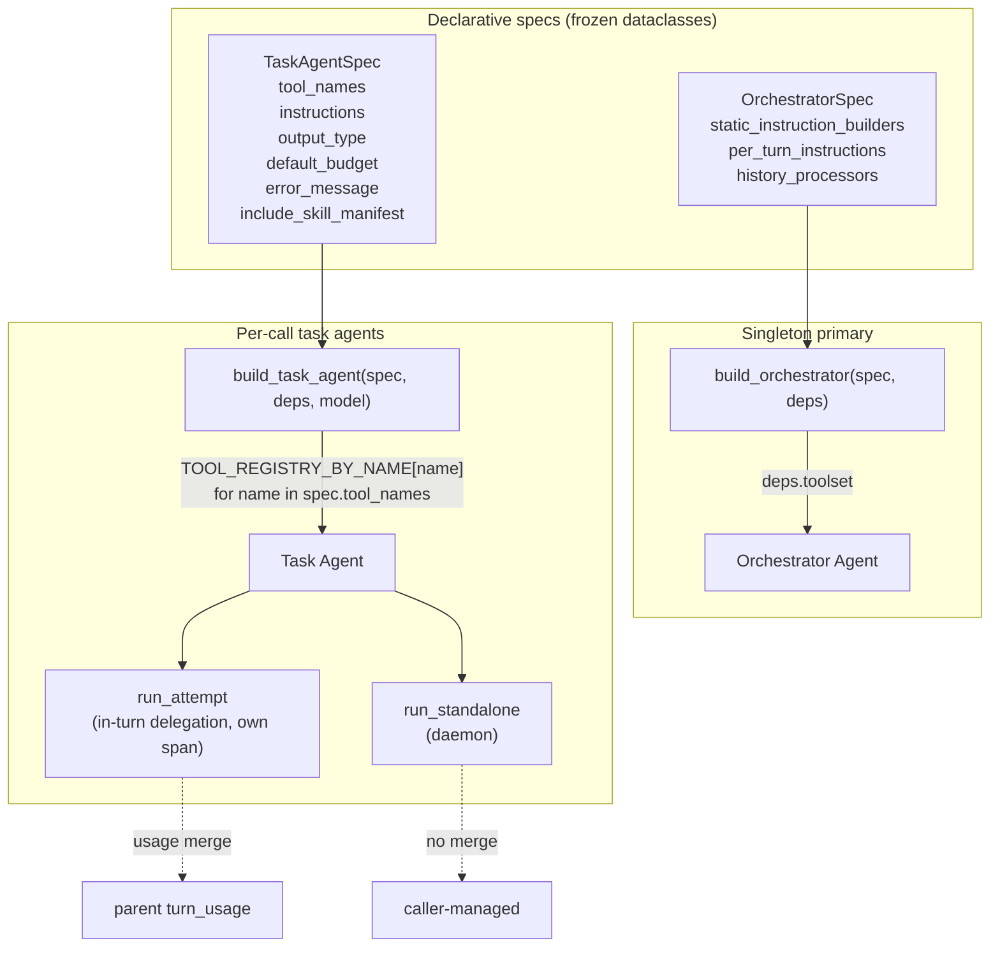

# Co CLI — Agents

> For tool registration, approval flow, and lifecycle hooks: [tools.md](tools.md). For the orchestration loop and segment/turn semantics: [core-loop.md](core-loop.md). For orchestrator static-instruction composition: [prompt-assembly.md](prompt-assembly.md). For daemon callers and curation hooks: [skills.md](skills.md). For span record shape and the `ObservabilityCapability`: [observability.md](observability.md).

## 1. Functional Architecture



### Spec types

| Type | Role | Lifecycle | Tools field | Key fields |
|------|------|-----------|-------------|------------|
| `OrchestratorSpec` | Always-present primary agent | Built once per chat session | None (`deps.toolset` injected directly) | `static_instruction_builders`, `per_turn_instructions`, `history_processors` |
| `TaskAgentSpec` | Focused task agent (delegation or daemon) | Built per call | `tool_names: tuple[str, ...]` | `instructions`, `output_type`, `default_budget`, `error_message`, `include_skill_manifest` |

No shared base. The two specs do not feed a polymorphic dispatcher — inheritance would be decorative. Runner choice (the daemon `run_standalone` vs a tool wrapper driving `run_attempt` in its own span) selects lifecycle, not spec shape.

### Concrete specs

| Spec | Owner module | Caller | Runner |
|------|--------------|--------|--------|
| `ORCHESTRATOR_SPEC` | `co_cli/agent/orchestrator.py` | `_chat_loop` in `main.py` | `build_orchestrator` directly |
| `WEB_RESEARCH_SPEC` | `co_cli/tools/agents/delegation.py` | `web_research` tool | `run_attempt` ×2 in own span (retry-on-empty) |
| `MEMORY_REVIEW_SPEC`, `SKILL_REVIEW_SPEC` | `co_cli/daemons/dream/_reviewer.py` | `process_review` (dream daemon, queue-driven) | `run_standalone` |

**Curation rule.** Specs live with the caller that owns the agent's purpose — delegation specs sit alongside their tool wrappers; daemon specs sit alongside their daemon orchestration. The `co_cli/agent/` package owns lifecycle (build + run) and the orchestrator spec only.

### Shared entry points

`build_orchestrator(spec, deps)` (`co_cli/agent/build.py`) composes the orchestrator. Static instructions are assembled by calling each `spec.static_instruction_builders` closure in order and joining with double newlines; per-turn instructions are registered via `agent.instructions(...)`; history processors are attached as a list. Output type is fixed `[str, DeferredToolRequests]`; capabilities `[ObservabilityCapability(), CoToolLifecycle()]` — Observability first so it brackets `CoToolLifecycle`'s `after_*` hooks (see [observability.md](observability.md) for the ordering invariant); retries from `deps.config.tool_retries`. Toolset comes from `deps.toolset` directly — orchestrator is a singleton, no factory abstraction.

`build_task_agent(spec, deps, model)` (`co_cli/agent/build.py`) resolves `spec.tool_names` against `TOOL_REGISTRY_BY_NAME` (populated by `@agent_tool` at import time), filters through `_config_requirement_met` to drop integration tools whose credentials are absent, and registers each resolved tool with `requires_approval=False`. Unknown names raise `ValueError` at build time. When `spec.include_skill_manifest=True`, the rendered skill manifest is prepended to `spec.instructions(deps)`.

`run_standalone(spec, deps, prompt, budget, model_settings)` (`co_cli/agent/run.py`) is the daemon task-agent runner. `run_attempt` is the inner primitive — `web_research` calls it twice inside a single outer span via `@trace("co.web_research.retry_loop")` so the two attempts share one parent retry-envelope span.

## 2. Core Logic

### Adding a new task agent

```
1. Pick the caller module that owns the agent's purpose:
     delegation tool → co_cli/tools/agents/delegation.py
     daemon          → co_cli/daemons/dream/_reviewer.py
2. Define the spec record next to the caller:
     SPEC = TaskAgentSpec(
       name="my_agent",                # span name + role tag (carried via agent.run metadata)
       instructions=_my_instructions,  # callable: (deps) -> str
       tool_names=("tool_a", "tool_b"),# must exist in TOOL_REGISTRY_BY_NAME
       output_type=MyOutput,           # pydantic BaseModel
       default_budget=N,               # UsageLimits.request_limit fallback
       error_message="...",            # raised in ModelRetry on in-turn failure
       include_skill_manifest=False,   # True only when the agent reads/edits skills
     )
3. Wire the runner:
     in-turn delegation → in the tool wrapper: depth-check, fork_deps(ctx.deps),
                          then drive run_attempt inside a @trace span and merge
                          usage via merge_turn_usage (see web_research).
     daemon             → output, usage, run_id = await run_standalone(
                            SPEC, child_deps, prompt, budget=..., model_settings=...)
```

No decorator advertisement, no profile registry. `tool_names` is the source of truth; mistypes fail loud at build time.

### `build_task_agent` — tool resolution

```
tool_fns = []
for name in spec.tool_names:
    fn = TOOL_REGISTRY_BY_NAME.get(name)
    if fn is None:
        raise ValueError(f"{spec.name}: unknown tool {name!r}")
    info = fn.<agent-tool-metadata>
    if not _config_requirement_met(info, deps.config):
        continue                              # drop Google tools without creds
    tool_fns.append(fn)

instructions = spec.instructions(deps)
if spec.include_skill_manifest:
    instructions = render_skill_manifest(...) + "\n\n" + instructions

agent = Agent(
    model, deps_type=CoDeps,
    output_type=spec.output_type,
    instructions=instructions,
    retries=deps.config.tool_retries,
    capabilities=[CoToolLifecycle()],
)
for fn in tool_fns:
    agent.tool(fn, requires_approval=False)   # task agents auto-approve own calls
return agent
```

`requires_approval=False` for every resolved tool — task agents do not prompt the user. The orchestrator's `_approval_resume_filter` and `DeferredToolRequests` flow stay on the orchestrator path only.

### `run_attempt` — the in-turn primitive

In-turn delegation has no dedicated runner: each tool wrapper owns its own depth-check, `fork_deps`, OTel span, and `merge_turn_usage`, then calls `run_attempt` to build and run the agent once. `run_attempt` raises `ModelRetry(spec.error_message)` on any exception, surfaced back to the orchestrator's retry budget. `web_research` is the only in-turn caller today (see below).

### `run_standalone` — daemon

```
if deps.model is None:
    raise ValueError(...)                                  # caller bug, not ModelRetry

request_limit = budget or spec.default_budget
settings      = model_settings or deps.model.settings
agent         = build_task_agent(spec, deps, deps.model.model)

otel_span(spec.name, role=spec.name, request_limit=...):
    result = await agent.run(prompt, deps=deps,
                             usage_limits=UsageLimits(request_limit=request_limit),
                             model_settings=settings,
                             metadata={"role": spec.name, ...})
    return result.output, copy(result.usage()), result.run_id
```

Daemons differ from in-turn delegation in three ways: (1) **no depth check** — daemons are top-level, never nested inside an orchestrator turn; (2) **no usage merge** — no parent turn exists; (3) **plain exceptions** — `run_standalone` does not consult `spec.error_message`, exceptions propagate to the daemon-specific handler (typically `asyncio.wait_for` timeout + report-on-fail). The caller is responsible for forking deps before invocation (`fork_deps_for_reviewer`).

### `web_research` — single-span retry topology

```
depth-check
fork_deps
otel_span("web_research"):                                 # outer span owns both attempts
    output_1, usage_1, _ = run_attempt(SPEC, ctx, prompt, budget, child_deps)
    merge_turn_usage(ctx, usage_1)
    if output_1 is empty:
        output_2, usage_2, _ = run_attempt(SPEC, ctx, rephrased(prompt), remaining_budget, child_deps)
        merge_turn_usage(ctx, usage_2)
```

`web_research` drives `run_attempt` directly rather than through a shared runner. The reason is span topology: a retry should appear as one `co.web_research.retry_loop` span with two child agent runs, not two sibling spans. The wrapper owns its depth-check, `fork_deps`, span, and usage merge.

## 3. Config

| Setting | Env Var | Default | Description |
|---------|---------|---------|-------------|
| `tool_retries` | `CO_TOOL_RETRIES` | `3` | `retries=` for orchestrator and task agents |
| `skills.review_enabled` | — | `false` | Gates the dream-daemon reviewer KICK dispatch |
| `MAX_AGENT_DEPTH` | — | `2` | Hard cap on nesting depth enforced by the `web_research` tool wrapper; module constant |
| `REVIEW_MAX_ITERATIONS` | — | `8` | `MEMORY_REVIEW_SPEC` / `SKILL_REVIEW_SPEC` `default_budget` |
| `dream.review_timeout_seconds` | — | `120` | `asyncio.timeout` wrapping each reviewer call inside the daemon worker loop |

## 4. Public Interface

### Spec types

| Symbol | Source | Contract |
|--------|--------|----------|
| `OrchestratorSpec` | `co_cli/agent/spec.py` | Frozen dataclass — fields: `name`, `static_instruction_builders`, `per_turn_instructions`, `history_processors` (all tuples for immutability) |
| `TaskAgentSpec` | `co_cli/agent/spec.py` | Frozen dataclass — fields: `name`, `instructions`, `tool_names`, `output_type`, `default_budget`, `error_message`, `include_skill_manifest=False` |
| `ORCHESTRATOR_SPEC` | `co_cli/agent/orchestrator.py` | Singleton — 5 static-instruction builders, 2 per-turn instructions, 5 history processors |
| `WEB_RESEARCH_SPEC` | `co_cli/tools/agents/delegation.py` | In-turn task spec; budget 10 |
| `MEMORY_REVIEW_SPEC`, `SKILL_REVIEW_SPEC` | `co_cli/daemons/dream/_reviewer.py` | Dream-daemon task specs; budget `REVIEW_MAX_ITERATIONS` |

### Builders

| Symbol | Source | Contract |
|--------|--------|----------|
| `build_orchestrator(spec: OrchestratorSpec, deps: CoDeps) -> Agent[CoDeps, Any]` | `co_cli/agent/build.py` | Constructs the orchestrator from `deps.toolset`; raises `ValueError` if `deps.toolset` or `deps.model` is unset |
| `build_task_agent(spec: TaskAgentSpec, deps: CoDeps, model: Any) -> Agent[CoDeps, Any]` | `co_cli/agent/build.py` | Resolves `spec.tool_names` via `TOOL_REGISTRY_BY_NAME` filtered by `_config_requirement_met`; raises `ValueError` on unknown names; registers each tool with `requires_approval=False` |

### Runners

| Symbol | Source | Contract |
|--------|--------|----------|
| `run_standalone(spec: TaskAgentSpec, deps: CoDeps, prompt: str, budget: int \| None = None, model_settings: Any = None) -> tuple[Any, RunUsage, str]` | `co_cli/agent/run.py` | Daemon runner; takes already-forked deps, opens own span, never depth-checks, no usage merge, plain exceptions |
| `run_attempt(spec, ctx, prompt, budget, child_deps) -> tuple[Any, RunUsage, str]` | `co_cli/agent/run.py` | Inner primitive — builds and runs the agent once; raises `ModelRetry(spec.error_message)` on any exception; used by `web_research` to drive single-span retry |
| `MAX_AGENT_DEPTH` | `co_cli/agent/run.py` | Module constant (`2`) enforced by the `web_research` tool wrapper |

## 5. Files

| File | Role |
|------|------|
| `co_cli/agent/spec.py` | `OrchestratorSpec`, `TaskAgentSpec` declarative records |
| `co_cli/agent/build.py` | `build_orchestrator`, `build_task_agent` |
| `co_cli/agent/orchestrator.py` | `ORCHESTRATOR_SPEC` + the 5 static-instruction provider closures |
| `co_cli/agent/run.py` | `run_standalone`, `run_attempt`, `merge_turn_usage`, `MAX_AGENT_DEPTH` |
| `co_cli/agent/_instructions.py` | `safety_prompt`, `current_time_prompt` — orchestrator per-turn instructions |
| `co_cli/agent/core.py` | `build_native_toolset`, `build_mcp_entries`, `assemble_routing_toolset` (toolset helpers; see [tools.md](tools.md)) |
| `co_cli/tools/agent_tool.py` | `@agent_tool` decorator; `TOOL_REGISTRY`, `TOOL_REGISTRY_BY_NAME` |
| `co_cli/tools/agents/delegation.py` | In-turn task spec (`WEB_RESEARCH_SPEC`) + `web_research` tool wrapper |
| `co_cli/daemons/dream/_reviewer.py` | `MEMORY_REVIEW_SPEC`, `SKILL_REVIEW_SPEC` + `process_review` dispatcher (dream daemon) |
| `co_cli/daemons/dream/_housekeeping.py` | `run_housekeeping` + memory/skill merge & decay phases (no agent — direct `llm_call` for cluster merges) |

## 6. Test Gates

| Property | Test file |
|----------|-----------|
| `TaskAgentSpec.tool_names` resolves to registered tools by exact name | `tests/test_agent_build_task_agent.py` |
| Unknown tool name in `tool_names` raises `ValueError` at build time | `tests/test_agent_build_task_agent.py` |
| Google tools drop out of resolved set when `google_credentials_path` is absent | `tests/test_agent_build_task_agent.py` |
| Task agents register all tools with `requires_approval=False` | `tests/test_agent_build_task_agent.py` |
| `fork_deps` increments `agent_depth` on each delegation | `tests/test_flow_delegation_agent.py` |
| `fork_deps` starts child with fresh `runtime` state | `tests/test_flow_delegation_agent.py` |
| `web_research` raises `ModelRetry` at `MAX_AGENT_DEPTH` | `tests/test_flow_delegation_agent.py` |
| Orchestrator serves a real prompt-response turn end-to-end | `tests/test_flow_chat_loop.py::test_plain_text_routes_to_foreground_turn` |
| Dream-daemon reviewer process_review dispatch + reviewer specs | `tests/daemons/dream/` (see [dream.md](dream.md) §7) |
| `refresh_skills` makes pass-B see pass-A's skill writes | `tests/test_flow_review_background.py::test_child_deps_refresh_surfaces_disk_skill_when_parent_registry_stale` |
| Child-deps skill refresh does not mutate parent registry | `tests/test_flow_review_background.py::test_child_refresh_does_not_mutate_parent_registry` |
