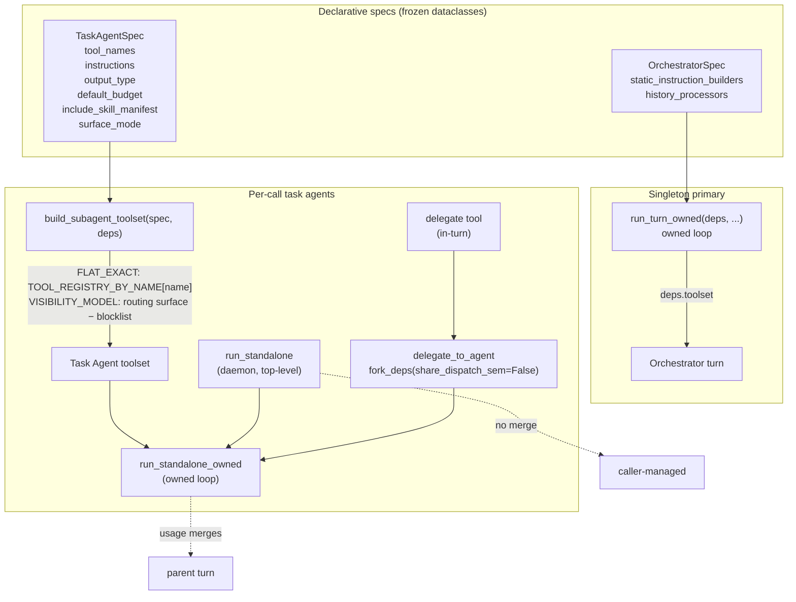

# Co CLI — Agents

> For tool registration, approval flow, and the per-call call-seam wrapper: [tools.md](tools.md). For the orchestration loop and run/turn semantics: [core-loop.md](core-loop.md). For orchestrator static-instruction composition: [prompt-assembly.md](prompt-assembly.md). For daemon callers and curation hooks: [skills.md](skills.md). For the span record shape and the agent/model/tool span seams: [observability.md](observability.md).

## 1. Functional Architecture



### Spec types

| Type | Role | Lifecycle | Tools field | Key fields |
|------|------|-----------|-------------|------------|
| `OrchestratorSpec` | Always-present primary agent | Read once per turn by the owned loop | None (`deps.toolset` injected directly) | `static_instruction_builders`, `history_processors` |
| `TaskAgentSpec` | Focused task agent (daemon or in-turn delegated agent) | Built per call | `tool_names: tuple[str, ...]` | `instructions`, `output_type`, `default_budget`, `include_skill_manifest`, `surface_mode` |

No shared base. The two specs do not feed a polymorphic dispatcher — inheritance would be decorative. The same `TaskAgentSpec` shape drives two lifecycles: a top-level **daemon** (via `run_standalone`) and an **in-turn delegated agent** (the `delegate` tool → `delegate_to_agent` → `run_standalone_owned`, see §2). Lifecycle is the runner you call, not the spec shape. `surface_mode` (`SurfaceModeEnum`, default `FLAT_EXACT`) selects how the tool surface is built: daemon/specialist specs stay flat-exact (exactly `tool_names`); the delegated agent uses `VISIBILITY_MODEL` (the orchestrator's full surface minus a structural blocklist — see §2).

### Concrete specs

| Spec | Owner module | Caller | Runner |
|------|--------------|--------|--------|
| `ORCHESTRATOR_SPEC` | `co_cli/agent/orchestrator.py` | `_chat_loop` in `main.py` | `run_turn_owned` (owned loop, reads spec directly) |
| `MEMORY_REVIEW_SPEC`, `SKILL_REVIEW_SPEC` | `co_cli/daemons/dream/_reviewer.py` | `process_review` (dream daemon, queue-driven) | `run_standalone` → `run_standalone_owned` |
| `DELEGATE_AGENT_SPEC` | `co_cli/agent/delegation.py` | `delegate` tool (`co_cli/tools/system/delegate.py`) via `delegate_to_agent` | `run_standalone_owned` (in-turn) |

**Curation rule.** Specs live with the caller that owns the agent's purpose — daemon specs sit alongside their daemon orchestration. The `co_cli/agent/` package owns lifecycle (build + run) and the orchestrator spec only.

### Shared entry points

`run_turn_owned(*, user_input, deps, message_history, model_settings=None, frontend)` (`co_cli/agent/loop.py`) is the orchestrator turn driver — the owned (graph-free) loop. There is no `Agent` object to construct: the loop reads `ORCHESTRATOR_SPEC` directly. Static instructions are composed once per turn by `build_static_instructions(deps)` (`co_cli/agent/preflight.py`) — each `spec.static_instruction_builders` closure called in order, empties dropped, joined with double newlines; the five per-turn dynamic parts (safety, wrap-up, current-time, deferred-tool awareness, skill manifest) are added every step by `assemble_instructions`; history processors run per step via `run_history_processors`. The orchestrator has no fixed output type — the loop classifies each response by tool-call presence (calls → dispatch; no calls → final text). The tool surface is read from `deps.toolset` directly (assembled once at bootstrap by `assemble_routing_toolset`, `co_cli/bootstrap/core.py`) — orchestrator is a singleton, no factory abstraction. The tool span, per-request cap, MCP spill, and arg repair are applied by co's own `dispatch_tools` / `model_turn`, not by a wrapper toolset or model (see [tools.md](tools.md) and [observability.md](observability.md)).

`build_subagent_toolset(spec, deps)` (`co_cli/agent/loop.py`) builds a task agent's tool surface, keyed on `spec.surface_mode`. FLAT_EXACT (default): resolves `spec.tool_names` against `TOOL_REGISTRY_BY_NAME` (populated by `@agent_tool` at import time) into a plain `FunctionToolset` with `requires_approval=False` and `sequential` copied from each tool's concurrency flag; unknown names raise `ValueError`. VISIBILITY_MODEL: `assemble_routing_toolset(build_native_toolset(), deps.mcp_toolsets, name_blocklist=_DELEGATE_AGENT_BLOCKLIST)` — the orchestrator's own native+MCP surface minus the structural blocklist. Either way the surface is unwrapped — the tool span, cap, and spill are applied by `dispatch_tools`, the same seam the orchestrator uses. The skill manifest (when `spec.include_skill_manifest=True`) is prepended to `spec.instructions(deps)` inside `run_standalone_owned`.

`run_standalone(spec, deps, prompt)` (`co_cli/agent/run.py`) is the daemon task-agent entry point: caller-forked deps, top-level (no depth check), no usage merge. It raises `ValueError` if `deps.model` is unset, then delegates straight to `run_standalone_owned` — there is no flag and no alternate path. It returns nothing — daemons consume tool side effects.

`run_standalone_owned(spec, deps, prompt, settings=None, propagate_approvals=False, frontend=None)` (`co_cli/agent/loop.py`) is the owned-loop task-agent driver, shared by the daemon path and **in-turn delegation**. It sets `deps.toolset = build_subagent_toolset(spec, deps)`, builds the structured `final_result` output tool defs via `build_output_toolset(spec.output_type)`, and drives the per-step loop with `allow_text_output=False` (request limit `spec.default_budget`; settings default `deps.model.settings_noreason`, or the caller's `settings`). Each step recomputes instructions and tool defs (so a `tool_view` reveal becomes callable on the next step), dispatches the model's real tool calls, and on a `final_result` call validates its args into a `spec.output_type` instance (re-prompting on validation failure). For in-turn delegation the `delegate` tool calls `delegate_to_agent` (`co_cli/agent/delegation.py`), which forks the parent deps with `share_dispatch_sem=False` and runs `DELEGATE_AGENT_SPEC` (or a per-call persona variant) through it, returning only the delegated agent's distilled `summary`; with `propagate_approvals=True` each step runs `collect_inline_approvals` first, so an approval-required call surfaces on the parent's `frontend`. See §2.

## 2. Core Logic

### Adding a new task agent

```
1. Pick the caller module that owns the agent's purpose:
     daemon            → co_cli/daemons/dream/_reviewer.py
     in-turn delegation → co_cli/agent/delegation.py
2. Define the spec record next to the caller:
     SPEC = TaskAgentSpec(
       name="my_agent",                # span name + role tag (carried via agent.run metadata)
       instructions=_my_instructions,  # callable: (deps) -> str
       tool_names=("tool_a", "tool_b"),# must exist in TOOL_REGISTRY_BY_NAME (flat-exact mode)
       output_type=MyOutput,           # pydantic BaseModel
       default_budget=N,               # request limit
       include_skill_manifest=False,   # True only when the agent reads/edits skills
       surface_mode=SurfaceModeEnum.FLAT_EXACT,  # default; VISIBILITY_MODEL ignores tool_names
     )
3. Wire the runner:
     daemon  → await run_standalone(SPEC, child_deps, prompt)   # caller forks deps first
     in-turn → result = await run_standalone_owned(SPEC, child_deps, prompt, settings=...)
```

No decorator advertisement, no profile registry. `tool_names` is the source of truth; mistypes fail loud at build time.

### `build_subagent_toolset` — tool surface

```
if spec.surface_mode is VISIBILITY_MODEL:
    native = build_native_toolset()
    return assemble_routing_toolset(native, deps.mcp_toolsets,
                                    name_blocklist=_DELEGATE_AGENT_BLOCKLIST)

# FLAT_EXACT (default):
toolset = FunctionToolset()
for name in spec.tool_names:
    fn = TOOL_REGISTRY_BY_NAME.get(name)
    if fn is None:
        raise ValueError(f"{spec.name}: unknown tool {name!r}")
    toolset.add_function(fn, requires_approval=False,      # task agents auto-approve own calls
                         sequential=not fn.is_concurrent_safe)
return toolset
```

`requires_approval=False` for every FLAT_EXACT tool — daemon agents do not prompt the user. The toolset is unwrapped: the tool span, per-request cap, and MCP spill are applied by `dispatch_tools`, not a wrapper. Approval, when it applies (the VISIBILITY_MODEL delegated agent), is collected inline by `collect_inline_approvals` — there is no suspend/resume on the owned path.

### `run_standalone_owned` — the owned task-agent loop

```
if deps.model is None:
    raise ValueError(...)                                  # caller bug, not ModelRetry

deps.toolset       = build_subagent_toolset(spec, deps)
output_defs, proc  = build_output_toolset(spec.output_type)   # final_result tool + validator
settings           = settings or deps.model.settings_noreason
request_limit      = spec.default_budget

push_span("invoke_agent {spec.name}", kind="agent", ...):
    history = [user prompt]
    while requests < request_limit:
        instructions  = subagent_instructions(spec, deps)  # + skill manifest if requested
        function_defs = await build_tool_defs(deps)        # recomputed each step
        params        = build_request_params(function_tools=function_defs,
                                             output_tools=output_defs,
                                             allow_text_output=False)
        response, usage = await drive_model_request(deps, clean(history), params, settings, ...)

        if final_result call present:
            result = proc.validate(call.args)              # re-prompt on ValidationError
            break
        if no calls:
            history += nudge("Call the final_result tool with your structured result.")
            continue
        if propagate_approvals:                            # delegated-agent path
            resolution = await collect_inline_approvals(calls, deps, frontend, "delegated subtask")
            parts = await dispatch_tools(calls, deps, denials=..., approved_ids=...)
        else:                                              # daemon path — no approvals
            parts = await dispatch_tools(calls, deps)
        history += parts
    record_usage(deps, turn_usage)                         # into caller-forked accumulator
return result            # the validated spec.output_type, or None on budget exhaustion
```

`run_standalone` is the daemon entry point that calls this with the defaults (no `settings`, `propagate_approvals=False`, no `frontend`). Daemons are top-level task agents with three defining properties: (1) **no depth check** — daemons are never nested inside an orchestrator turn; (2) **no usage merge** — no parent turn exists, usage records into the caller-forked accumulator; (3) **plain exceptions** — exceptions propagate to the daemon-specific handler (typically `asyncio.wait_for` timeout + report-on-fail). The caller is responsible for forking deps before invocation (`fork_deps_for_reviewer`). `run_standalone` returns nothing — daemons consume tool side effects, not a structured value; the driver's validated return is used by the in-turn delegation path and the parity tests.

### In-turn delegation — `delegate_to_agent`

The `delegate` tool (ALWAYS visibility, orchestrator-only) hands a multi-step subtask to a delegated agent **inside** the parent turn, returning only a distilled summary so the delegated agent's intermediate tool transcript never enters the parent history (context isolation). The delegated agent is a **full agent, not a lesser one** — it inherits the orchestrator's own visibility surface and decides for itself which tools the subtask needs.

The tool also accepts an optional `subagent_type` naming a **persona-mode** from a small, closed, co-native set (`PERSONA_MODES` — `synthesis`, `critique`). A picked mode injects a tuned persona brief into the delegated agent's instructions; it is **persona-only and never changes the tool surface** (the full-agent principle holds). The two-tier surface keeps the always-on cost lean: a one-line when-to-use menu rides the `delegate` description (the selection surface), while the rich per-mode brief is paid only on the turn a mode is used. Omitting `subagent_type` reproduces the anonymous generalist byte-for-byte (the `DELEGATE_AGENT_SPEC` singleton); an unknown name fails loud — a refusal naming the valid modes, never a silent anonymous fallback.

```
delegate_to_agent(parent_deps, task, subagent_type=None):
    if parent_deps.runtime.agent_depth >= DELEGATE_DEPTH_CAP:   # cap = 1
        return "<refusal string>"                              # no fork, no run
    spec = DELEGATE_AGENT_SPEC
    if subagent_type is not None:
        mode = PERSONA_MODES.get(subagent_type)
        if mode is None:
            return "<unknown-mode refusal naming valid modes>"  # fail loud, no run
        spec = replace(DELEGATE_AGENT_SPEC,                      # per-call spec, surface unchanged
                       instructions=lambda deps: delegate_agent_instructions(deps, mode_brief))
    agent_deps = fork_deps(parent_deps, share_dispatch_sem=False)  # own dispatch sem
    result = run_standalone_owned(spec, agent_deps, task,
                                  settings=parent_deps.model.settings,  # parent turn's settings
                                  propagate_approvals=True,
                                  frontend=parent_deps.runtime.frontend)
    return result.summary if result is not None else "<budget-exhausted fallback>"
```

Defining properties, all contrasting with the daemon path: (1) **depth-bounded** — `agent_depth` (incremented by `fork_deps`) caps recursion at 1; the delegated surface excludes `delegate` (`_DELEGATE_AGENT_BLOCKLIST`), so it cannot re-delegate; (2) **usage merges** — `fork_deps` shares `usage_accumulator` by reference, so the delegated agent's tokens roll into the parent turn (no extra accounting); (3) **own dispatch semaphore** — `share_dispatch_sem=False` gives a fresh `tool_dispatch_sem` so the run never starves behind the parent slot held for the synchronous `delegate` call; (4) **visibility-model surface** (`surface_mode=VISIBILITY_MODEL`) — the orchestrator's full native+MCP surface minus the `{delegate}` blocklist, built by `assemble_routing_toolset(build_native_toolset(), deps.mcp_toolsets, name_blocklist=_DELEGATE_AGENT_BLOCKLIST)`. ALWAYS tools are visible; DEFERRED tools (native and MCP) are advertised as awareness stubs in the instructions and self-loaded on demand via `tool_view`; (5) **approval-gated** — write/approval-required tools are reachable but every gated call propagates to the parent's `frontend` (`propagate_approvals=True`); a headless parent (`frontend is None`) auto-denies, so a write-capable agent never acts unprompted. Durable-write safety is recovered **at the gate**, not by withholding tools. `run_standalone_owned` returning `None` (budget spent without a `final_result` call) maps to a fixed fallback string, not an `AttributeError`. (6) **persona-mode, surface-invariant** — an optional `subagent_type` builds a per-call spec via `dataclasses.replace` that changes only `instructions` (the mode brief composed before the deferred-tool stubs, never displacing them); `surface_mode` stays `VISIBILITY_MODEL`, so the resolved tool surface is identical to the anonymous default. An unknown `subagent_type` is refused before forking.

### Deliberate delegation divergences

A peer survey of five delegation interfaces (`docs/reference/RESEARCH-delegation-interface-peer-survey.md` §6) surfaced two delegation features co **deliberately omits**. Both are conscious design decisions (confirmed 2026-06-27), recorded here so reviewers read them as choices, not oversights.

- **No async / parallel delegation.** co's `delegate` is a **synchronous owned loop**: `delegate_to_agent` `await`s `run_standalone_owned` to completion and holds the parent's tool slot for the whole delegated run (`co_cli/agent/delegation.py` — the single `await`, no task spawn, no handle returned). There is no fan-out-many, no background mode, no poll/await-handle tool. **Peer context:** dispatch-many-and-don't-poll guidance is 5/5 among surveyed peers, and 4/5 expose an async/background spawn param — co is the lone peer without parallel delegation. Parallel/async would be a larger architectural change (a scheduler, handles, a `wait` tool); it is out of scope by design, not unbuilt-by-accident.

- **No per-call model or scope override.** `delegate(task, subagent_type=None)` carries no `model` and no `toolsets`/scope argument; the delegated agent inherits the parent turn's model settings (`settings=parent_deps.model.settings`) and the orchestrator's full visibility surface minus the one-tool blocklist. The principle is **"the delegated agent is a full agent that inherits the parent"** — its behavior is narrowed by an optional persona-mode brief (instructions only), never by a surface or model grant. **Peer context:** a per-call `model` override is 3/5 among peers; a per-call `toolsets` scope is 1/5 (hermes only). Both are rejected here: a per-call `toolsets` allowlist contradicts the full-agent / gate-not-surface principle, and a model override is unmotivated for co's single-model local setup.

## 3. Config

| Setting | Env Var | Default | Description |
|---------|---------|---------|-------------|
| `tool_retries` | `CO_TOOL_RETRIES` | `3` | Default per-tool native retry budget (`add_function(retries=…)` fallback when a `ToolInfo` sets none — see [tools.md](tools.md)) |
| `memory.review_enabled` | — | `false` | Gates memory-domain reviewer KICK dispatch |
| `skills.review_enabled` | — | `false` | Gates skill-domain reviewer KICK dispatch |
| `REVIEW_MAX_ITERATIONS` | — | `8` | `MEMORY_REVIEW_SPEC` / `SKILL_REVIEW_SPEC` `default_budget` |
| `dream.review_timeout_seconds` | — | `120` | `asyncio.timeout` wrapping each reviewer call inside the daemon worker loop |
| `DELEGATE_DEPTH_CAP` | — | `1` | Max delegation depth; `delegate_to_agent` refuses at/above it (`co_cli/agent/delegation.py`) |
| `DELEGATE_AGENT_BUDGET` | — | `8` | `DELEGATE_AGENT_SPEC` `default_budget` (mirrors `REVIEW_MAX_ITERATIONS`) |

## 4. Public Interface

### Spec types

| Symbol | Source | Contract |
|--------|--------|----------|
| `OrchestratorSpec` | `co_cli/agent/spec.py` | Frozen dataclass — fields: `static_instruction_builders`, `history_processors` (both tuples for immutability). Per-turn dynamic instructions are wired by `assemble_instructions` (`co_cli/agent/preflight.py`), not carried on the spec |
| `TaskAgentSpec` | `co_cli/agent/spec.py` | Frozen dataclass — fields: `name`, `instructions`, `tool_names`, `output_type`, `default_budget`, `include_skill_manifest=False`, `surface_mode=SurfaceModeEnum.FLAT_EXACT` |
| `SurfaceModeEnum` | `co_cli/agent/spec.py` | `StrEnum` — `FLAT_EXACT` (exactly `tool_names`, all `requires_approval=False`) \| `VISIBILITY_MODEL` (orchestrator surface minus blocklist; `tool_names` ignored) |
| `ORCHESTRATOR_SPEC` | `co_cli/agent/orchestrator.py` | Singleton — 5 static-instruction builders, 5 history processors (5 per-turn dynamic instructions added by `assemble_instructions`) |
| `MEMORY_REVIEW_SPEC`, `SKILL_REVIEW_SPEC` | `co_cli/daemons/dream/_reviewer.py` | Dream-daemon task specs; budget `REVIEW_MAX_ITERATIONS` |
| `DELEGATE_AGENT_SPEC`, `DelegationResult`, `PERSONA_MODES` | `co_cli/agent/delegation.py` | In-turn delegated-agent spec (`surface_mode=VISIBILITY_MODEL`; orchestrator surface minus `{delegate}`); `DelegationResult` is the single-`summary` output type; `PERSONA_MODES` is the closed persona-mode→brief table (`synthesis`, `critique`) a named `subagent_type` resolves against |

### Builders

| Symbol | Source | Contract |
|--------|--------|----------|
| `build_static_instructions(deps: CoDeps) -> str` | `co_cli/agent/preflight.py` | Composes `ORCHESTRATOR_SPEC.static_instruction_builders` in order, drops empties, joins with double newlines — the cacheable system-prompt prefix |
| `build_subagent_toolset(spec: TaskAgentSpec, deps: CoDeps) -> Any` | `co_cli/agent/loop.py` | Builds a task agent's tool surface by `spec.surface_mode`: FLAT_EXACT resolves `spec.tool_names` via `TOOL_REGISTRY_BY_NAME` (raises `ValueError` on unknown names, `requires_approval=False`); VISIBILITY_MODEL returns the routing surface minus `_DELEGATE_AGENT_BLOCKLIST` |

### Runners

| Symbol | Source | Contract |
|--------|--------|----------|
| `run_turn_owned(*, user_input, deps: CoDeps, message_history, model_settings=None, frontend: Frontend) -> TurnResult` | `co_cli/agent/loop.py` | Orchestrator turn driver — the owned loop; reads `ORCHESTRATOR_SPEC` directly, classifies each response by tool-call presence, recovers provider errors in-loop, returns a `TurnResult` the chat loop matches on |
| `run_standalone(spec: TaskAgentSpec, deps: CoDeps, prompt: str) -> None` | `co_cli/agent/run.py` | Daemon entry point; takes already-forked deps, raises `ValueError` if `deps.model` is unset, then delegates straight to `run_standalone_owned`; returns nothing |
| `run_standalone_owned(spec: TaskAgentSpec, deps: CoDeps, prompt: str, settings: ModelSettings \| None = None, propagate_approvals: bool = False, frontend: Frontend \| None = None) -> BaseModel \| None` | `co_cli/agent/loop.py` | Owned-loop task-agent driver; sets `deps.toolset` from `build_subagent_toolset`, forces structured `final_result` (`allow_text_output=False`), recomputes instructions + tool defs per step; returns the validated `spec.output_type` or `None` on budget exhaustion / hard-stop. `settings` defaults to `settings_noreason` (daemon path); `delegate_to_agent` passes the parent turn's settings and `propagate_approvals=True` |
| `delegate_to_agent(parent_deps: CoDeps, task: str, subagent_type: str \| None = None) -> str` | `co_cli/agent/delegation.py` | In-turn delegation driver; depth-guards, optionally resolves `subagent_type` against `PERSONA_MODES` (unknown ⇒ fail-loud refusal, no run) into a per-call persona spec (surface unchanged), forks with own dispatch sem, runs with approval propagation, returns the delegated agent's `summary` or a fixed fallback |

## 5. Files

| File | Role |
|------|------|
| `co_cli/agent/spec.py` | `OrchestratorSpec`, `TaskAgentSpec`, `SurfaceModeEnum` declarative records |
| `co_cli/agent/loop.py` | `run_turn_owned` (orchestrator loop), `run_standalone_owned`, `build_subagent_toolset` |
| `co_cli/agent/preflight.py` | `build_static_instructions`, `assemble_instructions`, `build_tool_defs`, `build_output_toolset`, `build_request_params` (per-step owned-loop builders) |
| `co_cli/agent/approval.py` | `collect_inline_approvals` (inline, pre-fan-out approval collection) |
| `co_cli/agent/orchestrator.py` | `ORCHESTRATOR_SPEC` + the static-instruction provider closures |
| `co_cli/agent/run.py` | `run_standalone` (daemon entry point → `run_standalone_owned`) |
| `co_cli/agent/delegation.py` | `DELEGATE_AGENT_SPEC`, `DelegationResult`, `PERSONA_MODES`, `delegate_to_agent`, `DELEGATE_DEPTH_CAP`, `DELEGATE_AGENT_BUDGET`, `_DELEGATE_AGENT_BLOCKLIST` |
| `co_cli/tools/system/delegate.py` | `delegate` tool (in-turn delegation, ALWAYS visibility) |
| `co_cli/agent/_instructions.py` | `safety_prompt`, `current_time_prompt` — orchestrator per-turn instructions |
| `co_cli/agent/core.py` | `build_native_toolset`, `build_mcp_entries`, `assemble_routing_toolset` (toolset helpers; see [tools.md](tools.md)) |
| `co_cli/tools/agent_tool.py` | `@agent_tool` decorator; `TOOL_REGISTRY`, `TOOL_REGISTRY_BY_NAME` |
| `co_cli/daemons/dream/_reviewer.py` | `MEMORY_REVIEW_SPEC`, `SKILL_REVIEW_SPEC` + `process_review` dispatcher (dream daemon) |
| `co_cli/daemons/dream/_housekeeping.py` | `run_housekeeping` + memory/skill merge & decay phases (no agent — direct `llm_call` for cluster merges) |

## 6. Test Gates

| Property | Test file |
|----------|-----------|
| `build_subagent_toolset` resolves `spec.tool_names` and the owned subagent runs to a schema-valid `final_result` | `tests/test_flow_owned_subagent.py` |
| Google tools register unconditionally but hide per-turn (`_google_available`) when no credential source exists on disk | `tests/test_flow_google_auth.py` |
| A propagated-approval subagent write executes on approve and is blocked on deny | `tests/test_flow_owned_subagent.py` |
| `fork_deps` increments `agent_depth` on each fork | `tests/test_flow_fork_deps.py` |
| `fork_deps` starts child with fresh `runtime` state | `tests/test_flow_fork_deps.py` |
| `fork_deps(share_dispatch_sem=False)` gives the in-turn delegated agent its own dispatch semaphore | `tests/test_flow_delegation.py` |
| `delegate_to_agent` refuses at `DELEGATE_DEPTH_CAP` without forking/running | `tests/test_flow_delegation.py` |
| A named `subagent_type` injects the mode brief into instructions without displacing the deferred-tool stubs and leaves the tool surface unchanged; an unknown `subagent_type` fails loud (refusal naming valid modes, no run) | `tests/test_flow_delegation.py` |
| Delegated agent reads via its tools and distills; tokens roll into the parent turn | `tests/test_flow_delegation.py` |
| Owned-turn `delegate` isolates the transcript — only the summary enters parent history | `tests/test_flow_delegation.py` |
| Delegated agent resolves the orchestrator surface minus `{delegate}`; DEFERRED tools (native + MCP) hidden until `tool_view`-revealed; flat-exact specs unchanged | `tests/test_flow_delegation.py` |
| Delegated agent self-loads a DEFERRED tool the old allowlist lacked and uses it; a gated write surfaces the concrete subject + delegated-origin marker; isolation holds | `tests/test_flow_delegation_full_surface.py` |
| Orchestrator serves a real prompt-response turn end-to-end | `tests/test_flow_chat_loop.py::test_plain_text_routes_to_foreground_turn` |
| Dream-daemon reviewer process_review dispatch + reviewer specs | `tests/daemons/dream/` (see [dream.md](dream.md) §7) |
| `refresh_skills` makes pass-B see pass-A's skill writes | `tests/test_flow_review_background.py::test_child_deps_refresh_surfaces_disk_skill_when_parent_registry_stale` |
| Child-deps skill refresh does not mutate parent registry | `tests/test_flow_review_background.py::test_child_refresh_does_not_mutate_parent_registry` |
