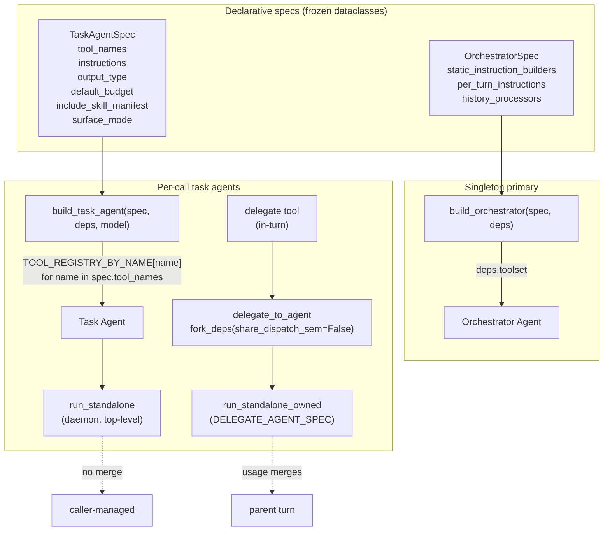

# Co CLI — Agents

> For tool registration, approval flow, and the per-call call-seam wrapper: [tools.md](tools.md). For the orchestration loop and run/turn semantics: [core-loop.md](core-loop.md). For orchestrator static-instruction composition: [prompt-assembly.md](prompt-assembly.md). For daemon callers and curation hooks: [skills.md](skills.md). For the span record shape and the agent/model/tool span seams: [observability.md](observability.md).

## 1. Functional Architecture



### Spec types

| Type | Role | Lifecycle | Tools field | Key fields |
|------|------|-----------|-------------|------------|
| `OrchestratorSpec` | Always-present primary agent | Built once per chat session | None (`deps.toolset` injected directly) | `static_instruction_builders`, `per_turn_instructions`, `history_processors` |
| `TaskAgentSpec` | Focused task agent (daemon or in-turn delegated agent) | Built per call | `tool_names: tuple[str, ...]` | `instructions`, `output_type`, `default_budget`, `include_skill_manifest`, `surface_mode` |

No shared base. The two specs do not feed a polymorphic dispatcher — inheritance would be decorative. The same `TaskAgentSpec` shape drives two lifecycles: a top-level **daemon** (via `run_standalone`) and an **in-turn delegated agent** (the `delegate` tool → `delegate_to_agent` → `run_standalone_owned`, see §2). Lifecycle is the runner you call, not the spec shape. `surface_mode` (`SurfaceModeEnum`, default `FLAT_EXACT`) selects how the tool surface is built: daemon/specialist specs stay flat-exact (exactly `tool_names`); the delegated agent uses `VISIBILITY_MODEL` (the orchestrator's full surface minus a structural blocklist — see §2).

### Concrete specs

| Spec | Owner module | Caller | Runner |
|------|--------------|--------|--------|
| `ORCHESTRATOR_SPEC` | `co_cli/agent/orchestrator.py` | `_chat_loop` in `main.py` | `build_orchestrator` directly |
| `MEMORY_REVIEW_SPEC`, `SKILL_REVIEW_SPEC` | `co_cli/daemons/dream/_reviewer.py` | `process_review` (dream daemon, queue-driven) | `run_standalone` |
| `DELEGATE_AGENT_SPEC` | `co_cli/agent/delegation.py` | `delegate` tool (`co_cli/tools/system/delegate.py`) via `delegate_to_agent` | `run_standalone_owned` (in-turn) |

**Curation rule.** Specs live with the caller that owns the agent's purpose — daemon specs sit alongside their daemon orchestration. The `co_cli/agent/` package owns lifecycle (build + run) and the orchestrator spec only.

### Shared entry points

`build_orchestrator(spec, deps)` (`co_cli/agent/build.py`) composes the orchestrator. Static instructions are assembled by calling each `spec.static_instruction_builders` closure in order and joining with double newlines; per-turn instructions are registered via `agent.instructions(...)`; history processors are attached as a list. Output type is fixed `[str, DeferredToolRequests]`; retries from `deps.config.tool_retries`. No `capabilities=[...]` attachment — the tool span, per-request cap, and MCP spill ride the `_CallSeamToolset` wrapper on the toolset, and the model span + arg repair ride `SurrogateRecoveryModel` (see [tools.md](tools.md) and [observability.md](observability.md)). Toolset comes from `deps.toolset` directly — orchestrator is a singleton, no factory abstraction.

`build_task_agent(spec, deps, model)` (`co_cli/agent/build.py`) resolves `spec.tool_names` against `TOOL_REGISTRY_BY_NAME` (populated by `@agent_tool` at import time) and adds each resolved tool to a `FunctionToolset` with `requires_approval=False`, wrapped in `_CallSeamToolset` so subagent tool calls get the same span/cap/spill seam as the orchestrator. Unknown names raise `ValueError` at build time. When `spec.include_skill_manifest=True`, the rendered skill manifest is prepended to `spec.instructions(deps)`.

`run_standalone(spec, deps, prompt)` (`co_cli/agent/run.py`) is the daemon task-agent runner: caller-forked deps, top-level (no depth check), no usage merge, request limit `spec.default_budget`, settings `deps.model.settings_noreason`. It returns nothing — daemons consume tool side effects. When `config.llm.use_owned_loop` is set it delegates to `run_standalone_owned` (`co_cli/agent/loop.py`).

`run_standalone_owned(spec, deps, prompt, settings=None, propagate_approvals=False, frontend=None)` is the second task-agent runner — the graph-free owned-loop driver. Besides backing the daemon path, it is the runner for **in-turn delegation**: the `delegate` tool calls `delegate_to_agent` (`co_cli/agent/delegation.py`), which forks the parent deps with `share_dispatch_sem=False` and runs `DELEGATE_AGENT_SPEC` through it, returning only the delegated agent's distilled `summary`. Instructions and tool defs are recomputed each step (so a `tool_view` reveal becomes callable on the next step); when `propagate_approvals=True` an approval-required call surfaces on the parent's `frontend`. See §2.

## 2. Core Logic

### Adding a new task agent

```
1. Pick the caller module that owns the agent's purpose:
     daemon            → co_cli/daemons/dream/_reviewer.py
     in-turn delegation → co_cli/agent/delegation.py
2. Define the spec record next to the caller:
     SPEC = TaskAgentSpec(
       name="my_agent",                # span name + role tag (carried via agent.run metadata)
       instructions=_my_instructions,  # callable: (deps) -> str
       tool_names=("tool_a", "tool_b"),# must exist in TOOL_REGISTRY_BY_NAME (flat-exact mode)
       output_type=MyOutput,           # pydantic BaseModel
       default_budget=N,               # request limit
       include_skill_manifest=False,   # True only when the agent reads/edits skills
       surface_mode=SurfaceModeEnum.FLAT_EXACT,  # default; VISIBILITY_MODEL ignores tool_names
     )
3. Wire the runner:
     daemon  → await run_standalone(SPEC, child_deps, prompt)   # caller forks deps first
     in-turn → result = await run_standalone_owned(SPEC, child_deps, prompt, settings=...)
```

No decorator advertisement, no profile registry. `tool_names` is the source of truth; mistypes fail loud at build time.

### `build_task_agent` — tool resolution

```
tool_fns = []
for name in spec.tool_names:
    fn = TOOL_REGISTRY_BY_NAME.get(name)
    if fn is None:
        raise ValueError(f"{spec.name}: unknown tool {name!r}")
    tool_fns.append(fn)

instructions = spec.instructions(deps)
if spec.include_skill_manifest:
    instructions = render_skill_manifest(...) + "\n\n" + instructions

toolset = FunctionToolset()
for fn in tool_fns:
    toolset.add_function(fn, requires_approval=False)   # task agents auto-approve own calls

agent = Agent(
    model, deps_type=CoDeps,
    output_type=spec.output_type,
    instructions=instructions,
    retries=deps.config.tool_retries,
    toolsets=[_CallSeamToolset(toolset)],   # same span/cap/spill seam as the orchestrator
)
return agent
```

`requires_approval=False` for every resolved tool — task agents do not prompt the user. The orchestrator's `_approval_resume_filter` and `DeferredToolRequests` flow stay on the orchestrator path only.

### `run_standalone` — daemon

```
if deps.model is None:
    raise ValueError(...)                                  # caller bug, not ModelRetry

if deps.config.llm.use_owned_loop:
    await run_standalone_owned(spec, deps, prompt)         # graph-free path
    return

request_limit = spec.default_budget
settings      = deps.model.settings_noreason
agent         = build_task_agent(spec, deps, deps.model.model)

otel_span(spec.name, role=spec.name, request_limit=...):
    result = await agent.run(prompt, deps=deps,
                             usage_limits=UsageLimits(request_limit=request_limit),
                             model_settings=settings)
    record_usage(deps, result.usage())                     # into caller-forked accumulator
```

Daemons are top-level task agents with three defining properties: (1) **no depth check** — daemons are never nested inside an orchestrator turn; (2) **no usage merge** — no parent turn exists; (3) **plain exceptions** — exceptions propagate to the daemon-specific handler (typically `asyncio.wait_for` timeout + report-on-fail). The caller is responsible for forking deps before invocation (`fork_deps_for_reviewer`). `run_standalone` returns nothing — daemons consume tool side effects, not a structured value.

### In-turn delegation — `delegate_to_agent`

The `delegate` tool (ALWAYS visibility, orchestrator-only) hands a multi-step subtask to a delegated agent **inside** the parent turn, returning only a distilled summary so the delegated agent's intermediate tool transcript never enters the parent history (context isolation). The delegated agent is a **full agent, not a lesser one** — it inherits the orchestrator's own visibility surface and decides for itself which tools the subtask needs.

```
delegate_to_agent(parent_deps, task):
    if parent_deps.runtime.agent_depth >= DELEGATE_DEPTH_CAP:   # cap = 1
        return "<refusal string>"                              # no fork, no run
    agent_deps = fork_deps(parent_deps, share_dispatch_sem=False)  # own dispatch sem
    result = run_standalone_owned(DELEGATE_AGENT_SPEC, agent_deps, task,
                                  settings=parent_deps.model.settings,  # parent turn's settings
                                  propagate_approvals=True,
                                  frontend=parent_deps.runtime.frontend)
    return result.summary if result is not None else "<budget-exhausted fallback>"
```

Defining properties, all contrasting with the daemon path: (1) **depth-bounded** — `agent_depth` (incremented by `fork_deps`) caps recursion at 1; the delegated surface excludes `delegate` (`_DELEGATE_AGENT_BLOCKLIST`), so it cannot re-delegate; (2) **usage merges** — `fork_deps` shares `usage_accumulator` by reference, so the delegated agent's tokens roll into the parent turn (no extra accounting); (3) **own dispatch semaphore** — `share_dispatch_sem=False` gives a fresh `tool_dispatch_sem` so the run never starves behind the parent slot held for the synchronous `delegate` call; (4) **visibility-model surface** (`surface_mode=VISIBILITY_MODEL`) — the orchestrator's full native+MCP surface minus the `{delegate}` blocklist, built by `assemble_routing_toolset(build_native_toolset(), deps.mcp_toolsets, name_blocklist=_DELEGATE_AGENT_BLOCKLIST)`. ALWAYS tools are visible; DEFERRED tools (native and MCP) are advertised as awareness stubs in the instructions and self-loaded on demand via `tool_view`; (5) **approval-gated** — write/approval-required tools are reachable but every gated call propagates to the parent's `frontend` (`propagate_approvals=True`); a headless parent (`frontend is None`) auto-denies, so a write-capable agent never acts unprompted. Durable-write safety is recovered **at the gate**, not by withholding tools. `run_standalone_owned` returning `None` (budget spent without a `final_result` call) maps to a fixed fallback string, not an `AttributeError`.

## 3. Config

| Setting | Env Var | Default | Description |
|---------|---------|---------|-------------|
| `tool_retries` | `CO_TOOL_RETRIES` | `3` | `retries=` for orchestrator and task agents |
| `memory.review_enabled` | — | `false` | Gates memory-domain reviewer KICK dispatch |
| `skills.review_enabled` | — | `false` | Gates skill-domain reviewer KICK dispatch |
| `REVIEW_MAX_ITERATIONS` | — | `8` | `MEMORY_REVIEW_SPEC` / `SKILL_REVIEW_SPEC` `default_budget` |
| `dream.review_timeout_seconds` | — | `120` | `asyncio.timeout` wrapping each reviewer call inside the daemon worker loop |
| `DELEGATE_DEPTH_CAP` | — | `1` | Max delegation depth; `delegate_to_agent` refuses at/above it (`co_cli/agent/delegation.py`) |
| `DELEGATE_AGENT_BUDGET` | — | `8` | `DELEGATE_AGENT_SPEC` `default_budget` (mirrors `REVIEW_MAX_ITERATIONS`) |

## 4. Public Interface

### Spec types

| Symbol | Source | Contract |
|--------|--------|----------|
| `OrchestratorSpec` | `co_cli/agent/spec.py` | Frozen dataclass — fields: `name`, `static_instruction_builders`, `per_turn_instructions`, `history_processors` (all tuples for immutability) |
| `TaskAgentSpec` | `co_cli/agent/spec.py` | Frozen dataclass — fields: `name`, `instructions`, `tool_names`, `output_type`, `default_budget`, `include_skill_manifest=False`, `surface_mode=SurfaceModeEnum.FLAT_EXACT` |
| `SurfaceModeEnum` | `co_cli/agent/spec.py` | `StrEnum` — `FLAT_EXACT` (exactly `tool_names`, all `requires_approval=False`) \| `VISIBILITY_MODEL` (orchestrator surface minus blocklist; `tool_names` ignored) |
| `ORCHESTRATOR_SPEC` | `co_cli/agent/orchestrator.py` | Singleton — 3 static-instruction builders, 4 per-turn instructions, 5 history processors |
| `MEMORY_REVIEW_SPEC`, `SKILL_REVIEW_SPEC` | `co_cli/daemons/dream/_reviewer.py` | Dream-daemon task specs; budget `REVIEW_MAX_ITERATIONS` |
| `DELEGATE_AGENT_SPEC`, `DelegationResult` | `co_cli/agent/delegation.py` | In-turn delegated-agent spec (`surface_mode=VISIBILITY_MODEL`; orchestrator surface minus `{delegate}`); `DelegationResult` is the single-`summary` output type |

### Builders

| Symbol | Source | Contract |
|--------|--------|----------|
| `build_orchestrator(spec: OrchestratorSpec, deps: CoDeps) -> Agent[CoDeps, Any]` | `co_cli/agent/build.py` | Constructs the orchestrator from `deps.toolset`; raises `ValueError` if `deps.toolset` or `deps.model` is unset |
| `build_task_agent(spec: TaskAgentSpec, deps: CoDeps, model: Any) -> Agent[CoDeps, Any]` | `co_cli/agent/build.py` | Resolves `spec.tool_names` via `TOOL_REGISTRY_BY_NAME`; raises `ValueError` on unknown names; registers each tool with `requires_approval=False` |

### Runners

| Symbol | Source | Contract |
|--------|--------|----------|
| `run_standalone(spec: TaskAgentSpec, deps: CoDeps, prompt: str) -> None` | `co_cli/agent/run.py` | Daemon runner; takes already-forked deps, opens own span, never depth-checks, no usage merge, plain exceptions, returns nothing. Delegates to `run_standalone_owned` when `config.llm.use_owned_loop` |
| `run_standalone_owned(spec: TaskAgentSpec, deps: CoDeps, prompt: str, settings: ModelSettings \| None = None, propagate_approvals: bool = False, frontend: Frontend \| None = None) -> BaseModel \| None` | `co_cli/agent/loop.py` | Graph-free owned-loop driver; forces structured `final_result`; recomputes instructions + tool defs per step; returns the validated `spec.output_type` or `None` on budget exhaustion / hard-stop. `settings` defaults to `settings_noreason` (daemon path); `delegate_to_agent` passes the parent turn's settings and `propagate_approvals=True` |
| `delegate_to_agent(parent_deps: CoDeps, task: str) -> str` | `co_cli/agent/delegation.py` | In-turn delegation driver; depth-guards, forks with own dispatch sem, runs `DELEGATE_AGENT_SPEC` with approval propagation, returns the delegated agent's `summary` or a fixed fallback |

## 5. Files

| File | Role |
|------|------|
| `co_cli/agent/spec.py` | `OrchestratorSpec`, `TaskAgentSpec` declarative records |
| `co_cli/agent/build.py` | `build_orchestrator`, `build_task_agent` |
| `co_cli/agent/orchestrator.py` | `ORCHESTRATOR_SPEC` + the 5 static-instruction provider closures |
| `co_cli/agent/run.py` | `run_standalone` |
| `co_cli/agent/delegation.py` | `DELEGATE_AGENT_SPEC`, `DelegationResult`, `delegate_to_agent`, `DELEGATE_DEPTH_CAP`, `DELEGATE_AGENT_BUDGET`, `_DELEGATE_AGENT_BLOCKLIST` |
| `co_cli/tools/system/delegate.py` | `delegate` tool (in-turn delegation, ALWAYS visibility) |
| `co_cli/agent/_instructions.py` | `safety_prompt`, `current_time_prompt` — orchestrator per-turn instructions |
| `co_cli/agent/core.py` | `build_native_toolset`, `build_mcp_entries`, `assemble_routing_toolset` (toolset helpers; see [tools.md](tools.md)) |
| `co_cli/tools/agent_tool.py` | `@agent_tool` decorator; `TOOL_REGISTRY`, `TOOL_REGISTRY_BY_NAME` |
| `co_cli/daemons/dream/_reviewer.py` | `MEMORY_REVIEW_SPEC`, `SKILL_REVIEW_SPEC` + `process_review` dispatcher (dream daemon) |
| `co_cli/daemons/dream/_housekeeping.py` | `run_housekeeping` + memory/skill merge & decay phases (no agent — direct `llm_call` for cluster merges) |

## 6. Test Gates

| Property | Test file |
|----------|-----------|
| `TaskAgentSpec.tool_names` resolves to registered tools by exact name | `tests/test_agent_build_task_agent.py` |
| Unknown tool name in `tool_names` raises `ValueError` at build time | `tests/test_agent_build_task_agent.py` |
| Google tools register unconditionally but hide per-turn (`_google_available`) when no credential source exists on disk | `tests/test_flow_google_auth.py` |
| Task agents register all tools with `requires_approval=False` | `tests/test_agent_build_task_agent.py` |
| `fork_deps` increments `agent_depth` on each fork | `tests/test_flow_fork_deps.py` |
| `fork_deps` starts child with fresh `runtime` state | `tests/test_flow_fork_deps.py` |
| `fork_deps(share_dispatch_sem=False)` gives the in-turn delegated agent its own dispatch semaphore | `tests/test_flow_delegation.py` |
| `delegate_to_agent` refuses at `DELEGATE_DEPTH_CAP` without forking/running | `tests/test_flow_delegation.py` |
| Delegated agent reads via its tools and distills; tokens roll into the parent turn | `tests/test_flow_delegation.py` |
| Owned-turn `delegate` isolates the transcript — only the summary enters parent history | `tests/test_flow_delegation.py` |
| Delegated agent resolves the orchestrator surface minus `{delegate}`; DEFERRED tools (native + MCP) hidden until `tool_view`-revealed; flat-exact specs unchanged | `tests/test_flow_delegation.py` |
| Delegated agent self-loads a DEFERRED tool the old allowlist lacked and uses it; a gated write surfaces the concrete subject + delegated-origin marker; isolation holds | `tests/test_flow_delegation_full_surface.py` |
| Orchestrator serves a real prompt-response turn end-to-end | `tests/test_flow_chat_loop.py::test_plain_text_routes_to_foreground_turn` |
| Dream-daemon reviewer process_review dispatch + reviewer specs | `tests/daemons/dream/` (see [dream.md](dream.md) §7) |
| `refresh_skills` makes pass-B see pass-A's skill writes | `tests/test_flow_review_background.py::test_child_deps_refresh_surfaces_disk_skill_when_parent_registry_stale` |
| Child-deps skill refresh does not mutate parent registry | `tests/test_flow_review_background.py::test_child_refresh_does_not_mutate_parent_registry` |
