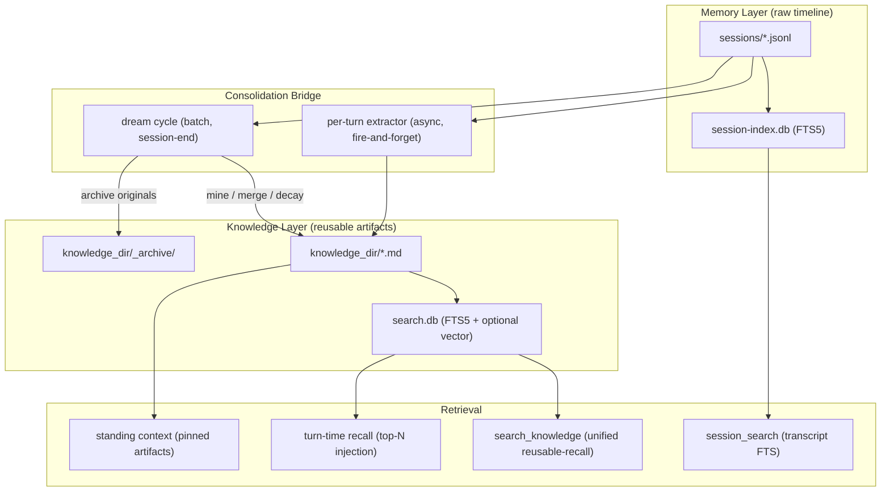

# Co CLI — Cognitive Architecture: Memory & Knowledge

## Product Intent

**Goal:** Define a strict two-layer cognitive model separating raw experiential timeline (Memory) from reusable distilled artifacts (Knowledge), with a consolidation bridge between them.

**Functional areas:**
- Memory layer: session transcripts, session index, episodic recall
- Knowledge layer: unified artifact model, FTS5/hybrid search, standing context, turn-time recall
- Extraction: per-turn signal detection writing to the knowledge layer
- Consolidation: batch dedup, merge, decay, and transcript mining ("dreaming")
- Retrieval: episodic search over transcripts, reusable search over knowledge

**Non-goals:**
- Media asset processing (audio/video ingest, transcription pipelines)
- Multi-user or concurrent-write safety
- Real-time file-watch triggers
- Provider-side memory or server-managed context

**Success criteria:** Reusable search routes through a single knowledge surface. Episodic recall routes through transcript search. The extractor writes knowledge artifacts. Standing context is sourced from knowledge metadata. Knowledge is self-maintaining via consolidation.

**Status:** Memory layer is transcripts only; Knowledge layer is the unified artifact store indexed under `source="knowledge"`. Lifecycle machinery (dream cycle, decay, dedup) is gated behind `knowledge.consolidation_enabled` and ships in upcoming phases.

**Known gaps:** The consolidation modules (`_similarity`, `_archive`, `_decay`, `_dream`) are planned but not yet implemented.

---

This spec defines the cognitive architecture of `co-cli`: what belongs in Memory vs Knowledge, how artifacts flow between layers, and how retrieval, standing context, and lifecycle management work. Transcript persistence mechanics (append, branching, compaction, resume) live in [context.md](context.md). Startup sequencing in [flow-bootstrap.md](flow-bootstrap.md). Tool registration and approval in [tools.md](tools.md). Prompt assembly in [context.md](context.md).

## 1. What & How

`co-cli` uses a two-layer cognitive model:

- **Memory** is the raw experiential timeline — append-only session transcripts that preserve exactly what happened, in order. Memory is canonical for chronology.
- **Knowledge** is every reusable distilled artifact — extracted preferences, project rules, fetched articles, imported notes, synced documents. Knowledge is canonical for reuse.

The boundary rule is simple: **reusability defines the layer, not origin.** If an artifact is intended for reuse beyond its original session, it is knowledge — regardless of whether it was extracted from a conversation, fetched from the web, or authored manually.

The per-turn extractor is the primary bridge: it detects durable signals during conversation and writes them as knowledge artifacts. A batch consolidation cycle ("dreaming") provides second-pass hygiene — dedup, merge, decay, and retrospective transcript mining.



## 2. Core Logic

### 2.1 Memory Layer

Memory is the session/event timeline. Its canonical storage is append-only `.jsonl` transcripts in `sessions_dir`. Each line is a serialized `ModelMessage` (pydantic-ai discriminated union). Oversized tool results are spilled to `tool-results/` and replaced with `<persisted-output>` placeholders.

A `SessionIndex` (SQLite FTS5 in `session-index.db`) indexes user prompts and assistant text from past sessions for keyword search. The current session is excluded from indexing until it closes.

**Episodic retrieval** uses `session_search()`, which queries `session-index.db` for ranked excerpts across past conversations. This is the only search path into Memory — there is no semantic or vector retrieval over transcripts.

Memory is not curated, not consolidated, and not subject to lifecycle management. It is append-only and grows indefinitely (with optional session-level pruning when disk usage exceeds a threshold).

### 2.2 Knowledge Layer

Knowledge is every reusable artifact the agent should be able to recall across sessions.

**Storage model — dual layer:**

| Layer | What lives there | Purpose |
|-------|-----------------|---------|
| Disk (`knowledge_dir/*.md`) | Frontmatter + body text | Source of truth. Human-editable, agent-readable via standard tools. |
| DB (`search.db`) | FTS5 indexes, chunk tables, optional vector embeddings, metadata | Retrieval layer. All search queries hit the DB directly — never read `.md` files at query time. |

`sync_dir()` keeps the DB current from disk. On bootstrap and after writes, content is ingested from `.md` files into `chunks` + `chunks_fts` (and optionally `chunks_vec_{dims}`) tables. The DB is derived and rebuildable from disk.

**Knowledge artifact schema:**

Every knowledge artifact is a `.md` file with YAML frontmatter:

| Field | Purpose |
|-------|---------|
| `id` | UUID4 stable identity |
| `kind` | Always `knowledge` |
| `artifact_kind` | Semantic subtype: `preference`, `decision`, `rule`, `feedback`, `article`, `reference`, `note` |
| `title` | Human-readable label |
| `description` | Compact summary for retrieval and manifests |
| `created` | ISO8601 creation timestamp |
| `updated` | ISO8601 last-modified timestamp |
| `tags` | Retrieval and organization labels (list of strings) |
| `related` | Soft links to related artifact slugs |
| `source_type` | Origin: `detected`, `web_fetch`, `manual`, `obsidian`, `drive`, `consolidated` |
| `source_ref` | Pointer to origin: session ID, URL, file path, or artifact ID |
| `certainty` | Confidence: `high`, `medium`, `low` |
| `pin_mode` | Standing-context eligibility: `standing` (always injected) or `none` |
| `decay_protected` | Boolean — immune from automated decay |
| `last_recalled` | ISO8601 timestamp of most recent recall hit |
| `recall_count` | Integer count of recall hits |

### 2.3 Knowledge Retrieval

All reusable recall routes through the knowledge layer. Three retrieval paths:

**Standing context** — artifacts with `pin_mode="standing"` are injected into every model request as a dynamic instruction layer. Capped at 5 entries, truncated to `injection_max_chars`.

**Turn-time recall** — on each new user turn, `inject_opening_context` queries `search.db` for the top-N knowledge artifacts matching the user's message. Results are injected as a trailing `SystemPromptPart`. This surfaces both extracted facts and articles — anything reusable and relevant.

**Explicit search** — the agent calls `search_knowledge()` for on-demand retrieval. This is the universal reusable-recall tool covering all artifact kinds, Obsidian notes, and Drive documents.

**Search backends (three-tier fallback):**

| Backend | Mechanism | When used |
|---------|-----------|-----------|
| Hybrid | FTS5 + sqlite-vec vector similarity, merged via RRF (k=60) | Embedding provider available |
| FTS5 | BM25 over `chunks_fts`, porter/unicode61 tokenizer | Embedding provider unavailable |
| Grep | In-memory substring match over loaded `.md` files | `KnowledgeStore` unavailable |

All search operates at chunk level — artifacts are split into overlapping chunks at index time, searched at chunk granularity, then deduplicated to artifact level before returning results.

**Confidence scoring** (applied to all search results):

```
confidence = 0.5 * score + 0.3 * decay + 0.2 * (provenance_weight * certainty_multiplier)

decay = exp(-ln(2) * age_days / half_life_days)
```

### 2.4 Knowledge Extraction (Memory -> Knowledge Bridge)

The per-turn extractor is the primary path from Memory to Knowledge. It runs as a fire-and-forget async task after each clean, non-compaction turn (cadence-gated, default every 3 turns).

**Extraction flow:**

```
_finalize_turn (clean turn, cadence check passes)
  -> fire_and_forget_extraction(delta messages, cursor)
     -> _build_window(delta) — format recent turns as plain text
        (cap: 10 text + 10 tool entries, interleaved in original order)
     -> extractor sub-agent.run(window)
        -> calls save_knowledge() 0–3 times per window
           -> dedup check against existing artifacts (token Jaccard)
           -> write .md file to knowledge_dir
           -> index into search.db
     -> advance cursor on success; retain on failure (retry next turn)
```

The extractor detects four signal categories that map to `artifact_kind`:

| Signal | `artifact_kind` | Example |
|--------|-----------------|---------|
| User preference or profile | `preference` | "User prefers async/await over callbacks" |
| Correction or workflow guidance | `feedback` | "Don't mock the database in tests" |
| Project fact or rule | `rule` or `decision` | "Auth middleware rewrite is compliance-driven" |
| External pointer or reference | `reference` | "Pipeline bugs tracked in Linear project INGEST" |

Extraction is always additive — the extractor writes to the knowledge layer, never modifies or deletes existing artifacts.

### 2.5 Consolidation ("Dreaming")

Batch lifecycle management for the knowledge layer. Runs at session end (when enabled) or via manual command. Three operations in sequence:

**Transcript mining** — reads recent session transcripts that the per-turn extractor may have missed patterns in. Uses a wider window (50 text + 50 tool entries) and a retrospective prompt focused on cross-turn patterns, implicit preferences, and corrections. Writes to knowledge via the same dedup-protected `save_knowledge()` path.

**Knowledge merge** — loads all active artifacts, groups by `artifact_kind`, computes pairwise similarity within groups, identifies clusters above threshold. A consolidation sub-agent merges each cluster into a single higher-density artifact. Originals are archived (never deleted).

**Decay sweep** — identifies artifacts that are old (> `decay_after_days`), never recalled or last recalled long ago, not pinned, and not decay-protected. Archives them to `knowledge_dir/_archive/`.

**Safety bounds:**

| Bound | Limit |
|-------|-------|
| Merges per cycle | 10 |
| Archives per cycle (decay) | 20 |
| Entries per merge cluster | 5 |
| Saves per transcript mining session | 5 |
| Dream cycle timeout | 60 seconds |

All archived artifacts are recoverable via `/knowledge restore`.

### 2.6 Tool Surface

| Tool | Layer | Visibility | Purpose |
|------|-------|-----------|---------|
| `search_knowledge()` | Knowledge | ALWAYS | Universal reusable-recall across all artifact kinds + Obsidian + Drive |
| `search_memories()` | Memory | ALWAYS | Episodic recall — delegates to `session_search()` |
| `list_knowledge()` | Knowledge | ALWAYS | Paginated artifact inventory with `artifact_kind` column |
| `read_article()` | Knowledge | ALWAYS | Read full artifact body by slug |
| `save_article()` | Knowledge | DEFERRED | Write article/reference artifact (dedup by `source_ref`) |
| `session_search()` | Memory | ALWAYS | FTS5 keyword search over past session transcripts |

`save_knowledge()` is the extractor sub-agent's write tool — not registered on the main agent.

### 2.7 REPL Commands

| Command | Purpose | Status |
|---------|---------|--------|
| `/knowledge list [query] [flags]` | List knowledge artifacts | Implemented |
| `/knowledge count [query] [flags]` | Count artifacts | Implemented |
| `/knowledge forget <query> [flags]` | Archive artifacts (preview + confirm) | Implemented |
| `/knowledge stats` | Health dashboard (counts, last dream, decay candidates) | Phase 6 — not yet implemented |
| `/knowledge dream [--dry]` | Run consolidation cycle manually | Phase 5 — not yet implemented |
| `/knowledge restore [slug]` | List archived artifacts or restore by slug | Phase 5 — not yet implemented |
| `/knowledge decay-review [--dry]` | Show decay candidates, confirm to archive | Phase 5 — not yet implemented |

`/memory` remains as deprecated alias.

## 3. Config

### Knowledge Settings

| Setting | Env Var | Default | Description |
|---------|---------|---------|-------------|
| `knowledge.search_backend` | `CO_KNOWLEDGE_SEARCH_BACKEND` | `hybrid` | `grep`, `fts5`, or `hybrid` |
| `knowledge.embedding_provider` | `CO_KNOWLEDGE_EMBEDDING_PROVIDER` | `tei` | `tei`, `ollama`, `gemini`, or `none` |
| `knowledge.embedding_model` | `CO_KNOWLEDGE_EMBEDDING_MODEL` | `embeddinggemma` | Embedding model name |
| `knowledge.embedding_dims` | `CO_KNOWLEDGE_EMBEDDING_DIMS` | `1024` | Embedding vector dimensions |
| `knowledge.embed_api_url` | `CO_KNOWLEDGE_EMBED_API_URL` | `http://127.0.0.1:8283` | Embedding service URL |
| `knowledge.cross_encoder_reranker_url` | `CO_KNOWLEDGE_CROSS_ENCODER_RERANKER_URL` | `http://127.0.0.1:8282` | TEI reranker URL |
| `knowledge.chunk_size` | `CO_CLI_KNOWLEDGE_CHUNK_SIZE` | `600` | Chunk size (estimated tokens) |
| `knowledge.chunk_overlap` | `CO_CLI_KNOWLEDGE_CHUNK_OVERLAP` | `80` | Overlap between chunks |
| `knowledge.consolidation_enabled` | `CO_KNOWLEDGE_CONSOLIDATION_ENABLED` | `false` | Enable dream cycle and dedup |
| `knowledge.consolidation_trigger` | — | `session_end` | `session_end` or `manual` |
| `knowledge.consolidation_lookback_sessions` | — | `5` | Sessions to mine per dream cycle |
| `knowledge.consolidation_similarity_threshold` | — | `0.75` | Token Jaccard threshold for dedup/merge |
| `knowledge.max_artifact_count` | — | `300` | Soft cap — triggers decay review |
| `knowledge.decay_after_days` | `CO_KNOWLEDGE_DECAY_AFTER_DAYS` | `90` | Age threshold for decay candidacy |

### Memory Settings (Injection)

| Setting | Env Var | Default | Description |
|---------|---------|---------|-------------|
| `memory.recall_half_life_days` | `CO_MEMORY_RECALL_HALF_LIFE_DAYS` | `30` | Half-life for confidence decay scoring |
| `memory.injection_max_chars` | `CO_CLI_MEMORY_INJECTION_MAX_CHARS` | `2000` | Max chars for standing + recalled injection |
| `memory.extract_every_n_turns` | `CO_CLI_MEMORY_EXTRACT_EVERY_N_TURNS` | `3` | Extraction cadence (0 = disabled) |

### Paths

| Path | Env Var | Default | Description |
|------|---------|---------|-------------|
| `knowledge_dir` | `CO_KNOWLEDGE_DIR` | `~/.co-cli/knowledge/` | All knowledge artifacts |
| `sessions_dir` | — | `~/.co-cli/sessions/` | Session transcripts (JSONL) |
| `knowledge_db_path` | — | `~/.co-cli/co-cli-search.db` | FTS5/hybrid search index |
| Session index | — | `~/.co-cli/session-index.db` | Transcript FTS5 index |

## 4. Files

### Knowledge Layer

| File | Purpose |
|------|---------|
| `co_cli/knowledge/_artifact.py` | `KnowledgeArtifact` dataclass, loader, enums (`ArtifactKindEnum`, `SourceTypeEnum`, `PinModeEnum`, `CertaintyEnum`) |
| `co_cli/knowledge/_store.py` | `KnowledgeStore` — SQLite FTS5/hybrid search, `sync_dir`, chunk indexing |
| `co_cli/knowledge/_frontmatter.py` | Frontmatter parse/validate, `render_knowledge_file`, `render_frontmatter` |
| `co_cli/knowledge/_chunker.py` | `chunk_text()` — paragraph/line/char split with overlap |
| `co_cli/knowledge/_ranking.py` | `compute_confidence()`, `detect_contradictions()` |
| `co_cli/knowledge/_embedder.py` | `build_embedder()` — dispatches to ollama/gemini/tei/none |
| `co_cli/knowledge/_reranker.py` | `build_llm_reranker()` — Ollama/Gemini listwise rerank |
| `co_cli/knowledge/_search_util.py` | Shared FTS query-build helpers and stopword set |
| `co_cli/knowledge/_similarity.py` | *(Phase 4)* Token Jaccard similarity for dedup/merge — not yet implemented |
| `co_cli/knowledge/_archive.py` | *(Phase 5)* Archive/restore operations — not yet implemented |
| `co_cli/knowledge/_decay.py` | *(Phase 5)* Decay candidate identification — not yet implemented |
| `co_cli/knowledge/_dream.py` | *(Phase 5)* Dream cycle orchestrator, transcript mining, merge, decay sweep — not yet implemented |
| `co_cli/tools/articles.py` | `search_knowledge()`, `save_article()` (writes `artifact_kind=article`), `search_articles()`, `read_article()` |
| `co_cli/tools/memory.py` | `search_memories()` (deprecated — delegates to `session_search()`), `list_knowledge()`, `list_memories()` (deprecated alias), `update_memory()`, `append_memory()`, `save_knowledge()` (extractor-only) |

### Memory Layer

| File | Purpose |
|------|---------|
| `co_cli/context/transcript.py` | JSONL transcript append/load, session branching, compaction boundaries |
| `co_cli/context/session.py` | Session path generation, latest-session discovery |
| `co_cli/session_index/_store.py` | `SessionIndex` — FTS5 over past session transcripts |
| `co_cli/tools/session_search.py` | `session_search()` — keyword search over transcript index |

### Extraction & Injection

| File | Purpose |
|------|---------|
| `co_cli/memory/_extractor.py` | Fire-and-forget extraction pipeline, `_build_window()`, cursor tracking |
| `co_cli/memory/prompts/knowledge_extractor.md` | Extractor sub-agent system prompt |
| `co_cli/context/_history.py` | `inject_opening_context` — per-turn knowledge recall into `SystemPromptPart` |
| `co_cli/agent/_instructions.py` | `add_standing_knowledge()` — injects pinned artifacts as standing context every turn |

### Config

| File | Purpose |
|------|---------|
| `co_cli/config/_knowledge.py` | `KnowledgeSettings` — search, embedding, consolidation, decay |
| `co_cli/config/_memory.py` | `MemorySettings` — extraction cadence, injection limits |
