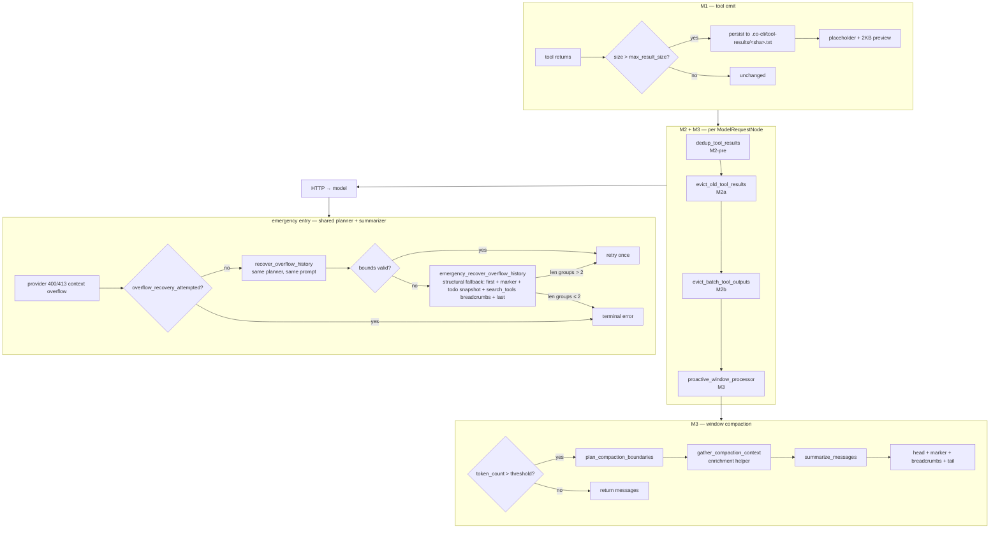
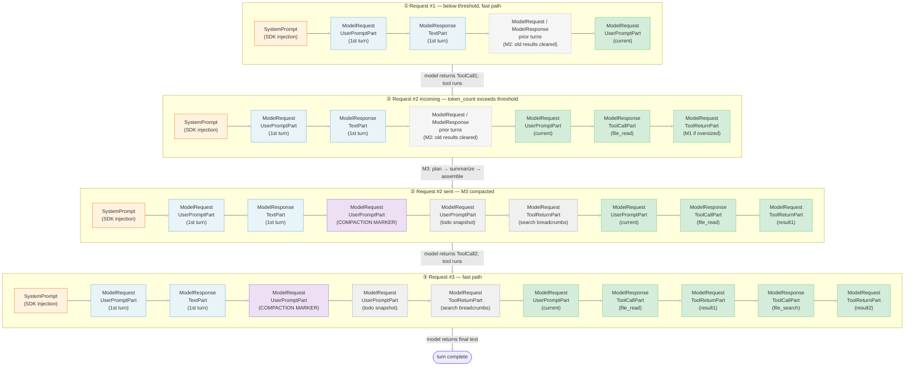
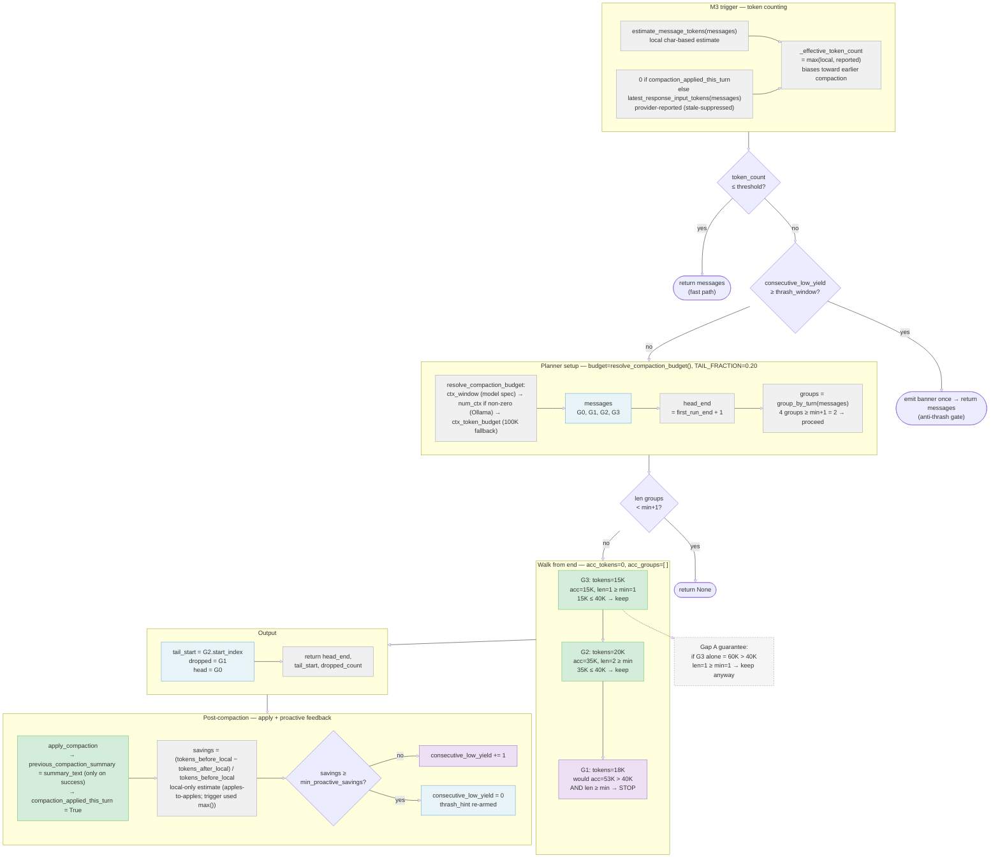
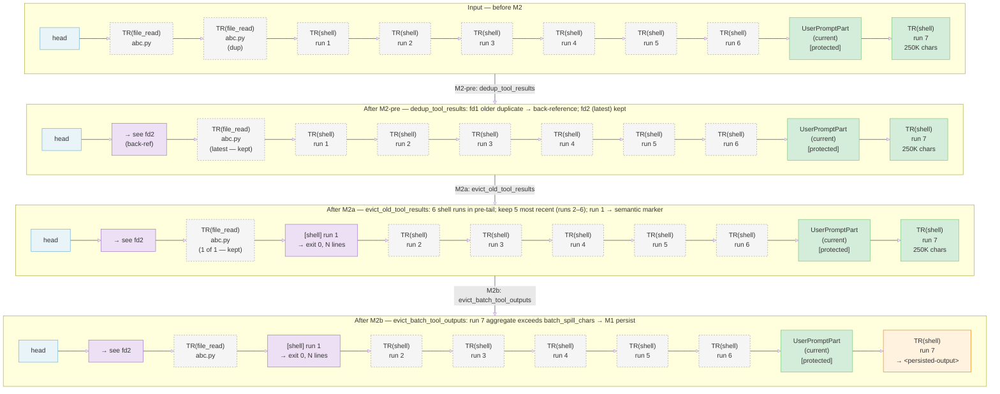
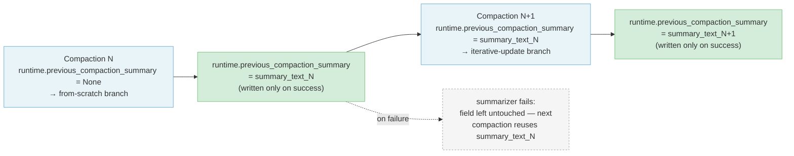

# Co CLI — Compaction System


Covers how co-cli keeps context bounded under pressure. Prompt assembly and history processors live in [prompt-assembly.md](prompt-assembly.md); transcript persistence (including child-session branching after compaction) lives in [memory.md](memory.md); one-turn orchestration and overflow detection in [core-loop.md](core-loop.md); tool emission contracts in [tools.md](tools.md).

## 1. Functional Architecture



Compaction is **three mechanisms** operating at different lifecycle points, plus a user-triggered manual entry, all sharing one summarizer helper and one emergency entry point.

| Mechanism | When | Unit | Reversible? |
|---|---|---|---|
| **M1 — Emit-time cap** | Tool returns | One tool result | Irreversible (content to disk, placeholder in context) |
| **M2 — Prepass recency clearing** | Before every `ModelRequestNode` | Individual parts in older messages | Irreversible for the session (content replaced with placeholder string) |
| **M3 — Window compaction** | Before every `ModelRequestNode`, when `token_count > threshold` | Turn-group range | Lossy (middle replaced by summary marker) |

**Shared helper:** `gather_compaction_context` — enrichment collected from sources that survive M2 (`ToolCallPart.args` for file paths, session todos, prior summaries). Each source is capped independently before joining so a long entry in one cannot starve the others; the joined result is then bounded by a total cap. Called from inside the pure `summarize_dropped_messages` so every LLM-capable compaction path inherits it.

**Emergency entry:** `recover_overflow_history` — same planner, same summarizer, same output shape as M3; gated by provider context-length rejection; one-shot per turn.

**Manual entry:** `/compact [focus]` — user-triggered full-history replacement. Routes through the shared `apply_compaction` helper with bounds `(0, n, n)`, inheriting the same degradation policy as M3 (no-model, circuit-breaker, and provider-failure all fall back to a static marker rather than aborting). The `[focus]` argument threads through to `summarize_messages` for topic emphasis.

**Triggering granularity is per request, not per turn.** pydantic-ai runs `history_processors` before every `ModelRequestNode`. A tool-calling turn with N calls fires N+1 processor passes. Matches the convergent peer pattern (fork-cc: "before request"; codex: pre-turn + mid-turn; hermes: in-loop; opencode: next-loop-pass).

### Diagram 2: In-context composition — happy path, two-tool turn

Assembled prompt at each `ModelRequestNode`. `SystemPrompt` is SDK-injected fresh after `history_processors` run — it is never in the compacted history. Colors reveal compaction structure before M3 fires: blue = head (1st-turn pair, always preserved), gray-dashed = prior-turns middle (M3 drops this), green = tail (current turn, always preserved).



### Diagram 3: In-context composition — overflow recovery

Assembled prompt at each recovery path after a provider context-overflow rejection. `SystemPrompt` is SDK-injected fresh, outside `history_processors` scope. Outer `flowchart LR` puts the decision spine horizontal so the two recovery compositions branch at different heights rather than side by side. Same color scheme as Diagram 2.

```mermaid
flowchart LR
    subgraph Rejected["Over-budget — provider HTTP 400 / 413"]
        direction LR
        rej_sp["SystemPrompt\n(SDK injection)"]:::syspr --> rej_h1["ModelRequest\nUserPromptPart\n(1st turn)"]:::head --> rej_h2["ModelResponse\nTextPart\n(1st turn)"]:::head --> rej_mid["ModelRequest / ModelResponse\nprior turns\n(M2: old results cleared)"]:::prior --> rej_cur["ModelRequest / ModelResponse\nrecent turns"]:::tail
    end

    Decision{bounds\nvalid?}
    EmCheck{len groups\n> 2?}
    Terminal(["terminal:\nlen groups ≤ 2"])
    Done(["turn\ncontinues"])

    subgraph Recovered["Planner-based recovery (bounds valid)"]
        direction LR
        rc_sp["SystemPrompt\n(SDK injection)"]:::syspr --> rc_h1["ModelRequest\nUserPromptPart\n(1st turn)"]:::head --> rc_h2["ModelResponse\nTextPart\n(1st turn)"]:::head --> rc_mk["ModelRequest\nUserPromptPart\n(COMPACTION MARKER)"]:::marker --> rc_td["ModelRequest\nUserPromptPart\n(todo snapshot)"]:::meta --> rc_bc["ModelRequest\nToolReturnPart\n(search breadcrumbs)"]:::meta --> rc_cur["ModelRequest / ModelResponse\ntail turns"]:::tail
    end

    subgraph Emergency["Emergency structural fallback (planner returned None)"]
        direction LR
        em_sp["SystemPrompt\n(SDK injection)"]:::syspr --> em_h1["ModelRequest\nUserPromptPart\n(1st turn)"]:::head --> em_h2["ModelResponse\nTextPart\n(1st turn)"]:::head --> em_mk["ModelRequest\nUserPromptPart\n(static MARKER)"]:::marker --> em_td["ModelRequest\nUserPromptPart\n(todo snapshot)"]:::meta --> em_bc["ModelRequest\nToolReturnPart\n(search breadcrumbs)"]:::meta --> em_last["ModelRequest / ModelResponse\nlast turn group"]:::tail
    end

    Rejected -->|"overflow_recovery_attempted=False"| Decision
    Decision -->|"yes"| Recovered
    Decision -->|"no"| EmCheck
    EmCheck -->|"yes"| Emergency
    EmCheck -->|"no"| Terminal
    Recovered -->|"retry once"| Done
    Emergency -->|"retry once"| Done

    classDef syspr fill:#fff3e0,stroke:#f57c00
    classDef head fill:#e8f4f8,stroke:#6baed6
    classDef prior fill:#f5f5f5,stroke:#9e9e9e,stroke-dasharray:3 3
    classDef marker fill:#ede0f5,stroke:#9c6fc7
    classDef meta fill:#f0f0f0,stroke:#aaa
    classDef tail fill:#d4edda,stroke:#74c476

    class rej_sp,rc_sp,em_sp syspr
    class rej_h1,rej_h2,rc_h1,rc_h2,em_h1,em_h2 head
    class rej_mid prior
    class rej_cur,rc_cur,em_last tail
    class rc_mk,em_mk marker
    class rc_td,rc_bc,em_td,em_bc meta
```



### Diagram 4: M3 trigger and boundary planner

Token counting, threshold gate, anti-thrash gate, and boundary planner walk — the full path from processor entry to `(head_end, tail_start, dropped_count)`. Same color scheme as Diagrams 2 and 3.



### Diagram 5: M2 pre-compaction context compensation pipeline

Message strip at each processor stage for an example conversation with duplicate file reads, six shell runs in the pre-tail region, and an oversized current batch. Processors run in pipeline order on the pre-tail region (everything before the last `UserPromptPart`); M2b additionally fires on the current batch. Same color scheme as Diagrams 2 and 3: gray-dashed = pre-tail content eligible for clearing, green = protected tail, purple = semantic markers and back-references replacing cleared content, orange = M1-persisted placeholder.



## 2. Core Logic

### 2.1 M1 — Emit-time persistence

Spills any single tool result exceeding its per-tool threshold to `.co-cli/tool-results/<sha16>.txt` and replaces the content with a `<persisted-output>` placeholder before the result enters history. Content-addressed (SHA-256 prefix); written once, never rewritten.

**Trigger:** `len(display) > threshold` inside `tool_output()`.

| Tool | `max_result_size` | Note |
|---|---|---|
| Default | `config.tools.result_persist_chars` (50,000) | falls through to config |
| `file_read` | `math.inf` | never persists — prevents persist→read→persist recursion |
| `shell` | 30,000 | explicit override |

Placeholder: `<persisted-output>tool: … file: … size: N chars (X KB/MB)\npreview: first 2000 chars</persisted-output>`. Model retrieves full content via `file_read(path, start_line=, end_line=)`.

### 2.2 M2 — Prepass recency clearing

Four sync processors in order; no LLM calls.

**`dedup_tool_results` (M2-pre)** — collapses identical returns outside the protected tail before recency clearing. For each compactable return whose `(tool_name, sha256(content))` key matches a more recent return of the same tool, replaces content with a 1-line back-reference to the latest `tool_call_id`. Eligibility: string content ≥ 200 chars; non-string and non-compactable tools pass through. (`co_cli/context/_dedup_tool_results.py`)

**`evict_old_tool_results` (M2a)** — protects the last `UserPromptPart` onward; in the pre-tail region keeps the 5 most recent returns per tool in `COMPACTABLE_TOOLS` and replaces older returns with a per-tool semantic marker (`semantic_marker()` in `co_cli/context/_tool_result_markers.py`). Marker carries tool name, 1-3 key args from `ToolCallPart.args` (looked up via a `tool_call_id` index), and a size/outcome signal — e.g. `[shell] ran \`uv run pytest\` → exit 0, 47 lines`, `[file_read] src/foo.py (full, 1,200 chars)`. Non-string content falls back to `_CLEARED_PLACEHOLDER`. `tool_name` and `tool_call_id` preserved; non-compactable tools (writes, approvals) never cleared.

**`evict_batch_tool_outputs` (M2b).** Fires on the current batch — the `ToolReturnPart`s that follow the last `ModelResponse` with a `ToolCallPart`. If the aggregate size of that batch exceeds `config.tools.batch_spill_chars`, spills the largest non-persisted returns via `persist_if_oversized(max_size=0)`, largest-first, until the aggregate fits. Skips already-persisted parts (those containing `<persisted-output>`). Fails open: if persist raises `OSError`, the candidate is skipped. Operates only on the current batch — no cross-turn state mutation.

### 2.3 M3 — Window compaction

**Trigger** (async processor, last in chain, runs before every `ModelRequestNode`):

```
budget = resolve_compaction_budget(config, ctx_window)
reported = 0 if compaction_applied_this_turn else latest_response_input_tokens(messages)
token_count = _effective_token_count(messages, reported)
threshold = int(budget * cfg.compaction_ratio)
if token_count <= threshold: return messages
if consecutive_low_yield_proactive_compactions >= cfg.proactive_thrash_window: return messages
```

**Budget resolution** (`resolve_compaction_budget`): model-reported `ctx_window` → `config.llm.num_ctx` (Ollama override) → `config.llm.ctx_token_budget` (default 100,000).

**Token counting — three functions:**
- `estimate_message_tokens(messages)` — `total_chars // 4` over text-bearing parts and `ToolCallPart.args` (JSON-serialized). Args are included because M2a only clears return content, never call args — omitting them would undercount on tool-heavy transcripts (Gap E fix).
- `latest_response_input_tokens(messages)` — provider-reported input count from the most recent `ModelResponse`. Lags by one turn; zeroed when `compaction_applied_this_turn` because the post-compaction context is smaller than what the provider last counted — using the stale figure would suppress the trigger.
- `_effective_token_count(messages, reported)` — `max(local, reported)`. Local estimate can drift from provider tokenization; provider report lags. Taking the max ensures neither under-count can delay compaction.

**Boundary planner** (`plan_compaction_boundaries`):

```
Inputs: messages, budget, tail_fraction (required)

_MIN_RETAINED_TURN_GROUPS = 1  # hardcoded correctness invariant

1. head_end = find_first_run_end(messages) + 1
2. groups = group_by_turn(messages)
   if len(groups) < _MIN_RETAINED_TURN_GROUPS + 1: return None
3. Walk groups from end, accumulating token estimates:
   tail_budget = tail_fraction * budget
   acc_tokens = 0; acc_groups = []
   for group in reversed(groups):
     gt = estimate_message_tokens(group.messages)
     if len(acc_groups) >= _MIN_RETAINED_TURN_GROUPS and acc_tokens + gt > tail_budget:
       break
     acc_groups.insert(0, group); acc_tokens += gt
4. tail_start = acc_groups[0].start_index
5. Active-user anchoring: if the latest UserPromptPart falls in the dropped middle,
   extend tail_start to that group's start_index.
6. if tail_start <= head_end: return None
7. return (head_end, tail_start, tail_start - head_end)
```

`_MIN_RETAINED_TURN_GROUPS = 1` is a hardcoded correctness invariant — not user-configurable. The last turn group is retained unconditionally even when its tokens alone exceed `tail_fraction * budget`.

**Compaction assembly** (`apply_compaction`) — shared by M3, overflow recovery, and `/compact`:

Summarizes `messages[head_end:tail_start]` via `_gated_summarize_or_none`, then assembles:
`head | marker | [todo_snapshot] | [search breadcrumbs] | tail`

Raw `summary_text` is stored in `ctx.deps.runtime.previous_compaction_summary` before `build_compaction_marker` adds the `[CONTEXT COMPACTION — REFERENCE ONLY]` prefix; on failure the field is left untouched. Sets `compaction_applied_this_turn = True`.

Summarizer surface:
- `_summarization_gate_open(ctx)` — `False` when `ctx.deps.model is None` or circuit breaker tripped (and not at probe cadence).
- `summarize_dropped_messages(ctx, dropped, *, focus, previous_summary=None)` — pure LLM call; raises on failure.
- `_gated_summarize_or_none(...)` — gate + announce + summarizer + validity check + fallback; returns `None` on any failure path (exception, empty/whitespace-only return, or gate closed).

**Marker** — `ModelRequest` / `UserPromptPart` with a `[CONTEXT COMPACTION — REFERENCE ONLY]` prefix, N-message count, `summary_text`, and a verbatim-tail trailer instructing the model to treat the summary as reference, not active instructions. Detection via `startswith(SUMMARY_MARKER_PREFIX)` — shared constant used by both builder and detector.

**Breadcrumb preservation** (`_preserve_search_tool_breadcrumbs`): for each `ModelRequest` in `dropped`, extract only `ToolReturnPart`s whose `tool_name == "search_tools"`. Mixed-batch requests are rebuilt with only those parts — other `ToolReturnPart`s are never carried as orphans. `search_tools` returns are SDK-handled before reaching the provider; other tool results require paired `ToolCallPart`s that providers validate.

**Anti-thrashing** (proactive path only): savings = `(tokens_before − tokens_after) / tokens_before`. Below `min_proactive_savings` increments `consecutive_low_yield_proactive_compactions`; at or above resets it to 0.

**Fail-safe — circuit breaker:**

| State | Behavior |
|---|---|
| `compaction_skip_count == 0` (healthy) | Attempt summarizer; on valid (non-empty) summary keep at 0; on failure or empty return fall back to static marker, increment to 1. |
| `compaction_skip_count == 1 or 2` | Attempt summarizer; on valid summary reset to 0; on failure or empty return fall back to static, increment. |
| `compaction_skip_count >= 3` (tripped) | Skip summarizer; static marker; increment. Every `_COMPACTION_BREAKER_PROBE_EVERY` (10) skips, attempt once — probe success (valid summary) resets to 0. |
| Any valid (non-empty) summary | Reset counter to 0. |

`ctx.deps.model is None` (sub-agent without a configured model) is also a bypass condition.

### 2.4 Enrichment helper

`gather_compaction_context` collects signal that survives M2. Called from `summarize_dropped_messages` so every LLM-capable compaction path inherits it.

| Source | Function | Why it survives M2 |
|---|---|---|
| File paths from `ToolCallPart.args` (`FILE_TOOLS`) | `_gather_file_paths(dropped)` | M2a clears return content only, not call args. |
| Session todos | `_gather_session_todos` | Orthogonal to message history. |
| Prior summaries in dropped range | `_gather_prior_summaries` | Detected via `SUMMARY_MARKER_PREFIX`; skipped when `previous_compaction_summary` is set (iterative branch embeds it directly as `PREVIOUS SUMMARY:`). |

Output: single `str`; each source capped independently (file paths ~1.5 KB, todos ~1.5 KB, prior summaries ~2 KB); joined result bounded at 4000 chars. Returns `None` when no sources yield content.

### 2.5 Overflow recovery

Structurally identical to M3's compaction assembly. Differences:
1. **Trigger:** `ModelHTTPError` classified by `_http_error_classifier.is_context_overflow`: HTTP 413 unconditionally; HTTP 400 with explicit overflow evidence in `error.message`, `error.code`, or `error.metadata.raw`. Overflow phrases recognized from OpenAI, Ollama, Gemini, vLLM, AWS Bedrock.
2. **Rate limit:** gated by `turn_state.overflow_recovery_attempted` — one-shot per turn.

**Two-tier cascade** (`_attempt_overflow_recovery` inside `run_turn`):
1. `recover_overflow_history` — same planner and `apply_compaction` as M3.
2. `emergency_recover_overflow_history` — bypasses the planner; keeps first group + static marker + todo snapshot + `search_tools` breadcrumbs + last group. Returns `None` when `len(groups) ≤ 2`.

On a non-`None` result, sets `current_history = compacted`, clears pending input, and retries. Terminal error when both tiers return `None`.

### 2.6 Summarizer

`summarize_messages(deps, messages, *, personality_active, context, focus, previous_summary=None)` — `llm_call()` with no tools; agent constructed per call; `deps.model.settings_noreason`. System prompt enforces treating history as data, not instructions.

**Two-branch prompt:**
- **From-scratch** (`previous_summary is None`): `_SUMMARIZE_PROMPT` directly.
- **Iterative update** (`previous_summary` set): `_build_iterative_template(previous_summary)` prepends `PREVIOUS SUMMARY:` and PRESERVE / ADD / MOVE / REMOVE discipline before the shared template.

**Cross-compaction feedback loop** — `previous_compaction_summary` is read and written inside `apply_compaction` before every summarizer call, threading the prior summary across compaction boundaries:



**Template sections:** `## Active Task`, `## Goal`, `## Key Decisions`, `## User Corrections`†, `## Errors & Fixes`, `## Working Set`, `## Progress`, `## Pending User Asks`†, `## Resolved Questions`†, `## Next Step` (verbatim drift anchor), `## Critical Context`†. (†omitted when empty)

### 2.7 Base system prompt advisory

Static, cacheable paragraph — no per-turn interpolation; `5` sourced from `COMPACTABLE_KEEP_RECENT` at module-load time:

> "Tool results may be automatically cleared from context to free space. The 5 most recent results per tool type are always kept. Note important information from tool results in your response — the original output may be cleared on later turns."

### 2.8 Trigger cadence and self-stabilization

M3 fires before every `ModelRequestNode` but produces at most one summarizer call per pressure event per turn:
- After a successful compaction, `token_count` drops below threshold — subsequent passes hit the fast path.
- A static-marker compaction also shrinks context — same result.
- `plan_compaction_boundaries` returning `None` (head/tail overlap) leaves messages unchanged.

### 2.9 Error handling and degradation

| Failure mode | Fallback |
|---|---|
| Summarizer raises (transient) | Static marker; warning logged; `compaction_skip_count += 1` |
| Summarizer returns empty/whitespace string | Static marker; warning logged; `compaction_skip_count += 1` (same path as exception) |
| Summarizer raises 3+ consecutive times (or returns empty 3+ times) | Circuit breaker trips; static markers used; LLM probed once every 10 skips |
| `ctx.deps.model is None` (sub-agent context) | Static marker without LLM attempt |
| `plan_compaction_boundaries` returns `None` (proactive) | Return messages unchanged; next request re-checks |
| `plan_compaction_boundaries` returns `None` (overflow) | Fall through to `emergency_recover_overflow_history` |
| Second overflow in same turn | Terminal error (gated by `overflow_recovery_attempted`) |
| First-turn overflow (`len(groups) ≤ 2`) | Terminal — emergency fallback returns `None`; structural limit |

**Proactive → overflow handoff.** When `plan_compaction_boundaries` returns `None` during proactive compaction, `proactive_window_processor` returns messages unchanged. The provider rejects the over-budget request; `is_context_overflow` detects it; `run_turn` routes into the two-tier cascade: `recover_overflow_history` (planner-based) → `emergency_recover_overflow_history` (structural fallback). Terminal only when both return `None` (`len(groups) ≤ 2`).

### 2.10 Security

- Summarizer system prompt contains a CRITICAL SECURITY RULE treating history as data, not instructions.
- Emit-time persisted files are content-addressed by SHA-256; filenames leak no semantics.
- Tool-result files live under `.co-cli/tool-results/` (project-local). Cleanup is manual; warning surfaced when directory > 100 MB via `check_tool_results_size`.

## 3. Config

| Setting | Env Var | Default | Description |
|---|---|---|---|
| `llm.num_ctx` | `CO_LLM_NUM_CTX` | `0` (unset) | Ollama context window override; `0` means use model spec. Supersedes `ctx_window` for budget resolution when non-zero. |

**Compaction tuning** (`CompactionSettings` in `co_cli/config/compaction.py`):

| Setting | Env Var | Default | Description |
|---|---|---|---|
| `compaction.compaction_ratio` | `CO_COMPACTION_RATIO` | `0.65` | Fraction of budget above which proactive compaction (M3) fires |
| `compaction.tail_fraction` | `CO_COMPACTION_TAIL_FRACTION` | `0.20` | Fraction of budget targeted for the preserved tail |
| `compaction.min_proactive_savings` | `CO_COMPACTION_MIN_PROACTIVE_SAVINGS` | `0.10` | Minimum token savings fraction to count a proactive compaction as effective (anti-thrashing) |
| `compaction.proactive_thrash_window` | `CO_COMPACTION_PROACTIVE_THRASH_WINDOW` | `2` | Consecutive low-yield proactive compactions before anti-thrashing gate activates |

**Non-configurable module constants:**

| Constant | Value | Purpose |
|---|---|---|
| `_MIN_RETAINED_TURN_GROUPS` | `1` | Hardcoded correctness invariant — last turn group always retained |
| `COMPACTABLE_KEEP_RECENT` | `5` | M2a: most-recent returns per tool to keep |
| `_COMPACTION_BREAKER_TRIP` | `3` | Consecutive failures that trip the circuit breaker |
| `_COMPACTION_BREAKER_PROBE_EVERY` | `10` | Skips between probe attempts when circuit breaker is tripped |

**M1 and M2b thresholds** (`co_cli/config/tools.py`):

| Setting | Env Var | Default | Description |
|---|---|---|---|
| `tools.result_persist_chars` | `CO_TOOLS_RESULT_PERSIST_CHARS` | `50,000` | M1 default per-tool emit-time persist threshold |
| `tools.batch_spill_chars` | `CO_TOOLS_BATCH_SPILL_CHARS` | `200,000` | M2b aggregate batch budget before spill |

**Per-tool M1 overrides** (set via `@agent_tool(max_result_size=...)` in each tool's own file):

| Tool | `max_result_size` | Notes |
|---|---|---|
| Default | `None` (→ `config.tools.result_persist_chars`) | falls through to config |
| `file_read` | `math.inf` | never persists |
| `shell` | `30,000` chars | explicit override |

## 4. Files

| File | Role |
|---|---|
| `co_cli/config/compaction.py` | `CompactionSettings` — ratios, thresholds, and anti-thrashing knobs. |
| `co_cli/context/compaction.py` | Public entry surface: M3 processor, overflow recovery, `apply_compaction`, summarizer gate, re-exports. |
| `co_cli/context/_compaction_boundaries.py` | Boundary planner: `TurnGroup`, `group_by_turn`, `plan_compaction_boundaries`, active-user anchoring. |
| `co_cli/context/_compaction_markers.py` | Marker builders, `gather_compaction_context` enrichment helper, `SUMMARY_MARKER_PREFIX`. |
| `co_cli/context/_dedup_tool_results.py` | M2-pre dedup helpers: content hash, eligibility predicate (`is_dedup_candidate`), back-reference builder (`build_dedup_part`). |
| `co_cli/context/_history_processors.py` | M2 processors: `dedup_tool_results`, `evict_old_tool_results`, `evict_batch_tool_outputs`. |
| `co_cli/context/_tool_result_markers.py` | `semantic_marker` per-tool format and `is_cleared_marker` predicate. |
| `co_cli/context/summarization.py` | `summarize_messages`, token estimator, budget resolver, and prompt templates. |
| `co_cli/context/_http_error_classifier.py` | `is_context_overflow` — provider overflow detection for 400/413. |
| `co_cli/context/orchestrate.py` | `run_turn` overflow dispatch and anti-thrash gate reset. |
| `co_cli/tools/categories.py` | `COMPACTABLE_TOOLS`, `FILE_TOOLS`, `PATH_NORMALIZATION_TOOLS`. |
| `co_cli/tools/tool_io.py` | M1: `persist_if_oversized`, `tool_output`, `check_tool_results_size`. |
| `co_cli/tools/files/read.py` | `file_read` M1 override: `max_result_size=math.inf` (never persists). |
| `co_cli/tools/shell/execute.py` | `shell` M1 override: `max_result_size=30_000`. |
| `co_cli/config/tools.py` | `ToolsSettings` — `result_persist_chars`, `batch_spill_chars`. |
| `co_cli/config/llm.py` | `num_ctx` (Ollama override), `ctx_token_budget` (fallback budget). |
| `co_cli/context/assembly.py` | Prompt assembly: `assemble_system_prompt`; static `_TOOL_RESULT_ADVISORY` recency-clearing paragraph. |
| `co_cli/context/rules/` | Base system prompt rule files (identity, safety, reasoning, tool protocol, workflow). |
| `evals/eval_compaction_proactive.py` | Proactive compaction end-to-end eval. |
| `evals/eval_compaction_multi_cycle.py` | Multi-cycle compaction fidelity eval. |

## 5. Test Gates

| Property | Test file |
|---|---|
| M1 persist path exercised: oversized batch result spilled to disk, placeholder format confirmed | `tests/test_flow_history_processors.py` |
| M2-pre dedup: identical return collapses to back-reference; short content and distinct content pass through | `tests/test_flow_history_processors.py` |
| M2a `evict_old_tool_results`: clears oldest when over keep limit; keeps all at limit; protects last-turn returns | `tests/test_flow_history_processors.py` |
| M2a `is_cleared_marker` recognizes cleared markers; recent returns left untouched | `tests/test_flow_history_processors.py` |
| M2b `evict_batch_tool_outputs`: spills largest return when aggregate exceeds threshold; passes through when under | `tests/test_flow_history_processors.py` |
| `group_by_turn` correctly partitions multi-turn message list into turn groups | `tests/test_flow_history_processors.py` |
| M3 below-threshold fast path: messages object returned unchanged, no compaction | `tests/test_flow_compaction_proactive.py` |
| M3 above-threshold compaction: result shorter than input, compaction marker present | `tests/test_flow_compaction_proactive.py` |
| M3 anti-thrashing gate: skips compaction after consecutive low-yield passes | `tests/test_flow_compaction_proactive.py` |
| Circuit breaker cadence: counts 0–2 open, 3–12 closed, 13 probe, 14–22 closed, 23 probe | `tests/test_flow_compaction_proactive.py` |
| Circuit breaker counter resets to 0 after a successful (non-empty) LLM compaction | `tests/test_flow_compaction_proactive.py` |
| Boundary planner: valid `(head_end, tail_start, dropped_count)` for 3-turn history | `tests/test_flow_compaction_boundaries.py` |
| Boundary planner: returns `None` when only 1 turn group (nothing to drop) | `tests/test_flow_compaction_boundaries.py` |
| Boundary planner: oversized last-group retained unconditionally even over tail budget | `tests/test_flow_compaction_boundaries.py` |
| `find_first_run_end` anchors at first `TextPart` response, skips tool-only responses | `tests/test_flow_compaction_boundaries.py` |
| `estimate_message_tokens` scales with content length; returns 0 for empty list | `tests/test_flow_compaction_summarization.py` |
| `resolve_compaction_budget` prefers explicit `context_window`; falls back to plausible default | `tests/test_flow_compaction_summarization.py` |
| Summarizer from-scratch branch: returns non-empty structured text | `tests/test_flow_compaction_summarization.py` |
| Summarizer iterative branch: output incorporates prior summary and new turns | `tests/test_flow_compaction_summarization.py` |
| Emergency overflow recovery: pending user turn preserved after structural fallback | `tests/test_flow_compaction_recovery.py` |
| `is_context_overflow`: 413 is unconditional; 400 requires overflow evidence in body | `tests/test_flow_http_error_classifier.py` |
| `/clear` resets all compaction runtime fields to initial state | `tests/test_flow_slash_commands.py` |
