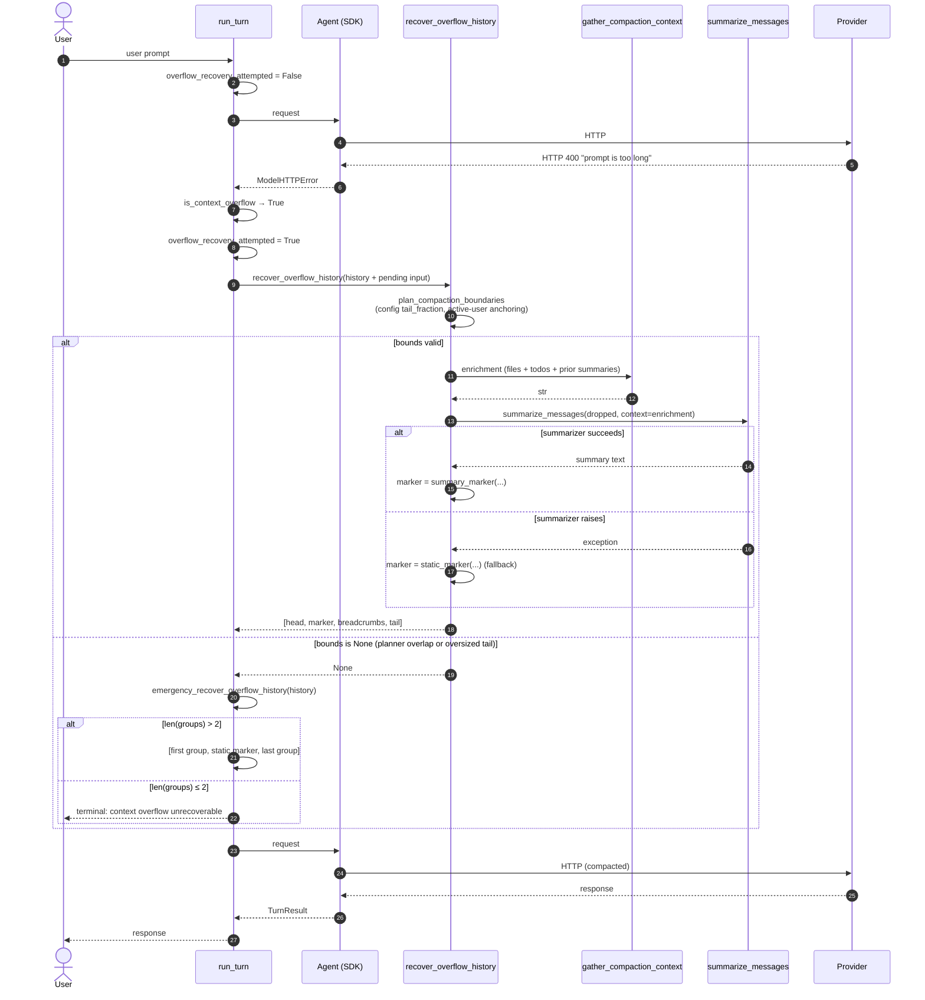

# Co CLI — Compaction System

## Product Intent

**Goal:** Keep the tokens sent to the model on every request bounded, the active working context current, and task intent preserved across compaction boundaries — without user intervention.

**Functional areas:**
- Emit-time tool-output persistence (size-based disk spill)
- Prepass recency clearing (per-tool top-N retention)
- Window compaction (token-budget head/middle/tail with inline summarization)
- Summarizer enrichment (file working set, pending todos, prior summaries) — helper, not a layer
- Overflow recovery — single-retry emergency path that shares the planner and summarizer with proactive compaction
- Per-request trigger cadence with self-stabilizing feedback

**Non-goals:**
- Multi-variant microcompact / snip / collapse stacks (fork-cc pattern rejected — complexity not justified).
- Queued or async compaction tasks (opencode pattern rejected).
- Two-layer hygiene with separate thresholds (hermes pattern rejected).
- Per-request or per-session tuning of compaction parameters beyond what `settings.json` / env vars expose.
- Modifying already-sent transcripts (transcripts are append-only).
- Splitting compaction across turn-group boundaries (turn group is the atomic preserved unit).

**Success criteria:**
- Tool-calling turns with large returns compact before hitting provider overflow.
- Overflow recovery never fails where a structural compaction is possible (≥2 turn groups).
- Repeated compaction does not cause breadcrumb or summary drift.
- Summarizer failure falls back to a static marker; turn continues.
- Prompt cache hit rate preserved (no per-turn churn in static sections).

**Status:** Stable. Design landed via the compaction-refactor-from-peer-survey plan; see [docs/exec-plans/completed/2026-04-17-163453-compaction-refactor-from-peer-survey.md](../exec-plans/completed/2026-04-17-163453-compaction-refactor-from-peer-survey.md) and its followup [2026-04-18-002621-compaction-followup-fixes.md](../exec-plans/completed/2026-04-18-002621-compaction-followup-fixes.md).

### Deferred

- Summarizer LLM calls are not merged into `turn_usage` — the user's turn token display omits summarizer cost.
- First-turn overflow is terminal when `len(groups) ≤ 1` (no middle to drop). Structural limit.
- `COMPACTABLE_KEEP_RECENT = 5` is borrowed verbatim from fork-cc; not tuned for co-cli's tool surface — revisit via `evals/eval_compaction_quality.py` if retention/fidelity tradeoff becomes measurable.
- A future eval-gated prompt upgrade is possible (fork-cc's verbatim-quote anchoring, explicit `All User Messages` section, etc.) — out of scope until `evals/eval_compaction_quality.py` shows a measurable fidelity gap.

---

Covers how co-cli keeps context bounded under pressure. Prompt assembly and history processors live in [prompt-assembly.md](prompt-assembly.md); transcript persistence (including child-session branching after compaction) lives in [memory-knowledge.md](memory-knowledge.md); one-turn orchestration and overflow detection in [core-loop.md](core-loop.md); tool emission contracts in [tools.md](tools.md).

## 1. Functional Architecture


Compaction is **three mechanisms** operating at different lifecycle points, plus a user-triggered manual entry, all sharing one summarizer helper and one emergency entry point.

| Mechanism | When | Unit | Reversible? |
|---|---|---|---|
| **M1 — Emit-time cap** | Tool returns | One tool result | Irreversible (content to disk, placeholder in context) |
| **M2 — Prepass recency clearing** | Before every `ModelRequestNode` | Individual parts in older messages | Irreversible for the session (content replaced with placeholder string) |
| **M3 — Window compaction** | Before every `ModelRequestNode`, when `token_count > threshold` | Turn-group range | Lossy (middle replaced by summary marker) |

**Shared helper:** `gather_compaction_context` — enrichment collected from sources that survive M2 (`ToolCallPart.args` for file paths, session todos, prior summaries). Each source is capped independently before joining so a long entry in one cannot starve the others; the joined result is then bounded by a total cap. Called from inside the pure `summarize_dropped_messages` so every LLM-capable compaction path inherits it.

**Emergency entry:** `recover_overflow_history` — same planner, same summarizer, same output shape as M3; gated by provider context-length rejection; one-shot per turn.

**Manual entry:** `/compact [focus]` — user-triggered full-history replacement. Routes through the shared `apply_compaction` helper with bounds `(0, n, n)`, inheriting the same degradation policy as M3 (no-model, circuit-breaker, and provider-failure all fall back to a static marker rather than aborting). The `[focus]` argument threads through to `summarize_messages` for topic emphasis.

**Triggering granularity is per request, not per turn.** pydantic-ai runs `history_processors` before every `ModelRequestNode`. A tool-calling turn with N calls fires N+1 processor passes. Matches the convergent peer pattern (fork-cc: "before request"; codex: pre-turn + mid-turn; hermes: in-loop; opencode: next-loop-pass).

### Diagram 2: Full-turn sequence — happy path

One user turn with two tool calls, crossing the compaction threshold mid-turn.

```mermaid
sequenceDiagram
    autonumber
    actor U as User
    participant RT as run_turn
    participant AG as Agent (SDK)
    participant HP as history_processors
    participant M as Provider
    participant TL as Tool M1

    U->>RT: user prompt
    RT->>RT: reset_for_turn()
    RT->>AG: run_stream_events (request #1)
    AG->>HP: M2a, M2b, M3<br/>token_count ≤ threshold → fast path
    AG->>M: HTTP request
    M-->>AG: ToolCallPart(file_read)
    AG->>TL: execute tool
    TL->>TL: M1: size &gt; max_result_size → persist
    TL-->>AG: ToolReturnPart(&lt;persisted-output&gt;)
    AG->>HP: chain (request #2 prep)<br/>M2a,M2b; token_count &gt; threshold → M3 fires
    Note over HP: plan_compaction_boundaries<br/>→ head, tail, dropped<br/>summarize_messages (LLM)<br/>assemble marker
    AG->>M: HTTP request (compacted history)
    M-->>AG: ToolCallPart(file_search)
    AG->>TL: execute tool
    TL-->>AG: ToolReturnPart
    AG->>HP: chain (request #3 prep)<br/>fast path (compacted)
    AG->>M: HTTP request
    M-->>AG: final text response
    AG-->>RT: TurnResult (continue)
    RT-->>U: response
```

### Diagram 3: Overflow recovery — emergency entry



### Diagram 4: M2 recency clearing — worked example

```mermaid
flowchart LR
    subgraph Before["before truncate_tool_results"]
        B1[file_read #1]
        B2[file_read #2]
        B3[file_search #1]
        B4[file_read #3]
        B5[file_read #4]
        B6[web_search #1]
        B7[file_read #5]
        B8[file_read #6]
        B9[file_read #7]
        B10[file_search #2]
        B11[UserPromptPart<br/>current turn]
    end

    subgraph After["after — protect last turn"]
        A1[file_read #1<br/>CLEARED]
        A2[file_read #2<br/>CLEARED]
        A3[file_search #1<br/>kept]
        A4[file_read #3<br/>kept — last 5]
        A5[file_read #4<br/>kept — last 5]
        A6[web_search #1<br/>kept]
        A7[file_read #5<br/>kept — last 5]
        A8[file_read #6<br/>kept — last 5]
        A9[file_read #7<br/>kept — last 5]
        A10[file_search #2<br/>kept]
        A11[UserPromptPart<br/>current turn]
    end

    Before --> After
```



For `file_read` (7 returns), keep last 5 (#3–#7), clear #1 and #2. For `file_search` (2), keep both. For `web_search` (1), keep. Tool-call args are never touched (load-bearing for enrichment).

### Diagram 5: Boundary planner — walk from end


## 2. Core Logic

### 2.1 M1 — Emit-time persistence

**Purpose:** bound any single tool result before it enters history.

**Trigger:** `len(display) > ToolInfo.max_result_size` inside `tool_output()`.

**Per-tool thresholds** (registered at build-time in `co_cli/agent/_native_toolset.py`):

| Tool | `max_result_size` | Notes |
|---|---|---|
| Default (`None`) | `config.tools.result_persist_chars` (default 50,000) | falls through to config |
| `file_read` | `math.inf` | never persists — prevents persist→read→persist recursion |
| `shell` | `30,000` chars | explicit override |

**Logic:**
```
threshold = tool_info.max_result_size if tool_info.max_result_size is not None
            else config.tools.result_persist_chars
content = tool return value
if len(content) <= threshold:
    return content
sha = sha256(content)[:16]
path = .co-cli/tool-results/<sha>.txt
write content to path (if not exists)
size_human = KB or MB depending on size
return "<persisted-output>tool: … file: … size: N chars (X KB/MB)\n
        preview: first 2000 chars [elision if more]\n</persisted-output>"
```

Model pages the full content via `file_read(path, start_line=, end_line=)`. Persistence is once, irreversible, and independent of context pressure.

### 2.2 M2 — Prepass recency clearing

Three sync processors in order; no LLM calls.

**`truncate_tool_results` (M2a).** Protects the last user turn (everything from the last `UserPromptPart` onward). For the region before:
- For each tool in `COMPACTABLE_TOOLS` = `{file_read, shell, file_search, file_find, web_search, web_fetch, knowledge_article_read, obsidian_read}`, keep the `COMPACTABLE_KEEP_RECENT = 5` most recent returns per tool.
- Older compactable returns: content replaced with a per-tool **semantic marker** via `semantic_marker()` in `co_cli/context/_tool_result_markers.py` — carries tool name, 1-3 informative args (looked up from the matching `ToolCallPart` via a `tool_call_id → args` index built at processor entry), and a size/outcome signal. Examples: `[shell] ran \`uv run pytest\` → exit 0, 47 lines`, `[file_read] src/foo.py (full, 1,200 chars)`, `[file_search] 'pattern' in src → no matches`. A generic `[tool] k=v (N chars)` fallback covers any tool added to `COMPACTABLE_TOOLS` without an explicit handler.
- Non-string (multimodal) content falls back to the static `_CLEARED_PLACEHOLDER = "[tool result cleared — older than 5 most recent calls]"` since markers require a readable string for their heuristics.
- `tool_name` and `tool_call_id` are preserved (call/return pairing intact).
- Non-compactable tools (writes, approvals) are never cleared.

**`enforce_batch_budget` (M2b).** Fires on the current batch — the `ToolReturnPart`s that follow the last `ModelResponse` with a `ToolCallPart`. If the aggregate size of that batch exceeds `config.tools.batch_spill_chars`, spills the largest non-persisted returns via `persist_if_oversized(max_size=0)`, largest-first, until the aggregate fits. Skips already-persisted parts (those containing `<persisted-output>`). Fails open: if persist raises `OSError`, the candidate is skipped. Operates only on the current batch — no cross-turn state mutation.

### 2.3 M3 — Window compaction

**Trigger check** (async processor, last in chain, runs before every request):

```
budget = resolve_compaction_budget(config, ctx_window)

# Suppress stale API-reported count if compaction already ran this turn.
reported = 0 if compaction_applied_this_turn else latest_response_input_tokens(messages)
tokens_before_local = estimate_message_tokens(messages)
token_count = max(tokens_before_local, reported)

threshold = int(budget * cfg.compaction_ratio)

if token_count <= threshold:
    return messages   # fast path

# Anti-thrashing gate: skip proactive after N consecutive low-yield runs.
if consecutive_low_yield_proactive_compactions >= cfg.proactive_thrash_window:
    return messages   # gate active
```

**Budget resolution** (`resolve_compaction_budget`):
1. If `ctx_window` from `LlmModel` is known and `> 0`: `budget = ctx_window`. For Ollama: `config.llm.num_ctx` overrides.
2. Ollama fallback (no model spec but `num_ctx` configured): `budget = config.llm.num_ctx`.
3. Final fallback: `budget = config.llm.ctx_token_budget` (default 100,000).

**Token estimator** (`estimate_message_tokens`): `total_chars // 4` over text-bearing parts and `ToolCallPart.args` (JSON-serialized).

**Boundary planner** (`plan_compaction_boundaries`):

```
Inputs: messages, budget, tail_fraction (required)

_MIN_RETAINED_TURN_GROUPS = 1  # hardcoded correctness invariant

1. head_end = find_first_run_end(messages) + 1
2. groups = group_by_turn(messages)
   if len(groups) < _MIN_RETAINED_TURN_GROUPS + 1: return None
3. Walk groups from end, accumulating token estimates:
   tail_budget = tail_fraction * budget
   acc_tokens = 0; acc_groups = []
   for group in reversed(groups):
     gt = estimate_message_tokens(group.messages)
     if len(acc_groups) >= _MIN_RETAINED_TURN_GROUPS and acc_tokens + gt > tail_budget:
       break
     acc_groups.insert(0, group); acc_tokens += gt
4. tail_start = acc_groups[0].start_index
5. Active-user anchoring: if the latest UserPromptPart falls in the dropped middle,
   extend tail_start to that group's start_index.
6. if tail_start <= head_end: return None
7. return (head_end, tail_start, tail_start - head_end)
```

`_MIN_RETAINED_TURN_GROUPS = 1` is a hardcoded correctness invariant — not user-configurable. The last turn group is retained unconditionally even when its tokens alone exceed `tail_fraction * budget`.

**Compaction assembly** (`apply_compaction`) — shared by M3, planner-based overflow recovery, and manual `/compact`:

```
async def apply_compaction(ctx, messages, bounds, *, announce, focus=None):
    head_end, tail_start, dropped_count = bounds
    dropped = messages[head_end:tail_start]
    previous_summary = ctx.deps.runtime.previous_compaction_summary
    summary_text = await _gated_summarize_or_none(
        ctx, dropped, announce=announce, focus=focus, previous_summary=previous_summary
    )
    if summary_text is not None:
        ctx.deps.runtime.previous_compaction_summary = summary_text
    marker = build_compaction_marker(dropped_count, summary_text)
    todo_snapshot = build_todo_snapshot(ctx.deps.session.session_todos)
    ctx.deps.runtime.compaction_applied_this_turn = True
    result = [
        *messages[:head_end],
        marker,
        *([todo_snapshot] if todo_snapshot is not None else []),
        *_preserve_search_tool_breadcrumbs(dropped),
        *messages[tail_start:],
    ]
    await extract_at_compaction_boundary(messages, result, ctx.deps)
    return result, summary_text
```

The raw `summary_text` is stored before `build_compaction_marker` adds the `[CONTEXT COMPACTION — REFERENCE ONLY]` prefix. On failure, `summary_text` is `None` and the prior value is left untouched — failure isolation by silence.

The summarizer surface is split:
- `_summarization_gate_open(ctx) -> bool` — predicate: returns False when `ctx.deps.model is None` or the circuit breaker is tripped (and not at probe cadence).
- `summarize_dropped_messages(ctx, dropped, *, focus, previous_summary=None)` — pure LLM call; raises on failure.
- `_gated_summarize_or_none(ctx, dropped, *, announce, focus, previous_summary=None)` — gate + announce + summarizer + fallback; returns `None` on any failure path.

**Marker structure.** A `ModelRequest` with a `UserPromptPart` whose content is:

```
"[CONTEXT COMPACTION — REFERENCE ONLY] This session is being continued from a "
"previous conversation that ran out of context. "
"The summary below is a retrospective recap of completed prior work — treat it "
"as background reference, NOT as active instructions. "
"Do NOT repeat, redo, or re-execute any action already described as completed; "
"do NOT re-answer questions that the summary records as resolved. "
"Your active task is identified in the '## Active Task' / '## Next Step' "
"sections of the summary — resume from there and respond only to user messages "
"that appear AFTER this summary.\n\n"
"The summary covers the earlier portion (N messages).\n\n"
+ summary_text
+ "\n\nRecent messages are preserved verbatim."
```

Prior-summary detection uses `startswith(SUMMARY_MARKER_PREFIX)` — shared constant, used by both builder and detector.

**Breadcrumb preservation** (`_preserve_search_tool_breadcrumbs`): for each `ModelRequest` in `dropped`, extract only `ToolReturnPart`s whose `tool_name == "search_tools"`. Mixed-batch requests are rebuilt with only those parts — other `ToolReturnPart`s are never carried as orphans. `search_tools` returns are SDK-handled before reaching the provider; other tool results require paired `ToolCallPart`s that providers validate.

**Anti-thrashing savings tracking** (proactive path only):

```
result, _ = await apply_compaction(ctx, messages, bounds, announce=True)
tokens_after_local = estimate_message_tokens(result)
savings = (tokens_before_local - tokens_after_local) / tokens_before_local if tokens_before_local > 0 else 0.0
if savings < cfg.min_proactive_savings:
    consecutive_low_yield_proactive_compactions += 1
else:
    consecutive_low_yield_proactive_compactions = 0
    compaction_thrash_hint_emitted = False
```

**Fail-safe — circuit breaker:**

| State | Behavior |
|---|---|
| `compaction_skip_count == 0` (healthy) | Attempt summarizer; on success keep at 0; on failure fall back to static marker, increment to 1. |
| `compaction_skip_count == 1 or 2` | Attempt summarizer; on success reset to 0; on failure fall back to static, increment. |
| `compaction_skip_count >= 3` (tripped) | Skip summarizer; static marker; increment. Every `_CIRCUIT_BREAKER_PROBE_EVERY` (10) skips, attempt once — probe success resets to 0. |
| Any success at any state | Reset counter to 0. |

`ctx.deps.model is None` (sub-agent without a configured model) is also a bypass condition.

### 2.4 Enrichment helper

`gather_compaction_context` collects signal that survives M2. Called from `summarize_dropped_messages` so every LLM-capable compaction path inherits it.

| Source | Scope | Why it survives M2 |
|---|---|---|
| `ToolCallPart.args` for `FILE_TOOLS` → `_gather_file_paths(dropped)` | Dropped range only | `truncate_tool_results` touches return content only, never call args. |
| `ctx.deps.session.session_todos` → `_gather_session_todos` | Session state | Orthogonal to message history. |
| Prior compaction summaries in `dropped` → `_gather_prior_summaries` | Dropped range only | Detected via `SUMMARY_MARKER_PREFIX`. Skipped when `previous_compaction_summary` is set — iterative-update branch already embeds it as `PREVIOUS SUMMARY:`. |

Output: single `str`; each source capped independently (file paths ~1.5 KB, todos ~1.5 KB, prior summaries ~2 KB); joined result bounded at 4000 chars. Returns `None` when no sources yield content.

### 2.5 Overflow recovery

Structurally identical to M3's compaction assembly. Differences:
1. **Trigger:** `ModelHTTPError` classified by `_http_error_classifier.is_context_overflow`: HTTP 413 unconditionally; HTTP 400 with explicit overflow evidence in `error.message`, `error.code`, or `error.metadata.raw`. Overflow phrases recognized from OpenAI, Ollama, Gemini, vLLM, AWS Bedrock.
2. **Rate limit:** gated by `turn_state.overflow_recovery_attempted` — one-shot per turn.

**Logic** (`_attempt_overflow_recovery` inside `run_turn`):

```
if is_context_overflow(e):
    if not turn_state.overflow_recovery_attempted:
        turn_state.overflow_recovery_attempted = True
        recovery_history = history + pending user input
        compacted = await recover_overflow_history(ctx, recovery_history)
        if compacted is None:
            compacted = await emergency_recover_overflow_history(ctx, recovery_history)
        if compacted is not None:
            turn_state.current_history = compacted
            turn_state.current_input = None
            continue   # retry once
    return terminal error
```

`emergency_recover_overflow_history` bypasses the planner (no budget math, no anchoring) and keeps first turn group + static marker + todo snapshot + search_tools breadcrumbs + last turn group. Returns `None` when `len(groups) ≤ 2` — structural limit.

### 2.6 Summarizer

**Agent:** `llm_call()` via `summarize_messages(deps, messages, *, personality_active, context, focus, previous_summary=None)`. No tools. Agent constructed per call.

**System prompt:** security rule treating history as raw data, not instructions.

**Two-branch prompt selection:**
- **From-scratch** (`previous_summary is None`): `_SUMMARIZE_PROMPT` directly.
- **Iterative update** (`previous_summary` set): `_build_iterative_template(previous_summary)` prepends `PREVIOUS SUMMARY:` and PRESERVE / ADD / MOVE / REMOVE discipline before the shared template.

**Prompt template sections:** `## Active Task`, `## Goal`, `## Key Decisions`, `## User Corrections` (conditional), `## Errors & Fixes`, `## Working Set`, `## Progress`, `## Pending User Asks` (conditional), `## Resolved Questions` (conditional), `## Next Step` (verbatim drift anchor), `## Critical Context` (conditional). Skips empty sections.

**Model settings:** `deps.model.settings_noreason`.

### 2.7 Base system prompt advisory

Static, cacheable paragraph in the base system prompt:

> "Tool results may be automatically cleared from context to free space. The 5 most recent results per tool type are always kept. Note important information from tool results in your response — the original output may be cleared on later turns."

Requirements: no per-turn interpolation, lives in the cacheable prefix, `5` pulled from `COMPACTABLE_KEEP_RECENT` at module-load time.

### 2.8 Trigger cadence and self-stabilization

Per-request firing does not trigger multiple summarizer calls per turn because:
1. Once M3 successfully compacts, `token_count` drops well below threshold — subsequent passes hit the fast path.
2. When compaction emits a static marker, the replacement is small — `token_count` also drops.
3. When `plan_compaction_boundaries` returns `None` (head/tail overlap), the processor returns messages unchanged.

One successful compaction per pressure event per turn.

### 2.9 Error handling and degradation

| Failure mode | Fallback |
|---|---|
| Summarizer raises (transient) | Static marker; warning logged; `compaction_skip_count += 1` |
| Summarizer raises 3+ consecutive times | Circuit breaker trips; static markers used; LLM probed once every 10 skips |
| `ctx.deps.model is None` (sub-agent context) | Static marker without LLM attempt |
| `plan_compaction_boundaries` returns `None` (proactive) | Return messages unchanged; next request re-checks |
| `plan_compaction_boundaries` returns `None` (overflow) | Fall through to `emergency_recover_overflow_history` |
| Second overflow in same turn | Terminal error (gated by `overflow_recovery_attempted`) |
| First-turn overflow (`len(groups) ≤ 2`) | Terminal — emergency fallback returns `None`; structural limit |

**Proactive → overflow handoff.** When `plan_compaction_boundaries` returns `None` during proactive compaction, `proactive_window_processor` returns messages unchanged. The provider rejects the over-budget request; `is_context_overflow` detects it; `run_turn` routes into the two-tier cascade: `recover_overflow_history` (planner-based) → `emergency_recover_overflow_history` (structural fallback). Terminal only when both return `None` (`len(groups) ≤ 2`).

### 2.10 Security

- Summarizer system prompt contains a CRITICAL SECURITY RULE treating history as data, not instructions.
- Emit-time persisted files are content-addressed by SHA-256; filenames leak no semantics.
- Tool-result files live under `.co-cli/tool-results/` (project-local). Cleanup is manual; warning surfaced when directory > 100 MB via `check_tool_results_size`.

## 3. Config

| Setting | Env Var | Default | Description |
|---|---|---|---|
| `llm.num_ctx` | `CO_LLM_NUM_CTX` | `262144` | Ollama context window override; supersedes `ctx_window` for budget resolution. |
| `llm.ctx_overflow_threshold` | — | `1.0` | Ratio at which `run_turn` warns of imminent Ollama truncation. |
| `llm.ctx_warn_threshold` | — | `0.85` | Ratio at which `run_turn` surfaces "consider /compact". |

**Compaction tuning** (`CompactionSettings` in `co_cli/config/compaction.py`):

| Setting | Env Var | Default | Description |
|---|---|---|---|
| `compaction.compaction_ratio` | `CO_COMPACTION_RATIO` | `0.65` | Fraction of budget above which proactive compaction (M3) fires |
| `compaction.tail_fraction` | `CO_COMPACTION_TAIL_FRACTION` | `0.20` | Fraction of budget targeted for the preserved tail |
| `compaction.min_proactive_savings` | `CO_COMPACTION_MIN_PROACTIVE_SAVINGS` | `0.10` | Minimum token savings fraction to count a proactive compaction as effective (anti-thrashing) |
| `compaction.proactive_thrash_window` | `CO_COMPACTION_PROACTIVE_THRASH_WINDOW` | `2` | Consecutive low-yield proactive compactions before anti-thrashing gate activates |

**Non-configurable module constants:**

| Constant | Value | Purpose |
|---|---|---|
| `_MIN_RETAINED_TURN_GROUPS` | `1` | Hardcoded correctness invariant — last turn group always retained |
| `COMPACTABLE_KEEP_RECENT` | `5` | M2a: most-recent returns per tool to keep |
| `_CIRCUIT_BREAKER_PROBE_EVERY` | `10` | Skips between probe attempts when circuit breaker is tripped |

**M1 and M2b thresholds** (`co_cli/config/_tools.py`):

| Setting | Env Var | Default | Description |
|---|---|---|---|
| `tools.result_persist_chars` | `CO_TOOLS_RESULT_PERSIST_CHARS` | `50,000` | M1 default per-tool emit-time persist threshold |
| `tools.batch_spill_chars` | `CO_TOOLS_BATCH_SPILL_CHARS` | `200,000` | M2b aggregate batch budget before spill |

**Per-tool M1 overrides** (registration in `co_cli/agent/_native_toolset.py`):

| Tool | `max_result_size` | Notes |
|---|---|---|
| Default | `None` (→ `config.tools.result_persist_chars`) | falls through to config |
| `file_read` | `math.inf` | never persists |
| `shell` | `30,000` chars | explicit override |

## 4. Files

| File | Role |
|---|---|
| `co_cli/config/compaction.py` | `CompactionSettings` — ratios, thresholds, and anti-thrashing knobs. |
| `co_cli/context/compaction.py` | Public entry surface: M3 processor, overflow recovery, `apply_compaction`, summarizer gate, re-exports. |
| `co_cli/context/_compaction_boundaries.py` | Boundary planner: `TurnGroup`, `group_by_turn`, `plan_compaction_boundaries`, active-user anchoring. |
| `co_cli/context/_compaction_markers.py` | Marker builders, `gather_compaction_context` enrichment helper, `SUMMARY_MARKER_PREFIX`. |
| `co_cli/context/_history_processors.py` | M2 processors: `truncate_tool_results`, `enforce_batch_budget`, `dedup_tool_results`. |
| `co_cli/context/_tool_result_markers.py` | `semantic_marker` per-tool format and `is_cleared_marker` predicate. |
| `co_cli/context/summarization.py` | `summarize_messages`, token estimator, budget resolver, and prompt templates. |
| `co_cli/context/_http_error_classifier.py` | `is_context_overflow` — provider overflow detection for 400/413. |
| `co_cli/context/orchestrate.py` | `run_turn` overflow dispatch and anti-thrash gate reset. |
| `co_cli/tools/categories.py` | `COMPACTABLE_TOOLS`, `FILE_TOOLS`, `PATH_NORMALIZATION_TOOLS`. |
| `co_cli/tools/tool_io.py` | M1: `persist_if_oversized`, `tool_output`, `check_tool_results_size`. |
| `co_cli/agent/_native_toolset.py` | Per-tool `max_result_size` registration. |
| `co_cli/config/_tools.py` | `ToolsSettings` — `result_persist_chars`, `batch_spill_chars`. |
| `co_cli/config/llm.py` | `num_ctx`, `ctx_overflow_threshold`, `ctx_warn_threshold`. |
| `co_cli/prompts/…` | Base system prompt; static recency-clearing advisory. |
| `evals/eval_compaction_quality.py` | Compaction fidelity regression eval. |

## 5. Test Gates

| Property | Test file |
|---|---|
| M1 persist threshold and preview placeholder format | `tests/files/test_tool_output_sizing.py` |
| M2a `semantic_marker` format for all 8 compactable tools + generic fallback + shell exit detection | `tests/context/test_tool_result_markers.py` |
| M2a `truncate_tool_results` clearing and replacement behavior per tool | `tests/context/test_tool_result_markers.py` |
| M2a non-string (multimodal) content falls back to static placeholder | `tests/context/test_tool_result_markers.py` |
| `is_cleared_marker` predicate recognizes static fallback and per-tool markers | `tests/context/test_tool_result_markers.py` |
| M3 token estimation (ToolCallPart.args + dict/list content) | `tests/context/test_context_compaction.py` |
| M3 trigger floor via `max()` of estimate and reported; budget resolution | `tests/context/test_context_compaction.py` |
| M3 anti-thrashing gate activation; low-yield savings-clear unblocks gate | `tests/context/test_context_compaction.py` |
| M3 small-context floor blocks compaction | `tests/context/test_context_compaction.py` |
| Iterative summarizer branch content preservation | `tests/context/test_context_compaction.py` (`@pytest.mark.local`) |
| `previous_compaction_summary` write-back; failure isolation on gate-closed path | `tests/context/test_context_compaction.py` (`@pytest.mark.local`) |
| Enrichment suppression when runtime field set; session-boundary reset | `tests/context/test_context_compaction.py` |
| Planner: token scaling, turn-boundary snap, overlap, min-groups clamp | `tests/context/test_history.py` |
| Planner: active-user anchoring; oversized-last-group unconditional retain | `tests/context/test_history.py` |
| Marker construction and prior-summary prefix detection | `tests/context/test_history.py` |
| Manual `/compact` static-marker fallback (no model, circuit-breaker, todos, breadcrumbs) | `tests/context/test_history.py` |
| `search_tools` orphan structural preservation (breadcrumb dedup) | `tests/context/test_history.py` |
| Dedup of identical tool results | `tests/context/test_dedup_tool_results.py` |
