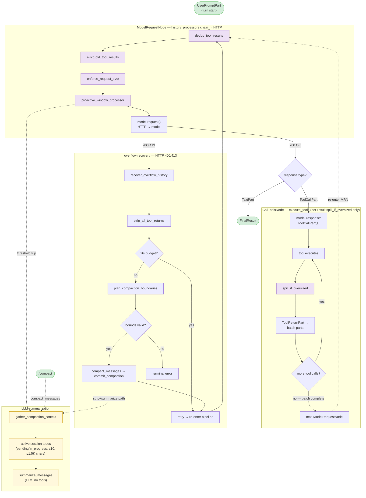

# Co CLI — Compaction System


Covers how co-cli keeps context bounded under pressure. Prompt assembly and history processors live in [prompt-assembly.md](prompt-assembly.md); transcript persistence (in-place rewrite on compaction) lives in [sessions.md](sessions.md); one-turn orchestration and overflow detection in [core-loop.md](core-loop.md); tool emission contracts in [tools.md](tools.md); self-planning capability (todo items, snapshot format, rehydration) in [self-planning.md](self-planning.md).

## 1. Functional Architecture

**Cycle terminology.** A *user turn* runs from one `UserPromptPart` to the final response; it contains one or more *LLM requests* (`ModelRequestNode` → one HTTP call to the model). A turn that drives K tool-call batches fires K+1 LLM requests.

### 1.1 End-to-end trace of one user turn

```
USER PROMPT
  │
  ▼
run_turn() (orchestrate.py:run_turn)
  ├── reset_for_turn()                # clears: turn_usage, status_callback, compaction_applied_this_turn,
  │                                   #          current_request_tokens_estimate
  └── while True:
        await _execute_stream_segment(...)
          │
          ▼  pydantic-ai Agent.run_stream_events
          │
          ┌── ModelRequestNode (pre-flight) ──────────────────────────────────┐
          │   history_processors run IN ORDER:                                │
          │     1. dedup_tool_results          (collapse identical returns)   │
          │     2. evict_old_tool_results      (keep 5 most recent per tool)  │
          │     3. enforce_request_size        (L2 force-spill cap)           │
          │     4. proactive_window_processor  (L3 LLM compaction)            │
          │   model.request() → HTTP                                          │
          └───────────────────────────────────────────────────────────────────┘
          │
          ┌── CallToolsNode (post-response) ──────────────────────────────────┐
          │   CoToolLifecycle hooks:                                          │
          │     before_node_run:    dedup ToolCallParts in one ModelResponse  │
          │     wrap_tool_execute:  L0 cap (MAX_TOOL_CALLS_PER_MODEL_REQUEST=3)  │
          │     before_tool_validate: JSON repair                             │
          │     before_tool_execute: path normalization                       │
          │     [tool runs]                                                   │
          │     after_tool_execute:  MCP-only fallback spill                  │
          │     after_node_run:     L0 telemetry span                         │
          │   tool_output() inside native tools fires L1: spill_if_oversized  │
          └───────────────────────────────────────────────────────────────────┘
          │
          if HTTP 400/413:
            except ModelHTTPError if is_context_overflow(e):
              recover_overflow_history(...)
                strip_all_tool_returns         → if fits: retry            (PATH 1)
                                               → else: plan_compaction_boundaries → compact_messages → commit_compaction (PATH 2)
              turn_state.overflow_recovery_attempted = True (one-shot)
  │
  ▼ FinalResultEvent (response is text, not tool calls)
return TurnResult
  │
  ▼
_finalize_turn()  (main.py)
  persist_session_history(history_compacted=runtime.compaction_applied_this_turn)
                                           └── if True, transcript is REWRITTEN in place, not appended
```

### 1.2 Layered budget stack

| Layer | Where | Trigger | Effect | LLM? |
|---|---|---|---|---|
| **L0** | `lifecycle.wrap_tool_execute` per `ToolCallPart` | `tool_calls_in_model_request > MAX_TOOL_CALLS_PER_MODEL_REQUEST` (= 3) | Reject excess; structured `max_tool_calls_per_model_request_exceeded` payload returned as tool result | No |
| **L1** | `tool_output()` in native tools, `lifecycle.after_tool_execute` for MCP | `len(content) > spill_threshold_chars` (per-tool, default `SPILL_THRESHOLD_CHARS = 4_000`) | Persist to `tool-results/<sha16>.txt`; replace content with `<persisted-output>` placeholder + preview | No |
| **L2** | `enforce_request_size` history processor | `max(static_floor_tokens + estimate_message_tokens, runtime.last_reported_input_tokens) > deps.spill_threshold_tokens` | Force-spill largest unspilled string `ToolReturnPart`s, largest-first, until aggregate ≤ threshold | No |
| **L3** | `proactive_window_processor` history processor | `token_count > compaction_ratio × budget` AND `plan_compaction_boundaries` returns non-`None` | LLM summary + assembly: `head | marker | [todo_snapshot] | [deferred-tool discoveries] | tail`. When the anti-thrash gate is tripped, the same assembly runs with `summarize=False` (static marker, no LLM) — the gate demotes the pass, it never skips it | Yes (static marker fallback when anti-thrash-tripped or breaker-open) |
| **Recovery** | `run_turn` overflow branch | `is_context_overflow(e)` AND `overflow_recovery_attempted == False` | `strip_all_tool_returns`; if still over budget, planner + `compact_messages` + `commit_compaction` on stripped history | Yes (static marker fallback) |
| **Manual** | `/compact [focus]` slash command | User-invoked | `compact_messages` with full-history bounds `(0, n, n)` + `commit_compaction`; same degradation policy as L3 | Yes (static marker fallback) |

L1 / L2 / L3 fast-path when below their threshold. The validator at `config/compaction.py:_validate_shape` enforces `tail_fraction < compaction_ratio` and `spill_ratio ≤ compaction_ratio` so L2 spill (cheap) precedes L3 LLM summarization, and post-compact state always leaves headroom before the trigger re-fires.

All three LLM-capable paths share one primitive — `compact_messages(ctx, messages, bounds, focus, summarize=True)` — which slices, runs the gated summarizer (unless `summarize=False` forces the static path with no LLM call), and assembles `head | marker | [todo_snapshot] | [deferred-tool discoveries] | tail`. Each path then calls `commit_compaction` (the single writer of the three "applied" runtime fields). Proactive layers its own savings / status-callback / OTEL / thrash policy on top inside `proactive_window_processor`, and passes `summarize=False` when its anti-thrash gate is tripped; Recovery and Manual handle their own status messaging upstream. Static vs. summary markers differ only in whether a non-empty summary string is available.

**Why per-request cadence.** Context pressure rises mid-turn — a single tool round can append a 50K-char shell output plus several `file_read` results, pushing the next request over budget before the user speaks again. Per-turn cadence would catch overflow only reactively via HTTP 400/413.

### 1.3 Diagram: Overall compaction pipeline

Mermaid view of the same pipeline shown in §1.1. End-to-end flow: `UserPromptPart` → `ModelRequestNode` pre-flight hook (the **MRN** subgraph — four `history_processors`) → model HTTP → `CallToolsNode` (the **CTN** subgraph — per-result `spill_if_oversized` only); overflow recovery branches off HTTP 400/413. See §2.3 for per-stage message transformation; §2.4 for `enforce_request_size`; §2.5 for `proactive_window_processor` internals.



### 1.4 Diagram: Message-list shape before, during, and after marker insertion

Four `ModelRequestNode` snapshots across a user turn that crosses the compaction threshold mid-turn — Request #1 (fast path) → Request #2 sampled before and after `proactive_window_processor` fires → Request #3 (post-compaction fast path). `SystemPrompt` is SDK-injected fresh on every request and is never part of the compacted history.

```text
①  Request #1  —  fast path  (token_count ≤ compaction_ratio × budget)
─────────────────────────────────────────────────────────────────────
  SystemPrompt                                       ← SDK-injected, never compacted
  ModelRequest    UserPromptPart  (1st turn)         ┐
  ModelResponse   TextPart        (1st turn)         ┘ pinned head
  ModelRequest / ModelResponse    prior turns        ← dedup/evict-cleared in pre-tail
  ModelRequest    UserPromptPart  (current)          ← protected tail

      │  model returns ToolCall1; tool runs
      ▼

②a Request #2  —  BEFORE compaction  (token_count exceeds threshold; processor about to fire)
─────────────────────────────────────────────────────────────────────
  SystemPrompt
  ModelRequest    UserPromptPart  (1st turn)         ┐ pinned head
  ModelResponse   TextPart        (1st turn)         ┘
  ModelRequest / ModelResponse    prior turns        ← dedup/evict-cleared, still present
  ModelRequest    UserPromptPart  (current)          ┐
  ModelResponse   ToolCallPart    (file_read)        │ current turn
  ModelRequest    ToolReturnPart  (spill_if_oversized if oversized)  ┘

      │  proactive_window_processor: plan → summarize → assemble
      │  middle prior turns dropped; head | marker | metadata | tail substituted
      ▼

②b Request #2  —  AFTER compaction  (sent to model with compacted history)
─────────────────────────────────────────────────────────────────────
  SystemPrompt
  ModelRequest    UserPromptPart  (1st turn)         ┐ pinned head
  ModelResponse   TextPart        (1st turn)         ┘
  ModelRequest    UserPromptPart  (COMPACTION MARKER)    ← summary or static
  ModelRequest    UserPromptPart  (todo snapshot)        ┐ metadata
  ModelRequest    ToolReturnPart  (deferred-tool discoveries)   ┘ (carried over)
  ModelRequest    UserPromptPart  (current)          ┐
  ModelResponse   ToolCallPart    (file_read)        │ current turn
  ModelRequest    ToolReturnPart  (result1)          ┘

      │  model returns ToolCall2; tool runs
      ▼

③  Request #3  —  fast path  (marker shrank token_count below threshold; carried forward)
─────────────────────────────────────────────────────────────────────
  SystemPrompt
  ModelRequest    UserPromptPart  (1st turn)         ┐ pinned head
  ModelResponse   TextPart        (1st turn)         ┘
  ModelRequest    UserPromptPart  (COMPACTION MARKER)    ← persists across requests
  ModelRequest    UserPromptPart  (todo snapshot)
  ModelRequest    ToolReturnPart  (deferred-tool discoveries)
  ModelRequest    UserPromptPart  (current)          ┐
  ModelResponse   ToolCallPart    (file_read)        │
  ModelRequest    ToolReturnPart  (result1)          │ two tools resolved
  ModelResponse   ToolCallPart    (file_search)      │
  ModelRequest    ToolReturnPart  (result2)          ┘

      │  model returns final text
      ▼  user turn complete
```

### 1.5 Runtime flag and callback map

Compaction state lives on `CoRuntimeState` (`co_cli/deps.py`). Per-turn fields are cleared by `reset_for_turn()`; cross-turn fields are cleared explicitly by `/new` and `/clear`, plus path-specific resets.

| Field | Written by | Read by | Reset by |
|---|---|---|---|
| `compaction_applied_this_turn` | `commit_compaction` (sole writer; called by `proactive_window_processor`, `recover_overflow_history` both paths, `/compact`) | `proactive_window_processor` (zeros `reported`); `_finalize_turn` (drives transcript rewrite) | `reset_for_turn` |
| `current_request_tokens_estimate` | `enforce_request_size` (always — even fast paths) | `proactive_window_processor` (OTEL only, no logic branch) | `reset_for_turn` |
| `tool_call_limit_run_step`, `tool_calls_in_model_request` | `lifecycle.wrap_tool_execute` per call | L0 cap check + telemetry span | `lifecycle.wrap_tool_execute` on `ctx.run_step` change |
| `last_reported_input_tokens` | `TokenTrackingCapability.after_model_request` from `ModelResponse.usage.input_tokens` (>0); overwritten by `commit_compaction` with the floor-inclusive local post-compaction estimate | `proactive_window_processor` (cross-turn `reported`); `enforce_request_size` (L2 trigger); `_finalize_turn` (OTEL ratio) | `/new`, `/clear` |
| `compaction_skip_count` | `_summarization_gate_open` (block path), `_gated_summarize_or_none` (failure paths) | `_summarization_gate_open` (probe cadence) | `_gated_summarize_or_none` (success → 0) |
| `consecutive_low_yield_proactive_compactions` | `proactive_window_processor` (++ on low yield) | proactive gate; anti-thrash static-marker demotion (`summarize=False`) | proactive on good savings; `_reset_thrash_state` from `recover_overflow_history`; `/compact` |

**Sole callback into the frontend.** `runtime.status_callback` is set by `run_turn` to `frontend.on_status` and is the only frontend hook the processor chain sees — used by `_gated_summarize_or_none` to print "Compacting conversation…" (opening, gate-open paths only) and by `proactive_window_processor` to emit the closing status ("Compacted." / "Compacted (static marker)." for the anti-thrash deliberate skip / "LLM compaction unavailable — used static marker." / "Summarizer failed — used static marker.") via the `_record_proactive_outcome` helper. Recovery and `/compact` emit their own status messaging upstream (via `frontend.on_status` in `orchestrate.py` and `console.print` in the slash command, respectively). Tool progress goes through the separate `tool_progress_callback`.

**Tracked input-token field replaces message-history scanning.** `runtime.last_reported_input_tokens` is the single source of "latest provider-reported input_tokens." Written by `TokenTrackingCapability` after every successful model request whose response carries `usage.input_tokens > 0`. `commit_compaction` overwrites it with the floor-inclusive local post-compaction estimate so the next trigger pass sees the compacted size, not the pre-compaction provider value.

The reported value is **floor-inclusive** (it counts the full input the provider saw — static instructions + tool schemas + history) and is current **cross-turn** by construction. But it is stale or absent *within-turn* in three windows: in-turn growth before the next response updates it; after a within-turn compaction zeroes it (the `compaction_applied_this_turn` short-circuit); and when a response carries no usage. In those windows the local estimate is the sole signal, and `estimate_message_tokens` counts **only the message list** — it omits the static prefill floor. To avoid undercounting live size by up to one floor (~12K tokens), the L2/L3 triggers combine `max(static_floor_tokens + estimate_message_tokens, reported)` — the local half is made floor-inclusive via `effective_request_tokens` (see §2.5). `deps.static_floor_tokens` is the bootstrap-measured floor (static instructions + ALWAYS-visibility tool schemas), immutable after bootstrap like `spill_threshold_tokens`.

## 2. Core Logic

### 2.1 L0 admission cap — `MAX_TOOL_CALLS_PER_MODEL_REQUEST`

L0 caps how many tool calls a single `ModelResponse` can issue (the first row of §1.2). Calls beyond the cap never execute and never produce a `ToolReturnPart` for the lower layers to handle.

**Constant.** `MAX_TOOL_CALLS_PER_MODEL_REQUEST = 3` in `co_cli/tools/tool_call_limit.py`; non-configurable. Sized for small-ollama-model coherence (small models lose plan coherence past ~3 parallel calls per response); 3 non-spilling (≤ 4K char) tool returns aggregate well inside the per-request spill threshold.

**Trigger surface.** `CoToolLifecycle.before_tool_execute` — runs inside `CallToolsNode`, before each tool handler is invoked, on every `ToolCallPart` in the model response.

**Counter mechanics.** `ctx.run_step` increments once per `ModelRequestNode`, so all tool calls from one assistant message share the same `run_step`. When `run_step` changes, `runtime.tool_calls_in_model_request` resets to 0; each call increments before the cap check. The first 3 calls execute normally; calls 4+ are **rejected without running** — the rejection payload is returned as the tool's "result," appended to message history as a `ToolReturnPart`, and seen by the model on the next turn:

```json
{
  "error": "max_tool_calls_per_model_request_exceeded",
  "max": 3,
  "issued": <N>,
  "guidance": "Issued <N> tool calls in one model request; cap is 3. Pick the 3 most important calls and try again."
}
```

**Observability.** `CoToolLifecycle.after_node_run` emits one `tool_budget.enforce_tool_call_limit` span per `CallToolsNode` exit with attributes `tool_calls.limit / issued / allowed / rejected / limit_exceeded` (see `docs/specs/observability.md`).

**Relationship to L1-L3.** L0 is preventive; L1-L3 are reactive. Even with L0 in place:
- A malformed tool returning a 1MB blob still needs L1 (`spill_if_oversized`) to size-cap.
- Multi-batch accumulation across one user turn still needs L2 (`enforce_request_size`) to aggregate-cap the upcoming request.
- Long conversations with non-tool-return pressure still need L3 (`proactive_window_processor`) to window-cap.

L0 just bounds the *worst-case fan-out per turn* so the lower layers can be sized for realistic load instead of pathological model output.

### 2.2 `spill_if_oversized` — Emit-time persistence

Spills any single tool result exceeding its per-tool threshold to `.co-cli/tool-results/<sha16>.txt` and replaces the content with a `<persisted-output>` placeholder before the result enters history. Content-addressed (SHA-256 prefix); written once, never rewritten.

**Trigger:** `len(display) > threshold` inside `tool_output()`.

| Tool | `spill_threshold_chars` | Note |
|---|---|---|
| Default | `SPILL_THRESHOLD_CHARS` (4,000) | module constant in `tool_io.py` |
| `file_read` | `math.inf` | never spills — prevents spill→read→spill recursion |

Placeholder shape — multi-line `<persisted-output>` block carrying a size preamble, `tool:` / `file:` lines, a `file_read` retrieval hint, and a `preview:` of the first `TOOL_RESULT_PREVIEW_CHARS` (1,500) chars (newline-aware truncation past halfway point).

**Why 4,000?** Derivation from context-budget arithmetic against the default Qwen3.5 model with `model_max_ctx = 65,536`.

| Reservation | Tokens | Chars (~4/tok) |
|---|---|---|
| Total context | 65,536 | ~262,000 |
| System prompt + tool schemas | ~8,000 | ~32,000 |
| Generation budget (`max_tokens`) | 4,096 | ~16,000 |
| Compaction marker headroom | ~2,000 | ~8,000 |
| **Working budget** (history + tool calls + tool returns) | **~51,000** | **~204,000** |

L2 spill fires at `spill_ratio × model_max_ctx = 0.5 × 65,536 ≈ 32,768 tokens ≈ 131,000 chars` of total request.

Design target: **~30 tool calls per turn** before any management layer fires — enough headroom for an exploratory agent loop without compacting every few rounds.

```
spill_chars ≈ (working_budget × spill_ratio) / target_tool_calls_per_turn
            ≈  204,000          × 0.5         / 32
            ≈  3,188  →  rounded to 4,000
```

Sensitivity:
- **16K** (4× larger): only ~8 tool calls fit before spill — forces compaction too aggressively.
- **1K** (4× smaller): ~130 tool calls fit, but a 1K-char preview is too short for a useful gist (a single stack trace is often >1.5K).

4,000 is the smallest preview that reliably retains a useful summary of typical shell output — test failure summary lines, directory listing heads, a few error frames — while affording the targeted ~30-call budget.

**Scaling to other context sizes.** Apply the same formula:
- 200K context (frontier model) → working budget ~600K chars → spill ≈ 9,500 chars.
- 1M context → spill ≈ 16,000 chars.

Peers don't expose a directly comparable per-call spill threshold: opencode truncates tool output in place (`TOOL_OUTPUT_MAX_CHARS = 2000` on the compaction path) and hermes preserves it in full until compaction (summarizer input cap `_CONTENT_MAX = 6000`), so neither offers an apples-to-apples anchor for this formula.

**Why `file_read` is exempted (`math.inf`).** File content is the work, not incidental output. The exemption keeps small-to-medium reads inline (~5K–50K chars typical); a few large reads saturate L3's `compaction_ratio` trigger quickly, but that's the right signal — it means the agent is loading enough source to need a checkpoint.

### 2.3 `dedup_tool_results` / `evict_old_tool_results` — Prepass recency clearing

Two sync processors in order; no LLM calls.

**`dedup_tool_results`** — collapses identical returns outside the protected tail before recency clearing. For each tool return whose `(tool_name, sha256(content))` key matches a more recent return of the same tool, replaces content with a 1-line back-reference to the latest `tool_call_id`. Eligibility: string content ≥ 200 chars; non-string and shorter content pass through. (`co_cli/context/_dedup_tool_results.py`)

**`evict_old_tool_results`** — protects the last `UserPromptPart` onward; for every tool name, keeps the 5 most-recent returns in the pre-tail region (counted independently per tool name) and replaces older returns with a semantic marker (`semantic_marker()` in `co_cli/context/_tool_result_markers.py`). Eligibility is content-shape only, not tool selectivity — writes, approvals, and memory ops are all eligible, since their load-bearing state lives outside the return content (file on disk, approval table, `MemoryStore`) and the marker preserves enough trace (tool name + key args + size) for the model to re-fetch if needed. Marker carries tool name, 1-3 key args from `ToolCallPart.args` (looked up via a `tool_call_id` index), and a size/outcome signal — e.g. `[shell_exec] ran \`uv run pytest\` → exit 0, 47 lines`, `[file_read] src/foo.py (full, 1,200 chars)`. Tools without an explicit handler in `_tool_result_markers.py` get a generic `[tool_name] k=v (N chars)` marker. Non-string content falls back to `_CLEARED_PLACEHOLDER`. `tool_name` and `tool_call_id` preserved in the replacement part.

**Worked example — message list state at each stage.** Conversation with duplicate `file_read` returns and six `shell` runs in the pre-tail region. The `═══` line marks the protected-tail boundary; everything below it passes through `dedup_tool_results` and `evict_old_tool_results` untouched. (Round-budget enforcement on the latest batch is not part of this prepass — see §2.4.)

```text
INPUT  (raw history, before any processor)
─────────────────────────────────────────────────────────────────────
  head
  TR(file_read)  abc.py                       ← duplicate of fd2
  TR(file_read)  abc.py                       ← latest copy
  TR(shell)      run 1                        ┐
  TR(shell)      run 2                        │
  TR(shell)      run 3                        │  pre-tail
  TR(shell)      run 4                        │
  TR(shell)      run 5                        │
  TR(shell)      run 6                        ┘
  ═══ UserPromptPart (current turn) ═══════════════════════════
  TR(shell)      run 7

      │
      │  dedup_tool_results
      │    rule: collapse identical (tool_name, content-hash) in pre-tail
      │    finding: fd1 and fd2 share the same content
      ▼

AFTER dedup_tool_results
─────────────────────────────────────────────────────────────────────
  head
  → see fd2  (back-reference, content cleared)
  TR(file_read)  abc.py                       ← latest, kept
  TR(shell)      run 1
  TR(shell)      run 2 .. run 6
  ═══ UserPromptPart ═══════════════════════════════════════════
  TR(shell)      run 7

      │
      │  evict_old_tool_results
      │    rule: keep COMPACTABLE_KEEP_RECENT = 5 most-recent per tool name
      │    finding: 6 shell returns in pre-tail; run 1 is the oldest
      ▼

AFTER evict_old_tool_results
─────────────────────────────────────────────────────────────────────
  head
  → see fd2  (back-reference)
  TR(file_read)  abc.py                       ← 1 of 1, kept
  [shell] run 1 → exit 0, N lines             ← semantic marker (older than 5)
  TR(shell)      run 2 .. run 6               ← 5 most-recent, kept
  ═══ UserPromptPart ═══════════════════════════════════════════
  TR(shell)      run 7
```

### 2.4 `enforce_request_size` — Per-request size control (history processor)

L2's per-request cap. Operates on the **full message list** at `ModelRequestNode` entry — not on a single batch. Implemented as a sync history processor in `co_cli/context/history_processors.py` alongside `dedup_tool_results` and `evict_old_tool_results`. Replaces a prior post-tool-exec hook design (`_enforce_request_budget`) which only saw the just-produced batch and over-fired on small histories while under-firing on multi-batch accumulation.

**Chain placement.** Fires after `dedup_tool_results` and `evict_old_tool_results` (so cheap reductions happen first — no point spilling content the next processor would have deduped) and before `proactive_window_processor` (which fast-paths whenever spill brought total under `compaction_ratio × budget`, sparing the LLM call).

**Scope.** The full message list visible at MRN entry. Walks every `ModelRequest` and collects every string `ToolReturnPart`, regardless of region (no protected tail at this stage — recency protection is `evict_old_tool_results`'s job).

**Skip cases:**

| Condition | `skip_reason` | Behavior |
|---|---|---|
| `total ≤ deps.spill_threshold_tokens` | `below_threshold` | Fast path; no rewrite. Span emitted with `tokens_before == tokens_after`. |
| No string `ToolReturnPart`s in history | `no_candidates` | No rewrite. |
| All candidates already persisted (content starts with `PERSISTED_OUTPUT_TAG`) | `all_spilled` | No rewrite. |
| Spill exhausted candidates but aggregate still > threshold | `fallback_to_summarize` | Returns the (possibly partially-rewritten) message list; `proactive_window_processor` runs next and decides whether to fire LLM summarization. |
| Spill brought aggregate ≤ threshold | `""` (empty) | Rewritten message list returned. |
| Spill `OSError` on a candidate | (per-candidate, counted in `spill_errors`) | That candidate skipped (`new == old`); loop continues. |

**Algorithm.**

1. `total = max(deps.static_floor_tokens + estimate_message_tokens(messages), deps.runtime.last_reported_input_tokens or 0)` — folds the floor-inclusive local estimate (static prefill floor + message list) with the latest provider-reported input-token count to bias toward earlier spilling and to backstop a stale/zeroed/missing report (see §1.5).
2. If `total ≤ deps.spill_threshold_tokens`, fast-path.
3. Walk every `ModelRequest`, collect all `ToolReturnPart`s with string content as candidates. Filter spillable: those whose content does not start with `PERSISTED_OUTPUT_TAG`.
4. Sort spillable largest-first by `len(content)`.
5. Force-spill via `spill_if_oversized(content, deps.tool_results_dir, tool_name, force=True)` until aggregate ≤ threshold or candidates exhaust. Track replacements by `id(part)`. The loop accumulator is tracked in message-only local-char space (`starting_tokens = estimate_message_tokens(messages)` — the non-spillable floor is excluded from the spill budget); the floor-inclusive `max(static_floor_tokens + local, reported)` is the trigger only, not the loop baseline. After spill, `effective_after = max(static_floor_tokens + local_after, reported)` reconstructs the conservative floor-inclusive post-spill estimate for the terminal span and `fallback_to_summarize` gate.
6. Apply rewrites via `_rewrite_tool_returns(messages, len(messages), replacement_for=lambda p: spilled.get(id(p)))` — only messages with rewritten parts are rebuilt; unchanged messages pass through verbatim.

**Span.** `tool_budget.enforce_request_size` — emitted by tracer `co-cli.tool_budget` on every call. Attributes: `budget.context_window_tokens`, `request.threshold_tokens / tokens_before / local_tokens / static_floor_tokens / reported_tokens / tokens_after / candidates_count / spillable_count / spilled_count / spill_errors / spill_fired (bool) / skip_reason`.

**Threshold.** `deps.spill_threshold_tokens = int(spill_ratio × model_max_ctx)`, computed once at bootstrap and cached on `CoDeps`. The `compaction.spill_ratio` knob is validated `≤ compaction_ratio` so post-spill aggregate falls below proactive's trigger and proactive fast-paths. (Runtime side effect on `current_request_tokens_estimate`: see §1.5.)

**Worked example.** Multi-batch turn: history contains three `ModelRequest`s carrying tool returns of 24K chars (≈ 6K tokens) each, plus a small head. Threshold = 6K tokens.

```text
BEFORE enforce_request_size (full message list)
─────────────────────────────────────────────────────────────────────
  ModelRequest    UserPromptPart  (turn start)
  ModelResponse   ToolCallPart    shell
  ModelRequest    ToolReturnPart  shell run 1   [24K chars ≈ 6K tokens]
  ModelResponse   ToolCallPart    shell
  ModelRequest    ToolReturnPart  shell run 2   [24K chars ≈ 6K tokens]
  ModelResponse   ToolCallPart    shell
  ModelRequest    ToolReturnPart  shell run 3   [24K chars ≈ 6K tokens]

      aggregate ≈ 18K tokens > 6K threshold → spill_fired=True
      spillable largest-first: run 1 == run 2 == run 3 (any order)

AFTER enforce_request_size
─────────────────────────────────────────────────────────────────────
  ModelRequest    UserPromptPart  (turn start)
  ModelResponse   ToolCallPart    shell
  ModelRequest    ToolReturnPart  shell run 1   <persisted-output>   ← spilled
  ModelResponse   ToolCallPart    shell
  ModelRequest    ToolReturnPart  shell run 2   <persisted-output>   ← spilled
  ModelResponse   ToolCallPart    shell
  ModelRequest    ToolReturnPart  shell run 3   [24K chars]          ← spill stopped: aggregate ≤ 6K
```

### 2.5 `proactive_window_processor` — Window compaction

**Full path overview.** Trigger → gates → planner → assembly → feedback → commit. The diagram below traces every step inline; framing notes and edge cases follow.

```text
proactive_window_processor — full path

  ─ STEP 1: token counting (combine local + provider-reported) ─
    local_estimate    = effective_request_tokens(deps, messages)
                          = static_floor_tokens + estimate_message_tokens(messages)
                          ↑ floor-inclusive: backstops a stale/zeroed/missing report
    reported_estimate = (
        0  if compaction_applied_this_turn
        else runtime.last_reported_input_tokens or 0
    )
    token_count = max(local_estimate, reported_estimate)
                    ↑ biases toward earlier compaction

  ─ STEP 2: gates (cheap, fail fast) ─────────────────────────────
    if token_count ≤ compaction_ratio × budget
        → return messages              (FAST PATH — below threshold)
    summarize = True
    if consecutive_low_yield ≥ proactive_thrash_window
        → summarize = False            (ANTI-THRASH gate — demote to static
          marker, fall through to STEP 3; never skips the trim)

  ─ STEP 3: boundary planner (plan_compaction_boundaries) ────────
    budget       = resolve_compaction_budget(deps)    (= model_max_ctx)
    head_end     = find_first_run_end(messages) + 1
    groups       = group_by_turn(messages)            e.g., [G0, G1, G2, G3]
    tail_budget  = tail_fraction × budget             e.g., 0.20 × 32K ≈ 6.5K

    if len(groups) < _MIN_RETAINED_TURN_GROUPS + 1 (= 2)
        → return None                  (nothing to drop)

    walk groups from end, accumulate tokens:
        G3:  3K  →  acc=3K, len=1 ≥ min=1, fits 6.5K → keep
        G2:  2K  →  acc=5K, len=2,        fits 6.5K → keep
        G1:  4K  →  acc=9K, len=2,        > 6.5K   → STOP

    tail_start    = G2.start_index
    dropped_range = G1
    head_range    = [0 .. head_end] + G0

    last-group guarantee:
        if G3 alone = 10K > 6.5K, len=1 ≥ min=1 → keep anyway

  ─ STEP 4: assembly (compact_messages — see §2.6) ───────────────
    summary = _gated_summarize_or_none(messages[head_end:tail_start]) if summarize else None
                ↑ anti-thrash gate passes summarize=False → static marker, no LLM
    result  = head | marker | [todo_snapshot] | [deferred-tool discoveries] | tail

  ─ STEP 5: post-compaction feedback (anti-thrash counter) ───────
    savings = (tokens_before − tokens_after) / tokens_before
                tokens_before = max(local, reported)              (local floor-inclusive)
                tokens_after  = static_floor_tokens + estimate_message_tokens(result)
                ↑ both bases floor-inclusive — no savings overstatement
    if savings ≥ min_proactive_savings
        consecutive_low_yield = 0      (re-arm)
    else
        consecutive_low_yield += 1     (steps toward thrash gate)

  ─ STEP 6: commit (last step before return) ─────────────────────
    commit_compaction(ctx, result)           ← sole writer of:
      runtime.compaction_applied_this_turn  = True
      runtime.last_reported_input_tokens    = tokens_after
```

All STEPs above live inside `proactive_window_processor` — the trigger gates (threshold + anti-thrash gate), trigger-check OTEL span, and the post-compaction policy (savings, status callback, OTEL execution attributes, thrash counter, commit) are co-located. STEP 4 calls `compact_messages` — the shared assembly primitive also used by recovery PATH 2 and `/compact`. STEPs 5–6 are bundled in the private helper `_record_proactive_outcome`, which is proactive-only (recovery and `/compact` skip it: they don't track savings, don't fire the closing callback, and `/compact` resets the thrash counter unconditionally upstream). See §2.6 for the assembly logic, enrichment helper, summarizer LLM call, and circuit breaker.

**Single-writer atomicity.** STEPs 4 and 5 happen *before* STEP 6's `commit_compaction` call. If anything between STEP 4 and STEP 6 raises (e.g. `estimate_message_tokens` on malformed content, savings calc edge cases), the exception propagates with runtime untouched; `proactive_window_processor`'s bare `except` returns the original `messages` reference. `commit_compaction` itself computes the token estimate before any write so a token-estimator failure inside the helper also leaves runtime untouched. Partial-commit state cannot leak across turns.

**Token counting:**
- `estimate_message_tokens(messages)` — `total_chars // CHARS_PER_TOKEN` over text parts and JSON-serialized `ToolCallPart.args`. Args are included because `evict_old_tool_results` clears return content only, never call args. Counts the **message list only** — the static prefill floor is not in `messages`. Unchanged consumers: the L2 spill-loop accumulator and `dedup_tool_results`.
- `deps.static_floor_tokens` — bootstrap-measured floor: `estimate_text_tokens(build_static_instructions(config))` + ALWAYS-visibility tool-schema tokens (measured by `measure_always_schema_budget`). Immutable after bootstrap, like `spill_threshold_tokens`. Because it is measured live from config + toolset, it auto-updates when rules or tools change.
- `effective_request_tokens(deps, messages)` — `static_floor_tokens + estimate_message_tokens(messages)`; the floor-inclusive local estimate used by the L2 and L3 triggers (and `commit_compaction`'s post-compaction overwrite) so a stale/zeroed/missing report cannot undercount live size by one floor (see §1.5).
- `runtime.last_reported_input_tokens` — latest provider-reported `ModelResponse.usage.input_tokens`, written by `TokenTrackingCapability`; overwritten by `commit_compaction` with the floor-inclusive local post-compaction estimate; zeroed by the trigger when `compaction_applied_this_turn` (within-turn re-trigger short-circuit).
- effective token count — `max(effective_request_tokens(deps, messages), reported)`; biases toward earlier compaction.

**Budget resolution.** `resolve_compaction_budget(deps)` returns `deps.model_max_ctx` (Ollama probe capped by `config.llm.max_ctx`, set at bootstrap).

**Boundary planner invariant.** `_MIN_RETAINED_TURN_GROUPS = 1` is non-configurable: the last turn group is retained unconditionally even when its tokens alone exceed `tail_fraction × budget`. Since `group_by_turn` splits at every `UserPromptPart`, this also guarantees `tail_start ≤ latest_user_idx` — active-user anchoring needs no explicit step.

Edge cases: returns `None` when `len(groups) < 2` or when the backward walk produces `tail_start ≤ head_end` (head and tail would overlap).

### 2.6 Summarizer pipeline

| Caller | Entry point |
|---|---|
| L3 proactive (§2.5) | `compact_messages` (called from `proactive_window_processor`) |
| Overflow recovery PATH 2 (§2.7) | `compact_messages` (called from `recover_overflow_history`) |
| `/compact` | `compact_messages` (called from the slash command) |

All three callers use the same primitive `compact_messages(ctx, messages, bounds, focus)` and follow it with `commit_compaction(ctx, result)` to write the three runtime "applied" fields atomically. Proactive layers additional policy on top (savings, closing status callback, OTEL execution attributes, thrash counter) via the private helper `_record_proactive_outcome`.

The pipeline has four stages: assemble (`compact_messages`) → gate (`_summarization_gate_open` + circuit breaker) → enrich (`gather_compaction_context`) → summarize (`summarize_messages`). Static-marker fallback short-circuits the LLM call but reuses the same assembly.

```
proactive_window_processor          recover_overflow_history          /compact slash command
  (L3 proactive)                      (overflow PATH 2)                 (manual)
        └──────────────────────────────────┬──────────────────────────────────┘
               compact_messages(ctx, messages, bounds, focus, summarize=True)
               │  slices messages by bounds, runs gated summarizer over dropped
               │  middle (skipped → static marker when summarize=False)
               │  returns (result, summary_text) — does NOT write runtime
                    ├── _gated_summarize_or_none(dropped)
                    │        ├── _summarization_gate_open      ← False if model=None or circuit breaker tripped
                    │        │     announces "Compacting conversation…" on gate-open paths
                    │        └── summarize_dropped_messages
                    │                 ├── gather_compaction_context
                    │                 │        └── _gather_session_todos   ← active only (≤10, ≤1.5K chars)
                    │                 │              session-orthogonal; file paths / prior summaries
                    │                 │              are recoverable from history, so handled LLM-side
                    │                 └── summarize_messages    ← llm_call(), no tools; _SUMMARIZE_PROMPT
                    │                       prior summaries via message_history as SUMMARY_MARKER_PREFIX
                    │                       carry-forward rule handles PENDING→RESOLVED across cycles
                    │
                    ├── build_compaction_marker(len(dropped), summary_text, has_tail)
                    │        has_tail=True  (proactive/overflow) → "Recent messages are preserved verbatim."
                    │        has_tail=False (/compact)           → "Continue the conversation from the user's next message."
                    │        static_marker fallback uses STATIC_MARKER_PREFIX, same shape minus summary_text
                    └── _preserve_deferred_tool_discoveries(dropped)
                             ← restores the deferred-tool discovery state the SDK rebuilds from history; orphans dropped
```

**Runtime commit — `commit_compaction(ctx, result)`.** `compact_messages` returns without touching `runtime.*`. Every caller — including recovery PATH 1 (strip-only-fits, no LLM, no marker) — invokes `commit_compaction` as the last step before returning. `commit_compaction` is the **sole writer** of `compaction_applied_this_turn` and the only post-compaction overwriter of `last_reported_input_tokens` (written floor-inclusive via `effective_request_tokens` so the stored value matches a real provider report's scope); the token estimate is computed before any field write so a token-estimator failure leaves runtime untouched (single-writer atomicity).

| Caller | Calls | Extra side effects (all proactive-only) |
|---|---|---|
| `proactive_window_processor` | `compact_messages` (with `summarize=False` when the anti-thrash gate is tripped) → `_record_proactive_outcome` (which calls `commit_compaction`) | savings calc, closing status callback ("Compacted." / "Compacted (static marker)." / "LLM compaction unavailable…" / "Summarizer failed…"), OTEL execution attributes, thrash counter update |
| `recover_overflow_history` PATH 1 | `commit_compaction(ctx, stripped)` directly | no LLM call, no marker; resets thrash via `_reset_thrash_state` |
| `recover_overflow_history` PATH 2 | `compact_messages` → `commit_compaction` | resets thrash via `_reset_thrash_state` |
| `/compact` slash command | `compact_messages` → `commit_compaction` | console-print status messaging upstream; resets thrash unconditionally |

After the turn, `_finalize_turn()` reads `compaction_applied_this_turn` and passes `history_compacted=True` to `persist_session_history()`, which rewrites the transcript in place instead of appending.

**`summarize_messages` output structure** (`_SUMMARIZE_PROMPT`; †omitted when empty):

```
  ## Active Task
  ## Goal
  ## Constraints & Preferences
  ## Key Decisions
  ## User Corrections        †
  ## Errors & Fixes
  ## Completed Actions
  ## In Progress
  ## Remaining Work
  ## Working Set
  ## Pending User Asks       †
  ## Resolved Questions      †
  ## Next Step               ← verbatim drift anchor
  ## Critical Context        †
```

**Summary output budget.** The summarizer output is bounded *proportionally to the region it compresses* (`resolve_summary_budget` in `summarization.py`), instead of drifting toward the flat noreason ceiling (8192 on Ollama):

```
budget = clamp(SUMMARY_BUDGET_RATIO × estimate_message_tokens(dropped), FLOOR, CEIL)
```

`budget` drives two levers:
- **Prompt target (soft)** — the prompt carries `Target ~{budget} tokens` (replaces the old bare "Be concise"), giving the model a goal rather than letting it fill toward the ceiling.
- **Hard cap (load-bearing)** — `max_tokens = min(ceil(budget × SUMMARY_CAP_OVERSHOOT_RATIO), noreason_ceiling)` passed to the summarizer `llm_call` via `model_settings` (`cap_output_tokens` in `config/llm.py`), applied in Ollama lockstep (scalar + `extra_body["max_tokens"]` together; Gemini sets only the scalar). memory-merge and judge calls keep the unmodified `settings_noreason` — only the summarizer call is capped. The cushion is overshoot tolerance, not a bare cut-off margin — a named constant tunable from traces (the summarizer's parent `compaction.proactive_check` span carries `co.compaction.summary.budget` / `.cap` / `.focus`; the child `llm_call` span carries `co.model.tokens.output`).

| Const | Value | Effect |
|---|---|---|
| `SUMMARY_BUDGET_RATIO` | 0.25 | aim the summary at ~¼ of the compressed region |
| `SUMMARY_BUDGET_FLOOR` | 2 000 | cap floor = 2 000 × 1.3 = **2 600** — clears the fixed-section template scaffold + the two mandatory verbatim quotes (`## Active Task`, `## Next Step`), so a small region never truncates mid-structure |
| `SUMMARY_BUDGET_CEIL` | 6 000 | cap ceil = 6 000 × 1.3 = **7 800 < 8 192** noreason ceiling — bloat bounded, override never exceeds the hard ceiling |
| `SUMMARY_CAP_OVERSHOOT_RATIO` | 1.3 | overshoot cushion: hard cap = `budget × this`. Deliberately loose (a bare cut-off margin would be ~1.04–1.13); named for trace-driven tuning |

(Origin and full peer comparison: `docs/reference/RESEARCH-summarization-prompting-peer-survey.md`.)

**Circuit breaker.**

| `compaction_skip_count` | Behavior |
|---|---|
| `0–2` (healthy) | Attempt summarizer. Valid summary → reset to 0. Failure or empty → static marker, increment. |
| `≥ 3` (tripped) | Skip summarizer; static marker; increment. Probe once every `_COMPACTION_BREAKER_PROBE_EVERY` (10) skips — success resets to 0. |

`ctx.deps.model is None` is also a bypass — static marker without LLM attempt, no counter change.

### 2.7 Overflow recovery

Single-tier strip-then-summarize. Inlined in `run_turn`'s overflow branch (no separate orchestrator helper).

1. **Trigger:** `ModelHTTPError` classified by `_http_error_classifier.is_context_overflow`: HTTP 413 unconditionally; HTTP 400 with explicit overflow evidence in `error.message`, `error.code`, or `error.metadata.raw`. Overflow phrases recognized from OpenAI, Ollama, Gemini, vLLM, AWS Bedrock.
2. **Rate limit:** gated by `turn_state.overflow_recovery_attempted` — one-shot per turn.

**Algorithm** (`recover_overflow_history`, cascade flow shown in Diagram 1's `OVF` subgraph):

1. **Strip** every `ToolReturnPart` to a per-tool semantic marker via `strip_all_tool_returns`. No recency cap, no boundary protection — every tool return, including writes / approvals / memory ops, collapses to a one-line stub. Pairing is preserved (only `.content` is rewritten; `tool_name` and `tool_call_id` survive). Idempotent: returns whose content is already a marker (`is_cleared_marker(content)` true) pass through unchanged so re-running over an EVICT-stripped history does not degrade the size signal. Differs from `evict_old_tool_results` only in scope (universal vs. recency-protected), not in tool selectivity — both share the same content-shape eligibility.
2. **PATH 1 — Budget gate.** If `estimate_message_tokens(stripped) <= budget`, call `commit_compaction(ctx, stripped)` and return the stripped history. No LLM call, no marker.
3. **PATH 2 — Summarize.** Else run `plan_compaction_boundaries(stripped, budget, tail_fraction)`; if the planner returns `None` (`len(groups) < 2`, or `tail_start <= head_end`), terminal error. Otherwise call `compact_messages(ctx, stripped, bounds, focus=None)` to compose the marker and assemble the result, then `commit_compaction(ctx, result)` to write runtime atomically.
4. **Reset thrash.** Both return paths call `_reset_thrash_state(ctx)` — recovery proves the system needed to compact, so the next proactive run is unblocked. The shared primitive `compact_messages` does NOT touch thrash state (it's policy-free); proactive callers manage their own thrash gate via `_record_proactive_outcome`.

**Message-list shape at each path:**

```text
PATH 1 — strip-only-fits (budget met after strip)
─────────────────────────────────────────────────────────────────────
  SystemPrompt
  ModelRequest    UserPromptPart   (1st turn)
  ModelResponse   TextPart / ToolCallPart
  ModelRequest    ToolReturnPart   ← content rewritten to "[tool_name] …"
  ...                              ← every ToolReturnPart stripped
  ModelRequest    UserPromptPart   (pending — preserved at tail)

      │  retry once with stripped history
      ▼  user turn continues


PATH 2 — strip + summarize (budget still exceeded after strip)
─────────────────────────────────────────────────────────────────────
  SystemPrompt
  ModelRequest    UserPromptPart   (1st turn)         ┐ pinned head
  ModelResponse   TextPart         (1st turn)         ┘
  ModelRequest    UserPromptPart   (COMPACTION MARKER)    ← summary or static
  ModelRequest    UserPromptPart   (todo snapshot)
  ModelRequest    ToolReturnPart   (deferred-tool discoveries)
  ModelRequest / ModelResponse    tail turns          ← retained, returns stripped

      │  retry once
      ▼  user turn continues
```

On a non-`None` result, `run_turn` sets `current_history = compacted`, clears pending input, emits `"Context overflow — compacting and retrying..."`, and retries. Terminal error (`"Context overflow — unrecoverable."`) on `None` or on a second overflow in the same turn.

### 2.8 Recovery signal at the marker

co does not pre-announce the recency-clearing mechanism in the system prompt. Recovery affordance lives in the marker text itself: content-fetch handlers in `semantic_marker` (`file_read`, `web_fetch`, populated `file_search` / `web_search`) append an `— read on demand` / `— fetch on demand` / `— re-query on demand` suffix. Side-effect tools (`shell_exec`) and the generic fallback do not — re-running a side effect is incorrect, and unknown semantics cannot justify a recovery directive.

Peer parity: hermes embeds an inline `Use file tools to read the full file.` in its truncation marker; openclaw uses a bare `[... N more characters truncated]`. Co matches hermes' approach on the recovery-hint axis while keeping the marker self-contained.

### 2.9 Error handling and degradation

| Failure mode | Fallback |
|---|---|
| Summarizer raises OR returns empty/whitespace | Static marker; warning logged; `compaction_skip_count += 1` |
| `compaction_skip_count >= 3` | Circuit breaker tripped — static markers used; LLM probed once every 10 skips |
| `ctx.deps.model is None` (sub-agent context) | Static marker without LLM attempt |
| `plan_compaction_boundaries` returns `None` (proactive) | Return messages unchanged; provider may then reject → overflow path |
| `plan_compaction_boundaries` returns `None` (overflow, after strip) | `recover_overflow_history` returns `None`; caller emits `"Context overflow — unrecoverable."` |
| Second overflow in same turn | Terminal error (gated by `overflow_recovery_attempted`) |

### 2.10 Security

- Summarizer system prompt contains a CRITICAL SECURITY RULE treating history as data, not instructions.
- Emit-time persisted files are content-addressed by SHA-256; filenames leak no semantics.
- Tool-result files live under `.co-cli/tool-results/` (project-local). Cleanup is manual; warning surfaced when directory > 100 MB via `check_tool_results_size`.

## 3. Config

| Setting | Env Var | Default | Description |
|---|---|---|---|
| `llm.max_ctx` | — | `65536` | Ceiling on the Ollama-probed context window; `deps.model_max_ctx = min(probe, max_ctx)`. Used as the compaction budget. |

**Compaction tuning** (`CompactionSettings` in `co_cli/config/compaction.py`):

| Setting | Env Var | Default | Description |
|---|---|---|---|
| `compaction.compaction_ratio` | `CO_COMPACTION_RATIO` | `0.50` | Fraction of budget above which `proactive_window_processor` fires |
| `compaction.tail_fraction` | `CO_COMPACTION_TAIL_FRACTION` | `0.20` | Fraction of budget targeted for the preserved tail |
| `compaction.spill_ratio` | `CO_COMPACTION_SPILL_RATIO` | `0.50` | Fraction of context window above which `enforce_request_size` force-spills tool returns. Validated `≤ compaction_ratio` so post-spill aggregate falls below proactive's trigger and proactive fast-paths. |
| `compaction.min_proactive_savings` | `CO_COMPACTION_MIN_PROACTIVE_SAVINGS` | `0.10` | Minimum token savings fraction to count a proactive compaction as effective (anti-thrashing) |
| `compaction.proactive_thrash_window` | `CO_COMPACTION_PROACTIVE_THRASH_WINDOW` | `2` | Consecutive low-yield proactive compactions before anti-thrashing gate activates |

**Non-configurable module constants:**

| Constant | Source | Value | Purpose |
|---|---|---|---|
| `_MIN_RETAINED_TURN_GROUPS` | `co_cli/context/_compaction_boundaries.py` | `1` | Hardcoded correctness invariant — last turn group always retained |
| `COMPACTABLE_KEEP_RECENT` | `co_cli/context/history_processors.py` | `5` | `evict_old_tool_results`: most-recent returns per tool to keep |
| `_COMPACTION_BREAKER_TRIP` | `co_cli/context/compaction.py` | `3` | Consecutive failures that trip the circuit breaker |
| `_COMPACTION_BREAKER_PROBE_EVERY` | `co_cli/context/compaction.py` | `10` | Skips between probe attempts when circuit breaker is tripped |
| `MAX_TOOL_CALLS_PER_MODEL_REQUEST` | `co_cli/tools/tool_call_limit.py` | `3` | L0 admission cap on tool calls per `ModelResponse` (see §2.1) |

**Spill / request-budget constants** (module-level; not user-configurable):

| Constant | Source | Value | Purpose |
|---|---|---|---|
| `SPILL_THRESHOLD_CHARS` | `co_cli/tools/tool_io.py` | `4,000` | `spill_if_oversized` default per-tool emit-time spill threshold |
| `TOOL_RESULT_PREVIEW_CHARS` | `co_cli/tools/tool_io.py` | `1,500` | Preview chars included in the `<persisted-output>` placeholder |
| `CHARS_PER_TOKEN` | `co_cli/context/tokens.py` | `4` | Fast chars→tokens proxy used by `enforce_request_size` aggregate estimate |

**Enrichment char caps** (module-level; not user-configurable; see §2.6 callstack diagram for usage):

| Constant | Source | Value | Purpose |
|---|---|---|---|
| `_TODOS_MAX_CHARS` | `co_cli/context/_compaction_markers.py` | `1,500` | Hard cap on the active-todos enrichment block |

Per-tool `spill_threshold_chars` overrides are set via `@agent_tool(spill_threshold_chars=...)` in each tool's own file — see the table in §2.2.

## 4. Public Interface

### Shared assembly primitive

| Symbol | Source | Contract |
|---|---|---|
| `compact_messages(ctx, messages, bounds, focus, summarize=True) -> tuple[list[ModelMessage], str \| None]` | `co_cli/context/compaction.py` | Async — slices messages by `(head_end, tail_start, dropped_count)`, runs the gated summarizer (skipped when `summarize=False` → static marker, no LLM), assembles `head \| marker \| [todo_snapshot] \| [deferred-tool discoveries] \| tail`; does NOT write runtime |
| `commit_compaction(ctx, result) -> None` | `co_cli/context/compaction.py` | Sole writer of `compaction_applied_this_turn`; overwrites `last_reported_input_tokens` with the floor-inclusive local post-compaction estimate |

### Compaction entry points

| Symbol | Source | Contract |
|---|---|---|
| `proactive_window_processor(ctx, messages) -> list[ModelMessage]` | `co_cli/context/compaction.py` | History processor — L3 LLM compaction at compaction_ratio with anti-thrash + circuit-breaker policy |
| `recover_overflow_history(ctx, messages) -> list[ModelMessage] \| None` | `co_cli/context/compaction.py` | Async — HTTP 400/413 strip-then-summarize recovery; returns `None` if planner cannot find bounds |
| `summarize_messages(deps, messages, focus=None, prior_summary=None) -> str` | `co_cli/context/summarization.py` | Async — LLM summarizer (no tools); structured `_SUMMARIZE_PROMPT` template |
| `resolve_compaction_budget(deps) -> int` | `co_cli/context/summarization.py` | Returns `deps.model_max_ctx` (Ollama-probe-capped at bootstrap) |
| `estimate_message_tokens(messages) -> int` | `co_cli/context/summarization.py` | `total_chars // CHARS_PER_TOKEN` over text parts and JSON-serialized `ToolCallPart.args` (message list only) |
| `effective_request_tokens(deps, messages) -> int` | `co_cli/context/summarization.py` | `deps.static_floor_tokens + estimate_message_tokens(messages)` — floor-inclusive local estimate for the L2/L3 triggers |
| `measure_always_schema_budget(deps) -> AlwaysSchemaBudget` | `co_cli/bootstrap/schema_budget.py` | Async — measures the ALWAYS-visibility tool-schema chars; shared by bootstrap (`static_floor_tokens`) and the schema-budget guard |

### Registered history processors

| Symbol | Source | Contract |
|---|---|---|
| `dedup_tool_results(ctx, messages)` | `co_cli/context/history_processors.py` | Collapses identical `(tool_name, content-hash)` returns in pre-tail to back-references |
| `evict_old_tool_results(ctx, messages)` | `co_cli/context/history_processors.py` | Clears tool returns older than `COMPACTABLE_KEEP_RECENT` per tool name |
| `enforce_request_size(ctx, messages)` | `co_cli/context/history_processors.py` | Force-spills largest unspilled `ToolReturnPart`s when total tokens exceed `deps.spill_threshold_tokens` |
| `strip_all_tool_returns(messages) -> list[ModelMessage]` | `co_cli/context/history_processors.py` | Recovery helper: replaces every `ToolReturnPart` content with a per-tool marker; idempotent |

### Spill emission

| Symbol | Source | Contract |
|---|---|---|
| `spill_if_oversized(content, tool_results_dir, tool_name, force=False, threshold=SPILL_THRESHOLD_CHARS) -> str` | `co_cli/tools/tool_io.py` | Persist oversized content to `tool-results/<sha16>.txt`; returns inline `<persisted-output>` placeholder |
| `SPILL_THRESHOLD_CHARS = 4_000`, `TOOL_RESULT_PREVIEW_CHARS = 1_500` | `co_cli/tools/tool_io.py` | Module constants (non-configurable) |
| `MAX_TOOL_CALLS_PER_MODEL_REQUEST = 3` | `co_cli/tools/tool_call_limit.py` | L0 admission cap; non-configurable |

### Error classification

| Symbol | Source | Contract |
|---|---|---|
| `is_context_overflow(exc) -> bool` | `co_cli/context/_http_error_classifier.py` | Detects context-overflow on HTTP 400/413 across OpenAI / Ollama / Gemini / vLLM / Bedrock providers |

## 5. Files

| File | Role |
|---|---|
| `co_cli/config/compaction.py` | `CompactionSettings` — ratios, thresholds, and anti-thrashing knobs. |
| `co_cli/context/compaction.py` | Public entry surface: `compact_messages` (shared assembly primitive), `commit_compaction` (sole runtime-field writer), `proactive_window_processor` (trigger + proactive policy via `_record_proactive_outcome`), `recover_overflow_history`, summarizer gate, re-exports. |
| `co_cli/context/_compaction_boundaries.py` | Boundary planner: `TurnGroup`, `group_by_turn`, `plan_compaction_boundaries`, active-user anchoring. |
| `co_cli/context/_compaction_markers.py` | Marker builders, `gather_compaction_context` enrichment helper, `SUMMARY_MARKER_PREFIX`. |
| `co_cli/context/_dedup_tool_results.py` | `dedup_tool_results` helpers: content hash, eligibility predicate (`is_dedup_candidate`), back-reference builder (`build_dedup_part`). |
| `co_cli/context/history_processors.py` | Pure history processors (registered): `dedup_tool_results`, `evict_old_tool_results`, `enforce_request_size`. Recovery helper (unregistered): `strip_all_tool_returns`. |
| `co_cli/tools/lifecycle.py` | `CoToolLifecycle` capability: dedup tool calls (`before_node_run`), per-call cap brake (`wrap_tool_execute`), L0 tool-call-limit span (`after_node_run`), JSON repair (`before_tool_validate`), path normalization (`before_tool_execute`), audit/span enrichment (`after_tool_execute`). |
| `co_cli/context/_tool_result_markers.py` | `semantic_marker` per-tool format and `is_cleared_marker` predicate. |
| `co_cli/context/summarization.py` | `summarize_messages`, token estimator, budget resolver, and prompt templates. |
| `co_cli/context/tokens.py` | `CHARS_PER_TOKEN` shared constant; `estimate_text_tokens` (raw-string token estimate, used for the static-instruction half of the floor). |
| `co_cli/bootstrap/schema_budget.py` | `measure_always_schema_budget` + `AlwaysSchemaBudget` — measures ALWAYS-visibility tool-schema size; feeds `deps.static_floor_tokens` at bootstrap and backs the schema-budget regression guard. |
| `co_cli/context/_http_error_classifier.py` | `is_context_overflow` — provider overflow detection for 400/413. |
| `co_cli/context/orchestrate.py` | `run_turn` overflow dispatch and anti-thrash gate reset. |
| `co_cli/main.py` | `_finalize_turn()` — session persistence bridge; reads `compaction_applied_this_turn` and calls `persist_session_history(history_compacted=True)` to rewrite the transcript. |
| `co_cli/tools/categories.py` | `FILE_TOOLS`, `PATH_NORMALIZATION_TOOLS`. |
| `co_cli/tools/tool_io.py` | `spill_if_oversized`: `spill_if_oversized`, `tool_output`, `check_tool_results_size`; `SPILL_THRESHOLD_CHARS`, `TOOL_RESULT_PREVIEW_CHARS`. |
| `co_cli/tools/files/read.py` | `file_read` per-tool `spill_threshold_chars=math.inf` override (never spills). |
| `co_cli/tools/tool_call_limit.py` | `MAX_TOOL_CALLS_PER_MODEL_REQUEST`, `MaxToolCallsExceededPayload`, `make_exceeded_payload`. |
| `co_cli/config/llm.py` | `max_ctx` (Ollama probe ceiling). |
| `co_cli/context/assembly.py` | Prompt assembly: `build_static_instructions`. |
| `co_cli/context/rules/` | Base system prompt rule files (identity, safety, reasoning, tool protocol, workflow). |
| `evals/eval_compaction_proactive.py` | Proactive compaction end-to-end eval. |
| `evals/eval_compaction_multi_cycle.py` | Multi-cycle compaction fidelity eval. |

## 6. Test Gates

| Property | Test file |
|---|---|
| `spill_if_oversized`: spill path: oversized result spilled to disk, placeholder format confirmed | `tests/test_flow_spill.py` |
| `spill_if_oversized` constant values pinned: `SPILL_THRESHOLD_CHARS`, `TOOL_RESULT_PREVIEW_CHARS` | `tests/test_flow_spill.py` |
| `spill_if_oversized` threshold boundary: below 4000 passes through unchanged; above 4000 spills | `tests/test_flow_spill.py` |
| `spill_if_oversized` `force=True`: force-spills even below threshold when above preview size | `tests/test_flow_spill.py` |
| `CoToolLifecycle.after_tool_execute`: MCP results above threshold spilled to disk; below-threshold pass through; native results not coerced (their tools call the helper themselves) | `tests/test_flow_spill.py` |
| `enforce_request_size`: below-threshold fast path; largest-first spill across full message list; cross-batch accumulation (multiple `ModelRequest`s); already-spilled exclusion; OTEL span `tool_budget.enforce_request_size` | `tests/test_flow_compaction_enforce_request_size.py` |
| `enforce_request_size` cached threshold: `spill_threshold_tokens` from `CoDeps` used without recompute | `tests/test_flow_compaction_enforce_request_size.py` |
| L0 tool-call cap: `MAX_TOOL_CALLS_PER_MODEL_REQUEST` constant pinned; allow up to cap; reject above cap with JSON payload | `tests/test_flow_tool_call_limit.py` |
| L0 run_step counter: resets on `ctx.run_step` transition | `tests/test_flow_tool_call_limit.py` |
| `dedup_tool_results`: identical return collapses to back-reference; short content and distinct content pass through | `tests/test_flow_compaction_history_processors.py` |
| `evict_old_tool_results`: clears oldest when over keep limit; keeps all at limit; protects last-turn returns | `tests/test_flow_compaction_history_processors.py` |
| `evict_old_tool_results` + `is_cleared_marker`: cleared markers recognized; recent returns left untouched | `tests/test_flow_compaction_history_processors.py` |
| `group_by_turn` partitioning indirectly covered — correctness gated by boundary planner tests | `tests/test_flow_compaction_boundaries.py` |
| `proactive_window_processor` below-threshold fast path: messages object returned unchanged, no compaction | `tests/test_flow_compaction_proactive.py` |
| `proactive_window_processor` above-threshold compaction: result shorter than input, compaction marker present | `tests/test_flow_compaction_proactive.py` |
| `proactive_window_processor` anti-thrashing gate: falls back to a static-marker compaction (trims, no LLM) after consecutive low-yield passes — never a no-op | `tests/test_flow_compaction_proactive.py` |
| Floor-aware trigger: fires on the floor-inclusive size when the provider report is stale/zero (would not fire floor-blind) | `tests/test_flow_compaction_proactive.py` |
| Floor-aware trigger: a fresh floor-inclusive report below threshold still drives the decision — the floor adds no premature compaction | `tests/test_flow_compaction_proactive.py` |
| Savings basis: reported-driven low-yield pass increments the thrash counter (floor-inclusive `tokens_after` — no overstatement) | `tests/test_flow_compaction_proactive.py` |
| Circuit breaker cadence: counts 0–2 open, 3–12 closed, 13 probe, 14–22 closed, 23 probe | `tests/test_flow_compaction_proactive.py` |
| Circuit breaker counter resets to 0 after a successful (non-empty) LLM compaction | `tests/test_flow_compaction_proactive.py` |
| Boundary planner: valid `(head_end, tail_start, dropped_count)` for 3-turn history | `tests/test_flow_compaction_boundaries.py` |
| Boundary planner: returns `None` when only 1 turn group (nothing to drop) | `tests/test_flow_compaction_boundaries.py` |
| Boundary planner: oversized last-group retained unconditionally even over tail budget | `tests/test_flow_compaction_boundaries.py` |
| `find_first_run_end` anchors at first `TextPart` response, skips tool-only responses | `tests/test_flow_compaction_boundaries.py` |
| `estimate_message_tokens` scales with content length; returns 0 for empty list | `tests/test_flow_compaction_summarization.py` |
| `effective_request_tokens` adds `static_floor_tokens` to the message-list estimate; default floor (0) equals `estimate_message_tokens` | `tests/test_flow_compaction_summarization.py` |
| `deps.static_floor_tokens` set at bootstrap from the measured instruction + ALWAYS-schema floor (not a literal) | `tests/test_orchestrator_schema_budget.py` |
| `resolve_compaction_budget` returns `deps.model_max_ctx` | `tests/test_flow_compaction_summarization.py` |
| Summarizer from-scratch branch: returns non-empty structured text | `tests/test_flow_compaction_summarization.py` |
| Summarizer prompt template does not embed prior summary; carry-forward rule intact | `tests/test_flow_compaction_summarization.py` |
| `static_marker` / `summary_marker` proactive shape (has_tail=True): "preserved verbatim" in marker text | `tests/test_flow_compaction_summarization.py` |
| `static_marker` / `summary_marker` /compact shape (has_tail=False): "next message" in marker text, "preserved verbatim" absent | `tests/test_flow_compaction_summarization.py` |
| Closing status callback: "Compacted." on success; "LLM compaction unavailable…" on no-model; "Summarizer failed…" on circuit-breaker-tripped | `tests/test_flow_compaction_proactive.py` |
| Overflow recovery — strip-only-fits: oversized tool returns rewritten to per-tool markers; message count preserved; pending user turn preserved | `tests/test_flow_compaction_recovery.py` |
| Overflow recovery — strip+summary path: emits static marker (model=None gate); recovered history shorter than input | `tests/test_flow_compaction_recovery.py` |
| Overflow recovery — terminal: single-turn history returns `None` when planner cannot find bounds | `tests/test_flow_compaction_recovery.py` |
| Overflow recovery — pairing: every `tool_call_id` in `ToolCallPart`s matches a `ToolReturnPart` (both paths) | `tests/test_flow_compaction_recovery.py` |
| `strip_all_tool_returns` idempotent on already-marked content | `tests/test_flow_compaction_recovery.py` |
| `is_context_overflow`: 413 is unconditional; 400 requires overflow evidence in body | `tests/test_flow_http_error_classifier.py` |
| `/clear` resets compaction runtime field (`last_reported_input_tokens`) to initial state | `tests/test_flow_compaction_slash_commands.py` |
