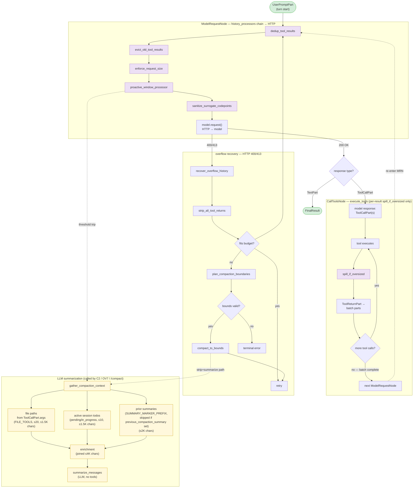

# Co CLI — Compaction System


Covers how co-cli keeps context bounded under pressure. Prompt assembly and history processors live in [prompt-assembly.md](prompt-assembly.md); transcript persistence (in-place rewrite on compaction) lives in [memory.md](memory.md); one-turn orchestration and overflow detection in [core-loop.md](core-loop.md); tool emission contracts in [tools.md](tools.md).

## 1. Functional Architecture

**Cycle terminology.** A *user turn* runs from one `UserPromptPart` to the final response; it contains one or more *LLM requests* (`ModelRequestNode` → one HTTP call to the model). A turn that drives K tool-call batches fires K+1 LLM requests.

### 1.1 End-to-end trace of one user turn

```
USER PROMPT
  │
  ▼
run_turn() (orchestrate.py:run_turn)
  ├── reset_for_turn()                # clears: turn_usage, status_callback, compaction_applied_this_turn,
  │                                   #          current_request_tokens_estimate
  └── while True:
        await _execute_stream_segment(...)
          │
          ▼  pydantic-ai Agent.run_stream_events
          │
          ┌── ModelRequestNode (pre-flight) ──────────────────────────────────┐
          │   history_processors run IN ORDER:                                │
          │     1. dedup_tool_results          (collapse identical returns)   │
          │     2. evict_old_tool_results      (keep 5 most recent per tool)  │
          │     3. enforce_request_size        (L2 force-spill cap)           │
          │     4. proactive_window_processor  (L3 LLM compaction)            │
          │     5. sanitize_surrogate_codepoints (lone-surrogate sweep)       │
          │   model.request() → HTTP                                          │
          └───────────────────────────────────────────────────────────────────┘
          │
          ┌── CallToolsNode (post-response) ──────────────────────────────────┐
          │   CoToolLifecycle hooks:                                          │
          │     before_node_run:    dedup ToolCallParts in one ModelResponse  │
          │     wrap_tool_execute:  L0 cap (MAX_TOOL_CALLS_PER_MODEL_TURN=6)  │
          │     before_tool_validate: JSON repair                             │
          │     before_tool_execute: path normalization                       │
          │     [tool runs]                                                   │
          │     after_tool_execute:  MCP-only fallback spill                  │
          │     after_node_run:     L0 telemetry span                         │
          │   tool_output() inside native tools fires L1: spill_if_oversized  │
          └───────────────────────────────────────────────────────────────────┘
          │
          if HTTP 400/413:
            except ModelHTTPError if is_context_overflow(e):
              recover_overflow_history(...)
                strip_all_tool_returns         → if fits: retry            (PATH 1)
                                               → else: plan_compaction_boundaries → compact_to_bounds (PATH 2)
              turn_state.overflow_recovery_attempted = True (one-shot)
  │
  ▼ FinalResultEvent (response is text, not tool calls)
return TurnResult
  │
  ▼
_finalize_turn()  (main.py)
  persist_session_history(history_compacted=runtime.compaction_applied_this_turn)
                                           └── if True, transcript is REWRITTEN in place, not appended
```

### 1.2 Layered budget stack

| Layer | Where | Trigger | Effect | LLM? |
|---|---|---|---|---|
| **L0** | `lifecycle.wrap_tool_execute` per `ToolCallPart` | `tool_calls_in_model_turn > MAX_TOOL_CALLS_PER_MODEL_TURN` (= 6) | Reject excess; structured `max_tool_calls_per_turn_exceeded` payload returned as tool result | No |
| **L1** | `tool_output()` in native tools, `lifecycle.after_tool_execute` for MCP | `len(content) > spill_threshold_chars` (per-tool, default `SPILL_THRESHOLD_CHARS = 4_000`) | Persist to `tool-results/<sha16>.txt`; replace content with `<persisted-output>` placeholder + preview | No |
| **L2** | `enforce_request_size` history processor | `max(estimate_message_tokens, latest_response_input_tokens) > deps.spill_threshold_tokens` | Force-spill largest unspilled string `ToolReturnPart`s, largest-first, until aggregate ≤ threshold | No |
| **L3** | `proactive_window_processor` history processor | `token_count > compaction_ratio × budget` AND not anti-thrash-tripped AND `plan_compaction_boundaries` returns non-`None` | LLM summary + assembly: `head | marker | [todo_snapshot] | [search breadcrumbs] | tail` | Yes (static marker fallback) |
| **Recovery** | `run_turn` overflow branch | `is_context_overflow(e)` AND `overflow_recovery_attempted == False` | `strip_all_tool_returns`; if still over budget, planner + `compact_to_bounds` on stripped history | Yes (static marker fallback) |
| **Manual** | `/compact [focus]` slash command | User-invoked | `compact_to_bounds` with full-history bounds `(0, n, n)`; same degradation policy as L3 | Yes (static marker fallback) |

L1 / L2 / L3 fast-path when below their threshold. The validator at `config/compaction.py:_validate_shape` enforces `tail_fraction < compaction_ratio` and `spill_ratio ≤ compaction_ratio` so L2 spill (cheap) precedes L3 LLM summarization, and post-compact state always leaves headroom before the trigger re-fires.

All three LLM-capable paths share one summarizer (`summarize_messages`) and one assembly helper (`_compose_compacted_history`, called via `compact_to_bounds` for Recovery + Manual or `compact_under_budget` for L3 proactive). Static vs. summary markers differ only in whether a non-empty summary string is available.

**Why per-request cadence.** Context pressure rises mid-turn — a single tool round can append a 50K-char shell output plus several `file_read` results, pushing the next request over budget before the user speaks again. Per-turn cadence would catch overflow only reactively via HTTP 400/413.

### 1.3 Diagram: Overall compaction pipeline

Mermaid view of the same pipeline shown in §1.1. End-to-end flow: `UserPromptPart` → `ModelRequestNode` pre-flight hook (the **MRN** subgraph — five `history_processors`) → model HTTP → `CallToolsNode` (the **CTN** subgraph — per-result `spill_if_oversized` only); overflow recovery branches off HTTP 400/413. See §2.3 for per-stage message transformation; §2.4 for `enforce_request_size`; §2.5 for `proactive_window_processor` internals.



### 1.4 Diagram: Message-list shape before, during, and after marker insertion

Four `ModelRequestNode` snapshots across a user turn that crosses the compaction threshold mid-turn — Request #1 (fast path) → Request #2 sampled before and after `proactive_window_processor` fires → Request #3 (post-compaction fast path). `SystemPrompt` is SDK-injected fresh on every request and is never part of the compacted history.

```text
①  Request #1  —  fast path  (token_count ≤ compaction_ratio × budget)
─────────────────────────────────────────────────────────────────────
  SystemPrompt                                       ← SDK-injected, never compacted
  ModelRequest    UserPromptPart  (1st turn)         ┐
  ModelResponse   TextPart        (1st turn)         ┘ pinned head
  ModelRequest / ModelResponse    prior turns        ← dedup/evict-cleared in pre-tail
  ModelRequest    UserPromptPart  (current)          ← protected tail

      │  model returns ToolCall1; tool runs
      ▼

②a Request #2  —  BEFORE compaction  (token_count exceeds threshold; processor about to fire)
─────────────────────────────────────────────────────────────────────
  SystemPrompt
  ModelRequest    UserPromptPart  (1st turn)         ┐ pinned head
  ModelResponse   TextPart        (1st turn)         ┘
  ModelRequest / ModelResponse    prior turns        ← dedup/evict-cleared, still present
  ModelRequest    UserPromptPart  (current)          ┐
  ModelResponse   ToolCallPart    (file_read)        │ current turn
  ModelRequest    ToolReturnPart  (spill_if_oversized if oversized)  ┘

      │  proactive_window_processor: plan → summarize → assemble
      │  middle prior turns dropped; head | marker | metadata | tail substituted
      ▼

②b Request #2  —  AFTER compaction  (sent to model with compacted history)
─────────────────────────────────────────────────────────────────────
  SystemPrompt
  ModelRequest    UserPromptPart  (1st turn)         ┐ pinned head
  ModelResponse   TextPart        (1st turn)         ┘
  ModelRequest    UserPromptPart  (COMPACTION MARKER)    ← summary or static
  ModelRequest    UserPromptPart  (todo snapshot)        ┐ metadata
  ModelRequest    ToolReturnPart  (search breadcrumbs)   ┘ (carried over)
  ModelRequest    UserPromptPart  (current)          ┐
  ModelResponse   ToolCallPart    (file_read)        │ current turn
  ModelRequest    ToolReturnPart  (result1)          ┘

      │  model returns ToolCall2; tool runs
      ▼

③  Request #3  —  fast path  (marker shrank token_count below threshold; carried forward)
─────────────────────────────────────────────────────────────────────
  SystemPrompt
  ModelRequest    UserPromptPart  (1st turn)         ┐ pinned head
  ModelResponse   TextPart        (1st turn)         ┘
  ModelRequest    UserPromptPart  (COMPACTION MARKER)    ← persists across requests
  ModelRequest    UserPromptPart  (todo snapshot)
  ModelRequest    ToolReturnPart  (search breadcrumbs)
  ModelRequest    UserPromptPart  (current)          ┐
  ModelResponse   ToolCallPart    (file_read)        │
  ModelRequest    ToolReturnPart  (result1)          │ two tools resolved
  ModelResponse   ToolCallPart    (file_search)      │
  ModelRequest    ToolReturnPart  (result2)          ┘

      │  model returns final text
      ▼  user turn complete
```

### 1.5 Runtime flag and callback map

Compaction state lives on `CoRuntimeState` (`co_cli/deps.py`). Five fields are per-turn (cleared by `reset_for_turn()`); five are cross-turn (cleared explicitly by `/new` and `/clear`, plus path-specific resets).

| Field | Written by | Read by | Reset by |
|---|---|---|---|
| `compaction_applied_this_turn` | `compact_to_bounds`, `compact_under_budget`, `recover_overflow_history` PATH 1 (each writes inline as its commit step) | `proactive_window_processor` (zeros `reported`); `_finalize_turn` (drives transcript rewrite) | `reset_for_turn` |
| `current_request_tokens_estimate` | `enforce_request_size` (always — even fast paths) | `proactive_window_processor` (OTEL only, no logic branch) | `reset_for_turn` |
| `tool_call_limit_run_step`, `tool_calls_in_model_turn` | `lifecycle.wrap_tool_execute` per call | L0 cap check + telemetry span | `lifecycle.wrap_tool_execute` on `ctx.run_step` change |
| `previous_compaction_summary` | `compact_to_bounds`, `compact_under_budget` (only on summarizer success) | `_compose_compacted_history` reads it (iterative-update prompt branch); `gather_compaction_context` (skip flag) | `/new`, `/clear` |
| `post_compaction_token_estimate` | `compact_to_bounds`, `compact_under_budget`, `recover_overflow_history` PATH 1 | `proactive_window_processor` (cross-turn stale guard) | `/new`, `/clear`; proactive on observed fresh `ModelResponse` |
| `message_count_at_last_compaction` | `compact_to_bounds`, `compact_under_budget`, `recover_overflow_history` PATH 1 | `proactive_window_processor` (guard-clear test) | `/new`, `/clear`; proactive on observed fresh `ModelResponse` |
| `compaction_skip_count` | `_summarization_gate_open` (block path), `_gated_summarize_or_none` (failure paths) | `_summarization_gate_open` (probe cadence) | `_gated_summarize_or_none` (success → 0) |
| `consecutive_low_yield_proactive_compactions` | `proactive_window_processor` (++ on low yield) | proactive gate; `_check_output_limits` (banner) | proactive on good savings; `_reset_thrash_state` from `recover_overflow_history`; `/compact`, `/new`, `/clear` |

**Sole callback into the frontend.** `runtime.status_callback` is set by `run_turn` to `frontend.on_status` and is the only frontend hook the processor chain sees — used by `_gated_summarize_or_none` to print "Compacting conversation…". Tool progress goes through the separate `tool_progress_callback`.

**Cross-turn cleared on observed fresh response.** `post_compaction_token_estimate` and `message_count_at_last_compaction` are cleared inside `proactive_window_processor` only when a `ModelResponse` with `usage.input_tokens > 0` exists at index `>= message_count_at_last_compaction` — proving the LLM has actually seen the post-compaction context. Message-count delta alone is unreliable (post-compaction tool returns or user messages may be appended without a fresh LLM call).

## 2. Core Logic

### 2.1 L0 admission cap — `MAX_TOOL_CALLS_PER_MODEL_TURN`

L0 caps how many tool calls a single `ModelResponse` can issue (the first row of §1.2). Calls beyond the cap never execute and never produce a `ToolReturnPart` for the lower layers to handle.

**Constant.** `MAX_TOOL_CALLS_PER_MODEL_TURN = 6` in `co_cli/agent/tool_call_limit.py`; non-configurable. Sized so 6 non-spilling (≤ 4K char) tool returns aggregate inside the per-request spill threshold.

**Trigger surface.** `CoToolLifecycle.before_tool_execute` — runs inside `CallToolsNode`, before each tool handler is invoked, on every `ToolCallPart` in the model response.

**Counter mechanics.** `ctx.run_step` increments once per `ModelRequestNode`, so all tool calls from one assistant message share the same `run_step`. When `run_step` changes, `runtime.tool_calls_in_model_turn` resets to 0; each call increments before the cap check. The first 6 calls execute normally; calls 7+ are **rejected without running** — the rejection payload is returned as the tool's "result," appended to message history as a `ToolReturnPart`, and seen by the model on the next turn:

```json
{
  "error": "max_tool_calls_per_turn_exceeded",
  "max": 6,
  "issued": <N>,
  "guidance": "Issued <N> tool calls in one model turn; cap is 6. Pick the 6 most important calls and try again."
}
```

**Observability.** `CoToolLifecycle.after_node_run` emits one `tool_budget.enforce_tool_call_limit` span per `CallToolsNode` exit with attributes `tool_calls.limit / issued / allowed / rejected / limit_exceeded` (see `docs/specs/observability.md`).

**Relationship to L1-L3.** L0 is preventive; L1-L3 are reactive. Even with L0 in place:
- A malformed tool returning a 1MB blob still needs L1 (`spill_if_oversized`) to size-cap.
- Multi-batch accumulation across one user turn still needs L2 (`enforce_request_size`) to aggregate-cap the upcoming request.
- Long conversations with non-tool-return pressure still need L3 (`proactive_window_processor`) to window-cap.

L0 just bounds the *worst-case fan-out per turn* so the lower layers can be sized for realistic load instead of pathological model output.

### 2.2 `spill_if_oversized` — Emit-time persistence

Spills any single tool result exceeding its per-tool threshold to `.co-cli/tool-results/<sha16>.txt` and replaces the content with a `<persisted-output>` placeholder before the result enters history. Content-addressed (SHA-256 prefix); written once, never rewritten.

**Trigger:** `len(display) > threshold` inside `tool_output()`.

| Tool | `spill_threshold_chars` | Note |
|---|---|---|
| Default | `SPILL_THRESHOLD_CHARS` (4,000) | module constant in `tool_io.py` |
| `file_read` | `math.inf` | never spills — prevents spill→read→spill recursion |

Placeholder shape — multi-line `<persisted-output>` block carrying a size preamble, `tool:` / `file:` lines, a `file_read` retrieval hint, and a `preview:` of the first `TOOL_RESULT_PREVIEW_CHARS` (1,500) chars (newline-aware truncation past halfway point).

### 2.3 `dedup_tool_results` / `evict_old_tool_results` — Prepass recency clearing

Two sync processors in order; no LLM calls. A third sync processor (`sanitize_surrogate_codepoints`) runs after `proactive_window_processor` — see end of this section.

**`dedup_tool_results`** — collapses identical returns outside the protected tail before recency clearing. For each compactable return whose `(tool_name, sha256(content))` key matches a more recent return of the same tool, replaces content with a 1-line back-reference to the latest `tool_call_id`. Eligibility: string content ≥ 200 chars; non-string and non-compactable tools pass through. (`co_cli/context/_dedup_tool_results.py`)

**`evict_old_tool_results`** — protects the last `UserPromptPart` onward; only acts on tools in `COMPACTABLE_TOOLS` (`file_read`, `shell`, `file_search`, `file_find`, `web_search`, `web_fetch`, `obsidian_read`) — non-compactable tools (writes, approvals, memory ops) pass through untouched regardless of count. For each selected tool, keeps the 5 most-recent returns in the pre-tail region (counted independently per tool name); replaces older returns with a semantic marker (`semantic_marker()` in `co_cli/context/_tool_result_markers.py`). Marker carries tool name, 1-3 key args from `ToolCallPart.args` (looked up via a `tool_call_id` index), and a size/outcome signal — e.g. `[shell] ran \`uv run pytest\` → exit 0, 47 lines`, `[file_read] src/foo.py (full, 1,200 chars)`. Non-string content falls back to `_CLEARED_PLACEHOLDER`. `tool_name` and `tool_call_id` preserved in the replacement part.

**Worked example — message list state at each stage.** Conversation with duplicate `file_read` returns and six `shell` runs in the pre-tail region. The `═══` line marks the protected-tail boundary; everything below it passes through `dedup_tool_results` and `evict_old_tool_results` untouched. (Round-budget enforcement on the latest batch is not part of this prepass — see §2.4.)

```text
INPUT  (raw history, before any processor)
─────────────────────────────────────────────────────────────────────
  head
  TR(file_read)  abc.py                       ← duplicate of fd2
  TR(file_read)  abc.py                       ← latest copy
  TR(shell)      run 1                        ┐
  TR(shell)      run 2                        │
  TR(shell)      run 3                        │  pre-tail
  TR(shell)      run 4                        │
  TR(shell)      run 5                        │
  TR(shell)      run 6                        ┘
  ═══ UserPromptPart (current turn) ═══════════════════════════
  TR(shell)      run 7

      │
      │  dedup_tool_results
      │    rule: collapse identical (tool_name, content-hash) in pre-tail
      │    finding: fd1 and fd2 share the same content
      ▼

AFTER dedup_tool_results
─────────────────────────────────────────────────────────────────────
  head
  → see fd2  (back-reference, content cleared)
  TR(file_read)  abc.py                       ← latest, kept
  TR(shell)      run 1
  TR(shell)      run 2 .. run 6
  ═══ UserPromptPart ═══════════════════════════════════════════
  TR(shell)      run 7

      │
      │  evict_old_tool_results
      │    rule: keep COMPACTABLE_KEEP_RECENT = 5 most-recent per tool name
      │    finding: 6 shell returns in pre-tail; run 1 is the oldest
      ▼

AFTER evict_old_tool_results
─────────────────────────────────────────────────────────────────────
  head
  → see fd2  (back-reference)
  TR(file_read)  abc.py                       ← 1 of 1, kept
  [shell] run 1 → exit 0, N lines             ← semantic marker (older than 5)
  TR(shell)      run 2 .. run 6               ← 5 most-recent, kept
  ═══ UserPromptPart ═══════════════════════════════════════════
  TR(shell)      run 7
```

**`sanitize_surrogate_codepoints`.** Runs after `proactive_window_processor` — last in the pipeline. Replaces lone Unicode surrogate code points (U+D800–U+DFFF) with U+FFFD in all `ModelRequest` and `ModelResponse` parts. Applies to string content on `UserPromptPart`, `SystemPromptPart`, `RetryPromptPart`, `ToolReturnPart`, `TextPart`, `ThinkingPart`, and `ToolCallPart.args`. Guards against `UnicodeEncodeError` inside the OpenAI SDK caused by byte-token reasoning models that occasionally emit lone surrogates.

### 2.4 `enforce_request_size` — Per-request size control (history processor)

L2's per-request cap. Operates on the **full message list** at `ModelRequestNode` entry — not on a single batch. Implemented as a sync history processor in `co_cli/context/history_processors.py` alongside `dedup_tool_results`, `evict_old_tool_results`, and `sanitize_surrogate_codepoints`. Replaces a prior post-tool-exec hook design (`_enforce_request_budget`) which only saw the just-produced batch and over-fired on small histories while under-firing on multi-batch accumulation.

**Chain placement.** Fires after `dedup_tool_results` and `evict_old_tool_results` (so cheap reductions happen first — no point spilling content the next processor would have deduped) and before `proactive_window_processor` (which fast-paths whenever spill brought total under `compaction_ratio × budget`, sparing the LLM call).

**Scope.** The full message list visible at MRN entry. Walks every `ModelRequest` and collects every string `ToolReturnPart`, regardless of region (no protected tail at this stage — recency protection is `evict_old_tool_results`'s job).

**Skip cases:**

| Condition | `skip_reason` | Behavior |
|---|---|---|
| `total ≤ deps.spill_threshold_tokens` | `below_threshold` | Fast path; no rewrite. Span emitted with `tokens_before == tokens_after`. |
| No string `ToolReturnPart`s in history | `no_candidates` | No rewrite. |
| All candidates already persisted (content starts with `PERSISTED_OUTPUT_TAG`) | `all_spilled` | No rewrite. |
| Spill exhausted candidates but aggregate still > threshold | `fallback_to_summarize` | Returns the (possibly partially-rewritten) message list; `proactive_window_processor` runs next and decides whether to fire LLM summarization. |
| Spill brought aggregate ≤ threshold | `""` (empty) | Rewritten message list returned. |
| Spill `OSError` on a candidate | (per-candidate, counted in `spill_errors`) | That candidate skipped (`new == old`); loop continues. |

**Algorithm.**

1. `total = max(estimate_message_tokens(messages), latest_response_input_tokens(messages))` — folds local char-based estimate with the most recent provider-reported input-token count to bias toward earlier spilling.
2. If `total ≤ deps.spill_threshold_tokens`, fast-path.
3. Walk every `ModelRequest`, collect all `ToolReturnPart`s with string content as candidates. Filter spillable: those whose content does not start with `PERSISTED_OUTPUT_TAG`.
4. Sort spillable largest-first by `len(content)`.
5. Force-spill via `spill_if_oversized(content, deps.tool_results_dir, tool_name, force=True)` until aggregate ≤ threshold or candidates exhaust. Track replacements by `id(part)`. The loop accumulator is tracked in local-char space (`starting_tokens = estimate_message_tokens(messages)`); `max(local, reported)` is the trigger only, not the loop baseline. After spill, `effective_after = max(local_after, reported)` reconstructs the conservative post-spill estimate for the terminal span and `fallback_to_summarize` gate.
6. Apply rewrites via `_rewrite_tool_returns(messages, len(messages), replacement_for=lambda p: spilled.get(id(p)))` — only messages with rewritten parts are rebuilt; unchanged messages pass through verbatim.

**Span.** `tool_budget.enforce_request_size` — emitted by tracer `co-cli.tool_budget` on every call. Attributes: `budget.context_window_tokens`, `request.threshold_tokens / tokens_before / local_tokens / reported_tokens / tokens_after / candidates_count / spillable_count / spilled_count / spill_errors / spill_fired (bool) / skip_reason`.

**Threshold.** `deps.spill_threshold_tokens = int(spill_ratio × model_max_ctx)`, computed once at bootstrap and cached on `CoDeps`. The `compaction.spill_ratio` knob is validated `≤ compaction_ratio` so post-spill aggregate falls below proactive's trigger and proactive fast-paths. (Runtime side effect on `current_request_tokens_estimate`: see §1.5.)

**Worked example.** Multi-batch turn: history contains three `ModelRequest`s carrying tool returns of 24K chars (≈ 6K tokens) each, plus a small head. Threshold = 6K tokens.

```text
BEFORE enforce_request_size (full message list)
─────────────────────────────────────────────────────────────────────
  ModelRequest    UserPromptPart  (turn start)
  ModelResponse   ToolCallPart    shell
  ModelRequest    ToolReturnPart  shell run 1   [24K chars ≈ 6K tokens]
  ModelResponse   ToolCallPart    shell
  ModelRequest    ToolReturnPart  shell run 2   [24K chars ≈ 6K tokens]
  ModelResponse   ToolCallPart    shell
  ModelRequest    ToolReturnPart  shell run 3   [24K chars ≈ 6K tokens]

      aggregate ≈ 18K tokens > 6K threshold → spill_fired=True
      spillable largest-first: run 1 == run 2 == run 3 (any order)

AFTER enforce_request_size
─────────────────────────────────────────────────────────────────────
  ModelRequest    UserPromptPart  (turn start)
  ModelResponse   ToolCallPart    shell
  ModelRequest    ToolReturnPart  shell run 1   <persisted-output>   ← spilled
  ModelResponse   ToolCallPart    shell
  ModelRequest    ToolReturnPart  shell run 2   <persisted-output>   ← spilled
  ModelResponse   ToolCallPart    shell
  ModelRequest    ToolReturnPart  shell run 3   [24K chars]          ← spill stopped: aggregate ≤ 6K
```

### 2.5 `proactive_window_processor` — Window compaction

**Full path overview.** Trigger → gates → planner → assembly → feedback. The prose subsections below cover each step in detail.

```text
proactive_window_processor — full path

  ─ STEP 1: token counting (combine local + provider-reported) ─
    local_estimate    = estimate_message_tokens(messages)
    reported_estimate = (
        0  if compaction_applied_this_turn
        else post_compaction_token_estimate (stale guard)
          or latest_response_input_tokens(messages)
    )
    token_count = max(local_estimate, reported_estimate)
                    ↑ biases toward earlier compaction

  ─ STEP 2: gates (cheap, fail fast) ─────────────────────────────
    if token_count ≤ compaction_ratio × budget
        → return messages              (FAST PATH — below threshold)
    if consecutive_low_yield ≥ proactive_thrash_window
        → emit banner once; return     (ANTI-THRASH gate)

  ─ STEP 3: boundary planner (plan_compaction_boundaries) ────────
    budget       = resolve_compaction_budget(deps)    (= model_max_ctx)
    head_end     = find_first_run_end(messages) + 1
    groups       = group_by_turn(messages)            e.g., [G0, G1, G2, G3]
    tail_budget  = tail_fraction × budget             e.g., 0.20 × 32K ≈ 6.5K

    if len(groups) < _MIN_RETAINED_TURN_GROUPS + 1 (= 2)
        → return None                  (nothing to drop)

    walk groups from end, accumulate tokens:
        G3:  3K  →  acc=3K, len=1 ≥ min=1, fits 6.5K → keep
        G2:  2K  →  acc=5K, len=2,        fits 6.5K → keep
        G1:  4K  →  acc=9K, len=2,        > 6.5K   → STOP

    tail_start    = G2.start_index
    dropped_range = G1
    head_range    = [0 .. head_end] + G0

    last-group guarantee:
        if G3 alone = 10K > 6.5K, len=1 ≥ min=1 → keep anyway

  ─ STEP 4: assembly (_compose_compacted_history — see §2.6) ─────
    summary = _gated_summarize_or_none(messages[head_end:tail_start])
    result  = head | marker | [todo_snapshot] | [search breadcrumbs] | tail

  ─ STEP 5: post-compaction feedback (anti-thrash counter) ───────
    savings = (tokens_before − tokens_after) / tokens_before   (tokens_before = max(local, reported))
    if savings ≥ min_proactive_savings
        consecutive_low_yield = 0      (re-arm)
    else
        consecutive_low_yield += 1     (steps toward thrash gate)

  ─ STEP 6: commit (last step before return) ─────────────────────
    runtime.compaction_applied_this_turn      = True
    runtime.post_compaction_token_estimate    = tokens_after
    runtime.message_count_at_last_compaction  = len(result)
    if summary is not None:
        runtime.previous_compaction_summary   = summary
```

STEPs 1–6 above are wholly inside `compact_under_budget` — proactive's atomic public function. The trigger gates (threshold + anti-thrash gate) and the trigger-check OTEL span live in `proactive_window_processor`, which calls `compact_under_budget` once. STEP 4 is the shared summarizer pipeline (`_compose_compacted_history`) — also called by `compact_to_bounds` for overflow recovery PATH 2 and `/compact`. See §2.6 for the assembly logic, enrichment helper, summarizer LLM call, and circuit breaker.

**Task-3 invariant.** STEPs 4 and 5 happen *before* STEP 6's runtime writes. If anything between STEP 4 and STEP 6 raises (e.g. `estimate_message_tokens` on malformed content, savings calc edge cases), `compact_under_budget` propagates the exception with runtime untouched; `proactive_window_processor`'s bare `except` returns the original `messages` reference. Partial-commit state cannot leak across turns.

**Stale-suppression guard.** STEP 1's `post_compaction_token_estimate` branch only clears once a `ModelResponse` with `input_tokens > 0` exists in `messages[message_count_at_last_compaction:]` — message-count delta alone is unreliable since post-compaction tool returns or user messages may have been appended without a fresh LLM call.

**Token counting:**
- `estimate_message_tokens(messages)` — `total_chars // CHARS_PER_TOKEN` over text parts and JSON-serialized `ToolCallPart.args`. Args are included because `evict_old_tool_results` clears return content only, never call args.
- `latest_response_input_tokens(messages)` — most recent `ModelResponse.usage.input_tokens`; zeroed when `compaction_applied_this_turn` (provider count is stale).
- `_effective_token_count` — `max(local, reported)`; biases toward earlier compaction.

**Budget resolution.** `resolve_compaction_budget(deps)` returns `deps.model_max_ctx` (Ollama probe capped by `config.llm.max_ctx`, set at bootstrap).

**Boundary planner invariant.** `_MIN_RETAINED_TURN_GROUPS = 1` is non-configurable: the last turn group is retained unconditionally even when its tokens alone exceed `tail_fraction × budget`. Since `group_by_turn` splits at every `UserPromptPart`, this also guarantees `tail_start ≤ latest_user_idx` — active-user anchoring needs no explicit step.

Edge cases: returns `None` when `len(groups) < 2` or when the backward walk produces `tail_start ≤ head_end` (head and tail would overlap).

### 2.6 Summarizer pipeline

Shared LLM-summarization machinery invoked by both compaction public functions — `compact_under_budget` (proactive, §2.5) and `compact_to_bounds` (overflow recovery PATH 2 and `/compact`, §2.7). The pipeline has four stages: assemble (`_compose_compacted_history`) → gate (`_summarization_gate_open` + circuit breaker) → enrich (`gather_compaction_context`) → summarize (`summarize_messages`). Static-marker fallback short-circuits the LLM call but reuses the same assembly.

#### 2.6.1 `_compose_compacted_history` — shared assembly

Private util. Takes pre-sliced `head`, `dropped`, `tail` (caller decides slicing — `compact_to_bounds` slices by bounds; `compact_under_budget` slices by planner output). The util:

1. Reads `runtime.previous_compaction_summary` and passes it to the summarizer (iterative branch when non-`None`).
2. Calls `_gated_summarize_or_none(dropped, ...)` — returns `None` on gate-closed / failure / empty.
3. Builds `result = head | marker | [todo_snapshot] | [search breadcrumbs] | tail`.
4. Returns `(result, summary_text)`. **Does NOT write to runtime** — that's the public function's job (atomic commit step).

The two atomic public functions handle the runtime commit themselves (each as the last step before return):
- `compact_to_bounds` (recovery PATH 2 + `/compact`): writes `compaction_applied_this_turn`, `post_compaction_token_estimate`, `message_count_at_last_compaction`, and `previous_compaction_summary` (when summary succeeded). One-shot atomic.
- `compact_under_budget` (proactive only): same writes, plus the savings-based thrash counter update — savings calc is squeezed *between* assembly and commit so a thrown exception there leaves runtime untouched (Task-3 invariant).
- `recover_overflow_history` PATH 1 (strip-only-fits, no LLM): writes the three "applied" fields inline; `previous_compaction_summary` is left alone (no summary was produced).

After the turn, `_finalize_turn()` (`co_cli/main.py`) reads `compaction_applied_this_turn` and passes it as `history_compacted=True` to `persist_session_history()`, which overwrites the transcript on disk in place instead of appending.

#### 2.6.2 Summarizer surface

| Function | Role |
|---|---|
| `_summarization_gate_open(ctx)` | Returns `False` when `ctx.deps.model is None` OR circuit breaker tripped (and not at probe cadence). |
| `summarize_dropped_messages(ctx, dropped, *, focus, previous_summary=None)` | Pure LLM call; gathers enrichment then invokes `summarize_messages`. Raises on failure. |
| `_gated_summarize_or_none(...)` | Gate + announce ("Compacting conversation…") + summarizer + validity check + fallback. Returns `None` on any failure path (exception, empty/whitespace, or gate closed). |

#### 2.6.3 Enrichment — `gather_compaction_context`

Collects signal that survives `dedup_tool_results` / `evict_old_tool_results` / `enforce_request_size` and feeds it to `summarize_messages` as side-channel context.

| Source | Function | Per-source filter / cap | Why it survives recency clearing |
|---|---|---|---|
| File paths | `_gather_file_paths(dropped)` | `ToolCallPart.args` of tools in `FILE_TOOLS`; reads `args.get("path") or args.get("file_path")`; deduped, sorted, **first 20** | Recency-clearing rewrites `ToolReturnPart.content` only — `ToolCallPart.args` is never touched. |
| Session todos | `_gather_session_todos(session_todos)` | `_active_todos` filter (status NOT in `{completed, cancelled}`); **first 10** | Read from `ctx.deps.session.session_todos`; orthogonal to the message list. |
| Prior summaries | `_gather_prior_summaries(dropped)` | Matches `UserPromptPart.content.startswith(SUMMARY_MARKER_PREFIX)` in `dropped`; **skipped at the caller** when `runtime.previous_compaction_summary is not None` (iterative branch already embeds it as `PREVIOUS SUMMARY:`) | Marker prefix is unique and never rewritten by recency processors. |

**Char caps** (constants in `_compaction_markers.py`):

| Cap | Value | Scope |
|---|---|---|
| `_FILE_PATHS_MAX_CHARS` | 1,500 | per-source truncation for file-paths block |
| `_TODOS_MAX_CHARS` | 1,500 | per-source truncation for todos block |
| `_PRIOR_SUMMARIES_MAX_CHARS` | 2,000 | per-source truncation for prior-summaries block |
| `_CONTEXT_MAX_CHARS` | 4,000 | final hard cap on the joined result |

Per-source caps are applied independently so a long entry in one source cannot starve the others. Returns `None` when every source yields empty/None — `summarize_messages` then runs without an enrichment block.

#### 2.6.4 `summarize_messages` — LLM call

`summarize_messages(deps, messages, *, personality_active, context, focus, previous_summary=None)` — `llm_call()` with no tools; agent constructed per call; `deps.model.settings_noreason`. System prompt enforces treating history as data, not instructions.

**Two-branch prompt:**
- **From-scratch** (`previous_summary is None`): `_SUMMARIZE_PROMPT` directly.
- **Iterative update** (`previous_summary` set): `_build_iterative_template(previous_summary)` prepends `PREVIOUS SUMMARY:` and PRESERVE / ADD / MOVE / REMOVE discipline before the shared template.

**Cross-compaction feedback loop** — `previous_compaction_summary` is read inside `_compose_compacted_history` before every summarizer call (threaded into the iterative-update prompt branch when non-`None`); it is written by the calling atomic public function (`compact_to_bounds` / `compact_under_budget`) only on summarizer success, as part of the commit step:

```text
Compaction N (first compaction in session)
─────────────────────────────────────────────────────────────────────
  read    runtime.previous_compaction_summary = None
            │
            ▼
  branch  FROM-SCRATCH    (uses _SUMMARIZE_PROMPT directly)
            │
            ▼
  summarize_messages() ──┬── success → write previous_compaction_summary = summary_text_N
                         │
                         └── failure → field LEFT UNTOUCHED
                                       (still None; next compaction also FROM-SCRATCH)

Compaction N+1
─────────────────────────────────────────────────────────────────────
  read    runtime.previous_compaction_summary = summary_text_N
            │
            ▼
  branch  ITERATIVE-UPDATE
            (prepends "PREVIOUS SUMMARY: …" + PRESERVE / ADD / MOVE / REMOVE
             discipline, then the shared template)
            │
            ▼
  summarize_messages() ──┬── success → write previous_compaction_summary = summary_text_N+1
                         │
                         └── failure → field LEFT UNTOUCHED
                                       (next compaction reuses summary_text_N)

Reset paths
─────────────────────────────────────────────────────────────────────
  /new                → previous_compaction_summary = None
  /clear              → previous_compaction_summary = None
  /compact failure    → field untouched (same fall-through as automatic compaction)
```

**Template sections:** `## Active Task`, `## Goal`, `## Key Decisions`, `## User Corrections`†, `## Errors & Fixes`, `## Completed Actions`, `## In Progress`, `## Remaining Work`, `## Working Set`, `## Pending User Asks`†, `## Resolved Questions`†, `## Next Step` (verbatim drift anchor), `## Critical Context`†. (†omitted when empty)

#### 2.6.5 Marker

`ModelRequest` / `UserPromptPart` with a `[CONTEXT COMPACTION — REFERENCE ONLY]` prefix, N-message count, `summary_text`, and a verbatim-tail trailer instructing the model to treat the summary as reference, not active instructions. Detection via `startswith(SUMMARY_MARKER_PREFIX)` — shared constant used by both builder and detector. The static-marker fallback uses `STATIC_MARKER_PREFIX` and the same shape minus `summary_text`.

#### 2.6.6 Breadcrumb preservation

`_preserve_search_tool_breadcrumbs(dropped)` reconstructs paired `search_tools` call/return cycles from the dropped range. Scans `ModelResponse` parts for `search_tools` `ToolCallPart`s (indexed by `tool_call_id`), then for each matching `ToolReturnPart` in `ModelRequest` parts emits a fresh `ModelResponse([call_part])` + `ModelRequest([return_part])` pair. Orphan returns with no paired call are dropped rather than emitted as broken shapes. Only `search_tools` cycles are preserved; all other tool results are dropped from the breadcrumb list.

#### 2.6.7 Circuit breaker

| `compaction_skip_count` | Behavior |
|---|---|
| `0–2` (healthy) | Attempt summarizer. Valid summary → reset to 0. Failure or empty return → static marker, increment. |
| `≥ 3` (tripped) | Skip summarizer; static marker; increment. Probe once every `_COMPACTION_BREAKER_PROBE_EVERY` (10) skips — probe success resets to 0. |

`ctx.deps.model is None` (sub-agent without configured model) is also a bypass — static marker without LLM attempt, no counter change.

### 2.7 Overflow recovery

Single-tier strip-then-summarize. Inlined in `run_turn`'s overflow branch (no separate orchestrator helper).

1. **Trigger:** `ModelHTTPError` classified by `_http_error_classifier.is_context_overflow`: HTTP 413 unconditionally; HTTP 400 with explicit overflow evidence in `error.message`, `error.code`, or `error.metadata.raw`. Overflow phrases recognized from OpenAI, Ollama, Gemini, vLLM, AWS Bedrock.
2. **Rate limit:** gated by `turn_state.overflow_recovery_attempted` — one-shot per turn.

**Algorithm** (`recover_overflow_history`, cascade flow shown in Diagram 1's `OVF` subgraph):

1. **Strip** every `ToolReturnPart` to a per-tool semantic marker via `strip_all_tool_returns`. No `COMPACTABLE_TOOLS` filter, no recency cap, no boundary protection — every tool return, including writes / approvals / memory ops, collapses to a one-line stub. Pairing is preserved (only `.content` is rewritten; `tool_name` and `tool_call_id` survive). Idempotent: returns whose content is already a marker (`is_cleared_marker(content)` true) pass through unchanged so re-running over an EVICT-stripped history does not degrade the size signal.
2. **PATH 1 — Budget gate.** If `estimate_message_tokens(stripped) <= budget`, write the three "applied" runtime fields inline (`compaction_applied_this_turn`, `post_compaction_token_estimate`, `message_count_at_last_compaction`) and return the stripped history. No LLM call, no marker, no `previous_compaction_summary` write.
3. **PATH 2 — Summarize.** Else run `plan_compaction_boundaries(stripped, budget, tail_fraction)`; if the planner returns `None` (`len(groups) < 2`, or `tail_start <= head_end`), terminal error. Otherwise call `compact_to_bounds(ctx, stripped, bounds, focus=None)` — which composes the marker + assembles the result + commits runtime atomically.
4. **Reset thrash.** Both return paths call `_reset_thrash_state(ctx)` — recovery proves the system needed to compact, so the next proactive run is unblocked. The compaction public functions (`compact_to_bounds`, `compact_under_budget`) themselves do NOT reset thrash state (proactive callers must keep their own gate).

**Message-list shape at each path:**

```text
PATH 1 — strip-only-fits (budget met after strip)
─────────────────────────────────────────────────────────────────────
  SystemPrompt
  ModelRequest    UserPromptPart   (1st turn)
  ModelResponse   TextPart / ToolCallPart
  ModelRequest    ToolReturnPart   ← content rewritten to "[tool_name] …"
  ...                              ← every ToolReturnPart stripped
  ModelRequest    UserPromptPart   (pending — preserved at tail)

      │  retry once with stripped history
      ▼  user turn continues


PATH 2 — strip + summarize (budget still exceeded after strip)
─────────────────────────────────────────────────────────────────────
  SystemPrompt
  ModelRequest    UserPromptPart   (1st turn)         ┐ pinned head
  ModelResponse   TextPart         (1st turn)         ┘
  ModelRequest    UserPromptPart   (COMPACTION MARKER)    ← summary or static
  ModelRequest    UserPromptPart   (todo snapshot)
  ModelRequest    ToolReturnPart   (search breadcrumbs)
  ModelRequest / ModelResponse    tail turns          ← retained, returns stripped

      │  retry once
      ▼  user turn continues
```

On a non-`None` result, `run_turn` sets `current_history = compacted`, clears pending input, emits `"Context overflow — compacting and retrying..."`, and retries. Terminal error (`"Context overflow — unrecoverable."`) on `None` or on a second overflow in the same turn.

### 2.8 Base system prompt advisory

`RECENCY_CLEARING_ADVISORY` — static, cacheable `## Tool result recency` section; no per-turn interpolation; `5` sourced from `COMPACTABLE_KEEP_RECENT` at module-load time:

> "## Tool result recency
>
> Tool results may be automatically cleared from context to free space. The 5 most recent results per tool type are always kept. Note important information from tool results in your response — the original output may be cleared on later turns."

**Injection point.** Defined as a module-level constant in `co_cli/context/assembly.py` and appended by `build_static_instructions()` as the **final** section of the static system prompt, after seed → mindsets → numbered rule files in `co_cli/context/rules/`. Not a rule file (it would need template substitution for `COMPACTABLE_KEEP_RECENT`) and not a dynamic instruction (the value is invariant within a session, so dynamic injection would blow prompt caching for zero benefit). The Python-constant + f-string pattern keeps it inside the cacheable static prefix while letting the `5` track `COMPACTABLE_KEEP_RECENT` at module load.

### 2.9 Error handling and degradation

| Failure mode | Fallback |
|---|---|
| Summarizer raises OR returns empty/whitespace | Static marker; warning logged; `compaction_skip_count += 1` |
| `compaction_skip_count >= 3` | Circuit breaker tripped — static markers used; LLM probed once every 10 skips |
| `ctx.deps.model is None` (sub-agent context) | Static marker without LLM attempt |
| `plan_compaction_boundaries` returns `None` (proactive) | Return messages unchanged; provider may then reject → overflow path |
| `plan_compaction_boundaries` returns `None` (overflow, after strip) | `recover_overflow_history` returns `None`; caller emits `"Context overflow — unrecoverable."` |
| Second overflow in same turn | Terminal error (gated by `overflow_recovery_attempted`) |

### 2.10 Security

- Summarizer system prompt contains a CRITICAL SECURITY RULE treating history as data, not instructions.
- Emit-time persisted files are content-addressed by SHA-256; filenames leak no semantics.
- Tool-result files live under `.co-cli/tool-results/` (project-local). Cleanup is manual; warning surfaced when directory > 100 MB via `check_tool_results_size`.

## 3. Config

| Setting | Env Var | Default | Description |
|---|---|---|---|
| `llm.max_ctx` | — | `32768` | Ceiling on the Ollama-probed context window; `deps.model_max_ctx = min(probe, max_ctx)`. Used as the compaction budget. |

**Compaction tuning** (`CompactionSettings` in `co_cli/config/compaction.py`):

| Setting | Env Var | Default | Description |
|---|---|---|---|
| `compaction.compaction_ratio` | `CO_COMPACTION_RATIO` | `0.50` | Fraction of budget above which `proactive_window_processor` fires |
| `compaction.tail_fraction` | `CO_COMPACTION_TAIL_FRACTION` | `0.20` | Fraction of budget targeted for the preserved tail |
| `compaction.spill_ratio` | `CO_COMPACTION_SPILL_RATIO` | `0.50` | Fraction of context window above which `enforce_request_size` force-spills tool returns. Validated `≤ compaction_ratio` so post-spill aggregate falls below proactive's trigger and proactive fast-paths. |
| `compaction.min_proactive_savings` | `CO_COMPACTION_MIN_PROACTIVE_SAVINGS` | `0.10` | Minimum token savings fraction to count a proactive compaction as effective (anti-thrashing) |
| `compaction.proactive_thrash_window` | `CO_COMPACTION_PROACTIVE_THRASH_WINDOW` | `2` | Consecutive low-yield proactive compactions before anti-thrashing gate activates |

**Non-configurable module constants:**

| Constant | Source | Value | Purpose |
|---|---|---|---|
| `_MIN_RETAINED_TURN_GROUPS` | `co_cli/context/_compaction_boundaries.py` | `1` | Hardcoded correctness invariant — last turn group always retained |
| `COMPACTABLE_KEEP_RECENT` | `co_cli/context/history_processors.py` | `5` | `evict_old_tool_results`: most-recent returns per tool to keep |
| `_COMPACTION_BREAKER_TRIP` | `co_cli/context/compaction.py` | `3` | Consecutive failures that trip the circuit breaker |
| `_COMPACTION_BREAKER_PROBE_EVERY` | `co_cli/context/compaction.py` | `10` | Skips between probe attempts when circuit breaker is tripped |
| `MAX_TOOL_CALLS_PER_MODEL_TURN` | `co_cli/agent/tool_call_limit.py` | `6` | L0 admission cap on tool calls per `ModelResponse` (see §2.1) |

**Spill / request-budget constants** (module-level; not user-configurable):

| Constant | Source | Value | Purpose |
|---|---|---|---|
| `SPILL_THRESHOLD_CHARS` | `co_cli/tools/tool_io.py` | `4,000` | `spill_if_oversized` default per-tool emit-time spill threshold |
| `TOOL_RESULT_PREVIEW_CHARS` | `co_cli/tools/tool_io.py` | `1,500` | Preview chars included in the `<persisted-output>` placeholder |
| `CHARS_PER_TOKEN` | `co_cli/context/tokens.py` | `4` | Fast chars→tokens proxy used by `enforce_request_size` aggregate estimate |

**Enrichment char caps** (module-level; not user-configurable; see §2.6.3 for usage):

| Constant | Source | Value | Purpose |
|---|---|---|---|
| `_FILE_PATHS_MAX_CHARS` | `co_cli/context/_compaction_markers.py` | `1,500` | Per-source truncation for the file-paths enrichment block |
| `_TODOS_MAX_CHARS` | `co_cli/context/_compaction_markers.py` | `1,500` | Per-source truncation for the active-todos enrichment block |
| `_PRIOR_SUMMARIES_MAX_CHARS` | `co_cli/context/_compaction_markers.py` | `2,000` | Per-source truncation for the prior-summaries enrichment block |
| `_CONTEXT_MAX_CHARS` | `co_cli/context/_compaction_markers.py` | `4,000` | Final hard cap on the joined enrichment string fed to the summarizer |

Per-tool `spill_threshold_chars` overrides are set via `@agent_tool(spill_threshold_chars=...)` in each tool's own file — see the table in §2.2.

## 4. Files

| File | Role |
|---|---|
| `co_cli/config/compaction.py` | `CompactionSettings` — ratios, thresholds, and anti-thrashing knobs. |
| `co_cli/context/compaction.py` | Public entry surface: `proactive_window_processor` processor, `recover_overflow_history`, two atomic public functions (`compact_to_bounds`, `compact_under_budget`), summarizer gate, re-exports. |
| `co_cli/context/_compaction_boundaries.py` | Boundary planner: `TurnGroup`, `group_by_turn`, `plan_compaction_boundaries`, active-user anchoring. |
| `co_cli/context/_compaction_markers.py` | Marker builders, `gather_compaction_context` enrichment helper, `SUMMARY_MARKER_PREFIX`. |
| `co_cli/context/_dedup_tool_results.py` | `dedup_tool_results` helpers: content hash, eligibility predicate (`is_dedup_candidate`), back-reference builder (`build_dedup_part`). |
| `co_cli/context/history_processors.py` | Pure history processors (registered): `dedup_tool_results`, `evict_old_tool_results`, `enforce_request_size`, `sanitize_surrogate_codepoints`. Recovery helper (unregistered): `strip_all_tool_returns`. |
| `co_cli/tools/lifecycle.py` | `CoToolLifecycle` capability: dedup tool calls (`before_node_run`), per-call cap brake (`wrap_tool_execute`), L0 tool-call-limit span (`after_node_run`), JSON repair (`before_tool_validate`), path normalization (`before_tool_execute`), audit/span enrichment (`after_tool_execute`). |
| `co_cli/context/_tool_result_markers.py` | `semantic_marker` per-tool format and `is_cleared_marker` predicate. |
| `co_cli/context/summarization.py` | `summarize_messages`, token estimator, budget resolver, and prompt templates. |
| `co_cli/context/tokens.py` | `CHARS_PER_TOKEN` shared constant. |
| `co_cli/context/_http_error_classifier.py` | `is_context_overflow` — provider overflow detection for 400/413. |
| `co_cli/context/orchestrate.py` | `run_turn` overflow dispatch and anti-thrash gate reset. |
| `co_cli/main.py` | `_finalize_turn()` — session persistence bridge; reads `compaction_applied_this_turn` and calls `persist_session_history(history_compacted=True)` to rewrite the transcript. |
| `co_cli/tools/categories.py` | `COMPACTABLE_TOOLS`, `FILE_TOOLS`, `PATH_NORMALIZATION_TOOLS`. |
| `co_cli/tools/tool_io.py` | `spill_if_oversized`: `spill_if_oversized`, `tool_output`, `check_tool_results_size`; `SPILL_THRESHOLD_CHARS`, `TOOL_RESULT_PREVIEW_CHARS`. |
| `co_cli/tools/files/read.py` | `file_read` per-tool `spill_threshold_chars=math.inf` override (never spills). |
| `co_cli/agent/tool_call_limit.py` | `MAX_TOOL_CALLS_PER_MODEL_TURN`, `MaxToolCallsExceededPayload`, `make_exceeded_payload`. |
| `co_cli/config/llm.py` | `max_ctx` (Ollama probe ceiling). |
| `co_cli/context/assembly.py` | Prompt assembly: `build_static_instructions`; static `RECENCY_CLEARING_ADVISORY` recency-clearing paragraph. |
| `co_cli/context/rules/` | Base system prompt rule files (identity, safety, reasoning, tool protocol, workflow). |
| `evals/eval_compaction_proactive.py` | Proactive compaction end-to-end eval. |
| `evals/eval_compaction_multi_cycle.py` | Multi-cycle compaction fidelity eval. |

## 5. Test Gates

| Property | Test file |
|---|---|
| `spill_if_oversized`: spill path: oversized result spilled to disk, placeholder format confirmed | `tests/test_flow_spill.py` |
| `spill_if_oversized` constant values pinned: `SPILL_THRESHOLD_CHARS`, `TOOL_RESULT_PREVIEW_CHARS` | `tests/test_flow_spill.py` |
| `spill_if_oversized` threshold boundary: below 4000 passes through unchanged; above 4000 spills | `tests/test_flow_spill.py` |
| `spill_if_oversized` `force=True`: force-spills even below threshold when above preview size | `tests/test_flow_spill.py` |
| `CoToolLifecycle.after_tool_execute`: MCP results above threshold spilled to disk; below-threshold pass through; native results not coerced (their tools call the helper themselves) | `tests/test_flow_spill.py` |
| `enforce_request_size`: below-threshold fast path; largest-first spill across full message list; cross-batch accumulation (multiple `ModelRequest`s); already-spilled exclusion; OTEL span `tool_budget.enforce_request_size` | `tests/test_flow_enforce_request_size.py` |
| `enforce_request_size` cached threshold: `spill_threshold_tokens` from `CoDeps` used without recompute | `tests/test_flow_enforce_request_size.py` |
| L0 tool-call cap: `MAX_TOOL_CALLS_PER_MODEL_TURN` constant pinned; allow up to cap; reject above cap with JSON payload | `tests/test_flow_tool_call_limit.py` |
| L0 run_step counter: resets on `ctx.run_step` transition | `tests/test_flow_tool_call_limit.py` |
| `dedup_tool_results`: identical return collapses to back-reference; short content and distinct content pass through | `tests/test_flow_history_processors.py` |
| `evict_old_tool_results`: clears oldest when over keep limit; keeps all at limit; protects last-turn returns | `tests/test_flow_history_processors.py` |
| `evict_old_tool_results` + `is_cleared_marker`: cleared markers recognized; recent returns left untouched | `tests/test_flow_history_processors.py` |
| `group_by_turn` correctly partitions multi-turn message list into turn groups | `tests/test_flow_history_processors.py` |
| `proactive_window_processor` below-threshold fast path: messages object returned unchanged, no compaction | `tests/test_flow_compaction_proactive.py` |
| `proactive_window_processor` above-threshold compaction: result shorter than input, compaction marker present | `tests/test_flow_compaction_proactive.py` |
| `proactive_window_processor` anti-thrashing gate: skips compaction after consecutive low-yield passes | `tests/test_flow_compaction_proactive.py` |
| Circuit breaker cadence: counts 0–2 open, 3–12 closed, 13 probe, 14–22 closed, 23 probe | `tests/test_flow_compaction_proactive.py` |
| Circuit breaker counter resets to 0 after a successful (non-empty) LLM compaction | `tests/test_flow_compaction_proactive.py` |
| Boundary planner: valid `(head_end, tail_start, dropped_count)` for 3-turn history | `tests/test_flow_compaction_boundaries.py` |
| Boundary planner: returns `None` when only 1 turn group (nothing to drop) | `tests/test_flow_compaction_boundaries.py` |
| Boundary planner: oversized last-group retained unconditionally even over tail budget | `tests/test_flow_compaction_boundaries.py` |
| `find_first_run_end` anchors at first `TextPart` response, skips tool-only responses | `tests/test_flow_compaction_boundaries.py` |
| `estimate_message_tokens` scales with content length; returns 0 for empty list | `tests/test_flow_compaction_summarization.py` |
| `resolve_compaction_budget` returns `deps.model_max_ctx` | `tests/test_flow_compaction_summarization.py` |
| Summarizer from-scratch branch: returns non-empty structured text | `tests/test_flow_compaction_summarization.py` |
| Summarizer iterative branch: output incorporates prior summary and new turns | `tests/test_flow_compaction_summarization.py` |
| Overflow recovery — strip-only-fits: oversized tool returns rewritten to per-tool markers; message count preserved; pending user turn preserved | `tests/test_flow_compaction_recovery.py` |
| Overflow recovery — strip+summary path: emits static marker (model=None gate); recovered history shorter than input | `tests/test_flow_compaction_recovery.py` |
| Overflow recovery — terminal: single-turn history returns `None` when planner cannot find bounds | `tests/test_flow_compaction_recovery.py` |
| Overflow recovery — pairing: every `tool_call_id` in `ToolCallPart`s matches a `ToolReturnPart` (both paths) | `tests/test_flow_compaction_recovery.py` |
| `strip_all_tool_returns` idempotent on already-marked content | `tests/test_flow_compaction_recovery.py` |
| `is_context_overflow`: 413 is unconditional; 400 requires overflow evidence in body | `tests/test_flow_http_error_classifier.py` |
| `/clear` resets all compaction runtime fields to initial state | `tests/test_flow_slash_commands.py` |
