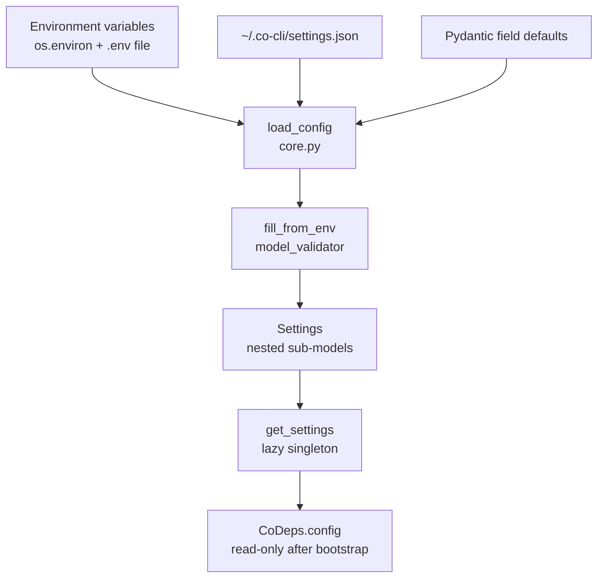

# Configuration

## 1. Functional Architecture



| Component | Module | Role |
|-----------|--------|------|
| `Settings` | `core.py` | Top-level Pydantic model; owns flat fields + all nested sub-models |
| `fill_from_env` | `core.py` | `model_validator(mode="before")` — maps env vars into nested dict before validation |
| `load_config()` | `core.py` | Loads `settings.json`, merges `.env`, applies env; returns `Settings` |
| `get_settings()` | `core.py` | Lazy module-level singleton — calls `load_config()` on first access |
| `LlmSettings` | `llm.py` | Provider, model, inference defaults; `reasoning_model_settings()`, `noreason_model_settings()`, `validate_config()` as instance methods |
| `_LLM_SETTINGS` | `llm.py` | Provider→model→mode canonical inference knobs used by `LlmSettings._inference()` |
| `DEFAULT_LLM_MODELS` | `llm.py` | Per-provider default model id (full id with variant tag) — used when `llm.model` is unset |
| `KnowledgeSettings` | `knowledge.py` | Search backend, embedding, chunking, and lifecycle settings |
| `CompactionSettings` | `compaction.py` | Context compaction trigger ratios and anti-thrash knobs |
| `WebSettings` | `web.py` | Domain allowlist/blocklist and HTTP retry policy |
| `ShellSettings` | `shell.py` | Shell timeout limit and auto-approval safe command list |
| `MemorySettings` | `memory.py` | Memory recall half-life |
| `ObservabilitySettings` | `observability.py` | Log level, rotation, OTel span redaction patterns |
| `SkillsSettings` | `skills.py` | Skill usage tracking, review, and curator automation knobs |
| `MCPServerSettings` | `mcp.py` | Per-server transport config (stdio or HTTP) |

`Settings` is constructed once per session by `create_deps()` via `get_settings()`, then
`copy.deepcopy`-ed to prevent cross-session mutation. After bootstrap it is read-only.


## 2. Core Logic

### Load pipeline

```
load_config(path?, env?)
  1. Load ~/.co-cli/.env via dotenv_values (no os.environ mutation)
  2. Load settings.json — json.load → raw dict (empty dict if absent)
  3. Pre-flight validate raw file data: Settings.model_validate(data, env={})
       → raises ValueError on invalid file content (masks env overrides cleanly)
  4. Resolve env context: _env (test) > os.environ (shell) > dot_env_vars (.env)
  5. Settings.model_validate(data, context={"env": env_context})
       → fill_from_env runs as model_validator(mode="before"):
           flat env vars injected directly into data dict
           nested env vars injected into data["llm"], data["web"], etc.
           each sub-model owns its ENV_MAP (LLM_ENV_MAP, KNOWLEDGE_ENV_MAP, etc.)
           provider-aware API key resolved via resolve_api_key_from_env()
           CO_MCP_SERVERS JSON decoded into data["mcp_servers"]
  6. _validate_personality(resolved.personality) — prints warnings, does not raise
```

Precedence: `_env` (explicit/test) > `os.environ` (shell) > `.env` file > `settings.json` > field defaults.

### Path constants

All user-global paths resolve from `USER_DIR`, which is read once at module import time:

```
USER_DIR          = CO_HOME env var | ~/.co-cli
SETTINGS_FILE     = USER_DIR / settings.json
SEARCH_DB         = USER_DIR / co-cli-search.db
LOGS_DB           = USER_DIR / co-cli-logs.db
LOGS_DIR          = USER_DIR / logs
KNOWLEDGE_DIR     = USER_DIR / knowledge
SESSIONS_DIR      = USER_DIR / sessions
TOOL_RESULTS_DIR  = USER_DIR / tool-results
GOOGLE_TOKEN_PATH = USER_DIR / google_token.json
ADC_PATH          = ~/.config/gcloud/application_default_credentials.json
```

`_ensure_dirs()` creates these on first call to `get_settings()`.

### LLM inference model settings

`_LLM_SETTINGS` is the central table of per-provider, per-model inference knobs —
the canonical source of truth, not user-overridable. `model_key` is derived from
`llm.model` by splitting on `:` (`"qwen3.5:35b-a3b-q4_k_m-agentic"` → `"qwen3.5"`).

```
LlmSettings._inference(mode):
  return _LLM_SETTINGS[provider][model_key][mode]   # or {} if absent
```

Per-provider default model id (used when `llm.model` is unset) lives separately in
`DEFAULT_LLM_MODELS[provider]` — full id including variant tag, since
`_LLM_SETTINGS` keys are variant-stripped base names.

Defined entries:

| Provider | Model key | Modes | Key noreason knob |
|----------|-----------|-------|-------------------|
| `ollama` | `qwen3.5` | reasoning, noreason | `extra_body: {think: false, reasoning_effort: "none"}` |
| `gemini` | `gemini-3-flash-preview` | reasoning, noreason | `thinking_config: {thinking_level: "MINIMAL"}` |
| `gemini` | `gemini-2.5-flash` | noreason only | `thinking_config: {thinking_budget: 0}` |
| `gemini` | `gemini-2.5-flash-lite` | noreason only | `thinking_config: {thinking_budget: 0}` |

`LlmSettings.validate_config()` (no IO) enforces: Gemini API key present when provider is gemini,
model key in `_LLM_SETTINGS`, and model key has a `reasoning` entry (noreason-only models cannot
be the main agent model). Empty `llm.model` is auto-resolved to `DEFAULT_LLM_MODELS[provider]`
by a pydantic `model_validator`, so the no-model case is handled before validation runs.

`LlmSettings.reasoning_model_settings()` → `ModelSettings` for the main agent.
`LlmSettings.noreason_model_settings()` → `ModelSettings` (Ollama) or `GoogleModelSettings` (Gemini)
for functional calls (compaction, memory extraction, dream merge) via `llm_call()`.

### Ollama context window probe

`probe_ollama_model(host, model)` posts to `/api/show`, parses `parameters.num_ctx`. Called
during `create_deps()` before `build_model()`. `max_ctx` is the contract pivot:

- **Floor check**: probed Modelfile `num_ctx` must be `>= max_ctx`; fails fast otherwise.
- **Ceiling check**: static `num_ctx` in `_LLM_SETTINGS` (injected per-request via
  `extra_body["options"]["num_ctx"]`) must be `<= max_ctx`; fails fast otherwise.

The two checks use `max_ctx` as the shared reference and do not compare against each other.
`deps.model_max_ctx` is always `config.llm.max_ctx` — the probed value is only used for the
floor validation, not as a dynamic injection value.

Gemini: no probe; `deps.model_max_ctx = config.llm.max_ctx` (ceiling used as-is).


## 3. Config

### Top-level (flat)

| Setting | Env Var | Default | Description |
|---------|---------|---------|-------------|
| `personality` | `CO_PERSONALITY` | `"tars"` | Active personality name; must match a bundled soul directory |
| `theme` | `CO_THEME` | `"light"` | TUI color theme |
| `reasoning_display` | `CO_REASONING_DISPLAY` | `"summary"` | Reasoning trace display: `off`, `summary`, `full` |
| `tool_retries` | `CO_TOOL_RETRIES` | `3` | Max retries on tool errors |
| `doom_loop_threshold` | `CO_DOOM_LOOP_THRESHOLD` | `3` | Consecutive identical tool calls before agent is halted (2–10) |
| `max_reflections` | `CO_MAX_REFLECTIONS` | `3` | Max agent self-reflection passes per turn (1–10) |
| `obsidian_vault_path` | `OBSIDIAN_VAULT_PATH` | `None` | Absolute path to Obsidian vault for note search |
| `brave_search_api_key` | `BRAVE_SEARCH_API_KEY` | `None` | Brave Search API key |
| `google_credentials_path` | `GOOGLE_CREDENTIALS_PATH` | `None` | Path to Google OAuth credentials JSON |
| `knowledge_path` | `CO_KNOWLEDGE_PATH` | `~/.co-cli/knowledge` | Override for the knowledge artifacts directory |
| `workspace_path` | `CO_WORKSPACE_PATH` | `None` | Path to the workspace root (used for workspace-relative resolution) |

### LLM (`llm.*`)

| Setting | Env Var | Default | Description |
|---------|---------|---------|-------------|
| `llm.provider` | `CO_LLM_PROVIDER` | `"ollama"` | Provider: `ollama` or `gemini` |
| `llm.host` | `CO_LLM_HOST` | `"http://localhost:11434"` | Ollama server base URL |
| `llm.model` | `CO_LLM_MODEL` | `"qwen3.5:35b-a3b-q4_k_m-agentic"` (Ollama default) | Single model name for all tasks; falls back to `DEFAULT_LLM_MODELS[provider]` when unset |
| `llm.max_ctx` | — | `65536` | Ceiling on probed Ollama context window |
| `llm.api_key` | `GEMINI_API_KEY` (gemini), else `CO_LLM_API_KEY` | `None` | Provider API key |

Inference knobs (temperature, top_p, max_tokens, extra_body, thinking_config) are not
user-configurable — they live in `_LLM_SETTINGS` keyed by provider/model/mode.

### Knowledge (`knowledge.*`)

| Setting | Env Var | Default | Description |
|---------|---------|---------|-------------|
| `knowledge.search_backend` | `CO_KNOWLEDGE_SEARCH_BACKEND` | `"hybrid"` | Backend: `grep`, `fts5`, `hybrid` |
| `knowledge.embedding_provider` | `CO_KNOWLEDGE_EMBEDDING_PROVIDER` | `"tei"` | Embedding provider: `ollama`, `gemini`, `tei`, `none` |
| `knowledge.embedding_model` | `CO_KNOWLEDGE_EMBEDDING_MODEL` | `"embeddinggemma"` | Model name for embedding |
| `knowledge.embedding_dims` | `CO_KNOWLEDGE_EMBEDDING_DIMS` | `1024` | Embedding vector dimensions |
| `knowledge.embed_api_url` | `CO_KNOWLEDGE_EMBED_API_URL` | `"http://127.0.0.1:8283"` | TEI embedding server URL |
| `knowledge.cross_encoder_reranker_url` | `CO_KNOWLEDGE_CROSS_ENCODER_RERANKER_URL` | `"http://127.0.0.1:8282"` | TEI cross-encoder reranker URL; `null` to disable |
| `knowledge.tei_rerank_batch_size` | `CO_KNOWLEDGE_TEI_RERANK_BATCH_SIZE` | `50` | Reranker batch size (overridden by TEI `/info` response) |
| `knowledge.chunk_tokens` | `CO_KNOWLEDGE_CHUNK_TOKENS` | `600` | Token size per knowledge chunk |
| `knowledge.chunk_overlap_tokens` | `CO_KNOWLEDGE_CHUNK_OVERLAP_TOKENS` | `80` | Token overlap between chunks |
| `knowledge.session_chunk_tokens` | `CO_KNOWLEDGE_SESSION_CHUNK_TOKENS` | `400` | Token size per session chunk |
| `knowledge.session_chunk_overlap` | `CO_KNOWLEDGE_SESSION_CHUNK_OVERLAP` | `80` | Token overlap between session chunks |
| `knowledge.max_artifact_count` | `CO_KNOWLEDGE_MAX_ARTIFACT_COUNT` | `300` | Max artifacts before decay |
| `knowledge.decay_after_days` | `CO_KNOWLEDGE_DECAY_AFTER_DAYS` | `90` | Artifact inactivity days before decay |
| `knowledge.consolidation_enabled` | `CO_KNOWLEDGE_CONSOLIDATION_ENABLED` | `false` | Enable periodic artifact consolidation |
| `knowledge.consolidation_trigger` | `CO_KNOWLEDGE_CONSOLIDATION_TRIGGER` | `"session_end"` | When to consolidate: `session_end` or `manual` |
| `knowledge.consolidation_lookback_sessions` | `CO_KNOWLEDGE_CONSOLIDATION_LOOKBACK_SESSIONS` | `5` | Sessions to look back during consolidation |
| `knowledge.consolidation_similarity_threshold` | `CO_KNOWLEDGE_CONSOLIDATION_SIMILARITY_THRESHOLD` | `0.75` | Cosine similarity threshold for consolidation |

### Compaction (`compaction.*`)

All ratios apply to the token budget returned by `resolve_compaction_budget()`.
Shape invariant: `tail_fraction < compaction_ratio` and `spill_ratio <= compaction_ratio` (both enforced by validator).

| Setting | Env Var | Default | Description |
|---------|---------|---------|-------------|
| `compaction.compaction_ratio` | `CO_COMPACTION_RATIO` | `0.50` | Proactive trigger fraction; fires when context ≥ this fraction of budget |
| `compaction.tail_fraction` | `CO_COMPACTION_TAIL_FRACTION` | `0.20` | Fraction of budget preserved as tail in compaction; must be < compaction_ratio |
| `compaction.spill_ratio` | `CO_COMPACTION_SPILL_RATIO` | `0.50` | Fraction above which tool returns spill to disk; must be ≤ compaction_ratio |
| `compaction.min_proactive_savings` | `CO_COMPACTION_MIN_PROACTIVE_SAVINGS` | `0.10` | Minimum savings fraction to count a proactive compaction as effective |
| `compaction.proactive_thrash_window` | `CO_COMPACTION_PROACTIVE_THRASH_WINDOW` | `2` | Consecutive low-yield compactions before anti-thrash gate activates |

### Web (`web.*`)

| Setting | Env Var | Default | Description |
|---------|---------|---------|-------------|
| `web.fetch_allowed_domains` | `CO_WEB_FETCH_ALLOWED_DOMAINS` | `[]` | Allowlist of hostnames for web fetch; empty means allow all |
| `web.fetch_blocked_domains` | `CO_WEB_FETCH_BLOCKED_DOMAINS` | `[]` | Blocklist of hostnames; takes precedence over allowlist |
| `web.http_max_retries` | `CO_WEB_HTTP_MAX_RETRIES` | `2` | Max HTTP retries on transient failures |
| `web.http_backoff_base_seconds` | `CO_WEB_HTTP_BACKOFF_BASE_SECONDS` | `1.0` | Retry backoff base (seconds) |
| `web.http_backoff_max_seconds` | `CO_WEB_HTTP_BACKOFF_MAX_SECONDS` | `8.0` | Retry backoff ceiling (seconds) |
| `web.http_jitter_ratio` | `CO_WEB_HTTP_JITTER_RATIO` | `0.2` | Jitter fraction applied to backoff delay |

### Shell (`shell.*`)

| Setting | Env Var | Default | Description |
|---------|---------|---------|-------------|
| `shell.max_timeout` | `CO_SHELL_MAX_TIMEOUT` | `300` | Max shell command timeout in seconds |
| `shell.safe_commands` | `CO_SHELL_SAFE_COMMANDS` | see below | Comma-separated prefix list for auto-approved commands |

Default safe commands: `ls`, `tree`, `find`, `fd`, `cat`, `head`, `tail`, `grep`, `rg`, `ag`, `wc`, `sort`, `uniq`, `cut`, `tr`, `jq`, `echo`, `printf`, `pwd`, `whoami`, `hostname`, `uname`, `date`, `env`, `which`, `file`, `stat`, `id`, `du`, `df`, `git status`, `git diff`, `git log`, `git show`, `git branch`, `git tag`, `git blame`.

### Memory (`memory.*`)

| Setting | Env Var | Default | Description |
|---------|---------|---------|-------------|
| `memory.recall_half_life_days` | `CO_MEMORY_RECALL_HALF_LIFE_DAYS` | `30` | Half-life for time-decay scoring in recall ranking |

### Observability (`observability.*`)

| Setting | Env Var | Default | Description |
|---------|---------|---------|-------------|
| `observability.log_level` | `CO_LOG_LEVEL` | `"INFO"` | Min log level for JSONL file output |
| `observability.log_max_size_mb` | `CO_LOG_MAX_SIZE_MB` | `5` | Max log file size in MB before rotation |
| `observability.log_backup_count` | `CO_LOG_BACKUP_COUNT` | `3` | Rotated backup count per log file |
| `observability.redact_patterns` | — | see defaults | Regex list applied to OTel span values before storage; `[REDACTED]` substitution |

Default redaction patterns: `sk-*` API keys, `Bearer` tokens, `ghp_` GitHub tokens, generic `API_KEY:` patterns, AWS `AKIA*` keys, PEM private key headers.

### Skills (`skills.*`)

| Setting | Env Var | Default | Description |
|---------|---------|---------|-------------|
| `skills.review_enabled` | `CO_SKILLS_REVIEW_ENABLED` | `false` | Enable automatic skill review after use |

### MCP servers (`mcp_servers.*`)

| Field | Default | Description |
|-------|---------|-------------|
| `command` | `None` | Executable for stdio transport (e.g. `npx`) |
| `url` | `None` | Remote URL for HTTP transport; mutually exclusive with `command` |
| `args` | `[]` | CLI arguments (stdio only) |
| `timeout` | `5` | Connect timeout in seconds (1–60) |
| `env` | `{}` | Extra env vars for subprocess (stdio only) |
| `approval` | `"ask"` | Tool approval policy: `ask` or `auto` |
| `prefix` | `None` | Optional tool name prefix for this server |

Default shipped server: `context7` (npx stdio, approval `auto`).
`CO_MCP_SERVERS` env var accepts a JSON blob that replaces the entire `mcp_servers` dict.


## 4. Files

| File | Purpose |
|------|---------|
| `co_cli/config/core.py` | `Settings`, `load_config()`, `get_settings()`, `fill_from_env`; path constants (`USER_DIR`, `SETTINGS_FILE`, `SEARCH_DB`, etc.) |
| `co_cli/config/llm.py` | `LlmSettings` with `reasoning_model_settings()`, `noreason_model_settings()`, `validate_config()` methods; `_LLM_SETTINGS`, `DEFAULT_LLM_MODELS` |
| `co_cli/config/knowledge.py` | `KnowledgeSettings` — search backend, embedding, chunking, lifecycle |
| `co_cli/config/compaction.py` | `CompactionSettings` — trigger ratio, spill ratio, tail fraction, anti-thrash window |
| `co_cli/config/web.py` | `WebSettings` — domain policy, HTTP retry and backoff |
| `co_cli/config/shell.py` | `ShellSettings` — timeout, safe command list |
| `co_cli/config/memory.py` | `MemorySettings` — recall half-life |
| `co_cli/config/observability.py` | `ObservabilitySettings` — log level, rotation, redaction patterns |
| `co_cli/config/skills.py` | `SkillsSettings` — usage tracking, review, and curator automation settings |
| `co_cli/config/mcp.py` | `MCPServerSettings`, `DEFAULT_MCP_SERVERS`, `parse_mcp_servers_from_env()` |
| `co_cli/llm/factory.py` | `LlmModel` dataclass; `build_model()` — constructs pydantic-ai model + both `ModelSettings` from `LlmSettings` |
| `co_cli/llm/call.py` | `llm_call()` — single-prompt functional LLM primitive; defaults to `deps.model.settings_noreason` |
| `co_cli/bootstrap/check.py` | `probe_ollama_model()` — `/api/show` probe for num_ctx + capabilities |
| `co_cli/bootstrap/core.py` | `create_deps()` — calls `validate_config()`, `probe_ollama_model()`, `build_model()` at startup |
| `co_cli/context/summarization.py` | `resolve_compaction_budget(deps)` — returns `deps.model_max_ctx` directly |


## 5. Test Gates

| Property | Test file |
|----------|-----------|
| Config loads from settings.json with env overrides | `tests/_settings.py` |
| `llm_call()` returns non-empty text | `tests/test_flow_llm_call.py` |
| `llm_call()` applies system instructions | `tests/test_flow_llm_call.py` |
| `llm_call()` threads message history | `tests/test_flow_llm_call.py` |
| Provider/model availability reflected in capabilities surface | `tests/test_flow_capability_checks.py` |
| Degradation state surfaces in capability checks | `tests/test_flow_capability_checks.py` |
| Compaction budget resolves from `model_max_ctx` | `tests/test_flow_compaction_summarization.py` |
| Delegation agents share `model` handle | `tests/test_flow_agent_delegation.py` |
