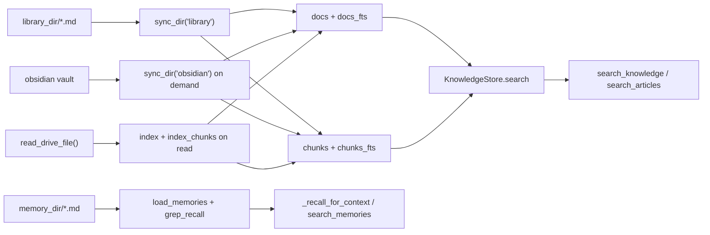

# Co CLI — Context & Session Design

Covers how co-cli assembles prompt context, governs in-session history, persists sessions and transcripts, and routes knowledge retrieval. Startup sequencing lives in [system.md](system.md), one-turn orchestration in [core-loop.md](core-loop.md), tool contracts in [tools.md](tools.md).

## 1. What & How

The agent has no persistent state in model weights. Context is split across three layers with different lifecycles:

- **Static instructions**: assembled once at agent construction
- **Dynamic instruction layers**: evaluated fresh on every model request
- **Message history**: transformed before every request by ordered history processors

Persistent context lives outside the model:

- workspace-local memories in `.co-cli/memory/`
- character memories and mindsets in `co_cli/prompts/personalities/souls/{role}/` (read-only system assets)
- user-global articles in `library_dir`
- session metadata and append-only transcripts in `.co-cli/sessions/`
- a rebuildable `KnowledgeStore` at `knowledge_db_path`

```mermaid
flowchart TD
    subgraph Build["agent construction"]
        Static[build_static_instructions]
        MainAgent[build_agent]
        Static --> MainAgent
    end

    subgraph MainRequest["main-agent request"]
        Dynamic[@agent.instructions]
        Processors[history processors 1..5]
        Model[model request]
        Dynamic --> Processors --> Model
    end

    subgraph ResumeRequest["task-agent resume"]
        ResumeModel[resume request]
    end

    Finalize[_finalize_turn]

    subgraph Storage["persistent stores"]
        Memories[".co-cli/memory/*.md"]
        Library["library_dir/*.md"]
        Sessions[".co-cli/sessions/YYYY-MM-DD-T...Z-{uuid8}.jsonl"]
        Index["KnowledgeStore / co-cli-search.db"]
    end

    MainAgent --> MainRequest
    TaskAgent --> ResumeRequest
    Model --> Finalize
    ResumeModel --> Finalize
    Finalize --> Sessions
    Finalize --> Memories
    Library --> Index
```

## 2. Core Logic

### 2.1 Prompt Layers

**Static instructions** — `build_static_instructions()` assembles in fixed order:

1. Soul seed from `souls/{role}/seed.md`
2. Character memories from `co_cli/prompts/personalities/souls/{role}/memories/*.md` (read-only system assets)
3. Mindsets from `co_cli/prompts/personalities/souls/{role}/mindsets/{task_type}.md`
4. Numbered rules from `co_cli/prompts/rules/NN_rule_id.md` (contiguous from 01, unique prefixes)
5. Examples from `souls/{role}/examples.md` (optional)
6. Model-specific counter-steering
7. Critique appended as `## Review lens` (optional)

Each personality role is fully self-contained under `souls/{role}/`. Adding a role requires only a new directory — no Python changes.

**Dynamic instruction layers** — registered in `build_agent()`, evaluated fresh per request:

| Layer | Condition | Content |
| --- | --- | --- |
| `add_current_date` | always | `Today is YYYY-MM-DD.` |
| `add_shell_guidance` | always | shell approval/reminder text |
| `add_project_instructions` | `.co-cli/instructions.md` exists | full file contents |
| `add_always_on_memories` | `always_on=True` entries exist | `Standing context:` block, capped by `memory_injection_max_chars` |
| `add_personality_memories` | `config.personality` is set | top 5 `personality-context` memories as `## Learned Context` |
| `add_category_awareness_prompt` | deferred tools registered in tool_index | category-level prompt listing available capabilities via `search_tools` (~100 tokens) |

These layers are not persisted into `message_history`.

**Approval resume** — the SDK skips `ModelRequestNode` entirely on the `deferred_tool_results` path, so resume segments run on the main agent with zero additional tokens. No separate agent is needed.

### 2.2 History Governance

Five history processors run in this exact order:

| Processor | Behavior |
| --- | --- |
| `truncate_tool_results` | clears older `ToolReturnPart` content per tool type; keeps 5 most recent per type; always protects last user turn |
| `compact_assistant_responses` | caps older `TextPart`/`ThinkingPart` to 2,500 chars with 20/80 head/tail retention; uses `_find_last_turn_start()` boundary, not turn grouping |
| `detect_safety_issues` | detects identical-tool-call streaks and shell-error streaks; injects system warning at threshold |
| `inject_opening_context` | once per new user turn, recalls top-3 memories matching user message as trailing `SystemPromptPart` |
| `summarize_history_window` | when history exceeds compaction threshold, keeps head + summary marker + tail; summarizer uses structured template (Goal, Key Decisions, Working Set, Progress, Next Steps) |

**Compaction** is budget-driven: `resolve_compaction_budget()` uses reasoning model context window, `llm.num_ctx` override, or 100K fallback. Triggers at 85% of budget. `_gather_compaction_context()` enriches the summarizer with file paths from `ToolCallPart.args`, pending todos, always-on memories, and prior summary text detected by the `[Summary of` prefix (capped at 4K chars). `_build_summarizer_prompt()` assembles the final prompt as: template → context addendum → personality addendum (personality always last).

LLM summarization falls back to a static marker when model registry is absent, failure count ≥ 3, or the summarizer call fails.

**Overflow recovery** — `_is_context_overflow()` detects context-length errors by requiring both status 400/413 AND a body pattern match (coerces `e.body` via `str()` for OpenAI dict / Ollama str). On match, `emergency_compact()` performs a non-LLM fallback: keep first + last turn groups, drop middle, insert static trim marker. At most once per foreground turn; never falls through to the 400 reformulation handler.

### 2.3 Session & Transcript Persistence

Each session is a single JSONL file under `.co-cli/sessions/` using a lexicographically sortable name:

```text
.co-cli/sessions/
└── YYYY-MM-DD-THHMMSSz-{uuid8}.jsonl   ← append-only transcript
```

Example: `2026-04-11-T142305Z-550e8400.jsonl`. The timestamp prefix makes lexicographic sort == chronological sort. The 8-char UUID suffix is the short display ID.

**Startup** — `restore_session()` runs `migrate_session_files()` first (renames legacy `{uuid}.jsonl` files, removes any `{uuid}.json` sidecars), then scans `*.jsonl` by filename (lexicographic sort — no `stat()`), and sets `deps.session.session_path` to the most recent file path. If none found, `new_session_path()` builds a path for the new session but does not write the file — the file is created on the first `append_messages` call.

**Per-turn persistence** — `_finalize_turn()` is the single write point:

1. Fire-and-forget memory extraction on clean turns (not interrupted, not `outcome == "error"`)
2. `append_messages()` appends new messages (positional tail slice) to `deps.session.session_path`; creates parent dirs on first call
3. Error banner printed when `turn_result.outcome == "error"`

**Transcript format** — JSONL, each line is a single-element list serialized via pydantic-ai's `ModelMessagesTypeAdapter`. Preserves all discriminated union part types across round-trip.

**Transcript loading** (`/resume`) — `load_transcript()` reads the full `.jsonl`, skips malformed lines with a warning.

**Session rotation** (`/new`) — summarizes current session into a `session_summary` memory artifact, assigns a new `deps.session.session_path` via `new_session_path()`, returns empty history. The next `append_messages` call creates the new file automatically.

**Session resume** (`/resume`) — `list_sessions()` presents an interactive picker (title from first user prompt, file size from stat). Selection loads transcript from `selected.path` and sets `deps.session.session_path = selected.path`.

**Session path in telemetry** — the 8-char suffix (`session_path.stem[-8:]`) is carried in OTel spans, agent run metadata, and sub-agent metadata. Sub-agents receive a fresh empty `Path()`, not the parent's path.

**Security** — session paths are constructed from internally-generated timestamps and UUIDs; no user input enters path construction. `/resume` uses an interactive picker. Files are `chmod 0o600`.

**Behavioral constraints:**
- Transcripts are append-only — never rewritten, never truncated
- `/clear` clears in-memory history only — transcript unaffected
- No TTL on sessions — permanent until manually deleted
- Startup always begins with empty `message_history`; `/resume` is explicit
- No concurrent-instance safety (future: file lock or PID guard)

### 2.4 Memory & Article Storage

Persistent knowledge is flat Markdown files with YAML frontmatter stored in two directories:

| Store | Path | Contents |
| --- | --- | --- |
| memory | `deps.memory_dir` (`.co-cli/memory/`) | conversation-derived memories and session-summary artifacts |
| articles | `deps.library_dir` | saved external references and fetched docs |

#### 2.4.1 Data Model

Every file is parsed into a `MemoryEntry` dataclass (`memory/recall.py`). `validate_memory_frontmatter()` enforces required fields and rejects malformed files with a warning (never crashes the load).

| Field | Type | Required | Notes |
| --- | --- | --- | --- |
| `id` | `int \| str` | yes | new writes use UUID strings |
| `created` | ISO8601 string | yes | set at write time, never mutated |
| `kind` | `"memory" \| "article"` | no | defaults to `"memory"` |
| `type` | `"user" \| "feedback" \| "project" \| "reference" \| null` | no | memory classification; warns on unknown values |
| `name` | `str \| null` | no | short identifier ≤60 chars (e.g. `user-prefers-pytest`); used as slug source when present |
| `description` | `str \| null` | no | ≤200 chars, no newlines; purpose hook for manifest dedup |
| `updated` | ISO8601 string | no | written on consolidation via `overwrite_memory()` |
| `tags` | `list[str]` | no | searched by `grep_recall`; filter axis for `load_memories` |
| `related` | `list[str] \| null` | no | one-hop slug links expanded by `_recall_for_context()` |
| `artifact_type` | `str \| null` | no | `session_summary` — excluded from normal recall/search |
| `origin_url` | `str \| null` | no | article source URL; dedup key in `save_article()` |
| `always_on` | `bool` | no | standing prompt injection (capped at 5 entries) |

#### 2.4.2 Read Path

All read operations are file-based. Memory is never indexed in FTS or chunked — the knowledge index is only used for library, Obsidian, and Drive sources.

```text
load_memories(memory_dir, kind=None, tags=None)
  -> glob *.md, parse frontmatter, validate
  -> early-exit per file on kind or tag mismatch
  -> returns list[MemoryEntry]

grep_recall(entries, query, max_results)
  -> case-insensitive substring match on content + tags
  -> sort by updated or created (newest first)
  -> return top max_results

_recall_for_context(ctx, query)  ← internal, called by inject_opening_context only
  -> load_memories, optional tag/date filters
  -> exclude artifact_type="session_summary"
  -> grep_recall: case-insensitive substring match, sort by recency, top max_results
  -> one-hop related slug expansion (up to 5 hops)
  -> return matched + related entries

search_memories(ctx, query)      ← agent tool
  -> load_memories + grep_recall (top 20)
  -> no scoring or decay
```

The always-on layer (`load_always_on_memories`) runs at instruction-build time: loads all memories, filters `always_on=True`, caps at 5, injects into the `add_always_on_memories` dynamic instruction layer.

#### 2.4.3 Write Path

The main agent has no write-path memory tools. All memory writes are owned exclusively by the extractor agent (`_extractor.py`) — a separate `Agent[CoDeps, None]` with `save_insight` as its only tool.

```text
fire_and_forget_extraction(delta, deps, frontend, cursor_start)
  -> builds a text window from delta (user turns, assistant text, tool calls, tool results)
  -> runs _insights_extractor_agent.run(window, deps=deps) in a background task
  -> on success: advances deps.session.last_extracted_message_idx = cursor_start + len(delta)
  -> on failure or exception: cursor unchanged (delta re-processed on next turn)

save_insight(ctx, content, type_=None, name=None, description=None, tags=None, always_on=False)
  -> slug = slugify(name) if name else slugify(content[:50])
  -> filename = f"{slug}-{uuid[:8]}.md"   # UUID suffix: two identical calls → two files
  -> write YAML frontmatter + content to deps.memory_dir
  -> no dedup, no resource locks — always creates a new file
```

The extractor prompt instructs the model to classify observations into four types (`user`, `feedback`, `project`, `reference`) and call `save_insight` directly, with a cap of 3 calls per window. The cursor advances only on successful completion, so a failed extraction retries on the next turn.

**Session-summary artifacts** — `/new` writes a memory file directly with `artifact_type="session_summary"`. These are excluded from `_recall_for_context()` and `search_memories()` by predicate.

**Articles** — `save_article()` stores external references with `kind="article"` and dedup by exact `origin_url`.

#### 2.4.4 REPL Management

The `/memory` built-in provides inventory and deletion without requiring an LLM turn. All subcommands share a common filter pipeline: `load_memories(kind=)` → `_apply_memory_filters(older_than, type)` → `grep_recall(query)`.

| Command | Syntax | Behavior |
| --- | --- | --- |
| `/memory list` | `[query] [flags]` | one line per entry: `id[:8]  date  [kind]  type  content[:80]`; footer shows count |
| `/memory count` | `[query] [flags]` | prints `N memories` |
| `/memory forget` | `<query\|flag> [flags]` | preview matched entries → prompt `Delete N memories? [y/N]` → unlink on `y` |

**Shared filter flags** (parsed by `_parse_memory_args`, applied by `_apply_memory_filters`):

| Flag | Type | Effect |
| --- | --- | --- |
| `query` (positional) | string | case-insensitive substring match on content and tags via `grep_recall` |
| `--older-than N` | int days | keep entries where `age_days > N` |
| `--type X` | string | exact match on `type` field (`user`, `feedback`, `project`, `reference`) |
| `--kind X` | string | passed to `load_memories(kind=X)` — `memory` or `article` |

**Behavioral constraints on `/memory forget`:**
- No query and no flags → refuse and print usage; never bulk-deletes silently
- Always displays a preview of matched entries and requires explicit `y` before any deletion, even for a single match

### 2.5 Knowledge Index & Retrieval

`KnowledgeStore` is a single SQLite-backed derived index at `knowledge_db_path`.



| Structure | Role |
| --- | --- |
| `docs` + `docs_fts` | document-level records; retained for schema migration/reset (not actively queried for memories) |
| `chunks` + `chunks_fts` | chunk-level records for library, obsidian, and drive sources |
| `embedding_cache` | cached embeddings keyed by provider, model, content hash |
| `docs_vec_{dims}` / `chunks_vec_{dims}` | hybrid-mode sqlite-vec tables |

Memory is never chunked and is not indexed in FTS — memories use grep-only recall. Bootstrap syncs only the library dir; Obsidian syncs lazily inside `search_knowledge()`; Drive files index after fetch.

| Entry point | Default scope | Notes |
| --- | --- | --- |
| `_recall_for_context()` | memory only | grep-only; sort by recency, one-hop `related` expansion, excludes `session_summary`; internal — called by `inject_opening_context` |
| `search_memories()` | memory only | grep-only keyword search |
| `search_articles()` | library articles only | summary-level index |
| `search_knowledge()` | `["library", "obsidian", "drive"]` | `source="memory"` rejected with redirect to `search_memories()` |

| Backend | Behavior |
| --- | --- |
| `grep` | file-based fallback, no `KnowledgeStore` |
| `fts5` | BM25 over `chunks_fts` (library, obsidian, drive) |
| `hybrid` | FTS + vector, RRF merge, optional TEI or LLM reranking |

### 2.6 Delegation & Background Tasks

**Inline sub-agents** return structured metadata (`run_id`, `role`, `model_name`, `requests_used`, `request_limit`, `scope`) plus domain-specific payload. `/history` reconstructs delegation history from `ToolReturnPart`s.

**Background tasks** — `start_background_task` stores state in `deps.session.background_tasks`. Each `BackgroundTaskState` tracks task ID, command, status, timestamps, exit code, and output ring buffer (`deque(maxlen=500)`). Session-scoped in memory only.

**Oversized tool output** — when display text exceeds 50,000 chars, `persist_if_oversized()` writes to `.co-cli/tool-results/` and returns a placeholder with path, length, and 2K preview.

## 3. Config

### Prompt & History

| Setting | Env Var | Default | Description |
| --- | --- | --- | --- |
| `personality` | `CO_CLI_PERSONALITY` | `tars` | personality for static prompt assembly and memory injection |
| `doom_loop_threshold` | `CO_CLI_DOOM_LOOP_THRESHOLD` | `3` | identical-tool-call streak for warning injection |
| `max_reflections` | `CO_CLI_MAX_REFLECTIONS` | `3` | shell-error streak for reflection-cap injection |
| `llm.num_ctx` | `LLM_NUM_CTX` | `262144` | Ollama context budget for compaction |

### Session

| Setting | Env Var | Default | Description |
| --- | --- | --- | --- |
| `deps.sessions_dir` | n/a | `<cwd>/.co-cli/sessions` | workspace-relative; resolved onto `CoDeps`, not configurable via settings |

### Memory

| Setting | Env Var | Default | Description |
| --- | --- | --- | --- |
| `memory.recall_half_life_days` | `CO_MEMORY_RECALL_HALF_LIFE_DAYS` | `30` | age decay in recall scoring |
| `memory.injection_max_chars` | `CO_CLI_MEMORY_INJECTION_MAX_CHARS` | `2000` | cap for always-on and recalled injection |

### Knowledge

| Setting | Env Var | Default | Description |
| --- | --- | --- | --- |
| `obsidian_vault_path` | `OBSIDIAN_VAULT_PATH` | `None` | optional Obsidian vault |
| `library_path` | `CO_LIBRARY_PATH` | `None` | override for `library_dir` |
| `knowledge.search_backend` | `CO_KNOWLEDGE_SEARCH_BACKEND` | `hybrid` | `grep`, `fts5`, or `hybrid` |
| `knowledge.embedding_provider` | `CO_KNOWLEDGE_EMBEDDING_PROVIDER` | `tei` | embedding provider |
| `knowledge.embedding_model` | `CO_KNOWLEDGE_EMBEDDING_MODEL` | `embeddinggemma` | embedding model |
| `knowledge.embedding_dims` | `CO_KNOWLEDGE_EMBEDDING_DIMS` | `1024` | embedding dimension |
| `knowledge.embed_api_url` | `CO_KNOWLEDGE_EMBED_API_URL` | `http://127.0.0.1:8283` | embedding service URL |
| `knowledge.cross_encoder_reranker_url` | `CO_KNOWLEDGE_CROSS_ENCODER_RERANKER_URL` | `http://127.0.0.1:8282` | TEI reranker URL |
| `knowledge.llm_reranker` | — | `None` | optional LLM reranker |
| `knowledge.chunk_size` | `CO_CLI_KNOWLEDGE_CHUNK_SIZE` | `600` | chunk size for non-memory sources |
| `knowledge.chunk_overlap` | `CO_CLI_KNOWLEDGE_CHUNK_OVERLAP` | `80` | overlap between chunks |

### Delegation

| Setting | Env Var | Default | Description |
| --- | --- | --- | --- |
| `subagent.scope_chars` | `CO_CLI_SUBAGENT_SCOPE_CHARS` | `120` | scope prefix length in sub-agent outputs |
| `subagent.max_requests_coder` | `CO_CLI_SUBAGENT_MAX_REQUESTS_CODER` | `10` | coding sub-agent budget |
| `subagent.max_requests_research` | `CO_CLI_SUBAGENT_MAX_REQUESTS_RESEARCH` | `10` | research sub-agent budget |
| `subagent.max_requests_analysis` | `CO_CLI_SUBAGENT_MAX_REQUESTS_ANALYSIS` | `8` | analysis sub-agent budget |
| `subagent.max_requests_thinking` | `CO_CLI_SUBAGENT_MAX_REQUESTS_THINKING` | `3` | reasoning sub-agent budget |

## 4. Files

| File | Purpose |
| --- | --- |
| `co_cli/agent.py` | main-agent and task-agent construction; instruction registration |
| `co_cli/prompts/_assembly.py` | static instruction assembly and rule validation |
| `co_cli/prompts/personalities/_loader.py` | soul seed, mindset, character memory, examples, critique loading |
| `co_cli/prompts/personalities/_injector.py` | per-turn `personality-context` memory injection |
| `co_cli/prompts/personalities/_validator.py` | personality discovery and file validation |
| `co_cli/context/_history.py` | history processors, compaction boundaries, emergency compaction, context enrichment |
| `co_cli/context/summarization.py` | summarizer agent, compaction budget, token estimation |
| `co_cli/context/session.py` | session filename generation, latest-session discovery, migration from legacy format, new-path factory |
| `co_cli/context/transcript.py` | JSONL transcript: append, load, compact boundary |
| `co_cli/context/_deferred_tool_prompt.py` | `build_category_awareness_prompt()` — category-level prompt for deferred tool discovery |
| `co_cli/tools/tool_result_storage.py` | oversized tool-result persistence |
| `co_cli/context/types.py` | `MemoryRecallState` and `SafetyState` |
| `co_cli/memory/recall.py` | `MemoryEntry` dataclass, `load_memories`, `load_always_on_memories` |
| `co_cli/memory/_extractor.py` | cursor-based delta extraction; `fire_and_forget_extraction`, `drain_pending_extraction`, `_build_window` |
| `co_cli/tools/insights.py` | `save_insight` — extractor-only write tool; UUID-suffix always-new file write |
| `co_cli/knowledge/_frontmatter.py` | frontmatter parsing and validation |
| `co_cli/knowledge/_store.py` | SQLite schema, indexing, backend routing, hybrid merge, reranking, sync |
| `co_cli/tools/memory.py` | `grep_recall`, `_recall_for_context` (internal), agent tools: `search_memories`, `list_memories` |
| `co_cli/tools/articles.py` | article save/search/read plus cross-source `search_knowledge()` |
| `co_cli/tools/google_drive.py` | Drive fetch plus opportunistic index/chunk caching |
| `co_cli/tools/subagent.py` | inline sub-agent tools and result metadata |
| `co_cli/tools/background.py` | session-scoped background task state and subprocess monitor |
| `co_cli/tools/tool_output.py` | `ToolReturn` construction and optional oversized-result persistence |
| `co_cli/commands/_commands.py` | slash-command dispatch; `/memory`, `/resume`, `/compact`, `/new`, `/sessions`, `/history`, task-control |
| `co_cli/bootstrap/core.py` | knowledge backend discovery, store sync, session restore |
| `co_cli/main.py` | `_finalize_turn()` transcript persistence, `_chat_loop()` REPL session lifecycle |
