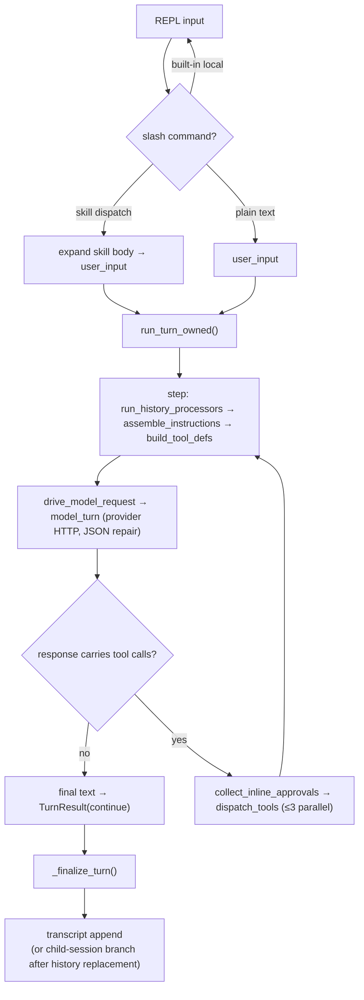
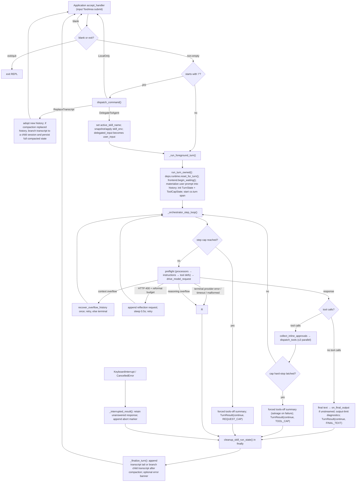

# Co CLI Core Loop Design


For top-level architecture and startup sequencing, see [01-system.md](01-system.md) and [bootstrap.md](bootstrap.md). This doc owns foreground-turn execution, inline approval, retries, interrupts, and the orchestration points where history processors and compaction recovery are invoked. Instruction-layer construction and per-request assembly live in [prompt-assembly.md](prompt-assembly.md); session persistence and recall live in [sessions.md](sessions.md); memory items and recall live in [memory.md](memory.md); compaction mechanics in [compaction.md](compaction.md).

## 1. Foreground Turn Flow

This doc describes one complete foreground turn, from prompt input to post-turn finalization.

**Vocabulary — `turn ⊇ step`.** A **turn** (one user message) contains one or more **steps**; a **step** is one model request (one request/response exchange with the LLM) plus the dispatch of any tool calls that response carries. A turn spans multiple steps whenever the model emits tool calls — the loop feeds the tool results back and requests again. Two levels, not three: there is no intermediate "run" object between turn and step, and no validated run-completion result — done-ness is a local predicate ("the model emitted no tool calls"), not a completion contract. See §2.1 for why this two-level shape is intrinsic to the agentic loop.

**Bounds at each layer.** Each level has its own ceiling:

| Layer | Bound | Mechanism |
| --- | --- | --- |
| step → tool calls | `MAX_TOOL_CALLS_PER_MODEL_REQUEST` (3) tool calls executed per step (calls past the cap are shed with an exceeded payload); `TOOL_CAP_HARD_STOP_CONSECUTIVE` (3) consecutive over-cap steps end the turn with a **forced tools-off summary call** (`outcome="continue"`, with a cap-stop status), falling back to the model's last answer / a generic message only if that call fails | `ToolCapState.note_calls` counts a step's issued calls **before fan-out** and latches `hard_stop` once the consecutive-over-cap streak reaches the threshold; `dispatch_tools` (`co_cli/agent/dispatch.py:234`) computes the shed boundary and `_orchestrator_step_loop` (`co_cli/agent/loop.py`) reads `cap_state.hard_stop` after dispatch, then runs `_forced_summary_turn` |
| turn → steps | `max_model_requests_per_turn` (40; `0` disables) caps total model requests **across the whole turn**, checked **before every step** | `run_turn_owned` resolves the limit via `resolve_request_limit` (`co_cli/config/llm.py:268`) and `_orchestrator_step_loop` checks `requests_completed >= request_limit` at the top of each step — the request that *would* exceed the cap is never sent. On reaching it the loop makes one **forced tools-off summary call** and returns `outcome="continue"` (still `exit_reason=TurnExit.REQUEST_CAP`, `loop.py`), not a terminal error |

There is no separate run-level ceiling — the turn has only two levels. Enforcement of the step cap is **before-step** (the request that *would* exceed the cap is blocked), not boundary-inclusive — a turn that legitimately runs exactly `max_model_requests_per_turn` steps and stops on the last one completes successfully; only a turn that would continue past the cap is interrupted.

**Graceful wrap-up before the cumulative cap.** Because the step that *would* exceed the cap is blocked before its request is sent (no chance to answer), the `wrap_up_prompt` dynamic instruction (`co_cli/agent/_instructions.py:53`) softens the landing: `assemble_instructions` passes it the count of completed requests, and on the one step where `request_count == limit - 1` (the last step the loop will still run) it returns the `WRAP_UP_TEXT` instruction telling the model to produce its final answer now and call no more tools. If the model complies, the turn completes normally on that step (no tool calls → `FINAL_TEXT`) and the cap never fires. The nudge is the *first* graceful net: if the model ignores it and the cap does fire, the forced tools-off summary call (§2.6) is the second net — either way the turn returns `outcome="continue"` with a written answer rather than a bare error. The nudge fires at most once (the next step's `request_count` no longer equals `limit - 1`). As a dynamic instruction it lands in the request's `instruction_parts`, never as a `UserPromptPart`, and is recomputed fresh each step rather than stored to history, so it is never replayed to the next turn. When `max_model_requests_per_turn = 0` the cap is disabled (`resolve_request_limit → None`) and no nudge is injected.

**Why the turn cap is 40 — circuit breaker, not work limit.** `max_model_requests_per_turn` is the guard against an in-cap doom-loop: a model that re-issues 1–3 tool calls per step indefinitely never trips the consecutive-over-cap hard-stop (the streak resets on any ≤3-call step), so the per-turn step count is the only ceiling that stops it. The value is sized between two opposing bounds. Floor: observed legitimate usage maxes at ~7 model requests per single pass, but a recon-heavy multi-gate turn (many approval prompts, the occasional length-continuation retry) can realistically stack to ~20–25 — the cap must clear that to never bite real work. Ceiling: the prior value of 90 let such a loop burn ~90 multi-second local-model requests (minutes of a wedged-looking session) before firing. 40 sits ≈5–6× over typical real usage with >2× margin over the multi-step worst case, yet ~2.5× tighter than 90. It is deliberately set *above* peer single-loop caps (e.g. opencode's 25) because co's turns can span more cumulative steps than a single activity loop, so 25 would risk false trips. Within the defensible 35–40 band the high end is chosen: a too-low cap falsely kills legitimate user work (user-visible, erodes trust), whereas a too-high cap only lets a doom-loop run a handful of extra cheap requests (invisible) — an asymmetry that favors headroom.

Cross-subsystem overview — one full turn crosses every subsystem; detailed behavior at each step lives in the linked specs:



| Stage | Owned by |
| --- | --- |
| Slash-command dispatch, skill expansion | [tui.md](tui.md), [skills.md](skills.md) |
| `run_turn_owned` / step loop / inline approval / retries | [core-loop.md](core-loop.md) |
| Instruction parts + history processors | [prompt-assembly.md](prompt-assembly.md) |
| Compaction trigger (processor #5) | [compaction.md](compaction.md) |
| On-demand recall (`memory_search` / `session_search` tools) | [memory.md](memory.md) · [sessions.md](sessions.md) |
| Transcript append / child-session branching | [sessions.md](sessions.md) |

Detailed foreground turn flow:



Execution owners:

| Owner | Responsibility |
| --- | --- |
| `_chat_loop()` | prompt input, blank/exit handling, slash dispatch, transcript replacement, and skill-env setup |
| `_run_foreground_turn()` | `run_turn_owned()`, REPL-interrupt absorption, guaranteed skill-env cleanup, and post-turn finalization |
| `run_turn_owned()` | one orchestrated LLM turn: reset turn state, materialize the prompt, own the `co.turn` span and interrupt/last-resort handling, return a `TurnResult` |
| `_orchestrator_step_loop()` | the per-step loop — preflight, model request, classify provider error and recover inline, branch on final-text / tool-dispatch / cap |
| `drive_model_request()` | one streamed model request via `model_turn`, rendering deltas under the stall window, returning the assembled response + usage |
| `collect_inline_approvals()` / `dispatch_tools()` | sequential pre-fan-out approval collection, then parallel tool dispatch with the step cap |
| `_finalize_turn()` | transcript persistence/branching and generic error banner |

Boundary rules keep the loop legible:

- REPL-owned transcript state lives in `message_history` inside `main.py`
- orchestration never mutates REPL history in place; it returns a `TurnResult` with the next transcript snapshot
- transcript durability is tracked separately via `persisted_message_count` and `compaction_applied_this_turn`

## 2. Core Logic

### 2.1 Why Two Levels — The Loop's Intrinsic Shape

A turn and a step are **intrinsic to any agentic tool-calling loop**. Strip the loop to its primitive and there are exactly two natural scopes:

```text
while True:                 # the TURN — one user message, possibly many round-trips
    response = call_model()
    if no tool calls: break # done-ness is a LOCAL predicate, not an object
    dispatch tools          # the STEP repeats
```

Done-ness is a one-line check ("the response carries no tool calls", §2.3), not a separate completion contract. Nothing here needs a third layer: there is no "run" object between turn and step, no validated completion boundary the loop must satisfy, and no run-result wrapper to unpack. The final response carries the answer directly; the loop ends a turn in exactly three ways — final text (no tool calls), a tool-cap hard-stop, or a classified exception bubbling out of the step.

A mid layer would only appear if the loop were built on a graph engine. A graph's unit is "walk to a typed `End`", carrying a validated output contract; that contract *is* a third layer, and it is finer than co's turn (approval and length-retry each restart the graph) yet coarser than a single model request — a size mismatch that forces a turn-wrapper around N graph walks. The one property a graph genuinely buys is durable suspend/resume, whose only use here would be approval. co makes approval **inline within a step** (§2.3), so the loop never suspends — removing the sole reason the engine layer would justify itself. Owning the `while` loop is therefore net-simpler for co, not merely stylistic.

This two-level shape also tracks the frontier consensus: the single-agent tool-calling loop is converging industry-wide on the hand-written `while` loop, with graphs re-scoped *upward* to durable, branching **multi-agent** orchestration rather than the inner loop. co's owned-loop peers (hermes, opencode, openclaw, codex) are all two-level. The escape hatch follows directly: genuine multi-agent *branching* (not today's single-driver subagents) is where a graph would be the right tool — at that altitude, not inside this loop.

### 2.2 Turn Contract And State Ownership

`run_turn_owned()` is the only public one-turn orchestration entrypoint (`co_cli/agent/loop.py:198`). It returns a `TurnResult` (`co_cli/agent/turn_state.py:119`):

| Field | Meaning |
| --- | --- |
| `outcome` | `"continue"` or `"error"` |
| `interrupted` | whether the turn ended due to interrupt/cancellation |
| `messages` | next transcript snapshot for the REPL |
| `output` | final model output text, or `None` on a terminal exit |
| `usage` | turn-cumulative `RunUsage` payload |
| `model_requests` | count of `ModelResponse`s across the turn's steps (feeds the post-turn skill-review gate) |

Turn-scoped mutable state is explicit in `TurnState` (`turn_state.py:98`), reconstructed at every turn entry (never agent-object counters):

| `TurnState` field | Owner |
| --- | --- |
| `history` | the working message list — the request-building source for every step |
| `model_requests` | `ModelResponse` count across the turn's steps (reporting + skill-review gate) |
| `exit_reason` | the `TurnExit` value set once the loop terminates |
| `cap_state` | a `ToolCapState` — the per-turn flood-cap accounting (`turn_state.py:59`) |
| `overflow_recovery_attempted` | latches the once-per-turn emergency compaction (`recover_overflow_history`) |
| `tool_reformat_budget` | bounds the HTTP 400 tool-call reflection retries (app logic, not transport retry) |

The typed `TurnExit` enum (`turn_state.py:36`) records *how* a turn ended — one grep-able value replacing any mix of exception types and string-matched signatures: `FINAL_TEXT`, `TOOL_CAP`, `REQUEST_CAP`, `REASONING_OVERFLOW`, `PROVIDER_ERROR`, `TIMEOUT`, `INTERRUPTED`.

`ToolCapState` (`turn_state.py:59`) owns the flood cap at the **step boundary**: `note_calls(n)` records a step's issued tool-call count, extends the consecutive-over-cap streak (resetting it on any within-cap step), and latches `hard_stop` once the streak reaches `TOOL_CAP_HARD_STOP_CONSECUTIVE`. `shed_boundary(n)` returns how many of a step's calls execute (the rest are shed with an exceeded payload). The cap is counted **before** the parallel fan-out, in `dispatch_tools`.

Cross-cutting turn state lives on `deps.runtime` instead (`co_cli/deps.py`), zeroed each turn by `reset_for_turn()`:

| `deps.runtime` field | Role |
| --- | --- |
| `current_request_tokens_estimate` | realtime-local request size written by `spill_largest_tool_results` each step; read for the status-line context % and compaction-trigger telemetry |
| `tool_progress_callback` | owned by `StreamRenderer` and active tool surfaces; cleared at turn end |
| `status_callback` / `frontend` | the parent prompt surface, set from `frontend` for the turn so tool bodies (and a delegated subtask's approval prompts) can reach it |
| `revealed_tools` | the set of DEFERRED tools the model has loaded via `tool_view`; the sole deferral mechanism, read by `_tool_visibility_filter` |
| `clarify_answers` | per-`tool_call_id` answer lists stashed by inline approval's clarify path, read by the clarify tool body |
| `compaction_skip_count` | cross-turn circuit breaker for inline compaction (>= 3 trips the breaker; every 10 skips a probe is attempted) |
| `consecutive_low_yield_proactive_compactions` | anti-thrash counter gating the post-turn context-pressure warning |
| `compaction_applied_this_turn` | set when a step replaced history via compaction; tells `_finalize_turn()` to branch into a child transcript |
| `active_skill_name` | cross-function skill dispatch marker cleared after the turn |
| `pending_interrupt_result` | the drop→fill `TurnResult` stashed on `CancelledError` for the REPL caller that owns the interrupt |

### 2.3 Step Contract

`_orchestrator_step_loop()` (`co_cli/agent/loop.py:280`) runs the per-step loop. Each step, in order:

1. **request-cap check** — if `requests_completed >= request_limit`, run the forced tools-off summary (§2.6) and return `outcome="continue"` with `exit_reason=REQUEST_CAP` (the request that would exceed the cap is never sent; the summary call reuses the gathered context to synthesize a written answer).
2. **preflight** — `run_history_processors(history, deps)` (the five processors, §2.5), then `fill_unanswered_tool_calls` (the every-step stub net), `assemble_instructions` (static prefix + five dynamic parts), and `build_tool_defs` (the visibility-filtered tool schema). The processed history is persisted back to `TurnState.history`; `clean_message_history` produces a throwaway request copy that is **not** persisted.
3. **model request** — `drive_model_request(...)` drives one streamed request through `model_turn` (§2.6), rendering deltas and returning the assembled, JSON-repaired `ModelResponse` plus a `RunUsage`.
4. **classify** — the response's `ToolCallPart`s decide the branch: no tool calls → final-text path; tool calls → dispatch path.

The model request is wrapped in `asyncio.timeout(llm.run_stall_timeout_secs)` used as a model-generation **stall timeout**, not an absolute deadline. The window is operator-tunable (`llm.run_stall_timeout_secs`, default 120; local-model latency varies widely by model/hardware, so a fixed window risks false stalls). It is rescheduled (re-armed) on stream open **and on every streamed event**, so the deadline measures time since the last model token — the timeout fires only when the model produces no progress for the configured window. Tool execution is bounded by each tool's own timeout, outside this guard. A `TimeoutError` is classified by `classify_provider_error` as `TERMINAL` with `TurnExit.TIMEOUT` — no retry.

**Final-text branch** (no tool calls): `renderer.finish()` flushes the buffers; if the response is a reasoning overflow (`is_reasoning_overflow`, §2.6) the turn ends terminal with `REASONING_OVERFLOW`; if a length-continuation retry applies (`length_retry_settings`, §2.6) the truncated partial is discarded and the step loop re-runs with a boosted token budget; otherwise the response is appended to history, the final text is emitted via `on_final_output` when nothing was streamed, output-limit diagnostics run, and the turn returns `outcome="continue"` with `FINAL_TEXT`.

**Tool-dispatch branch**: the response is appended to history, `collect_inline_approvals` (§2.4) resolves the step's approval decisions, `dispatch_tools` runs the calls (parallel ≤ cap, with the cap counted first), the tool-return parts are appended as one `ModelRequest`, and `cap_state.hard_stop` is checked. On a latched hard-stop the turn runs the forced tools-off summary (§2.6) and ends `outcome="continue"` with `TOOL_CAP`, falling back to the last assistant text (or a generic message when none exists) only if the summary call fails.

Reasoning display is purely a frontend concern:

| Mode | Behavior |
| --- | --- |
| `off` | thinking is discarded |
| `collapsed` | a transient `Thinking… Ns` live line that commits a single durable `Thought for Ns` summary; raw body never shown |
| `full` | default; the `Thinking… Ns` header plus the raw thinking body are streamed and committed through the thinking surface |

### 2.4 Approval Flow

Approval is **inline within a step**: the loop never suspends. `collect_inline_approvals()` (`co_cli/agent/approval.py:127`) resolves a step's approval decisions **before** the parallel tool fan-out, and feeds them into `dispatch_tools` as `denials` (denied calls → a denial `ToolReturnPart`) plus `approved_ids` (the set of call ids that run with `ctx.tool_call_approved=True`, the in-body raisers' gate). A denial is fed back to the model as a tool-return part and the turn **continues** — approved siblings in the same step still execute.

Collection is **strictly sequential** over the step's calls in original order — the prompts are never `gather`-ed, because the frontend has a single instance-level prompt future, so concurrent prompts would clobber it. For each call:

0. **clarify** (`call.tool_name == "clarify"`) takes the question path: for each question dict, build a `QuestionPrompt(question, options, multiple)` and `await frontend.prompt_question(prompt)`; stash the answers list in `deps.runtime.clarify_answers[tool_call_id]` and add the call to `approved_ids` so the clarify body reads the stash and returns the answers. Headless (`frontend is None`) auto-approves with empty answers.
1. otherwise, decide whether the call needs approval: a catalog `is_approval_required` tool, **or** a `shell_exec` whose `cmd` hits the dynamic `REQUIRE_APPROVAL` policy gate (`evaluate_shell_command`). Calls needing no approval are left untouched (they execute normally).
2. resolve one `ApprovalSubject` via `resolve_approval_subject`.
3. if `is_auto_approved(subject, deps)` (an existing remembered rule), add to `approved_ids` with no prompt.
4. otherwise `await frontend.prompt_approval(subject)` for `y`, `n`, or `a` (`frontend is None` → `"n"`, headless auto-deny — a write-capable agent never acts unprompted).
5. `y`/`a` add the call to `approved_ids`; `a` also calls `remember_tool_approval` when the subject is rememberable. `n` records a denial part.

The interactive frontend prompts (`prompt_approval`, `prompt_question`, `prompt_confirm`) are
coroutines: the `TerminalFrontend` runs each blocking read via `run_in_terminal(...)`, which
suspends the owned `Application` and restores cooked-mode terminal ownership for the read.

Approval subject scopes:

| Tool shape | Subject kind | Remembered value |
| --- | --- | --- |
| `run_shell_command` | `shell` | first token of `cmd` |
| `file_write`, `file_patch` | `path` | parent directory |
| `web_fetch` | `domain` | parsed hostname |
| everything else, including MCP tools | `tool` | tool name |

Important precision:

- there is no resume hop and no resume-narrowing filter — approval happens within the step that issued the calls, so the model never re-decides an already-approved call
- `_tool_visibility_filter` (`co_cli/agent/toolset.py:61`) hides a DEFERRED tool until its name is in `deps.runtime.revealed_tools` (loaded via `tool_view`); this is co's sole deferral mechanism, applied uniformly to native and MCP tools
- the delegated-subtask driver passes `origin_label` so a delegated agent's gated call is identifiable on the parent's frontend; it is purely cosmetic (auto-approval and remember-choice match on `kind`/`value`, never `display`)

Shell approval remains split correctly:

- `evaluate_shell_command()` decides `DENY`, `ALLOW`, or `REQUIRE_APPROVAL` from command shape (a side-effect-free pure function, so the collector and the shell body can both evaluate it)
- only the `REQUIRE_APPROVAL` path prompts in `collect_inline_approvals`
- a `DENY` shell command is rejected inside the shell tool body; it never reaches the approval collector

### 2.5 History Processors, Preflight, And Inline Compaction

The orchestrator's five history processors run in this exact order (`ORCHESTRATOR_SPEC.history_processors` in `co_cli/agent/orchestrator.py`), driven once per step by `run_history_processors(history, deps)` (`co_cli/agent/preflight.py:60`), all pure transformers:

1. `elide_old_multimodal_prompts`
2. `dedup_tool_results`
3. `evict_old_tool_results`
4. `spill_largest_tool_results`
5. `proactive_window_processor`

Five dynamic-instruction builders run every step via `assemble_instructions` (`preflight.py:199`), evaluated in registration order after the static prefix:

- `safety_prompt` — doom-loop detection + shell reflection cap; active warnings returned as plain text (reads the step's `messages`)
- `wrap_up_prompt` — returns the `WRAP_UP_TEXT` nudge on the last step before the request cap (see §1); empty on all other steps
- `current_time_prompt` — current date string at day-only granularity; ephemeral grounding kept cache-stable within a session-day
- `deferred_tool_awareness_prompt` — names the deferred-tool surface so the model knows what it can fetch
- `skill_manifest_prompt` — injects the `<available_skills>` manifest

Processor roles:

| Processor | Role |
| --- | --- |
| `elide_old_multimodal_prompts` | strips inline pixels (`BinaryContent`) from non-tail `UserPromptPart`s so base64 does not accumulate; preserves the most recent turn's images; protects the last turn via the same `_find_last_turn_start` boundary |
| `dedup_tool_results` | collapses identical `(tool_name, content-hash)` `ToolReturnPart`s in the pre-tail region into back-references pointing at the latest `tool_call_id` |
| `evict_old_tool_results` | content-clears tool returns older than the 5-most-recent per tool name; replaces with a semantic marker; protects the last turn (from last `UserPromptPart` onward) |
| `spill_largest_tool_results` | force-spills the largest unspilled `ToolReturnPart`s across the full message list when total tokens exceed `deps.spill_threshold_tokens`; the cheap (non-LLM) path that fires before `proactive_window_processor` |
| `proactive_window_processor` | replaces the middle of long histories with an inline LLM summary or static marker (circuit-breaker fallback) |

Preflight runs at the top of every step. The processor output **is** persisted back to `TurnState.history` (the request-pressure-reduced history is the working history). The dynamic instructions are ephemeral — they land on the request's `instruction_parts`, never stored to history — so they are recomputed fresh each step and never replay into the next turn. `clean_message_history` (a verbatim port of pydantic-ai's private graph helper) is applied only to the throwaway request copy, never persisted.

Ordering rationale:

- **#1–2 before #3–4**: dedup and eviction run before size enforcement and summarization. The summarizer sees a smaller, deduped history; size enforcement fires after cheap reductions but before the LLM call.
- **Dynamic instructions before model request**: the five dynamic builders are evaluated each step before the request is sent. Their output is ephemeral context — not stored back to `TurnState.history`.

Compaction behavior:

- `proactive_window_processor()` calls `summarize_messages()` inline with a structured template when compaction triggers; the single `in_progress` todo reaches the summarizer as the compaction `focus`, and active todos are carried verbatim into the compacted history by `build_todo_snapshot` (see [self-planning.md](self-planning.md))
- it compacts when token count exceeds `cfg.compaction_ratio` (0.50) of the budget
- token count is `effective_request_tokens` — the floor-inclusive realtime-local estimate (`deps.static_floor_tokens + estimate_message_tokens()`, where the message estimate counts `ToolCallPart.args` and `(dict, list)` content); no provider-reported floor (peer-aligned with hermes/openclaw). Adding the bootstrap-measured static-instruction + ALWAYS-schema floor keeps the trigger from undercounting live size by one floor (see [compaction.md](compaction.md) §1.5)
- the budget is resolved by `resolve_compaction_budget()` in `context/summarization.py`: returns `deps.model_max_context_tokens` directly (Ollama probe result capped by `llm.max_context_tokens`, set at bootstrap)
- when `deps.model` is absent (sub-agents, tests), it uses a static marker directly without incrementing the failure counter
- a circuit breaker (`deps.runtime.compaction_skip_count`) trips at `BREAKER_TRIP` (3) consecutive failures; tripped state uses static markers but probes the LLM once every `BREAKER_PROBE_EVERY` (10) skips — probe success resets the counter to 0
- a `[dim]Compacting conversation...[/dim]` indicator is shown before the LLM call
- successful history replacement sets `deps.runtime.compaction_applied_this_turn`, which later tells `_finalize_turn()` to persist into a child transcript instead of appending into the parent transcript

Knowledge recall is on-demand, not injected per-turn:

- the session-start date is frozen into the static instructions built once per turn by `build_static_instructions()` (`preflight.py:186`) — stable across the turn's steps
- personality memories live in the static system prompt (composed once per turn from `ORCHESTRATOR_SPEC.static_instruction_builders`)
- the agent calls `memory_search()` or `session_search()` proactively when past context is relevant

### 2.6 Retries, Output Limits, Errors, And Interrupts

`_orchestrator_step_loop()` owns app-level error handling. A single in-loop catch wraps `drive_model_request`; the raised provider exception is classified by `classify_provider_error` (`co_cli/agent/recovery.py:88`) into a typed `ErrorClass` carrying an `ErrorAction`, a `TurnExit`, the user-facing status, and the turn-span event. `_recover_provider_error` (`loop.py:395`) reads the action and either retries the step or returns a terminal `TurnResult`. The loop never string-matches exception text. Transport-level retries (HTTP 429, 5xx, network errors) are delegated to the OpenAI SDK's built-in retry machinery and are not managed by the loop.

Error matrix:

| Condition | `ErrorAction` | Behavior |
| --- | --- | --- |
| HTTP 413, or HTTP 400 with explicit overflow evidence (`is_context_overflow` in `_http_error_classifier`) | `RECOVER_OVERFLOW` | one-shot `recover_overflow_history()` (latched by `overflow_recovery_attempted`) — strips every `ToolReturnPart` to a semantic marker; if the stripped history fits the budget it commits with no LLM call, else plans boundaries and summarizes. The helper self-commits; the loop just assigns its return and retries. Terminal (`PROVIDER_ERROR`) when the helper returns `None` (no boundary) or on a second overflow. Never falls through to the 400 reflection path. |
| HTTP 400, not context overflow | `REFLECT_400` | while `tool_reformat_budget > 0`: decrement it, append a reflection `ModelRequest` describing the rejected tool call, sleep 0.5s, retry (app-level reformulation, not transport retry). Budget exhausted → terminal (`PROVIDER_ERROR`). |
| any other HTTP code | `TERMINAL` | status `Provider error (HTTP {code})`; record the `provider_error` span event (`http.status_code`, `error.body` capped at 500 chars); terminal `PROVIDER_ERROR`. |
| `ModelAPIError` / `httpx.ReadError` (network errors exhausted by SDK) | `TERMINAL` | `Network error:` status; `transient_error` span event; terminal `PROVIDER_ERROR`. |
| `TimeoutError` (stall-window guard) | `TERMINAL` | no retry; timeout status; `transient_error` span event; terminal `TIMEOUT`. |
| `UnexpectedModelBehavior` | `TERMINAL` | no retry; malformed-output status; `malformed_output` span event; terminal `PROVIDER_ERROR`. |

Three conditions are decided in the step loop itself rather than the error catch. The two **ceiling** exits (request cap, tool-call hard-stop) both end `outcome="continue"` with a written answer via the forced tools-off summary; only reasoning overflow is terminal.

- **request cap reached** (see §1): a cap-reached status, then `_forced_summary_turn` runs and the turn returns `outcome="continue"` with `REQUEST_CAP`. Reaching this is the case where the model *ignored* the wrap-up nudge (§1); had it answered on the last allowed step, the turn would have completed via the final-text path. Because the outcome is no longer `"error"`, the request-cap exit shows the synthesized summary and no error banner (`main.py` prints the banner only for `outcome=="error"`).
- **tool-call hard-stop** (`cap_state.hard_stop` latched; see §1): **not an error** — the dispatch already ran, so the turn runs `_forced_summary_turn` and ends `outcome="continue"` with `TOOL_CAP`.
- **forced tools-off summary** (`_forced_summary_turn`, both ceiling exits): appends a "no more tools — summarize what you found and what's unfinished" user turn (`_SUMMARY_PROMPT`), runs the same preflight every step runs (`fill_unanswered_tool_calls` + `clean_message_history`), then makes **one** model request with `function_tools=[]` (empty tool set = the tool-strip → `output_mode="text"`, so the model can only answer in prose). Strictly a floor-raise: on any provider error or stall (`TimeoutError`) inside the call it falls back to the old salvage — the last assistant text (`_last_assistant_text`) when one exists, else the generic `TOOL_CAP_NO_ANSWER_TEXT`. `CancelledError` is deliberately not caught, so a user Esc during the summary call propagates to the interrupt handler. The double-emit guard keys on the summary call's *own* streamed text (not the turn-latched `renderer.streamed_text`).
- **reasoning overflow** (`is_reasoning_overflow`, `loop.py` — `finish_reason == 'length'` with no answer content): terminal `REASONING_OVERFLOW` with the actionable "simplify / raise max_tokens" status. The text-present + `length` case is instead the length-continuation retry (`length_retry_settings`, `recovery.py:162`), which re-runs the step with a doubled `max_tokens` (capped at 16384).

Output-limit diagnostics (`_emit_output_limit_diagnostics`, `loop.py:462`) run only on the successful final-text step, sourced off the final `ModelResponse` directly:

1. if `response.finish_reason == "length"`, show a truncation status message
2. compare `response.usage.input_tokens / deps.model_max_context_tokens` — the provider's real input count for the final request (not a stored runtime var) — and record the `ctx_overflow_check` span event
3. emit an overflow message when `ratio >= 1.0`, or a context-pressure warning when `ratio >= compaction.compaction_ratio` and proactive compaction has stalled (`consecutive_low_yield_proactive_compactions >= compaction.proactive_thrash_window`)

Interrupt handling is conservative (`_interrupted_result`, `loop.py:534`):

- `KeyboardInterrupt` is absorbed directly; `asyncio.CancelledError` (a REPL Esc or an outer eval/test deadline) stashes the result on `deps.runtime.pending_interrupt_result` and re-raises so the cancellation propagates and structured concurrency holds — the REPL caller (`_run_foreground_turn`) absorbs it
- unlike a graph-style drop, the owned path **retains** any unanswered `ModelResponse`; the every-step `fill_unanswered_tool_calls` net synthesizes the missing tool returns on the next turn
- an abort marker `ModelRequest` is appended so the next turn knows the previous turn was interrupted and must verify state

### 2.7 Post-Turn Finalization In `main.py`

`_run_foreground_turn()` sequences the full wrapper around `run_turn_owned()`:

1. `run_turn_owned(...)` (with `CancelledError` absorption for a REPL Esc)
2. `cleanup_skill_run_state(saved_env, deps)` in `finally`
3. `_finalize_turn(...)`

`_finalize_turn()` then performs the remaining non-orchestration work:

1. `append_messages()` — positional tail slice of new messages written to `deps.session.session_path`
2. flush the turn's token usage — `_flush_turn_usage(deps)` appends one `origin="session"` line to the durable usage ledger (`deps.usage_log_path`), keyed by the 8-char session id, then resets `deps.usage_accumulator` for the next turn
3. print a generic error banner when `turn_result.outcome == "error"`

The same flush runs on the slash-command transcript-replacement path: the `/compact` branch of `_apply_command_outcome()` flushes its summarizer tokens (so they are not mis-attributed to the next real turn), while `/resume` and other no-LLM swaps just reset the accumulator. The accumulator is also reset at turn start in `run_turn_owned()` (alongside `reset_for_turn()`). Usage capture is **write-only observational accounting** fed by provider-reported `RunUsage` — it never feeds compaction triggers or the status-line context-% (those stay on `current_request_tokens_estimate`). See [sessions.md](sessions.md) for the ledger schema and `/usage` reporting.

Skill dispatch is intentionally scoped to one delegated turn:

- `_chat_loop()` applies `skill_env` only for the delegated skill run
- `cleanup_skill_run_state()` restores prior environment values and clears `deps.runtime.active_skill_name`
- finalization happens only after that restoration

### 2.8 Comparison Against Common Peer Patterns

The foreground loop matches the common 2026 CLI-agent shape — a hand-written, two-level owned loop — more than it diverges from it.

| Common pattern | `co` today | Design read |
| --- | --- | --- |
| one owned foreground turn executor | `run_turn_owned()` | aligned |
| event-stream-driven rendering | `drive_model_request()` + `StreamRenderer` | aligned |
| approvals collected outside most tool bodies | `collect_inline_approvals()`, pre-fan-out | aligned |
| command-specific shell trust boundary | shell tool classifies allow/deny/ask itself | aligned and strong |
| error handling and interrupts owned by the loop | `_orchestrator_step_loop()` + `classify_provider_error` | aligned |
| compaction as an inline concern with circuit breaker | `proactive_window_processor()` with `compaction_skip_count` | aligned |
| isolated specialist contexts | daemon task agents use `fork_deps()` outside the foreground loop; the in-turn `delegate` tool forks a full delegated agent (orchestrator surface minus blocklist) *inside* the turn and returns only its summary (context isolation) | aligned |

The intentional simplification remains:

- no planner graph in the foreground turn
- no multi-turn queue inside the loop
- no approval memory persisted across sessions

## 3. Config

These settings most directly shape one-turn orchestration behavior. Instruction and recall settings live in [prompt-assembly.md](prompt-assembly.md); memory and session recall settings live in [memory.md](memory.md) and [sessions.md](sessions.md).

| Setting | Env Var | Default | Description |
| --- | --- | --- | --- |
| `tool_retries` | `CO_TOOL_RETRIES` | `3` | Per-tool retry count baked into agent/tool registration |
| `doom_loop_threshold` | `CO_DOOM_LOOP_THRESHOLD` | `3` | Identical tool-call streak threshold for doom-loop intervention |
| `max_reflections` | `CO_MAX_REFLECTIONS` | `3` | Consecutive shell-error streak threshold for reflection guardrail |
| `llm.max_model_requests_per_turn` | `CO_LLM_MAX_MODEL_REQUESTS_PER_TURN` | `40` | Max `ModelResponse`s per turn; `0` disables the cap |
| `reasoning_display` | `CO_REASONING_DISPLAY` | `full` | Thinking display mode for streamed turns (`off`/`collapsed`/`full`) |

## 4. Public Interface

### Turn execution

| Symbol | Source | Contract |
| --- | --- | --- |
| `run_turn_owned(*, user_input, deps, message_history, model_settings=None, frontend) -> TurnResult` | `co_cli/agent/loop.py` | Async — single foreground-turn entrypoint; materializes the prompt, owns the `co.turn` span, drives the step loop, and handles interrupt/last-resort |
| `drive_model_request(deps, request_messages, params, settings, renderer, stall_window)` | `co_cli/agent/loop.py` | Async — one streamed model request via `model_turn` under the stall window; returns `(ModelResponse, RunUsage)` |
| `TurnResult` | `co_cli/agent/turn_state.py` | Dataclass — `outcome` (`"continue"` / `"error"`), `interrupted`, `messages`, `output`, `usage`, `model_requests` |
| `TurnState`, `TurnExit`, `ToolCapState` | `co_cli/agent/turn_state.py` | Per-turn mutable state, the typed exit-reason enum, and the step-boundary flood-cap accounting |
| `classify_provider_error(exc)`, `length_retry_settings(response, settings)` | `co_cli/agent/recovery.py` | Typed provider-error classification + the length-continuation retry decision |

### Preflight and dispatch

| Symbol | Source | Contract |
| --- | --- | --- |
| `run_history_processors(history, deps)` | `co_cli/agent/preflight.py` | Async — runs the five processors in canonical order; output is persisted to `TurnState.history` |
| `assemble_instructions(deps, *, static_instructions, messages, request_count)` | `co_cli/agent/preflight.py` | Builds the step's `InstructionPart`s — static prefix + five dynamic parts |
| `clean_message_history(messages)` | `co_cli/agent/preflight.py` | Verbatim port of the graph's request-copy normalizer; applied to the throwaway request copy only |
| `fill_unanswered_tool_calls(history)` | `co_cli/agent/preflight.py` | Every-step net inserting synthetic tool-return stubs for unanswered tool calls (idempotent) |
| `dispatch_tools(calls, deps, *, cap_state, frontend, denials, approved_ids)` | `co_cli/agent/dispatch.py` | Async — counts the step cap, sheds over-cap calls, runs the rest (parallel ≤ cap) |

### Approval flow

| Symbol | Source | Contract |
| --- | --- | --- |
| `collect_inline_approvals(tool_calls, deps, frontend, origin_label=None)` | `co_cli/agent/approval.py` | Async — resolves a step's approval decisions sequentially, pre-fan-out, into an `ApprovalResolution` (`denials` + `approved_ids`) |

### Compaction and recovery

| Symbol | Source | Contract |
| --- | --- | --- |
| `proactive_window_processor(deps, messages)` | `co_cli/context/compaction.py` | History processor — LLM compaction with anti-thrash gate |
| `recover_overflow_history(deps, messages)` | `co_cli/context/compaction.py` | Async — strip-then-summarize overflow recovery on HTTP 400/413; self-commits |
| `dedup_tool_results`, `evict_old_tool_results`, `spill_largest_tool_results` | `co_cli/context/history_processors.py` | History processors run in canonical order each step |
| `strip_all_tool_returns(messages)` | `co_cli/context/history_processors.py` | Replaces every `ToolReturnPart` content with a per-tool semantic marker; idempotent |
| `safety_prompt`, `wrap_up_prompt`, `current_time_prompt`, `deferred_tool_awareness_prompt`, `skill_manifest_prompt` | `co_cli/agent/_instructions.py` | Dynamic instruction builders evaluated each step; `wrap_up_prompt` returns the final-step cap nudge (see §1) |

## 5. Files

| File | Purpose |
| --- | --- |
| `co_cli/main.py` | REPL loop, slash routing, skill-env lifecycle, foreground-turn wrapper (interrupt absorption), and teardown |
| `co_cli/agent/loop.py` | `run_turn_owned`, `_orchestrator_step_loop`, `drive_model_request`, inline recovery, output diagnostics, interrupt/terminal result builders, and the owned subagent driver |
| `co_cli/agent/turn_state.py` | `TurnResult`, `TurnState`, the `TurnExit` enum, and `ToolCapState` |
| `co_cli/agent/preflight.py` | per-step request assembly — history processors, instruction assembly, tool-def sourcing, `clean_message_history`, `fill_unanswered_tool_calls` |
| `co_cli/agent/recovery.py` | `classify_provider_error` (typed `ErrorClass`) and `length_retry_settings` |
| `co_cli/agent/approval.py` | `collect_inline_approvals` and the `ApprovalResolution` payload |
| `co_cli/agent/dispatch.py` | `dispatch_tools`, `make_run_context`, `get_visible_tools` — co's owned tool dispatch with the step cap |
| `co_cli/llm/model_turn.py` | `model_turn` — the graph-free streamed model request over `direct.model_request_stream` (surrogate retry, `chat` span, JSON repair) |
| `co_cli/llm/_json_repair.py` | `repair_json_args` / `RepairingStreamedResponse` — Ollama tool-call-arg JSON repair on the assembled response |
| `co_cli/context/compaction.py` | public entry points (`proactive_window_processor`; overflow-recovery entry point `recover_overflow_history` — single-tier strip-then-summarize); backed by private submodules `_compaction_boundaries.py` (planner) and `_compaction_markers.py` (marker builders + todo snapshot) |
| `co_cli/context/history_processors.py` | history processors (`dedup_tool_results`, `evict_old_tool_results`, `spill_largest_tool_results`) plus the `strip_all_tool_returns` recovery helper |
| `co_cli/context/prompt_text.py` | `safety_prompt_text` — wrapped by `safety_prompt` in `_instructions.py` |
| `co_cli/context/summarization.py` | `summarize_messages`, `resolve_compaction_budget`, and token-estimation helpers — shared by history processor and `/compact` |
| `co_cli/agent/core.py` | native + routing toolset construction (`build_native_toolset`, `assemble_routing_toolset`) |
| `co_cli/agent/toolset.py` | native toolset construction with the per-turn `_tool_visibility_filter` (DEFERRED gate) |
| `co_cli/tools/approvals.py` | approval-subject resolution, remembered rule matching, and decision recording |
| `co_cli/tools/shell_policy.py` | `evaluate_shell_command` — command-shape shell allow/deny/approval logic |
| `co_cli/display/stream_renderer.py` | text/thinking buffering, per-mode reasoning rendering, `handle_model_request_event`, and `Thinking… Ns` / `Thought for Ns` elapsed timing |
| `co_cli/display/core.py` | terminal frontend surfaces, tool panels, status rendering, approval prompts, and question prompting (`QuestionPrompt`, `prompt_question`) |
| `co_cli/session/filename.py` | session filename generation and latest-session discovery |
| `co_cli/skills/lifecycle.py` | skill-run environment save/restore and active-skill-name cleanup (`cleanup_skill_run_state`) |
