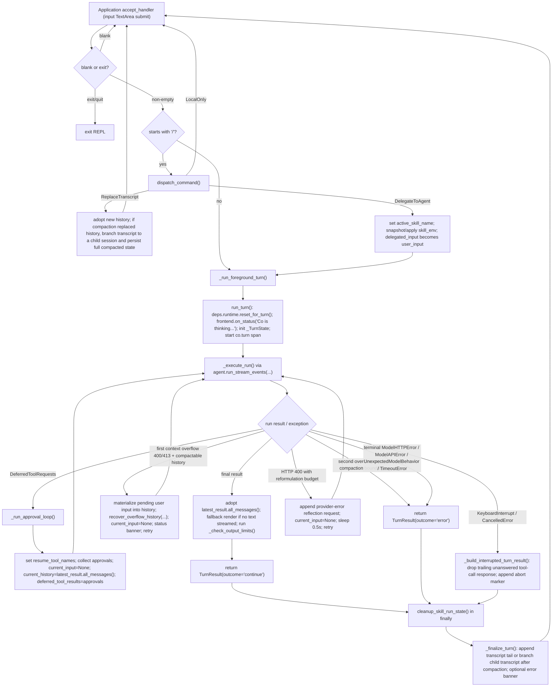

# Co CLI Core Loop Design


For top-level architecture and startup sequencing, see [01-system.md](01-system.md) and [bootstrap.md](bootstrap.md). This doc owns foreground-turn execution, approval resumes, retries, interrupts, and the orchestration points where history processors and compaction recovery are invoked. Instruction-layer construction and per-request assembly live in [prompt-assembly.md](prompt-assembly.md); session persistence and recall live in [sessions.md](sessions.md); memory items and recall live in [memory.md](memory.md); compaction mechanics in [compaction.md](compaction.md).

## 1. Foreground Turn Flow

This doc describes one complete foreground turn, from prompt input to post-turn finalization.

**Vocabulary — `turn ⊇ run ⊇ model request`.** A **turn** (one user message) contains one or more **runs**; a **run** (one `agent.run_stream_events()` call → one `AgentRunResult`) contains one or more model **requests** (one request/response exchange with the LLM); a model request may carry one or more **tool calls**. A turn spans multiple runs only at two boundaries — tool approval (a run ends with `DeferredToolRequests` and resumes in a fresh run) and length-continuation retry; a run spans multiple model requests whenever the model emits tool calls and the SDK loops to feed results back. This three-level containment is pydantic-ai's own model (see [pydantic-ai-integration.md](pydantic-ai-integration.md)).

**Bounds at each layer.** Each level of the hierarchy has its own ceiling:

| Layer | Bound | Mechanism |
| --- | --- | --- |
| model request → tool calls | `MAX_TOOL_CALLS_PER_MODEL_REQUEST` (3) parallel tool calls per response; `TOOL_CAP_HARD_STOP_CONSECUTIVE` (3) consecutive over-cap requests end the turn, surfacing the model's final answer if the capped run produced one (`outcome="continue"`, with a cap-stop status), else `outcome="error"` | `_CallSeamToolset.call_tool` rejects the `(cap+1)`-th call; the consecutive-violation streak is finalized at the run boundary in `_execute_run` and read by `_check_turn_caps` |
| run + turn → model requests | `max_model_requests_per_turn` (40; `0` disables) caps total model requests **across all runs in the turn**, checked **before every request** | `_execute_run` passes `UsageLimits(request_limit=...)` (resolved by `resolve_request_limit` in `co_cli/config/llm.py`). co threads one turn-scoped `RunUsage` across every run (`usage=` carried forward, reassigned from each result), so the SDK's `check_before_request` (`usage.requests >= request_limit`) bounds the whole turn and fires **mid-run** — a single autonomous tool-loop cannot run past it. Surfaces as `UsageLimitExceeded`, caught in `run_turn` → error `TurnResult` |

There is no separate open run-level ceiling: the turn cap *is* the run limit, because the `RunUsage` it is checked against is turn-scoped (carried across approval-resume and length-continuation retries). Enforcement is **before-request** (the request that *would* exceed the cap is blocked), not boundary-inclusive — a turn that legitimately runs exactly `max_model_requests_per_turn` requests and stops completes successfully; only a run continuing past the cap is interrupted.

**Graceful wrap-up before the cumulative cap.** Because the request that *would* exceed the cap is hard-blocked mid-stream (no chance to answer), the `wrap_up_prompt` dynamic instruction (`co_cli/agent/_instructions.py`, registered via `agent.instructions()`) softens the landing: it reads `resolve_request_limit` and, on the one request where `ctx.usage.requests == limit - 1` (the last request the SDK will still permit), returns the `WRAP_UP_TEXT` instruction telling the model to produce its final answer now and call no more tools. If the model complies, the run completes normally on that request and the cap never fires — a turn that would have aborted to `error` returns `outcome="continue"` with an answer. The nudge fires at most once (after the request, `usage.requests == limit`, so the guard no longer holds). As a dynamic instruction it needs no strip step: the SDK recomputes `instruction_parts` fresh every request and ignores historical `ModelRequest.instructions` in the agent flow, so the nudge lands in the request's instructions (never as a `UserPromptPart`) and is never replayed to the next turn. When `max_model_requests_per_turn = 0` the cap is disabled and no nudge is injected.

**Why the turn cap is 40 — circuit breaker, not work limit.** `max_model_requests_per_turn` is the guard against an in-cap doom-loop: a model that re-issues 1–3 tool calls per request indefinitely never trips the consecutive-over-cap hard-stop (the streak resets on any ≤3-call request) and, being mid-run, was historically invisible to a boundary-only check — the SDK before-request enforcement is what stops it. The value is sized between two opposing bounds. Floor: observed legitimate usage maxes at ~7 model requests per single pass, but requests sum across approval-resume *and* length-continuation retries within one turn, so a recon-heavy multi-gate turn can realistically stack to ~20–25 — the cap must clear that to never bite real work. Ceiling: the prior value of 90 let such a loop burn ~90 multi-second local-model requests (minutes of a wedged-looking session) before firing. 40 sits ≈5–6× over typical real usage with >2× margin over the multi-resume worst case, yet ~2.5× tighter than 90. It is deliberately set *above* peer single-loop caps (e.g. opencode's 25) because co's approval-split turns span more cumulative requests than a single activity loop, so 25 would risk false trips. Within the defensible 35–40 band the high end is chosen: a too-low cap falsely kills legitimate user work (user-visible, erodes trust), whereas a too-high cap only lets a doom-loop run a handful of extra cheap requests (invisible) — an asymmetry that favors headroom.

Cross-subsystem overview — one full turn crosses every subsystem; detailed behavior at each step lives in the linked specs:


| Stage | Owned by |
| --- | --- |
| Slash-command dispatch, skill expansion | [tui.md](tui.md), [skills.md](skills.md) |
| `run_turn` / approval loop / retries | [core-loop.md](core-loop.md) |
| Instruction parts + history processors | [prompt-assembly.md](prompt-assembly.md) |
| Compaction trigger (processor #3) | [compaction.md](compaction.md) |
| On-demand recall (`memory_search` / `session_search` tools) | [memory.md](memory.md) · [sessions.md](sessions.md) |
| Transcript append / child-session branching | [sessions.md](sessions.md) |

Detailed foreground turn flow:



Execution owners:

| Owner | Responsibility |
| --- | --- |
| `_chat_loop()` | prompt input, blank/exit handling, slash dispatch, transcript replacement, and skill-env setup |
| `_run_foreground_turn()` | `run_turn()`, guaranteed skill-env cleanup, and post-turn finalization |
| `run_turn()` | one orchestrated LLM turn, including status updates, retries, approval resumes, output checks, and interrupt handling |
| `_execute_run()` | one `agent.run_stream_events(...)` run plus frontend event delivery and usage merge |
| `_run_approval_loop()` | same-turn approval-resume cycle until output is no longer `DeferredToolRequests` |
| `_finalize_turn()` | transcript persistence/branching and generic error banner |

Two boundary rules keep the loop legible:

- REPL-owned transcript state lives in `message_history` inside `main.py`
- orchestration never mutates REPL history in place; it returns a `TurnResult` with the next transcript snapshot
- transcript durability is tracked separately via `persisted_message_count` and `compaction_applied_this_turn`

## 2. Core Logic

### 2.1 Turn Contract And State Ownership

`run_turn()` is the only public one-turn orchestration entrypoint. It returns:

| Field | Meaning |
| --- | --- |
| `outcome` | `"continue"` or `"error"` |
| `interrupted` | whether the turn ended due to interrupt/cancellation |
| `messages` | next transcript snapshot for the REPL |
| `output` | final model output object |
| `usage` | latest run usage payload |
| `model_requests` | count of `ModelResponse`s across all runs this turn |

Turn-scoped mutable state is explicit in `_TurnState`:

| `_TurnState` field | Owner |
| --- | --- |
| `current_input` | current prompt text, or `None` for resume/retry hops |
| `current_history` | message list for the next run call |
| `tool_reformat_budget` | HTTP 400 reformulation budget (app logic, not transport retry) |
| `latest_result` | most recent `AgentRunResult` from a completed run |
| `latest_streamed_text` | last-run streaming signal |
| `latest_usage` | last-run usage payload |
| `tool_approval_decisions` | `DeferredToolResults` consumed by the next resume hop |
| `outcome` / `interrupted` | final turn outcome flags |
| `model_requests` | `ModelResponse` count accumulator across all runs this turn (reporting only; the request cap is SDK-enforced — see §1) |
| `tool_cap_hard_stop` | set by `_run_approval_loop` when consecutive violations reach threshold; drives the hard-stop exit in `run_turn` (`_check_turn_caps` surfaces the run's final answer when present, else returns an error) |

Cross-cutting turn state that lives on `deps.runtime` instead:

| `deps.runtime` field | Why it is not in `_TurnState` |
| --- | --- |
| `current_request_tokens_estimate` | realtime-local request size written by `spill_largest_tool_results` each request; read for the status-line context % and compaction-trigger telemetry |
| `safety_state` | updated by the `safety_prompt` dynamic instruction before each model-bound run |
| `tool_progress_callback` | owned by `StreamRenderer` and active tool surfaces |
| `resume_tool_names` | set by `_run_approval_loop()` before each approval-resume run; cleared after the loop exits; read by `_approval_resume_filter` |
| `compaction_skip_count` | cross-turn circuit breaker for inline compaction (>= 3 trips breaker; every 10 skips a probe is attempted) |
| `active_skill_name` | cross-function skill dispatch marker cleared after the turn |
| `consecutive_tool_cap_violations` | incremented by `_CallSeamToolset.call_tool` immediately at the `(cap+1)`-th call of a model request that exceeds `MAX_TOOL_CALLS_PER_MODEL_REQUEST`; reset on the next request when the prior one behaved, finalized at the run boundary in `_execute_run`, and zeroed by `reset_for_turn()` |

### 2.2 Run Contract

`_execute_run()` owns exactly one `agent.run_stream_events(...)` call.

Inputs:

- `turn_state.current_input`
- `turn_state.current_history`
- `turn_state.tool_approval_decisions`
- `turn_state.latest_usage`
- selected agent surface: main agent for all passes (SDK skips `ModelRequestNode` on resume, so zero additional tokens)

Per-event handling:

| Event type | Behavior |
| --- | --- |
| `PartStartEvent` with `TextPart` / `ThinkingPart` | append buffered content into `StreamRenderer` |
| `PartDeltaEvent` with `TextPartDelta` / `ThinkingPartDelta` | append streamed deltas |
| `FinalResultEvent` / `PartEndEvent` | ignored for rendering; completion is defined by `AgentRunResultEvent` |
| `FunctionToolCallEvent` | flush buffered text/thinking, optionally show tool-start annotation, install progress callback |
| `FunctionToolResultEvent` | flush buffers, clear progress callback, render tool result panel when a `ToolReturnPart` exists |
| `AgentRunResultEvent` | store the final `AgentRunResult` object |

The event loop is wrapped in `asyncio.timeout(LLM_RUN_TIMEOUT_SECS)` used as a model-generation **stall timeout**, not an absolute run deadline. The timeout is re-armed on each stream event and **disarmed while any tool is executing** (no events flow between a `FunctionToolCallEvent` and its `FunctionToolResultEvent`, tracked by outstanding-tool count). It therefore fires only when the model produces no progress for `LLM_RUN_TIMEOUT_SECS` with no tool in flight; tool execution is bounded by each tool's own timeout, not this loop. A `TimeoutError` from the guard propagates to `run_turn()`, which returns `TurnResult(outcome='error')` — no retry is attempted.

Normal-exit contract:

1. `renderer.finish()` flushes remaining thinking/text buffers.
2. `frontend.cleanup()` always runs in `finally`.
3. `turn_state.latest_result` must be non-`None`, otherwise `_execute_run()` raises `RuntimeError`.
4. `turn_state.latest_usage = result.usage()`
5. `turn_state.tool_approval_decisions = None`

Reasoning display is purely a frontend concern:

| Mode | Behavior |
| --- | --- |
| `off` | thinking is discarded |
| `collapsed` | a transient `Thinking… Ns` live line that commits a single durable `Thought for Ns` summary; raw body never shown |
| `full` | default; the `Thinking… Ns` header plus the raw thinking body are streamed and committed through the thinking surface |

### 2.3 Approval Flow

Approval deferral uses the native Pydantic-AI objects directly:

- `DeferredToolRequests` pauses a run on approval-gated tool calls
- `_collect_deferred_tool_approvals()` turns those pending calls into `DeferredToolResults`
- `_run_approval_loop()` feeds that decision payload into the next run

Approval collection sequence (per pending call):

0. read `output.metadata[tool_call_id]`; if `"questions" in metadata`, take the clarify path:
   - for each question dict in `metadata["questions"]`, construct `QuestionPrompt(question, options, multiple)` and `await frontend.prompt_question(prompt)`; collect answers into a list
   - encode `ToolApproved(override_args={"user_answers": answers})` — tool resumes with the injected answer list
   - skip steps 1–7
1. decode tool arguments with `decode_tool_args()`
2. resolve one `ApprovalSubject`
3. check `deps.session.session_approval_rules` for an exact `kind + value` match
4. otherwise `await frontend.prompt_approval(subject)` for `y`, `n`, or `a`
5. encode the decision into `DeferredToolResults`
6. optionally remember the scope when the user chose `a`

The interactive frontend prompts (`prompt_approval`, `prompt_question`, `prompt_confirm`) are
coroutines: the `TerminalFrontend` runs each blocking read via `run_in_terminal(...)`, which
suspends the owned `Application` and restores cooked-mode terminal ownership for the read.
7. if denied, emit `logger.debug("tool_denied", tool_name, subject_kind, subject_value)`

Approval subject scopes:

| Tool shape | Subject kind | Remembered value |
| --- | --- | --- |
| `run_shell_command` | `shell` | first token of `cmd` |
| `file_write`, `file_patch` | `path` | parent directory |
| `web_fetch` | `domain` | parsed hostname |
| everything else, including MCP tools | `tool` | tool name |

Resume-loop behavior:

```text
# run_turn() — before first run
# No explicit filter setup needed — _tool_visibility_filter hides DEFERRED
# tools (until loaded via tool_view) and narrows on resume; no SDK loader.

# _run_approval_loop() — each resume hop
while latest_result.output is DeferredToolRequests:
  deps.runtime.resume_tool_names = frozenset(
      call.tool_name for call in approvals
  )
  approvals = _collect_deferred_tool_approvals(...)
  current_input = None
  current_history = latest_result.all_messages()
  tool_approval_decisions = approvals
  execute next run with main agent
clear deps.runtime.resume_tool_names
```

Important precision:

- `_approval_resume_filter` passes all during normal turns; narrows to `resume_tool_names` + `ALWAYS` tools during resume
- applies uniformly to native and MCP tools (all combined under one filter)
- approval resumes happen inside the same user turn; they are not a new REPL iteration

Shell approval remains split correctly:

- `run_shell_command()` decides `DENY`, `ALLOW`, or `REQUIRE_APPROVAL` from command shape
- only the `REQUIRE_APPROVAL` path reaches deferred approval handling
- denied shell commands never enter `_collect_deferred_tool_approvals()`

### 2.4 History Processors, Preflight, And Inline Compaction

The main agent is built with five registered history processors in this exact order (see `co_cli/agent/orchestrator.py` `history_processors=(...)`), all pure transformers:

1. `elide_old_multimodal_prompts`
2. `dedup_tool_results`
3. `evict_old_tool_results`
4. `spill_largest_tool_results`
5. `proactive_window_processor`

Five functions are registered via `agent.instructions()` and run before every model request as dynamic instructions:

- `safety_prompt` — doom-loop detection + shell reflection cap; active warnings returned as plain text
- `wrap_up_prompt` — returns the `WRAP_UP_TEXT` nudge on the last request before the model-request cap (see §1); empty on all other requests
- `current_time_prompt` — current date/time string at the tail position; ephemeral grounding
- `deferred_tool_awareness_prompt` — names the deferred-tool surface so the model knows what it can fetch
- `skill_manifest_prompt` — injects the `<available_skills>` manifest

Processor roles:

| Processor | Role |
| --- | --- |
| `elide_old_multimodal_prompts` | strips inline pixels (`BinaryContent`) from non-tail `UserPromptPart`s so base64 does not accumulate; preserves the most recent turn's images; protects the last turn via the same `_find_last_turn_start` boundary |
| `dedup_tool_results` | collapses identical `(tool_name, content-hash)` `ToolReturnPart`s in the pre-tail region into back-references pointing at the latest `tool_call_id` |
| `evict_old_tool_results` | content-clears tool returns older than the 5-most-recent per tool name; replaces with a semantic marker; protects the last turn (from last `UserPromptPart` onward) |
| `spill_largest_tool_results` | force-spills the largest unspilled `ToolReturnPart`s across the full message list when total tokens exceed `deps.spill_threshold_tokens`; the cheap (non-LLM) path that fires before `proactive_window_processor` |
| `proactive_window_processor` | replaces the middle of long histories with an inline LLM summary (with context enrichment) or static marker (circuit-breaker fallback) |

Preflight is called before every model-bound run but not on approval-resume runs (SDK skips `ModelRequestNode` on resume, so preflight would inject into a non-model path). Preflight injections are ephemeral — they are not stored back to `turn_state.current_history`, so retry iterations always start from the clean history without accumulated injections.

Ordering rationale:

- **#1–2 before #3–4**: dedup and eviction run before size enforcement and summarization. The summarizer sees a smaller, deduped history; size enforcement fires after cheap reductions but before the LLM call.
- **Dynamic instructions before model request**: `safety_prompt` and `current_time_prompt` run via the SDK's `agent.instructions()` mechanism before every model-bound request. Their output is ephemeral context — not stored back to `turn_state.current_history`.

Compaction behavior:

- `proactive_window_processor()` gathers side-channel context via `gather_compaction_context()` (active session todos only — ≤10 items, capped at 1,500 chars; file paths and prior summaries are recoverable LLM-side and intentionally omitted; see [self-planning.md](self-planning.md)), then calls `summarize_messages()` inline with a structured template when compaction triggers
- it compacts when token count exceeds `cfg.compaction_ratio` (0.50) of the budget
- token count is `effective_request_tokens` — the floor-inclusive realtime-local estimate (`deps.static_floor_tokens + estimate_message_tokens()`, where the message estimate counts `ToolCallPart.args` and `(dict, list)` content); no provider-reported floor (peer-aligned with hermes/openclaw). Adding the bootstrap-measured static-instruction + ALWAYS-schema floor keeps the trigger from undercounting live size by one floor (see [compaction.md](compaction.md) §1.5)
- the budget is resolved by `resolve_compaction_budget()` in `context/summarization.py`: returns `deps.model_max_context_tokens` directly (Ollama probe result capped by `llm.max_context_tokens`, set at bootstrap)
- when `deps.model` is absent (sub-agents, tests), it uses a static marker directly without incrementing the failure counter
- a circuit breaker (`deps.runtime.compaction_skip_count`) trips at `BREAKER_TRIP` (3) consecutive failures; tripped state uses static markers but probes the LLM once every `BREAKER_PROBE_EVERY` (10) skips — probe success resets the counter to 0
- a `[dim]Compacting conversation...[/dim]` indicator is shown before the LLM call
- successful history replacement sets `deps.runtime.compaction_applied_this_turn`, which later tells `_finalize_turn()` to persist into a child transcript instead of appending into the parent transcript

Knowledge recall is on-demand, not injected per-turn:

- the session-start date is frozen into the static instructions in `build_orchestrator()` — stable for the entire session
- personality memories live in the static system prompt (injected once at agent construction)
- the agent calls `memory_search()` or `session_search()` proactively when past context is relevant

### 2.5 Retries, Output Limits, Errors, And Interrupts

`run_turn()` owns app-level error handling. Transport-level retries (HTTP 429, 5xx, network errors) are delegated to the OpenAI SDK's built-in retry machinery and are not managed by `run_turn()`.

Error matrix:

| Condition | Behavior |
| --- | --- |
| HTTP 413 unconditionally, or HTTP 400 with explicit overflow evidence (`is_context_overflow` in `_http_error_classifier`) | one-shot `recover_overflow_history()` — first materializes the pending user input into history, then strips every `ToolReturnPart` to a semantic marker via `strip_all_tool_returns`; if the stripped history fits the budget, returns immediately (`commit_compaction` only, no LLM call, PATH 1); else runs `plan_compaction_boundaries()` (same `TAIL_FRACTION`, `min_groups_tail=1`) + `compact_messages(...)` + `commit_compaction(...)` on the stripped history (PATH 2). Retry on success; terminal when the planner cannot find a boundary or on second overflow. Never falls through to 400 reformulation. |
| HTTP 400 with reformat budget left (not context overflow) | append a reflection request describing the rejected tool call, set `current_input=None`, retry (app-level reformulation, not transport retry) |
| HTTP 400 with budget exhausted, or other terminal HTTP errors | set `outcome='error'`; record `provider_error` span event (`http.status_code`, `error.body` capped at 500 chars) on the `co.turn` span; return `_build_error_turn_result()` |
| `ModelAPIError` (network errors exhausted by SDK) | set `outcome='error'` and return `_build_error_turn_result()` |
| `TimeoutError` (run hang guard) | no retry; set `outcome='error'` and return `_build_error_turn_result()` |
| `UnexpectedModelBehavior` | no retry; surface as a user-facing status message, set `outcome='error'` and return `_build_error_turn_result()` |
| `UsageLimitExceeded` (model-request cap hit mid-run; see §1) | emit a cap-reached status, set `outcome='error'`, record a `model_request_cap` span event, return `_build_error_turn_result()` — the run aborted mid-stream, so there is no final answer to surface. Reaching this is the case where the model *ignored* the final-request wrap-up nudge (§1); had it answered on the last allowed request, the run would have completed via the success path instead |
| tool-call hard-stop (`tool_cap_hard_stop` latched; see §1) | **not unconditionally an error** — the run already completed, so `_check_turn_caps` surfaces the model's final answer as `outcome='continue'` (with a cap-stop status) when one exists; only when there is no usable answer (output is `DeferredToolRequests`, empty, or absent) does it set `outcome='error'` and return `_build_error_turn_result()` |
| `KeyboardInterrupt` / `CancelledError` | return `_build_interrupted_turn_result()` |

Output-limit diagnostics happen only after a successful final run:

1. if `latest_result.response.finish_reason == "length"`, show a truncation status message
2. if `deps.model_max_context_tokens` is set, compare `latest_result.response.usage.input_tokens / deps.model_max_context_tokens` — the provider's real input count for the final request, re-sourced on demand from the last `ModelResponse` (not carried as a runtime status var)
3. emit an overflow message when `ratio >= 1.0`, or a context-pressure warning when `ratio >= compaction.compaction_ratio` and proactive compaction has stalled (`consecutive_low_yield_proactive_compactions >= compaction.proactive_thrash_window`)

Interrupt handling is conservative:

- `KeyboardInterrupt` or `asyncio.CancelledError` returns `_build_interrupted_turn_result()`
- if the transcript ends with a `ModelResponse` containing unanswered `ToolCallPart`s, that response is dropped
- an abort marker `ModelRequest` is appended so the next turn knows the previous turn was interrupted and must verify state

### 2.6 Post-Turn Finalization In `main.py`

`_run_foreground_turn()` sequences the full wrapper around `run_turn()`:

1. `run_turn(...)`
2. `cleanup_skill_run_state(saved_env, deps)` in `finally`
3. `_finalize_turn(...)`

`_finalize_turn()` then performs the remaining non-orchestration work:

1. `append_messages()` — positional tail slice of new messages written to `deps.session.session_path`
2. flush the turn's token usage — `_flush_turn_usage(deps)` appends one `origin="session"` line to the durable usage ledger (`deps.usage_log_path`), keyed by the 8-char session id, then resets `deps.usage_accumulator` for the next turn
3. print a generic error banner when `turn_result.outcome == "error"`

The same flush runs on the slash-command transcript-replacement path: the `/compact` branch of `_apply_command_outcome()` flushes its summarizer tokens (so they are not mis-attributed to the next real turn), while `/resume` and other no-LLM swaps just reset the accumulator. The accumulator is also reset at turn start in `run_turn()` (alongside `reset_for_turn()`). Usage capture is **write-only observational accounting** fed by provider-reported `RunUsage` — it never feeds compaction triggers or the status-line context-% (those stay on `current_request_tokens_estimate`). See [sessions.md](sessions.md) for the ledger schema and `/usage` reporting.

Skill dispatch is intentionally scoped to one delegated turn:

- `_chat_loop()` applies `skill_env` only for the delegated skill run
- `_cleanup_skill_run_state()` restores prior environment values and clears `deps.runtime.active_skill_name`
- finalization happens only after that restoration

### 2.7 Comparison Against Common Peer Patterns

The foreground loop still matches the common 2026 CLI-agent shape more than it diverges from it.

| Common pattern | `co` today | Design read |
| --- | --- | --- |
| one owned foreground turn executor | `run_turn()` | aligned |
| event-stream-driven rendering | `_execute_run()` + `StreamRenderer` | aligned |
| approvals outside most tool bodies | `_collect_deferred_tool_approvals()` / `_run_approval_loop()` | aligned |
| command-specific shell trust boundary | shell tool classifies allow/deny/ask itself | aligned and strong |
| error handling and interrupts owned by the loop | `run_turn()` | aligned |
| compaction as an inline concern with circuit breaker | `proactive_window_processor()` with `compaction_skip_count` | aligned |
| isolated specialist contexts | delegation agents use `fork_deps()` and stay outside the foreground loop | aligned |

The intentional simplification remains:

- no planner graph in the foreground turn
- no multi-turn queue inside the loop
- no approval memory persisted across sessions

## 3. Config

These settings most directly shape one-turn orchestration behavior. Instruction and recall settings live in [prompt-assembly.md](prompt-assembly.md); memory and session recall settings live in [memory.md](memory.md) and [sessions.md](sessions.md).

| Setting | Env Var | Default | Description |
| --- | --- | --- | --- |
| `tool_retries` | `CO_TOOL_RETRIES` | `3` | Per-tool retry count baked into agent/tool registration |
| `doom_loop_threshold` | `CO_DOOM_LOOP_THRESHOLD` | `3` | Identical tool-call streak threshold for doom-loop intervention |
| `max_reflections` | `CO_MAX_REFLECTIONS` | `3` | Consecutive shell-error streak threshold for reflection guardrail |
| `llm.max_model_requests_per_turn` | `CO_LLM_MAX_MODEL_REQUESTS_PER_TURN` | `40` | Max `ModelResponse`s per turn; `0` disables the cap |
| `reasoning_display` | `CO_REASONING_DISPLAY` | `full` | Thinking display mode for streamed turns (`off`/`collapsed`/`full`) |

## 4. Public Interface

### Turn execution

| Symbol | Source | Contract |
| --- | --- | --- |
| `run_turn(deps, agent, user_input, message_history, frontend) -> TurnResult` | `co_cli/agent/orchestrate.py` | Async — single foreground-turn entrypoint; owns runs, approval resumes, retries, and interrupt handling |
| `TurnResult` | `co_cli/agent/orchestrate.py` | Dataclass — `outcome` (`"continue"` / `"error"`), `interrupted`, `messages`, `output`, `usage`, `model_requests` |
| `_TurnState` | `co_cli/agent/orchestrate.py` | Module-private mutable turn state; not exported |

### Compaction and recovery

| Symbol | Source | Contract |
| --- | --- | --- |
| `proactive_window_processor(ctx, messages)` | `co_cli/context/compaction.py` | History processor — L3 LLM compaction with anti-thrash gate |
| `recover_overflow_history(ctx, messages, budget, tail_fraction)` | `co_cli/context/compaction.py` | Async — strip-then-summarize overflow recovery on HTTP 400/413 |
| `dedup_tool_results`, `evict_old_tool_results`, `spill_largest_tool_results` | `co_cli/context/history_processors.py` | Registered history processors run in order before every model request |
| `strip_all_tool_returns(messages)` | `co_cli/context/history_processors.py` | Replaces every `ToolReturnPart` content with a per-tool semantic marker; idempotent |
| `safety_prompt(ctx)`, `wrap_up_prompt(ctx)`, `current_time_prompt(ctx)` | `co_cli/agent/_instructions.py` | Dynamic `@agent.instructions` callbacks evaluated per request; `wrap_up_prompt` returns the final-request cap nudge (see §1) |

### Approval flow

| Symbol | Source | Contract |
| --- | --- | --- |
| `_collect_deferred_tool_approvals(ctx, output, frontend)` | `co_cli/agent/orchestrate.py` | Async — turns `DeferredToolRequests` into `DeferredToolResults` via prompt or rule lookup |

## 5. Files

| File | Purpose |
| --- | --- |
| `co_cli/main.py` | REPL loop, slash routing, skill-env lifecycle, foreground-turn wrapper, and teardown |
| `co_cli/agent/orchestrate.py` | `TurnResult`, `_TurnState`, stream execution, approval loop, error handling, output checks, and interrupt/error builders |
| `co_cli/context/compaction.py` | public entry points (`proactive_window_processor` for L3; overflow-recovery entry point `recover_overflow_history` — single-tier strip-then-summarize); backed by private submodules `_compaction_boundaries.py` (planner) and `_compaction_markers.py` (marker builders and enrichment) |
| `co_cli/context/history_processors.py` | registered history processors (`dedup_tool_results`, `evict_old_tool_results`, `spill_largest_tool_results`) plus the `strip_all_tool_returns` recovery helper |
| `co_cli/context/prompt_text.py` | `safety_prompt_text` — called via `agent.instructions()` wrapper in `_instructions.py` |
| `co_cli/context/summarization.py` | `summarize_messages`, `resolve_compaction_budget`, and token-estimation helpers — shared by history processor and `/compact` |
| `co_cli/agent/core.py` | main agent factory |
| `co_cli/agent/toolset.py` | native filtered toolset construction with per-tool loading policy |
| `co_cli/tools/approvals.py` | approval-subject resolution, remembered rule matching, decision recording, and `QuestionRequired` exception |
| `co_cli/tools/shell/execute.py` | command-shape shell allow/deny/approval logic |
| `co_cli/display/stream_renderer.py` | text/thinking buffering, per-mode reasoning rendering, and `Thinking… Ns` / `Thought for Ns` elapsed timing |
| `co_cli/display/core.py` | terminal frontend surfaces, tool panels, status rendering, approval prompts, and question prompting (`QuestionPrompt`, `prompt_question`) |
| `co_cli/session/filename.py` | session filename generation and latest-session discovery |
| `co_cli/skills/lifecycle.py` | skill-run environment save/restore and active-skill-name cleanup |
