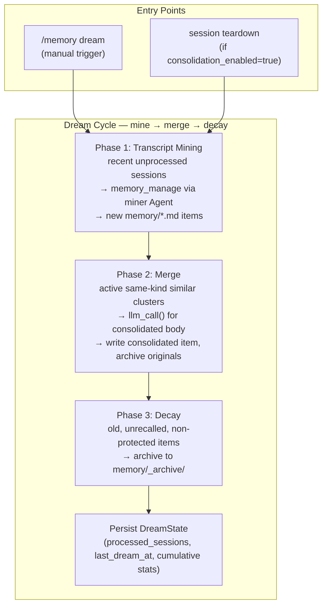

# Co CLI — Dream


This spec owns the dream-cycle lifecycle. The broader persistent cognition model lives in [memory.md](memory.md). Startup and shutdown sequencing live in [bootstrap.md](bootstrap.md) and [01-system.md](01-system.md). Prompt injection and recall scoring live in [prompt-assembly.md](prompt-assembly.md). Model routing for dream miner and merge calls lives in [config.md](config.md).

## 1. What & How

Dreaming is Co's bounded, local batch-maintenance pass for the memory layer. It is named "dream" because it happens outside the immediate foreground turn and looks across prior experience for durable patterns, but it is not hidden autonomous memory. It reads local transcripts and active memory items, writes local memory items, archives originals into a local subdirectory, and records local JSON state.

Dreaming serves the core product mission:

- **Trusted:** automatic mutations are gated by config or an explicit slash command, bounded by caps and timeouts, and recoverable through the archive.
- **Local:** transcripts, artifacts, archive files, state, and indexes live under the user-controlled Co home.
- **Personal:** retrospective mining looks for stable user preferences, feedback, rules, decisions, and references that were not obvious in a single turn.
- **Operator:** the system performs maintenance work on the user's behalf while preserving operator control through dry runs, stats, and restore commands.
- **Knowledge work:** the active corpus is kept coherent enough for future synthesis, planning, writing, and technical execution.



The cycle has three ordered phases. Each phase is independently try/except'd; one failure does not block the others. The whole cycle runs under an `asyncio.timeout()` bound.

Source-of-truth files:

| Path | Role |
| --- | --- |
| `memory/*.md` | Active memory items used by recall and search |
| `memory/_archive/*.md` | Recoverable archived items, excluded from normal active loads |
| `memory/_dream_state.json` | Processed transcript names, last run timestamp, cumulative counters |
| `sessions/*.jsonl` | Raw append-only transcripts read by mining; never rewritten by dreaming |
| `co-cli-search.db` | Derived index updated when dream writes or archives artifacts |

## 2. Core Logic

### 2.1 Entry Points

Manual trigger:

```text
/memory dream
  -> run_dream_cycle(dry_run=false)
  -> print extracted, merged, decayed, and errors

/memory dream --dry
  -> run_dream_cycle(dry_run=true)
  -> report merge and decay counts only
  -> do not write files, archive artifacts, mine transcripts, or persist state
```

Automatic trigger:

```text
session teardown
  -> if memory.consolidation_enabled is true
  -> if memory.consolidation_trigger is "session_end"
  -> run dream cycle (timeout managed internally by run_dream_cycle)
  -> log result
  -> never fail shutdown because dreaming failed
```

Automatic dreaming is deliberately behind `memory.consolidation_enabled=false` by default. This matches the mission boundary: Co may become more useful through long-term adaptation, but that adaptation must remain explicit, local, and inspectable.

### 2.2 State

`DreamState` persists at `memory/_dream_state.json`.

| Field | Meaning |
| --- | --- |
| `last_dream_at` | ISO timestamp for the last completed non-dry run |
| `processed_sessions` | Transcript filenames already mined successfully or intentionally skipped as empty |
| `stats.total_cycles` | Count of completed non-dry cycles |
| `stats.total_extracted` | Cumulative artifacts created by mining |
| `stats.total_merged` | Cumulative merge clusters completed |
| `stats.total_decayed` | Cumulative artifacts archived by decay |

Load behavior is forgiving: missing or corrupt state returns a fresh state object and logs corrupt state as a warning. Save behavior creates the memory directory if needed and writes indented JSON.

State is only the dream cursor and dashboard record. It is not the source of truth for memory content; markdown items and archive files are.

### 2.3 Phase 1: Transcript Mining

Mining turns raw episodic memory into reusable knowledge by looking across prior experience for durable cross-turn signals.

Execution order:

```text
load dream state
list recent sessions by reverse filename order
limit to memory.consolidation_lookback_sessions
for each unprocessed session:
  load transcript
  if load fails:
    leave unprocessed for later retry
  if empty or no extractable window:
    mark processed
  build transcript window with wider text/tool caps
  split oversized window into overlapping chunks
  build dream miner agent (once per session)
  run agent.run(chunk, deps=deps) over each chunk
  stop after per-session save cap is reached
  count new active artifacts
  mark session processed
```

Mining uses the shared transcript-window builder (`_window.py`). It keeps user and assistant text plus selected tool calls/results, skips file-read style output, and drops large non-prose tool returns. Dream mining uses wider caps than agent-explicit knowledge saves because its purpose is cross-turn pattern discovery.

The dream miner is a **tool-using pydantic-ai Agent** equipped with the `memory_manage` tool. It is instructed to save only durable artifacts, especially:

- cross-turn patterns
- implicit preferences
- corrections whose meaning only becomes clear later
- stable decisions

It must avoid:

- ephemeral task state
- secrets and sensitive personal data
- codebase facts derivable by reading the repo
- unsupported speculation
- facts already obvious from a single recent slice

Mining marks a session processed only after the miner completes for that session. If the agent fails, the session remains unprocessed so a future cycle can retry.

### 2.4 Phase 2: Merge

Merge reduces duplication in active knowledge without editing transcripts or overwriting source artifacts.

Execution order:

```text
load active memory items from top-level memory/*.md
discard decay_protected artifacts
group remaining artifacts by memory_kind
within each kind, cluster by token-Jaccard threshold
cap clusters per cycle
cap artifacts per cluster
for each cluster:
  call llm_call(deps, prompt) with merge instructions for one consolidated body
  if body is too short or empty:
    skip cluster (no write, no archive)
  write a new consolidated artifact
  index the new artifact
  archive the original artifacts
```

Merge invariants:

- Only artifacts of the same `memory_kind` can merge.
- `decay_protected=true` blocks merge participation.
- Original artifacts are archived only after the consolidated artifact is durably written.
- If archiving fails after the consolidated artifact is written, the consolidated artifact remains; the failure is logged and the cycle continues.
- The merge prompt may combine and deduplicate existing facts, but must not invent new facts.

The merge call is a **direct `llm_call`** (no tool access, body text only) — in contrast with the mining phase which uses a tool-equipped Agent that calls `memory_manage` to write artifacts.

The consolidated artifact uses `source_type: consolidated` and inherits the union of tags from the originals. The active index is updated for the consolidated artifact, and archived originals are removed from the index.

### 2.5 Phase 3: Decay

Decay removes stale, low-use knowledge from active recall while preserving it for restore.

Candidate selection:

```text
for each active artifact:
  if decay_protected:
    skip
  if created is missing, invalid, or newer than decay cutoff:
    skip
  if last_recalled exists and is newer than decay cutoff:
    skip
  include candidate
sort oldest created first
```

The cutoff is `now - memory.decay_after_days`. A candidate is archived only if it is old enough and either has never been recalled or was last recalled outside the same age window.

Decay archives at most 20 items per cycle. Archive moves files into `memory/_archive/`, removes active index rows when a `MemoryStore` is available, and resolves filename collisions by suffixing rather than clobbering existing files.

### 2.6 Dry Run

Dry run is a preview mode for the destructive parts of dreaming.

Behavior:

- Mining is skipped because predicting extracted artifacts requires LLM writes.
- Merge reports the number of currently mergeable clusters (capped to per-cycle limit).
- Decay reports the number of currently decay-eligible artifacts, capped to the per-cycle archive limit.
- No files are written.
- No artifacts are archived.
- Dream state is not persisted.

Dry run is therefore a maintenance preview, not a full simulation of transcript mining.

### 2.7 Failure And Timeout Semantics

The cycle returns a `DreamResult` with extracted, merged, decayed, errors, and timeout status.

Each non-dry phase is isolated:

```text
try mining
  record "mine: ..." error on failure
try merge
  record "merge: ..." error on failure
try decay
  record "decay: ..." error on failure
persist completed-cycle state
```

The whole cycle runs under an `asyncio.timeout()` bound. On timeout, the result is marked `timed_out=true`, a timeout error string is appended, and partial result counts are returned. Timeout does not roll back any file writes that completed before cancellation.

Session shutdown catches all dream errors. Dreaming must never prevent terminal cleanup, shell cleanup, or async resource closure.

### 2.8 User Inspection And Recovery

Dreaming is inspectable through slash commands:

| Command | Purpose |
| --- | --- |
| `/memory dream --dry` | Preview merge and decay counts |
| `/memory dream` | Run the cycle now |
| `/memory stats` | Show active counts, archive count, last dream timestamp, cumulative dream stats, and decay candidates |
| `/memory restore [slug]` | List archived artifacts or restore one archived file by unambiguous filename prefix |
| `/memory decay-review --dry` | Preview decay candidates directly |
| `/memory decay-review` | Archive decay candidates after confirmation |

Archive restore moves an archived markdown file back to the active knowledge directory and reindexes the active directory when a store is available. Ambiguous restore slugs fail rather than guessing.

### 2.9 Observability

Dreaming emits structured span records via the `@trace` decorator (see [observability.md](observability.md)):

| Span | Source | Purpose |
| --- | --- | --- |
| `co.dream.cycle` | `@trace` on `run_dream_cycle` | Whole-cycle envelope with dry-run, timeout, count, error, and timeout attributes |
| `co.dream.mine` | `@trace` on `_mine_transcripts` | Mining phase count |
| `invoke_agent _dream_miner_agent` | `ObservabilityCapability` | Each `miner_agent.run()` iteration; `co.agent.role=dream_miner` carried via `agent.run(metadata={"role": "dream_miner"})` |
| `co.dream.merge.preview` / `co.dream.merge.apply` | `@trace` on preview vs apply helpers | Merge phase count (dry-run vs apply paths emit distinct spans) |
| `co.dream.decay.preview` / `co.dream.decay.apply` | `@trace` on preview vs apply helpers | Decay phase count (dry-run vs apply paths emit distinct spans) |

The session-end wrapper logs completion counts when changes occurred and logs timeout or failure warnings without surfacing them as foreground turn failures.

## 3. Config

| Setting | Env Var | Default | Description |
| --- | --- | --- | --- |
| `memory.consolidation_enabled` | `CO_MEMORY_CONSOLIDATION_ENABLED` | `false` | Enables dedup-on-write and dream-cycle maintenance |
| `memory.consolidation_trigger` | `CO_MEMORY_CONSOLIDATION_TRIGGER` | `session_end` | Automatic trigger mode: `session_end` or `manual` |
| `memory.consolidation_lookback_sessions` | `CO_MEMORY_CONSOLIDATION_LOOKBACK_SESSIONS` | `5` | Number of recent transcript files considered by mining |
| `memory.consolidation_similarity_threshold` | `CO_MEMORY_CONSOLIDATION_SIMILARITY_THRESHOLD` | `0.75` | Token-Jaccard threshold for dedup and merge clusters |
| `memory.max_item_count` | `CO_MEMORY_MAX_ITEM_COUNT` | `300` | Soft corpus-size setting; not directly enforced by the current dream cycle |
| `memory.decay_after_days` | `CO_MEMORY_DECAY_AFTER_DAYS` | `90` | Age and last-recall cutoff for decay candidacy |
| `memory.chunk_tokens` | `CO_MEMORY_CHUNK_TOKENS` | `600` | Chunk size used when indexing consolidated items |
| `memory.chunk_overlap_tokens` | `CO_MEMORY_CHUNK_OVERLAP_TOKENS` | `80` | Chunk overlap used when indexing consolidated items |

Internal caps:

| Constant | Current Value | Purpose |
| --- | --- | --- |
| dream window text cap | `50` | Maximum text lines included in a mining window |
| dream window tool cap | `50` | Maximum tool lines included in a mining window |
| soft mining window limit | `16000` chars | Threshold before transcript windows are chunked |
| mining chunk size | `12000` chars | Chunk length for oversized windows |
| mining chunk overlap | `2000` chars | Overlap between oversized-window chunks |
| max mining saves per session | `5` | Per-session cap on new artifacts from mining |
| max merge clusters per cycle | `10` | Per-cycle merge cap |
| max artifacts per merge cluster | `5` | Cluster size cap |
| minimum merged body length | `20` chars | Guard against empty or unusable merge outputs |
| max decay archives per cycle | `20` | Per-cycle decay archive cap |
| default cycle timeout | `60` seconds | Timeout used by `run_dream_cycle()` |

## 4. Public Interface

### Cycle entry

| Symbol | Source | Contract |
| --- | --- | --- |
| `run_dream_cycle(deps, miner_tool, dry_run=False, *, timeout_secs=60) -> DreamResult` | `co_cli/memory/dream.py` | Async — orchestrates mining → merge → decay phases under `asyncio.timeout(timeout_secs)`; isolates phase failures |
| `DreamResult` | `co_cli/memory/dream.py` | Frozen dataclass — `extracted`, `merged`, `decayed`, `errors: list[str]`, `timed_out: bool` |

### State persistence

| Symbol | Source | Contract |
| --- | --- | --- |
| `DreamState` | `co_cli/memory/dream.py` | Pydantic model — `last_dream_at`, `processed_sessions`, `stats` |
| `DreamStats` | `co_cli/memory/dream.py` | Pydantic model — `total_cycles`, `total_extracted`, `total_merged`, `total_decayed` |
| `load_dream_state(memory_dir) -> DreamState` | `co_cli/memory/dream.py` | Forgiving loader — returns fresh state on missing/corrupt JSON |
| `save_dream_state(memory_dir, state) -> None` | `co_cli/memory/dream.py` | Writes `_dream_state.json` with `mkdir -p` |
| `dream_state_path(memory_dir) -> Path` | `co_cli/memory/dream.py` | Returns `<memory_dir>/_dream_state.json` |

### Dream miner agent

| Symbol | Source | Contract |
| --- | --- | --- |
| `build_dream_miner_agent(miner_tool) -> Agent[CoDeps, str]` | `co_cli/memory/dream.py` | Constructs the tool-using sub-agent equipped with `memory_manage` used during mining |

### Archive and decay helpers (used by `/memory` commands)

| Symbol | Source | Contract |
| --- | --- | --- |
| `archive_artifacts(entries: list[MemoryItem], memory_dir, memory_store=None) -> int` | `co_cli/memory/archive.py` | Moves memory items into `memory/_archive/`; resolves filename collisions by suffix |
| `restore_artifact(slug, memory_dir, memory_store=None) -> bool` | `co_cli/memory/archive.py` | Restores an archived item by unambiguous filename prefix; reindexes if `memory_store` provided |

## 5. Files

| File | Purpose |
| --- | --- |
| `co_cli/memory/dream.py` | Dream state, mining, merge, decay, dry-run, timeout, and orchestration |
| `co_cli/memory/prompts/dream_miner.md` | Instructions for retrospective transcript mining |
| `co_cli/memory/prompts/dream_merge.md` | Instructions for same-kind artifact consolidation |
| `co_cli/memory/_window.py` | Shared transcript-window builder used by dream mining |
| `co_cli/memory/similarity.py` | Token-Jaccard similarity and clustering helpers |
| `co_cli/memory/decay.py` | Decay candidate selection |
| `co_cli/memory/archive.py` | Archive and restore mechanics |
| `co_cli/memory/item.py` | Memory item schema and active top-level memory item loading |
| `co_cli/memory/frontmatter.py` | Memory item markdown rendering and frontmatter validation |
| `co_cli/memory/store.py` | `MemoryStore` — derived index updates for consolidated and archived items |
| `co_cli/tools/memory/manage.py` | `memory_manage` tool used by dream mining |
| `co_cli/main.py` | Session-end dream trigger (`_maybe_run_dream_cycle`) |
| `co_cli/commands/memory.py` | `/memory dream`, `/memory restore`, `/memory decay-review`, and `/memory stats` |

## 6. Test Gates

| Property | Test file |
| --- | --- |
| Dream state load/save and forgiving corrupt-state recovery | `tests/memory/test_knowledge_dream.py` |
| Dream cycle orchestration: mine → merge → decay ordering, phase isolation | `tests/memory/test_knowledge_dream_cycle.py` |
| Dry-run counts, no-write guarantee, and state non-persistence | `tests/memory/test_knowledge_dream_cycle.py` |
| Cycle timeout: partial result, `timed_out=True`, errors list | `tests/memory/test_knowledge_dream_cycle.py` |
| Live full-cycle coverage (local, LLM) | `tests/memory/test_knowledge_dream_cycle.py` |
| Decay candidate selection: cutoff, `decay_protected`, `last_recalled` | `tests/memory/test_knowledge_decay.py` |
| Archive move and filename collision resolution | `tests/memory/test_knowledge_archive.py` |
| Restore: unambiguous slug succeeds; ambiguous or missing slug returns False | `tests/memory/test_knowledge_archive.py` |
| Token-Jaccard similarity and union-find clustering | `tests/memory/test_knowledge_similarity.py` |
