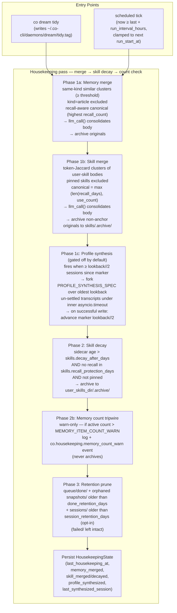

# Co CLI — Dream

This spec owns the dream subsystem — co's self-learning path. It covers two coupled layers:

1. **In-session reviewer (daemon layer)** — a per-`CO_HOME` daemon that processes KICK payloads queued by the REPL. It runs domain-specific review agents (memory + skill) against recent session transcripts.
2. **Clock-driven housekeeping** — merge → decay against the full memory corpus, fired on a 24h scheduled tick inside the same daemon loop, or on demand via `co dream tidy` (or `/dream tidy`). Lives in `co_cli/daemons/dream/_housekeeping.py`. Housekeeping operates on the durable memory item store + recall metrics, plus one transcript-reading sub-pass: the cross-session **profile synthesis** (`synthesize_user_profile`, gated off by default) re-derives `USER.md` across a window of recent session transcripts. So the per-session reviewer and profile synthesis are the two transcript readers; the merge/decay phases never read transcripts.

The broader persistent cognition model lives in [memory.md](memory.md). Startup and shutdown sequencing live in [bootstrap.md](bootstrap.md) and [01-system.md](01-system.md). Prompt injection and recall scoring live in [prompt-assembly.md](prompt-assembly.md). Model routing for daemon and batch review calls lives in [config.md](config.md).

---

## 1. In-Session Reviewer — Daemon Layer

### 1.1 Architecture Overview

```
   User ── turns ──> REPL (co chat)             dream daemon (co dream start)
                          ▲                                ▲
                          │ writes KICK files,             │ polls queue,
                          │ writes memory/skill            │ writes memory/skill,
                          ▼                                ▼ moves files → done/failed
                  ┌───────────────────────────────────────────────┐
                  │  $CO_HOME — sole cross-process bridge         │
                  │    daemons/dream/queue/<ts>-<uuid>.json       │
                  │    daemons/dream/queue/{done,failed}/         │
                  │    daemons/dream/snapshots/<id>-<ts>.jsonl    │
                  │    daemons/dream.pid, dream.lock              │
                  │    sessions/<id>.jsonl                        │
                  │    memory/*.md     skills/<name>/SKILL.usage.json │
                  │    logs/co-dream.jsonl + co-dream-spans.jsonl │
                  └───────────────────────────────────────────────┘

   Ollama (off-diagram): shared serializer; no coordination API. REPL fires
   on demand; daemon wraps each call in asyncio.timeout + retry/backoff.
```

REPL behavior lives in §1.2 (counters, KICK dispatch, auto-spawn). Daemon behavior lives in §1.4 (main loop, drain, retries). Filesystem layout under `daemons/dream/` is detailed in §1.3. This diagram only shows the two processes and the single bridge between them.

Key properties:

- **No process-state coupling.** REPL never asks "is daemon busy?" Daemon never asks "is REPL busy?".
- **Filesystem is the sole cross-process bridge.** Producer (REPL) writes queue files; consumer (daemon) polls the queue directory. No socket, no realtime signaling, no side channels — the daemon discovers work on its next poll iteration.
- **Daemon control is POSIX-native.** Stop is `SIGTERM` with `SIGKILL` fallback. Status is direct PID-file + queue-directory inspection by the CLI — no daemon round-trip.
- **Ollama is the only shared external resource.** Daemon copes via timeout + retry + backoff; REPL copes by being interactive.
- **Two domain counters, two domain specs.** Memory and skill review are fully independent — own counters, own KICKs, own queue items, own agents.
- **Approval bypass via `build_task_agent`.** Daemon tools are registered with `requires_approval=False`. Dead REPL-side flags (`auto_approve_skill_ops`, `auto_approve_knowledge_ops`) were removed.

### 1.2 REPL-Side Counters and KICK Dispatch

`CoSessionState` carries two domain counters:

| Field | Unit | Increment source |
|---|---|---|
| `turns_since_memory_review: int` | turns (1/turn) | `_post_turn_hook` |
| `model_requests_since_skill_review: int` | model requests (`model_request_count`/turn) | `_post_turn_hook` |

**Unit rationale:** memory tracks user-intent signal (~1 per turn); skill tracks agent-action signal (~tool + reasoning steps per turn). Conflating the units would over-fire skill reviews on chatty users or under-fire memory reviews on tool-heavy turns.

Counter flow in `_post_turn_hook` (guarded by `deps.model is not None`, then each domain by its own flag — memory by `memory.review_enabled`, skill by `skills.review_enabled`):

```python
if deps.config.memory.review_enabled:
    deps.session.turns_since_memory_review += 1
    _maybe_kick_memory_review(deps)
if deps.config.skills.review_enabled:
    deps.session.model_requests_since_skill_review += model_request_count
    _maybe_kick_skill_review(deps)
```

Each `_maybe_kick_*` checks whether the counter has reached its nudge interval, resets the counter to 0, and calls `write_review_kick(domain=..., session_id=..., persisted_message_count=...)` (the shared producer in `co_cli/dream_queue.py`).

**Inline tool-write resets** (domain-scoped):

| Tool call | Effect |
|---|---|
| `memory_create` / `memory_append` / `memory_replace` | `turns_since_memory_review = 0` |
| `skill_create` / `skill_edit` / `skill_patch` | `model_requests_since_skill_review = 0` |
| `memory_delete` / `skill_delete` | no reset |
| No crossover | memory tool never touches skill counter; skill tool never touches memory counter |

**Session-end always-fire** in `_drain_and_cleanup`: both KICKs (memory + skill) fire regardless of counter state at REPL shutdown.

**`write_review_kick`** (`co_cli/dream_queue.py`, the single producer shared by both the REPL and compaction) is fire-and-forget against the filesystem: atomic-write a KICK JSON file to `$CO_HOME/daemons/dream/queue/<ts>-<uuid>.json` (write to `<name>.tmp` sibling → fsync → `os.replace` into `<name>.json`) so the daemon never observes a torn file. The producer never touches the daemon's address space — daemon picks the file up on its next polling iteration (default 5 s).

### 1.3 KICK File Queue

Queue file payload:

```jsonc
{
  "domain": "memory" | "skill",
  "session_id": "<session-stem>",
  "persisted_message_count": 42,        // null on compaction-snapshot KICKs
  "created_at": "2026-05-22T...",
  "attempts": 0,
  "transcript_override": "<path>"       // optional; present only on compaction-snapshot KICKs
}
```

`persisted_message_count` is a JSONL record index, not a turn count. The daemon truncates the transcript at this index to get a consistent view even while the REPL is still appending. Naming this `turn_index` would invite truncation bugs.

`transcript_override` is the optional Defect-B field: when present (memory KICKs fired by compaction — see [compaction.md](compaction.md)), it names an immutable pre-compaction snapshot file the reviewer reads **uncapped** instead of the live transcript, so content compaction is about to drop is reviewed at full fidelity before the live file is rewritten in place. Absent (the normal counter/session-end KICKs), the reviewer takes the live-file first-N path. The key is omitted entirely when not set, so existing consumers are unaffected.

Queue directories under `$CO_HOME/daemons/dream/`:

| Path | Content |
|---|---|
| `queue/*.json` | Pending KICK files |
| `queue/done/*.json` | Successfully processed; pruned by age in housekeeping (`done_retention_days`) |
| `queue/failed/*.json` | Exhausted `max_retry_attempts`; inspect via `co dream status` (never auto-pruned — diagnostic) |
| `snapshots/*.jsonl` | Pre-compaction transcript snapshots referenced by `transcript_override` KICKs; deleted on the KICK's terminal transition, with an age-based orphan sweep in housekeeping |

The daemon's `_queue.py` scanner skips any `*.tmp` files. Both producers — REPL writing a new KICK and the daemon updating the attempt counter in place — use tmp + `os.replace` so a crash mid-write never leaves a torn `*.json` file visible to the scanner.

### 1.4 Daemon Process Model

**Lifecycle:**

```text
co dream start
  → singleton check: read DREAM_PID_FILE
      if PID is live  → print "daemon already running" → SystemExit(1)
      if PID is stale → log "overwriting stale PID file" → unlink → proceed
  → acquire advisory flock on dream.lock (POSIX-only)
  → spawn_detached: subprocess.Popen(co dream start --foreground, start_new_session=True)
  → child installs SIGTERM/SIGINT handlers (set shutdown asyncio.Event) FIRST
  → child wires observability via setup_observability() → rotating JSONL
        $CO_HOME/logs/co-dream.jsonl (INFO+ app log) + co-dream-spans.jsonl (spans)
  → child writes DREAM_PID_FILE (pid, origin, session_id, started_at)
  → child races create_deps(on_status=logger.info, stack=None) against shutdown
        [headless bootstrap; its blocking canon/memory index-sync runs on a worker
         thread so the loop stays responsive to SIGTERM while the embedding backend
         cold-loads — see "Bootstrap responsiveness" below]
      if shutdown fires first → cancel bootstrap → unlink DREAM_PID_FILE → os._exit(0)
        (skips asyncio.run's join of the uncancellable embed worker thread)
  → child runs main_loop(deps, queue_dir, done_dir, failed_dir, state, cfg, shutdown)
  → on shutdown.set(): main_loop exits; finally-block unlinks DREAM_PID_FILE
  → on uncaught exception from bootstrap or main_loop: logged at ERROR with a
    full traceback to co-dream.jsonl, then re-raised; finally-block still unlinks
    DREAM_PID_FILE before the process exits (the only durable trace of a crash,
    since the detached child's stdout/stderr are DEVNULL)

co dream stop          (default: graceful)
  → read DREAM_PID_FILE; if missing or PID is dead, clean up and print "not running"
  → send SIGTERM to PID
  → poll up to STOP_GRACE_SECONDS (3s, 6 × 0.5s) for process death; on timeout, send SIGKILL
  → unlink DREAM_PID_FILE (covers both graceful exit and SIGKILL path —
    SIGKILL bypasses daemon's own finally cleanup)

co dream stop --force  (immediate)
  → SIGKILL directly, no SIGTERM grace period
  → poll up to 2s for exit, unlink DREAM_PID_FILE

Stale PID cleanup: every entry point (start / stop / status) probes the recorded PID
with os.kill(pid, 0). Dead PID → file is treated as stale and removed.
```

POSIX-only boundary: `fcntl.flock`, `start_new_session=True`, POSIX signals (`SIGTERM`/`SIGKILL`). Marked in `_process.py` module docstring. No Windows path.

**Worker loop:**

The main loop is signal-driven and polling-based — no IPC. On startup the daemon installs SIGTERM/SIGINT handlers (each sets a shared `asyncio.Event`); cold-start drain is implicit — the first iterations see pending files and process them before reaching any sleep. There is one loop, three branches per iteration: idle-poll, process-item, retry-backoff.

```python
while not shutdown.is_set():
    files = sorted(queue_dir.glob("*.json"))
    if not files:
        with contextlib.suppress(TimeoutError):
            await asyncio.wait_for(shutdown.wait(),
                                   timeout=tick_interval_seconds)
        continue                                        # idle-poll

    item = files[0]                                     # FIFO
    try:
        async with asyncio.timeout(cfg.review_timeout_seconds):
            await _process_kick_file(deps, item, payload, state)
        move_to_done(item, done_dir)
        _cleanup_override(payload)                       # unlink snapshot on terminal move
    except Exception as exc:
        logger.warning("dream: KICK review failed for %s", item.name, exc_info=True)
        payload["attempts"] += 1
        write_queue_item(item, payload)                 # persist counter across restarts
        if attempts >= cfg.max_retry_attempts:
            move_to_failed(item, failed_dir, last_error=str(exc))
            _cleanup_override(payload)                   # snapshot survives retries; freed only here
        else:
            with contextlib.suppress(TimeoutError):
                await asyncio.wait_for(shutdown.wait(),
                                       timeout=retry_backoff_seconds)
```

Skip-sleep-when-busy falls out of the structure: as long as the queue keeps refilling, the loop never enters either sleep branch.

**Token-usage flush.** The daemon runs in its own process with its own `create_deps`, so it gets its own fork-shared `usage_accumulator` and both model-call capture paths (`run_standalone`'s run-boundary `record_usage` for reviewer agent loops, `llm_call` for housekeeping merges) fire there with no extra wiring. At each cycle boundary — after a housekeeping pass in the idle branch and after a reviewer item is moved to `done/` — `_flush_daemon_usage(deps)` appends one ledger line with `origin="daemon"` and a null `session_id`, then resets the accumulator. Because the daemon has no `session_path`, its spend is counted toward the combined/windowed totals but never attributed to any session (`/usage` current-session excludes it). Cross-process appends to `~/.co-cli/usage.jsonl` are atomic (line < `PIPE_BUF`, `O_APPEND`). See [sessions.md](sessions.md) and [tui.md](tui.md).

**Clean-shutdown bound.** Both sleep points — idle poll and retry backoff — are `asyncio.wait_for(shutdown.wait(), timeout=...)`, so SIGTERM wakes the loop immediately rather than after the timeout. The in-flight item is allowed to finish (its `asyncio.timeout` runs to completion or its own timeout fires). Remaining queue files stay in `queue/` and are picked up by the next daemon start. Worst-case shutdown latency is one reviewer call, bounded by `review_timeout_seconds` — inside the `STOP_GRACE_SECONDS` (3 s) SIGTERM → SIGKILL budget when `review_timeout_seconds ≤ 3`. With the current default (`120`), an in-flight reviewer can exceed the SIGKILL window — that is the timeout's intrinsic cost, not a loop-structure issue. `CancelledError` is `BaseException` and is not caught by `except Exception`, so task-cancel propagates cleanly.

**Bootstrap responsiveness.** A SIGTERM arriving during `create_deps` (before `main_loop`) is handled separately from the loop bound above. `create_deps` indexes canon + memory into the shared `IndexStore`, and the embedding call is a synchronous, blocking HTTP request that can take ~10 s while a cold backend loads its model. To keep that off the event-loop thread, the bootstrap index-sync runs in an `asyncio.to_thread` worker that opens its **own** short-lived `IndexStore` connection (sqlite connections are thread-affine). `_run_foreground` races `create_deps` against the shutdown event; if a stop arrives mid-bootstrap it cancels bootstrap, unlinks the PID file, and calls `os._exit(0)` — skipping `asyncio.run`'s join of the uncancellable embed worker — so the stop returns within the grace window instead of being force-killed. A partial index left by a mid-bootstrap stop is resumed on the next start via `needs_reindex`.

### 1.5 Domain Reviewers

Two specs in `co_cli/daemons/dream/_reviewer.py`:

| Spec | Tool surface | Prompt |
|---|---|---|
| `MEMORY_REVIEW_SPEC` | `memory_search`, `memory_create`, `memory_append`, `memory_replace`, `user_profile_view`, `user_profile_write` | `daemons/dream/prompts/memory_review.md` |
| `SKILL_REVIEW_SPEC` | `skill_view`, `skill_create`, `skill_edit`, `skill_patch`, `memory_search`; `include_skill_manifest=True` | `daemons/dream/prompts/skill_review.md` |

**Memory review** — focused on persona, preferences, and references extracted from the transcript. It carries `user_profile_view` / `user_profile_write` so the per-session reviewer also writes `USER.md` one transcript at a time (the cross-session reconciler is profile synthesis, §2.6).

**Skill review** — focused on corrections, techniques, and umbrella discipline patterns extracted from the transcript. The skill manifest is injected so the reviewer can reference and patch existing skills by name.

**Per-soul curation lens.** Both reviewers append the active personality's curation lens (`souls/{role}/curation.md` via `load_soul_curation`, gated on `deps.config.personality`) to their base prompt — so the character's retention judgment (what counts as durable signal, how aggressively to merge) scopes curation. This is the *only* personality content the dreamer carries: the reviewers are task agents built by `build_task_agent`, which never runs the orchestrator's static builders, so they receive no soul seed, mindsets, or critique — and conversely, the curation lens never reaches the interactive agent. The lens is deliberately voice-free (the dreamer has no audience) and optional — absent file or disabled personality falls back to the bare prompt. The merge prompts (`memory_merge.md` / `skill_merge.md`) are *not* lensed: they are faithfulness extractors where character bias is an anti-goal. See [personality.md](personality.md) Soul File Layout.

Both specs route through `run_standalone(SPEC, child_deps, prompt)` which uses `build_task_agent` with `requires_approval=False`. **Daemon code must never call a REPL-toolset-built agent** — it would block waiting for an approval that no frontend can answer.

**Deps bootstrap is shared with the REPL.** `_run_foreground` calls `create_deps(on_status=logger.info, stack=None)` — the same bootstrap path used by `co chat`. The two daemon-specific differences are: status messages route to the daemon log instead of a terminal, and no MCP servers are connected (reviewer tools are all native). All stores (`index_store`, `memory_store`, `session_store`, `skill_catalog`) are built identically to the REPL.

**Transcript loading:** `load_transcript(path, max_message_count=N)` truncates the JSONL at record index N — consistent view even while REPL appends. Default `max_message_count=None` returns the full list unchanged (existing callers unaffected). When a KICK carries `transcript_override`, `process_review` reads that snapshot path **uncapped** (no `max_message_count`) instead of the live session file — the snapshot is immutable, so the first-N truncation is unnecessary and would clip the pre-compaction content the snapshot exists to preserve.

### 1.6 Recall Metrics

Recall signals flow back into items at query time, providing data for Plan 2's housekeeping.

**Memory items** — three fields on `MemoryItem`:

| Field | Status | Type | Semantics |
|---|---|---|---|
| `recall_count: int` | existing | int | Total hit count |
| `last_recalled_at: str \| None` | existing | ISO-8601 string | Most recent recall timestamp |
| `recall_days: list[str]` | new | deduped ISO-date strings | Cadence signal; more robust to lost-update than raw count |

Side-effect in `memory_search` after building results, before returning `ToolReturn`:

```python
for each returned hit:
    item = load_memory_item(path)
    item.recall_count += 1
    item.last_recalled_at = now.isoformat()
    if today_iso not in item.recall_days:
        item.recall_days.append(today_iso)
    atomic_write_text(path, render_memory_item_file(item))
```

Lazy-default on load: items without `recall_days` in frontmatter read back `[]`.

**Skill items** — extend the existing `co_cli/skills/usage.py` sidecar:

```jsonc
{
  "version": 1,
  "skills": {
    "<name>": {
      "use_count": 0,
      "view_count": 0,
      "patch_count": 0,
      "recall_days": ["2026-05-20"],   // new field
      "last_used_at": null,
      "last_viewed_at": null,
      "last_patched_at": null
    }
  }
}
```

`bump_recall(deps, name)` appends today's ISO date to `recall_days` (deduped), without touching existing counters. Called from:
- `skill_view` — alongside existing `bump_view`
- `/skill-name` slash dispatch (`commands/core.py`) — before `DelegateToAgent`

Lazy migration: sidecars without `recall_days` default to `[]` on `setdefault` read.

**Concurrency model:** recall writes are best-effort with possible lost updates under concurrent REPL sessions or REPL + daemon. `recall_days` deduplication (day strings collide rather than increment) makes lost-update degrade gracefully. Torn writes are prevented by `atomic_write_text`; lost updates are accepted. Plan 2 housekeeping consumes `recall_count`/`recall_days` as order-of-magnitude signals, not exact ledgers.

### 1.7 REPL Auto-Spawn

`maybe_autospawn_dream(deps, frontend)` in `co_cli/bootstrap/core.py`:

```text
if dream.enabled is False: return
if CO_DREAM_NO_AUTOSPAWN is set: return
acquire advisory flock on DREAM_LOCK (POSIX-only)
if pid_live(read_pid(DREAM_PID_FILE)): return   # already running
Popen(co dream start --origin=repl-autospawn --session-id=<id>)
if first spawn for this CO_HOME:
    frontend.on_status("[dream] daemon started in background. ...")
```

The `--origin` and `--session-id` are persisted to `dream.pid` so `co dream status` can report provenance. Concurrent REPL bootstraps serialize via `fcntl.flock` — exactly one daemon spawns.

Current default: `dream.enabled = false`. Opt-in via `CO_DREAM_ENABLED=true` or settings file.

---

## 2. Clock-Driven Housekeeping

Housekeeping (`co_cli/daemons/dream/_housekeeping.py`) runs merge → decay → retention-prune against the full memory corpus AND the user skill library. It is fired from inside the daemon's polling main loop on either a 24h scheduled tick or a manual sentinel-file trigger (`co dream tidy`). It reads the memory item store, the per-skill recall sidecars, and skill markdown bodies; the only transcript-reading phase is the cross-session profile synthesis sub-pass (§2.6, gated off by default) — the merge/decay phases never read transcripts. The retention-prune phase has two independent sweeps: `prune_done_and_snapshots` deletes `queue/done/` files and orphaned `snapshots/` files older than `dream.done_retention_days` (default 7), and `prune_sessions` deletes session transcripts in `sessions_dir` older than `dream.session_retention_days` (default `0` = disabled, opt-in). Both keep their bins bounded; `queue/failed/` is left intact. `prune_sessions` only touches canonically-named session files (`parse_session_filename` accepts the name), leaving foreign files alone, and the live session's recent mtime keeps it from ever being selected.



Memory is never decayed by age or recall frequency: storage is unconstrained and recall precision is a query-time concern (top-k + score floors), so the only automated memory curation is similarity-based merge. Validity/supersession of a memory item is the agent's explicit `memory_manage` action. Skill decay stays — skills live in the always-injected manifest, a real static-prompt budget cost the capacity argument does not void.

### 2.1 Entry Points

Inside the daemon's polling main loop, on every empty-queue iteration (before the idle sleep), two checks fire in order:

```python
if DREAM_TIDY_TAG.exists():
    DREAM_TIDY_TAG.unlink(missing_ok=True)
    await run_housekeeping(deps, cfg, state)
elif scheduled_tick_due(state, cfg):
    await run_housekeeping(deps, cfg, state)
```

Manual trigger:

```text
co dream tidy   (or /dream tidy in the REPL)
  → checks daemon liveness via PID file
  → if daemon down: stderr "dream daemon not running; start with `co dream start`." + exit 1
  → atomic-write empty sentinel at ~/.co-cli/daemons/dream/tidy.tag
  → print "Housekeeping requested. Check `co dream status` for results."
```

Worst-case latency from `co dream tidy` to housekeeping start is `dream.tick_interval_seconds` (default 5 s). There is no ad-hoc spawn — the daemon must be running.

Scheduled tick:

```text
scheduled_tick_due(state, cfg):
  if state.last_housekeeping_at is None: return True
  earliest = last + run_interval_hours
  if now < earliest: return False
  target = earliest.replace(hour=run_start_at_hh, minute=run_start_at_mm)
  if target < earliest: target += one day
  return now ≥ target
```

Never-run state returns `True` so a freshly-installed daemon does a baseline pass on its first idle tick.

### 2.2 State

`HousekeepingState` persists at `~/.co-cli/daemons/dream/_dream_state.json` (distinct from the in-memory `DaemonState` in `state.py`).

| Field | Meaning |
|---|---|
| `last_housekeeping_at` | ISO timestamp for the most recent pass (set after timeout too) |
| `stats.memory_merged` | Cumulative memory-merge clusters completed |
| `stats.skill_merged` | Cumulative skill-merge clusters completed |
| `stats.skill_decayed` | Cumulative skills archived by decay |
| `stats.profile_synthesized` | Cumulative profile-synthesis runs that wrote `USER.md` |
| `last_synthesized_session` | `SessionMarker` (`session_id` + `created_at`) of the newest fully-settled session; the synthesis trigger counts sessions newer than this (`None` = none settled yet) |

Load is forgiving: missing or corrupt state returns a fresh state object. The schema is additive — counters default to `0` so older payloads stay readable.

### 2.3 Phase 1a: Memory Merge

Merge reduces duplication by clustering same-kind, non-pinned items above a token-Jaccard threshold and consolidating each cluster into one canonical artifact.

```text
load active memory items
discard decay_protected items (pins)
discard kind=article items (RAG-integrity — articles decay or stay)
group by memory_kind
cluster by token-Jaccard ≥ memory.consolidation_similarity_threshold
truncate each cluster to ≤ MAX_CLUSTER_SIZE (5)
keep ≤ MAX_MERGES_PER_CYCLE (10) clusters

for each cluster:
  anchor = max(cluster, key=(recall_count, created_at))   # recall-aware
  prompt = render(anchor first, then siblings)
  body = llm_call(prompt, instructions=memory_merge.md)
  if len(body) < MERGED_BODY_MIN_CHARS (20): skip
  write consolidated item (source_type=consolidated)
  archive originals into memory/_archive/
  state.stats.memory_merged += 1
```

The merge call is a **direct `llm_call`** (no tool access, body text only). Originals are archived only after the consolidated artifact is durably written. The anchor's `recall_count` ties to the canonical body — high-recall items survive merge intact; LLM-driven consolidation pulls in the siblings' distinct facts.

**Article exclusion.** `kind=article` items are external source content. LLM-merging two articles produces synthesized text that mixes two sources, violating RAG integrity. Article redundancy is handled by agent curation distilling important articles into `kind=note` / `kind=rule` items — those derived items merge normally.

### 2.4 No Memory Decay

Memory items are never archived by age or recall frequency. Storage is unconstrained (local SQLite + FTS5 + sqlite-vec) and recall is top-k bounded and score-floor gated, so a quiet-but-correct fact costs nothing by persisting and precision does not degrade as the corpus grows. Recency and recall-count remain purely recall-time ranking signals — they are never destruction triggers. Retiring a fact that has become false is the agent's explicit `memory_manage` action, not an automated daemon phase.

A **warn-only count tripwire** is the sole safety net: see "Phase 2b: memory count tripwire" in §2.5.

### 2.5 Skill Housekeeping Phases

Skill merge and decay run inside the same `run_housekeeping` pass: skill merge follows memory merge under the shared `asyncio.timeout(cfg.max_pass_seconds)` cap; skill decay runs outside the timeout. Both operate on user-installed skills only — bundled skills under `co_cli/skills/` are upstream-managed and never considered. Unlike memory, skills carry a static-prompt manifest-budget cost, so age/recall decay still applies to them.

**Phase 1b: skill merge.** Recall-informed, cluster-scoped:

```text
load user_skills_dir/*/SKILL.md (frontmatter stripped, body retained)
discard pinned skills (sidecar.pinned == True)
cluster by token-Jaccard ≥ skills.consolidation_similarity_threshold (body text)
truncate each cluster to ≤ MAX_CLUSTER_SIZE (5)
keep ≤ MAX_MERGES_PER_CYCLE (10) clusters

for each cluster:
  anchor = max(cluster, key=(len(sidecar.recall_days), sidecar.use_count))
  prompt = render(anchor first, then siblings)
  body = llm_call(prompt, instructions=skill_merge.md)
  if len(body) < MERGED_BODY_MIN_CHARS (20): skip
  rewrite anchor's SKILL.md with merged body (frontmatter preserved)
  archive each non-anchor sibling folder into user_skills_dir/.archive/<name>/
  state.stats.skill_merged += 1

if any clusters merged: refresh_skills(deps)
```

Cluster-scoped, NOT full-library. The LLM sees at most five similar skills per call, so prompts stay tractable and merge decisions are auditable. Skills without a sidecar (never invoked) score `(0, 0)` and lose the canonical pick to anything tracked.

**Phase 2: skill decay.** Sync, bounded:

```text
for each user-skill candidate with a sidecar:
  skip if sidecar.pinned
  skip if not sidecar.created_at (no anchor for age)
  age_days = now - parse(sidecar.created_at)
  skip if age_days < skills.decay_after_days
  recall_days = sidecar.recall_days  (list of ISO date strings)
  if recall_days:
    last_recall_date = parse(recall_days[-1])
    skip if (today - last_recall_date).days < skills.recall_protection_days
  candidate
sort candidates implicitly (filesystem order); archive up to MAX_DECAY_PER_CYCLE (20)
state.stats.skill_decayed += archived
if any archived: refresh_skills(deps)
```

Skills without a sidecar are never decay candidates — bundled skills don't have one, and an agent-created skill without a sidecar means usage tracking is disabled, so `created_at` and `recall_days` are unknown. Recall age is read from `recall_days[-1]` (the most recent ISO date the skill was invoked), not from a separate `last_recalled` field — the sidecar deliberately does not carry one because cadence (distinct days) is the load-bearing signal, not the most recent moment.

Both skill phases call `refresh_skills(deps)` after writes so `deps.skill_catalog` stays in sync with disk.

**Phase 2b: memory count tripwire.** After skill decay, `run_housekeeping` counts active memory items and, if the count exceeds `MEMORY_ITEM_COUNT_WARN` (10,000 — a constant, not a `settings.json` knob), logs a warning and emits a `co.housekeeping.memory_count_warn` span event. It **never archives or evicts** — auto-eviction would reimport the value-blind deletion that memory decay was removed to avoid. Crossing the threshold (~500× plausible real usage) signals a write loop, runaway agent, or fixture pollution for the operator to investigate. The helper `memory_count_over_cap(items, warn_at=MEMORY_ITEM_COUNT_WARN)` is pure (a test passes a low `warn_at` without patching). The tripwire surfaces on three operator channels: the housekeeping log + span event above, a `/memory stats` warning line, and the welcome-banner `Memory:` row (the active count renders yellow with an `⚠ … (over count tripwire)` marker via `build_memory_line`).

### 2.6 Cross-Session Profile Synthesis

`synthesize_user_profile(deps, state)` (Phase 1c, between skill merge and skill decay) is the cross-session user-modeling pass. It re-derives the whole `USER.md` profile from a window of recent session transcripts plus the current profile, consolidating durable cross-session signal and dropping contradicted or stale facts. It is the cross-session reconciler layered on top of the per-session memory reviewer (which writes `USER.md` one transcript at a time, [§1.5](#15-domain-reviewers)); the two are co's two transcript readers.

It is **gated off by default** (`memory.profile_synthesis_enabled=false`) and is also a no-op when the user profile is disabled (`memory.user_profile_enabled=false`).

**Session-gated trigger (not wall-clock).** The housekeeping tick is the clock, but synthesis fires on session accumulation, not elapsed time. Each tick recomputes the **un-settled** sessions — those newer than the persisted `last_synthesized_session` marker — from `list_sessions(...)` (on-disk ground truth, so the trigger survives daemon restarts with no counter persistence). Synthesis fires only when at least `lookback // 2` un-settled sessions have accumulated (`lookback` = `memory.profile_synthesis_lookback_sessions`); otherwise it logs and no-ops. The window is **anchored at the marker** — the oldest `lookback` un-settled sessions, drained oldest-first — not at the newest session, so a backlog larger than `lookback` is never skipped.

**Marker advance (success-gated, 50% overlap).** On a successful write only, the marker advances forward by `lookback // 2` (settling the oldest half of the window; the newer half stays un-settled and reappears next window) and `stats.profile_synthesized` increments. Window `N` with step `N/2` overlaps consecutive runs 50%, so every session lands in ≥2 windows and none is ever skipped; a dense backlog drains `lookback // 2` per tick (the marker lags visibly, never leaps past un-processed sessions). A timed-out, errored, or cancelled run leaves the marker untouched, so the same sessions are re-counted and retried next tick.

The pass forks a reviewer-style agent (`fork_deps_for_reviewer` + `run_standalone` over a `PROFILE_SYNTHESIS_SPEC` with tools `user_profile_view`, `user_profile_write`, `memory_search`) under its **own inner `asyncio.timeout(_PROFILE_SYNTHESIS_MAX_SECONDS)`** nested in the housekeeping pass, so a slow merge cannot starve it. The agent reads the current profile, reconciles, and writes the whole profile back via the atomic, budget-capped `write_user_profile` — the same write contract the live agent and the per-session reviewer use ([memory.md §7](memory.md#7-user-profile-usermd)). No queue, lock, or separate scheduler is needed: the single daemon loop serializes the pass, the atomic wholesale write cannot corrupt, the disk-recomputed marker is restart-safe, and the success-gated advance gives free retry.

### 2.7 Failure and Timeout Semantics

`run_housekeeping` wraps the **merge phases** in `asyncio.timeout(cfg.max_pass_seconds)` (default 600 s). Profile synthesis runs after the merge block under its own inner `asyncio.timeout(_PROFILE_SYNTHESIS_MAX_SECONDS)`; a synthesis timeout or model error is logged and the pass moves on (best-effort — `USER.md` untouched, marker not advanced). Skill decay is synchronous and bounded by `MAX_DECAY_PER_CYCLE` filesystem moves — wrapping it in the same timeout would let a slow merge starve it, so it runs unconditionally after merge regardless of whether merge completed or timed out. The memory count tripwire and the retention-prune phases (`prune_done_and_snapshots`, then `prune_sessions`) are likewise synchronous and run outside the timeout, after skill decay. On merge timeout, partial merge counters are still persisted, the remaining phases still run, and `last_housekeeping_at` is set to now — the next tick fires on schedule rather than stacking missed passes. Individual merge clusters that raise are logged and skipped without aborting the pass.

A KICK review that raises is logged at WARNING with a full traceback (`exc_info`) on **every** failed attempt — not just the terminal one — so transient and retried failures are both visible in `co-dream.jsonl`; the item's attempt counter is incremented and it is moved to `failed/` (with `last_error`) once `max_retry_attempts` is exhausted.

### 2.8 User Inspection and Recovery

| Command | Purpose |
|---|---|
| `co dream tidy` | Request a one-shot housekeeping pass from the running daemon |
| `co dream status` | Daemon state + queue/failed counts (post-pass effects show via `/memory stats`) |
| `/memory stats` | Active counts, archive count, last housekeeping timestamp + cumulative stats (warns if active count exceeds `MEMORY_ITEM_COUNT_WARN`) |
| `/memory restore [slug]` | List archived artifacts or restore one by unambiguous filename prefix |

### 2.9 Observability

| Span | Source | Purpose |
|---|---|---|
| `co.housekeeping.pass` | `@trace` on `run_housekeeping` | Whole-pass envelope; phase counters and timeout outcome |
| `co.housekeeping.merge` | `@trace` on `merge_memory` | Memory merge phase count |
| `co.housekeeping.skill_merge` | `@trace` on `merge_skills` | Skill merge phase count |
| `co.housekeeping.skill_decay` | `@trace` on `decay_skills` | Skill decay phase count |
| `co.housekeeping.profile_synthesis` | `@trace` on `synthesize_user_profile` | Cross-session profile synthesis sub-pass (gated off by default) |
| `co.housekeeping.memory_count_warn` | event on `co.housekeeping.pass` | Active memory count exceeded `MEMORY_ITEM_COUNT_WARN` (warn-only) |

---

## 3. Inspectability

Auto-spawn and daemon existence are visible across four surfaces (mission §"Trusted"):

| Surface | Description |
|---|---|
| **First-spawn notice** | On first auto-spawn of a `CO_HOME`, REPL prints: `[dream] daemon started in background. 'co dream status' to inspect; 'co dream stop' to stop.` |
| **Welcome banner** | `Dream:` row alongside `Memory:` / `Tools:` / `Dir:`. Three states: `✓ running  queue: N` (accent), `disabled` (dim), `enabled but daemon not running  queue: N (on disk)` (yellow). Built from local PID-file + queue-directory reads — instantaneous, never stalls startup. |
| **`/dream` slash** | In-REPL daemon control. Bare `/dream` (or `/dream status`) is read-only inspection — calls `status_daemon` (file-based; no daemon round-trip), and when the daemon is down prints state + on-disk queue depth + the `/dream start` hint. Subcommands `start | stop | tidy` route to the same detached `process.py` control surface as the shell CLI: `start` is a manual override that works regardless of `dream.enabled`; `stop` requires the explicit `force` token (`/dream stop force`) because the daemon is shared across every attached session; `tidy` requests a one-shot housekeeping pass. The daemon's lifetime stays independent of the REPL. |
| **`co dream status`** | Full JSON: `running`, `pid`, `uptime_seconds`, `queue_depth`, `failed_count`, `spawn_origin`, `spawn_session_id`. Authoritative source of truth — read directly from PID file + queue directory. |

CLI subcommands:

```text
co dream start [--foreground] [--origin=<str>] [--session-id=<str>]
co dream status
co dream stop [--yes] [--force]   # shared daemon: --yes (graceful) or --force (SIGKILL) to confirm
co dream tidy                      # request a one-shot housekeeping pass
```

The daemon wires the same observability stack as the main app via `setup_observability()`: a rotating JSONL app log `co-dream.jsonl` (INFO+; WARNING+ records land here too — there is no separate dream errors file) and a span stream `co-dream-spans.jsonl`, both directly under `$CO_HOME/logs/`. For app-log streaming: `tail -f $CO_HOME/logs/co-dream.jsonl`. Note: `co tail` / `co trace` read only `co-cli-spans.jsonl`, so dream spans are inspectable via `jq` over `co-dream-spans.jsonl`, not the live viewers.

---

## 4. Config

### Daemon settings (`dream.*`)

| Setting | Env Var | Default | Description |
|---|---|---|---|
| `dream.enabled` | `CO_DREAM_ENABLED` | `false` | Master switch; REPL auto-spawn only fires when true |
| `dream.review_timeout_seconds` | `CO_DREAM_REVIEW_TIMEOUT_SECONDS` | `120` | Per-review LLM call timeout; `asyncio.timeout` in worker loop |
| `dream.retry_backoff_seconds` | `CO_DREAM_RETRY_BACKOFF_SECONDS` | `30` | Sleep between retry attempts on timeout or error |
| `dream.max_retry_attempts` | `CO_DREAM_MAX_RETRY_ATTEMPTS` | `3` | After this many failures, move queue file to `failed/` |
| `dream.tick_interval_seconds` | `CO_DREAM_TICK_INTERVAL_SECONDS` | `5` | Idle-loop tick interval (range 1–60) — drives the queue scan **and** the housekeeping-schedule check; only ticks when the queue is empty |
| `dream.run_interval_hours` | `CO_DREAM_RUN_INTERVAL_HOURS` | `24` | Minimum hours between housekeeping passes (range 1–720; must align to the daily grid — below 24 a factor of 24 (1, 2, 3, 4, 6, 8, 12), above 24 a multiple of 24 (48, 72, …)) |
| `dream.run_start_at` | `CO_DREAM_RUN_START_AT` | `"03:00"` | Preferred local time-of-day boundary for the scheduled tick (`HH:MM`) |
| `dream.max_pass_seconds` | `CO_DREAM_MAX_PASS_SECONDS` | `600` | Wall-clock cap on the merge phase of a housekeeping pass (≥ 60); decay runs unconditionally after merge |
| `dream.done_retention_days` | `CO_DREAM_DONE_RETENTION_DAYS` | `7` | Age (days, ≥ 1) past which `queue/done/` and orphaned `snapshots/` files are deleted by the housekeeping retention prune; `failed/` is never pruned |
| `dream.session_retention_days` | `CO_DREAM_SESSION_RETENTION_DAYS` | `0` | Age (days, ≥ 0) past which session transcripts are deleted by the housekeeping retention prune; `0` disables it (opt-in). Recommended starting value: 30 |

### Reviewer trigger settings (`skills.*`)

| Setting | Env Var | Default | Description |
|---|---|---|---|
| `memory.review_enabled` | `CO_MEMORY_REVIEW_ENABLED` | `false` | Per-domain switch for memory reviewer KICKs (turn-boundary + session-end + compaction-snapshot) |
| `skills.review_enabled` | `CO_SKILLS_REVIEW_ENABLED` | `false` | Per-domain switch for skill reviewer KICKs |
| `skills.review_memory_nudge_interval` | `CO_SKILLS_REVIEW_MEMORY_NUDGE_INTERVAL` | `10` | Turns between mid-session memory KICKs |
| `skills.review_skill_nudge_interval` | `CO_SKILLS_REVIEW_SKILL_NUDGE_INTERVAL` | `10` | Iterations between mid-session skill KICKs |

### Housekeeping settings (`memory.*`)

| Setting | Env Var | Default | Description |
|---|---|---|---|
| `memory.consolidation_similarity_threshold` | `CO_MEMORY_CONSOLIDATION_SIMILARITY_THRESHOLD` | `0.75` | Token-Jaccard threshold for memory merge clusters and write-time dedup |
| `memory.profile_synthesis_enabled` | `CO_MEMORY_PROFILE_SYNTHESIS_ENABLED` | `false` | Enable the cross-session profile synthesis sub-pass (§2.6) |
| `memory.profile_synthesis_lookback_sessions` | `CO_MEMORY_PROFILE_SYNTHESIS_LOOKBACK_SESSIONS` | `10` | Window width (sessions) for synthesis; `ge=2`. Trigger threshold and marker step are the derived `lookback // 2` |

Memory has no decay knobs — it is never decayed by age/recall. The warn-only count tripwire is the constant `MEMORY_ITEM_COUNT_WARN` (`10_000`, in `co_cli/config/memory.py`), deliberately not a `settings.json` knob.

### Skill housekeeping settings (`skills.*`)

| Setting | Env Var | Default | Description |
|---|---|---|---|
| `skills.consolidation_similarity_threshold` | `CO_SKILLS_CONSOLIDATION_SIMILARITY_THRESHOLD` | `0.75` | Token-Jaccard threshold for skill merge clusters |
| `skills.decay_after_days` | `CO_SKILLS_DECAY_AFTER_DAYS` | `90` | Minimum sidecar `created_at` age before a skill is eligible for decay |
| `skills.recall_protection_days` | `CO_SKILLS_RECALL_PROTECTION_DAYS` | `30` | Recent-recall window that protects an aged skill from decay |

Internal caps (housekeeping — apply to both domains):

| Constant | Value | Purpose |
|---|---|---|
| `MAX_CLUSTER_SIZE` | 5 | Cap on items/skills per merge cluster |
| `MAX_MERGES_PER_CYCLE` | 10 | Cap on clusters merged per pass per domain |
| `MERGED_BODY_MIN_CHARS` | 20 chars | Guard against empty/degenerate merge outputs |
| `MAX_DECAY_PER_CYCLE` | 20 | Cap on skills archived per decay phase |
| `MEMORY_ITEM_COUNT_WARN` | 10,000 | Warn-only tripwire — active memory count above this logs + emits a span event (never evicts) |

---

## 5. Public Interface

### Daemon layer

| Symbol | Source | Contract |
|---|---|---|
| `start_daemon(co_home, *, foreground, origin, session_id)` | `co_cli/daemons/dream/process.py` | Start daemon; live PID → `SystemExit(1)`; stale PID → overwrite |
| `stop_daemon(co_home, *, force=False)` | `co_cli/daemons/dream/process.py` | force=False: SIGTERM, poll `STOP_GRACE_SECONDS` (3 s) for exit, SIGKILL fallback. force=True: SIGKILL directly. Always unlinks DREAM_PID_FILE. |
| `create_deps` (daemon path) | `co_cli/bootstrap/core.py` | Blocking canon/memory index-sync offloaded to an `asyncio.to_thread` worker with its own `IndexStore` connection so the event loop stays SIGTERM-responsive during a cold-backend embed |
| `status_daemon(co_home) -> dict` | `co_cli/daemons/dream/process.py` | File-based status: reads PID file + probes liveness + scans queue directory |
| `spawn_detached(cmd, env=None) -> int` | `co_cli/daemons/dream/_process.py` | Popen with start_new_session=True (setsid). Returns child PID. Not a classic POSIX double-fork — setsid alone gives the needed detachment on modern Linux/macOS. |
| `create_deps(*, on_status, stack=None, theme_override=None) -> CoDeps` | `co_cli/bootstrap/core.py` | Shared bootstrap for REPL and daemon; daemon passes `stack=None` to skip MCP |
| `MEMORY_REVIEW_SPEC` / `SKILL_REVIEW_SPEC` | `co_cli/daemons/dream/_reviewer.py` | Domain reviewer task specs |
| `process_review(deps, domain, session_id, persisted_message_count, transcript_override=None)` | `co_cli/daemons/dream/_reviewer.py` | Load transcript + dispatch to domain reviewer. With `transcript_override` set, reads that snapshot uncapped; else the live file truncated at `persisted_message_count`. Raises `ValueError` on unknown domain (corrupt kick → `failed/`). Missing transcript/snapshot is a benign no-op. |
| `write_review_kick(*, domain, session_id, persisted_message_count, transcript_override=None)` | `co_cli/dream_queue.py` | Shared KICK producer (REPL + compaction); atomic write to the queue; omits `transcript_override` from the payload when None |
| `write_dream_snapshot(session_id, messages) -> Path` | `co_cli/dream_queue.py` | Writes pre-compaction messages as a JSONL snapshot under `DREAM_SNAPSHOTS_DIR`; returns the path the caller passes as `transcript_override` |
| `maybe_autospawn_dream(deps, frontend)` | `co_cli/bootstrap/core.py` | REPL auto-spawn hook |
| `build_dream_line(deps) -> str` | `co_cli/bootstrap/banner.py` | Banner `Dream:` line builder |
| `handle_dream_slash(ctx, args)` | `co_cli/commands/dream.py` | `/dream` slash handler |

### Recall metrics

| Symbol | Source | Contract |
|---|---|---|
| `bump_recall(deps, name)` | `co_cli/skills/usage.py` | Append today's ISO date to `recall_days` in sidecar (deduped, best-effort) |
| `MemoryItem.recall_days` | `co_cli/memory/item.py` | `list[str]` — deduped ISO-date strings; lazy-default `[]` on load |

### Housekeeping

| Symbol | Source | Contract |
|---|---|---|
| `run_housekeeping(deps, cfg, state) -> HousekeepingState` | `co_cli/daemons/dream/_housekeeping.py` | Async — merge under `asyncio.timeout(cfg.max_pass_seconds)`, then skill decay, memory count tripwire, and retention-prune unconditionally; caller owns the `HousekeepingState` load, this function mutates + persists it |
| `prune_done_and_snapshots(cfg, *, done_dir, snapshots_dir) -> int` | `co_cli/daemons/dream/_housekeeping.py` | Sync — delete `done/` + orphaned snapshot files older than `cfg.done_retention_days`; returns count deleted |
| `prune_sessions(cfg, *, sessions_dir) -> int` | `co_cli/daemons/dream/_housekeeping.py` | Sync — delete canonically-named session transcripts older than `cfg.session_retention_days` (`0` = no-op); leaves foreign files; returns count deleted |
| `merge_memory(deps, state) -> int` | `co_cli/daemons/dream/_housekeeping.py` | Async — recall-anchored merge of same-kind memory clusters; articles excluded; returns clusters merged |
| `memory_count_over_cap(items, warn_at=MEMORY_ITEM_COUNT_WARN) -> bool` | `co_cli/daemons/dream/_housekeeping.py` | Pure warn-only tripwire — True when active item count exceeds `warn_at`; never archives |
| `merge_skills(deps, state) -> int` | `co_cli/daemons/dream/_housekeeping.py` | Async — recall-anchored merge of user-skill clusters; pinned excluded; rewrites anchor in-place, archives siblings to `user_skills_dir/.archive/`; returns clusters merged |
| `decay_skills(deps, state) -> int` | `co_cli/daemons/dream/_housekeeping.py` | Sync — archive aged + unrecalled user skills with a sidecar; pinned and sidecar-less skills protected; returns count archived |
| `synthesize_user_profile(deps, state) -> bool` | `co_cli/daemons/dream/_housekeeping.py` | Async — cross-session profile synthesis (§2.6); gated off by default; fires when ≥ `lookback//2` un-settled sessions; forks `PROFILE_SYNTHESIS_SPEC` over the oldest `lookback`; on successful write advances `last_synthesized_session` by `lookback//2` and bumps `profile_synthesized`; returns True when a synthesis ran |
| `scheduled_tick_due(state, cfg) -> bool` | `co_cli/daemons/dream/_loop.py` | Returns True when ≥ `run_interval_hours` since last pass AND past today's `run_start_at` boundary |
| `HousekeepingState` / `HousekeepingStats` / `SessionMarker` | `co_cli/daemons/dream/state.py` | Pydantic models for housekeeping state persistence; `SessionMarker` (`session_id` + `created_at`) is the profile-synthesis checkpoint |
| `load_housekeeping_state(daemon_dir)` | `co_cli/daemons/dream/state.py` | Forgiving loader — fresh state on missing/corrupt |
| `save_housekeeping_state(daemon_dir, state)` | `co_cli/daemons/dream/state.py` | Atomic write of `_dream_state.json` under `daemons/dream/` |
| `archive_artifacts(entries, memory_dir, memory_store)` | `co_cli/memory/archive.py` | Move items into `memory/_archive/` |
| `restore_artifact(slug, memory_dir, memory_store)` | `co_cli/memory/archive.py` | Restore archived item by unambiguous filename prefix |
| `DREAM_TIDY_TAG` | `co_cli/config/core.py` | Path to the sentinel file written by `co dream tidy` |

### Transcript loading (reviewer + profile synthesis)

| Symbol | Source | Contract |
|---|---|---|
| `load_transcript(path, *, max_message_count=None)` | `co_cli/session/persistence.py` | Load JSONL; truncate at `max_message_count` when provided. The reviewer and profile synthesis (§2.6) are the only transcript readers; the merge/decay phases never read transcripts. |
| `list_sessions(sessions_dir) -> list[SessionSummary]` | `co_cli/session/browser.py` | Enumerate session transcripts most-recent-first; profile synthesis counts un-settled sessions against the marker from this. |

---

## 6. Files

### Daemon layer

| File | Purpose |
|---|---|
| `co_cli/daemons/dream/__init__.py` | Docstring-only package marker |
| `co_cli/daemons/dream/_queue.py` | Queue file read/write/move helpers |
| `co_cli/daemons/dream/_loop.py` | Polling main loop and queue drain logic |
| `co_cli/daemons/dream/_reviewer.py` | `MEMORY_REVIEW_SPEC`, `SKILL_REVIEW_SPEC`, `process_review` |
| `co_cli/daemons/dream/_process.py` | PID-file helpers, advisory flock, `spawn_detached` (Popen + setsid, POSIX-only) |
| `co_cli/daemons/dream/state.py` | `DaemonState` runtime struct + PID-file loader + `HousekeepingState` / `HousekeepingStats` / `SessionMarker` |
| `co_cli/daemons/dream/_housekeeping.py` | Memory merge, skill merge + decay, cross-session profile synthesis, memory count tripwire, retention prune; `run_housekeeping`, `merge_memory`, `memory_count_over_cap`, `merge_skills`, `decay_skills`, `synthesize_user_profile`, `prune_done_and_snapshots`, `prune_sessions` |
| `co_cli/daemons/dream/prompts/memory_merge.md` | Same-kind memory consolidation prompt |
| `co_cli/daemons/dream/prompts/skill_merge.md` | Cluster-scoped skill umbrella consolidation prompt |
| `co_cli/daemons/dream/prompts/profile_synthesis.md` | Cross-session user-profile synthesis prompt |
| `co_cli/daemons/dream/process.py` | Public surface: `start_daemon`, `stop_daemon`, `status_daemon`, `_run_foreground` |
| `co_cli/daemons/dream/prompts/memory_review.md` | Memory reviewer instructions |
| `co_cli/daemons/dream/prompts/skill_review.md` | Skill reviewer instructions |
| `co_cli/commands/dream.py` | `co dream` CLI group + `handle_dream_slash` |
| `co_cli/config/dream.py` | `DreamSettings` Pydantic model + `DREAM_ENV_MAP` |
| `co_cli/dream_queue.py` | `write_review_kick` — shared KICK producer (REPL + compaction); `write_dream_snapshot` — pre-compaction JSONL snapshot writer |
| `co_cli/bootstrap/banner.py` | `build_dream_line` — `Dream:` banner row |
| `co_cli/bootstrap/core.py` | `maybe_autospawn_dream` — REPL auto-spawn hook |
| `co_cli/main.py` | `_maybe_kick_memory_review`, `_maybe_kick_skill_review`, `_fire_session_end_kicks` (all call `write_review_kick`) |
| `co_cli/context/compaction.py` | `_snapshot_and_kick_review` — pre-compaction snapshot + memory KICK (Defect-B); see [compaction.md](compaction.md) |
| `co_cli/deps.py` | `CoSessionState.turns_since_memory_review` / `model_requests_since_skill_review` |
| `co_cli/skills/usage.py` | `bump_recall` + `recall_days` sidecar field |
| `co_cli/memory/item.py` | `MemoryItem.recall_days` field |

### Housekeeping support modules

| File | Purpose |
|---|---|
| `co_cli/memory/similarity.py` | Token-Jaccard similarity and clustering |
| `co_cli/memory/archive.py` | Archive and restore mechanics |
| `co_cli/session/persistence.py` | `load_transcript` — reviewer-only |
| `co_cli/commands/memory.py` | `/memory restore`, `/memory stats` |
| `co_cli/commands/dream.py` | `co dream tidy` subcommand — writes the sentinel file |
| `co_cli/commands/memory.py` | `/memory stats` (now reports both memory + skill housekeeping counters) |

---

## 7. Test Gates

### Daemon layer

| Property | Test file |
|---|---|
| memory write reset — `memory_create`/`append`/`replace` reset; `memory_delete` does not | `tests/tools/memory/test_manage_resets.py` |
| skill-write reset — `skill_create`/`skill_edit`/`skill_patch` reset; `skill_delete` does not | `tests/tools/system/test_skill_manage_resets.py` |
| Memory recall updates on `memory_search`; backward-compat load | `tests/tools/memory/test_recall_metrics.py` |
| Skill recall sidecar `recall_days`; deduplication; backward-compat | `tests/skills/test_usage_recall_days.py` |
| `.tmp` skip filter and FIFO drain order; `last_error` injection on `failed/` move | `tests/daemons/dream/test_queue.py` |
| Polling drain: multi-item drain; between-items shutdown bound; corrupt KICK → injected `failed_dir`, success → injected `done_dir` | `tests/daemons/dream/test_loop.py` |
| Override-snapshot KICK read at full fidelity + snapshot unlinked on terminal move | `tests/daemons/dream/test_override_snapshot.py` |
| Retry exhaustion → `failed/`; attempt counter persists across restarts | `tests/daemons/dream/test_timeout_retry.py` |
| `acquire_start_lock` contention; file-based `status_daemon` (no/stale/live PID); `stop_daemon` stale-PID cleanup | `tests/daemons/dream/test_process.py` |
| Full daemon process lifecycle: start, SIGTERM stop, singleton, stale-PID overwrite | `tests/integration/test_daemon_lifecycle.py` |
| Session-end always-fires both KICKs; end-to-end KICK → queue file | `tests/integration/test_review_kick_end_to_end.py` |
| Auto-spawn race: exactly one daemon spawns under concurrent REPL bootstraps | `tests/integration/test_auto_spawn_race.py` |
| First-spawn notice + `co dream status` provenance fields | `tests/integration/test_autospawn_notice.py` |
| Multi-REPL: N + M KICKs → N + M queue files (no coalescing); UUID-distinct filenames | `tests/integration/test_multi_repl_kick.py` |
| Crash mid-process → restart re-processes file (idempotent) | `tests/integration/test_daemon_crash_recovery.py` |
| Per-prompt extraction quality (real model + real stores) | `evals/eval_domain_review.py` |

> **Test-hygiene caveat (compaction snapshot path).** `_snapshot_and_kick_review` delegates the snapshot write and KICK to `co_cli/dream_queue.py`, which references the module-level `DREAM_SNAPSHOTS_DIR` / `DREAM_QUEUE_DIR` constants. Any test that exercises `compact_messages` with `memory.review_enabled=True` AND a non-None model AND a real `session_path` MUST monkeypatch both `co_cli.dream_queue.DREAM_SNAPSHOTS_DIR` and `co_cli.dream_queue.DREAM_QUEUE_DIR` to temp dirs (see `tests/test_flow_compaction_review_snapshot.py`) — otherwise it silently writes into the real `~/.co-cli`, and no assertion will catch the leak. Existing compaction tests are safe only because `memory.review_enabled` defaults False and the default `session_path` (`Path(".")`, stem `""`) trips the empty-session-id guard.

### Housekeeping

| Property | Test file |
|---|---|
| Scheduled tick boundaries: never-run, within interval, past interval ± run_start_at | `tests/daemons/dream/test_housekeeping.py` |
| Memory merge canonical pick: highest `recall_count` wins; tiebreaker by recency | `tests/daemons/dream/test_housekeeping.py` |
| Memory merge article exclusion: only notes/rules cluster | `tests/daemons/dream/test_housekeeping.py` |
| Memory count tripwire: over-cap store warns + emits span event, archives nothing | `tests/daemons/dream/test_housekeeping.py` |
| Memory count tripwire: under-cap reports not-over-cap (no false fire) | `tests/daemons/dream/test_housekeeping.py` |
| Retention prune: aged `done/` + stale snapshot deleted, fresh `done/` kept | `tests/daemons/dream/test_housekeeping.py` |
| Session retention prune: aged transcripts deleted, recent kept, non-canonical untouched, disabled is no-op | `tests/daemons/dream/test_housekeeping.py` |
| Skill canonical pick: highest `(len(recall_days), use_count)` wins | `tests/daemons/dream/test_skill_housekeeping.py` |
| Skill cluster: similar bodies grouped; pinned excluded | `tests/daemons/dream/test_skill_housekeeping.py` |
| Skill decay candidacy: aged + never-recalled → archive; recent recall protects; pinned protects; no sidecar → not eligible | `tests/daemons/dream/test_skill_housekeeping.py` |
| Skill archive move increments counter and lands in `user_skills_dir/.archive/` | `tests/daemons/dream/test_skill_housekeeping.py` |
| Manifest assembly does NOT mutate sidecar `recall_days` | `tests/daemons/dream/test_skill_housekeeping.py` |
| `HousekeepingStats` carries skill counters; state JSON round-trips | `tests/daemons/dream/test_skill_housekeeping.py` |
| Curator modules / `CURATOR_RUNS_DIR` / curator config fields are gone | `tests/daemons/dream/test_skill_housekeeping.py` |
| `co dream tidy` errors cleanly when daemon down; no sentinel written | `tests/daemons/dream/test_housekeeping.py` |
| `/dream` slash routes start / stop (force-gated) / tidy / status against a real daemon | `tests/daemons/dream/test_slash_dispatch.py` |
| End-to-end memory merge against real memory + real LLM | `evals/eval_memory.py` (W3.F), `evals/eval_daily_chat.py` (W1.D) |
