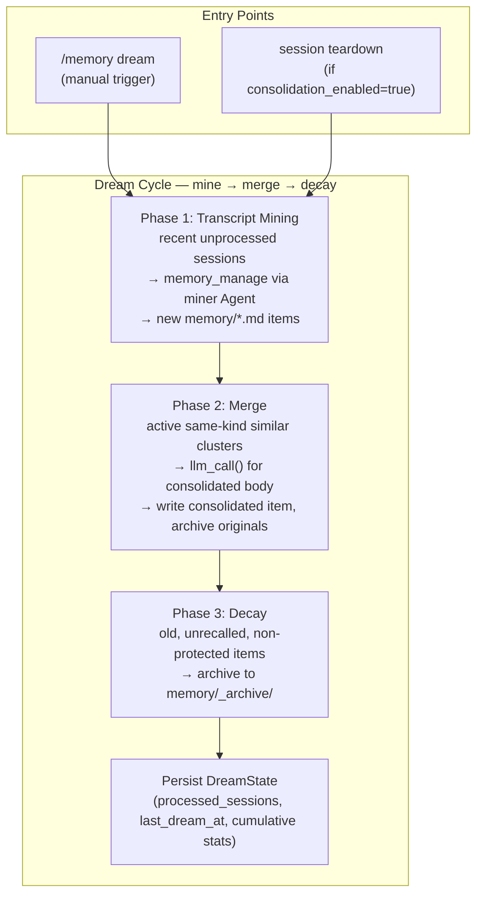

# Co CLI — Dream

This spec owns the dream subsystem — co's self-learning path. It covers two coupled layers:

1. **In-session reviewer (daemon layer)** — a per-`CO_HOME` daemon that processes KICK payloads queued by the REPL. It runs domain-specific review agents (memory + skill) against recent session transcripts. Ships as Plan 1 of the dream roadmap.
2. **Batch maintenance cycle** — mine → merge → decay against the full memory corpus, triggered manually or at session end. Lives in `co_cli/memory/dream.py`. Deferred absorption into the daemon is Plan 2 territory.

The broader persistent cognition model lives in [memory.md](memory.md). Startup and shutdown sequencing live in [bootstrap.md](bootstrap.md) and [01-system.md](01-system.md). Prompt injection and recall scoring live in [prompt-assembly.md](prompt-assembly.md). Model routing for daemon and batch review calls lives in [config.md](config.md).

---

## 1. In-Session Reviewer — Daemon Layer

### 1.1 Architecture Overview

```
   User ── turns ──> REPL (co chat)             dream daemon (co dream start)
                          ▲                                ▲
                          │ writes KICK files,             │ polls queue,
                          │ writes memory/skill            │ writes memory/skill,
                          ▼                                ▼ moves files → done/failed
                  ┌───────────────────────────────────────────────┐
                  │  $CO_HOME — sole cross-process bridge         │
                  │    daemons/dream/queue/<ts>-<uuid>.json       │
                  │    daemons/dream/{done,failed}/               │
                  │    daemons/dream.pid, dream.lock              │
                  │    sessions/<id>.jsonl                        │
                  │    memory/*.md     skills/.usage.json         │
                  │    logs/dream/<ts>.log                        │
                  └───────────────────────────────────────────────┘

   Ollama (off-diagram): shared serializer; no coordination API. REPL fires
   on demand; daemon wraps each call in asyncio.timeout + retry/backoff.
```

REPL behavior lives in §1.2 (counters, KICK dispatch, auto-spawn). Daemon behavior lives in §1.4 (main loop, drain, retries). Filesystem layout under `daemons/dream/` is detailed in §1.3. This diagram only shows the two processes and the single bridge between them.

Key properties:

- **No process-state coupling.** REPL never asks "is daemon busy?" Daemon never asks "is REPL busy?".
- **Filesystem is the sole cross-process bridge.** Producer (REPL) writes queue files; consumer (daemon) polls the queue directory. No socket, no realtime signaling, no side channels — the daemon discovers work on its next poll iteration.
- **Daemon control is POSIX-native.** Stop is `SIGTERM` with `SIGKILL` fallback. Status is direct PID-file + queue-directory inspection by the CLI — no daemon round-trip.
- **Ollama is the only shared external resource.** Daemon copes via timeout + retry + backoff; REPL copes by being interactive.
- **Two domain counters, two domain specs.** Memory and skill review are fully independent — own counters, own KICKs, own queue items, own agents.
- **Approval bypass via `build_task_agent`.** Daemon tools are registered with `requires_approval=False`. Dead REPL-side flags (`auto_approve_skill_ops`, `auto_approve_knowledge_ops`) were removed.

### 1.2 REPL-Side Counters and KICK Dispatch

`CoSessionState` carries two domain counters:

| Field | Unit | Increment source |
|---|---|---|
| `turns_since_memory_review: int` | turns (1/turn) | `_post_turn_hook` |
| `iters_since_skill_review: int` | iterations (`turn_iteration_count`/turn) | `_post_turn_hook` |

**Unit rationale:** memory tracks user-intent signal (~1 per turn); skill tracks agent-action signal (~tool + reasoning steps per turn). Conflating the units would over-fire skill reviews on chatty users or under-fire memory reviews on tool-heavy turns.

Counter flow in `_post_turn_hook` (guarded by `review_enabled` and `deps.model is not None`):

```python
deps.session.turns_since_memory_review += 1
deps.session.iters_since_skill_review += turn_iteration_count
_maybe_kick_memory_review(deps)
_maybe_kick_skill_review(deps)
```

Each `_maybe_kick_*` checks whether the counter has reached its nudge interval, resets the counter to 0, and calls `_send_review_kick(deps, domain=..., persisted_message_count=...)`.

**Inline tool-write resets** (domain-scoped):

| Tool call | Effect |
|---|---|
| `memory_manage(action ∈ {create, append, replace})` | `turns_since_memory_review = 0` |
| `skill_manage(action ∈ {create, edit, patch})` | `iters_since_skill_review = 0` |
| `delete`, `write_file`, `remove_file` | no reset |
| No crossover | memory tool never touches skill counter; skill tool never touches memory counter |

**Session-end always-fire** in `_drain_and_cleanup`: both KICKs (memory + skill) fire regardless of counter state at REPL shutdown. This replaces the former in-process `background_review_task` and `_maybe_run_dream_cycle` call.

**`_send_review_kick`** is fire-and-forget against the filesystem: atomic-write a KICK JSON file to `$CO_HOME/daemons/dream/queue/<ts>-<uuid>.json` (write to `<name>.tmp` sibling → fsync → `os.replace` into `<name>.json`) so the daemon never observes a torn file. The producer never touches the daemon's address space — daemon picks the file up on its next polling iteration (default 5 s).

### 1.3 KICK File Queue

Queue file payload:

```jsonc
{
  "domain": "memory" | "skill",
  "session_id": "<session-stem>",
  "persisted_message_count": 42,
  "created_at": "2026-05-22T...",
  "attempts": 0
}
```

`persisted_message_count` is a JSONL record index, not a turn count. The daemon truncates the transcript at this index to get a consistent view even while the REPL is still appending. Naming this `turn_index` would invite truncation bugs.

Queue directories under `$CO_HOME/daemons/dream/`:

| Path | Content |
|---|---|
| `queue/*.json` | Pending KICK files |
| `queue/done/*.json` | Successfully processed (audit retention) |
| `queue/failed/*.json` | Exhausted `max_retry_attempts`; inspect via `co dream status` |

The daemon's `_queue.py` scanner skips any `*.tmp` files (in-flight REPL writes).

### 1.4 Daemon Process Model

**Lifecycle:**

```text
co dream start
  → singleton check: read DREAM_PID_FILE
      if PID is live  → print "daemon already running" → SystemExit(1)
      if PID is stale → log "overwriting stale PID file" → unlink → proceed
  → acquire advisory flock on dream.lock (POSIX-only)
  → double_fork_detach: subprocess.Popen(co dream start --foreground, start_new_session=True)
  → child registers SIGTERM/SIGINT handlers (set shutdown asyncio.Event)
  → child writes DREAM_PID_FILE (pid, origin, session_id, started_at)
  → child calls create_deps(on_status=logger.info, stack=None)  [headless bootstrap]
  → child runs main_loop(deps, queue_dir, state, cfg, shutdown)
  → on shutdown.set(): main_loop exits; finally-block unlinks DREAM_PID_FILE

co dream stop
  → read DREAM_PID_FILE; if missing or PID is dead, clean up and print "not running"
  → send SIGTERM to PID
  → poll up to 10s (20 × 0.5s) for process death; on timeout, send SIGKILL

Stale PID cleanup: every entry point (start / stop / status) probes the recorded PID
with os.kill(pid, 0). Dead PID → file is treated as stale and removed.
```

POSIX-only boundary: `fcntl.flock`, `start_new_session=True`, POSIX signals (`SIGTERM`/`SIGKILL`). Marked in `_process.py` module docstring. No Windows path.

**Worker loop:**

The main loop is signal-driven and polling-based — no IPC. On startup the daemon installs SIGTERM/SIGINT handlers (each sets a shared `asyncio.Event`); cold-start drain is implicit — the first iterations see pending files and process them before reaching any sleep. There is one loop, three branches per iteration: idle-poll, process-item, retry-backoff.

```python
while not shutdown.is_set():
    files = sorted(queue_dir.glob("*.json"))
    if not files:
        with contextlib.suppress(TimeoutError):
            await asyncio.wait_for(shutdown.wait(),
                                   timeout=poll_interval_seconds)
        continue                                        # idle-poll

    item = files[0]                                     # FIFO
    try:
        async with asyncio.timeout(cfg.review_timeout_seconds):
            await _process_kick_file(deps, item, state)
        move_to_done(item)
    except Exception as exc:
        payload["attempts"] += 1
        write_queue_item(item, payload)                 # persist counter across restarts
        if attempts >= cfg.max_retry_attempts:
            move_to_failed(item, last_error=str(exc))
        else:
            with contextlib.suppress(TimeoutError):
                await asyncio.wait_for(shutdown.wait(),
                                       timeout=retry_backoff_seconds)
```

Skip-sleep-when-busy falls out of the structure: as long as the queue keeps refilling, the loop never enters either sleep branch.

**Clean-shutdown bound.** Both sleep points — idle poll and retry backoff — are `asyncio.wait_for(shutdown.wait(), timeout=...)`, so SIGTERM wakes the loop immediately rather than after the timeout. The in-flight item is allowed to finish (its `asyncio.timeout` runs to completion or its own timeout fires). Remaining queue files stay in `queue/` and are picked up by the next daemon start. Worst-case shutdown latency is one reviewer call, bounded by `review_timeout_seconds` — inside the 10 s SIGTERM → SIGKILL budget when `review_timeout_seconds ≤ 10`. With the current default (`120`), an in-flight reviewer can exceed the SIGKILL window — that is the timeout's intrinsic cost, not a loop-structure issue. `CancelledError` is `BaseException` and is not caught by `except Exception`, so task-cancel propagates cleanly.

### 1.5 Domain Reviewers

Two specs in `co_cli/daemons/dream/_reviewer.py`:

| Spec | Tool surface | Prompt |
|---|---|---|
| `MEMORY_REVIEW_SPEC` | `memory_search`, `memory_manage` | `daemons/dream/prompts/memory_review.md` |
| `SKILL_REVIEW_SPEC` | `skill_view`, `skill_manage`, `memory_search`; `include_skill_manifest=True` | `daemons/dream/prompts/skill_review.md` |

**Memory review** — focused on persona, preferences, and references extracted from the transcript.

**Skill review** — focused on corrections, techniques, and umbrella discipline patterns extracted from the transcript. The skill manifest is injected so the reviewer can reference and patch existing skills by name.

Both specs route through `run_standalone(SPEC, child_deps, prompt)` which uses `build_task_agent` with `requires_approval=False`. **Daemon code must never call a REPL-toolset-built agent** — it would block waiting for an approval that no frontend can answer.

**Deps bootstrap is shared with the REPL.** `_run_foreground` calls `create_deps(on_status=logger.info, stack=None)` — the same bootstrap path used by `co chat`. The two daemon-specific differences are: status messages route to the daemon log instead of a terminal, and no MCP servers are connected (reviewer tools are all native). All stores (`index_store`, `memory_store`, `session_store`, `skill_index`) are built identically to the REPL.

**Transcript loading:** `load_transcript(path, max_message_count=N)` truncates the JSONL at record index N — consistent view even while REPL appends. Default `max_message_count=None` returns the full list unchanged (existing callers unaffected).

### 1.6 Recall Metrics

Recall signals flow back into items at query time, providing data for Plan 2's housekeeping.

**Memory items** — three fields on `MemoryItem`:

| Field | Status | Type | Semantics |
|---|---|---|---|
| `recall_count: int` | existing | int | Total hit count |
| `last_recalled: str \| None` | existing | ISO-8601 string | Most recent recall timestamp |
| `recall_days: list[str]` | new | deduped ISO-date strings | Cadence signal; more robust to lost-update than raw count |

Side-effect in `memory_search` after building results, before returning `ToolReturn`:

```python
for each returned hit:
    item = load_memory_item(path)
    item.recall_count += 1
    item.last_recalled = now.isoformat()
    if today_iso not in item.recall_days:
        item.recall_days.append(today_iso)
    atomic_write_text(path, render_memory_item_file(item))
```

Lazy-default on load: items without `recall_days` in frontmatter read back `[]`.

**Skill items** — extend the existing `co_cli/skills/usage.py` sidecar:

```jsonc
{
  "version": 1,
  "skills": {
    "<name>": {
      "use_count": 0,
      "view_count": 0,
      "patch_count": 0,
      "recall_days": ["2026-05-20"],   // new field
      "last_used_at": null,
      "last_viewed_at": null,
      "last_patched_at": null
    }
  }
}
```

`bump_recall(deps, name)` appends today's ISO date to `recall_days` (deduped), without touching existing counters. Called from:
- `skill_view` — alongside existing `bump_view`
- `/skill-name` slash dispatch (`commands/core.py`) — before `DelegateToAgent`

Lazy migration: sidecars without `recall_days` default to `[]` on `setdefault` read.

**Concurrency model:** recall writes are best-effort with possible lost updates under concurrent REPL sessions or REPL + daemon. `recall_days` deduplication (day strings collide rather than increment) makes lost-update degrade gracefully. Torn writes are prevented by `atomic_write_text`; lost updates are accepted. Plan 2 housekeeping consumes `recall_count`/`recall_days` as order-of-magnitude signals, not exact ledgers.

### 1.7 REPL Auto-Spawn

`maybe_autospawn_dream(deps, frontend)` in `co_cli/bootstrap/core.py`:

```text
if dream.enabled is False: return
if CO_DREAM_NO_AUTOSPAWN is set: return
acquire advisory flock on DREAM_LOCK (POSIX-only)
if pid_live(read_pid(DREAM_PID_FILE)): return   # already running
Popen(co dream start --origin=repl-autospawn --session-id=<id>)
if first spawn for this CO_HOME:
    frontend.on_status("[dream] daemon started in background. ...")
```

The `--origin` and `--session-id` are persisted to `dream.pid` so `co dream status` can report provenance. Concurrent REPL bootstraps serialize via `fcntl.flock` — exactly one daemon spawns.

Current default: `dream.enabled = false`. Opt-in via `CO_DREAM_ENABLED=true` or settings file.

---

## 2. Batch Maintenance Cycle

The batch cycle (`co_cli/memory/dream.py`) performs mine → merge → decay against the full memory corpus. It runs inside `asyncio.timeout()` and isolates phase failures.



### 2.1 Entry Points

Manual trigger:

```text
/memory dream
  → run_dream_cycle(dry_run=false)
  → print extracted, merged, decayed, and errors

/memory dream --dry
  → run_dream_cycle(dry_run=true)
  → report merge and decay counts only
  → no file writes, no archive, no state persistence
```

Automatic trigger:

```text
session teardown
  → if memory.consolidation_enabled is true
  → if memory.consolidation_trigger is "session_end"
  → run dream cycle (timeout managed by run_dream_cycle)
  → log result; never fail shutdown because dreaming failed
```

Automatic dreaming is behind `memory.consolidation_enabled=false` by default.

### 2.2 State

`DreamState` persists at `memory/_dream_state.json`.

| Field | Meaning |
|---|---|
| `last_dream_at` | ISO timestamp for the last completed non-dry run |
| `processed_sessions` | Transcript filenames already mined or intentionally skipped |
| `stats.total_cycles` | Count of completed non-dry cycles |
| `stats.total_extracted` | Cumulative artifacts created by mining |
| `stats.total_merged` | Cumulative merge clusters completed |
| `stats.total_decayed` | Cumulative artifacts archived by decay |

Load is forgiving: missing or corrupt state returns a fresh state object.

### 2.3 Phase 1: Transcript Mining

Mining turns raw episodic memory into reusable knowledge by looking across prior sessions for durable cross-turn signals.

```text
load dream state
list recent sessions by reverse filename order
limit to memory.consolidation_lookback_sessions
for each unprocessed session:
  load transcript
  if empty or no extractable window: mark processed
  build transcript window (wider text/tool caps)
  split oversized window into overlapping chunks
  run dream miner agent over each chunk
  stop after per-session save cap
  mark session processed
```

The dream miner is a **tool-using Agent** with `memory_manage`. It is instructed to save only durable artifacts — cross-turn patterns, implicit preferences, stable decisions — and avoid ephemeral state, secrets, and codebase facts derivable by reading the repo.

### 2.4 Phase 2: Merge

Merge reduces duplication by clustering active same-kind items above a token-Jaccard threshold and consolidating each cluster into one artifact.

```text
load active memory/*.md
discard decay_protected items
group by memory_kind
cluster by token-Jaccard threshold
for each cluster (capped per cycle):
  llm_call() → consolidated body
  write consolidated artifact (source_type: consolidated)
  archive originals (os.replace into memory/_archive/)
```

The merge call is a **direct `llm_call`** (no tool access, body text only). Original artifacts are archived only after the consolidated artifact is durably written.

### 2.5 Phase 3: Decay

Decay removes stale, low-use knowledge from active recall while preserving it for restore.

```text
for each active artifact:
  skip if decay_protected
  skip if newer than decay cutoff
  skip if last_recalled newer than decay cutoff
include candidate
sort oldest first
archive up to 20 per cycle
```

Cutoff is `now - memory.decay_after_days`.

### 2.6 Dry Run

- Mining is skipped (predicting artifacts requires LLM writes).
- Merge reports mergeable cluster count (capped to per-cycle limit).
- Decay reports eligible artifact count (capped to per-cycle archive limit).
- No files written; no state persisted.

### 2.7 Failure and Timeout Semantics

Each phase is independently try/except'd. On `asyncio.timeout`, `timed_out=True` is set, a timeout error is appended, and partial result counts are returned. Timeout does not roll back completed file writes.

Session shutdown catches all dream errors — dreaming never prevents terminal cleanup.

### 2.8 User Inspection and Recovery

| Command | Purpose |
|---|---|
| `/memory dream --dry` | Preview merge and decay counts |
| `/memory dream` | Run the cycle now |
| `/memory stats` | Active counts, archive count, last dream timestamp, cumulative stats, decay candidates |
| `/memory restore [slug]` | List archived artifacts or restore one by unambiguous filename prefix |
| `/memory decay-review --dry` | Preview decay candidates |
| `/memory decay-review` | Archive decay candidates after confirmation |

### 2.9 Observability

| Span | Source | Purpose |
|---|---|---|
| `co.dream.cycle` | `@trace` on `run_dream_cycle` | Whole-cycle envelope with dry-run, timeout, count, error |
| `co.dream.mine` | `@trace` on `_mine_transcripts` | Mining phase count |
| `invoke_agent _dream_miner_agent` | `ObservabilityCapability` | Each miner agent iteration; `co.agent.role=dream_miner` |
| `co.dream.merge.preview` / `.apply` | `@trace` | Merge phase count (dry-run vs apply) |
| `co.dream.decay.preview` / `.apply` | `@trace` | Decay phase count (dry-run vs apply) |

---

## 3. Inspectability

Auto-spawn and daemon existence are visible across four surfaces (mission §"Trusted"):

| Surface | Description |
|---|---|
| **First-spawn notice** | On first auto-spawn of a `CO_HOME`, REPL prints: `[dream] daemon started in background. 'co dream status' to inspect; 'co dream stop' to stop.` |
| **Welcome banner** | `Dream:` row alongside `Memory:` / `Tools:` / `Dir:`. Three states: `✓ running  queue: N` (accent), `disabled` (dim), `enabled but daemon not running  queue: N (on disk)` (yellow). Built from local PID-file + queue-directory reads — instantaneous, never stalls startup. |
| **`/dream` slash** | Read-only inspection in the REPL. Calls `status_daemon` (file-based; no daemon round-trip). When daemon is down: prints state + on-disk queue depth + guidance. |
| **`co dream status`** | Full JSON: `running`, `pid`, `uptime_seconds`, `queue_depth`, `failed_count`, `spawn_origin`, `spawn_session_id`. Authoritative source of truth — read directly from PID file + queue directory. |

CLI subcommands (MVP surface):

```text
co dream start [--foreground] [--origin=<str>] [--session-id=<str>]
co dream status
co dream stop
```

`tail` and `config` are deferred to Plan 2. For log streaming: `tail -f $CO_HOME/logs/dream/*.log`.

---

## 4. Config

### Daemon settings (`dream.*`)

| Setting | Env Var | Default | Description |
|---|---|---|---|
| `dream.enabled` | `CO_DREAM_ENABLED` | `false` | Master switch; REPL auto-spawn only fires when true |
| `dream.review_timeout_seconds` | `CO_DREAM_REVIEW_TIMEOUT_SECONDS` | `120` | Per-review LLM call timeout; `asyncio.timeout` in worker loop |
| `dream.retry_backoff_seconds` | `CO_DREAM_RETRY_BACKOFF_SECONDS` | `30` | Sleep between retry attempts on timeout or error |
| `dream.max_retry_attempts` | `CO_DREAM_MAX_RETRY_ATTEMPTS` | `3` | After this many failures, move queue file to `failed/` |
| `dream.poll_interval_seconds` | `CO_DREAM_POLL_INTERVAL_SECONDS` | `5` | Idle queue-scan interval (range 1–60); only fires when queue is empty |

### Reviewer trigger settings (`skills.*`)

| Setting | Env Var | Default | Description |
|---|---|---|---|
| `skills.review_enabled` | `CO_SKILLS_REVIEW_ENABLED` | (existing) | Master switch for the reviewer subsystem |
| `skills.review_memory_nudge_interval` | `CO_SKILLS_REVIEW_MEMORY_NUDGE_INTERVAL` | `10` | Turns between mid-session memory KICKs |
| `skills.review_skill_nudge_interval` | `CO_SKILLS_REVIEW_SKILL_NUDGE_INTERVAL` | `10` | Iterations between mid-session skill KICKs |

### Batch cycle settings (`memory.*`)

| Setting | Env Var | Default | Description |
|---|---|---|---|
| `memory.consolidation_enabled` | `CO_MEMORY_CONSOLIDATION_ENABLED` | `false` | Enables batch dream cycle at session end |
| `memory.consolidation_trigger` | `CO_MEMORY_CONSOLIDATION_TRIGGER` | `session_end` | `session_end` or `manual` |
| `memory.consolidation_lookback_sessions` | `CO_MEMORY_CONSOLIDATION_LOOKBACK_SESSIONS` | `5` | Recent transcript files considered by mining |
| `memory.consolidation_similarity_threshold` | `CO_MEMORY_CONSOLIDATION_SIMILARITY_THRESHOLD` | `0.75` | Token-Jaccard threshold for merge clusters |
| `memory.decay_after_days` | `CO_MEMORY_DECAY_AFTER_DAYS` | `90` | Age and last-recall cutoff for decay candidacy |

Internal caps (batch cycle):

| Constant | Value | Purpose |
|---|---|---|
| dream window text cap | 50 | Max text lines in a mining window |
| dream window tool cap | 50 | Max tool lines in a mining window |
| soft mining window limit | 16000 chars | Threshold before chunking |
| mining chunk size | 12000 chars | Chunk length for oversized windows |
| mining chunk overlap | 2000 chars | Overlap between chunks |
| max mining saves per session | 5 | Per-session artifact cap from mining |
| max merge clusters per cycle | 10 | Per-cycle merge cap |
| max artifacts per merge cluster | 5 | Cluster size cap |
| minimum merged body length | 20 chars | Guard against empty merge outputs |
| max decay archives per cycle | 20 | Per-cycle decay archive cap |
| default cycle timeout | 60 seconds | `run_dream_cycle()` timeout |

---

## 5. Public Interface

### Daemon layer

| Symbol | Source | Contract |
|---|---|---|
| `start_daemon(co_home, *, foreground, origin, session_id)` | `co_cli/daemons/dream/process.py` | Start daemon; live PID → `SystemExit(1)`; stale PID → overwrite |
| `stop_daemon(co_home, *, force=False)` | `co_cli/daemons/dream/process.py` | SIGTERM, poll 10 s for exit, SIGKILL fallback; cleans stale PID files |
| `status_daemon(co_home, timeout_ms=2000) -> dict` | `co_cli/daemons/dream/process.py` | File-based status: reads PID file + probes liveness + scans queue directory |
| `create_deps(*, on_status, stack=None, theme_override=None) -> CoDeps` | `co_cli/bootstrap/core.py` | Shared bootstrap for REPL and daemon; daemon passes `stack=None` to skip MCP |
| `MEMORY_REVIEW_SPEC` / `SKILL_REVIEW_SPEC` | `co_cli/daemons/dream/_reviewer.py` | Domain reviewer task specs |
| `process_review(deps, domain, session_id, persisted_message_count)` | `co_cli/daemons/dream/_reviewer.py` | Load transcript + dispatch to domain reviewer |
| `maybe_autospawn_dream(deps, frontend)` | `co_cli/bootstrap/core.py` | REPL auto-spawn hook |
| `build_dream_line(deps) -> str` | `co_cli/bootstrap/banner.py` | Banner `Dream:` line builder |
| `handle_dream_slash(ctx, args)` | `co_cli/commands/dream.py` | `/dream` slash handler |

### Recall metrics

| Symbol | Source | Contract |
|---|---|---|
| `bump_recall(deps, name)` | `co_cli/skills/usage.py` | Append today's ISO date to `recall_days` in sidecar (deduped, best-effort) |
| `MemoryItem.recall_days` | `co_cli/memory/item.py` | `list[str]` — deduped ISO-date strings; lazy-default `[]` on load |

### Batch cycle

| Symbol | Source | Contract |
|---|---|---|
| `run_dream_cycle(deps, miner_tool, dry_run, *, timeout_secs) -> DreamResult` | `co_cli/memory/dream.py` | Async — mine → merge → decay under `asyncio.timeout` |
| `DreamResult` | `co_cli/memory/dream.py` | Frozen dataclass — `extracted`, `merged`, `decayed`, `errors`, `timed_out` |
| `DreamState` / `DreamStats` | `co_cli/memory/dream.py` | Pydantic models for state persistence |
| `load_dream_state(memory_dir)` | `co_cli/memory/dream.py` | Forgiving loader — fresh state on missing/corrupt |
| `save_dream_state(memory_dir, state)` | `co_cli/memory/dream.py` | Writes `_dream_state.json` |
| `archive_artifacts(entries, memory_dir, memory_store)` | `co_cli/memory/archive.py` | Move items into `memory/_archive/` |
| `restore_artifact(slug, memory_dir, memory_store)` | `co_cli/memory/archive.py` | Restore archived item by unambiguous filename prefix |

### Transcript loading

| Symbol | Source | Contract |
|---|---|---|
| `load_transcript(path, *, max_message_count=None)` | `co_cli/session/persistence.py` | Load JSONL; truncate at `max_message_count` when provided |

---

## 6. Files

### Daemon layer

| File | Purpose |
|---|---|
| `co_cli/daemons/dream/__init__.py` | Docstring-only package marker |
| `co_cli/daemons/dream/_queue.py` | Queue file read/write/move helpers |
| `co_cli/daemons/dream/_loop.py` | Polling main loop and queue drain logic |
| `co_cli/daemons/dream/_reviewer.py` | `MEMORY_REVIEW_SPEC`, `SKILL_REVIEW_SPEC`, `process_review` |
| `co_cli/daemons/dream/_process.py` | PID-file helpers, advisory flock, double-fork detach (POSIX-only) |
| `co_cli/daemons/dream/_state.py` | `DaemonState` runtime struct + PID-file loader |
| `co_cli/daemons/dream/process.py` | Public surface: `start_daemon`, `stop_daemon`, `status_daemon`, `_run_foreground` |
| `co_cli/daemons/dream/prompts/memory_review.md` | Memory reviewer instructions |
| `co_cli/daemons/dream/prompts/skill_review.md` | Skill reviewer instructions |
| `co_cli/commands/dream.py` | `co dream` CLI group + `handle_dream_slash` |
| `co_cli/config/dream.py` | `DreamSettings` Pydantic model + `DREAM_ENV_MAP` |
| `co_cli/bootstrap/banner.py` | `build_dream_line` — `Dream:` banner row |
| `co_cli/bootstrap/core.py` | `maybe_autospawn_dream` — REPL auto-spawn hook |
| `co_cli/main.py` | `_send_review_kick`, `_maybe_kick_memory_review`, `_maybe_kick_skill_review`, `_fire_session_end_kicks` |
| `co_cli/deps.py` | `CoSessionState.turns_since_memory_review` / `iters_since_skill_review` |
| `co_cli/skills/usage.py` | `bump_recall` + `recall_days` sidecar field |
| `co_cli/memory/item.py` | `MemoryItem.recall_days` field |

### Batch cycle

| File | Purpose |
|---|---|
| `co_cli/memory/dream.py` | Dream state, mining, merge, decay, dry-run, timeout, orchestration |
| `co_cli/memory/prompts/dream_miner.md` | Retrospective transcript mining instructions |
| `co_cli/memory/prompts/dream_merge.md` | Same-kind artifact consolidation instructions |
| `co_cli/memory/_window.py` | Transcript-window builder for mining |
| `co_cli/memory/similarity.py` | Token-Jaccard similarity and clustering |
| `co_cli/memory/decay.py` | Decay candidate selection |
| `co_cli/memory/archive.py` | Archive and restore mechanics |
| `co_cli/session/persistence.py` | `load_transcript` with `max_message_count` |
| `co_cli/commands/memory.py` | `/memory dream`, `/memory restore`, `/memory decay-review`, `/memory stats` |

---

## 7. Test Gates

### Daemon layer

| Property | Test file |
|---|---|
| `memory_manage` reset — no crossover; `delete` does not reset | `tests/tools/memory/test_manage_resets.py` |
| `skill_manage` reset — no crossover; `write_file`/`remove_file` do not reset | `tests/tools/system/test_skill_manage_resets.py` |
| Memory recall updates on `memory_search`; backward-compat load | `tests/tools/memory/test_recall_metrics.py` |
| Skill recall sidecar `recall_days`; deduplication; backward-compat | `tests/skills/test_usage_recall_days.py` |
| `.tmp` skip filter and FIFO drain order; `last_error` injection on `failed/` move | `tests/daemons/dream/test_queue.py` |
| Polling drain: multi-item drain; between-items shutdown bound | `tests/daemons/dream/test_loop.py` |
| Retry exhaustion → `failed/`; attempt counter persists across restarts | `tests/daemons/dream/test_timeout_retry.py` |
| `acquire_start_lock` contention; file-based `status_daemon` (no/stale/live PID); `stop_daemon` stale-PID cleanup | `tests/daemons/dream/test_process.py` |
| Full daemon process lifecycle: start, SIGTERM stop, singleton, stale-PID overwrite | `tests/integration/test_daemon_lifecycle.py` |
| Session-end always-fires both KICKs; end-to-end KICK → queue file | `tests/integration/test_review_kick_end_to_end.py` |
| Auto-spawn race: exactly one daemon spawns under concurrent REPL bootstraps | `tests/integration/test_auto_spawn_race.py` |
| First-spawn notice + `co dream status` provenance fields | `tests/integration/test_autospawn_notice.py` |
| Multi-REPL: N + M KICKs → N + M queue files (no coalescing); UUID-distinct filenames | `tests/integration/test_multi_repl_kick.py` |
| Crash mid-process → restart re-processes file (idempotent) | `tests/integration/test_daemon_crash_recovery.py` |
| Per-prompt extraction quality (real model + real stores) | `evals/eval_domain_review.py` |

### Batch cycle

| Property | Test file |
|---|---|
| Dream state load/save and forgiving corrupt-state recovery | `tests/memory/test_knowledge_dream.py` |
| Cycle orchestration: phase ordering, phase isolation, timeout | `tests/memory/test_knowledge_dream_cycle.py` |
| Dry-run counts, no-write guarantee, state non-persistence | `tests/memory/test_knowledge_dream_cycle.py` |
| Decay candidate selection: cutoff, `decay_protected`, `last_recalled` | `tests/memory/test_knowledge_decay.py` |
| Archive move and filename collision resolution | `tests/memory/test_knowledge_archive.py` |
| Restore: unambiguous slug succeeds; ambiguous or missing returns False | `tests/memory/test_knowledge_archive.py` |
| Token-Jaccard similarity and union-find clustering | `tests/memory/test_knowledge_similarity.py` |
