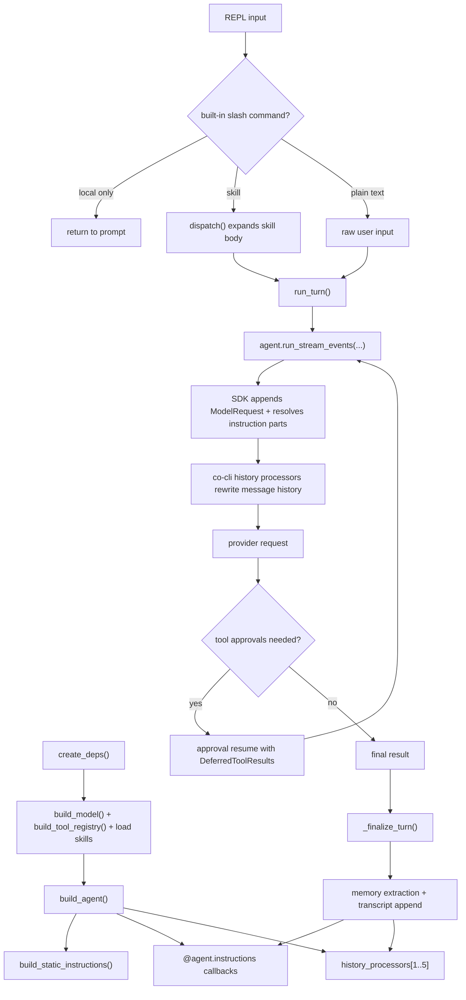

# Prompt Assembly Flow

## Product Intent

**Goal:** Define the end-to-end request assembly flow from startup inputs to the final model request used by the foreground agent.
**Functional areas:**
- Build-time model normalization and quirks-derived `ModelSettings`
- Static instruction assembly from soul files, universal rules, and model-quirk guidance
- Turn-entry input rewriting through skills
- Per-request dynamic instruction layers
- History-processor transforms, memory recall injection, and inline compaction
- Post-turn writes that affect future requests

**Non-goals:**
- Tool semantics and approval policy details (owned by `tools.md` and `core-loop.md`)
- Session browser, transcript format, and slash-command catalog details
- Provider-specific wire format after the SDK has accepted the processed request
- Memory/article schema internals (owned by `memory.md` and `library.md`)

**Success criteria:** A reader can reconstruct which local files, config fields, runtime registries, and prior-turn artifacts shape the next model request, in what order, and can distinguish soul-defined personality from model-specific counter-steering and from runtime insights stored in `.co-cli/memory/`.
**Status:** Stable
**Known gaps:** Exact provider payload serialization and any SDK-owned toolset instruction text are outside co-cli's source tree. This doc owns the co-cli sequence up to the SDK boundary and the co-cli-managed transforms applied before send.

---

## 1. What & How

`co-cli` builds prompt context in two phases. Startup resolves the model, tool surface, skill registry, and personality inputs, then `build_agent()` freezes the static scaffold and registers turn-time hooks. During each foreground segment, the SDK combines the current user input, joined instruction parts, and the current message history after co-cli's history processors have rewritten it. Clean turns then feed new memories and transcript state back into disk so later requests can assemble different dynamic context without mutating model weights.



---

## 2. Core Logic

### 2.1 Startup resolves the inputs that later shape prompts

Prompt assembly begins indirectly inside `create_deps()`. Startup validates LLM config, probes Ollama runtime context when applicable, resolves MCP server env tokens, builds the model, builds the tool registry, connects and discovers MCP tools, loads skills, resolves the knowledge backend, and assembles `CoDeps`.

Pseudocode:

```text
config = settings
paths = resolve_workspace_paths(config, cwd)
validate llm config
if ollama:
  probe runtime num_ctx
  override config.llm.num_ctx when runtime differs

llm_model = build_model(config.llm)
tool_registry = build_tool_registry(config)
discover MCP tools -> tool_index
load bundled + user + project skills
assemble CoDeps(config, model, tool_index, skill_commands, paths, runtime)
```

The outputs that matter later are:

- `llm_model.settings`: base `ModelSettings` for the main agent
- `llm_model.context_window`: compaction budget input
- `tool_index`: current visible/deferred tool inventory used by the category-awareness prompt
- `skill_commands`: slash-dispatch registry that can replace user input with a skill body

Failure and degradation behavior is input-shaping, not prompt-shaping:

- invalid LLM config aborts startup before any agent exists
- missing MCP servers reduce the discovered tool inventory, which changes later tool-awareness text
- skipped or invalid skill files reduce the set of slash commands that can rewrite input
- knowledge backend degradation does not alter the prompt scaffold directly

### 2.2 Model construction applies quirks before any prompt text is assembled

`build_model()` normalizes `config.llm.model`, looks up `prompts/model_quirks/{provider}/{model}.md`, and converts the quirk frontmatter into base `ModelSettings` plus optional `context_window`.

Pseudocode:

```text
normalized_model = normalize_model_name(config.llm.model)
inference = get_model_inference(provider, normalized_model)

if provider == ollama-openai:
  ModelSettings(
    temperature,
    top_p,
    max_tokens,
    extra_body = {num_ctx?, extra_body?...},
  )
elif provider == gemini:
  ModelSettings(temperature, top_p, max_tokens)
```

This step is deliberately separate from prompt text:

- quirk frontmatter changes sampling and context budgeting
- quirk markdown body becomes counter-steering prose later during static instruction assembly
- both come from the same quirk file, but only the body is part of the prompt

### 2.3 Agent construction freezes the static scaffold and registers request-time hooks

`build_agent()` is the point where prompt assembly becomes concrete. It normalizes the model name again for prompt lookup, builds the static instruction string once, and constructs the main `Agent` with:

- `instructions=static_instructions`
- `model_settings=llm_model.settings`
- `history_processors=[truncate_tool_results, compact_assistant_responses, detect_safety_issues, inject_opening_context, summarize_history_window]`
- `toolsets=[filtered_combined_toolset]`

The SDK later auto-adds its outer `ToolSearchToolset`, but co-cli's own build-time contributions are complete once `Agent(...)` returns.

Pseudocode:

```text
normalized_model = normalize_model_name(config.llm.model)
static = build_static_instructions(config.llm.provider, normalized_model, config)

Agent(
  instructions = static,
  model_settings = llm_model.settings,
  history_processors = [...],
  toolsets = [tool_registry.toolset],
)

register @agent.instructions callbacks
```

Two invariants are fixed here:

- the static scaffold never changes during the session
- dynamic instruction callbacks and history processors re-run on every segment that reaches request preparation

### 2.4 Static instruction assembly mixes role assets, rules, and model-specific guidance

`build_static_instructions()` assembles one literal string. If `config.personality` is set, it loads role assets from `co_cli/prompts/personalities/souls/{role}/`. It always validates and loads numbered rule files from `co_cli/prompts/rules/`. It separately loads counter-steering text from `co_cli/prompts/model_quirks/{provider}/{model}.md`.

Pseudocode:

```text
parts = []

if config.personality:
  parts += [
    seed,
    character memories,
    mindsets,
  ]

parts += numbered rule files in strict order

if examples:
  parts += [examples]

if quirk markdown body exists:
  parts += ["## Model-Specific Guidance\n\n" + counter_steering]

if critique:
  parts += ["## Review lens\n\n" + critique]
```

The exact static order is:

1. soul seed
2. character memories
3. mindsets
4. numbered rules
5. examples
6. counter-steering
7. critique

Important boundaries:

- soul-defined personality lives only under `souls/{role}/...`
- the role-specific `souls/{role}/memories/*.md` files are the base personality memory layer and occupy step 2 after the seed
- counter-steering is not loaded from the soul tree; it is model-specific guidance from `model_quirks/`
- `.co-cli/memory/` is the runtime insights store populated by `save_insight`; it is not the base personality store
- rule filename validation is fail-fast: invalid or non-contiguous rule numbering raises `ValueError`
- the assembled static string must be non-empty

### 2.5 Turn entry may rewrite the next prompt before the agent sees it

`_chat_loop()` accepts raw REPL input, but not every slash command becomes a model turn. Built-in slash commands can run locally, replace `message_history`, or return to the prompt without calling `run_turn()`. Skills are the only slash path that deliberately rewrites the next agent input.

Pseudocode:

```text
if input starts with "/":
  outcome = dispatch(input, ctx)
  if outcome is LocalOnly:
    stop
  if outcome is ReplaceTranscript:
    message_history = outcome.history
    stop
  if outcome is DelegateToAgent:
    user_input = expanded skill body
    apply skill_env
    set active_skill_name
else:
  user_input = raw input
```

Skill expansion happens inside `dispatch()`:

- built-ins win over skills, so a skill cannot shadow a built-in command
- `$ARGUMENTS`, `$0`, and `$N` placeholders are expanded in the skill body
- the expanded body becomes the `user_input` passed into `run_turn()`

This is the only place where co-cli intentionally substitutes a different prompt body before any `ModelRequest` exists.

### 2.6 Each stream segment builds a fresh request from current input, instructions, and processed history

`run_turn()` resets per-turn runtime state and `_execute_stream_segment()` calls `agent.run_stream_events(...)` with:

- `current_input`
- `current_history`
- `model_settings`
- `deferred_tool_results` when resuming an approval-gated segment
- session metadata

On a normal segment, the SDK appends a fresh `ModelRequest` containing the current user prompt, resolves instruction parts, joins them onto `ModelRequest.instructions`, then runs the request through `before_model_request`.

At this boundary, two ordering rules matter:

1. static instructions are joined before dynamic instructions
2. relative order is preserved within the static group and within the dynamic group

For co-cli, the instruction stack seen by the SDK is:

1. the static string from `build_static_instructions()`
2. `add_current_date`
3. `add_shell_guidance`
4. `add_project_instructions`
5. `add_always_on_memories`
6. `add_personality_memories`
7. `add_category_awareness_prompt`
8. any SDK/toolset-supplied dynamic instruction parts

The dynamic layers contribute the following request-time text:

- current date: `Today is YYYY-MM-DD.`
- shell guidance: approval/reminder text for shell execution
- project instructions: full `.co-cli/instructions.md` when present
- always-on memories: `Standing context:` followed by up to 5 `always_on=True` memory bodies, capped by `memory.injection_max_chars`
- personality memories: `## Learned Context` followed by the 5 most recent insight entries tagged `personality-context`
- category awareness: one short sentence listing deferred capability categories inferred from the current `tool_index`

These dynamic reads happen from disk or runtime state at request time, so they can change mid-session even though the static scaffold does not. The `personality-context` block is an adaptive overlay sourced from extracted insights; it does not replace the soul tree's static base memory layer from step 2.

### 2.7 History processors rewrite the request history immediately before send

Once the last `ModelRequest` has its joined instruction string, co-cli's history processors run in this exact order:

1. `truncate_tool_results`
2. `compact_assistant_responses`
3. `detect_safety_issues`
4. `inject_opening_context`
5. `summarize_history_window`

Pseudocode:

```text
messages = message_history_with_current_request
messages = truncate older compactable tool returns
messages = cap older text/thinking parts
messages = append safety warning if doom-loop or shell-failure streak detected
messages = append recalled-memory request when this is a new user turn
messages = summarize dropped middle window when token threshold exceeded
send processed messages to model
```

What each processor contributes to prompt shape:

- `truncate_tool_results`: clears old compactable tool outputs but preserves recent ones and the last user turn
- `compact_assistant_responses`: shortens old assistant text/thinking parts without touching tool-call args
- `detect_safety_issues`: injects warning text when repeated-tool or repeated-shell-failure patterns are detected
- `inject_opening_context`: looks at the current user message, recalls up to 3 relevant memories, caps the block by `memory.injection_max_chars`, and appends `Relevant memories:` as a trailing `SystemPromptPart`
- `summarize_history_window`: when the request exceeds 85% of the resolved budget, replaces the dropped middle region with a summary marker or static marker and preserves `search_tools` discovery breadcrumbs

Two details make the current-turn query visible to recall and compaction:

- the current `UserPromptPart` has already been appended before `inject_opening_context` runs
- compaction sees the same in-flight history, including the current request and the processor-injected memory block

When inline summarization triggers, it launches a separate no-tools summarizer call with:

- the dropped middle messages as `message_history`
- a summarizer prompt template
- optional side-channel context from touched file paths, active todos, always-on memories, and prior summaries
- an extra personality addendum when `config.personality` is enabled

If the summarizer is unavailable or the circuit breaker is tripped, the processor falls back to a static marker instead of an LLM summary.

After `before_model_request` returns, the SDK performs a final cleanup pass on the processed history before provider send. Consecutive trailing `ModelRequest` objects created during processing are merged at that boundary, so processor-created request objects become part of one outbound request history slice.

### 2.8 Approval resumes continue the same turn instead of creating a new prompt

If the model returns `DeferredToolRequests`, `_run_approval_loop()` collects approval decisions and restarts the SDK graph with:

- `current_input = None`
- `current_history = latest_result.all_messages()`
- `tool_approval_decisions = approvals`
- `resume_tool_names` narrowed to the currently approved tool names

Pseudocode:

```text
while latest_result.output is DeferredToolRequests:
  approvals = collect decisions
  current_input = None
  current_history = latest_result.all_messages()
  deferred_tool_results = approvals
  run next segment
```

This matters for prompt flow because approval resumes do not come from a new REPL prompt. They continue the same turn with the existing history and the main agent's existing instruction/processor configuration.

### 2.9 Clean-turn finalization writes artifacts that change future requests

`_finalize_turn()` does not alter the current request, but it changes later ones.

Pseudocode:

```text
if clean turn:
  fire_and_forget_extraction(delta_messages)

append new messages to transcript
show generic error banner on failed turns
```

Future prompt effects:

- newly extracted insights can later appear in `Relevant memories:` recall
- memories marked `always_on=True` can later appear in `Standing context:`
- insights tagged `personality-context` can later appear in `## Learned Context`
- transcript-replacement commands such as `/compact`, `/resume`, `/new`, and `/clear` alter the future `message_history` that enters step 2.6

The important invariant is that co-cli never stores prompt state in model weights. Later requests change only because files, runtime registries, or message history changed.

---

## 3. Config

| Setting | Env Var | Default | Description |
|---|---|---|---|
| `llm.provider` | `LLM_PROVIDER` | `ollama-openai` | Selects the provider namespace used by the model factory and model-quirk lookup |
| `llm.model` | `CO_LLM_MODEL` | provider default | Selects the model name; normalized before quirk lookup for both inference defaults and counter-steering |
| `llm.num_ctx` | `LLM_NUM_CTX` | `262144` | Ollama context budget input; runtime probe may override it before agent construction |
| `mcp_servers` | `CO_CLI_MCP_SERVERS` | bundled defaults | MCP discovery extends `tool_index`, which changes deferred-tool awareness text |
| `personality` | `CO_CLI_PERSONALITY` | `tars` | Selects the soul tree for static assembly and enables `personality-context` dynamic injection |
| `memory.injection_max_chars` | `CO_CLI_MEMORY_INJECTION_MAX_CHARS` | `2000` | Caps always-on memory injection and recalled-memory injection |

---

## 4. Files

| File | Purpose |
|---|---|
| `co_cli/bootstrap/core.py` | Startup assembly of `CoDeps`, skill registry, tool inventory, and `LlmModel` inputs |
| `co_cli/_model_factory.py` | Quirk-aware `LlmModel` construction and base `ModelSettings` derivation |
| `co_cli/agent/_core.py` | Main `Agent` construction, history processor registration, and tool registry wiring |
| `co_cli/agent/_instructions.py` | Dynamic instruction callbacks and personality injection |
| `co_cli/agent/_native_toolset.py` | Native toolset construction and tool registry wiring |
| `co_cli/agent/_mcp.py` | MCP toolset wiring and discovery |
| `co_cli/prompts/_assembly.py` | Static instruction assembly and rule-file validation |
| `co_cli/prompts/personalities/_loader.py` | Soul-file loading for seed, memories, mindsets, examples, and critique |
| `co_cli/prompts/personalities/_injector.py` | Per-request `personality-context` memory injection |
| `co_cli/prompts/model_quirks/_loader.py` | Model-quirk loading for counter-steering text and inference overrides |
| `co_cli/commands/_commands.py` | Skill loading, slash dispatch, and `DelegateToAgent` input rewriting |
| `co_cli/main.py` | REPL loop, command-outcome handling, and post-turn finalization |
| `co_cli/context/orchestrate.py` | Segment execution, approval resumes, and `agent.run_stream_events(...)` orchestration |
| `co_cli/context/_history.py` | History processors, recall injection, safety injection, and inline compaction |
| `co_cli/context/summarization.py` | Summarizer prompt construction and inline/manual compaction engine |
| `co_cli/memory/recall.py` | Always-on memory loading and grep-based recall primitives |
| `co_cli/tools/memory.py` | `_recall_for_context()` used by request-time memory injection |
