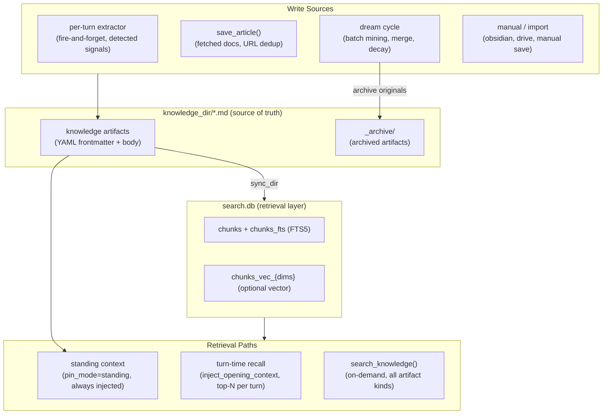

# Co CLI — Knowledge: Reusable Artifacts & Retrieval

## Product Intent

**Goal:** Define the Knowledge layer — every reusable distilled artifact the agent should be able to recall across sessions: extracted insights, fetched articles, imported notes, and synced sources.

**Functional areas:**
- Unified knowledge artifact model (`KnowledgeArtifact`, `artifact_kind` subtypes)
- Artifact storage: human-editable `.md` files with YAML frontmatter in `knowledge_dir`
- FTS5 and hybrid (FTS5 + vector) retrieval via `KnowledgeStore`
- Three retrieval paths: standing context, turn-time recall, explicit tool search
- Extraction bridge from Memory (per-turn extractor writes to Knowledge)
- Consolidation lifecycle: dedup on write, dream cycle (merge, decay, transcript mining)

**Non-goals:**
- Raw episodic timeline storage — that is the Memory layer ([memory.md](memory.md))
- Media asset processing (audio/video ingest, transcription pipelines)
- Multi-user or concurrent-write safety
- Real-time file-watch triggers

**Success criteria:** All reusable recall routes through `search_knowledge()`; extracted insights and articles share one artifact model; standing context is sourced from `pin_mode` metadata, not a separate storage tier.

**Status:** Target state — unification of the legacy `memory/*.md` (extracted facts) and `library/*.md` (articles) stores into a single `knowledge/` directory. See [cognition.md](cognition.md) for the two-layer architecture rationale.

**Known gaps:** Phase 2–3 implement the schema migration and tool surface convergence. During transition, legacy `kind: memory` and `kind: article` files are supported via backward-compatible loading.

---

Knowledge is the reusable layer. Everything the agent should remember and apply across sessions — user preferences, project rules, fetched documentation, workflow feedback, external references — lives here as an individually-addressable, human-editable artifact. The boundary rule: **reusability defines the layer, not origin.** If an artifact is intended for reuse beyond its original session, it is Knowledge.

The two-layer model and the Memory / Knowledge boundary are defined in [cognition.md](cognition.md). This spec owns the implementation: artifact schema, storage model, retrieval paths, and lifecycle machinery.

## 1. What & How

Knowledge artifacts are stored as `.md` files with YAML frontmatter in `knowledge_dir`. A `KnowledgeStore` (SQLite FTS5 + optional vector) serves as the retrieval index. Disk is the source of truth; the DB is derived and rebuildable. Search queries always hit the DB — never read `.md` files at query time. `sync_dir()` keeps the DB current from disk.



## 2. Core Logic

### 2.1 Knowledge Artifact Schema

Every knowledge artifact is a `.md` file with YAML frontmatter:

| Field | Type | Purpose |
|-------|------|---------|
| `id` | UUID4 string | Stable identity |
| `kind` | `knowledge` | Always `knowledge` for new artifacts |
| `artifact_kind` | enum | Semantic subtype (see below) |
| `title` | string | Human-readable label |
| `description` | string ≤200 chars | Compact summary for retrieval and manifests |
| `created` | ISO8601 | Creation timestamp |
| `updated` | ISO8601 | Last-modified timestamp |
| `tags` | list[str] | Retrieval and organization labels |
| `related` | list[str] | Soft links to related artifact slugs |
| `source_type` | enum | Origin: `detected`, `web_fetch`, `manual`, `obsidian`, `drive`, `consolidated` |
| `source_ref` | string | Pointer to origin: session ID, URL, file path, or artifact ID |
| `certainty` | enum | Confidence: `high`, `medium`, `low` |
| `pin_mode` | enum | `standing` (always injected into context) or `none` (default) |
| `decay_protected` | bool | Immune from automated decay |
| `last_recalled` | ISO8601 | Timestamp of most recent recall hit |
| `recall_count` | int | Count of recall hits |

**`artifact_kind` subtypes:**

| Kind | Meaning | Maps from legacy `type` |
|------|---------|------------------------|
| `preference` | User style, tool, or workflow preference | `user` |
| `feedback` | Correction or workflow guidance | `feedback` |
| `rule` | Project invariant or standing constraint | `project` |
| `decision` | Recorded design or architectural decision | `project` |
| `article` | Fetched external document or documentation | (articles) |
| `reference` | External system pointer (URL, project, channel) | `reference` |
| `note` | Manually authored or imported note | — |

**Backward compatibility:** Files with legacy `kind: memory` frontmatter are loaded via field mapping (`type` → `artifact_kind`, `always_on=True` → `pin_mode="standing"`, `name` → `title`). Files with `kind: article` map `origin_url` → `source_ref`, `title` stays. Neither format is rewritten on load — the backward-compat reader is applied only at parse time.

### 2.2 Storage Model

Knowledge uses a dual-layer storage model:

| Layer | What lives there | Purpose |
|-------|-----------------|---------|
| Disk (`knowledge_dir/*.md`) | Frontmatter + body | Source of truth. Human-editable, agent-readable. |
| DB (`search.db`) | FTS5 indexes, chunk tables, optional vector embeddings | Retrieval layer. Never read `.md` at query time. |

`sync_dir()` ingests `.md` files into `chunks` + `chunks_fts` tables (and optionally `chunks_vec_{dims}`) on bootstrap and after writes. The DB is fully rebuildable from disk.

Artifacts are split into overlapping chunks at index time (chunk size: 600 estimated tokens, overlap: 80). Extraction results (short artifacts < 2KB) become single-chunk documents. Articles remain multi-chunk.

### 2.3 Retrieval Paths

All reusable recall routes through the Knowledge layer via three paths:

**Standing context** — artifacts with `pin_mode="standing"` are injected into every model request as a dynamic instruction layer via `add_standing_knowledge()`. Capped at 5 entries, truncated to `memory.injection_max_chars`. Backward compatible: legacy `always_on=True` files loaded from `knowledge_dir` are treated as `pin_mode="standing"`.

**Turn-time recall** — on each new user turn, `inject_opening_context` calls `_recall_for_context()` which queries `search.db` for the top-3 knowledge artifacts matching the user's message. Results are injected as a trailing `SystemPromptPart`. Both extracted facts and articles are eligible — any reusable, relevant artifact surfaces here.

**Explicit search** — the agent calls `search_knowledge()` for on-demand retrieval. This is the universal reusable-recall surface: covers all artifact kinds plus Obsidian notes and Drive documents. Default `source=None` searches the unified knowledge layer.

**Search backends (three-tier fallback):**

| Backend | Mechanism | When used |
|---------|-----------|-----------|
| Hybrid | FTS5 + sqlite-vec vector similarity, merged via RRF (k=60) | Embedding provider available |
| FTS5 | BM25 over `chunks_fts`, porter/unicode61 tokenizer | Embedding provider unavailable |
| Grep | In-memory substring match over loaded `.md` files | `KnowledgeStore` unavailable |

**Confidence scoring** (applied to all search results):

```
confidence = 0.5 * score + 0.3 * decay + 0.2 * (provenance_weight * certainty_multiplier)

decay = exp(-ln(2) * age_days / half_life_days)
```

### 2.4 Knowledge Extraction (Memory → Knowledge Bridge)

The per-turn extractor is the primary path from Memory to Knowledge. It runs fire-and-forget after each clean turn (cadence-gated, default every 3 turns) and detects four signal categories:

| Signal | `artifact_kind` | Example |
|--------|-----------------|---------|
| User preference or profile | `preference` | "User prefers async/await over callbacks" |
| Correction or workflow guidance | `feedback` | "Don't mock the database in tests" |
| Project fact or standing rule | `rule` / `decision` | "Auth middleware rewrite is compliance-driven" |
| External system pointer | `reference` | "Pipeline bugs tracked in Linear INGEST" |

Extraction is always additive — the extractor writes new artifacts, never modifies or deletes existing ones. Dedup on write (token Jaccard similarity) prevents near-identical artifacts from accumulating when consolidation is enabled.

Full extraction flow is documented in [cognition.md §2.4](cognition.md).

### 2.5 Knowledge Lifecycle (Consolidation)

Batch lifecycle management via the dream cycle — runs at session end (when enabled) or via `/knowledge dream`. Three operations in sequence:

**Transcript mining** — reads recent sessions using a wider window, extracts cross-turn patterns the per-turn extractor may have missed.

**Knowledge merge** — groups artifacts by `artifact_kind`, computes pairwise similarity, consolidates clusters into higher-density artifacts. Originals are archived, never deleted.

**Decay sweep** — archives old artifacts with no recent recalls that are not pinned or decay-protected.

All archived artifacts are recoverable via `/knowledge restore`. Safety bounds and dream cycle mechanics are documented in [cognition.md §2.5](cognition.md).

### 2.6 REPL Commands

| Command | Purpose |
|---------|---------|
| `/knowledge list [query] [flags]` | List knowledge artifacts |
| `/knowledge count [query] [flags]` | Count artifacts |
| `/knowledge forget <query> [flags]` | Archive artifacts (preview + confirm) |
| `/knowledge stats` | Health dashboard: counts by kind, pinned, decay candidates, last dream |
| `/knowledge dream [--dry]` | Run consolidation cycle manually |
| `/knowledge restore [slug]` | List archived artifacts or restore by slug |
| `/knowledge decay-review [--dry]` | Preview decay candidates, confirm to archive |

`/memory` remains as alias during transition.

## 3. Config

### Knowledge Settings

| Setting | Env Var | Default | Description |
|---------|---------|---------|-------------|
| `knowledge.search_backend` | `CO_KNOWLEDGE_SEARCH_BACKEND` | `hybrid` | `grep`, `fts5`, or `hybrid` |
| `knowledge.embedding_provider` | `CO_KNOWLEDGE_EMBEDDING_PROVIDER` | `tei` | `tei`, `ollama`, `gemini`, or `none` |
| `knowledge.embedding_model` | `CO_KNOWLEDGE_EMBEDDING_MODEL` | `embeddinggemma` | Embedding model name |
| `knowledge.embedding_dims` | `CO_KNOWLEDGE_EMBEDDING_DIMS` | `1024` | Embedding vector dimensions |
| `knowledge.embed_api_url` | `CO_KNOWLEDGE_EMBED_API_URL` | `http://127.0.0.1:8283` | Embedding service URL |
| `knowledge.cross_encoder_reranker_url` | `CO_KNOWLEDGE_CROSS_ENCODER_RERANKER_URL` | `http://127.0.0.1:8282` | TEI reranker URL |
| `knowledge.chunk_size` | `CO_CLI_KNOWLEDGE_CHUNK_SIZE` | `600` | Chunk size (estimated tokens) |
| `knowledge.chunk_overlap` | `CO_CLI_KNOWLEDGE_CHUNK_OVERLAP` | `80` | Overlap between chunks |
| `knowledge.consolidation_enabled` | `CO_KNOWLEDGE_CONSOLIDATION_ENABLED` | `false` | Enable dream cycle and dedup-on-write |
| `knowledge.consolidation_trigger` | — | `session_end` | `session_end` or `manual` |
| `knowledge.consolidation_lookback_sessions` | — | `5` | Sessions to mine per dream cycle |
| `knowledge.consolidation_similarity_threshold` | — | `0.75` | Token Jaccard threshold for dedup/merge |
| `knowledge.max_artifact_count` | — | `300` | Soft cap — triggers decay review |
| `knowledge.decay_after_days` | `CO_KNOWLEDGE_DECAY_AFTER_DAYS` | `90` | Age threshold for decay candidacy |

### Injection Settings (in MemorySettings)

| Setting | Env Var | Default | Description |
|---------|---------|---------|-------------|
| `memory.recall_half_life_days` | `CO_MEMORY_RECALL_HALF_LIFE_DAYS` | `30` | Half-life for confidence decay scoring |
| `memory.injection_max_chars` | `CO_CLI_MEMORY_INJECTION_MAX_CHARS` | `2000` | Max chars for standing + recalled artifact injection |
| `memory.extract_every_n_turns` | `CO_CLI_MEMORY_EXTRACT_EVERY_N_TURNS` | `3` | Extraction cadence (0 = disabled) |

### Paths

| Path | Env Var | Default | Description |
|------|---------|---------|-------------|
| `knowledge_dir` | `CO_KNOWLEDGE_DIR` | `~/.co-cli/knowledge/` | All knowledge artifacts |
| `knowledge_db_path` | — | `~/.co-cli/co-cli-search.db` | FTS5/hybrid search index |

## 4. Files

### Knowledge Layer

| File | Purpose |
|------|---------|
| `co_cli/knowledge/_artifact.py` | `KnowledgeArtifact` dataclass, backward-compatible loader for `kind: memory` and `kind: article` files |
| `co_cli/knowledge/_store.py` | `KnowledgeStore` — SQLite FTS5/hybrid search, `sync_dir()`, chunk indexing |
| `co_cli/knowledge/_frontmatter.py` | Frontmatter parse, validate, and render for knowledge artifacts |
| `co_cli/knowledge/_chunker.py` | `chunk_text()` — paragraph/line/char split with overlap |
| `co_cli/knowledge/_ranking.py` | `compute_confidence()`, `detect_contradictions()` |
| `co_cli/knowledge/_embedder.py` | `build_embedder()` — dispatches to ollama/gemini/tei/none |
| `co_cli/knowledge/_reranker.py` | `build_llm_reranker()` — Ollama/Gemini listwise rerank |
| `co_cli/knowledge/_similarity.py` | Token Jaccard similarity for dedup and merge |
| `co_cli/knowledge/_stopwords.py` | Shared stopword set used by FTS query building and similarity |
| `co_cli/knowledge/_archive.py` | `archive_artifacts()`, `restore_artifact()` |
| `co_cli/knowledge/_decay.py` | `find_decay_candidates()` |
| `co_cli/knowledge/_dream.py` | Dream cycle orchestrator: transcript mining, merge, decay sweep |
| `co_cli/tools/articles.py` | `search_knowledge()`, `save_article()`, `search_articles()` (transitional), `read_article()` |
| `co_cli/tools/memory.py` | `list_knowledge()`, `save_knowledge()` (extractor-only), `search_memories()` (transitional — delegates to session_search) |

### Extraction & Injection

| File | Purpose |
|------|---------|
| `co_cli/memory/_extractor.py` | Fire-and-forget extraction pipeline, `_build_window()`, cursor tracking |
| `co_cli/memory/prompts/memory_extractor.md` | Extractor sub-agent system prompt |
| `co_cli/context/_history.py` | `inject_opening_context` — per-turn knowledge recall into `SystemPromptPart` |
| `co_cli/agent/_instructions.py` | `add_standing_knowledge()` — pinned artifact injection |

### Config

| File | Purpose |
|------|---------|
| `co_cli/config/_knowledge.py` | `KnowledgeSettings` — search, embedding, consolidation, decay |
| `co_cli/config/_memory.py` | `MemorySettings` — extraction cadence, injection limits |
