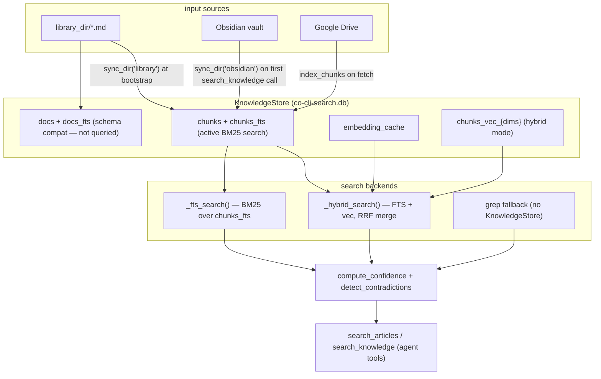

# Co CLI — Library & Knowledge Index Design

## Product Intent

**Goal:** Index and retrieve external knowledge across library articles, Obsidian vaults, and Google Drive using FTS5 and hybrid (FTS + vector) search.
**Functional areas:**
- Article save with URL deduplication and consolidation
- `KnowledgeStore` SQLite schema (FTS5, optional sqlite-vec hybrid)
- Chunk-level indexing and BM25 search over `chunks_fts`
- Hybrid RRF merge of FTS and vector results with optional TEI/LLM reranking
- Confidence scoring and contradiction detection for post-processing
- Cross-source `search_knowledge` tool routing library, Obsidian, and Drive
- Incremental `sync_dir` for library and Obsidian sources
- Drive opportunistic indexing on fetch

**Non-goals:**
- Memory FTS indexing (memories use grep-only recall — see [memory.md](memory.md))
- Real-time sync or file-watch triggers
- Multi-user or concurrent write safety

**Success criteria:** `save_article` deduplicates by `origin_url`; FTS5 returns ranked results from `chunks_fts`; hybrid mode merges FTS + vector via RRF; `search_knowledge` gracefully falls back to grep when `KnowledgeStore` is unavailable.
**Status:** Stable
**Known gaps:** `/memory forget --kind article` unlinks article files but leaves stale entries in `search.db` until the next `sync_dir` run. `SearchResult.tags` is a space-separated string, unlike `MemoryEntry.tags` which is `list[str]`.

---

Covers library article storage, the `KnowledgeStore` SQLite index, all search backends, and the `search_knowledge` cross-source tool. Memory grep recall is in [memory.md](memory.md). Context injection is in [context.md](context.md).

## 1. What & How

Library articles are `.md` files with YAML frontmatter stored in `library_dir`. They are indexed into `KnowledgeStore` (a SQLite database at `knowledge_db_path`) at write time and kept current by `sync_dir`. Obsidian and Drive sources sync lazily or opportunistically.

Search operates at chunk level — documents are split into overlapping chunks, indexed into `chunks_fts` (BM25) and optionally `chunks_vec_{dims}` (vector), then deduplicated to doc level before returning results.



## 2. Core Logic

### 2.1 KnowledgeStore Schema

`KnowledgeStore` opens (or creates) a SQLite database at `knowledge_db_path`. Schema is created on first open; column migrations (`provenance`, `certainty`, `type`, `description`, chunk_id migration) run on every open.

| Table | Role |
| --- | --- |
| `docs` + `docs_fts` | document-level records; retained for schema migration and reset; **not actively queried** in current search paths |
| `chunks` + `chunks_fts` | chunk-level records for library, Obsidian, and Drive sources; active search target |
| `embedding_cache` | embedding blobs keyed by `(provider, model, content_hash)` |
| `docs_vec_{dims}` / `chunks_vec_{dims}` | sqlite-vec virtual tables created in hybrid mode, suffixed by embedding dimension |

`chunks` schema: `(source, doc_path, chunk_index, content, start_line, end_line, hash)` with PK on `(source, doc_path, chunk_index)`.

`chunks_fts`: FTS5 virtual table on `content` with `porter unicode61` tokenizer; content table backed by `chunks`; AI/AD/AU triggers keep them in sync.

**`index(source, path, ...)`** — hash-based skip: no write if existing hash matches. Deletes all existing rows for `(source, path)` before insert. In hybrid mode: embeds `title + "\n" + content` and upserts into `docs_vec_{dims}`.

**`index_chunks(source, doc_path, chunks)`** — raises `ValueError` for `source == "memory"` (memories must never be chunked). Atomically replaces all chunks for `(source, doc_path)`. In hybrid mode: embeds each chunk and inserts into `chunks_vec_{dims}`.

**`remove_stale(source, known_paths)`** — deletes chunks and docs rows where `path NOT IN known_paths` for the given source. Called by `sync_dir` after indexing.

### 2.2 Article Storage

`save_article` is the write entry point for library articles. It deduplicates by exact `origin_url` match, writes a `.md` file, then triggers indexing.

```text
save_article(ctx, content, title, origin_url, tags=None, related=None) -> ToolReturn
  -> dedup check: _find_article_by_url() globs library_dir/*.md
  ->   fast pre-filter: skips files where origin_url string is absent from raw text
  ->   full parse only for candidates
  -> NEW article path:
  ->   id = uuid4(); slug from title; filename = f"{slug}-{id[:6]}.md"  ← 6-char suffix
  ->   frontmatter: kind=article, title, origin_url, decay_protected=True,
  ->                provenance="web-fetch", auto_category=null
  ->   write file; then knowledge_store.index("library", ...) + index_chunks("library", ...)
  -> DUPLICATE URL (consolidate):
  ->   merge tags (set union), update title and fm["updated"]
  ->   rewrite file; then knowledge_store.index + index_chunks for updated content
```

**Chunk parameters** use `config.knowledge.chunk_size` and `config.knowledge.chunk_overlap`. `chunk_text(text, chunk_size, overlap)` estimates token count as `len(text) / 4`, splits at paragraph > line > character boundaries, prepends `overlap * 4` chars of prior chunk to next.

### 2.3 Search Backends

`KnowledgeStore.search(query, *, source, kind, ...) -> list[SearchResult]` routes to the configured backend:

```text
_build_fts_query(query) -> str | None
  -> lowercase, strip non-word/non-hyphen chars per token
  -> filter stopwords (50+ words hardcoded in STOPWORDS)
  -> filter single-character tokens
  -> returns None if no tokens survive (→ returns [] immediately)
  -> otherwise: '"term1" AND "term2" AND ...'

_fts_search(query, source, kind, limit, ...) -> list[SearchResult]
  -> SELECT chunks_fts with BM25; fetch limit * 20 rows (counteract chunk crowding)
  -> score = 1.0 / (1.0 + abs(bm25_rank))  ← normalizes negative BM25 to (0, 1]
  -> post-query tag filtering in Python (FTS5 doesn't support structured tag filters)
  -> deduplicate to doc level: keep highest-scoring chunk per doc_path
  -> call _rerank_results() if reranker configured

_hybrid_search(query, source, kind, limit, ...) -> list[SearchResult]
  -> runs _fts_search + vector similarity over chunks_vec_{dims}
  -> _hybrid_merge(fts_chunks, vec_chunks):
  ->   RRF with k=60 at chunk level, keyed by (path, chunk_index)
  ->   accumulate doc-level scores as sum of contributing chunk RRF scores
  ->   winning chunk (highest chunk RRF) carries its snippet/line info to the doc result
  -> call _rerank_results() if reranker configured
```

**Reranking** — priority: TEI cross-encoder at `cross_encoder_reranker_url` → LLM reranker at `llm_reranker` → none. Called after FTS or hybrid merge.

**`SearchResult`** dataclass fields: `source, kind, path, title, snippet, score, tags` (space-separated string, not list), `category, created, updated, provenance, certainty, confidence, chunk_index, start_line, end_line, type, description`.

### 2.4 Confidence and Contradiction

Post-processing runs on all FTS/hybrid results before returning to the caller.

```text
compute_confidence(path, score, created, provenance, certainty, half_life_days) -> float
  -> 0.5 * score + 0.3 * decay + 0.2 * (prov_weight * certainty_mult)
  -> decay = exp(-ln(2) * age_days / half_life_days)
  -> provenance weights: user-told=1.0, planted=0.8, detected=0.7,
  ->                     session=0.6, web-fetch=0.5, auto_decay=0.3; default 0.5
  -> certainty multipliers: high=1.0, medium=0.8, low=0.6; default 0.8

detect_contradictions(results) -> set[str]
  -> groups results by category; skips groups with < 2 members
  -> pairwise: tokenizes body, looks for shared words appearing near negation markers
  ->   within a 5-token window in either document
  -> returns set of conflicting path strings
  -> heuristic — known false-positive rate; used only for "⚠ Conflict:" prefix annotation
```

Conflicting paths get a `"⚠ Conflict:"` prefix added to their display snippet in `_post_process_knowledge_results()`. Confidence is written to `SearchResult.confidence`.

### 2.5 Cross-Source Search

`search_knowledge` is the unified agent tool spanning library, Obsidian, and Drive.

```text
search_knowledge(ctx, query, *, kind=None, source=None, limit=10, ...) -> ToolReturn
  -> rejects source="memory" with explicit redirect message to use search_memories
  -> if KnowledgeStore is None: grep fallback on library_dir articles only
  ->   (obsidian and drive require FTS — no fallback)
  -> default source scope: ["library", "obsidian", "drive"]
  -> lazy Obsidian sync: if obsidian_vault_path set and source is None or "obsidian":
  ->   sync_dir("obsidian", vault_path) on first search_knowledge call per session
  -> routes to knowledge_store.search(query, source=...) → post-process → return

search_articles(ctx, query, max_results=5, ...) -> ToolReturn
  -> FTS path: knowledge_store.search(query, source="library", kind="article", ...)
  ->   reads frontmatter from file for article_id and origin_url after FTS returns
  -> grep path (no store or grep backend): load_memories(kind="article") +
  ->   filter_memories + content/tag match + recency sort

read_article(ctx, slug) -> ToolReturn
  -> exact slug match first (library_dir/{slug}.md), then prefix match ({slug}*.md)
  -> returns full body; no summarization
```

### 2.6 Sync

`sync_dir(source, directory, glob="**/*.md", kind_filter=None) -> int` provides incremental sync for library and Obsidian sources:

```text
sync_dir(source, directory, ...) -> int
  -> glob all matching files in directory
  -> per file: compute SHA256 hash; skip if hash matches existing DB entry (no write)
  -> for changed/new files: parse frontmatter, call index() + index_chunks()
  ->   note: source="memory" would technically pass sync_dir, but index_chunks raises ValueError
  -> remove_stale(source, all_seen_paths) — removes DB entries for deleted files
  -> returns count of files (re-)indexed
```

Bootstrap (`bootstrap/core.py`) calls `sync_dir("library", library_dir)` at startup. Obsidian sync is lazy (first `search_knowledge` call). Drive files are indexed opportunistically in `read_drive_file()` after each fetch.

## 3. Config

| Setting | Env Var | Default | Description |
| --- | --- | --- | --- |
| `obsidian_vault_path` | `OBSIDIAN_VAULT_PATH` | `None` | optional Obsidian vault path |
| `library_path` | `CO_LIBRARY_PATH` | `None` | override for `library_dir` |
| `knowledge.search_backend` | `CO_KNOWLEDGE_SEARCH_BACKEND` | `hybrid` | `grep`, `fts5`, or `hybrid` |
| `knowledge.embedding_provider` | `CO_KNOWLEDGE_EMBEDDING_PROVIDER` | `tei` | embedding provider |
| `knowledge.embedding_model` | `CO_KNOWLEDGE_EMBEDDING_MODEL` | `embeddinggemma` | embedding model |
| `knowledge.embedding_dims` | `CO_KNOWLEDGE_EMBEDDING_DIMS` | `1024` | embedding dimension |
| `knowledge.embed_api_url` | `CO_KNOWLEDGE_EMBED_API_URL` | `http://127.0.0.1:8283` | embedding service URL |
| `knowledge.cross_encoder_reranker_url` | `CO_KNOWLEDGE_CROSS_ENCODER_RERANKER_URL` | `http://127.0.0.1:8282` | TEI reranker URL |
| `knowledge.llm_reranker` | — | `None` | optional LLM reranker model name |
| `knowledge.chunk_size` | `CO_CLI_KNOWLEDGE_CHUNK_SIZE` | `600` | chunk size in estimated tokens for non-memory sources |
| `knowledge.chunk_overlap` | `CO_CLI_KNOWLEDGE_CHUNK_OVERLAP` | `80` | overlap between consecutive chunks |

## 4. Files

| File | Purpose |
| --- | --- |
| `co_cli/knowledge/_store.py` | `KnowledgeStore`: SQLite schema, incremental indexing, FTS/hybrid search, RRF merge, reranking, `sync_dir`, `remove_stale` |
| `co_cli/knowledge/_chunker.py` | `chunk_text` — paragraph/line/char split with overlap; `Chunk` dataclass |
| `co_cli/knowledge/_ranking.py` | `compute_confidence` — provenance/certainty/decay formula; `detect_contradictions` — heuristic pairwise negation check |
| `co_cli/knowledge/_frontmatter.py` | `parse_frontmatter`, `validate_memory_frontmatter`, `render_memory_file`, enums (shared with memory subsystem) |
| `co_cli/tools/articles.py` | `save_article`, `search_articles`, `read_article`, `search_knowledge` |
| `co_cli/tools/google_drive.py` | Drive fetch with opportunistic `index` + `index_chunks` after each read |
| `co_cli/bootstrap/core.py` | `sync_dir("library", ...)` at startup; knowledge backend discovery and store initialization |
