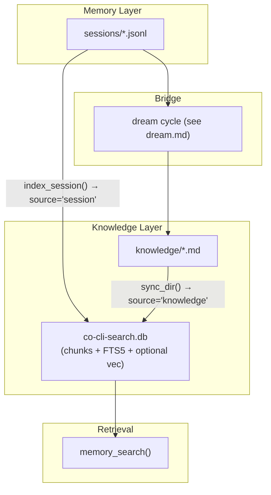

# Co CLI — Knowledge Memory

> Session transcripts: [memory-session.md](memory-session.md). Canon recall: [memory-canon.md](memory-canon.md). Dream-cycle mining, merge, decay, archive: [dream.md](dream.md). Tool registration and approval: [tools.md](tools.md).

## 1. Architecture

Three-channel recall model. `memory_search()` dispatches all channels in parallel. Static personality content (soul seed, mindsets, rules) is injected once at agent construction — it is not a recall channel.

| Channel | Storage | Recall mechanism |
| --- | --- | --- |
| Sessions | `sessions/*.jsonl` → `co-cli-search.db` (`source='session'`) | BM25 chunk search → best chunk per unique session (dedup) → verbatim citations with JSONL line bounds; no LLM |
| Knowledge | `knowledge/*.md` → `co-cli-search.db` (`source='knowledge'`) | FTS5 BM25 ± RRF vector merge → optional reranker → ranked structured rows; no LLM by default |
| Canon | `souls/{role}/memories/*.md` (in-process scan) | Token-overlap scoring (title 2× weight) → ranked snippets; no FTS DB, no LLM |

`MemoryStore` is the shared search backend for sessions and knowledge artifacts. `memory_search()` in `co_cli/tools/memory/recall.py` dispatches all three channels.



## 2. Knowledge Artifacts

Knowledge artifacts are reusable facts the agent recalls across sessions: user, rule, article, and note kinds.

Storage is dual-layer:

| Layer | What lives there | Purpose |
| --- | --- | --- |
| `knowledge_dir/*.md` | YAML frontmatter + body text | Source of truth; human-editable |
| `co-cli-search.db` | `chunks`, `chunks_fts`, optional `chunks_vec`, `docs` | Derived retrieval layer |

`sync_dir()` keeps the DB current: parses frontmatter, SHA256 hash-skips unchanged files, chunks body text, and writes to `chunks`/`chunks_fts`. Obsidian and Drive connectors index under `source='obsidian'`/`source='drive'`.

Knowledge artifact schema:

| Field | Purpose |
| --- | --- |
| `id` | Stable UUID |
| `artifact_kind` | `user`, `rule`, `article`, or `note` |
| `title` | Human-readable label |
| `description` | Short retrieval summary |
| `created` | ISO8601 creation timestamp |
| `updated` | ISO8601 last-modified timestamp |
| `related` | Soft links to related artifacts |
| `source_type` | `detected`, `web_fetch`, `manual`, `obsidian`, `drive`, or `consolidated` |
| `source_ref` | Pointer to source session, URL, file path, or artifact ID |
| `certainty` | `high`, `medium`, or `low` |
| `decay_protected` | Lifecycle protection flag; decay semantics live in [dream.md](dream.md) |
| `last_recalled` | Most recent recall timestamp |
| `recall_count` | Recall hit counter |

RAG pipeline for artifact recall:

```text
MemoryStore.search(query, sources=['knowledge']):
    fts_chunks = FTS5 BM25 over chunks_fts
    if hybrid:
        vec_chunks = cosine search over chunks_vec
        merged = RRF(fts_chunks, vec_chunks)   # k=60
    else:
        merged = fts_chunks
    return _rerank_results(query, merged, limit)
```

Backends degrade in this order:

| Backend | Mechanism | When used |
| --- | --- | --- |
| `hybrid` | FTS5 BM25 + sqlite-vec cosine, RRF merge | Embedding provider available |
| `fts5` | BM25 over chunked text only | Embeddings unavailable |
| `grep` | In-memory substring match over loaded markdown | MemoryStore unavailable |

Optional rerankers (applied after merge, before limit): TEI cross-encoder (`cross_encoder_reranker_url`) takes priority; LLM listwise (`llm_reranker`) as fallback; neither = pass-through.

Result shape: `{channel: "artifacts", kind, title, snippet, score, path, slug}`

Knowledge commands:

| Command | Purpose |
| --- | --- |
| `/knowledge list [query] [flags]` | List matching artifacts |
| `/knowledge count [query] [flags]` | Count matching artifacts |
| `/knowledge forget <query> [flags]` | Delete matching active artifacts after confirmation |

Dream lifecycle commands (`/knowledge dream`, `/knowledge restore`, `/knowledge decay-review`, `/knowledge stats`) live in [dream.md](dream.md). `/memory` is a deprecated alias for `list`, `count`, and `forget`.

## 3. Knowledge Recall Path

`memory_search()` is the single entry point for all recall. Two modes:

**Empty query → recent-sessions browse** — returns session metadata with no search, no FTS, no LLM.

**Keyword query → three-channel parallel dispatch:**

```
memory_search(ctx, query, kinds, limit)             # tools/memory/recall.py
  └─ asyncio.gather(
       ├─ _search_artifacts(ctx, query, kinds, limit)
       │    ├─ [store available]
       │    │    MemoryStore.search(query, sources=['knowledge'], kinds, limit)
       │    │      ├─ FTS5 BM25 over chunks_fts
       │    │      ├─ [hybrid] embed(query) → cosine over chunks_vec → RRF merge (k=60)
       │    │      └─ _rerank_results(query, merged, limit)
       │    │           ├─ [tei] cross-encoder HTTP rerank
       │    │           └─ [llm] listwise rerank
       │    └─ [store unavailable]
       │         load_knowledge_artifacts() → grep_recall()     # in-memory substring fallback
       │
       ├─ _search_sessions(ctx, query, span)
       │    └─ MemoryStore.search(query, sources=['session'], limit=15)
       │         └─ dedup to 3 unique sessions (_SESSIONS_CHANNEL_CAP); excludes current session
       │
       └─ _search_canon_channel(ctx, query)
            └─ search_canon(query, role, limit)     # tools/memory/_canon_recall.py
                 └─ token-overlap scoring over souls/{role}/memories/*.md
     )
  └─ merge channels → format and return flat result list
```

All three channels run concurrently. Results carry a `channel` field (`artifacts`, `sessions`, `canon`); scores are not cross-comparable across channels.

Artifact hits return `{channel, kind, title, snippet, score, path, slug}`. Full body requires a follow-up `file_read` on `path`. Session hits return chunk citations `{channel, session_id, when, chunk_text, start_line, end_line, score}`; verbatim turns require `memory_read_session_turn(session_id, start_line, end_line)`. Canon hits return full body inline — no follow-up needed.

## 4. Knowledge Write Paths

Knowledge accumulates through two paths:

1. **`memory_create`** — agent calls during a turn when it recognizes a durable signal. Three dispatch paths in `save_artifact()`:
   - `source_url` set → URL-keyed dedup (web articles); `decay_protected` forced True
   - `consolidation_enabled` → Jaccard dedup; near-identical (>0.9) skipped, overlapping merged
   - else → straight create

2. **`memory_modify`** — append content or surgically replace a passage in an existing artifact. Guards: rejects Read-tool line-number prefixes; for `replace`, target must appear exactly once.

3. **Dream cycle** — at session end when `consolidation_enabled=true`, retrospectively mines past transcripts. See [dream.md](dream.md).

Artifact writes use `_atomic_write()` (temp-file + `os.replace`) and trigger inline reindex via `MemoryStore.index()` + `index_chunks()`.

Archive/restore: `archive_artifacts()` moves files to `knowledge_dir/_archive/` and removes them from the FTS index; `restore_artifact()` moves them back and re-indexes. The `_archive/` subdir is never traversed by the default loaders.

## 5. Design Lineage

Peer product survey: [docs/reference/RESEARCH-memory-peer-for-co-second-brain.md](../reference/RESEARCH-memory-peer-for-co-second-brain.md).

| Component | Peer source | co_cli location |
| --- | --- | --- |
| Chunked session recall pipeline | `openclaw` | `session_chunker.py`, `MemoryStore.index_session()` |
| BM25 + vector hybrid via RRF | `openclaw` | `MemoryStore._hybrid_search()` |
| Optional cross-encoder / LLM rerank | `openclaw` | `MemoryStore._rerank_results()` |
| Temporal decay | `openclaw` | `co_cli/memory/decay.py` |
| File-based local memory + kind taxonomy | `ReMe` | `knowledge_dir/*.md` + `artifact_kind` field |
| Pre-reasoning on-demand recall | `ReMe` | `memory_search()` tool surface |

Standard RAG primitives (`chunk_size=600 + chunk_overlap=80`, `tokenize='porter unicode61'`) are not peer-specific.

## 6. Config

| Setting | Env Var | Default | Description |
| --- | --- | --- | --- |
| `knowledge.search_backend` | `CO_KNOWLEDGE_SEARCH_BACKEND` | `hybrid` | preferred retrieval backend before runtime degradation |
| `knowledge.embedding_provider` | `CO_KNOWLEDGE_EMBEDDING_PROVIDER` | `tei` | embedding backend (`ollama`, `gemini`, `tei`, `none`) |
| `knowledge.embedding_model` | `CO_KNOWLEDGE_EMBEDDING_MODEL` | `embeddinggemma` | embedding model name |
| `knowledge.embedding_dims` | `CO_KNOWLEDGE_EMBEDDING_DIMS` | `1024` | embedding vector dimensions |
| `knowledge.embed_api_url` | `CO_KNOWLEDGE_EMBED_API_URL` | `http://127.0.0.1:8283` | embedding service URL |
| `knowledge.cross_encoder_reranker_url` | `CO_KNOWLEDGE_CROSS_ENCODER_RERANKER_URL` | `http://127.0.0.1:8282` | TEI cross-encoder reranker URL |
| `knowledge.tei_rerank_batch_size` | *(no env var)* | `50` | batch size for TEI cross-encoder rerank HTTP requests |
| `knowledge.llm_reranker` | *(no env var)* | `null` | LLM reranker config `{provider, model}` (`ollama` or `gemini`) |
| `knowledge.chunk_size` | `CO_KNOWLEDGE_CHUNK_SIZE` | `600` | artifact chunk size in chars during indexing |
| `knowledge.chunk_overlap` | `CO_KNOWLEDGE_CHUNK_OVERLAP` | `80` | artifact chunk overlap in chars |
| `knowledge.consolidation_enabled` | `CO_KNOWLEDGE_CONSOLIDATION_ENABLED` | `false` | enable Jaccard dedup on artifact writes |
| `knowledge.consolidation_trigger` | *(no env var)* | `session_end` | when consolidation runs: `session_end` or `manual` |
| `knowledge.consolidation_lookback_sessions` | *(no env var)* | `5` | past sessions to mine during consolidation |
| `knowledge.consolidation_similarity_threshold` | *(no env var)* | `0.75` | Jaccard score threshold for artifact dedup/merge |
| `knowledge.max_artifact_count` | *(no env var)* | `300` | soft cap on total artifact count |
| `knowledge.decay_after_days` | `CO_KNOWLEDGE_DECAY_AFTER_DAYS` | `90` | days before an artifact becomes eligible for decay |
| `knowledge.character_recall_limit` | `CO_CHARACTER_RECALL_LIMIT` | `3` | max canon snippets returned by the canon recall channel |
| `knowledge.session_chunk_tokens` | `CO_KNOWLEDGE_SESSION_CHUNK_TOKENS` | `400` | token budget per session chunk during session indexing |
| `knowledge.session_chunk_overlap` | `CO_KNOWLEDGE_SESSION_CHUNK_OVERLAP` | `80` | token overlap between adjacent session chunks |

Dream-cycle and lifecycle maintenance settings live in [dream.md](dream.md).

### Paths

| Path | Env Var | Default | Description |
| --- | --- | --- | --- |
| `knowledge_path` | `CO_KNOWLEDGE_PATH` | `~/.co-cli/knowledge/` | source-of-truth knowledge artifact directory |
| `memory_db_path` | — | `~/.co-cli/co-cli-search.db` | unified retrieval DB (shared with session chunks) |

## 7. Files

| File | Purpose |
| --- | --- |
| `co_cli/memory/memory_store.py` | `MemoryStore` — unified FTS5/hybrid search backend, `sync_dir()`, `index_session()`, `sync_sessions()` |
| `co_cli/memory/artifact.py` | `KnowledgeArtifact` schema, kind enums, and artifact loaders |
| `co_cli/memory/service.py` | pure-function write layer: `save_artifact()`, `mutate_artifact()` — no RunContext |
| `co_cli/memory/mutator.py` | `_atomic_write()`, `_reindex_knowledge_file()`, `_update_artifact_body()` — atomic write and RunContext-aware re-index helpers |
| `co_cli/memory/archive.py` | `archive_artifacts()`, `restore_artifact()` — move to/from `_archive/`, de-index and re-index |
| `co_cli/memory/chunker.py` | knowledge artifact text chunking |
| `co_cli/memory/frontmatter.py` | frontmatter parse, validate, and render helpers |
| `co_cli/memory/similarity.py` | Jaccard similarity and content-superset helpers for artifact dedup |
| `co_cli/memory/ranking.py` | confidence scoring and contradiction helpers |
| `co_cli/memory/query.py` | artifact list filtering (`older_than_days`) and display formatting |
| `co_cli/memory/search_util.py` | `normalize_bm25()`, `run_fts()`, `sanitize_fts5_query()`, `snippet_around()` — FTS5 utilities shared by `MemoryStore` |
| `co_cli/memory/_embedder.py` | `build_embedder()` — embedding provider dispatch (ollama/gemini/tei/none) |
| `co_cli/memory/_reranker.py` | `build_llm_reranker()` — LLM listwise reranker dispatch (ollama/gemini) |
| `co_cli/memory/_stopwords.py` | `STOPWORDS` frozenset — shared by `similarity.py` and `_canon_recall.py` |
| `co_cli/memory/decay.py` | artifact decay scoring and eligibility logic |
| `co_cli/memory/dream.py` | dream-cycle orchestration (see [dream.md](dream.md)) |
| `co_cli/tools/memory/recall.py` | `memory_search()` — unified recall tool dispatching sessions, artifacts, and canon |
| `co_cli/tools/memory/read.py` | `memory_list()`, `grep_recall()`, `memory_read_session_turn()` |
| `co_cli/tools/memory/write.py` | `memory_create()`, `memory_modify()` |
| `co_cli/commands/knowledge.py` | `_cmd_knowledge`, `_cmd_memory` — `/knowledge` and `/memory` (deprecated) command handlers |
| `co_cli/commands/core.py` | slash-command registry and dispatcher (`BUILTIN_COMMANDS`, `dispatch()`) |

## 8. Test Gates

| Property | Test file |
| --- | --- |
| FTS5 search finds an indexed artifact entry | `tests/test_flow_memory_search.py` |
| `mutate_artifact` replace preserves frontmatter | `tests/test_flow_memory_lifecycle.py` |
| `mutate_artifact` append adds to body | `tests/test_flow_memory_lifecycle.py` |
