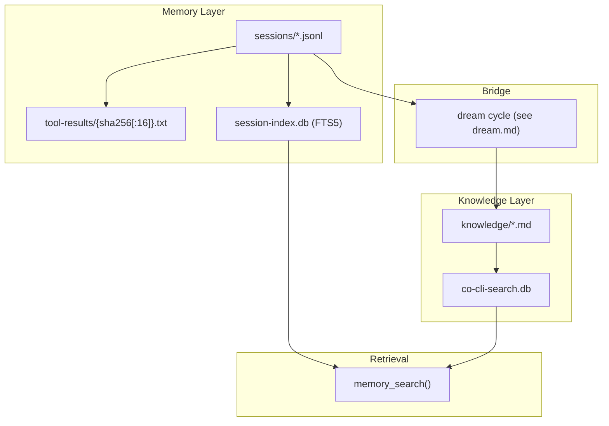

# Co CLI — Memory & Knowledge

## Product Intent

**Goal:** Own the full persistent cognition surface: session transcripts as raw memory, the derived transcript index for episodic recall, the reusable knowledge store, and the dream-cycle bridge between them.

**Functional areas:**
- Session transcripts, transcript branching, and session lifecycle commands
- Oversized tool-result spill files and transcript placeholders
- Derived transcript index (`session-index.db`) and episodic `memory_search()`
- Reusable knowledge artifacts on disk plus the derived retrieval DB
- Turn-time recall, explicit search, and lifecycle handoff to dreaming

**Non-goals:**
- Multi-user or concurrent-write safety
- Media ingestion pipelines
- Provider-side memory or server-managed context
- Automatic TTL/pruning for session transcripts or spilled tool results

**Success criteria:** Raw chronology is preserved in append-only transcripts; episodic recall routes through the transcript index; reusable recall routes through the knowledge layer; history replacement branches to child transcripts instead of rewriting parents; agent-explicit `memory_create` and the dream lifecycle keep reusable knowledge current.

**Status:** Stable. Memory is the session transcript layer plus a derived FTS5 session index. Knowledge is the reusable artifact layer in `knowledge_dir/*.md` plus the derived search DB. Dream-cycle details live in [dream.md](dream.md).

**Known gaps:** No concurrent-instance safety around transcript writes. A second `co chat` in the same user home can race session persistence. Deferred.

---

This spec defines how `co-cli` stores raw memory, derives episodic recall from it, promotes durable facts into knowledge, and maintains that knowledge over time. Startup sequencing lives in [bootstrap.md](bootstrap.md). Turn orchestration lives in [core-loop.md](core-loop.md). Prompt assembly and per-turn recall injection live in [prompt-assembly.md](prompt-assembly.md). Compaction mechanics live in [compaction.md](compaction.md). Dream-cycle mining, merge, decay, archive, and state live in [dream.md](dream.md). Tool registration and approval live in [tools.md](tools.md).

## 1. What & How

`co-cli` has three recall channels plus one directional bridge:

- **T0 (context)** is the static personality-context channel — curated knowledge artifacts tagged `personality-context` are loaded once at agent construction and injected into the prefix-cached system prompt. No query path; no FTS; no LLM in the recall route.
- **T1 (session)** is the raw episodic timeline — append-only JSONL transcripts under `sessions/`, indexed by FTS5. Recall synthesizes a truncated transcript window into prose via a noreason LLM summarizer.
- **T2 (knowledge)** is every reusable artifact the agent should recall on demand — markdown files under `knowledge/`, indexed by FTS5 and optional vector hybrid. Recall returns ranked structured rows; no LLM in the default path.
- **Bridge** is agent-explicit `memory_create` calls during a turn, and the optional dream cycle which retrospectively mines past transcripts. Dream-cycle details live in [dream.md](dream.md).



Three-channel overview:

| Channel | Storage | Post-FTS recall synthesis |
| --- | --- | --- |
| T0 (context) | `knowledge/*.md` tagged `personality-context` | None — full artifacts injected into the static system prompt at construction; prefix-cache stable; no query |
| T1 (session) | `sessions/*.jsonl` → `session-index.db` FTS5 | FTS5 BM25 → best-per-session dedup → 100K-char window → **parallel noreason LLM summarization** → prose summaries |
| T2 (knowledge) | `knowledge/*.md` → `co-cli-search.db` FTS5 + optional vectors | FTS5 BM25 (± RRF vector merge) → ranked chunks → optional reranker → **structured rows; no LLM by default** |

## 2. Core Logic

### 2.1 Memory Layer: Session Transcripts

Session transcripts are append-only JSONL files under `sessions_dir` with lexicographically sortable filenames:

```text
YYYY-MM-DD-THHMMSSZ-{uuid8}.jsonl
```

The timestamp prefix makes lexicographic order match chronological order; the 8-char UUID suffix is the display/session ID reused in telemetry.

Each JSONL line is one of:

- a message row serialized through `ModelMessagesTypeAdapter`
- a `session_meta` control row written at the start of a branched child transcript
- a legacy `compact_boundary` control row, still honored on load for older transcripts

`persist_session_history()` is the only transcript persistence primitive:

```text
if history was replaced OR persisted_message_count > len(messages):
    new_path = new_session_path(sessions_dir)
    write session_meta(parent_session=<old filename>, reason=<reason>)
    append full compacted history to new_path
    return new_path
else:
    append only messages[persisted_message_count:]
    return existing session_path
```

Behavioral rules:

- Individual transcript files are never rewritten or truncated.
- History replacement never mutates the parent transcript; it branches to a child transcript.
- `CoSessionState.persisted_message_count` is the only durability cursor. Nothing is inferred from file size or mtime.
- `load_transcript()` skips malformed lines and `session_meta` rows, honors `compact_boundary` skips for files above 5 MB, and refuses to load transcripts above 50 MB.

### 2.2 Session Lifecycle, Commands, And Spill Files

Startup restore is path-only. `restore_session()` picks the latest `*.jsonl` by filename and sets `deps.session.session_path`, but `_chat_loop()` still begins with empty in-memory `message_history`. Resuming history is explicit.

Session command behavior:

| Command | Behavior |
| --- | --- |
| `/resume` | Uses `list_sessions()` + interactive picker, then `load_transcript(selected.path)`. On success, adopts that history and sets `deps.session.session_path` to the selected file. |
| `/new` | If history is empty, prints “Nothing to rotate”. Otherwise assigns a fresh `session_path` and replaces in-memory history with `[]`. |
| `/clear` | Replaces in-memory history with `[]`. Existing transcript files are untouched. |
| `/compact` | Replaces in-memory history with a compacted transcript; persistence then branches to a child session on the next write path. |
| `/sessions [keyword]` | Lists session summaries from `sessions_dir`, optionally filtered by title substring. |

Oversized tool results never need to stay inline in the transcript. `tool_output()` checks the effective threshold:

- `ToolInfo.max_result_size` when the tool defines one
- otherwise `config.tools.result_persist_chars`

If the display string exceeds that threshold, `persist_if_oversized()` writes the full text to:

```text
tool-results/{sha256[:16]}.txt
```

The model sees a `<persisted-output>` placeholder containing:

- tool name
- file path
- total size
- a 2,000-char preview
- guidance to page the full file by line range

Spill files are content-addressed and idempotent: identical content reuses the same filename. There is no TTL or automatic cleanup; `check_tool_results_size()` only warns when the directory exceeds a size threshold.

Security constraints:

- Session paths are internally generated from timestamps and UUIDs.
- `/resume` uses a picker; there is no free-form transcript-path argument.
- Session files and spilled tool-result files are `chmod 0o600`.

Telemetry note:

- The session short ID (`session_path.stem[-8:]`) is attached to spans and run metadata.
- Forked sub-agent deps inherit shared services but start with a fresh empty `session_path`, so their traces are attributable but not persisted into the parent transcript file.

### 2.3 T0 Channel: Personality Context

T0 is the static context channel. It is not a query-time recall path — it is a one-time unconditional load at agent construction.

`load_personality_memories()` in `co_cli/personality/prompts/loader.py` scans the knowledge artifact index for files tagged `personality-context`. Those artifacts are injected verbatim into the static system prompt by `build_static_instructions()` in `co_cli/context/assembly.py`.

Properties:

- **No query**: T0 loads unconditionally; no FTS search runs and no `memory_search()` call is issued.
- **Prefix-cache stable**: the T0 block is placed in the static prompt prefix, before all dynamic content, keeping the prefix-cache hit rate high across turns.
- **Session-restart required**: edits to T0 artifacts take effect only after a new `co chat` session.
- **Storage shared with T2**: T0 artifacts live in `knowledge/*.md` alongside all other knowledge artifacts; the `personality-context` tag routes them to the static prompt instead of the T2 query path at runtime.

The dynamic-instructions block (`date_prompt()` in `co_cli/agent/_instructions.py`) is intentionally kept to a small volatile suffix — today's date plus conditional safety warnings — so the stable T0 static prefix remains cache-stable across turns.

### 2.4 T1 Channel: Episodic Session Recall

Raw transcripts are Memory; `session-index.db` is a derived search structure over them.

`SessionStore` stores:

- one `sessions` row per transcript file
- one `messages` row per extracted user/assistant text fragment
- an FTS5 virtual table (`messages_fts`) maintained by triggers

Indexing rules:

- `init_session_store()` runs during bootstrap.
- `sync_sessions()` scans `sessions_dir`, skipping the current `session_path`.
- Change detection is file-size-based because transcripts are append-only.
- Reindexing deletes and reinserts message rows for that session ID.

`memory_search()` is the unified recall tool. It dispatches T1 and T2 queries in parallel for keyword searches. It operates in two modes:

**Browse mode** (empty query): returns recent-session metadata — session ID, date, title, file size — with zero LLM cost. Excludes the current session from results. Use when the user asks what was worked on recently or wants to browse session history.

**Search mode** (keyword query): dispatches T1, T2, and canon in parallel. **T1 post-FTS synthesis — LLM summarization:** FTS5 BM25 search over `messages_fts` → dedup to best-ranked message per session → top 3 sessions (hard cap: `_T1_SESSION_CAP=3`) → load each full JSONL → truncate to a 100,000-char window around the match anchor → parallel noreason LLM summarization → per-session prose summaries. Summarization runs under a 60-second global `asyncio.timeout`; each individual call retries up to 3 times with linear backoff on transient errors or empty responses; the pre-computed truncated window is the raw-preview fallback on failure. T2 dispatch and its synthesis are described in §2.5. **Canon channel:** globs `souls/{active_role}/memories/*.md`, scores by token overlap (title stem 2× weight), returns up to `config.knowledge.character_recall_limit` (default 3) hits — no FTS DB, no LLM. Only runs when a personality is active; role is read from config, not from the caller.

Truncation uses a three-tier match strategy to find the best window anchor: (1) full-phrase match, (2) proximity co-occurrence of all query terms within 200 characters, (3) individual term positions as last resort. The window is placed to cover the most match positions, biased 25% before / 75% after the chosen anchor.

Result shape: flat list with a `tier` discriminator. T1 entries: `{tier: "sessions", session_id, when, source, summary}` — prose summaries. T2 entries: `{tier: "artifacts", kind, title, snippet, score, path, slug}` — ranked structured rows. Canon entries: `{tier: "canon", role, title, snippet, score, path, slug}` — on-demand character memory hits. Scores are NOT cross-comparable across tiers.

Tracer span attributes set on every call: `memory.summarizer.runs`, `memory.summarizer.failures`, `memory.summarizer.timed_out`.

Important current behavior:

- The active session is excluded from the bootstrap sync.
- There is no shutdown reindex pass.
- In practice, episodic search covers transcripts that have already been indexed during a prior bootstrap, not the live in-progress session.

### 2.5 T2 Channel: Knowledge Artifacts

Knowledge is every reusable artifact the agent should recall across sessions: preferences, decisions, rules, feedback, articles, references, and notes.

Storage is dual-layer:

| Layer | What lives there | Purpose |
| --- | --- | --- |
| `knowledge_dir/*.md` | YAML frontmatter + body text | Source of truth; human-editable and agent-readable |
| `co-cli-search.db` | chunk/index tables, FTS5, optional vectors, metadata | Derived retrieval layer; all search hits query the DB, not raw files |

`sync_dir()` keeps the derived DB current from disk. On bootstrap and after writes, artifacts are chunked and indexed under `source="knowledge"` (plus optional Obsidian/Drive sources when those connectors are present).

Knowledge artifact schema:

| Field | Purpose |
| --- | --- |
| `id` | Stable UUID |
| `kind` | Always `knowledge` |
| `artifact_kind` | `preference`, `decision`, `rule`, `feedback`, `article`, `reference`, or `note` |
| `title` | Human-readable label |
| `description` | Short retrieval summary |
| `created` | ISO8601 creation timestamp |
| `updated` | ISO8601 last-modified timestamp |
| `tags` | Retrieval/organization labels |
| `related` | Soft links to related artifacts |
| `source_type` | `detected`, `web_fetch`, `manual`, `obsidian`, `drive`, or `consolidated` |
| `source_ref` | Pointer to source session, URL, file path, or artifact ID |
| `certainty` | `high`, `medium`, or `low` |
| `decay_protected` | Lifecycle protection flag; dream merge/decay semantics live in [dream.md](dream.md) |
| `last_recalled` | Most recent recall timestamp |
| `recall_count` | Recall hit counter |

T2 recall is on-demand. `memory_search()` covers both T2 knowledge artifacts and T1 session transcripts in a single call. The agent decides when to call it; the tool description coaches proactive use for all recall tasks — saved preferences, past conversations, project conventions, and saved articles. The `kind` parameter narrows T2 results by `artifact_kind`.

**T2 post-FTS synthesis — ranked structured rows.** Unlike T1, T2 recall returns structured chunk rows directly — no LLM in the default path. BM25 and optional vector scores are merged via RRF; an optional cross-encoder or LLM reranker (`cross_encoder_reranker_url`) can re-score the top-N results when configured. T2 result shape: `{tier: "artifacts", kind, title, snippet, score, path, slug}`.

T2 search backends degrade in this order:

| Backend | Mechanism | When used |
| --- | --- | --- |
| `hybrid` | FTS5 + vector search + merged ranking | Embeddings are available |
| `fts5` | BM25 over chunked text | Embeddings unavailable |
| `grep` | In-memory substring match over loaded markdown | KnowledgeStore unavailable |

The main reusable-artifact commands owned by this spec are:

| Command | Purpose |
| --- | --- |
| `/knowledge list [query] [flags]` | List matching artifacts |
| `/knowledge count [query] [flags]` | Count matching artifacts |
| `/knowledge forget <query> [flags]` | Delete matching active artifacts after confirmation |

Dream lifecycle commands (`/knowledge dream`, `/knowledge restore`, `/knowledge decay-review`, `/knowledge stats`) live in [dream.md](dream.md).

`/memory` is still present as a deprecated alias for `list`, `count`, and `forget`.

### 2.6 Memory -> Knowledge Bridge: Agent-Explicit Writes and Dream

There is no online per-turn extraction. Knowledge accumulates through two paths:

1. **Agent-explicit `memory_create`** — the agent calls `memory_create(...)` at any point during a turn when it recognizes a durable signal worth preserving. This is the primary in-session write path and is always available.

2. **Dream cycle** — at session end (when `knowledge.consolidation_enabled=true`), the dream cycle retrospectively mines past transcripts and writes new artifacts. See [dream.md](dream.md) for the full lifecycle.

### 2.7 Dream Lifecycle Handoff

Dream-cycle semantics live in [dream.md](dream.md). This spec only owns the handoff: transcripts remain append-only read inputs, active knowledge remains markdown plus a derived search index, and any dream-cycle artifact writes or archives must preserve those source-of-truth boundaries.

The dream cycle is not part of turn-time recall or in-turn knowledge writes. It is a separate lifecycle pass over the same Memory and Knowledge stores.

### 2.8 Design Lineage

The T1 and T2 retrieval pipelines are not original — they trace to specific peer systems. Recording the lineage here so future work knows which peer to consult before changing retrieval mechanics. Peer product survey: [docs/reference/RESEARCH-memory-peer-for-co-second-brain.md](../reference/RESEARCH-memory-peer-for-co-second-brain.md). Open porting gaps and cheap-borrow candidates: [docs/exec-plans/active/2026-04-29-143000-memory-recall-gap-backlog.md](../exec-plans/active/2026-04-29-143000-memory-recall-gap-backlog.md).

**T1 (session transcripts) — direct port from `hermes-agent`.**

`co_cli/memory/summary.py:4` docstring states this explicitly: *"Ported from hermes-agent session_search_tool.py with adaptations for pydantic-ai message types."* `recall.py:33` reinforces it: the 60s `_SUMMARIZATION_TIMEOUT_SECS` is sized for *"hermes-style LLM summarization"*. Mechanism, magic numbers, and pipeline shape are preserved line-for-line:

| Mechanism | hermes-agent (`tools/session_search_tool.py`) | co_cli |
| --- | --- | --- |
| Pipeline | FTS5 → top-K → 100K-char window → parallel LLM summarization | identical |
| `MAX_SESSION_CHARS` | `100_000` | `100_000` (`summary.py:32`) |
| Session cap | default 3 | hard cap 3 (`recall.py:_T1_SESSION_CAP`) |
| Summarizer timeout | 60s | 60s (`recall.py:_SUMMARIZATION_TIMEOUT_SECS`) |
| `_truncate_around_matches` | three-tier match strategy, 25%/75% bias | identical (`summary.py:85`) |
| Summarizer model | Gemini Flash | local noreason model (only adaptation) |

Implication: changes to T1 retrieval should consult the hermes implementation first; deviations from it are intentional adaptations, not opportunistic cleanup.

**T2 (knowledge artifacts) — retrieval mechanics from `openclaw`, product shape from `ReMe`.**

Two distinct peers contributed two distinct layers:

| Component | Peer source | co_cli location |
| --- | --- | --- |
| BM25 + vector hybrid via RRF | `openclaw` `extensions/memory-core/src/memory/hybrid.ts:57-155` | `_hybrid_search()` (`knowledge_store.py`) |
| Optional cross-encoder / LLM rerank | `openclaw` MMR-style rerank | `_rerank_results()` (`knowledge_store.py`) |
| Temporal decay | `openclaw` decay/recency policy | `co_cli/memory/decay.py` |
| File-based local memory + memory classes (kind taxonomy) | `ReMe` (`reme/memory/file_based/`) | `knowledge_dir/*.md` + `artifact_kind` field |
| Pre-reasoning, on-demand recall (no always-inject) | `ReMe` retrieval discipline | `memory_search()` tool surface |

Standard RAG primitives are not peer-specific and should not be attributed: `chunk_size=600 + chunk_overlap=80` is the LangChain/LlamaIndex default, and `tokenize='porter unicode61'` is the idiomatic SQLite FTS5 recipe shared by both T1 and T2.

Implication: changes to T2 ranking should consult `openclaw`; changes to T2 storage shape or artifact taxonomy should consult `ReMe`.

## 3. Config

### Memory Settings

| Setting | Env Var | Default | Description |
| --- | --- | --- | --- |
| `memory.recall_half_life_days` | `CO_MEMORY_RECALL_HALF_LIFE_DAYS` | `30` | age-decay parameter used in recall scoring |

### Knowledge Settings

| Setting | Env Var | Default | Description |
| --- | --- | --- | --- |
| `knowledge.search_backend` | `CO_KNOWLEDGE_SEARCH_BACKEND` | `hybrid` | preferred retrieval backend before runtime degradation |
| `knowledge.embedding_provider` | `CO_KNOWLEDGE_EMBEDDING_PROVIDER` | `tei` | embedding backend for hybrid search |
| `knowledge.embedding_model` | `CO_KNOWLEDGE_EMBEDDING_MODEL` | `embeddinggemma` | embedding model name |
| `knowledge.embedding_dims` | `CO_KNOWLEDGE_EMBEDDING_DIMS` | `1024` | embedding vector dimensions |
| `knowledge.embed_api_url` | `CO_KNOWLEDGE_EMBED_API_URL` | `http://127.0.0.1:8283` | embedding service URL |
| `knowledge.cross_encoder_reranker_url` | `CO_KNOWLEDGE_CROSS_ENCODER_RERANKER_URL` | `http://127.0.0.1:8282` | TEI reranker URL |
| `knowledge.chunk_size` | `CO_KNOWLEDGE_CHUNK_SIZE` | `600` | chunk size used during indexing |
| `knowledge.chunk_overlap` | `CO_KNOWLEDGE_CHUNK_OVERLAP` | `80` | chunk overlap used during indexing |
| `knowledge.character_recall_limit` | `CO_CHARACTER_RECALL_LIMIT` | `3` | max canon hits returned per `memory_search` call |

Dream-cycle and lifecycle maintenance settings, including consolidation trigger, lookback, merge threshold, artifact soft cap, and decay age, live in [dream.md](dream.md).

### Paths

| Path | Env Var | Default | Description |
| --- | --- | --- | --- |
| `knowledge_path` | `CO_KNOWLEDGE_PATH` | `~/.co-cli/knowledge/` | source-of-truth knowledge artifact directory |
| `sessions_dir` | — | `~/.co-cli/sessions/` | user-global transcript directory, resolved onto `CoDeps` |
| `tool_results_dir` | — | `~/.co-cli/tool-results/` | user-global spill directory for oversized tool results |
| `knowledge_db_path` | — | `~/.co-cli/co-cli-search.db` | derived retrieval DB for knowledge |
| session index DB | — | `~/.co-cli/session-index.db` | derived FTS5 DB for episodic transcript recall |

## 4. Files

| File | Purpose |
| --- | --- |
| `co_cli/memory/session.py` | session filename parsing/generation and latest-session discovery |
| `co_cli/memory/transcript.py` | transcript append/load logic, child-session branching, and control records |
| `co_cli/memory/session_browser.py` | lightweight session listing and picker metadata for `/resume` and `/sessions` |
| `co_cli/tools/tool_io.py` | oversized tool-result spill, preview placeholders, and size warnings |
| `co_cli/memory/session_store.py` | `SessionStore` — derived FTS5 index over past session transcripts |
| `co_cli/memory/indexer.py` | `extract_messages()` — JSONL line parser that feeds `SessionStore.index_session()` |
| `co_cli/memory/summary.py` | `_format_conversation()`, `_truncate_around_matches()`, and `summarize_session_around_query()` — transcript formatting, window extraction, and noreason LLM summarization pipeline |
| `co_cli/memory/prompts/session_summarizer.md` | Summarizer prompt template for the noreason summarization agent |
| `co_cli/tools/memory/recall.py` | `memory_search()` unified recall tool — T1, T2, and canon channels |
| `co_cli/tools/memory/_canon_recall.py` | `search_canon()` — canon channel: globs `souls/{role}/memories/*.md`, token-overlap scoring, title 2× weight |
| `co_cli/memory/artifact.py` | `KnowledgeArtifact` schema and artifact loaders |
| `co_cli/memory/knowledge_store.py` | `KnowledgeStore` indexing/search backend and `sync_dir()` |
| `co_cli/memory/frontmatter.py` | frontmatter parse/validate/render helpers |
| `co_cli/memory/chunker.py` | chunking for indexed artifact text |
| `co_cli/memory/ranking.py` | confidence scoring and contradiction helpers |
| `co_cli/memory/similarity.py` | similarity and dedup helpers |
| `co_cli/memory/_window.py` | transcript-window builder used by dream mining |
| `co_cli/memory/service.py` | pure-function service layer for knowledge artifact writes; `save_artifact()` and `mutate_artifact()` — no RunContext |
| `co_cli/tools/memory/read.py` | `memory_list()` and `memory_read()` — list/retrieve knowledge artifacts; `grep_recall()` utility used by `memory_search()` |
| `co_cli/tools/memory/write.py` | artifact write/update/append helpers and article persistence |
| `co_cli/bootstrap/core.py` | `restore_session()` and `init_session_store()` during startup |
| `co_cli/agent/_instructions.py` | `date_prompt()` — thin wrapper that delegates to `recall_prompt_text()` in `prompt_text.py`; returns today's date string |
| `co_cli/context/prompt_text.py` | `recall_prompt_text()` — per-turn dynamic instruction; returns today's date only (personality memories are in static prompt; knowledge recall is on-demand) |
| `co_cli/context/assembly.py` | `build_static_instructions()` — assembles soul, mindsets, personality-context artifacts, and rules into the cacheable static system prompt; character memories excluded (served via `memory_search` canon channel) |
| `co_cli/personality/prompts/loader.py` | `load_personality_memories()` — loads `personality-context` tagged knowledge artifacts into the static prompt once at agent construction |
| `co_cli/main.py` | `_finalize_turn()` persistence bridge and session-end dream trigger |
| `co_cli/commands/core.py` | `/resume`, `/new`, `/clear`, `/compact`, `/sessions`, `/knowledge`, and `/memory` command handlers |
