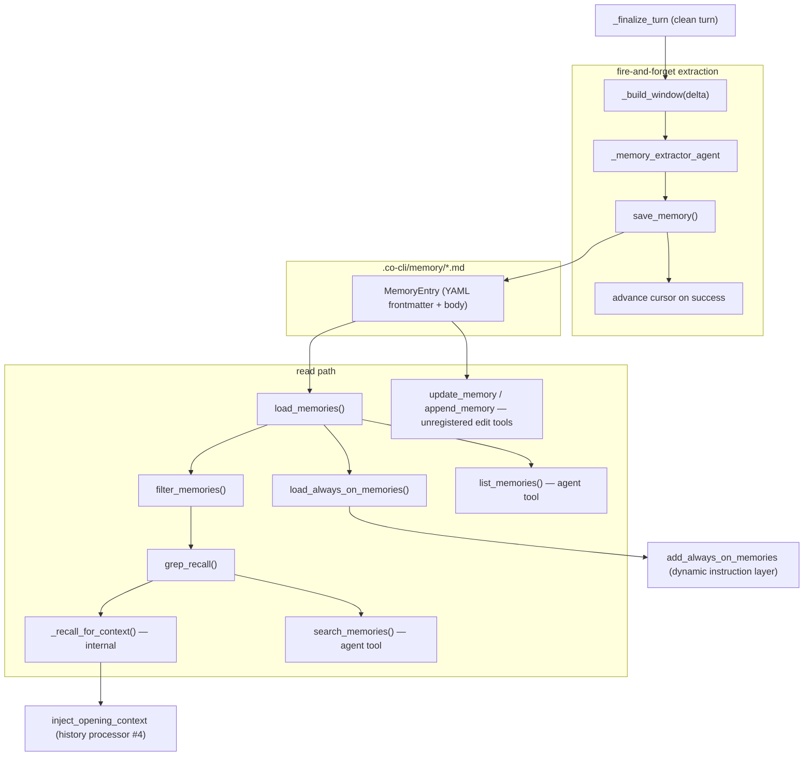

# Co CLI — Memory Design

## Product Intent

**Goal:** Own all workspace-local persistent memory: extraction, storage, and recall — outside the model.
**Functional areas:**
- `MemoryEntry` data model and frontmatter validation
- File-based read path (load, grep recall, context injection, always-on injection)
- Fire-and-forget extraction with cursor-based delta tracking
- Extractor-only write path via `save_memory`
- Surgical edit tools for main-agent use (`update_memory`, `append_memory`)
- REPL management (`/memory list/count/forget`)
**Non-goals:**
- Deduplication on extraction (extractor always creates new files)
- Concurrent-write safety (no file lock)
- Memory TTL or expiry

**Success criteria:** Memories extracted fire-and-forget each clean turn; always-on entries injected per instruction build; top-3 recalled per new user turn; REPL management works without an LLM turn.
**Status:** Stable
**Known gaps:** Extractor produces duplicates when the same signal appears in consecutive turn windows. `/memory forget --kind article` unlinks article files but leaves stale entries in `search.db` until the next `sync_dir` run.

---

Covers memory storage, extraction, recall, and REPL management. Library articles (FTS-indexed) are in [library.md](library.md). Context injection timing is in [context.md](context.md). Startup sequencing is in [flow-bootstrap.md](flow-bootstrap.md).

## 1. What & How

Memory is flat `.md` files with YAML frontmatter stored in `.co-cli/memory/`. They are indexed in FTS via `docs_fts` in `search.db` — `search_memories` and `_recall_for_context` use `KnowledgeStore.search(source="memory")` when a store is available. Two kinds coexist in the store: `memory` (extracted observations) and `article` (saved external references — storage path lives here, but FTS indexing of articles is handled by the library subsystem).

The extraction pipeline fires after each clean turn as a background asyncio task, scanning a delta window of new messages and calling `save_memory` for each signal. A cursor in `CoSessionState` tracks which messages have been processed; a failed extraction leaves the cursor unchanged so the delta is retried next turn.

The read path is used in three contexts: dynamic instruction injection (always-on entries), per-turn context injection (top-3 recalled into `inject_opening_context`), and agent tools (`search_memories`, `list_memories`).



## 2. Core Logic

### 2.1 Data Model

Every memory file is parsed into a `MemoryEntry` dataclass (`memory/recall.py`). `validate_memory_frontmatter()` enforces required fields and rejects malformed files with a warning — it never crashes the load.

| Field | Type | Required | Notes |
| --- | --- | --- | --- |
| `id` | `int \| str` | yes | new writes use full UUID4 strings |
| `created` | ISO8601 string | yes | set at write time, never mutated |
| `path` | `Path` | runtime only | populated at load time, not persisted |
| `content` | `str` | runtime only | the body text after frontmatter |
| `kind` | `"memory" \| "article"` | no | defaults to `"memory"` |
| `type` | `"user" \| "feedback" \| "project" \| "reference" \| null` | no | memory classification; warns on unknown values |
| `description` | `str \| null` | no | ≤200 chars, no newlines |
| `updated` | ISO8601 string | no | written by `update_memory`, `append_memory`, `_consolidate_article` |
| `tags` | `list[str]` | no | searched by `grep_recall`; filter axis for `load_memories` |
| `related` | `list[str] \| null` | no | one-hop slug links expanded by `_recall_for_context` |
| `origin_url` | `str \| null` | no | article dedup key (articles only) |
| `always_on` | `bool` | no | standing prompt injection; capped at 5 entries globally |

**Note on `name`:** `save_memory` writes an optional `name` field to frontmatter (used as the slug source), but `MemoryEntry` does not expose it at read time — it is write-only metadata not surfaced in the in-memory model.

**Frontmatter validation** (`_frontmatter.py`) runs five validators on load: id type and non-empty, created ISO8601 format, kind/origin_url/tags types, type and description constraints, temporal and relationship field types. Unknown `type` values produce `logger.warning` but do not raise — files load regardless.

**Enums** (`_frontmatter.py`):
- `MemoryKindEnum`: `MEMORY = "memory"`, `ARTICLE = "article"`
- `MemoryTypeEnum`: `USER`, `FEEDBACK`, `PROJECT`, `REFERENCE`

### 2.2 Read Path

Memories are indexed in FTS via `docs_fts` in `search.db`. `search_memories` and `_recall_for_context` use `KnowledgeStore.search(source="memory")` when `knowledge_store` is available; both fall back to `grep_recall` when the store is `None`.

```text
load_memories(memory_dir, *, tags=None, kind=None) -> list[MemoryEntry]
  -> glob *.md from memory_dir; returns [] if dir missing
  -> parse_frontmatter() + validate_memory_frontmatter() per file
  -> early-exit per file on kind mismatch or tags intersection mismatch
  -> skips malformed files with logger.warning

load_always_on_memories(memory_dir) -> list[MemoryEntry]
  -> load_memories (all entries), filter always_on=True
  -> hard cap: at most 5 entries (_ALWAYS_ON_CAP)

grep_recall(entries, query, max_results) -> list[MemoryEntry]
  -> case-insensitive substring match on content and each tag
  -> sort by updated or created (newest first)
  -> return top max_results

filter_memories(entries, tags=None, tag_match_mode="any",
                created_after=None, created_before=None) -> list[MemoryEntry]
  -> tag_match_mode="any": any tag intersects; "all": every requested tag present
  -> date filtering: lexicographic ISO8601 comparison

_recall_for_context(ctx, query, max_results=5, ...) -> ToolReturn   ← internal
  -> if knowledge_store is None: return empty result
  -> knowledge_store.search(query, source="memory", kind="memory", ...) → SearchResult list
  -> one-hop related slug expansion (up to 5 related entries)
  -> called only by inject_opening_context history processor

search_memories(ctx, query, *, limit=10, tags=None, ...) -> ToolReturn   ← agent tool
  -> if knowledge_store is None: return tool_error (store required)
  -> knowledge_store.search(query, source="memory", kind="memory", ...) → SearchResult list
  -> sets OTel span attribute rag.backend = "fts5"

list_memories(ctx, offset=0, limit=20, kind=None) -> ToolReturn   ← agent tool
  -> load all (or kind-filtered) memories, sort by str(id) alphabetically
  -> paginated; returns full metadata including type, kind
```

**One-hop related expansion**: for each `SearchResult` with a matching `.related` field, resolves slugs by matching against `path.stem` of a full memory load. Capped at 5 total related entries across all matches; avoids duplicating already-matched IDs.

### 2.3 Write Path (Extraction)

The main agent has no new-file write tools for memory. All extraction is owned by `_memory_extractor_agent` — a separate `Agent[CoDeps, None]` with `save_memory` as its only tool.

```text
fire_and_forget_extraction(delta, deps, frontend, *, cursor_start) -> None
  -> guards: if _in_flight task is still running, skip silently
  -> creates asyncio task "memory_extraction"; registers _on_extraction_done callback

_run_extraction_async(delta, deps, frontend, *, cursor_start) -> None
  -> _build_window(delta) → plain text window string
  -> return early (advancing cursor) if window is empty
  -> _memory_extractor_agent.run(window, deps=deps, model=..., model_settings=NOREASON_SETTINGS)
  ->   OTel span "co.memory.extraction"
  -> on success: deps.session.last_extracted_message_idx = cursor_start + len(delta)
  -> on CancelledError: log debug, do NOT advance cursor
  -> on any other exception: log debug, do NOT advance cursor (delta retried next turn)

_build_window(messages) -> str
  -> UserPromptPart → "User: ...", TextPart → "Co: ..."
  -> ToolCallPart → "Tool(name): args[:200]"
  -> ToolReturnPart → "Tool result (name): content[:300]"
  ->   skips ToolReturnPart starting with "1→ " (Read tool output)
  ->   skips long ToolReturnPart (>1000 chars) with no sentence-ending char in first 200 chars
  -> independent caps: last 10 text entries, last 10 tool entries
  -> merges back in original index order; returns interleaved plain text

save_memory(ctx, content, type_=None, name=None, description=None,
            tags=None, always_on=False) -> ToolReturn
  -> validates type_ against MemoryTypeEnum (raises ValueError on unknown)
  -> memory_id = uuid4()
  -> slug = slugify(name) if name else slugify(content[:50])  ← max 50 chars, [^a-z0-9]+ → "-"
  -> filename = f"{slug}-{memory_id[:8]}.md"                  ← UUID suffix: two calls → two files
  -> writes YAML frontmatter + content to deps.memory_dir
  -> if knowledge_store: knowledge_store.index(source="memory", ...) — re-indexes immediately
  -> tags lowercased; no dedup, no resource locks; always creates a new file
  -> OTel span "co.memory.save" with attribute "memory.type"
```

**Extractor prompt** (`memory/prompts/memory_extractor.md`) defines four signal types (`user`, `feedback`, `project`, `reference`) each with `when_to_save`, `how_to_use`, and `body_structure` fields. Hard rules: max 3 `save_memory` calls per window; produce no output text; do not save code patterns, git history, debugging solutions, or CLAUDE.md-documented things.

**Drain on shutdown** — `drain_pending_extraction(timeout_ms=10_000)` awaits the in-flight task with `asyncio.wait_for(asyncio.shield(task), ...)`. On timeout, cancels the task. Called in `_drain_and_cleanup()` at REPL exit.

### 2.4 Edit Path (Main Agent)

`update_memory` and `append_memory` are defined in `tools/memory_edit.py` with `RunContext[CoDeps]` signatures but are **not registered on the main agent's toolset** as of the current codebase. They may be reserved for sub-agent use.

```text
update_memory(ctx, slug, old_content, new_content) -> ToolReturn
  -> find file by stem == slug; acquire resource lock (try_acquire)
  -> reject old_content/new_content containing "1→ " or "Line N:" prefixes (Read tool artifacts)
  -> expandtabs() normalization before matching
  -> require old_content appears exactly once (count=0 → error, count>1 → error with line positions)
  -> write updated body + refresh fm["updated"] timestamp (atomic via tempfile + os.replace)
  -> if knowledge_store: knowledge_store.index(source="memory", ...) — re-indexes immediately

append_memory(ctx, slug, content) -> ToolReturn
  -> append "\n" + content to body.rstrip(); acquire resource lock
  -> refresh fm["updated"] (atomic write)
  -> if knowledge_store: knowledge_store.index(source="memory", ...) — re-indexes immediately
```

### 2.5 REPL Management

The `/memory` built-in provides inventory and deletion without an LLM turn. All subcommands share a common filter pipeline: `load_memories(kind=)` → `_apply_memory_filters(older_than, type)` → `grep_recall(query)`.

| Command | Syntax | Behavior |
| --- | --- | --- |
| `/memory list` | `[query] [flags]` | one line per entry: `id[:8]  date  [kind]  type  content[:80]`; footer shows count |
| `/memory count` | `[query] [flags]` | prints `N memories` |
| `/memory forget` | `<query\|flag> [flags]` | preview matched entries → prompt `Delete N memories? [y/N]` → unlink on `y` |

**Shared filter flags** (parsed by `_parse_memory_args`, applied by `_apply_memory_filters`):

| Flag | Type | Effect |
| --- | --- | --- |
| `query` (positional) | string | case-insensitive substring match on content and tags |
| `--older-than N` | int days | keep entries where `age_days > N` |
| `--type X` | string | exact match on `type` field (`user`, `feedback`, `project`, `reference`) |
| `--kind X` | string | passed to `load_memories(kind=X)` — `memory` or `article` |

**Behavioral constraints on `/memory forget`:**
- No query and no flags → refuse and print usage; never bulk-deletes silently
- Always displays a preview and requires explicit `y` before any deletion
- Calls `m.path.unlink()` only; does not clean up `search.db` — stale FTS entries for deleted articles persist until next `sync_dir` run

### 2.6 Session Rotation

`/new` rotates the session path to a new file via `new_session_path()` without writing any memory artifact. No summary is generated; the next `append_messages` call creates the new transcript file automatically.

## 3. Config

| Setting | Env Var | Default | Description |
| --- | --- | --- | --- |
| `memory.recall_half_life_days` | `CO_MEMORY_RECALL_HALF_LIFE_DAYS` | `30` | age decay used in confidence scoring for FTS results |
| `memory.injection_max_chars` | `CO_CLI_MEMORY_INJECTION_MAX_CHARS` | `2000` | cap for always-on injection and recalled-memory injection in `inject_opening_context` |
| `memory.extract_every_n_turns` | `CO_CLI_MEMORY_EXTRACT_EVERY_N_TURNS` | `3` | extraction cadence: run extractor every N clean turns; `0` disables extraction |

## 4. Files

| File | Purpose |
| --- | --- |
| `co_cli/memory/recall.py` | `MemoryEntry` dataclass; `load_memories`, `load_always_on_memories`, `grep_recall`, `filter_memories` |
| `co_cli/memory/_extractor.py` | cursor-based delta extraction; `fire_and_forget_extraction`, `drain_pending_extraction`, `_build_window` |
| `co_cli/memory/prompts/memory_extractor.md` | extractor system prompt — signal types, caps, not-to-save list |
| `co_cli/tools/memory_write.py` | `save_memory` — extractor-only write tool; UUID-suffix always-new file creation; re-indexes into `KnowledgeStore` after write |
| `co_cli/tools/memory.py` | `_recall_for_context` (internal); agent tools: `search_memories`, `list_memories` |
| `co_cli/tools/memory_edit.py` | `update_memory`, `append_memory` — unregistered surgical edit tools; atomic writes via temp-file + `os.replace`; re-indexes into `KnowledgeStore` after write |
| `co_cli/knowledge/_frontmatter.py` | frontmatter parsing (`parse_frontmatter`), validation (`validate_memory_frontmatter`), enums, `render_memory_file` |
| `co_cli/commands/_commands.py` | `/memory` REPL subcommands: list, count, forget; `/new` session rotation |
| `co_cli/context/_history.py` | `inject_opening_context` — calls `_recall_for_context` per new user turn |
| `co_cli/agent/_instructions.py` | `add_always_on_memories` dynamic instruction layer; `add_personality_memories` layer |
