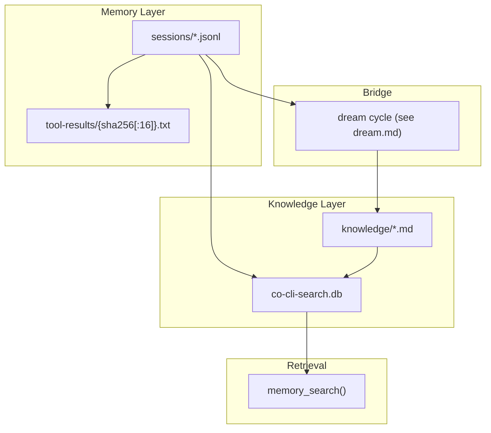

# Co CLI — Memory & Knowledge

## Product Intent

**Goal:** Own the full persistent cognition surface: session transcripts as raw memory, the derived transcript index for episodic recall, the reusable knowledge store, and the dream-cycle bridge between them.

**Functional areas:**
- Session transcripts, transcript branching, and session lifecycle commands
- Oversized tool-result spill files and transcript placeholders
- Derived transcript index (`session-index.db`) and episodic `memory_search()`
- Reusable knowledge artifacts on disk plus the derived retrieval DB
- Turn-time recall, explicit search, and lifecycle handoff to dreaming

**Non-goals:**
- Multi-user or concurrent-write safety
- Media ingestion pipelines
- Provider-side memory or server-managed context
- Automatic TTL/pruning for session transcripts or spilled tool results

**Success criteria:** Raw chronology is preserved in append-only transcripts; episodic recall routes through the transcript index; reusable recall routes through the knowledge layer; history replacement branches to child transcripts instead of rewriting parents; agent-explicit `memory_create` and the dream lifecycle keep reusable knowledge current.

**Status:** Stable. Memory is the session transcript layer plus a derived FTS5 session index. Knowledge is the reusable artifact layer in `knowledge_dir/*.md` plus the derived search DB. Dream-cycle details live in [dream.md](dream.md).

**Known gaps:** No concurrent-instance safety around transcript writes. A second `co chat` in the same user home can race session persistence. Deferred.

---

This spec defines how `co-cli` stores raw memory, derives episodic recall from it, promotes durable facts into knowledge, and maintains that knowledge over time. Startup sequencing lives in [bootstrap.md](bootstrap.md). Turn orchestration lives in [core-loop.md](core-loop.md). Prompt assembly and per-turn recall injection live in [prompt-assembly.md](prompt-assembly.md). Compaction mechanics live in [compaction.md](compaction.md). Dream-cycle mining, merge, decay, archive, and state live in [dream.md](dream.md). Tool registration and approval live in [tools.md](tools.md).

## 1. What & How

`co-cli` has two persistence layers — a static layer baked into the system prompt at agent construction and a dynamic layer of three recall channels queried on demand — plus one directional bridge:

- **Static personality content** (not a recall channel) — soul seed, mindsets, and behavioral rules are assembled once at agent construction and injected into the prefix-cached system prompt. No query path; no FTS; no LLM. Distinct from the three recall channels below.
- **Sessions channel** is the raw episodic timeline — append-only JSONL transcripts under `sessions/`, chunked and indexed in the unified `co-cli-search.db` chunks pipeline as `source='session'`. Recall returns verbatim chunk citations with JSONL line bounds; no LLM in the recall path.
- **Artifacts channel** is every reusable artifact the agent should recall on demand — markdown files under `knowledge/`, indexed by FTS5 and optional vector hybrid. Recall returns ranked structured rows; no LLM in the default path.
- **Canon channel** is the role-scoped read-only character memory under `souls/{role}/memories/*.md`. Recall returns ranked snippets; no LLM. Tuned for a small curated corpus and surfaced only when a personality is active.
- **Bridge** is agent-explicit `memory_create` calls during a turn, and the optional dream cycle which retrospectively mines past transcripts. Dream-cycle details live in [dream.md](dream.md).



Three-channel overview:

| Channel | Storage | Post-search recall synthesis |
| --- | --- | --- |
| Sessions | `sessions/*.jsonl` → `co-cli-search.db` chunks pipeline (`source='session'`) | BM25 chunk search → best chunk per unique session (dedup) → **verbatim chunk citations with JSONL line bounds; no LLM** |
| Artifacts | `knowledge/*.md` → `co-cli-search.db` FTS5 + optional vectors | FTS5 BM25 (± RRF vector merge) → ranked chunks → optional reranker → **structured rows; no LLM by default** |
| Canon | `souls/{role}/memories/*.md` (in-process scan) | Token-overlap scoring (title 2× weight) → ranked snippets; no FTS DB, no LLM |

## 2. Core Logic

### 2.1 Memory Layer: Session Transcripts

Session transcripts are append-only JSONL files under `sessions_dir` with lexicographically sortable filenames:

```text
YYYY-MM-DD-THHMMSSZ-{uuid8}.jsonl
```

The timestamp prefix makes lexicographic order match chronological order; the 8-char UUID suffix is the display/session ID reused in telemetry.

Each JSONL line is one of:

- a message row serialized through `ModelMessagesTypeAdapter`
- a `session_meta` control row written at the start of a branched child transcript
- a legacy `compact_boundary` control row, still honored on load for older transcripts

`persist_session_history()` is the only transcript persistence primitive:

```text
if history was replaced OR persisted_message_count > len(messages):
    new_path = new_session_path(sessions_dir)
    write session_meta(parent_session=<old filename>, reason=<reason>)
    append full compacted history to new_path
    return new_path
else:
    append only messages[persisted_message_count:]
    return existing session_path
```

Behavioral rules:

- Individual transcript files are never rewritten or truncated.
- History replacement never mutates the parent transcript; it branches to a child transcript.
- `CoSessionState.persisted_message_count` is the only durability cursor. Nothing is inferred from file size or mtime.
- `load_transcript()` skips malformed lines and `session_meta` rows, honors `compact_boundary` skips for files above 5 MB, and refuses to load transcripts above 50 MB.

### 2.2 Session Lifecycle, Commands, And Spill Files

Startup restore is path-only. `restore_session()` picks the latest `*.jsonl` by filename and sets `deps.session.session_path`, but `_chat_loop()` still begins with empty in-memory `message_history`. Resuming history is explicit.

Session command behavior:

| Command | Behavior |
| --- | --- |
| `/resume` | Uses `list_sessions()` + interactive picker, then `load_transcript(selected.path)`. On success, adopts that history and sets `deps.session.session_path` to the selected file. |
| `/new` | If history is empty, prints “Nothing to rotate”. Otherwise assigns a fresh `session_path` and replaces in-memory history with `[]`. |
| `/clear` | Replaces in-memory history with `[]`. Existing transcript files are untouched. |
| `/compact` | Replaces in-memory history with a compacted transcript; persistence then branches to a child session on the next write path. |
| `/sessions [keyword]` | Lists session summaries from `sessions_dir`, optionally filtered by title substring. |

Oversized tool results never need to stay inline in the transcript. `tool_output()` checks the effective threshold:

- `ToolInfo.max_result_size` when the tool defines one
- otherwise `config.tools.result_persist_chars`

If the display string exceeds that threshold, `persist_if_oversized()` writes the full text to:

```text
tool-results/{sha256[:16]}.txt
```

The model sees a `<persisted-output>` placeholder containing:

- tool name
- file path
- total size
- a 2,000-char preview
- guidance to page the full file by line range

Spill files are content-addressed and idempotent: identical content reuses the same filename. There is no TTL or automatic cleanup; `check_tool_results_size()` only warns when the directory exceeds a size threshold.

Security constraints:

- Session paths are internally generated from timestamps and UUIDs.
- `/resume` uses a picker; there is no free-form transcript-path argument.
- Session files and spilled tool-result files are `chmod 0o600`.

Telemetry note:

- The session short ID (`session_path.stem[-8:]`) is attached to spans and run metadata.
- Forked sub-agent deps inherit shared services but start with a fresh empty `session_path`, so their traces are attributable but not persisted into the parent transcript file.

### 2.3 Static Personality Content

Static personality content is not a recall channel — it is a one-time unconditional load at agent construction.

`build_static_instructions()` in `co_cli/context/assembly.py` assembles soul seed, mindsets, and behavioral rules into the cacheable static prompt. Knowledge artifacts are not injected into the static prompt; they are reachable on demand via `memory_search`.

The dynamic-instructions block (`current_time_prompt()` in `co_cli/agent/_instructions.py`) is intentionally kept to a small volatile suffix — today's date plus conditional safety warnings — so the stable static prefix remains cache-stable across turns.

### 2.4 Sessions Channel: Episodic Recall

Raw transcripts are Memory; `co-cli-search.db` (unified chunks pipeline) is the derived search structure over them.

Sessions are indexed as `source='session'` chunks by `KnowledgeStore`:

- `index_session(path)` — chunks a single JSONL file, hash-skips unchanged files, and writes the resulting `SessionChunk` rows into the unified `chunks` table. Partial-write recovery: if chunk count in DB < expected, re-indexes from scratch.
- `sync_sessions(sessions_dir, exclude=None)` — scans `sessions_dir`, calls `index_session` for each file except the excluded path (current session), and removes stale rows for deleted files via `remove_stale("session", current_uuid8s)`.
- `init_session_index()` runs during bootstrap. On first run after migration, removes the obsolete `session-index.db` file if present.

Chunking is done by `session_chunker.py`:

- `flatten_session(messages)` converts `ExtractedMessage` list to flat text lines with role prefixes: `User:`, `Assistant:`, `Tool[name](call):`, `Tool[name](return):`.
- `chunk_flattened(flat_lines, line_map, *, chunk_tokens, overlap_tokens)` splits flat text into overlapping `SessionChunk` objects, each tracking `start_jsonl_line` and `end_jsonl_line`.
- Configurable via `knowledge.session_chunk_tokens` (default 400) and `knowledge.session_chunk_overlap` (default 80).

`memory_search()` is the unified recall tool. It dispatches the sessions, artifacts, and canon channels in parallel for keyword searches. It operates in two modes:

**Browse mode** (empty query): returns recent-session metadata — session ID, date, title, file size — with zero LLM cost. Excludes the current session from results. Use when the user asks what was worked on recently or wants to browse session history.

**Search mode** (keyword query): dispatches all three channels in parallel. **Sessions channel — chunk citations:** `KnowledgeStore.search(source='session', limit=15)` → dedup to one best chunk per unique session → cap at 3 unique sessions (hard cap: `_SESSIONS_CHANNEL_CAP=3`). No LLM in the sessions recall path. Artifacts dispatch and its synthesis are described in §2.5. **Canon channel:** globs `souls/{active_role}/memories/*.md`, scores by token overlap (title stem 2× weight), returns up to `config.knowledge.character_recall_limit` (default 3) hits — no FTS DB, no LLM. Only runs when a personality is active; role is read from config, not from the caller.

To drill into a specific session turn, call `memory_read_session_turn(session_id, start_line, end_line)` — returns verbatim JSONL lines in the requested range (capped at 200 lines / 16 KB). Use the `start_line`/`end_line` from a sessions channel hit as the drill-down coordinates.

Result shape: flat list with a `channel` discriminator. Sessions entries: `{channel: "sessions", session_id, when, source, chunk_text, start_line, end_line, score}` — verbatim chunk text with JSONL line bounds. Artifacts entries: `{channel: "artifacts", kind, title, snippet, score, path, slug}` — ranked structured rows. Canon entries: `{channel: "canon", role, title, snippet, score, path, slug}` — on-demand character memory hits. Scores are NOT cross-comparable across channels.

Important current behavior:

- The active session is excluded from the bootstrap sync.
- There is no shutdown reindex pass.
- In practice, episodic search covers transcripts that have already been indexed during a prior bootstrap, not the live in-progress session.

### 2.5 Artifacts Channel: Knowledge Artifacts

Knowledge is every reusable artifact the agent should recall across sessions: preferences, decisions, rules, feedback, articles, references, and notes.

Storage is dual-layer:

| Layer | What lives there | Purpose |
| --- | --- | --- |
| `knowledge_dir/*.md` | YAML frontmatter + body text | Source of truth; human-editable and agent-readable |
| `co-cli-search.db` | chunk/index tables, FTS5, optional vectors, metadata | Derived retrieval layer; all search hits query the DB, not raw files |

`sync_dir()` keeps the derived DB current from disk. On bootstrap and after writes, artifacts are chunked and indexed under `source="knowledge"` (plus optional Obsidian/Drive sources when those connectors are present).

Knowledge artifact schema:

| Field | Purpose |
| --- | --- |
| `id` | Stable UUID |
| `kind` | Always `knowledge` |
| `artifact_kind` | `preference`, `decision`, `rule`, `feedback`, `article`, `reference`, or `note` |
| `title` | Human-readable label |
| `description` | Short retrieval summary |
| `created` | ISO8601 creation timestamp |
| `updated` | ISO8601 last-modified timestamp |
| `related` | Soft links to related artifacts |
| `source_type` | `detected`, `web_fetch`, `manual`, `obsidian`, `drive`, or `consolidated` |
| `source_ref` | Pointer to source session, URL, file path, or artifact ID |
| `certainty` | `high`, `medium`, or `low` |
| `decay_protected` | Lifecycle protection flag; dream merge/decay semantics live in [dream.md](dream.md) |
| `last_recalled` | Most recent recall timestamp |
| `recall_count` | Recall hit counter |

Artifacts recall is on-demand. `memory_search()` covers all three recall channels in a single call. The agent decides when to call it; the tool description coaches proactive use for all recall tasks — saved preferences, past conversations, project conventions, and saved articles. The `kind` parameter narrows artifact results by `artifact_kind`.

**Artifacts post-FTS synthesis — ranked structured rows.** Unlike the sessions channel, artifacts recall returns structured chunk rows directly — no LLM in the default path. BM25 and optional vector scores are merged via RRF; an optional cross-encoder or LLM reranker (`cross_encoder_reranker_url`) can re-score the top-N results when configured. Artifacts result shape: `{channel: "artifacts", kind, title, snippet, score, path, slug}`.

Artifacts search backends degrade in this order:

| Backend | Mechanism | When used |
| --- | --- | --- |
| `hybrid` | FTS5 + vector search + merged ranking | Embeddings are available |
| `fts5` | BM25 over chunked text | Embeddings unavailable |
| `grep` | In-memory substring match over loaded markdown | KnowledgeStore unavailable |

The main reusable-artifact commands owned by this spec are:

| Command | Purpose |
| --- | --- |
| `/knowledge list [query] [flags]` | List matching artifacts |
| `/knowledge count [query] [flags]` | Count matching artifacts |
| `/knowledge forget <query> [flags]` | Delete matching active artifacts after confirmation |

Dream lifecycle commands (`/knowledge dream`, `/knowledge restore`, `/knowledge decay-review`, `/knowledge stats`) live in [dream.md](dream.md).

`/memory` is still present as a deprecated alias for `list`, `count`, and `forget`.

### 2.6 Memory -> Knowledge Bridge: Agent-Explicit Writes and Dream

There is no online per-turn extraction. Knowledge accumulates through two paths:

1. **Agent-explicit `memory_create`** — the agent calls `memory_create(...)` at any point during a turn when it recognizes a durable signal worth preserving. This is the primary in-session write path and is always available.

2. **Dream cycle** — at session end (when `knowledge.consolidation_enabled=true`), the dream cycle retrospectively mines past transcripts and writes new artifacts. See [dream.md](dream.md) for the full lifecycle.

### 2.7 Dream Lifecycle Handoff

Dream-cycle semantics live in [dream.md](dream.md). This spec only owns the handoff: transcripts remain append-only read inputs, active knowledge remains markdown plus a derived search index, and any dream-cycle artifact writes or archives must preserve those source-of-truth boundaries.

The dream cycle is not part of turn-time recall or in-turn knowledge writes. It is a separate lifecycle pass over the same Memory and Knowledge stores.

### 2.8 Design Lineage

The sessions and artifacts retrieval pipelines are not original — they trace to specific peer systems. Recording the lineage here so future work knows which peer to consult before changing retrieval mechanics. Peer product survey: [docs/reference/RESEARCH-memory-peer-for-co-second-brain.md](../reference/RESEARCH-memory-peer-for-co-second-brain.md). Open porting gaps and cheap-borrow candidates: [docs/exec-plans/active/2026-04-29-143000-memory-recall-gap-backlog.md](../exec-plans/active/2026-04-29-143000-memory-recall-gap-backlog.md).

**Sessions channel — ported from `openclaw` chunked recall pipeline.**

The sessions channel was originally a direct port from `hermes-agent` (FTS5 + LLM summarization). It was subsequently replaced by a chunked recall pipeline ported from `openclaw`: sessions are chunked by `session_chunker.py`, indexed into the unified `co-cli-search.db` chunks pipeline as `source='session'`, and recalled via `KnowledgeStore.search(source='session')`. No LLM in the recall path. The hermes-era `summary.py`, `session-index.db`, and `_SUMMARIZATION_TIMEOUT_SECS` constants have been deleted.

| Mechanism | openclaw (chunked recall) | co_cli |
| --- | --- | --- |
| Pipeline | chunk JSONL → index chunks → BM25 search → verbatim citations | identical |
| Session cap | configurable | hard cap 3 (`recall.py:_SESSIONS_CHANNEL_CAP`) |
| Chunk size | configurable | `session_chunk_tokens=400`, `session_chunk_overlap=80` |
| LLM in recall path | none | none |

Implication: changes to sessions chunking or retrieval should consult the openclaw implementation first.

**Artifacts channel — retrieval mechanics from `openclaw`, product shape from `ReMe`.**

Two distinct peers contributed two distinct layers:

| Component | Peer source | co_cli location |
| --- | --- | --- |
| BM25 + vector hybrid via RRF | `openclaw` `extensions/memory-core/src/memory/hybrid.ts:57-155` | `_hybrid_search()` (`knowledge_store.py`) |
| Optional cross-encoder / LLM rerank | `openclaw` MMR-style rerank | `_rerank_results()` (`knowledge_store.py`) |
| Temporal decay | `openclaw` decay/recency policy | `co_cli/memory/decay.py` |
| File-based local memory + memory classes (kind taxonomy) | `ReMe` (`reme/memory/file_based/`) | `knowledge_dir/*.md` + `artifact_kind` field |
| Pre-reasoning, on-demand recall (no always-inject) | `ReMe` retrieval discipline | `memory_search()` tool surface |

Standard RAG primitives are not peer-specific and should not be attributed: `chunk_size=600 + chunk_overlap=80` is the LangChain/LlamaIndex default, and `tokenize='porter unicode61'` is the idiomatic SQLite FTS5 recipe shared by both the sessions and artifacts channels.

Implication: changes to artifacts ranking should consult `openclaw`; changes to artifacts storage shape or artifact taxonomy should consult `ReMe`.

## 3. Config

### Memory Settings

| Setting | Env Var | Default | Description |
| --- | --- | --- | --- |
| `memory.recall_half_life_days` | `CO_MEMORY_RECALL_HALF_LIFE_DAYS` | `30` | age-decay parameter used in recall scoring |

### Knowledge Settings

| Setting | Env Var | Default | Description |
| --- | --- | --- | --- |
| `knowledge.search_backend` | `CO_KNOWLEDGE_SEARCH_BACKEND` | `hybrid` | preferred retrieval backend before runtime degradation |
| `knowledge.embedding_provider` | `CO_KNOWLEDGE_EMBEDDING_PROVIDER` | `tei` | embedding backend for hybrid search |
| `knowledge.embedding_model` | `CO_KNOWLEDGE_EMBEDDING_MODEL` | `embeddinggemma` | embedding model name |
| `knowledge.embedding_dims` | `CO_KNOWLEDGE_EMBEDDING_DIMS` | `1024` | embedding vector dimensions |
| `knowledge.embed_api_url` | `CO_KNOWLEDGE_EMBED_API_URL` | `http://127.0.0.1:8283` | embedding service URL |
| `knowledge.cross_encoder_reranker_url` | `CO_KNOWLEDGE_CROSS_ENCODER_RERANKER_URL` | `http://127.0.0.1:8282` | TEI reranker URL |
| `knowledge.chunk_size` | `CO_KNOWLEDGE_CHUNK_SIZE` | `600` | chunk size used during indexing |
| `knowledge.chunk_overlap` | `CO_KNOWLEDGE_CHUNK_OVERLAP` | `80` | chunk overlap used during indexing |
| `knowledge.character_recall_limit` | `CO_CHARACTER_RECALL_LIMIT` | `3` | max canon hits returned per `memory_search` call |
| `knowledge.session_chunk_tokens` | `CO_KNOWLEDGE_SESSION_CHUNK_TOKENS` | `400` | target chunk size (in tokens) for session transcript indexing |
| `knowledge.session_chunk_overlap` | `CO_KNOWLEDGE_SESSION_CHUNK_OVERLAP` | `80` | overlap (in tokens) between adjacent session chunks |

Dream-cycle and lifecycle maintenance settings, including consolidation trigger, lookback, merge threshold, artifact soft cap, and decay age, live in [dream.md](dream.md).

### Paths

| Path | Env Var | Default | Description |
| --- | --- | --- | --- |
| `knowledge_path` | `CO_KNOWLEDGE_PATH` | `~/.co-cli/knowledge/` | source-of-truth knowledge artifact directory |
| `sessions_dir` | — | `~/.co-cli/sessions/` | user-global transcript directory, resolved onto `CoDeps` |
| `tool_results_dir` | — | `~/.co-cli/tool-results/` | user-global spill directory for oversized tool results |
| `knowledge_db_path` | — | `~/.co-cli/co-cli-search.db` | unified retrieval DB for both knowledge artifacts and session chunks |

## 4. Files

| File | Purpose |
| --- | --- |
| `co_cli/memory/session.py` | session filename parsing/generation and latest-session discovery |
| `co_cli/memory/transcript.py` | transcript append/load logic, child-session branching, and control records |
| `co_cli/memory/session_browser.py` | lightweight session listing and picker metadata for `/resume` and `/sessions` |
| `co_cli/tools/tool_io.py` | oversized tool-result spill, preview placeholders, and size warnings |
| `co_cli/memory/session_chunker.py` | `SessionChunk`, `flatten_session()`, `chunk_flattened()`, `chunk_session()` — session transcript chunking pipeline feeding the unified `KnowledgeStore` |
| `co_cli/memory/indexer.py` | `ExtractedMessage`, `extract_messages()` — JSONL line parser that feeds `KnowledgeStore.index_session()`; emits user/assistant/tool-call/tool-return message types |
| `co_cli/tools/memory/recall.py` | `memory_search()` unified recall tool — sessions, artifacts, and canon channels |
| `co_cli/tools/memory/_canon_recall.py` | `search_canon()` — canon channel: globs `souls/{role}/memories/*.md`, token-overlap scoring, title 2× weight |
| `co_cli/memory/artifact.py` | `KnowledgeArtifact` schema and artifact loaders |
| `co_cli/memory/knowledge_store.py` | `KnowledgeStore` indexing/search backend and `sync_dir()` |
| `co_cli/memory/frontmatter.py` | frontmatter parse/validate/render helpers |
| `co_cli/memory/chunker.py` | chunking for indexed artifact text |
| `co_cli/memory/ranking.py` | confidence scoring and contradiction helpers |
| `co_cli/memory/similarity.py` | similarity and dedup helpers |
| `co_cli/memory/_window.py` | transcript-window builder used by dream mining |
| `co_cli/memory/service.py` | pure-function service layer for knowledge artifact writes; `save_artifact()` and `mutate_artifact()` — no RunContext |
| `co_cli/tools/memory/read.py` | `memory_list()` — paginated inventory of knowledge artifacts; `memory_read_session_turn()` — verbatim JSONL turn drill-down (capped at 200 lines / 16 KB); `grep_recall()` utility used by `memory_search()`. Full-body artifact reads route through the generic `file_read` tool on the path surfaced by `memory_search`. |
| `co_cli/tools/memory/write.py` | artifact write/update/append helpers and article persistence |
| `co_cli/bootstrap/core.py` | `restore_session()` and `init_session_index()` during startup |
| `co_cli/agent/_instructions.py` | `current_time_prompt()` — per-turn current date/time injection; `safety_prompt()` — doom-loop and shell-error streak warnings |
| `co_cli/context/prompt_text.py` | `safety_prompt_text()` — per-turn dynamic instruction; returns doom-loop / shell-reflection warning text or empty string |
| `co_cli/context/assembly.py` | `build_static_instructions()` — assembles soul, mindsets, and rules into the cacheable static system prompt; character memories and critique excluded |
| `co_cli/personality/prompts/loader.py` | `load_soul_seed`, `load_soul_critique`, `load_soul_mindsets` — personality asset loaders |
| `co_cli/main.py` | `_finalize_turn()` persistence bridge and session-end dream trigger |
| `co_cli/commands/core.py` | `/resume`, `/new`, `/clear`, `/compact`, `/sessions`, `/knowledge`, and `/memory` command handlers |
