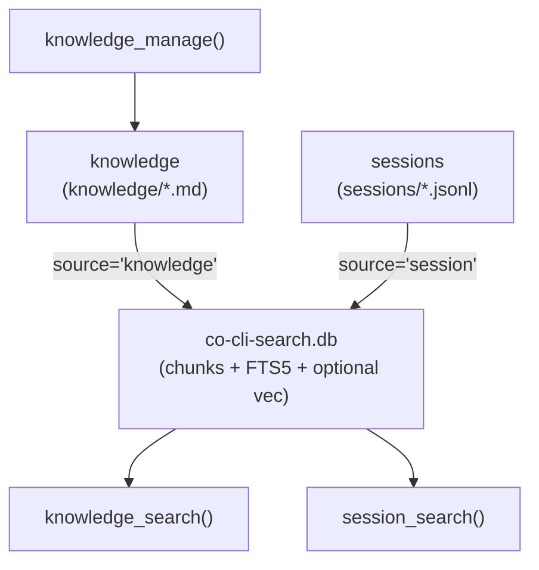

# Co CLI — Memory

> Channel sub-specs: [knowledge.md](knowledge.md) · [sessions.md](sessions.md). Sibling surface (own tier): [skill.md](skill.md). Doctrine (auto-injected into static prompt; never queried as memory): [personality.md](personality.md). Tool registration and approval: [tools.md](tools.md). Dream-cycle mining, merge, decay, archive: [dream.md](dream.md). Prompt assembly: [prompt-assembly.md](prompt-assembly.md). Startup sequencing: [bootstrap.md](bootstrap.md). Turn orchestration: [core-loop.md](core-loop.md). Compaction mechanics: [compaction.md](compaction.md).

Foundation spec for the memory surface — dynamic, declarative state accumulated by the agent through operation. Channel-specific lifecycle (storage, mutation, validation, indexing details, channel-specific test gates) lives in the two sub-specs.

Memory is one of four operational tiers in the agent loop: **doctrine** ([personality.md](personality.md), identity), **tools** ([tools.md](tools.md), capability), **skills** ([skill.md](skill.md), procedure), **memory** (this file — declarative state). Each tier is structurally distinct: doctrine is auto-injected, tools are registered, skills have their own search/view/manage surface, and memory is what the agent accumulates through operation.

## 1. Functional Architecture

Memory contributes two channels — session and knowledge — both genuinely dynamic (accumulated by the agent during operation) and declarative (facts, not procedure or identity).

Memory is never injected wholesale into the system prompt. Static personality content (soul seed, mindsets, personality-context artifacts, bundled skill manifest) is injected once at agent construction. Everything else is loaded on-demand through the memory tool surface, keeping context bounded and recall purposeful.

Memory and skill surfaces sit at different operational tiers. Memory holds facts you recall to inform reasoning during a task; skills hold procedures that define how to structure the task itself. The skill surface is documented in [skill.md](skill.md) and governed by [06_skill_protocol.md](../../co_cli/context/rules/06_skill_protocol.md).



### Channel Ontology

| Channel | Sub-spec | Storage | Mutation | Indexing |
| --- | --- | --- | --- | --- |
| **knowledge** | [knowledge.md](knowledge.md) | `~/.co-cli/knowledge/*.md` | `knowledge_manage(action=...)` | FTS5 BM25 + optional hybrid; chunks body text |
| **sessions** | [sessions.md](sessions.md) | `~/.co-cli/sessions/*.jsonl` | append-only via `persist_session_history` | sliding-window token chunks |

Skills and canon are intentionally absent from this table — they live on their own tiers (see [skill.md](skill.md) and [personality.md](personality.md)). Canon is doctrine, auto-injected by the personality system; skills are procedural capability with their own search/view/manage surface.

## 2. Core Logic

### Indexer

The shared search index lives at `~/.co-cli/co-cli-search.db`. Both memory channels write through `MemoryStore` in `co_cli/memory/memory_store.py`.

#### `chunks_fts` table

FTS5 full-text index over all chunks. Sources owned by memory:

| Source value | Channel | Chunk strategy |
| --- | --- | --- |
| `'knowledge'` | knowledge | sliding-window body chunks |
| `'session'` | session | sliding-window token chunks via `session_chunker.py` |

One other source (`'canon'`) coexists in the same table — it is indexed at bootstrap for personality auto-injection only and is never returned by any model-callable tool.

#### Write-time indexing

Indexing is write-time, not search-time. Channel-specific entry points: `sync_dir()` for knowledge, `index_session()` / `sync_sessions()` for sessions. See each channel sub-spec for chunking details.

#### Retrieval backends

| Backend | Mechanism | When used |
| --- | --- | --- |
| `hybrid` | FTS5 BM25 + sqlite-vec cosine, RRF merge (k=60) | Configured, TEI reranker reachable, embedding provider configured/reachable, and sqlite-vec available |
| `fts5` | BM25 over chunked text only | Explicitly configured, or hybrid degrades before store construction |
| `grep` | In-memory substring over artifact title+content | `memory_store` is `None`; sessions return `[]` in this state |

Optional reranker (applied after merge, before limit): TEI cross-encoder (`cross_encoder_reranker_url`); unconfigured = pass-through.

### Recall pipeline

```
knowledge_search(ctx, query, kinds, limit)              # tools/memory/recall.py
  ├─ _search_artifacts → user + waterfall passes          # see knowledge.md

session_search(ctx, query, limit)                       # tools/memory/recall.py
  └─ _search_sessions  → chunk-cited BM25                 # see sessions.md
```

## 3. Config

### Shared retrieval settings

| Setting | Env Var | Default | Description |
| --- | --- | --- | --- |
| `knowledge.search_backend` | `CO_KNOWLEDGE_SEARCH_BACKEND` | `hybrid` | preferred retrieval backend before runtime degradation |
| `knowledge.embedding_provider` | `CO_KNOWLEDGE_EMBEDDING_PROVIDER` | `tei` | embedding backend (`ollama`, `gemini`, `tei`, `none`) |
| `knowledge.embedding_model` | `CO_KNOWLEDGE_EMBEDDING_MODEL` | `embeddinggemma` | embedding model name |
| `knowledge.embedding_dims` | `CO_KNOWLEDGE_EMBEDDING_DIMS` | `1024` | embedding vector dimensions |
| `knowledge.embed_api_url` | `CO_KNOWLEDGE_EMBED_API_URL` | `http://127.0.0.1:8283` | embedding service URL |
| `knowledge.cross_encoder_reranker_url` | `CO_KNOWLEDGE_CROSS_ENCODER_RERANKER_URL` | `http://127.0.0.1:8282` | TEI cross-encoder reranker URL |
| `knowledge.tei_rerank_batch_size` | *(no env var)* | `50` | batch size for TEI rerank HTTP requests |
| `memory.recall_half_life_days` | `CO_MEMORY_RECALL_HALF_LIFE_DAYS` | `30` | defined lifecycle setting; not currently consumed by recall ranking |

Channel-specific settings (chunk sizes, consolidation, decay, session chunking) live in the respective sub-specs.

### Paths

| Path | Env Var | Default | Description |
| --- | --- | --- | --- |
| `knowledge_path` | `CO_KNOWLEDGE_PATH` | `~/.co-cli/knowledge/` | knowledge artifact source-of-truth directory |
| `sessions_dir` | — | `~/.co-cli/sessions/` | transcript directory |
| `tool_results_dir` | — | `~/.co-cli/tool-results/` | spill directory for oversized tool results |
| `memory_db_path` | — | `~/.co-cli/co-cli-search.db` | unified retrieval DB (sessions + knowledge; also hosts canon source for personality auto-injection) |

Dream-cycle and lifecycle maintenance settings live in [dream.md](dream.md).

## 4. Public Interface

### Knowledge channel — recall and view

| Symbol | Source | Contract |
| --- | --- | --- |
| `knowledge_search(ctx, query, kinds=None, limit=10)` | `co_cli/tools/memory/recall.py` | Async tool — two-pass ranked recall over knowledge artifacts; empty query → recent-artifact browse |
| `knowledge_view(ctx, name)` | `co_cli/tools/memory/view.py` | Async tool — returns full artifact body by `filename_stem`; frontmatter stripped |

Result fields for `knowledge_search`: `{kind, title, snippet, score, path, filename_stem}`. Channel caps: `_ARTIFACTS_USER_CAP=3`, `_ARTIFACTS_WATERFALL_CHUNK_CAP=5`, `_ARTIFACTS_WATERFALL_SIZE_CAP=2000` chars.

### Knowledge channel — write

| Symbol | Source | Contract |
| --- | --- | --- |
| `knowledge_manage(ctx, action, name, content=None, kind=None, section=None)` | `co_cli/tools/memory/manage.py` | Async tool — `create`/`append`/`replace`/`delete`; `approval=True`; subject `tool:knowledge_manage:<action>:<name>` |

Detailed semantics and validation: [knowledge.md §4](knowledge.md).

### Sessions channel

| Symbol | Source | Contract |
| --- | --- | --- |
| `session_search(ctx, query, limit=3)` | `co_cli/tools/memory/recall.py` | Async tool — BM25-ranked chunk recall over past sessions; current session excluded; empty query → recent-session browse |
| `session_view(ctx, session_id, start_line, end_line)` | `co_cli/tools/memory/view.py` | Async tool — verbatim JSONL line-range reader by uuid8 |

Result fields for `session_search`: `{session_id, when, source, chunk_text, start_line, end_line, score}`. Channel cap: `_SESSIONS_CHANNEL_CAP=3` unique sessions.

### Store API (cross-channel)

| Symbol | Source | Contract |
| --- | --- | --- |
| `MemoryStore` | `co_cli/memory/memory_store.py` | Unified search backend over `co-cli-search.db`; manages FTS5 / hybrid / vec tables |
| `MemoryStore.search(query, sources, kinds=None, limit=...)` | `co_cli/memory/memory_store.py` | Returns ranked `SearchResult` rows from `chunks_fts` (+ optional vec) |
| `MemoryStore.sync_dir(source, directory, glob, no_chunk=False)` | `co_cli/memory/memory_store.py` | Hash-based directory indexer; supports unchunked single-chunk mode (used by canon) |
| `MemoryStore.index_session(session_path)` | `co_cli/memory/memory_store.py` | Indexes one JSONL transcript under `source='session'` |
| `MemoryStore.sync_sessions(sessions_dir, exclude=None)` | `co_cli/memory/memory_store.py` | Hash-based sync of all transcripts; excludes the live session |
| `MemoryStore.list_titles_by_source(source)` | `co_cli/memory/memory_store.py` | Generic helper — returns `(title, path)` rows for a source |
| `MemoryStore.get_path_by_title(source, title)` | `co_cli/memory/memory_store.py` | Generic helper — resolves title back to absolute path |
| `MemoryStore.get_chunk_content(source, path, chunk_index)` | `co_cli/memory/memory_store.py` | Returns a single chunk's body text (used by canon read path) |
| `SearchResult` | `co_cli/memory/memory_store.py` | Dataclass row — `chunk_text`, `source`, `path`, `score`, `kind`, `chunk_index`, `start_line`, `end_line` |
| `build_embedder(provider, model, dims, url)` | `co_cli/memory/_embedder.py` | Returns the embedder used by hybrid backend; raises on misconfiguration |

### FTS5 helpers (search_util)

| Symbol | Source | Contract |
| --- | --- | --- |
| `run_fts(conn, query, sources, kinds=None, limit=...)` | `co_cli/memory/search_util.py` | Executes a sanitized FTS5 query and returns raw rows |
| `sanitize_fts5_query(query)` | `co_cli/memory/search_util.py` | Strips stopwords and FTS5 operators that would otherwise raise |
| `normalize_bm25(rows)` | `co_cli/memory/search_util.py` | Normalizes BM25 scores to `[0, 1]` for cross-backend merge |
| `snippet_around(text, query, max_chars)` | `co_cli/memory/search_util.py` | Returns query-aware snippet (used when FTS5 `snippet()` is unavailable) |
| `STOPWORDS` | `co_cli/memory/stopwords.py` | `frozenset[str]` — common stopwords stripped before FTS query construction |

## 5. Files

### Memory core (shared)

| File | Purpose |
| --- | --- |
| `co_cli/memory/memory_store.py` | `MemoryStore` — FTS5/hybrid search, `sync_dir()`, `index_session()`, `sync_sessions()`, generic helpers `list_titles_by_source()` / `get_path_by_title()` |
| `co_cli/memory/_embedder.py` | `build_embedder()` — embedding provider dispatch |
| `co_cli/memory/search_util.py` | `normalize_bm25()`, `run_fts()`, `sanitize_fts5_query()`, `snippet_around()` |
| `co_cli/memory/stopwords.py` | `STOPWORDS` frozenset |

### Memory tool surface

| File | Purpose |
| --- | --- |
| `co_cli/tools/memory/recall.py` | `knowledge_search()` — knowledge ranked recall; `session_search()` — session ranked recall; `_grep_recall()` — knowledge disk-scan fallback (no store) |
| `co_cli/tools/memory/manage.py` | `knowledge_manage()` — knowledge write surface |
| `co_cli/tools/memory/view.py` | `knowledge_view()` — full artifact body reader; `session_view()` — verbatim session turn reader |
| `co_cli/agents/_native_toolset.py` | foreground toolset registration |

### Bootstrap and runtime

| File | Purpose |
| --- | --- |
| `co_cli/bootstrap/core.py` | `restore_session()`, `init_session_index()`, `_sync_canon_store()` (personality-load-only), `create_deps()` |
| `co_cli/main.py` | `_finalize_turn()` — session persistence bridge and session-end dream trigger |
| `co_cli/tools/tool_io.py` | oversized tool-result spill, preview placeholders, size warnings |

Channel-specific files (e.g. `co_cli/memory/artifact.py`, `co_cli/memory/session_chunker.py`) are listed in the respective sub-specs.
