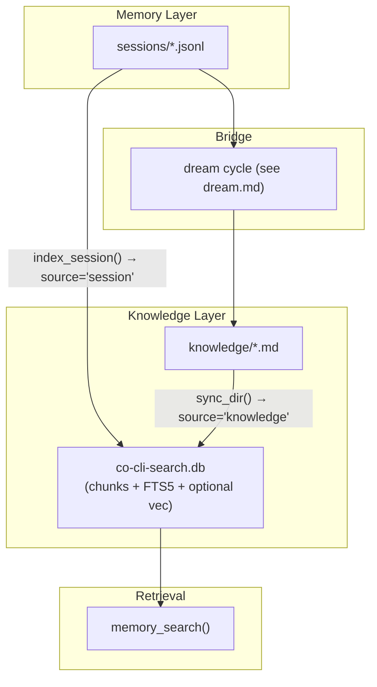

# Co CLI — Memory

> Tool registration and approval: [tools.md](tools.md). Dream-cycle mining, merge, decay, archive: [dream.md](dream.md). Personality system and static prompt: [personality.md](personality.md). Prompt assembly: [prompt-assembly.md](prompt-assembly.md). Startup sequencing: [bootstrap.md](bootstrap.md). Turn orchestration: [core-loop.md](core-loop.md). Compaction mechanics: [compaction.md](compaction.md).

## 1. Architecture

Three-channel recall model. `memory_search()` dispatches all channels in sequence. Static personality content (soul seed, mindsets, rules) is injected once at agent construction — it is not a recall channel.

| Channel | Storage | Recall mechanism |
| --- | --- | --- |
| Sessions | `sessions/*.jsonl` → `co-cli-search.db` (`source='session'`) | BM25 chunk search → best chunk per unique session (dedup) → verbatim citations with JSONL line bounds; no LLM |
| Knowledge | `knowledge/*.md` → `co-cli-search.db` (`source='knowledge'`) | FTS5 BM25 ± RRF vector merge → optional reranker → ranked structured rows; no LLM by default |
| Canon | `souls/{role}/memories/*.md` (in-process scan) | Token-overlap scoring (title 2× weight) → ranked snippets; no FTS DB, no LLM |

`MemoryStore` is the shared search backend for sessions and knowledge artifacts. `memory_search()` in `co_cli/tools/memory/recall.py` dispatches all three channels.



## 2. Sessions Channel

### 2.1 Transcript Storage

Session transcripts are append-only JSONL files under `sessions_dir`:

```text
YYYY-MM-DD-THHMMSSZ-{uuid8}.jsonl
```

Each JSONL line is a message row serialized through `ModelMessagesTypeAdapter`, a `session_meta` control row (written at the start of a branched child transcript), or a `compact_boundary` control row (honored on load for files above the precompact threshold).

`persist_session_history()` is the only transcript persistence primitive:

```text
if history was replaced OR persisted_message_count > len(messages):
    new_path = new_session_path(sessions_dir)
    write session_meta(parent_session=<old filename>, reason=<reason>)
    append full compacted history to new_path
    return new_path
else:
    append only messages[persisted_message_count:]
    return existing session_path
```

Rules:
- Transcript files are never rewritten or truncated.
- History replacement branches to a child transcript; it never mutates the parent.
- `CoSessionState.persisted_message_count` is the only durability cursor.
- `load_transcript()` skips malformed lines and `session_meta` rows, honors `compact_boundary` skips for files > 5 MB, and refuses to load files > 50 MB.

Oversized tool results spill to `tool-results/{sha256[:16]}.txt`. The model sees a `<persisted-output>` placeholder with tool name, path, total size, a 2,000-char preview, and guidance to page the full file. Spill files are content-addressed and idempotent. Transcript and spill files are `chmod 0o600`.

### 2.2 Lifecycle and Commands

Startup restore is path-only. `restore_session()` picks the latest `*.jsonl` by filename and sets `deps.session.session_path`; `_chat_loop()` begins with empty in-memory `message_history`. Resuming history is explicit.

| Command | Behavior |
| --- | --- |
| `/resume` | `list_sessions()` + interactive picker → `load_transcript(selected.path)`; adopts history and updates `session_path` |
| `/new` | Fresh `session_path` and clears in-memory history (prints "Nothing to rotate" if history empty) |
| `/clear` | Clears in-memory history; transcript files untouched |
| `/compact` | Replaces in-memory history with compacted transcript; next write branches to a child session |
| `/sessions [keyword]` | Lists session summaries, optionally filtered by title substring |

### 2.3 Sessions Recall

`index_session()`:

```text
parse uuid8 and created_at from filename
chunk_session(path) → list[SessionChunk]
content_hash = sha256(joined chunk texts)
if hash unchanged: return  # hash-skip
with transaction:
    index doc row (source='session', path=uuid8, kind='session')
    index_chunks(source='session', doc_path=uuid8, chunks)
```

`session_chunker.py` pipeline:
- `extract_messages(path)` → parses JSONL, skips control lines and noise parts
- `flatten_session(messages)` → role-prefixed lines: `User:`, `Assistant:`, `Tool[name](call):`, `Tool[name](return):`
- `chunk_flattened(flat_lines, line_map)` → sliding-window token chunks, each with `start_jsonl_line` / `end_jsonl_line`

`init_session_index()` runs at bootstrap. On first run after migration it removes the obsolete `session-index.db` if present.

`memory_search()` modes:
- **Browse** (empty query): returns recent-session metadata — ID, date, title, file size — no FTS, no LLM. Excludes the current session.
- **Search** (keyword query): sessions channel → `MemoryStore.search(sources=['session'], limit=15)` → dedup to one best chunk per unique session → cap at 3 (`_SESSIONS_CHANNEL_CAP`)

Result shape: `{channel: "sessions", session_id, when, source, chunk_text, start_line, end_line, score}`

To drill into a specific turn: `memory_read_session_turn(session_id, start_line, end_line)` — verbatim JSONL lines, capped at 200 lines / 16 KB.

The active session is excluded from bootstrap sync; episodic search covers already-indexed transcripts only.

## 3. Knowledge Channel

### 3.1 Artifact Storage

Knowledge artifacts are reusable facts the agent recalls across sessions: `user`, `rule`, `article`, and `note` kinds.

| Layer | What lives there | Purpose |
| --- | --- | --- |
| `knowledge_dir/*.md` | YAML frontmatter + body text | Source of truth; human-editable |
| `co-cli-search.db` | `chunks`, `chunks_fts`, optional `chunks_vec`, `docs` | Derived retrieval layer |

`sync_dir()` keeps the DB current: parses frontmatter, SHA256 hash-skips unchanged files, chunks body text, and writes to `chunks`/`chunks_fts`. Obsidian and Drive connectors index under `source='obsidian'`/`source='drive'`.

Knowledge artifact schema:

| Field | Purpose |
| --- | --- |
| `id` | Stable UUID |
| `artifact_kind` | `user`, `rule`, `article`, or `note` |
| `title` | Human-readable label |
| `description` | Short retrieval summary |
| `created` | ISO8601 creation timestamp |
| `updated` | ISO8601 last-modified timestamp |
| `related` | Soft links to related artifacts |
| `source_type` | `detected`, `web_fetch`, `manual`, `obsidian`, `drive`, or `consolidated` |
| `source_ref` | Pointer to source session, URL, file path, or artifact ID |
| `certainty` | `high`, `medium`, or `low` |
| `decay_protected` | Lifecycle protection flag; decay semantics in [dream.md](dream.md) |
| `last_recalled` | Most recent recall timestamp |
| `recall_count` | Recall hit counter |

### 3.2 Artifact Recall

RAG pipeline:

```text
MemoryStore.search(query, sources=['knowledge']):
    fts_chunks = FTS5 BM25 over chunks_fts
    if hybrid:
        vec_chunks = cosine search over chunks_vec
        merged = RRF(fts_chunks, vec_chunks)   # k=60
    else:
        merged = fts_chunks
    return _rerank_results(query, merged, limit)
```

Backend degradation order:

| Backend | Mechanism | When used |
| --- | --- | --- |
| `hybrid` | FTS5 BM25 + sqlite-vec cosine, RRF merge | Embedding provider available |
| `fts5` | BM25 over chunked text only | Embeddings unavailable |
| `grep` | In-memory substring match over artifact title and content | MemoryStore unavailable |

Optional reranker (applied after merge, before limit): TEI cross-encoder (`cross_encoder_reranker_url`); unconfigured = pass-through.

Result shape: `{channel: "artifacts", kind, title, snippet, score, path, filename_stem}`

Full body requires a follow-up `file_read` on `path`.

Knowledge commands:

| Command | Purpose |
| --- | --- |
| `/knowledge list [query] [flags]` | List matching artifacts |
| `/knowledge count [query] [flags]` | Count matching artifacts |
| `/knowledge forget <query> [flags]` | Delete matching active artifacts after confirmation |

Dream lifecycle commands (`/knowledge dream`, `/knowledge restore`, `/knowledge decay-review`, `/knowledge stats`) live in [dream.md](dream.md). `/memory` is a deprecated alias for `list`, `count`, and `forget`.

### 3.3 Artifact Write Paths

Two write tools:

1. **`memory_create`** — dispatched through `save_artifact()`:
   - `source_url` set → URL-keyed dedup (web articles); `decay_protected` forced True
   - `consolidation_enabled` → Jaccard dedup; >0.9 near-identical skipped, overlapping merged
   - else → straight create

2. **`memory_modify`** — append content or surgically replace a passage. Guards: rejects Read-tool line-number prefixes; for `replace`, target must appear exactly once.

Writes use `atomic_write()` (temp-file + `os.replace`). `reindex()` is called at the tool layer with config-sourced `chunk_size`/`chunk_overlap` — not inline in the write functions.

Archive/restore: `archive_artifacts()` moves files to `knowledge_dir/_archive/` and removes them from the index; `restore_artifact()` moves them back and re-indexes. The `_archive/` subdir is never traversed by default loaders.

## 4. Canon Channel

Canon files (`souls/{role}/memories/*.md`) are package-shipped and read-only. They are intentionally excluded from static prompt injection — a scene either matches the moment or it doesn't, and static injection pays full token cost whether it lands or not. Canon is served on demand via `memory_search`.

`search_canon()`:
- No FTS DB — in-process token-overlap scoring
- Title match weighted 2× relative to body
- Supports YAML frontmatter via `parse_frontmatter()`
- Returns up to `character_recall_limit` hits per `memory_search` call

Result shape: `{channel: "canon", role, title, body, score}` — full body inline, no follow-up needed.

## 5. Full Recall Path

```
memory_search(ctx, query, kinds, limit)             # tools/memory/recall.py
  ├─ _search_artifacts(ctx, query, kinds, limit)
  │    ├─ [store available]
  │    │    MemoryStore.search(query, sources=['knowledge'], kinds, limit)
  │    │      ├─ FTS5 BM25 over chunks_fts
  │    │      ├─ [hybrid] embed(query) → cosine over chunks_vec → RRF merge (k=60)
  │    │      └─ _rerank_results(query, merged, limit)
  │    │           └─ [tei] cross-encoder HTTP rerank
  │    └─ [store unavailable]
  │         load_knowledge_artifacts() → grep_recall()     # in-memory substring fallback
  │
  ├─ _search_sessions(ctx, query, span)
  │    └─ MemoryStore.search(query, sources=['session'], limit=15)
  │         └─ dedup to 3 unique sessions (_SESSIONS_CHANNEL_CAP); excludes current session
  │
  └─ _search_canon_channel(ctx, query)
       └─ search_canon(query, role, limit)     # tools/memory/canon_recall.py
            └─ token-overlap scoring over souls/{role}/memories/*.md

  └─ merge channels → format and return flat result list
```

All three channels run in sequence. Results carry a `channel` field (`artifacts`, `sessions`, `canon`); scores are not cross-comparable across channels.

## 6. Config

| Setting | Env Var | Default | Description |
| --- | --- | --- | --- |
| `knowledge.search_backend` | `CO_KNOWLEDGE_SEARCH_BACKEND` | `hybrid` | preferred retrieval backend before runtime degradation |
| `knowledge.embedding_provider` | `CO_KNOWLEDGE_EMBEDDING_PROVIDER` | `tei` | embedding backend (`ollama`, `gemini`, `tei`, `none`) |
| `knowledge.embedding_model` | `CO_KNOWLEDGE_EMBEDDING_MODEL` | `embeddinggemma` | embedding model name |
| `knowledge.embedding_dims` | `CO_KNOWLEDGE_EMBEDDING_DIMS` | `1024` | embedding vector dimensions |
| `knowledge.embed_api_url` | `CO_KNOWLEDGE_EMBED_API_URL` | `http://127.0.0.1:8283` | embedding service URL |
| `knowledge.cross_encoder_reranker_url` | `CO_KNOWLEDGE_CROSS_ENCODER_RERANKER_URL` | `http://127.0.0.1:8282` | TEI cross-encoder reranker URL |
| `knowledge.tei_rerank_batch_size` | *(no env var)* | `50` | batch size for TEI rerank HTTP requests |
| `knowledge.chunk_size` | `CO_KNOWLEDGE_CHUNK_SIZE` | `600` | artifact chunk size in chars during indexing |
| `knowledge.chunk_overlap` | `CO_KNOWLEDGE_CHUNK_OVERLAP` | `80` | artifact chunk overlap in chars |
| `knowledge.session_chunk_tokens` | `CO_KNOWLEDGE_SESSION_CHUNK_TOKENS` | `400` | session chunk size in tokens |
| `knowledge.session_chunk_overlap` | `CO_KNOWLEDGE_SESSION_CHUNK_OVERLAP` | `80` | session chunk overlap in tokens |
| `knowledge.consolidation_enabled` | `CO_KNOWLEDGE_CONSOLIDATION_ENABLED` | `false` | enable Jaccard dedup on artifact writes |
| `knowledge.consolidation_trigger` | *(no env var)* | `session_end` | when consolidation runs: `session_end` or `manual` |
| `knowledge.consolidation_lookback_sessions` | *(no env var)* | `5` | past sessions to mine during consolidation |
| `knowledge.consolidation_similarity_threshold` | *(no env var)* | `0.75` | Jaccard score threshold for artifact dedup/merge |
| `knowledge.max_artifact_count` | *(no env var)* | `300` | soft cap on total artifact count |
| `knowledge.decay_after_days` | `CO_KNOWLEDGE_DECAY_AFTER_DAYS` | `90` | days before decay eligibility |
| `knowledge.character_recall_limit` | `CO_CHARACTER_RECALL_LIMIT` | `3` | max canon hits per `memory_search` call |
| `memory.recall_half_life_days` | `CO_MEMORY_RECALL_HALF_LIFE_DAYS` | `30` | age-decay parameter in recall scoring |

Dream-cycle and lifecycle maintenance settings live in [dream.md](dream.md).

### Paths

| Path | Env Var | Default | Description |
| --- | --- | --- | --- |
| `knowledge_path` | `CO_KNOWLEDGE_PATH` | `~/.co-cli/knowledge/` | knowledge artifact source-of-truth directory |
| `sessions_dir` | — | `~/.co-cli/sessions/` | transcript directory |
| `tool_results_dir` | — | `~/.co-cli/tool-results/` | spill directory for oversized tool results |
| `memory_db_path` | — | `~/.co-cli/co-cli-search.db` | unified retrieval DB (sessions + knowledge) |

## 7. Files

### Sessions

| File | Purpose |
| --- | --- |
| `co_cli/memory/session.py` | session filename parsing, generation, latest-session discovery |
| `co_cli/memory/transcript.py` | transcript append/load, child-session branching, control records |
| `co_cli/memory/session_browser.py` | session listing and picker metadata for `/resume` and `/sessions` |
| `co_cli/memory/session_chunker.py` | chunking pipeline: `flatten_session()`, `chunk_flattened()`, `chunk_session()` |
| `co_cli/memory/indexer.py` | JSONL line parser: `ExtractedMessage`, `extract_messages()` |
| `co_cli/tools/memory/read.py` | `grep_recall()` — artifact title/content substring fallback; `memory_read_session_turn()` — verbatim JSONL turn reader |
| `co_cli/tools/tool_io.py` | oversized tool-result spill, preview placeholders, size warnings |
| `co_cli/bootstrap/core.py` | `restore_session()`, `init_session_index()` — startup bootstrap |
| `co_cli/main.py` | `_finalize_turn()` — session persistence bridge and session-end dream trigger |
| `co_cli/commands/core.py` | `/resume`, `/new`, `/clear`, `/compact`, `/sessions` command handlers |

### Knowledge

| File | Purpose |
| --- | --- |
| `co_cli/memory/memory_store.py` | `MemoryStore` — FTS5/hybrid search, `sync_dir()`, `index_session()`, `sync_sessions()` |
| `co_cli/memory/artifact.py` | `KnowledgeArtifact` schema, kind enums, artifact loaders |
| `co_cli/memory/service.py` | pure-function write layer: `save_artifact()`, `mutate_artifact()` |
| `co_cli/memory/_mutator.py` | `atomic_write()` — temp-file + `os.replace` write helper |
| `co_cli/memory/archive.py` | `archive_artifacts()`, `restore_artifact()` |
| `co_cli/memory/chunker.py` | knowledge artifact text chunking |
| `co_cli/memory/frontmatter.py` | frontmatter parse, validate, render |
| `co_cli/memory/similarity.py` | Jaccard similarity and content-superset helpers |
| `co_cli/memory/query.py` | artifact list filtering and display formatting |
| `co_cli/memory/search_util.py` | `normalize_bm25()`, `run_fts()`, `sanitize_fts5_query()`, `snippet_around()` |
| `co_cli/memory/_embedder.py` | `build_embedder()` — embedding provider dispatch |
| `co_cli/memory/stopwords.py` | `STOPWORDS` frozenset |
| `co_cli/memory/decay.py` | artifact decay scoring and eligibility |
| `co_cli/memory/dream.py` | dream-cycle orchestration (see [dream.md](dream.md)) |
| `co_cli/tools/memory/recall.py` | `memory_search()` — unified recall tool |
| `co_cli/tools/memory/write.py` | `memory_create()`, `memory_modify()` |
| `co_cli/commands/knowledge.py` | `/knowledge` and `/memory` (deprecated) command handlers |

### Canon

| File | Purpose |
| --- | --- |
| `co_cli/tools/memory/canon_recall.py` | `search_canon()` — token-overlap scoring over `souls/{role}/memories/*.md` |
| `co_cli/memory/stopwords.py` | `STOPWORDS` frozenset — shared with `similarity.py` |
| `co_cli/context/assembly.py` | `build_static_instructions()` — static prompt assembly |
| `co_cli/agent/_instructions.py` | `current_time_prompt()` — per-turn date/time injection |

## 8. Test Gates

| Property | Test file |
| --- | --- |
| FTS5 search finds an indexed artifact entry | `tests/test_flow_memory_search.py` |
| `mutate_artifact` replace preserves frontmatter | `tests/test_flow_memory_lifecycle.py` |
| `mutate_artifact` append adds to body | `tests/test_flow_memory_lifecycle.py` |
| Session restore picks the most recent transcript | `tests/test_flow_bootstrap_session.py` |
| `grep_recall` returns artifact matched by title only | `tests/test_flow_memory_recall.py` |
| `_list_artifacts` delegates to index when store is available | `tests/test_flow_memory_recall.py` |
| `save_artifact` URL dedup uses O(1) index when `memory_store` set | `tests/test_flow_memory_write.py` |
