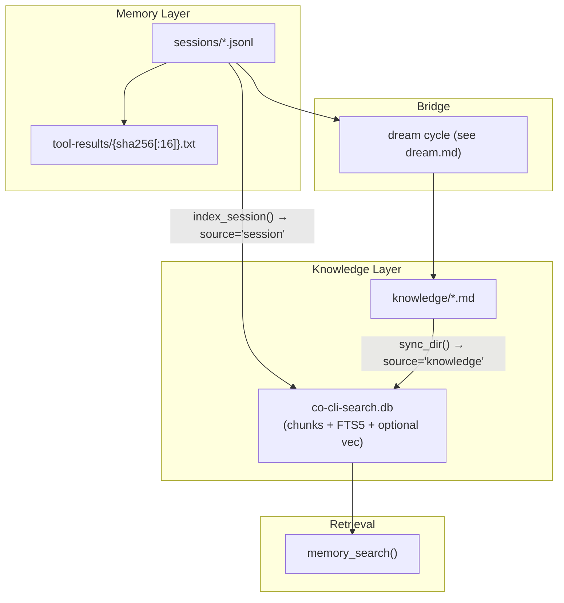

# Co CLI — Memory & Knowledge


> Startup sequencing: [bootstrap.md](bootstrap.md). Turn orchestration: [core-loop.md](core-loop.md). Compaction mechanics: [compaction.md](compaction.md). Dream-cycle mining, merge, decay, archive: [dream.md](dream.md). Tool registration and approval: [tools.md](tools.md).

## 1. Functional Architecture



| Channel | Storage | Recall mechanism |
| --- | --- | --- |
| Sessions | `sessions/*.jsonl` → `co-cli-search.db` (`source='session'`) | BM25 chunk search → best chunk per unique session (dedup) → verbatim citations with JSONL line bounds; no LLM |
| Artifacts | `knowledge/*.md` → `co-cli-search.db` (`source='knowledge'`) | FTS5 BM25 ± RRF vector merge → optional reranker → ranked structured rows; no LLM by default |
| Canon | `souls/{role}/memories/*.md` (in-process scan) | Token-overlap scoring (title 2× weight) → ranked snippets; no FTS DB, no LLM |

`KnowledgeStore` is the shared search backend for both sessions and artifacts. `memory_search()` dispatches all three channels in parallel. Static personality content (soul seed, mindsets, behavioral rules) is injected once at agent construction via `build_static_instructions()` — it is not a recall channel.

## 2. Core Logic

### 2.1 Memory Layer: Session Transcripts

Session transcripts are append-only JSONL files under `sessions_dir` with lexicographically sortable filenames:

```text
YYYY-MM-DD-THHMMSSZ-{uuid8}.jsonl
```

Each JSONL line is one of:

- a message row serialized through `ModelMessagesTypeAdapter`
- a `session_meta` control row written at the start of a branched child transcript
- a `compact_boundary` control row, honored on load for files above the precompact threshold

`persist_session_history()` is the only transcript persistence primitive:

```text
if history was replaced OR persisted_message_count > len(messages):
    new_path = new_session_path(sessions_dir)
    write session_meta(parent_session=<old filename>, reason=<reason>)
    append full compacted history to new_path
    return new_path
else:
    append only messages[persisted_message_count:]
    return existing session_path
```

Behavioral rules:

- Individual transcript files are never rewritten or truncated.
- History replacement never mutates the parent transcript; it branches to a child transcript.
- `CoSessionState.persisted_message_count` is the only durability cursor.
- `load_transcript()` skips malformed lines and `session_meta` rows, honors `compact_boundary` skips for files above 5 MB, and refuses to load transcripts above 50 MB.

### 2.2 Session Lifecycle, Commands, and Spill Files

Startup restore is path-only. `restore_session()` picks the latest `*.jsonl` by filename and sets `deps.session.session_path`; `_chat_loop()` begins with empty in-memory `message_history`. Resuming history is explicit.

Session command behavior:

| Command | Behavior |
| --- | --- |
| `/resume` | `list_sessions()` + interactive picker → `load_transcript(selected.path)`; adopts history and updates `session_path` |
| `/new` | If history is empty, prints "Nothing to rotate"; else assigns a fresh `session_path` and clears in-memory history |
| `/clear` | Clears in-memory history; transcript files untouched |
| `/compact` | Replaces in-memory history with compacted transcript; next write branches to a child session |
| `/sessions [keyword]` | Lists session summaries, optionally filtered by title substring |

Oversized tool results spill to disk. `tool_output()` checks the effective threshold (`ToolInfo.max_result_size` or `config.tools.result_persist_chars`). When exceeded, `persist_if_oversized()` writes to:

```text
tool-results/{sha256[:16]}.txt
```

The model sees a `<persisted-output>` placeholder with tool name, file path, total size, a 2,000-char preview, and guidance to page the full file. Spill files are content-addressed and idempotent. Session files and spill files are `chmod 0o600`.

### 2.3 Static Personality Content

Static personality content is not a recall channel — it is a one-time unconditional load at agent construction.

`build_static_instructions()` assembles soul seed, mindsets, and behavioral rules into the cacheable static prompt. Knowledge artifacts are not injected into the static prompt; they are reachable on demand via `memory_search`.

The dynamic-instructions block (`current_time_prompt()`) is kept to a small volatile suffix — today's date plus conditional safety warnings — so the stable static prefix remains cache-stable across turns.

### 2.4 Sessions Channel: Chunked Episodic Recall

Sessions are indexed as `source='session'` chunks by `KnowledgeStore`:

```text
index_session(path):
    parse uuid8 and created_at from filename
    chunk_session(path) → list[SessionChunk]
    content_hash = sha256(joined chunk texts)
    if hash unchanged AND chunk_count > 0: return  # hash-skip
    index doc row (source='session', path=uuid8, kind='session')
    index_chunks(source='session', doc_path=uuid8, chunks)

sync_sessions(sessions_dir, exclude=current_session):
    for each *.jsonl except excluded:
        index_session(path)
    remove_stale('session', current_uuid8s)
```

`session_chunker.py` pipeline:

- `extract_messages(path)` → `list[ExtractedMessage]` — parses JSONL, skips control lines and noise parts
- `flatten_session(messages)` → `(flat_lines, line_map)` — role-prefixed lines: `User:`, `Assistant:`, `Tool[name](call)`, `Tool[name](return):`
- `chunk_flattened(flat_lines, line_map)` → `list[SessionChunk]` — sliding-window token chunks, each tracking `start_jsonl_line` / `end_jsonl_line`

`init_session_index()` runs at bootstrap. On first run after migration it removes the obsolete `session-index.db` if present.

`memory_search()` operates in two modes:

**Browse mode** (empty query): returns recent-session metadata — session ID, date, title, file size — with zero LLM cost. Excludes the current session.

**Search mode** (keyword query): dispatches sessions, artifacts, and canon channels in parallel.
- Sessions: `KnowledgeStore.search(source='session', limit=15)` → dedup to one best chunk per unique session → cap at 3 (`_SESSIONS_CHANNEL_CAP`)
- To drill into a specific turn: `memory_read_session_turn(session_id, start_line, end_line)` — verbatim JSONL lines, capped at 200 lines / 16 KB

Result shape (sessions): `{channel: "sessions", session_id, when, source, chunk_text, start_line, end_line, score}`

The active session is excluded from the bootstrap sync. Episodic search covers already-indexed transcripts, not the live in-progress session.

### 2.5 Artifacts Channel: Knowledge Artifacts

Knowledge artifacts are reusable facts the agent recalls across sessions: preferences, decisions, rules, feedback, articles, references, and notes.

Storage is dual-layer:

| Layer | What lives there | Purpose |
| --- | --- | --- |
| `knowledge_dir/*.md` | YAML frontmatter + body text | Source of truth; human-editable |
| `co-cli-search.db` | `chunks`, `chunks_fts`, optional `chunks_vec`, `docs` | Derived retrieval layer |

`sync_dir()` keeps the DB current: parses frontmatter, SHA256 hash-skips unchanged files, chunks body text, and writes to `chunks`/`chunks_fts`. Obsidian and Drive connectors index under `source='obsidian'`/`source='drive'`.

Knowledge artifact schema:

| Field | Purpose |
| --- | --- |
| `id` | Stable UUID |
| `artifact_kind` | `preference`, `decision`, `rule`, `feedback`, `article`, `reference`, or `note` |
| `title` | Human-readable label |
| `description` | Short retrieval summary |
| `created` | ISO8601 creation timestamp |
| `updated` | ISO8601 last-modified timestamp |
| `related` | Soft links to related artifacts |
| `source_type` | `detected`, `web_fetch`, `manual`, `obsidian`, `drive`, or `consolidated` |
| `source_ref` | Pointer to source session, URL, file path, or artifact ID |
| `certainty` | `high`, `medium`, or `low` |
| `decay_protected` | Lifecycle protection flag; decay semantics live in [dream.md](dream.md) |
| `last_recalled` | Most recent recall timestamp |
| `recall_count` | Recall hit counter |

RAG pipeline for artifacts recall:

```text
KnowledgeStore.search(query, source='knowledge'):
    fts_chunks = FTS5 BM25 over chunks_fts
    if hybrid:
        vec_chunks = cosine search over chunks_vec
        merged = RRF(fts_chunks, vec_chunks)   # k=60
    else:
        merged = fts_chunks
    return _rerank_results(query, merged, limit)
```

Backends degrade in this order:

| Backend | Mechanism | When used |
| --- | --- | --- |
| `hybrid` | FTS5 BM25 + sqlite-vec cosine, RRF merge | Embedding provider available |
| `fts5` | BM25 over chunked text only | Embeddings unavailable |
| `grep` | In-memory substring match over loaded markdown | KnowledgeStore unavailable |

Optional rerankers (applied after merge, before limit): TEI cross-encoder (`cross_encoder_reranker_url`) takes priority; LLM listwise (`llm_reranker`) as fallback; neither = pass-through.

Result shape (artifacts): `{channel: "artifacts", kind, title, snippet, score, path, slug}`

Canon channel result shape: `{channel: "canon", role, title, body, score}`

Knowledge commands:

| Command | Purpose |
| --- | --- |
| `/knowledge list [query] [flags]` | List matching artifacts |
| `/knowledge count [query] [flags]` | Count matching artifacts |
| `/knowledge forget <query> [flags]` | Delete matching active artifacts after confirmation |

Dream lifecycle commands (`/knowledge dream`, `/knowledge restore`, `/knowledge decay-review`, `/knowledge stats`) live in [dream.md](dream.md). `/memory` is a deprecated alias for `list`, `count`, and `forget`.

### 2.6 Memory → Knowledge Bridge: Agent-Explicit Writes and Dream

Knowledge accumulates through two paths:

1. **`memory_create`** — agent calls during a turn when it recognizes a durable signal. Three dispatch paths in `save_artifact()`:
   - `source_url` set → URL-keyed dedup (web articles); `decay_protected` forced True
   - `consolidation_enabled` → Jaccard dedup; near-identical (>0.9) skipped, overlapping merged
   - else → straight create

2. **`memory_modify`** — append content or surgically replace a passage in an existing artifact. Guards: rejects Read-tool line-number prefixes; for `replace`, target must appear exactly once.

3. **Dream cycle** — at session end when `consolidation_enabled=true`, retrospectively mines past transcripts. See [dream.md](dream.md).

Artifact writes use `_atomic_write()` (temp-file + `os.replace`) and trigger inline reindex via `KnowledgeStore.index()` + `index_chunks()`.

Archive/restore: `archive_artifacts()` moves files to `knowledge_dir/_archive/` and removes them from the FTS index; `restore_artifact()` moves them back and re-indexes. The `_archive/` subdir is never traversed by the default loaders.

### 2.7 Design Lineage

Peer product survey: [docs/reference/RESEARCH-memory-peer-for-co-second-brain.md](../reference/RESEARCH-memory-peer-for-co-second-brain.md).

| Component | Peer source | co_cli location |
| --- | --- | --- |
| Chunked session recall pipeline | `openclaw` | `session_chunker.py`, `KnowledgeStore.index_session()` |
| BM25 + vector hybrid via RRF | `openclaw` | `KnowledgeStore._hybrid_search()` |
| Optional cross-encoder / LLM rerank | `openclaw` | `KnowledgeStore._rerank_results()` |
| Temporal decay | `openclaw` | `co_cli/memory/decay.py` |
| File-based local memory + kind taxonomy | `ReMe` | `knowledge_dir/*.md` + `artifact_kind` field |
| Pre-reasoning on-demand recall | `ReMe` | `memory_search()` tool surface |

Standard RAG primitives (`chunk_size=600 + chunk_overlap=80`, `tokenize='porter unicode61'`) are not peer-specific.

## 3. Config

### Memory Settings

| Setting | Env Var | Default | Description |
| --- | --- | --- | --- |
| `memory.recall_half_life_days` | `CO_MEMORY_RECALL_HALF_LIFE_DAYS` | `30` | age-decay parameter used in recall scoring |

### Knowledge Settings

| Setting | Env Var | Default | Description |
| --- | --- | --- | --- |
| `knowledge.search_backend` | `CO_KNOWLEDGE_SEARCH_BACKEND` | `hybrid` | preferred retrieval backend before runtime degradation |
| `knowledge.embedding_provider` | `CO_KNOWLEDGE_EMBEDDING_PROVIDER` | `tei` | embedding backend (`ollama`, `gemini`, `tei`, `none`) |
| `knowledge.embedding_model` | `CO_KNOWLEDGE_EMBEDDING_MODEL` | `embeddinggemma` | embedding model name |
| `knowledge.embedding_dims` | `CO_KNOWLEDGE_EMBEDDING_DIMS` | `1024` | embedding vector dimensions |
| `knowledge.embed_api_url` | `CO_KNOWLEDGE_EMBED_API_URL` | `http://127.0.0.1:8283` | embedding service URL |
| `knowledge.cross_encoder_reranker_url` | `CO_KNOWLEDGE_CROSS_ENCODER_RERANKER_URL` | `http://127.0.0.1:8282` | TEI cross-encoder reranker URL |
| `knowledge.tei_rerank_batch_size` | *(no env var)* | `50` | batch size for TEI cross-encoder rerank HTTP requests |
| `knowledge.llm_reranker` | *(no env var)* | `null` | LLM reranker config `{provider, model}` (`ollama` or `gemini`) |
| `knowledge.chunk_size` | `CO_KNOWLEDGE_CHUNK_SIZE` | `600` | artifact chunk size in chars during indexing |
| `knowledge.chunk_overlap` | `CO_KNOWLEDGE_CHUNK_OVERLAP` | `80` | artifact chunk overlap in chars |
| `knowledge.session_chunk_tokens` | `CO_KNOWLEDGE_SESSION_CHUNK_TOKENS` | `400` | session chunk size in tokens |
| `knowledge.session_chunk_overlap` | `CO_KNOWLEDGE_SESSION_CHUNK_OVERLAP` | `80` | session chunk overlap in tokens |
| `knowledge.character_recall_limit` | `CO_CHARACTER_RECALL_LIMIT` | `3` | max canon hits per `memory_search` call |
| `knowledge.consolidation_enabled` | `CO_KNOWLEDGE_CONSOLIDATION_ENABLED` | `false` | enable Jaccard dedup on artifact writes |
| `knowledge.consolidation_trigger` | *(no env var)* | `session_end` | when consolidation runs: `session_end` or `manual` |
| `knowledge.consolidation_lookback_sessions` | *(no env var)* | `5` | past sessions to mine during consolidation |
| `knowledge.consolidation_similarity_threshold` | *(no env var)* | `0.75` | Jaccard score threshold for artifact dedup/merge |
| `knowledge.max_artifact_count` | *(no env var)* | `300` | soft cap on total artifact count |
| `knowledge.decay_after_days` | `CO_KNOWLEDGE_DECAY_AFTER_DAYS` | `90` | days before an artifact becomes eligible for decay |

Dream-cycle and lifecycle maintenance settings live in [dream.md](dream.md).

### Paths

| Path | Env Var | Default | Description |
| --- | --- | --- | --- |
| `knowledge_path` | `CO_KNOWLEDGE_PATH` | `~/.co-cli/knowledge/` | source-of-truth knowledge artifact directory |
| `sessions_dir` | — | `~/.co-cli/sessions/` | user-global transcript directory |
| `tool_results_dir` | — | `~/.co-cli/tool-results/` | spill directory for oversized tool results |
| `knowledge_db_path` | — | `~/.co-cli/co-cli-search.db` | unified retrieval DB for knowledge artifacts and session chunks |

## 4. Files

| File | Purpose |
| --- | --- |
| `co_cli/memory/session.py` | session filename parsing, generation, and latest-session discovery |
| `co_cli/memory/transcript.py` | transcript append/load, child-session branching, and control records |
| `co_cli/memory/session_browser.py` | session listing and picker metadata for `/resume` and `/sessions` |
| `co_cli/memory/session_chunker.py` | session transcript chunking pipeline: `flatten_session()`, `chunk_flattened()`, `chunk_session()` |
| `co_cli/memory/indexer.py` | JSONL line parser: `ExtractedMessage`, `extract_messages()` |
| `co_cli/memory/knowledge_store.py` | `KnowledgeStore` — unified FTS5/hybrid search backend, `sync_dir()`, `index_session()`, `sync_sessions()` |
| `co_cli/memory/artifact.py` | `KnowledgeArtifact` schema, kind enums, and artifact loaders |
| `co_cli/memory/service.py` | pure-function write layer: `save_artifact()`, `mutate_artifact()` — no RunContext |
| `co_cli/memory/mutator.py` | `_atomic_write()`, `_reindex_knowledge_file()`, `_update_artifact_body()` — atomic write and RunContext-aware re-index helpers |
| `co_cli/memory/archive.py` | `archive_artifacts()`, `restore_artifact()` — move to/from `_archive/`, de-index and re-index |
| `co_cli/memory/chunker.py` | knowledge artifact text chunking |
| `co_cli/memory/frontmatter.py` | frontmatter parse, validate, and render helpers |
| `co_cli/memory/similarity.py` | Jaccard similarity and content-superset helpers for artifact dedup |
| `co_cli/memory/ranking.py` | confidence scoring and contradiction helpers |
| `co_cli/memory/query.py` | artifact list filtering (`older_than_days`) and display formatting |
| `co_cli/memory/search_util.py` | `normalize_bm25()`, `run_fts()`, `sanitize_fts5_query()`, `snippet_around()` — FTS5 utilities shared by `KnowledgeStore` |
| `co_cli/memory/_embedder.py` | `build_embedder()` — embedding provider dispatch (ollama/gemini/tei/none) |
| `co_cli/memory/_reranker.py` | `build_llm_reranker()` — LLM listwise reranker dispatch (ollama/gemini) |
| `co_cli/memory/_stopwords.py` | `STOPWORDS` frozenset — shared by `similarity.py` and `_canon_recall.py` |
| `co_cli/memory/_window.py` | transcript-window builder used by dream mining |
| `co_cli/memory/decay.py` | artifact decay scoring and eligibility logic |
| `co_cli/memory/dream.py` | dream-cycle orchestration (see [dream.md](dream.md)) |
| `co_cli/tools/memory/recall.py` | `memory_search()` — unified recall tool dispatching sessions, artifacts, and canon |
| `co_cli/tools/memory/read.py` | `memory_list()`, `memory_read_session_turn()`, `grep_recall()` |
| `co_cli/tools/memory/write.py` | `memory_create()`, `memory_modify()` |
| `co_cli/tools/memory/_canon_recall.py` | `search_canon()` — token-overlap scoring over `souls/{role}/memories/*.md` |
| `co_cli/tools/tool_io.py` | oversized tool-result spill, preview placeholders, and size warnings |
| `co_cli/bootstrap/core.py` | `restore_session()`, `init_session_index()` — startup session and index bootstrap |
| `co_cli/context/assembly.py` | `build_static_instructions()` — static system prompt assembly (soul, mindsets, rules) |
| `co_cli/agent/_instructions.py` | `current_time_prompt()` — per-turn date/time and safety warning injection |
| `co_cli/context/prompt_text.py` | `safety_prompt_text()` — doom-loop and shell-reflection warning text |
| `co_cli/personality/prompts/loader.py` | `load_soul_seed`, `load_soul_critique`, `load_soul_mindsets` — personality asset loaders |
| `co_cli/main.py` | `_finalize_turn()` — persistence bridge and session-end dream trigger |
| `co_cli/commands/core.py` | `/resume`, `/new`, `/clear`, `/compact`, `/sessions`, `/knowledge`, `/memory` command handlers |

## 5. Test Gates

| Property | Test file |
| --- | --- |
| FTS5 search finds an indexed artifact entry | `tests/test_flow_memory_search.py` |
| `mutate_artifact` replace preserves frontmatter | `tests/test_flow_memory_lifecycle.py` |
| `mutate_artifact` append adds to body | `tests/test_flow_memory_lifecycle.py` |
| Session restore picks the most recent transcript | `tests/test_flow_bootstrap_session.py` |
