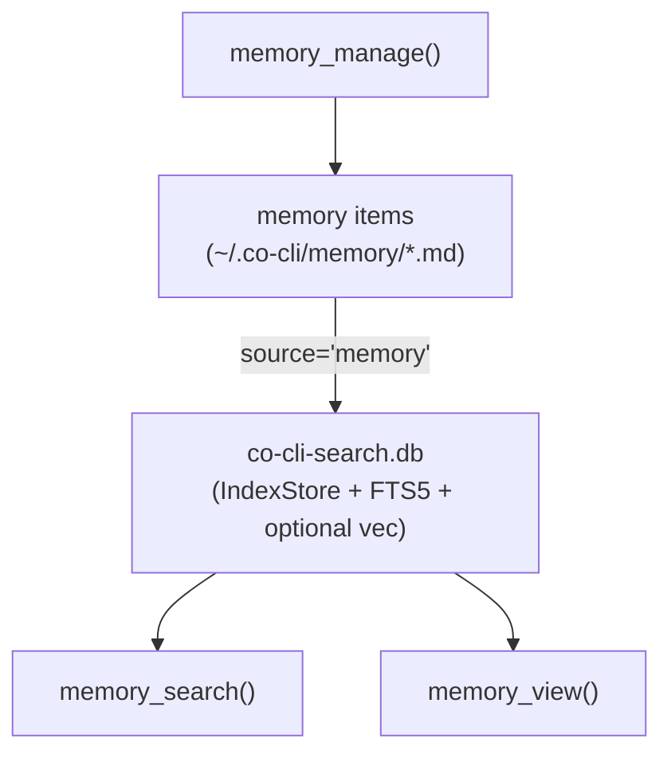

# Co CLI — Memory

> Peer tier: [sessions.md](sessions.md) (past conversation transcripts). Sibling surfaces: [skills.md](skills.md) (procedural capability). Doctrine (auto-injected into static prompt; never queried as memory): [personality.md](personality.md). Tool registration and approval: [tools.md](tools.md). Daemon reviewer + clock-driven housekeeping (merge, decay, archive): [dream.md](dream.md). Prompt assembly: [prompt-assembly.md](prompt-assembly.md). Startup sequencing: [bootstrap.md](bootstrap.md). Turn orchestration: [core-loop.md](core-loop.md).

Foundation spec for the memory tier — long-term declarative memory items (user preferences, rules, articles, notes) that the agent accumulates and recalls.

Memory is one of five operational tiers in the agent loop: **doctrine** ([personality.md](personality.md), identity), **tools** ([tools.md](tools.md), capability), **skills** ([skills.md](skills.md), procedure), **memory** (this file — long-term declarative artifacts), and **session** ([sessions.md](sessions.md) — past conversation transcripts). Memory and session are peer tiers sharing the same index infrastructure but with distinct domain logic, mutation models, and lifecycle policies.

## 1. Functional Architecture

Memory holds long-term declarative memory items: facts the agent has accumulated and that should outlive a single conversation. It is mutable (CRUD via `memory_manage`), kind-typed (user / rule / article / note), and subject to lifecycle (decay, daemon housekeeping merge).

Memory is never injected wholesale into the system prompt. Static personality content (soul seed, mindsets, bundled skill manifest) is injected once at agent construction. Memory items are loaded on-demand through the recall tool surface, keeping context bounded and recall purposeful.



### Tier ontology

| Tier | Storage | Mutation | Indexing |
| --- | --- | --- | --- |
| **memory** (this spec) | `~/.co-cli/memory/*.md` | `memory_manage(action=create/append/replace/delete)` | FTS5 BM25 + optional hybrid; paragraph-aware chunking |
| **session** ([sessions.md](sessions.md)) | `~/.co-cli/sessions/*.jsonl` | append-only via `persist_session_history` | sliding-window token chunks |

Canon scenes (`souls/{role}/canon/*.md`) coexist in the same DB under `source='canon'` for personality auto-injection, but are never returned by any model-callable tool. Skills live on their own tier.

## 2. Architecture layers

```
co_cli/tools/memory/     Agent surface — memory_search, memory_view, memory_manage
        ↓
co_cli/memory/           Domain — MemoryStore (kinds, decay, two-pass search)
        ↓
co_cli/index/            Infrastructure facade — IndexStore (public) + retrieval, embedding, providers (private)
        ↓
                         SQLite + FTS5 + optional sqlite-vec
```

`IndexStore` is the only public class in `co_cli/index/`. `RetrievalService` (FTS + vec + RRF + rerank), `EmbeddingService` (embed + cache), and provider dispatch are private submodules — domain modules never import them directly.

### Retrieval backends

| Backend | Mechanism | When used |
| --- | --- | --- |
| `hybrid` | FTS5 BM25 + sqlite-vec cosine, RRF merge (k=60) | Configured, TEI reranker reachable, embedding provider configured/reachable, and sqlite-vec available |
| `fts5` | BM25 over chunked text only | Explicitly configured, or hybrid degrades before store construction |
| `grep` | In-memory substring over memory item title+content | `memory_store` is `None`; sessions return `[]` in this state |

Optional reranker (applied after merge, before limit): TEI cross-encoder (`cross_encoder_reranker_url`); unconfigured = pass-through.

## 3. Config

| Setting | Env Var | Default | Description |
| --- | --- | --- | --- |
| `memory.search_backend` | `CO_MEMORY_SEARCH_BACKEND` | `hybrid` | preferred retrieval backend before runtime degradation |
| `memory.embedding_provider` | `CO_MEMORY_EMBEDDING_PROVIDER` | `tei` | embedding backend (`ollama`, `gemini`, `tei`, `none`) |
| `memory.embedding_model` | `CO_MEMORY_EMBEDDING_MODEL` | `embeddinggemma` | embedding model name |
| `memory.embedding_dims` | `CO_MEMORY_EMBEDDING_DIMS` | `1024` | embedding vector dimensions |
| `memory.embed_api_url` | `CO_MEMORY_EMBED_API_URL` | `http://127.0.0.1:8283` | embedding service URL |
| `memory.cross_encoder_reranker_url` | `CO_MEMORY_CROSS_ENCODER_RERANKER_URL` | `http://127.0.0.1:8282` | TEI cross-encoder reranker URL |
| `memory.tei_rerank_batch_size` | `CO_MEMORY_TEI_RERANK_BATCH_SIZE` | `50` | batch size for TEI rerank HTTP requests |
| `memory.chunk_tokens` | `CO_MEMORY_CHUNK_TOKENS` | `600` | paragraph-aware chunking budget for memory items |
| `memory.chunk_overlap_tokens` | `CO_MEMORY_CHUNK_OVERLAP_TOKENS` | `80` | chunk overlap |
| `memory.consolidation_similarity_threshold` | `CO_MEMORY_CONSOLIDATION_SIMILARITY_THRESHOLD` | `0.75` | token-Jaccard threshold for write-time dedup and daemon merge clusters |
| `memory.max_item_count` | `CO_MEMORY_MAX_ITEM_COUNT` | `300` | soft corpus-size cap; not directly enforced |
| `memory.decay_after_days` | `CO_MEMORY_DECAY_AFTER_DAYS` | `90` | minimum age before an item is eligible for decay |
| `memory.recall_protection_days` | `CO_MEMORY_RECALL_PROTECTION_DAYS` | `30` | recent-recall window that protects an aged item from decay |
| `memory.recall_half_life_days` | `CO_MEMORY_RECALL_HALF_LIFE_DAYS` | `30` | lifecycle setting; not currently consumed by recall ranking |

Session chunking settings live alongside memory settings under `config.memory.session_chunk_*` since both tiers share the index infrastructure. See [sessions.md](sessions.md) for session-specific config.

### Paths

| Path | Env Var | Default | Description |
| --- | --- | --- | --- |
| `memory_path` | `CO_MEMORY_PATH` | `~/.co-cli/memory/` | memory item source-of-truth directory |
| `sessions_dir` | — | `~/.co-cli/sessions/` | transcript directory |
| `tool_results_dir` | — | `~/.co-cli/tool-results/` | spill directory for oversized tool results |
| `memory_db_path` | — | `~/.co-cli/co-cli-search.db` | unified retrieval DB (memory + session + canon) |

## 4. Public Interface

### Recall and view

| Symbol | Source | Contract |
| --- | --- | --- |
| `memory_search(ctx, query, kinds=None, limit=10)` | `co_cli/tools/memory/recall.py` | Async tool — two-pass ranked recall over memory items; empty query → recent-item browse |
| `memory_view(ctx, name)` | `co_cli/tools/memory/view.py` | Async tool — returns full memory item body by `filename_stem`; frontmatter stripped |

Result fields for `memory_search`: `{kind, title, snippet, score, path, filename_stem}`. Two-pass policy in `co_cli/memory/store.py`: user-kind priority pass (cap `_USER_PRIORITY_CAP=3`) + waterfall over remaining kinds (cap `_WATERFALL_CHUNK_CAP=5`).

### Write

| Symbol | Source | Contract |
| --- | --- | --- |
| `memory_manage(ctx, action, name, content=None, kind=None, section=None)` | `co_cli/tools/memory/manage.py` | Async tool — `create`/`append`/`replace`/`delete`; `approval=True`; subject `tool:memory_manage:<action>:<name>` |

### Domain API

| Symbol | Source | Contract |
| --- | --- | --- |
| `MemoryStore(index, config)` | `co_cli/memory/store.py` | Domain store composing IndexStore — owns memory kinds, two-pass search, decay hooks |
| `MemoryStore.sync_dir(memory_dir)` | `co_cli/memory/store.py` | Hash-based directory indexer for memory items |
| `MemoryStore.search_memory_items(query, kinds, limit)` | `co_cli/memory/store.py` | Two-pass FTS recall with user-kind priority + kind waterfall |
| `MemoryStore.list_memory_items(kinds, limit)` | `co_cli/memory/store.py` | Inventory rows for browse mode |
| `MemoryItem` | `co_cli/memory/item.py` | Reusable memory item data model — user / rule / article / note / canon items share this schema, differentiated by the `memory_kind` field |
| `MemoryKindEnum` | `co_cli/memory/item.py` | USER / RULE / ARTICLE / NOTE (and CANON for the doctrine source) |
| `save_memory_item`, `mutate_memory_item` | `co_cli/memory/service.py` | Pure write functions — no RunContext |

### Index API (cross-tier)

| Symbol | Source | Contract |
| --- | --- | --- |
| `IndexStore` | `co_cli/index/store.py` | Infrastructure facade — schema, write CRUD, transactions, search facade |
| `IndexStore.search(query, sources, kinds, limit)` | `co_cli/index/store.py` | Delegates to private RetrievalService — returns `SearchResult` rows |
| `IndexStore.upsert(...)`, `index_chunks(source, doc_path, chunks)` | `co_cli/index/store.py` | Source-agnostic write CRUD |
| `IndexStore.remove(source, path)`, `remove_stale(source, current_paths)` | `co_cli/index/store.py` | Source-agnostic deletion |
| `Chunk` | `co_cli/index/chunk.py` | Write contract — `(index, content, start_line, end_line)` |
| `SearchResult` | `co_cli/index/_retrieval.py` | Ranked result row |

## 5. Files

### Infrastructure (`co_cli/index/`)

| File | Purpose |
| --- | --- |
| `co_cli/index/store.py` | `IndexStore` — schema, CRUD, transactions, search facade |
| `co_cli/index/chunk.py` | `Chunk` dataclass — write contract |
| `co_cli/index/schema.py` | DDL constants |
| `co_cli/index/_retrieval.py` | `RetrievalService` — FTS + vec + RRF + rerank (private) |
| `co_cli/index/_embedding.py` | `EmbeddingService` — embed + cache (private) |
| `co_cli/index/_providers.py` | ollama / tei / gemini dispatch (private) |
| `co_cli/index/search_util.py` | FTS5 query sanitize, BM25 normalize, snippet helpers |
| `co_cli/index/stopwords.py` | `STOPWORDS` frozenset |

### Memory domain (`co_cli/memory/`)

| File | Purpose |
| --- | --- |
| `co_cli/memory/store.py` | `MemoryStore` — domain store composing IndexStore |
| `co_cli/memory/service.py` | `save_memory_item`, `mutate_memory_item`, `reindex` |
| `co_cli/memory/chunker.py` | `chunk_text` — paragraph-aware chunking |
| `co_cli/memory/item.py` | `MemoryItem`, `MemoryKindEnum`, `IndexSourceEnum` |
| `co_cli/memory/frontmatter.py` | YAML frontmatter parse/render |
| `co_cli/memory/similarity.py` | Jaccard dedup for write-time consolidation and daemon merge |
| `co_cli/memory/decay.py` | Decay candidate identification (consumed by daemon housekeeping) |
| `co_cli/memory/archive.py` | Archive / restore memory item files |

### Tool surface (`co_cli/tools/memory/`)

| File | Purpose |
| --- | --- |
| `co_cli/tools/memory/recall.py` | `memory_search` — ranked recall |
| `co_cli/tools/memory/view.py` | `memory_view` — full memory item body reader |
| `co_cli/tools/memory/manage.py` | `memory_manage` — write surface |

## 6. Growth pipeline and curation discipline

Memory growth has two distinct accumulation modes:

- **Substrate accumulation (passive)** — `web_fetch` → `kind=article` → chunk + embed + index. Substrate lands without distillation; the agent has no obligation to interpret each fetched article at fetch time.
- **Derivative accumulation (deliberate)** — `kind=note` and `kind=rule` items, written through deliberate agent curation. The note/rule tier accumulates only via the inline curation discipline (below) and the session-end reviewer.

```
   web_fetch ─────────────▶ kind=article (raw)
                            source_type=web_fetch
                                    │
   chunk + embed + index ◀──────────┘
                                    │
   memory_search ────▶ recall_count++, last_recalled_at, recall_days
                                    │
                                    ▼
              ┌─────────────────────────────────┐
              │ INLINE AGENT CURATION (doctrine)│
              │ ─ promote: article → note/rule  │
              │ ─ correct: replace on contradict│
              │ ─ drift:   replace/delete stale │
              │ (memory_manage create / replace)│
              └─────────────────────────────────┘
                                    │
   session_end ─────────────────────┤
                                    ▼
              ┌─────────────────────────────────┐
              │ DAEMON SESSION-END WORK         │
              │ ─ memory_review extracts        │
              │   durable facts; saves are      │
              │   tagged source_type=           │
              │   session_review                │
              │ ─ skill_review extracts         │
              │   procedural updates            │
              └─────────────────────────────────┘
                                    │
                                    ▼
              ┌─────────────────────────────────┐
              │ dream merge (note/rule only;    │
              │   articles excluded)            │
              │ dream decay (all kinds, recall- │
              │   protected)                    │
              └─────────────────────────────────┘
                                    │
                                    ▼
              hybrid retrieval over union of articles +
              notes + rules → informs future agent turns
```

### Inline curation surface

Inline curation is a doctrine-level discipline (see `co_cli/context/rules/07_memory_protocol.md`) — promote substrate into notes/rules while research context is hot, replace on user contradiction, replace or delete on drift. No new code path; the rule renders into the static prompt via `build_static_instructions`.

### Session-end reviewers

`memory_review` and `skill_review` (see [dream.md](dream.md)) operate over the session transcript as substrate, extracting durable facts and procedural updates. The session itself is **not** promoted to a first-class memory object — session boundaries are user-defined and arbitrary (lunch, Ctrl+C, task-switch). Reviewer-extracted items are tagged `source_type='session_review'`. See [sessions.md](sessions.md) for the transcript tier and [core-loop.md](core-loop.md) for turn orchestration that triggers session-end kicks.

### Merge and decay (closing the loop)

Dream housekeeping (see [dream.md](dream.md)) collapses note/rule duplicates via Jaccard clustering and archives aged items past `decay_after_days`. Articles are excluded from merge (RAG integrity); recent recall within `recall_protection_days` protects an aged item from decay.

### `source_type` taxonomy

Six values populate `MemoryItem.source_type`:

| source_type | Producer | Meaning |
| --- | --- | --- |
| `web_fetch` | `web_fetch` tool / `save_memory_item` URL branch | raw article substrate from URL fetch |
| `manual` | agent inline saves via `memory_manage(create)` | default for agent-curated notes/rules/articles without URL |
| `obsidian` | Obsidian vault sync | external read-only source |
| `drive` | Google Drive sync | external read-only source |
| `consolidated` | dream merge (`_housekeeping.merge_memory`) | output of duplicate-collapse pass |
| `session_review` | memory reviewer (`_run_memory_review`) | reviewer-extracted durable facts |
