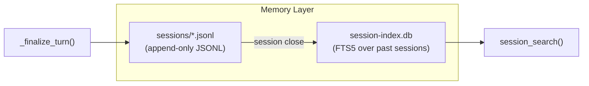

# Co CLI — Memory: Session Transcripts & Episodic Recall

## Product Intent

**Goal:** Define the Memory layer — the raw experiential timeline of every session. Memory preserves exactly what happened, in order, as a permanent append-only record.

**Functional areas:**
- Session transcript persistence (append-only JSONL)
- Session index (FTS5 keyword search over past transcripts)
- Episodic recall via `session_search()`
- Session lifecycle: new, resume, compaction branching

**Non-goals:**
- Reusable artifact storage — that is the Knowledge layer ([cognition.md](cognition.md), [knowledge.md](knowledge.md))
- Lifecycle management — Memory is never consolidated, decayed, or curated
- Semantic or vector retrieval over transcripts

**Success criteria:** Transcripts are append-only and permanent; episodic recall routes through `session_search()`; the Memory layer contains no extracted facts or reusable artifacts.

**Status:** Stable — transcript mechanics predate the two-layer model; terminology aligned with [cognition.md](cognition.md).

**Known gaps:** SessionIndex sync from the current session runs only at session close — the active session is not searchable until the next startup.

---

Memory is the raw experiential layer. Every conversation turn is recorded exactly as it happened, in order, in an append-only JSONL transcript. This layer never consolidates, curates, or loses information — it is the canonical chronological record.

Full session persistence mechanics (per-turn write, compaction branching, `/resume`, `/new`, oversized output spill) live in [context.md](context.md). This spec defines the cognitive role of the Memory layer and its retrieval surface. The two-layer model and the boundary between Memory and Knowledge are defined in [cognition.md](cognition.md).

## 1. What & How

Memory is the session/event timeline. Canonical storage is append-only `.jsonl` transcripts in `sessions_dir`. Each line is a serialized `ModelMessage`. A `SessionIndex` (SQLite FTS5 in `session-index.db`) indexes user prompts and assistant text from past sessions for keyword search.



The Memory layer has one retrieval surface: `session_search()`, which queries `session-index.db` for BM25-ranked keyword excerpts across past conversations. There is no semantic or vector retrieval over transcripts.

## 2. Core Logic

### 2.1 Transcript Persistence

Transcripts are append-only `.jsonl` files under `sessions_dir`. Filename format:

```
YYYY-MM-DD-THHMMSSz-{uuid8}.jsonl
```

Lexicographic sort equals chronological sort. The 8-char UUID suffix is the short display ID. Files are `chmod 0o600`.

Each line is either a `session_meta` control record or a single-element list serialized via pydantic-ai's `ModelMessagesTypeAdapter`. Tool results exceeding 50,000 chars are spilled to `~/.co-cli/tool-results/` and replaced with `<persisted-output>` XML placeholders in the transcript — the placeholder contains the tool name, file path, total char count, and a 2,000-char preview.

History replacement (inline compaction or `/compact`) does not mutate the old transcript — it branches to a new child transcript, writes a `session_meta` lineage record, then writes the full compacted history.

Full mechanics (startup restore, per-turn append accounting, overflow recovery, security constraints) are defined in [context.md §2.3](context.md).

### 2.2 Session Index

`SessionIndex` (SQLite FTS5 in `session-index.db`) indexes user prompts and assistant text from closed sessions. The active session is excluded from indexing until it closes.

Bootstrap initializes the index via `_init_session_index()` during startup. Indexing runs at session close — not inline during a turn.

### 2.3 Episodic Retrieval

`session_search(ctx, query, limit)` is the single retrieval surface into Memory. It queries `session-index.db` for BM25-ranked keyword matches and returns excerpts from past sessions with metadata (date, session ID, snippet). `search_memories()` is a transitional alias that delegates to `session_search()` — see [cognition.md §2.6](cognition.md) for the tool surface.

There is no semantic search, vector retrieval, or cross-session summarization over transcripts.

### 2.4 Memory Layer Constraints

- **Append-only**: transcripts are never rewritten, never truncated, never consolidated
- **No lifecycle management**: Memory does not decay, merge, or curate
- **No reusable artifacts**: all distilled signals derived from conversation belong to the Knowledge layer
- **Grows indefinitely**: sessions accumulate without TTL; manual deletion is the only pruning path
- **No concurrent-instance safety**: no file lock or PID guard (deferred)

## 3. Config

| Setting | Env Var | Default | Description |
|---------|---------|---------|-------------|
| `sessions_dir` | — | `~/.co-cli/sessions/` | Session transcript directory (user-global) |
| Session index | — | `~/.co-cli/session-index.db` | FTS5 index over closed session transcripts |

## 4. Files

| File | Purpose |
|------|---------|
| `co_cli/context/transcript.py` | JSONL transcript: append, load, compact boundary, parent/child session metadata |
| `co_cli/context/session.py` | Session filename generation, latest-session discovery, new-path factory |
| `co_cli/session_index/_store.py` | `SessionIndex` — FTS5 over past session transcripts |
| `co_cli/tools/session_search.py` | `session_search()` — keyword search over transcript index |
