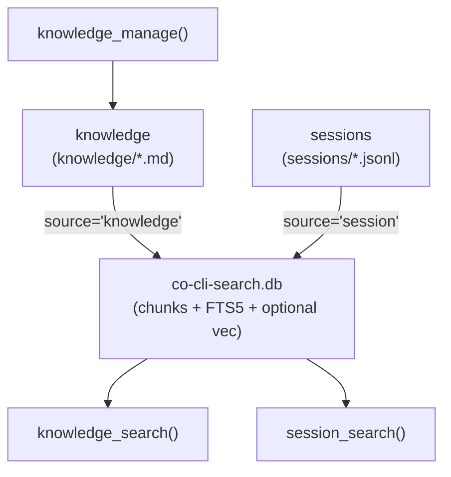

# Co CLI — Memory

> Channel sub-specs: [memory-knowledge.md](memory-knowledge.md) · [memory-sessions.md](memory-sessions.md). Sibling surface (own tier): [skill.md](skill.md). Doctrine (auto-injected into static prompt; never queried as memory): [personality.md](personality.md). Tool registration and approval: [tools.md](tools.md). Dream-cycle mining, merge, decay, archive: [dream.md](dream.md). Prompt assembly: [prompt-assembly.md](prompt-assembly.md). Startup sequencing: [bootstrap.md](bootstrap.md). Turn orchestration: [core-loop.md](core-loop.md). Compaction mechanics: [compaction.md](compaction.md).

Foundation spec for the memory surface — dynamic, declarative state accumulated by the agent through operation. Channel-specific lifecycle (storage, mutation, validation, indexing details, channel-specific test gates) lives in the two sub-specs.

Memory is one of four operational tiers in the agent loop: **doctrine** ([personality.md](personality.md), identity), **tools** ([tools.md](tools.md), capability), **skills** ([skill.md](skill.md), procedure), **memory** (this file — declarative state). Each tier is structurally distinct: doctrine is auto-injected, tools are registered, skills have their own search/view/manage surface, and memory is what the agent accumulates through operation.

## 1. Agentic-Loop Foundation

Memory contributes two channels — session and knowledge — both genuinely dynamic (accumulated by the agent during operation) and declarative (facts, not procedure or identity).

Memory is never injected wholesale into the system prompt. Static personality content (soul seed, mindsets, personality-context artifacts, bundled skill manifest) is injected once at agent construction. Everything else is loaded on-demand through the memory tool surface, keeping context bounded and recall purposeful.

Memory and skill surfaces sit at different operational tiers. Memory holds facts you recall to inform reasoning during a task; skills hold procedures that define how to structure the task itself. The skill surface is documented in [skill.md](skill.md) and governed by [06_skill_protocol.md](../../co_cli/context/rules/06_skill_protocol.md).



## 2. Channel Ontology

| Channel | Sub-spec | Storage | Mutation | Indexing |
| --- | --- | --- | --- | --- |
| **knowledge** | [memory-knowledge.md](memory-knowledge.md) | `~/.co-cli/knowledge/*.md` | `knowledge_manage(action=...)` | FTS5 BM25 + optional hybrid; chunks body text |
| **sessions** | [memory-sessions.md](memory-sessions.md) | `~/.co-cli/sessions/*.jsonl` | append-only via `persist_session_history` | sliding-window token chunks |

Skills and canon are intentionally absent from this table — they live on their own tiers (see [skill.md](skill.md) and [personality.md](personality.md)). Canon is doctrine, auto-injected by the personality system; skills are procedural capability with their own search/view/manage surface.

## 3. Per-Surface Primitives

### §3.1 Session Surface

#### `session_search(query, limit=3)`

Ranked search over session transcripts. Dispatched in `co_cli/tools/memory/recall.py`.

**Browse mode** (empty query): returns recent-session metadata (id, date, title, file size). No FTS. The current session is excluded.

**Search mode** (non-empty query): runs BM25-ranked chunk recall over past sessions, deduped to `_SESSIONS_CHANNEL_CAP=3` unique sessions. No LLM call on the recall path — hits are chunk snippets with line citations.

Result fields: `{session_id, when, source, chunk_text, start_line, end_line, score}`.

#### `session_view(session_id, start_line, end_line)`

Verbatim turn reader. Given a `session_id` (uuid8) and a JSONL line range from a `session_search` hit, returns the raw lines from disk. Lives at `co_cli/tools/memory/view.py`. See [memory-sessions.md](memory-sessions.md) for registration status.

### §3.2 Knowledge Surface

#### `knowledge_search(query, kinds=None, limit=10)`

Ranked search over knowledge artifacts. Dispatched in `co_cli/tools/memory/recall.py`.

**Browse mode** (empty query): returns recent knowledge artifacts (capped). No FTS, no LLM.

**Search mode** (non-empty query): runs a two-pass structure — user-priority pass then waterfall pass. The `kinds` arg restricts to specific artifact kinds; `None` searches all.

Result fields: `{kind, title, snippet, score, path, filename_stem}`.

Channel caps: knowledge user priority `_ARTIFACTS_USER_CAP=3`, knowledge waterfall `_ARTIFACTS_WATERFALL_CHUNK_CAP=5` count / `_ARTIFACTS_WATERFALL_SIZE_CAP=2000` chars.

#### `knowledge_view(name)`

Full body reader for knowledge artifacts by `filename_stem`. Returns the complete artifact markdown. Lives at `co_cli/tools/memory/view.py`.

#### `knowledge_manage(action, ...)`

Write surface for the knowledge channel — see §4 and [memory-knowledge.md](memory-knowledge.md).

Recall pipeline overview:

```
knowledge_search(ctx, query, kinds, limit)              # tools/memory/recall.py
  ├─ _search_artifacts → user + waterfall passes          # see memory-knowledge.md

session_search(ctx, query, limit)                       # tools/memory/recall.py
  └─ _search_sessions  → chunk-cited BM25                 # see memory-sessions.md
```

## 4. Write Surface

One model-callable write surface for the knowledge channel. Sessions are append-only via `persist_session_history` (no `*_manage` tool); skills have their own write surface in [skill.md](skill.md).

| Tool | Channel | Actions | Approval subject pattern |
| --- | --- | --- | --- |
| `knowledge_manage` | knowledge | `create`, `append`, `replace`, `delete` | `tool:knowledge_manage:<action>:<name>` |

Detailed semantics, validation, and approval flow: [memory-knowledge.md §4](memory-knowledge.md).

## 5. Channel-Specific Readers

`knowledge_search` and `session_search` are the discovery surfaces; full-content reads happen through channel-specific readers.

| Tool | Channel | Status | Source |
| --- | --- | --- | --- |
| `session_view(session_id, start_line, end_line)` | session | model-callable | `co_cli/tools/memory/view.py` |
| `knowledge_view(name)` | knowledge | model-callable | `co_cli/tools/memory/view.py` |

`knowledge_search` hits carry a snippet; `knowledge_view(name)` loads the full artifact body by `filename_stem`. `session_search` hits carry chunk snippets with line bounds; `session_view` returns the verbatim lines from disk.

## 6. Indexer

The shared search index lives at `~/.co-cli/co-cli-search.db`. Both memory channels write through `MemoryStore` in `co_cli/memory/memory_store.py`. (The skill index also uses the same DB file via `SkillIndex` — see [skill.md](skill.md) — but it owns the `'skill'` source exclusively and has its own API.)

### `chunks_fts` table

FTS5 full-text index over all chunks. Sources owned by memory:

| Source value | Channel | Chunk strategy |
| --- | --- | --- |
| `'knowledge'` | knowledge | sliding-window body chunks |
| `'session'` | session | sliding-window token chunks via `session_chunker.py` |

Two other sources (`'skill'`, `'canon'`) coexist in the same table — `'skill'` is owned by `SkillIndex` (see [skill.md](skill.md)); `'canon'` is indexed at bootstrap for personality auto-injection only and is never returned by any model-callable tool.

### Write-time indexing

Indexing is write-time, not search-time. Channel-specific entry points: `sync_dir()` for knowledge, `index_session()` / `sync_sessions()` for sessions. See each channel sub-spec for chunking details.

### Retrieval backends

| Backend | Mechanism | When used |
| --- | --- | --- |
| `hybrid` | FTS5 BM25 + sqlite-vec cosine, RRF merge (k=60) | Configured, TEI reranker reachable, embedding provider configured/reachable, and sqlite-vec available |
| `fts5` | BM25 over chunked text only | Explicitly configured, or hybrid degrades before store construction |
| `grep` | In-memory substring over artifact title+content | `memory_store` is `None`; sessions return `[]` in this state |

Optional reranker (applied after merge, before limit): TEI cross-encoder (`cross_encoder_reranker_url`); unconfigured = pass-through.

## 7. Backward-Compat Notes

| Removed / renamed | Replacement |
| --- | --- |
| `memory_create` / `memory_modify` | `knowledge_manage(...)` |
| `artifact_manage` | `knowledge_manage` (tool arg `artifact_kind` → `kind`) |
| `skills_list` and unified recall with `channel='skills'` | `skill_search` |
| Unified recall with `channel='canon'` | Not queryable; canon is auto-injected via the personality system |
| Channel names `artifacts` / `sessions` | `knowledge` / `session` |
| Unified recall with `channel='knowledge'` | `knowledge_search(query, kinds, limit)` |
| Unified recall with `channel='session'` | `session_search(query, limit)` |
| Unified recall (no channel arg) | Use `knowledge_search` or `session_search` depending on intent |
| Verbatim session reader (former name `memory_read_*_turn`) | `session_view(session_id, start_line, end_line)` |

All renames are hard — there are no aliases.

## 8. Files

### Memory core (shared)

| File | Purpose |
| --- | --- |
| `co_cli/memory/memory_store.py` | `MemoryStore` — FTS5/hybrid search, `sync_dir()`, `index_session()`, `sync_sessions()`, generic helpers `list_titles_by_source()` / `get_path_by_title()` |
| `co_cli/memory/_embedder.py` | `build_embedder()` — embedding provider dispatch |
| `co_cli/memory/search_util.py` | `normalize_bm25()`, `run_fts()`, `sanitize_fts5_query()`, `snippet_around()` |
| `co_cli/memory/stopwords.py` | `STOPWORDS` frozenset |

### Memory tool surface

| File | Purpose |
| --- | --- |
| `co_cli/tools/memory/recall.py` | `knowledge_search()` — knowledge ranked recall; `session_search()` — session ranked recall; `_grep_recall()` — knowledge disk-scan fallback (no store) |
| `co_cli/tools/memory/manage.py` | `knowledge_manage()` — knowledge write surface |
| `co_cli/tools/memory/view.py` | `knowledge_view()` — full artifact body reader; `session_view()` — verbatim session turn reader |
| `co_cli/agents/_native_toolset.py` | foreground toolset registration |

### Bootstrap and runtime

| File | Purpose |
| --- | --- |
| `co_cli/bootstrap/core.py` | `restore_session()`, `init_session_index()`, `_sync_canon_store()` (personality-load-only), `create_deps()` |
| `co_cli/main.py` | `_finalize_turn()` — session persistence bridge and session-end dream trigger |
| `co_cli/tools/tool_io.py` | oversized tool-result spill, preview placeholders, size warnings |

Channel-specific files (e.g. `co_cli/memory/artifact.py`, `co_cli/memory/session_chunker.py`) are listed in the respective sub-specs.

## 9. Config

### Shared retrieval settings

| Setting | Env Var | Default | Description |
| --- | --- | --- | --- |
| `knowledge.search_backend` | `CO_KNOWLEDGE_SEARCH_BACKEND` | `hybrid` | preferred retrieval backend before runtime degradation |
| `knowledge.embedding_provider` | `CO_KNOWLEDGE_EMBEDDING_PROVIDER` | `tei` | embedding backend (`ollama`, `gemini`, `tei`, `none`) |
| `knowledge.embedding_model` | `CO_KNOWLEDGE_EMBEDDING_MODEL` | `embeddinggemma` | embedding model name |
| `knowledge.embedding_dims` | `CO_KNOWLEDGE_EMBEDDING_DIMS` | `1024` | embedding vector dimensions |
| `knowledge.embed_api_url` | `CO_KNOWLEDGE_EMBED_API_URL` | `http://127.0.0.1:8283` | embedding service URL |
| `knowledge.cross_encoder_reranker_url` | `CO_KNOWLEDGE_CROSS_ENCODER_RERANKER_URL` | `http://127.0.0.1:8282` | TEI cross-encoder reranker URL |
| `knowledge.tei_rerank_batch_size` | *(no env var)* | `50` | batch size for TEI rerank HTTP requests |
| `memory.recall_half_life_days` | `CO_MEMORY_RECALL_HALF_LIFE_DAYS` | `30` | defined lifecycle setting; not currently consumed by recall ranking |

Channel-specific settings (chunk sizes, consolidation, decay, session chunking) live in the respective sub-specs.

### Paths

| Path | Env Var | Default | Description |
| --- | --- | --- | --- |
| `knowledge_path` | `CO_KNOWLEDGE_PATH` | `~/.co-cli/knowledge/` | knowledge artifact source-of-truth directory |
| `sessions_dir` | — | `~/.co-cli/sessions/` | transcript directory |
| `tool_results_dir` | — | `~/.co-cli/tool-results/` | spill directory for oversized tool results |
| `memory_db_path` | — | `~/.co-cli/co-cli-search.db` | unified retrieval DB (sessions + knowledge; also hosts skill and canon sources owned by other tiers) |

Dream-cycle and lifecycle maintenance settings live in [dream.md](dream.md).
