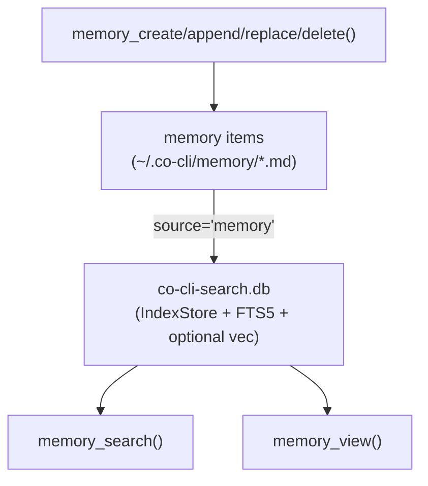

# Co CLI — Memory

> Peer tier: [sessions.md](sessions.md) (past conversation transcripts). Sibling surfaces: [skills.md](skills.md) (procedural capability). Doctrine (auto-injected into static prompt; never queried as memory): [personality.md](personality.md). Tool registration and approval: [tools.md](tools.md). Daemon reviewer + clock-driven housekeeping (merge, decay, archive): [dream.md](dream.md). Prompt assembly: [prompt-assembly.md](prompt-assembly.md). Startup sequencing: [bootstrap.md](bootstrap.md). Turn orchestration: [core-loop.md](core-loop.md).

Foundation spec for the memory tier — long-term declarative memory items (user preferences, rules, articles, notes) that the agent accumulates and recalls.

Memory is one of five operational tiers in the agent loop: **doctrine** ([personality.md](personality.md), identity), **tools** ([tools.md](tools.md), capability), **skills** ([skills.md](skills.md), procedure), **memory** (this file — long-term declarative artifacts), and **session** ([sessions.md](sessions.md) — past conversation transcripts). Memory and session are peer tiers with distinct domain logic, mutation models, and lifecycle policies — memory is curated and hybrid-indexed; session transcripts are uncurated and searched lexically over the raw files (no shared index).

## 1. Functional Architecture

Memory holds long-term declarative memory items: facts the agent has accumulated and that should outlive a single conversation. It is mutable (CRUD via `memory_create`/`memory_append`/`memory_replace`/`memory_delete`), kind-typed (user / rule / article / note), and subject to lifecycle (decay, daemon housekeeping merge).

Memory is never injected wholesale into the system prompt. Static personality content (soul seed, mindsets, bundled skill manifest) is injected once at agent construction. Memory items are loaded on-demand through the recall tool surface, keeping context bounded and recall purposeful.

### Memory vs. files on disk

Memory holds only co's **own curated** declarative items. External file- or folder-based knowledge (a notes vault, a docs tree) is **not** memory and is never re-indexed into the memory DB — a mirrored second copy goes stale and reimplements (worse) what the filesystem already holds. Such data is reached through the file tools ([tools.md](tools.md): `file_search` / `file_read`), which read the filesystem live; `memory_search` covers only the curated memory corpus. The dividing line is **ownership + curation, not file format**: co owns and curates it → memory pipeline; co only reads someone else's folder → file tools. Promoting an external note into durable memory is a deliberate `memory_create` act, never automatic.



### Tier ontology

| Tier | Storage | Mutation | Indexing |
| --- | --- | --- | --- |
| **memory** (this spec) | `~/.co-cli/memory/*.md` | `memory_create` / `memory_append` / `memory_replace` / `memory_delete` | FTS5 BM25 + optional hybrid; paragraph-aware chunking |
| **session** ([sessions.md](sessions.md)) | `~/.co-cli/sessions/*.jsonl` | append-only via `persist_session_history` | none — file-based lexical (ripgrep) search |

Canon scenes (`souls/{role}/canon/*.md`) coexist in the same DB under `source='canon'` for personality auto-injection, but are never returned by any model-callable tool. Skills live on their own tier.

## 2. Architecture layers

```
co_cli/tools/memory/     Agent surface — memory_search, memory_view, memory_create/append/replace/delete
        ↓
co_cli/memory/           Domain — MemoryStore (kinds, decay, two-pass search)
        ↓
co_cli/index/            Infrastructure facade — IndexStore (public) + retrieval, embedding, providers (private)
        ↓
                         SQLite + FTS5 + optional sqlite-vec
```

`IndexStore` is the only public class in `co_cli/index/`. `RetrievalService` (FTS + vec + RRF + rerank), `EmbeddingService` (embed + cache), and provider dispatch are private submodules — domain modules never import them directly.

### Retrieval backends

| Backend | Mechanism | When used |
| --- | --- | --- |
| `hybrid` | FTS5 BM25 + sqlite-vec cosine, RRF merge (k=60) | Configured, TEI reranker reachable, embedding provider configured/reachable, and sqlite-vec available |
| `fts5` | BM25 over chunked text only | Explicitly configured, or hybrid degrades before store construction |
| `grep` | In-memory substring over memory item title+content | `memory_store` is `None` (session search is independent — always file-based) |

Optional reranker (applied after merge, before limit): TEI cross-encoder (`cross_encoder_reranker_url`); unconfigured = pass-through. The reranker is gated to hybrid mode — when the effective backend is not `hybrid` (`fts5`/`grep`), it is passed as `None` regardless of `cross_encoder_reranker_url`, so a lexical backend issues zero reranker calls (a single switch for a fully lexical, no-external-model run).

**Relevance floors** (applied around RRF, never on the fused score itself):
- *Pre-fusion vector floor*: vector-only candidates whose cosine `max(0, 1 - dist)` is below `vector_similarity_floor` are dropped before RRF merge. BM25/lexical hits are always kept — a literal token match is never culled by the vector floor.
- *Post-fusion reranker floor*: when the TEI reranker call succeeds, reranked candidates scoring below `rerank_score_floor` are dropped. Skipped when the reranker is absent or its breaker is open (no calibrated score to floor); an all-below-floor result stays breaker-closed.

When a hybrid query degrades to FTS at runtime (embedder unreachable or vector leg errors), an `index.hybrid_degraded_to_fts` event is emitted on the active `index.search` span — visible in `co tail` / `co trace`.

Each candidate's text sent to the reranker is truncated to `rerank_text_char_budget` chars (default 512; the title is prepended and never clipped). The cross-encoder runs one forward pass per `(query, candidate)` pair, so its latency scales with `candidate_count × tokens_per_candidate` — an untruncated batch of ~50 large chunks costs ~14s, while a 512-char cap holds it to ~2s. Relevance scoring saturates well within 512 chars, so the cap is a no-op for the ~54% of chunks already shorter than it and preserves ranking fidelity on the rest (see `docs/REPORT-rerank-latency-calibration.md` for the calibration).

## 3. Config

| Setting | Env Var | Default | Description |
| --- | --- | --- | --- |
| `memory.search_backend` | `CO_MEMORY_SEARCH_BACKEND` | `hybrid` | preferred retrieval backend before runtime degradation |
| `memory.embedding_provider` | `CO_MEMORY_EMBEDDING_PROVIDER` | `tei` | embedding backend (`ollama`, `gemini`, `tei`, `none`) |
| `memory.embedding_model` | `CO_MEMORY_EMBEDDING_MODEL` | `embeddinggemma` | embedding model name |
| `memory.embedding_dims` | `CO_MEMORY_EMBEDDING_DIMS` | `1024` | embedding vector dimensions |
| `memory.embed_api_url` | `CO_MEMORY_EMBED_API_URL` | `http://127.0.0.1:8283` | embedding service URL |
| `memory.cross_encoder_reranker_url` | `CO_MEMORY_CROSS_ENCODER_RERANKER_URL` | `http://127.0.0.1:8282` | TEI cross-encoder reranker URL |
| `memory.tei_rerank_batch_size` | `CO_MEMORY_TEI_RERANK_BATCH_SIZE` | `50` | batch size for TEI rerank HTTP requests |
| `memory.rerank_text_char_budget` | `CO_MEMORY_RERANK_TEXT_CHAR_BUDGET` | `512` | per-candidate char cap on reranker input (bounds cross-encoder latency) |
| `memory.vector_similarity_floor` | `CO_MEMORY_VECTOR_SIMILARITY_FLOOR` | `0.02` | min vector cosine `max(0,1-dist)` for a vector-only candidate to enter RRF (lexical hits exempt) |
| `memory.rerank_score_floor` | `CO_MEMORY_RERANK_SCORE_FLOOR` | `0.2` | min TEI reranker score to keep a reranked hit (unbounded range; only when reranker succeeds) |
| `memory.chunk_tokens` | `CO_MEMORY_CHUNK_TOKENS` | `600` | paragraph-aware chunking budget for memory items |
| `memory.chunk_overlap_tokens` | `CO_MEMORY_CHUNK_OVERLAP_TOKENS` | `80` | chunk overlap |
| `memory.consolidation_similarity_threshold` | `CO_MEMORY_CONSOLIDATION_SIMILARITY_THRESHOLD` | `0.75` | token-Jaccard threshold for write-time dedup and daemon merge clusters |
| `memory.decay_after_days` | `CO_MEMORY_DECAY_AFTER_DAYS` | `90` | minimum age before an item is eligible for decay |
| `memory.recall_protection_days` | `CO_MEMORY_RECALL_PROTECTION_DAYS` | `30` | recent-recall window that protects an aged item from decay |

Session search is file-based (ripgrep) and has no configurable settings; the `memory.*` knobs above govern the memory/canon hybrid index only. See [sessions.md](sessions.md) for the session tier.

### Paths

| Path | Env Var | Default | Description |
| --- | --- | --- | --- |
| `memory_path` | `CO_MEMORY_PATH` | `~/.co-cli/memory/` | memory item source-of-truth directory |
| `sessions_dir` | — | `~/.co-cli/sessions/` | transcript directory |
| `tool_results_dir` | — | `~/.co-cli/tool-results/` | spill directory for oversized tool results |
| `memory_db_path` | — | `~/.co-cli/co-cli-search.db` | hybrid retrieval DB (memory + canon; sessions are file-based, not indexed here) |

## 4. Public Interface

### Recall and view

| Symbol | Source | Contract |
| --- | --- | --- |
| `memory_search(ctx, query, kinds=None, limit=10)` | `co_cli/tools/memory/recall.py` | Async tool — two-pass ranked recall over memory items; empty query → recent-item browse |
| `memory_view(ctx, name)` | `co_cli/tools/memory/view.py` | Async tool — returns full memory item body by `filename_stem`; frontmatter stripped |

Result fields for `memory_search`: `{kind, title, snippet, score, path, filename_stem}`. Two-pass policy in `co_cli/memory/store.py`: user-kind priority pass (cap `_USER_PRIORITY_CAP=3`) + waterfall over remaining kinds (cap `_WATERFALL_CHUNK_CAP=5`).

### Write

| Symbol | Source | Contract |
| --- | --- | --- |
| `memory_create(ctx, name_title, content, kind, source_type=SourceTypeEnum.MANUAL, source_url=None)` | `co_cli/tools/memory/manage.py` | Async tool — `approval=True`; subject `tool:memory_create:<name_title>`. `name_title` is the new artifact's title (the `filename_stem` is derived). With `source_url=…` + `kind="article"`: URL-keyed dedup branch fires — re-saves consolidate (same `artifact_id`, `existing.related` preserved) instead of duplicating; `source_type` defaults to `web_fetch` and `decay_protected=True`. Resets `turns_since_memory_review = 0`. |
| `memory_append(ctx, filename_stem, content)` | `co_cli/tools/memory/manage.py` | Async tool — `approval=True`; subject `tool:memory_append:<filename_stem>`. Appends to an existing artifact body; `filename_stem` from a `memory_search` hit. Resets `turns_since_memory_review = 0`. |
| `memory_replace(ctx, filename_stem, section, content)` | `co_cli/tools/memory/manage.py` | Async tool — `approval=True`; subject `tool:memory_replace:<filename_stem>`. Replaces `section` (must appear exactly once) with `content`. Resets `turns_since_memory_review = 0`. |
| `memory_delete(ctx, filename_stem)` | `co_cli/tools/memory/manage.py` | Async tool — `approval=True`; subject `tool:memory_delete:<filename_stem>`. Removes the artifact file and its index entries. Does **not** reset `turns_since_memory_review`. |

### Domain API

| Symbol | Source | Contract |
| --- | --- | --- |
| `MemoryStore(index, config)` | `co_cli/memory/store.py` | Domain store composing IndexStore — owns memory kinds, two-pass search, decay hooks |
| `MemoryStore.sync_dir(memory_dir)` | `co_cli/memory/store.py` | Hash-based directory indexer for memory items |
| `MemoryStore.search_memory_items(query, kinds, limit)` | `co_cli/memory/store.py` | Two-pass FTS recall with user-kind priority + kind waterfall |
| `MemoryStore.list_memory_items(kinds, limit)` | `co_cli/memory/store.py` | Inventory rows for browse mode |
| `MemoryItem` | `co_cli/memory/item.py` | Reusable memory item data model — user / rule / article / note / canon items share this schema, differentiated by the `memory_kind` field |
| `MemoryKindEnum` | `co_cli/memory/item.py` | USER / RULE / ARTICLE / NOTE (and CANON for the doctrine source) |
| `save_memory_item`, `mutate_memory_item` | `co_cli/memory/service.py` | Pure write functions — no RunContext |

### Index API (cross-tier)

| Symbol | Source | Contract |
| --- | --- | --- |
| `IndexStore` | `co_cli/index/store.py` | Infrastructure facade — schema, write CRUD, transactions, search facade |
| `IndexStore.search(query, sources, kinds, limit)` | `co_cli/index/store.py` | Delegates to private RetrievalService — returns `SearchResult` rows |
| `IndexStore.upsert(...)`, `index_chunks(source, doc_path, chunks)` | `co_cli/index/store.py` | Source-agnostic write CRUD |
| `IndexStore.remove(source, path)`, `remove_stale(source, current_paths)` | `co_cli/index/store.py` | Source-agnostic deletion |
| `Chunk` | `co_cli/index/chunk.py` | Write contract — `(index, content, start_line, end_line)` |
| `SearchResult` | `co_cli/index/_retrieval.py` | Ranked result row |

## 5. Files

### Infrastructure (`co_cli/index/`)

| File | Purpose |
| --- | --- |
| `co_cli/index/store.py` | `IndexStore` — schema, CRUD, transactions, search facade |
| `co_cli/index/chunk.py` | `Chunk` dataclass — write contract |
| `co_cli/index/schema.py` | DDL constants |
| `co_cli/index/_retrieval.py` | `RetrievalService` — FTS + vec + RRF + rerank (private) |
| `co_cli/index/_embedding.py` | `EmbeddingService` — embed + cache (private) |
| `co_cli/index/_providers.py` | ollama / tei / gemini dispatch (private) |
| `co_cli/index/search_util.py` | FTS5 query sanitize, BM25 normalize, snippet helpers |
| `co_cli/index/stopwords.py` | `STOPWORDS` frozenset |

### Memory domain (`co_cli/memory/`)

| File | Purpose |
| --- | --- |
| `co_cli/memory/store.py` | `MemoryStore` — domain store composing IndexStore |
| `co_cli/memory/service.py` | `save_memory_item`, `mutate_memory_item`, `reindex` |
| `co_cli/memory/chunker.py` | `chunk_text` — paragraph-aware chunking |
| `co_cli/memory/item.py` | `MemoryItem`, `MemoryKindEnum`, `IndexSourceEnum` |
| `co_cli/memory/frontmatter.py` | YAML frontmatter parse/render |
| `co_cli/memory/similarity.py` | Jaccard dedup for write-time consolidation and daemon merge |
| `co_cli/memory/decay.py` | Decay candidate identification (consumed by daemon housekeeping) |
| `co_cli/memory/archive.py` | Archive / restore memory item files |

### Tool surface (`co_cli/tools/memory/`)

| File | Purpose |
| --- | --- |
| `co_cli/tools/memory/recall.py` | `memory_search` — ranked recall |
| `co_cli/tools/memory/view.py` | `memory_view` — full memory item body reader |
| `co_cli/tools/memory/manage.py` | `memory_create` / `memory_append` / `memory_replace` / `memory_delete` — write surface |

## 6. Growth pipeline and curation discipline

Memory growth has two distinct accumulation modes:

- **Article accumulation (agent-mediated)** — `web_fetch` produces transient content; the agent decides whether the page is worth keeping and then calls `memory_create(kind="article", source_url=…, content=…)`. There is **no** automatic `web_fetch → save_memory_item` wire — the two tools are isolated and the agent composes them. Passing `source_url` enables URL-keyed dedup: re-saves of the same URL consolidate onto the existing article (same `artifact_id`, content updated, `existing.related` preserved) and the item is stamped `source_type=web_fetch`, `source_ref=<url>`, `decay_protected=True`. Absent `source_url`, articles fall back to the Jaccard-dedup path with `source_type=manual`, identical to notes/rules.
- **Derivative accumulation (deliberate)** — `kind=note` and `kind=rule` items, written through deliberate agent curation. The note/rule tier accumulates only via the inline curation discipline (below) and the session-end reviewer.

```
   web_fetch ──▶ transient content (no auto-save)
                                    │
   agent decides: worth keeping?    │
                                    ▼
   memory_create(kind=article, source_url=…)
                                    │
                                    ▼
   save_memory_item URL-keyed branch:
     ─ new URL: write article, source_type=web_fetch,
                source_ref=<url>, decay_protected=True
     ─ same URL: consolidate (same artifact_id, content
                 updated, existing related preserved)
                                    │
   chunk + embed + index ◀──────────┘
                                    │
   memory_search ────▶ recall_count++, last_recalled_at, recall_days
                                    │
                                    ▼
              ┌─────────────────────────────────┐
              │ INLINE AGENT CURATION (doctrine)│
              │ ─ promote: article → note/rule  │
              │ ─ correct: replace on contradict│
              │ ─ drift:   replace/delete stale │
              │ (memory_create / memory_replace)│
              └─────────────────────────────────┘
                                    │
   session_end ─────────────────────┤
                                    ▼
              ┌─────────────────────────────────┐
              │ DAEMON SESSION-END WORK         │
              │ ─ memory_review extracts        │
              │   durable facts; saves are      │
              │   tagged source_type=           │
              │   session_review                │
              │ ─ skill_review extracts         │
              │   procedural updates            │
              └─────────────────────────────────┘
                                    │
                                    ▼
              ┌─────────────────────────────────┐
              │ dream merge (note/rule only;    │
              │   articles excluded)            │
              │ dream decay (all kinds, recall- │
              │   protected)                    │
              └─────────────────────────────────┘
                                    │
                                    ▼
              hybrid retrieval over union of articles +
              notes + rules → informs future agent turns
```

### Inline curation surface

Inline curation is a doctrine-level discipline (see `co_cli/context/rules/07_memory_protocol.md`) — promote substrate into notes/rules while research context is hot, replace on user contradiction, replace or delete on drift. No new code path; the rule renders into the static prompt via `build_base_instructions`.

### Session-end reviewers

`memory_review` and `skill_review` (see [dream.md](dream.md)) operate over the session transcript as substrate, extracting durable facts and procedural updates. The session itself is **not** promoted to a first-class memory object — session boundaries are user-defined and arbitrary (lunch, Ctrl+C, task-switch). Reviewer-extracted items are tagged `source_type='session_review'`. See [sessions.md](sessions.md) for the transcript tier and [core-loop.md](core-loop.md) for turn orchestration that triggers session-end kicks.

### Merge and decay (closing the loop)

Dream housekeeping (see [dream.md](dream.md)) collapses note/rule duplicates via Jaccard clustering and archives aged items past `decay_after_days`. Articles are excluded from merge (RAG integrity); recent recall within `recall_protection_days` protects an aged item from decay.

### `source_type` taxonomy

Five values populate `MemoryItem.source_type`:

| source_type | Producer | Meaning |
| --- | --- | --- |
| `web_fetch` | `save_memory_item` URL-keyed branch, fired when the agent calls `memory_create(kind=article, source_url=…)` | curated article saved with a URL for dedup; re-saves with the same URL consolidate (same `artifact_id`, existing `related` preserved). `web_fetch` itself does not write memory — the agent composes the two tools. |
| `manual` | agent inline saves via `memory_create` | default for agent-curated notes/rules/articles without URL |
| `drive` | Google Drive sync | external read-only source |
| `consolidated` | dream merge (`_housekeeping.merge_memory`) | output of duplicate-collapse pass |
| `session_review` | memory reviewer (`_run_memory_review`) | reviewer-extracted durable facts |
