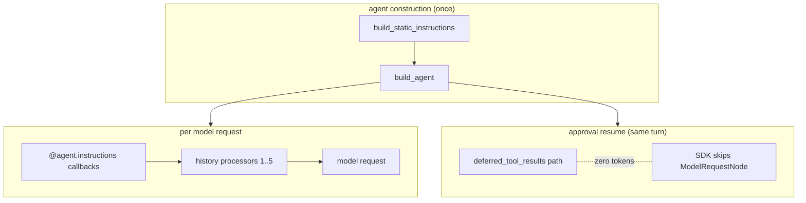

# Co CLI — Prompt Assembly

## Product Intent

**Goal:** Own how instruction layers, dynamic instruction callbacks, and history processors combine to produce the outbound model request on every turn.
**Functional areas:**
- Static instruction assembly (soul + rules + examples + critique)
- Dynamic instruction callbacks (`@agent.instructions`)
- Registered history-processor pipeline and ordering, plus two preflight callables (safety injection, canon recall injection)
- Append-only invariant for dynamic content (cache hygiene)
- Approval resume reusing the main agent

**Non-goals:**
- Compaction internals (owned by [compaction.md](compaction.md))
- Memory/session persistence and transcript recall (owned by [memory.md](memory.md))
- Reusable knowledge schema and retrieval (owned by [memory.md](memory.md))
- Provider wire format past the pydantic-ai SDK boundary

**Success criteria:** Prompt-prefix cache hit rate preserved across turns; dynamic content appended to the tail, never woven into `@agent.instructions`; approval resumes add zero new tokens.
**Status:** Stable
**Known gaps:** None.

---

Covers how `co-cli` shapes the prompt for each model request. Startup sequencing lives in [bootstrap.md](bootstrap.md); turn orchestration in [core-loop.md](core-loop.md); compaction mechanics in [compaction.md](compaction.md); memory/session and knowledge internals in [memory.md](memory.md); tool registration in [tools.md](tools.md).

## 1. What & How

The agent has no persistent state in model weights. Each request is reconstructed from three layers with different lifecycles:

- **Static instructions** — assembled once at agent construction; never mutated during the session.
- **Dynamic instruction layers** — `@agent.instructions` callbacks evaluated fresh on every model request.
- **Message history** — transformed before every request by an ordered processor pipeline whose detailed behavior is owned by the relevant subsystem specs.

## 2. Core Logic

### 2.1 Static Instruction Assembly

`build_agent()` assembles `static_instructions` from up to four ordered parts, all evaluated once at agent construction:

1. **`build_static_instructions(config)`** — soul seed, mindsets, numbered rules (`co_cli/context/rules/NN_rule_id.md`), recency advisory. Character memories and critique are NOT included here.
2. **`build_toolset_guidance(tool_registry.tool_index)`** — tool-specific guidance blocks, each gated on the tool being present. Currently gated: `memory_search` → `MEMORY_GUIDANCE`; `capabilities_check` → `CAPABILITIES_GUIDANCE`. Empty when no matching tools exist.
3. **`build_category_awareness_prompt(tool_registry.tool_index)`** — single-sentence category-level hint listing deferred tool categories reachable via `search_tools`. Derived from `VisibilityPolicyEnum.DEFERRED` entries. Empty when no deferred tools exist.
4. **`load_soul_critique(config.personality)`** — self-assessment lens (`## Review lens`), appended last when a personality is configured and a critique file exists. Placed after operational guidance so the review frame wraps the complete prompt.

The parts are joined with `"\n\n"` and passed as the `instructions=` string to `Agent(...)`. The string is stable for the entire session — it never changes between turns.

Each personality role is fully self-contained under `souls/{role}/`. Adding a role requires only a new directory — no Python changes. Adding a tool-specific guidance block requires adding a constant to `co_cli/context/guidance.py` and a gate in `build_toolset_guidance`.

### 2.2 Dynamic Instruction Layers

Registered in `build_agent()` (`co_cli/agent/core.py`), evaluated fresh per request:

| Layer | Condition | Content |
| --- | --- | --- |
| `safety_prompt` | doom loop or shell-error streak active | warning text injected into instructions context |
| `current_time_prompt` | always | current date and time string (`"Current time: Monday, April 28, 2026 08:13 AM"`) |

These layers are **not** persisted into `message_history`.

### 2.3 Append-only Invariant for Dynamic Content

Any content that can vary within a single session MUST be appended to the tail of the message list via a history processor that returns `[*messages, injection]`. It MUST NOT be placed in `@agent.instructions`.

**Rationale:** `@agent.instructions` output is concatenated into the static system-prompt block pydantic-ai sends to the provider. Providers cache the system-prompt block as the prefix of every request. Any per-request variance in that block invalidates the cache for the entire prefix, including fixed tool schemas and soul assets.

New dynamic surfaces go in the tail. Audit every new `@agent.instructions` registration against this rule. The current date/time is injected via `current_time_prompt` — a per-turn callback that lands in Block 1 (non-cached, tiny), keeping Block 0 cache-stable.

### 2.4 History Processors And Dynamic Instructions

Three pure-transformer processors run in this exact order (registered in `build_agent()`):

| Processor | Behavior |
| --- | --- |
| `truncate_tool_results` | clears older `ToolReturnPart` content per tool type; keeps 5 most recent per type; always protects last user turn |
| `enforce_batch_budget` | spills largest non-persisted `ToolReturnPart`s in the current batch when aggregate size exceeds `config.tools.batch_spill_chars`; fails open |
| `proactive_window_processor` | when history exceeds compaction threshold, replaces the middle with an LLM summary or static marker; full design in [compaction.md](compaction.md) |

Two dynamic instruction functions are registered via `agent.instructions()` and run before every model request:

| Dynamic instruction | Behavior |
| --- | --- |
| `safety_prompt` | detects identical-tool-call streaks and shell-error streaks; returns warning text injected into the instructions context |
| `current_time_prompt` | returns current date/time string at tail position — ephemeral grounding just before the model sees the user turn; keeps Block 0 cache-stable |

**Ordering rationale:**
- **#1–2 before #3**: truncation runs before summarization. The summarizer sees partially cleared content but receives rich side-channel context (file working set, todos) to compensate.
- **`safety_prompt` before `current_time_prompt`**: structural behavioral guidance sits above ephemeral grounding. `current_time_prompt` is at the tail — the last thing the model sees before the user turn — because ephemeral grounding is most effective close to the user message.
- **Dynamic instructions before model request**: these functions run via the SDK's `agent.instructions()` mechanism; their output is ephemeral — not stored back to `turn_state.current_history`.

### 2.5 Approval Resume

Approval resumes reuse the main agent with zero additional tokens. The pydantic-ai SDK skips `ModelRequestNode` entirely on the `deferred_tool_results` path, so the segment continues from exactly where the deferred call paused. No separate resume agent is needed. Approval subject resolution and the resume loop live in [core-loop.md](core-loop.md) §2.3.

## 3. Config

Only the settings that directly shape prompt text are listed here. Compaction thresholds live in [compaction.md](compaction.md); recall parameters live in [memory.md](memory.md).

| Setting | Env Var | Default | Description |
| --- | --- | --- | --- |
| `personality` | `CO_PERSONALITY` | `tars` | personality for static prompt assembly |
| `doom_loop_threshold` | `CO_DOOM_LOOP_THRESHOLD` | `3` | identical-tool-call streak for warning injection |
| `max_reflections` | `CO_MAX_REFLECTIONS` | `3` | shell-error streak for reflection-cap injection |

## 4. Files

| File | Purpose |
| --- | --- |
| `co_cli/agent/core.py` | main-agent and delegation-agent construction; history-processor and instruction registration |
| `co_cli/agent/_instructions.py` | per-turn instruction callbacks: `current_time_prompt`, `safety_prompt` |
| `co_cli/context/assembly.py` | `build_static_instructions()` — soul + mindsets + rules + recency advisory; rule-file validation |
| `co_cli/context/guidance.py` | `MEMORY_GUIDANCE`, `CAPABILITIES_GUIDANCE` constants; `build_toolset_guidance()` — gated on tool presence |
| `co_cli/personality/prompts/loader.py` | `load_soul_seed`, `load_soul_critique`, `load_soul_mindsets` — personality asset loaders |
| `co_cli/personality/prompts/validator.py` | personality discovery and file validation |
| `co_cli/context/prompt_text.py` | `safety_prompt_text` — called via `agent.instructions()` wrapper in `agent/_instructions.py` |
| `co_cli/tools/deferred_prompt.py` | `build_category_awareness_prompt()` — category-level hint for deferred tool categories; called at build time |
