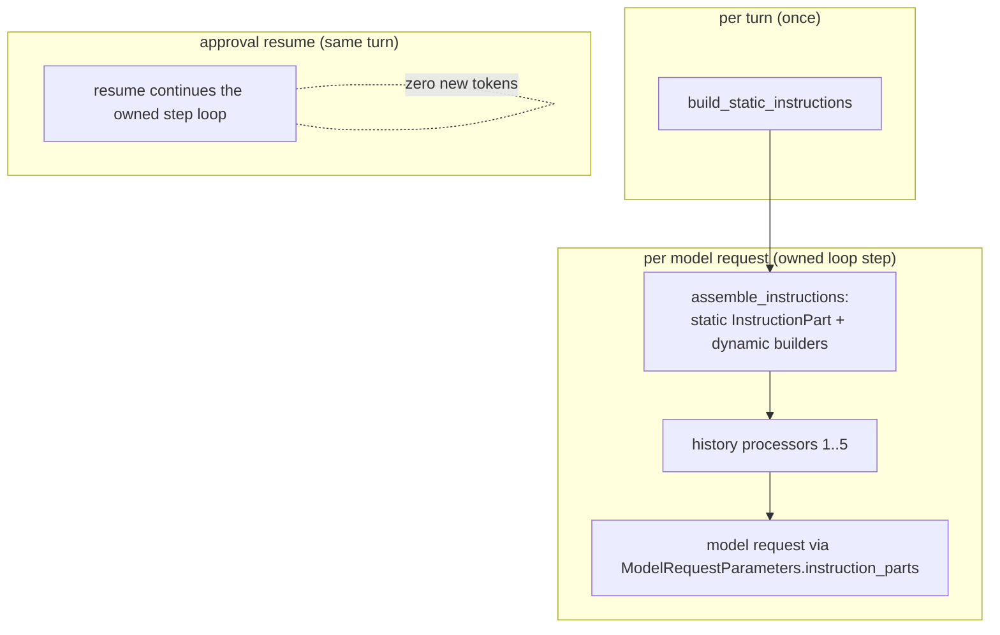

# Co CLI — Prompt Assembly


Covers how `co-cli` shapes the prompt for each model request. Startup sequencing lives in [bootstrap.md](bootstrap.md); turn orchestration in [core-loop.md](core-loop.md); compaction mechanics in [compaction.md](compaction.md); memory (sessions, memory items, canon recall) in [memory.md](memory.md); tool registration in [tools.md](tools.md).

## 1. What & How

The agent has no persistent state in model weights. Each request is reconstructed from three layers with different lifecycles:

- **Static instructions** — assembled once per turn by the owned loop; never mutated within the turn.
- **Dynamic instruction layers** — per-turn instruction builders evaluated fresh on every model request (every step of the owned loop).
- **Message history** — transformed before every request by an ordered processor pipeline whose detailed behavior is owned by the relevant subsystem specs.



## 2. Core Logic

### 2.1 Static Instruction Assembly

`build_static_instructions(deps)` (`co_cli/agent/preflight.py`) assembles `static_instructions` by calling each builder in `ORCHESTRATOR_SPEC.static_instruction_builders` in order — five thin closures, each taking `deps` and returning `str | None`. The owned loop calls it once at turn start (`run_turn_owned`, `co_cli/agent/loop.py`), so the static block is stable across every step of the turn — it is the cacheable prefix:

1. **`_base_instructions_provider(deps)`** — wraps `build_base_instructions(deps.config)`: soul seed, mindsets, numbered rules (`co_cli/context/rules/NN_rule_id.md`), recency advisory. The numbered rules are the profile-agnostic **base** (shared intersection). Character memories and critique are NOT included here.
2. **`_model_profile_overlay_provider(deps)`** — wraps `build_profile_overlay(resolve_model_profile(deps.config.llm))`: the resolved model profile's **append-only overlay** (`co_cli/context/overlays/<profile>.md`), placed immediately after the base so the composed prompt is `base + overlay(profile)`. Append-only — the overlay only ADDS profile-specific prose; nothing in the base is filtered or removed. Returns `None` when the profile's overlay file is absent or empty. `overlays/weak_local.md` ships the weak-model scaffolding relocated out of the (now profile-agnostic) base — the intent taxonomy, act-this-turn Execution, sub-goal Completeness, over-planning calibration, error-recovery loop-prevention, and the no-preamble half of the conciseness reflex; `overlays/frontier.md` is absent today, so the frontier composition reduces to base alone (its planned cost-cliff conciseness delta is deferred to the frontier-overlay plan). The universal conciseness *floor* (density, lead-with-outcome, don't-restate) is NOT weak-specific — it lives in BASE `01_interaction` and reaches every profile; each overlay adds only its profile-specific delta on top. `ModelProfile` is resolved from the configured provider (Ollama → `WEAK_LOCAL`, otherwise `FRONTIER`) in `co_cli/config/llm.py`.
3. **`_user_profile_provider(deps)`** — reads `deps.user_profile_path` (`~/.co-cli/USER.md`) once and wraps it in a `## USER PROFILE (who the user is)` block; gated on `deps.config.memory.user_profile_enabled`. Returns `None` when the flag is off or the file is empty, so an absent profile injects nothing. Snapshot-at-load, frozen for the session. See [memory.md](memory.md) §7.
4. **`_toolset_guidance_provider(deps)`** — wraps `build_toolset_guidance(deps.tool_catalog)`: tool-specific guidance blocks, each gated on the tool being present. Currently gated: `capabilities_check` → `CAPABILITIES_GUIDANCE`. Empty when no matching tools exist.
5. **`_personality_critique_provider(deps)`** — wraps `load_soul_critique(deps.config.personality)` and prefixes with `## Review lens` heading; appended last when a personality is configured and a critique file exists. Placed after operational guidance so the review frame wraps the complete prompt.

The parts are joined with `"\n\n"` into the static `static_instructions` string (`build_static_instructions`). Per step, `assemble_instructions()` (`co_cli/agent/preflight.py`) wraps it in a single `InstructionPart(dynamic=False)` — the cacheable prefix — placed first in the request's instruction-part list. The string is stable for the entire turn — it never changes between steps. The skill manifest and deferred-tool awareness are NOT in this block — they are emitted as the per-turn dynamic instruction parts (§2.2) so that `skill_catalog` / `tool_catalog` mutations do not churn the cached prefix bytes.

Each personality role is fully self-contained under `souls/{role}/`. Adding a role requires only a new directory — no Python changes. Adding a tool-specific guidance block requires adding a constant to `co_cli/context/guidance.py` and a gate in `build_toolset_guidance`.

**On-disk rule/overlay layout.** The base and the per-profile overlays are plain Markdown under `co_cli/context/`:

```
co_cli/context/
├── rules/                  BASE — model-agnostic, every profile (build_rules_block)
│   ├── 01_interaction.md     Relationship, Anti-sycophancy, Output format, Conciseness floor
│   ├── 02_safety.md          Credential, Source control, Approval, Injected content, State mutation
│   ├── 03_reasoning.md       Verification, Resolving contradictions, Two kinds of unknowns
│   ├── 04_tool_protocol.md   Responsiveness, Strategy, Todo completion
│   ├── 05_workflow.md        (empty — kept so the 01–07 sequence stays contiguous)
│   ├── 06_skill_protocol.md  Discovery, Use, Drift, Create
│   └── 07_memory_protocol.md Recall, Explicit saves, Curation, Anti-patterns
└── overlays/               per-profile delta — exactly one appended per request (build_profile_overlay)
    ├── weak_local.md         Intent classification, Execution, Completeness, When NOT to over-plan,
    │                         Error recovery, Conciseness (no-preamble delta)
    └── frontier.md           (absent today; the cost-cliff conciseness delta is deferred)
```

Files are read in `NN_` filename order (`build_rules_block`); empty/whitespace-only files contribute nothing. The `##` section *headings* above are the current contents for orientation only — the rule/overlay files are the source of truth and `eval_rule_compliance.py`'s `_INVENTORY` mirrors them for the observability map; do not treat this listing as a contract. Composition is `base + overlay(resolved_profile)`:

| Profile | Resolved from (`config/llm.py`) | Composed prompt | Sections |
| --- | --- | --- | --- |
| `WEAK_LOCAL` | Ollama provider | BASE + `overlays/weak_local.md` | base + weak delta |
| `FRONTIER` | any other provider (e.g. gemini) | BASE only (`frontier.md` absent) | base |

The numbered rule files (`co_cli/context/rules/NN_rule_id.md`) and the per-profile overlays (`co_cli/context/overlays/<profile>.md`) are authored to two standards.

**Low-inference reflexes.** The configured weak model under-executes high-inference judgment calls, so every rule is written as a reflex, not a metacognitive ask. A rule is a reflex when it: (1) fires on an *observable cue self-evident at the moment it fires* ("before you ask the user X", "when a tool returns an error") — never "when you suspect…" or anything requiring the model to know what it does not know; (2) states *one imperative action*, not a paragraph of considerations to weigh; (3) *names the concrete tool* in plain words (`memory_search`) — never the category ("search tools"), and never with `tool_name(` call syntax (the signature-coherence invariant of §2.2, guarded by `tests/test_instruction_floor_coupling.py`); (4) *shows the anti-pattern in quotes* where a wrong behavior is common ("don't restate an answer you already gave"); (5) *enumerates the exceptions up front* so the residual default needs no judgment; (6) is *co-fit, not coding-fit* — borrow the reflex form from terse coding prompts but not their length caps, since co is knowledge-work and reflexes brake redundant/no-op steps, never thoroughness during work. A rule that fails one of these is a judgment-call candidate for an evidence-gated rewrite — rewrite only on a demonstrated failure or a clean ablation signal, never on faith. This is the anti-erosion yardstick for every rule edit; without it, rule style is re-litigated every change.

**Base-vs-overlay partition.** A section belongs in an overlay (not BASE) only when it is *dead-weight for a strong reasoner* — something a frontier model does natively. If a strong model still benefits, the section is universal and stays in BASE. Because overlays are additive (§2.1 #2), over-keeping in BASE is harmless (a frontier prompt carries minor dead weight) while under-keeping risks stripping a universal from every profile — so **when in doubt, keep it in BASE**. When a section mixes a weak scaffold with an embedded universal, split it: the weak half relocates to the overlay, the universal half re-homes in BASE (e.g. the state-mutation gate in `02_safety`, the `todo_read` completion gate in `04_tool_protocol`) so the frontier composition never loses it.

Exactly one overlay is active per request — `resolve_model_profile` picks a single profile, so the profiles are mutually exclusive and a weak prompt never carries the frontier overlay (or vice versa). The consequence: a reflex that *both* profiles need can only reach them from BASE — there is no shared overlay. Conciseness is the worked example. Its universal density core (lead with the outcome, stay dense, don't restate) is wanted by weak and frontier alike, so it lives in BASE `01_interaction`; each overlay then adds only its delta — `weak_local` the named preamble/postamble anti-patterns a weak model needs spelled out, `frontier` (deferred) a length budget for the cost cliff. This matches peer convergence (hermes/opencode/codex all give conciseness a base-level home; the explicit reinforcement is profile-scoped).

### 2.2 Dynamic Instruction Layers

Called directly by `assemble_instructions()` (`co_cli/agent/preflight.py`) each step, in this fixed order, each taking `deps` (plus turn-scoped state where needed). They live in `co_cli/agent/_instructions.py`; empty returns are dropped:

| Layer | Condition | Content |
| --- | --- | --- |
| `safety_prompt` | doom loop or shell-error streak active | warning text; reads the step's `messages` (passed explicitly) to detect repeated-tool-call / shell-error streaks |
| `wrap_up_prompt` | `request_count == request_limit - 1` (final permitted step this turn) | instruction to stop calling tools and produce the final answer now from what is already gathered, before the model-request budget cuts off the next call; `request_count` is the owned loop's completed-request count |
| `current_time_prompt` | always | current date string, day-only granularity (`"Current date: Monday, April 28, 2026"`) — day-only so the system block stays byte-stable across same-day turns and the Ollama prefix cache extends through it into history |
| `deferred_tool_awareness_prompt` | any `VisibilityPolicyEnum.DEFERRED` tools present | per-tool stub list (one `` - `name`: one-liner `` line per deferred tool) grouped by integration family — native primitives first with no sub-header, then each family under a `` `<label>` (load before use): `` sub-header (e.g. `Google Workspace`) — telling the model to load a tool via `tool_view` (by exact name) before calling it; wraps `build_deferred_tool_awareness_prompt(deps.tool_catalog, deps.runtime.revealed_tools)` |
| `skill_manifest_prompt` | `skill_catalog` non-empty | `<available_skills>` XML manifest of bundled + user-installed skills; wraps `render_skill_manifest(deps.skill_catalog, deps.skills_dir, deps.user_skills_dir)` |

These layers are **not** persisted into `message_history`. `assemble_instructions()` emits each non-empty return as an `InstructionPart(dynamic=True)` in the order above, after the single static `InstructionPart(dynamic=False)`. The model joins all parts with `\n\n` static-first, so the dynamic parts follow the static literal in the system prompt block — see §2.3 for how cache-aware providers separate them from the cached prefix.

**Signature-coherence invariant.** The instruction floor (rules, mindsets, toolset guidance) carries *behavioral triggers* — WHEN and WHY to use a capability — never a tool's *call signature* (its HOW). A signature lives in the tool's schema: on the cached prefix for `ALWAYS` tools, loaded on demand via `tool_view` for `DEFERRED` tools (whose floor presence is the one-line stub above, not a signature). Hard-coding a deferred tool's `name(args…)` syntax in rule or guidance prose is a defect on two counts — it re-encodes on the floor the schema cost deferral removed, and it instructs a direct call to a tool that is not callable until loaded (contradicting the deferred-load mechanic). `tests/test_instruction_floor_coupling.py` guards this: it derives the `DEFERRED` set live from `tool_catalog` and fails if any deferred tool's call signature appears in the assembled floor (`build_rules_block() + build_toolset_guidance(...)`).

### 2.3 Static vs Dynamic Split — Cache-Friendliness

The `InstructionPart` carries a `dynamic` flag that cache-aware providers read. `assemble_instructions()` (`co_cli/agent/preflight.py:199`) builds the per-step list: the static block becomes one `InstructionPart(dynamic=False)` placed first, then each non-empty per-turn builder return becomes a separate `InstructionPart(dynamic=True)` in the §2.2 order. The owned loop bridges this list onto `ModelRequestParameters.instruction_parts` (`build_request_params`, `co_cli/agent/preflight.py`); the model joins all parts with `\n\n`, static-first, into the system prompt block.

Cache-aware providers act on the static/dynamic flag:
- **Anthropic** (`pydantic_ai/models/anthropic.py`) places `cache_control` on the *last static* block when any dynamic part is present, leaving dynamic parts outside the cached prefix.
- **Ollama / llama.cpp** has no explicit `cache_control`, but the KV cache automatically reuses matching prefix bytes across consecutive requests. The static literal sits first; any per-turn variance lives in the dynamic suffix.

The cache-friendliness invariant therefore reduces to one rule: **content that can vary within a turn MUST NOT be inside the static block returned by `build_static_instructions`**. It belongs in either:
- A per-turn builder called by `assemble_instructions()` (emitted as `dynamic=True`, kept outside the cached prefix), OR
- The message tail via a history processor (`[*messages, injection]`).

The static block is the cacheable prefix because the dynamic parts always follow it (`assemble_instructions` appends them after the `dynamic=False` part — `co_cli/agent/preflight.py:216-225`). The skill manifest, deferred-tool awareness, safety warnings, wrap-up nudge, and current time all use the per-turn path. Audit every new static builder against this rule — anything reading `deps.skill_catalog`, `deps.tool_catalog`, or runtime state must live in the per-turn path.

### 2.4 History Processors And Dynamic Instructions

Pure-transformer processors run in this exact order (`run_history_processors`, `co_cli/agent/preflight.py:60`, iterating `ORCHESTRATOR_SPEC.history_processors`):

| Processor | Behavior |
| --- | --- |
| `dedup_tool_results` | collapses identical `(tool_name, content-hash)` returns in the pre-tail region into back-references pointing at the latest `tool_call_id` |
| `evict_old_tool_results` | content-clears tool returns older than the 5-most-recent per tool name; protects last user turn |
| `spill_largest_tool_results` | force-spills the largest unspilled `ToolReturnPart`s across the full message list when total tokens exceed `deps.spill_threshold_tokens`; cheap (non-LLM) per-request cap that runs before `proactive_window_processor`. See [compaction.md](compaction.md) §2.4. |
| `proactive_window_processor` | when history exceeds compaction threshold, replaces the middle with an LLM summary or static marker; full design in [compaction.md](compaction.md) |

The five per-turn dynamic instruction builders run inside `assemble_instructions()` before every model request:

| Dynamic instruction | Behavior |
| --- | --- |
| `safety_prompt` | detects identical-tool-call streaks and shell-error streaks; returns warning text added as a dynamic instruction part |
| `wrap_up_prompt` | on the last allowed step (`request_count == limit - 1`), nudges the model to stop calling tools and answer now; empty otherwise |
| `current_time_prompt` | returns the current date string at day-only granularity — a dynamic part kept out of the static block, and coarsened to day precision so it does not change within a session-day; minute precision here previously broke the Ollama prefix cache for the whole history that follows the system block |
| `deferred_tool_awareness_prompt` | re-reads `deps.tool_catalog` each step — newly registered deferred tools surface immediately without restart |
| `skill_manifest_prompt` | re-reads `deps.skill_catalog` each step — newly created skills become visible to the model on the very next turn |

**Ordering rationale:**
- **History processors #1–2 before #3–4**: dedup and eviction run before size enforcement and summarization. The summarizer sees a smaller, deduped history; size enforcement fires after cheap reductions but before the LLM call.
- **`safety_prompt` / `wrap_up_prompt` before `current_time_prompt`**: structural behavioral guidance sits above ephemeral grounding.
- **`deferred_tool_awareness_prompt` and `skill_manifest_prompt` last**: capability surfaces are the freshest layer — they reflect live `deps` state — and sit closest to the user turn so the model resolves "what can I call right now" against the most recent snapshot.
- **Dynamic instructions before model request**: `assemble_instructions()` recomputes them every step; their output is ephemeral — emitted as `dynamic=True` instruction parts, never stored back to the turn history.

### 2.5 Approval Resume

Approval handling is inline in the owned step loop: `collect_inline_approvals` resolves each step's gated calls before `dispatch_tools` runs (`co_cli/agent/loop.py`), so an approved call dispatches within the same step with no extra model request — zero additional tokens to re-decide the call. There is no separate resume agent and no instruction reassembly for it. Approval subject resolution lives in [core-loop.md](core-loop.md).

## 3. Config

Only the settings that directly shape prompt text are listed here. Compaction thresholds live in [compaction.md](compaction.md); recall parameters live in [memory.md](memory.md).

| Setting | Env Var | Default | Description |
| --- | --- | --- | --- |
| `personality` | `CO_PERSONALITY` | `tars` | personality for static prompt assembly |
| `doom_loop_threshold` | `CO_DOOM_LOOP_THRESHOLD` | `3` | identical-tool-call streak for warning injection |
| `max_reflections` | `CO_MAX_REFLECTIONS` | `3` | shell-error streak for reflection-cap injection |

## 4. Public Interface

### Static instruction assembly

| Symbol | Source | Contract |
| --- | --- | --- |
| `build_base_instructions(config) -> str` | `co_cli/context/assembly.py` | Returns soul seed + mindsets + numbered rules, joined with `\n\n`; called once at agent construction |
| `build_toolset_guidance(tool_catalog) -> str` | `co_cli/context/guidance.py` | Returns tool-specific guidance blocks, gated on tool presence (`CAPABILITIES_GUIDANCE`) |
| `build_deferred_tool_awareness_prompt(tool_catalog, revealed_tools) -> str` | `co_cli/tools/deferred_prompt.py` | Returns a per-tool stub list (one `` - `name`: one-line purpose `` per `DEFERRED` tool, name-only when description is empty) grouped by integration family: native primitives render first with no sub-header, then each family under a `` `<label>` (load before use): `` sub-header. Family key = segment before first `_` for native integrations (so all `google_*` cluster), whole string for MCP integrations; deterministic ordering. Empty when no deferred tools exist. Called per-turn via `deferred_tool_awareness_prompt` |
| `render_skill_manifest(skill_catalog, skills_dir, user_skills_dir) -> str` | `co_cli/skills/manifest.py` | Renders the `<available_skills>` XML block. Called per-turn via `skill_manifest_prompt` |

### Personality asset loaders

| Symbol | Source | Contract |
| --- | --- | --- |
| `load_soul_seed(role) -> str` | `co_cli/personality/prompts/loader.py` | Returns the role's `seed.md` body |
| `load_soul_mindsets(role) -> str` | `co_cli/personality/prompts/loader.py` | Returns the joined `## Mindsets` block from `mindsets/*.md` |
| `load_soul_critique(role) -> str` | `co_cli/personality/prompts/loader.py` | Returns the optional `## Review lens` body |

### Dynamic per-request instructions

| Symbol | Source | Contract |
| --- | --- | --- |
| `safety_prompt(deps, *, messages) -> str` | `co_cli/agent/_instructions.py` | Per-turn builder — doom-loop / shell-error warning; output is ephemeral, not persisted to history |
| `wrap_up_prompt(deps, *, request_count) -> str` | `co_cli/agent/_instructions.py` | Per-turn builder — last-allowed-step nudge to finish; empty except on `request_count == limit - 1` |
| `current_time_prompt(deps) -> str` | `co_cli/agent/_instructions.py` | Per-turn builder — current date string (day-only); ephemeral grounding |
| `deferred_tool_awareness_prompt(deps) -> str` | `co_cli/agent/_instructions.py` | Per-turn builder — wraps `build_deferred_tool_awareness_prompt(deps.tool_catalog, deps.runtime.revealed_tools)`; live deferred-tool surface, not cached |
| `skill_manifest_prompt(deps) -> str` | `co_cli/agent/_instructions.py` | Per-turn builder — wraps `render_skill_manifest(deps.skill_catalog, ...)`; live skill surface, not cached |
| `assemble_instructions(deps, *, static_instructions, messages, request_count) -> list[InstructionPart]` | `co_cli/agent/preflight.py` | Owned-loop per-step assembly — one static `InstructionPart(dynamic=False)` first, then the five dynamic builders' non-empty returns as `dynamic=True` parts; bridged onto `ModelRequestParameters.instruction_parts` |
| `build_static_instructions(deps) -> str` | `co_cli/agent/preflight.py` | Joins `ORCHESTRATOR_SPEC.static_instruction_builders` with `\n\n`; called once per turn by `run_turn_owned` — the cacheable prefix |

## 5. Files

| File | Purpose |
| --- | --- |
| `co_cli/agent/preflight.py` | `build_static_instructions()` (composes `ORCHESTRATOR_SPEC.static_instruction_builders`), `assemble_instructions()` (static part + per-turn dynamic parts → `instruction_parts`), `run_history_processors()`, `build_request_params()` |
| `co_cli/agent/loop.py` | `run_turn_owned()` / `_orchestrator_step_loop` — the owned turn loop: builds static instructions once, then per step runs history processors, calls `assemble_instructions`, builds request params, drives the model |
| `co_cli/agent/orchestrator.py` | `ORCHESTRATOR_SPEC` — static builders (`_base_instructions_provider`, `_model_profile_overlay_provider`, `_user_profile_provider`, `_toolset_guidance_provider`, `_personality_critique_provider`) and the history-processor tuple |
| `co_cli/agent/_instructions.py` | per-turn instruction builders: `safety_prompt`, `wrap_up_prompt`, `current_time_prompt`, `deferred_tool_awareness_prompt`, `skill_manifest_prompt` |
| `co_cli/context/assembly.py` | `build_base_instructions()` — soul + mindsets + rules; `build_rules_block()` (BASE) and `build_profile_overlay(profile)` (per-profile overlay); rule-file validation |
| `co_cli/context/rules/NN_*.md` | BASE rule files (model-agnostic), read in filename order by `build_rules_block()` |
| `co_cli/context/overlays/<profile>.md` | per-profile overlay delta appended by `build_profile_overlay()`; absent/empty → nothing appended |
| `co_cli/context/guidance.py` | `CAPABILITIES_GUIDANCE` constant; `build_toolset_guidance()` — gated on tool presence |
| `co_cli/skills/manifest.py` | `render_skill_manifest()` — `<available_skills>` XML block; called per-turn from `skill_manifest_prompt` |
| `co_cli/personality/prompts/loader.py` | `load_soul_seed`, `load_soul_critique`, `load_soul_mindsets` — personality asset loaders |
| `co_cli/personality/prompts/validator.py` | personality discovery and file validation |
| `co_cli/context/prompt_text.py` | `safety_prompt_text` — wrapped by the per-turn `safety_prompt` builder in `co_cli/agent/_instructions.py` |
| `co_cli/tools/deferred_prompt.py` | `build_deferred_tool_awareness_prompt()` — per-tool stub list (name + one-liner) for deferred tools, grouped by integration family under sub-headers; called per-turn from `deferred_tool_awareness_prompt` |
