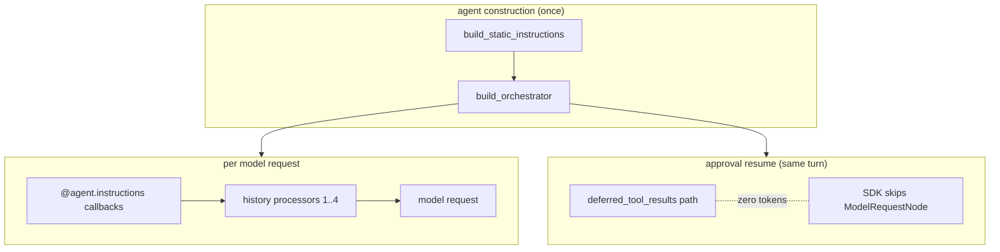

# Co CLI — Prompt Assembly

Covers how `co-cli` shapes the prompt for each model request. Startup sequencing lives in [bootstrap.md](bootstrap.md); turn orchestration in [core-loop.md](core-loop.md); compaction mechanics in [compaction.md](compaction.md); memory (sessions, memory items, canon recall) in [memory.md](memory.md); tool registration in [tools.md](tools.md).

## 1. What & How

The agent has no persistent state in model weights. Each request is reconstructed from three layers with different lifecycles:

- **Static instructions** — assembled once at agent construction; never mutated during the session.
- **Dynamic instruction layers** — `@agent.instructions` callbacks evaluated fresh on every model request.
- **Message history** — transformed before every request by an ordered processor pipeline whose detailed behavior is owned by the relevant subsystem specs.

## 2. Core Logic

### 2.1 Static Instruction Assembly

`build_orchestrator()` assembles `static_instructions` by calling each builder in `ORCHESTRATOR_SPEC.static_instruction_builders` in order — three thin closures, each taking `deps` and returning `str | None`. All evaluated once at agent construction:

1. **`_static_instructions_provider(deps)`** — wraps `build_static_instructions(deps.config)`: soul seed, mindsets, numbered rules (`co_cli/context/rules/NN_rule_id.md`), recency advisory. Character memories and critique are NOT included here.
2. **`_toolset_guidance_provider(deps)`** — wraps `build_toolset_guidance(deps.tool_index)`: tool-specific guidance blocks, each gated on the tool being present. Currently gated: `memory_search` / `session_search` → `MEMORY_GUIDANCE`; `capabilities_check` → `CAPABILITIES_GUIDANCE`. Empty when no matching tools exist.
3. **`_personality_critique_provider(deps)`** — wraps `load_soul_critique(deps.config.personality)` and prefixes with `## Review lens` heading; appended last when a personality is configured and a critique file exists. Placed after operational guidance so the review frame wraps the complete prompt.

The parts are joined with `"\n\n"` and passed as the `instructions=` string to `Agent(...)`. The string is stable for the entire session — it never changes between turns. The skill manifest and deferred-tool awareness are NOT in this block — they live in per-turn instruction callbacks (§2.2) so that `skill_index` / `tool_index` mutations do not churn the cached prefix bytes.

Each personality role is fully self-contained under `souls/{role}/`. Adding a role requires only a new directory — no Python changes. Adding a tool-specific guidance block requires adding a constant to `co_cli/context/guidance.py` and a gate in `build_toolset_guidance`.

### 2.2 Dynamic Instruction Layers

Registered in `build_orchestrator()` (`co_cli/agent/build.py`) from `ORCHESTRATOR_SPEC.per_turn_instructions`, evaluated fresh per request:

| Layer | Condition | Content |
| --- | --- | --- |
| `safety_prompt` | doom loop or shell-error streak active | warning text injected into instructions context |
| `current_time_prompt` | always | current date and time string (`"Current time: Monday, April 28, 2026 08:13 AM"`) |
| `deferred_tool_awareness_prompt` | any `VisibilityPolicyEnum.DEFERRED` tools present | per-tool stub list (one `` - `name`: one-liner `` line per deferred tool) grouped by integration family — native primitives first with no sub-header, then each family under a `` `<label>` (load before use): `` sub-header (e.g. `Google Workspace`) — telling the model to load a tool via `search_tools` before calling it; wraps `build_deferred_tool_awareness_prompt(ctx.deps.tool_index)` |
| `skill_manifest_prompt` | `skill_index` non-empty | `<available_skills>` XML manifest of bundled + user-installed skills; wraps `render_skill_manifest(ctx.deps.skill_index, ctx.deps.skills_dir, ctx.deps.user_skills_dir)` |

These layers are **not** persisted into `message_history`. They are emitted as `InstructionPart(dynamic=True)` in registration order, joined by `\n\n` and appended after the static literal in the system prompt block — see §2.3 for how cache-aware providers separate them from the cached prefix.

### 2.3 Static vs Dynamic Split — Cache-Friendliness

pydantic-ai distinguishes static and dynamic instructions at the `InstructionPart` level: the literal passed to `Agent(instructions=...)` becomes one `InstructionPart(dynamic=False)`; each `@agent.instructions` callback becomes a separate `InstructionPart(dynamic=True)` in registration order. All parts are joined by `\n\n` and emitted as the system prompt block.

Cache-aware providers act on the static/dynamic flag:
- **Anthropic** (`pydantic_ai/models/anthropic.py`) places `cache_control` on the *last static* block when any dynamic part is present, leaving dynamic parts outside the cached prefix.
- **Ollama / llama.cpp** has no explicit `cache_control`, but the KV cache automatically reuses matching prefix bytes across consecutive requests. The static literal sits first; any per-turn variance lives in the dynamic suffix.

The cache-friendliness invariant therefore reduces to one rule: **content that can vary within a session MUST NOT be inside the literal `instructions=` string passed to `Agent(...)`**. It belongs in either:
- An `@agent.instructions` callback (becomes `dynamic=True`, kept outside the cached prefix), OR
- The message tail via a history processor (`[*messages, injection]`).

The skill manifest, deferred-tool awareness, safety warnings, and current time all use the `@agent.instructions` path. Audit every new static builder registration against this rule — anything reading `deps.skill_index`, `deps.tool_index`, or runtime state must live in the per-turn path.

### 2.4 History Processors And Dynamic Instructions

Pure-transformer processors run in this exact order (registered in `build_orchestrator()` from `ORCHESTRATOR_SPEC.history_processors`):

| Processor | Behavior |
| --- | --- |
| `dedup_tool_results` | collapses identical `(tool_name, content-hash)` returns in the pre-tail region into back-references pointing at the latest `tool_call_id` |
| `evict_old_tool_results` | content-clears tool returns older than the 5-most-recent per tool name; protects last user turn |
| `spill_largest_tool_results` | force-spills the largest unspilled `ToolReturnPart`s across the full message list when total tokens exceed `deps.spill_threshold_tokens`; cheap (non-LLM) per-request cap that runs before `proactive_window_processor`. See [compaction.md](compaction.md) §2.4. |
| `proactive_window_processor` | when history exceeds compaction threshold, replaces the middle with an LLM summary or static marker; full design in [compaction.md](compaction.md) |

Four dynamic instruction functions are registered via `agent.instructions()` and run before every model request:

| Dynamic instruction | Behavior |
| --- | --- |
| `safety_prompt` | detects identical-tool-call streaks and shell-error streaks; returns warning text injected into the instructions context |
| `current_time_prompt` | returns current date/time string at tail position — ephemeral grounding just before the model sees the user turn; keeps Block 0 cache-stable |
| `deferred_tool_awareness_prompt` | re-reads `ctx.deps.tool_index` each turn — newly registered deferred tools surface immediately without restart |
| `skill_manifest_prompt` | re-reads `ctx.deps.skill_index` each turn — newly created skills become visible to the model on the very next turn |

**Ordering rationale:**
- **#1–2 before #3–4**: dedup and eviction run before size enforcement and summarization. The summarizer sees a smaller, deduped history; size enforcement fires after cheap reductions but before the LLM call.
- **`safety_prompt` before `current_time_prompt`**: structural behavioral guidance sits above ephemeral grounding.
- **`deferred_tool_awareness_prompt` and `skill_manifest_prompt` last**: capability surfaces are the freshest layer — they reflect live `deps` state — and sit closest to the user turn so the model resolves "what can I call right now" against the most recent snapshot.
- **Dynamic instructions before model request**: these functions run via the SDK's `agent.instructions()` mechanism; their output is ephemeral — not stored back to `turn_state.current_history`.

### 2.5 Approval Resume

Approval resumes reuse the main agent with zero additional tokens. The pydantic-ai SDK skips `ModelRequestNode` entirely on the `deferred_tool_results` path, so the segment continues from exactly where the deferred call paused. No separate resume agent is needed. Approval subject resolution and the resume loop live in [core-loop.md](core-loop.md) §2.3.

## 3. Config

Only the settings that directly shape prompt text are listed here. Compaction thresholds live in [compaction.md](compaction.md); recall parameters live in [memory.md](memory.md).

| Setting | Env Var | Default | Description |
| --- | --- | --- | --- |
| `personality` | `CO_PERSONALITY` | `tars` | personality for static prompt assembly |
| `doom_loop_threshold` | `CO_DOOM_LOOP_THRESHOLD` | `3` | identical-tool-call streak for warning injection |
| `max_reflections` | `CO_MAX_REFLECTIONS` | `3` | shell-error streak for reflection-cap injection |

## 4. Public Interface

### Static instruction assembly

| Symbol | Source | Contract |
| --- | --- | --- |
| `build_static_instructions(config) -> str` | `co_cli/context/assembly.py` | Returns soul seed + mindsets + numbered rules, joined with `\n\n`; called once at agent construction |
| `build_toolset_guidance(tool_index) -> str` | `co_cli/context/guidance.py` | Returns tool-specific guidance blocks, gated on tool presence (`MEMORY_GUIDANCE`, `CAPABILITIES_GUIDANCE`) |
| `build_deferred_tool_awareness_prompt(tool_index) -> str` | `co_cli/tools/deferred_prompt.py` | Returns a per-tool stub list (one `` - `name`: one-line purpose `` per `DEFERRED` tool, name-only when description is empty) grouped by integration family: native primitives render first with no sub-header, then each family under a `` `<label>` (load before use): `` sub-header. Family key = segment before first `_` for native integrations (so all `google_*` cluster), whole string for MCP integrations; deterministic ordering. Empty when no deferred tools exist. Called per-turn via `deferred_tool_awareness_prompt` |
| `render_skill_manifest(skill_index, skills_dir, user_skills_dir) -> str` | `co_cli/context/manifests/skill_manifest.py` | Renders the `<available_skills>` XML block. Called per-turn via `skill_manifest_prompt` |

### Personality asset loaders

| Symbol | Source | Contract |
| --- | --- | --- |
| `load_soul_seed(role) -> str` | `co_cli/personality/prompts/loader.py` | Returns the role's `seed.md` body |
| `load_soul_mindsets(role) -> str` | `co_cli/personality/prompts/loader.py` | Returns the joined `## Mindsets` block from `mindsets/*.md` |
| `load_soul_critique(role) -> str` | `co_cli/personality/prompts/loader.py` | Returns the optional `## Review lens` body |

### Dynamic per-request instructions

| Symbol | Source | Contract |
| --- | --- | --- |
| `safety_prompt(ctx) -> str` | `co_cli/agent/_instructions.py` | `@agent.instructions` — doom-loop / shell-error warning; output is ephemeral, not persisted to history |
| `current_time_prompt(ctx) -> str` | `co_cli/agent/_instructions.py` | `@agent.instructions` — current date/time string; ephemeral grounding |
| `deferred_tool_awareness_prompt(ctx) -> str` | `co_cli/agent/_instructions.py` | `@agent.instructions` — wraps `build_deferred_tool_awareness_prompt(ctx.deps.tool_index)`; live deferred-tool surface, not cached |
| `skill_manifest_prompt(ctx) -> str` | `co_cli/agent/_instructions.py` | `@agent.instructions` — wraps `render_skill_manifest(ctx.deps.skill_index, ...)`; live skill surface, not cached |

## 5. Files

| File | Purpose |
| --- | --- |
| `co_cli/agent/build.py` | `build_orchestrator()` — composes static instructions from `ORCHESTRATOR_SPEC.static_instruction_builders`, registers `per_turn_instructions` callbacks, attaches history processors |
| `co_cli/agent/orchestrator.py` | `ORCHESTRATOR_SPEC` — static builders (`_static_instructions_provider`, `_toolset_guidance_provider`, `_personality_critique_provider`) and per-turn instructions (`safety_prompt`, `current_time_prompt`, `deferred_tool_awareness_prompt`, `skill_manifest_prompt`) |
| `co_cli/agent/_instructions.py` | per-turn instruction callbacks: `safety_prompt`, `current_time_prompt`, `deferred_tool_awareness_prompt`, `skill_manifest_prompt` |
| `co_cli/context/assembly.py` | `build_static_instructions()` — soul + mindsets + rules; rule-file validation |
| `co_cli/context/guidance.py` | `MEMORY_GUIDANCE`, `CAPABILITIES_GUIDANCE` constants; `build_toolset_guidance()` — gated on tool presence |
| `co_cli/context/manifests/skill_manifest.py` | `render_skill_manifest()` — `<available_skills>` XML block; called per-turn from `skill_manifest_prompt` |
| `co_cli/personality/prompts/loader.py` | `load_soul_seed`, `load_soul_critique`, `load_soul_mindsets` — personality asset loaders |
| `co_cli/personality/prompts/validator.py` | personality discovery and file validation |
| `co_cli/context/prompt_text.py` | `safety_prompt_text` — called via `agent.instructions()` wrapper in `co_cli/agent/_instructions.py` |
| `co_cli/tools/deferred_prompt.py` | `build_deferred_tool_awareness_prompt()` — per-tool stub list (name + one-liner) for deferred tools, grouped by integration family under sub-headers; called per-turn from `deferred_tool_awareness_prompt` |
