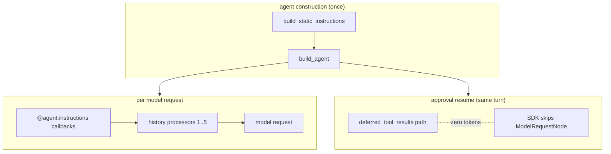

# Co CLI — Prompt Assembly

## Product Intent

**Goal:** Own how instruction layers, dynamic instruction callbacks, and history processors combine to produce the outbound model request on every turn.
**Functional areas:**
- Static instruction assembly (soul + rules + examples + critique)
- Dynamic instruction callbacks (`@agent.instructions`)
- Registered history-processor pipeline and ordering, plus two preflight callables (safety injection, recall injection)
- Append-only invariant for dynamic content (cache hygiene)
- Approval resume reusing the main agent

**Non-goals:**
- Compaction internals (owned by [compaction.md](compaction.md))
- Memory/session persistence and transcript recall (owned by [memory-knowledge.md](memory-knowledge.md))
- Reusable knowledge schema and retrieval (owned by [memory-knowledge.md](memory-knowledge.md))
- Provider wire format past the pydantic-ai SDK boundary

**Success criteria:** Prompt-prefix cache hit rate preserved across turns; dynamic content appended to the tail, never woven into `@agent.instructions`; approval resumes add zero new tokens.
**Status:** Stable
**Known gaps:** None.

---

Covers how `co-cli` shapes the prompt for each model request. Startup sequencing lives in [bootstrap.md](bootstrap.md); turn orchestration in [core-loop.md](core-loop.md); compaction mechanics in [compaction.md](compaction.md); memory/session and knowledge internals in [memory-knowledge.md](memory-knowledge.md); tool registration in [tools.md](tools.md).

## 1. What & How

The agent has no persistent state in model weights. Each request is reconstructed from three layers with different lifecycles:

- **Static instructions** — assembled once at agent construction; never mutated during the session.
- **Dynamic instruction layers** — `@agent.instructions` callbacks evaluated fresh on every model request.
- **Message history** — transformed before every request by an ordered processor pipeline whose detailed behavior is owned by the relevant subsystem specs.

## 2. Core Logic

### 2.1 Static Instruction Assembly

`build_static_instructions()` (in `co_cli/prompts/_assembly.py`) assembles one literal string in fixed order:

1. Soul seed from `souls/{role}/seed.md`
2. Character memories from `co_cli/prompts/personalities/souls/{role}/memories/*.md` (read-only system assets)
3. Mindsets from `co_cli/prompts/personalities/souls/{role}/mindsets/{task_type}.md`
4. Numbered rules from `co_cli/prompts/rules/NN_rule_id.md` (contiguous from 01, unique prefixes, fail-fast validation)
5. Examples from `souls/{role}/examples.md` (optional)
6. Critique appended as `## Review lens` (optional)

Each personality role is fully self-contained under `souls/{role}/`. Adding a role requires only a new directory — no Python changes.

### 2.2 Dynamic Instruction Layers

Registered in `build_agent()` (`co_cli/agent/_core.py`), evaluated fresh per request:

| Layer | Condition | Content |
| --- | --- | --- |
| `add_shell_guidance` | always | shell approval/reminder text |
| `add_category_awareness_prompt` | deferred tools registered in tool_index | category-level prompt listing available capabilities via `search_tools` (~100 tokens) |

These layers are **not** persisted into `message_history`.

### 2.3 Append-only Invariant for Dynamic Content

Any content that can vary within a single session MUST be appended to the tail of the message list via a history processor that returns `[*messages, injection]`. It MUST NOT be placed in `@agent.instructions`.

**Rationale:** `@agent.instructions` output is concatenated into the static system-prompt block pydantic-ai sends to the provider. Providers cache the system-prompt block as the prefix of every request. Any per-request variance in that block invalidates the cache for the entire prefix, including fixed tool schemas and soul assets.

New dynamic surfaces go in the tail. Audit every new `@agent.instructions` registration against this rule. The current date is injected via `date_prompt`, registered with `agent.instructions()` — the date can change at midnight. Personality-context memories are in the static prompt (loaded once at agent construction) and do not require per-turn injection.

### 2.4 History Processors And Dynamic Instructions

Three pure-transformer processors run in this exact order (registered in `build_agent()`):

| Processor | Behavior |
| --- | --- |
| `truncate_tool_results` | clears older `ToolReturnPart` content per tool type; keeps 5 most recent per type; always protects last user turn |
| `enforce_batch_budget` | spills largest non-persisted `ToolReturnPart`s in the current batch when aggregate size exceeds `config.tools.batch_spill_chars`; fails open |
| `proactive_window_processor` | when history exceeds compaction threshold, replaces the middle with an LLM summary or static marker; full design in [compaction.md](compaction.md) |

Two dynamic instruction functions are registered via `agent.instructions()` and run before every model request:

| Dynamic instruction | Behavior |
| --- | --- |
| `safety_prompt` | detects identical-tool-call streaks and shell-error streaks; returns warning text injected into the instructions context |
| `date_prompt` | appends today's date as the volatile dynamic suffix (personality memories are in the static prompt; knowledge recall is on-demand via tools) |

**Ordering rationale:**
- **#1–2 before #3**: truncation runs before summarization. The summarizer sees partially cleared content but receives rich side-channel context (file working set, todos) to compensate.
- **Dynamic instructions before model request**: `safety_prompt` and `date_prompt` run via the SDK's `agent.instructions()` mechanism; their output is ephemeral — not stored back to `turn_state.current_history`.

### 2.5 Approval Resume

Approval resumes reuse the main agent with zero additional tokens. The pydantic-ai SDK skips `ModelRequestNode` entirely on the `deferred_tool_results` path, so the segment continues from exactly where the deferred call paused. No separate resume agent is needed. Approval subject resolution and the resume loop live in [core-loop.md](core-loop.md) §2.3.

## 3. Config

Only the settings that directly shape prompt text are listed here. Compaction thresholds live in [compaction.md](compaction.md); recall parameters live in [memory-knowledge.md](memory-knowledge.md).

| Setting | Env Var | Default | Description |
| --- | --- | --- | --- |
| `personality` | `CO_PERSONALITY` | `tars` | personality for static prompt assembly |
| `doom_loop_threshold` | `CO_DOOM_LOOP_THRESHOLD` | `3` | identical-tool-call streak for warning injection |
| `max_reflections` | `CO_MAX_REFLECTIONS` | `3` | shell-error streak for reflection-cap injection |

## 4. Files

| File | Purpose |
| --- | --- |
| `co_cli/agent/_core.py` | main-agent and delegation-agent construction; history-processor and instruction registration |
| `co_cli/agent/_instructions.py` | dynamic instruction callbacks: `date_prompt`, `safety_prompt`, `add_shell_guidance`, `add_category_awareness_prompt` |
| `co_cli/prompts/_assembly.py` | `build_static_instructions()` — soul + personality-context memories + rules; rule-file validation |
| `co_cli/prompts/personalities/_loader.py` | soul seed, mindset, character memory, examples, critique, and `load_personality_memories()` |
| `co_cli/prompts/personalities/_validator.py` | personality discovery and file validation |
| `co_cli/context/prompt_text.py` | `recall_prompt_text` (date-only dynamic instruction) and `safety_prompt_text` — called via `agent.instructions()` wrappers in `agent/_instructions.py` |
| `co_cli/tools/_deferred_prompt.py` | `build_category_awareness_prompt()` — category-level prompt for deferred tool discovery |
