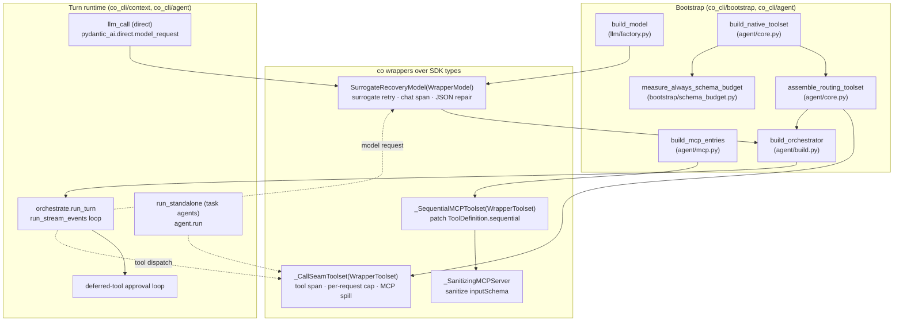

# Co CLI — pydantic-ai SDK Integration

How `co-cli` consumes the **pydantic-ai** SDK: the integration surface, the seams where co wraps or extends the SDK, and the processing logic at each seam. This is a cross-cutting runtime spec — it documents how the shipped agent uses the SDK, not how the SDK is built. Component-owned behavior (the turn loop, compaction, prompt assembly) lives in its own spec; this doc owns the *contract with the SDK*.

**Pinned version:** `pydantic-ai==1.92.0` (`pyproject.toml`). co is a deep structural consumer — version bumps must be validated against every seam below.

**Integration philosophy:** co owns the *policy*; the SDK provides the *plumbing*. Tool deferral, approval decisions, the per-call cap, MCP-result spill, JSON repair, surrogate sanitization, and schema-budget accounting are all co-implemented around SDK primitives. The SDK contributes the agent graph, message/part types, toolset composition, the model-request transport, and the pause/resume mechanics for deferred tools. Where co diverges from an SDK feature (e.g. `defer_loading`/`search_tools`), the divergence is deliberate and documented in §7.

---

## 1. Functional Architecture



co touches the SDK across **eight layers**:

| # | Layer | SDK surface | co's seam | Home |
|---|-------|-------------|-----------|------|
| 1 | Agent + run lifecycle | `Agent`, `AgentRunResult`, `run_stream_events`, `run`, `.output`/`.usage()`/`.new_messages()`, `RunUsage`, `UsageLimits` | `build_orchestrator`, `build_task_agent`, `run_turn`, `run_standalone` | `agent/build.py`, `agent/run.py`, `context/orchestrate.py` |
| 2 | Message/part types | `pydantic_ai.messages` (~22 part types, 6 stream events), `ModelMessagesTypeAdapter` | pattern-match / build / serialize / rewrite | `context/`, `observability/serialize.py`, `session/persistence.py` |
| 3 | Toolset composition | `FunctionToolset`, `CombinedToolset`, `WrapperToolset`, `AbstractToolset`, `.filtered()`, `ToolDefinition`, `ToolsetTool` | `_CallSeamToolset`, `assemble_routing_toolset`, `_tool_visibility_filter` | `agent/toolset.py`, `agent/core.py` |
| 4 | Tool registration + RunContext | `RunContext`, `prepare_tool_def`, `add_function` | `@agent_tool` registry → `ToolInfo` catalog; schema-budget measurement | `agent/toolset.py`, `deps.py`, `bootstrap/schema_budget.py` |
| 5 | Deferred-tool / approval | `DeferredToolRequests`, `DeferredToolResults`, `ApprovalRequired`, `ToolApproved`, `ToolDenied` | approval loop drives pause/resume | `context/orchestrate.py`, `tools/approvals.py` |
| 6 | Model wrapping + providers | `WrapperModel`, `StreamedResponse`, `ModelRequestParameters`, `ModelSettings`, `OpenAIChatModel`+`OllamaProvider`, `GoogleModel`+`GoogleProvider` | `SurrogateRecoveryModel`, `_RepairingStreamedResponse` | `llm/factory.py`, `llm/surrogate_recovery_model.py` |
| 7 | MCP | `MCPServerSSE`/`Stdio`/`StreamableHTTP`, `.approval_required()` | `_SanitizingMCPServer`, `_SequentialMCPToolset`, `discover_mcp_tools` | `agent/mcp.py` |
| 8 | Direct inference + exceptions | `pydantic_ai.direct.model_request`, `ModelHTTPError`, `ModelAPIError`, `UnexpectedModelBehavior`, `ModelRetry` | `llm_call`; orchestrator error taxonomy; tool retries | `llm/call.py`, `context/`, `tools/` |

co holds **no private-module imports** (`pydantic_ai._*`) — verified zero. The one synthetic-internal *assumption* that remains (the streaming-repair seam, §2.6) is pinned by a regression test, not an import.

---

## 2. Core Logic

### 2.1 Model construction & wrapping — `llm/factory.py`

`build_model(llm)` resolves a provider-specific raw model, then wraps it in `SurrogateRecoveryModel`. The wrapper is unconditional; only the JSON-repair flag differs by provider.

```
build_model(llm) -> LlmModel:
    if llm.uses_ollama():
        raw = OpenAIChatModel(llm.model,
                              provider=OllamaProvider(base_url=llm.host+"/v1",
                                                      http_client=AsyncClient(timeouts)))
        model = SurrogateRecoveryModel(raw, repair_tool_args=True)   # Ollama needs JSON repair
    elif llm.uses_gemini():
        raw = GoogleModel(llm.model, provider=GoogleProvider(api_key=llm.api_key))
        model = SurrogateRecoveryModel(raw)                          # repair off (Gemini emits valid JSON)
    else: raise ValueError
    return LlmModel(model, settings=reasoning_settings, settings_noreason=noreason_settings)
```

`LlmModel` (frozen-ish container on `CoDeps.model`) carries the wrapped model plus two `ModelSettings` variants (reasoning vs noreason). `build_judge_model` clones `llm` with a distinct model name for eval judges.

### 2.2 Toolset composition — `agent/core.py`, `agent/toolset.py`

Native tools self-register into `TOOL_REGISTRY` via `@agent_tool` import side-effects (`agent/toolset.py` imports every tool module for this). Composition is a three-step assembly, wrapped outermost by the call-seam:

```
build_native_toolset() -> (FunctionToolset, tool_catalog):
    for fn in TOOL_REGISTRY:
        info = fn.<ToolInfo>
        toolset.add_function(fn,
                             requires_approval = info.is_approval_required,
                             sequential        = not info.is_concurrent_safe,
                             retries            = info.retries (if set),
                             prepare            = _make_prepare(info.check_fn) (if set))
        catalog[info.name] = info

assemble_routing_toolset(native, mcp_toolsets):
    combined = CombinedToolset([native, *mcp_toolsets])
    filtered = combined.filtered(_tool_visibility_filter)   # SDK per-turn get_tools gate
    return _CallSeamToolset(filtered)                       # outermost call_tool seam
```

The outermost `_CallSeamToolset` means **`get_tools` (visibility) flows through the filter, `call_tool` (dispatch) flows through the seam** — the two boundaries co cares about are cleanly separated.

### 2.3 Per-turn tool visibility — `_tool_visibility_filter` (`agent/toolset.py`)

A `.filtered()` predicate the SDK calls on every `get_tools`. Two independent gates:

```
_tool_visibility_filter(ctx, tool_def) -> bool:
    entry = ctx.deps.tool_catalog.get(tool_def.name)
    # Deferred gate (every turn): hide DEFERRED tools until loaded via tool_view
    if entry and entry.visibility == DEFERRED and tool_def.name not in ctx.deps.runtime.revealed_tools:
        return False
    # Resume gate (approval-resume turns only): narrow to approved + ALWAYS tools
    resume = ctx.deps.runtime.resume_tool_names
    if resume is None: return True
    return tool_def.name in resume or entry is None or entry.visibility == ALWAYS
```

This is co's **sole deferral mechanism** — applied uniformly to native and MCP tools. The SDK's keyword loader (`defer_loading`/`search_tools`) is deliberately unused (§7); visibility lives only in `tool_catalog`.

### 2.4 The call-seam — `_CallSeamToolset.call_tool` (`agent/toolset.py`)

One explicit seam at the routing `call_tool` boundary, hosting three concerns as straight-line code (replacing the per-tool hooks of the former SDK lifecycle middleware):

```
call_tool(name, args, ctx, tool):
    # 1. Per-model-request cap accounting (one ctx.run_step == one model request)
    if ctx.run_step != runtime.tool_call_limit_run_step:
        reset streak if prior request stayed within cap
        runtime.tool_call_limit_run_step = ctx.run_step; reset per-request count
    increment per-request count
    if count == cap+1: increment consecutive-violation streak

    # 2. tool span (co.tool.* attributes)
    push_span("tool {name}", kind=tool, attrs={name, args, args_chars})

    # 3. dispatch (or shed) + MCP spill
    if count > cap:  result = make_exceeded_payload(count)        # shed over-cap calls
    else:
        result = super().call_tool(...)                          # SDK dispatch
        if result is str and info.source == MCP:                 # MCP results bypass tool_output()
            result = spill_with_span(result, threshold=info.spill_threshold_chars or default)
    set span result attrs; pop_span()  (pop with ERROR on exception)
    return result
```

The cap streak feeds the orchestrator's hard-stop (`TOOL_CAP_HARD_STOP_CONSECUTIVE`); the run boundary finalizes the last request's reset.

### 2.5 Agent build & run lifecycle — `agent/build.py`, `context/orchestrate.py`, `agent/run.py`

**Orchestrator** (singleton, built once, reused across turns):

```
build_orchestrator(spec, deps) -> SessionAgent:          # SessionAgent = Agent[CoDeps, str | DeferredToolRequests]
    Agent(raw_model = deps.model.model,                  # unwrapped from LlmModel
          deps_type = CoDeps,
          instructions = join(spec.static_instruction_builders(deps)),
          model_settings = deps.model.settings,
          tool_retries = config.tool_retries,
          output_type = [str, DeferredToolRequests],      # fixed union — drives approval pause
          history_processors = spec.history_processors,
          toolsets = [deps.toolset])                       # the assembled _CallSeamToolset
    for per_turn in spec.per_turn_instructions: agent.instructions(per_turn)   # dynamic InstructionPart
```

**Orchestrator run** (`run_turn` → `_execute_run`): streams via `async with agent.run_stream_events(...) as stream:` then `async for event in stream:` — the context-manager form guarantees stream cleanup on cancellation (required since 1.92; direct iteration is deprecated). Uses `usage_limits=UsageLimits(request_limit=None)` — **intentionally unbounded** (the human drives turn count). This is load-bearing: the SDK default `request_limit` is 50, so the explicit `None` is required, not ceremony. The sibling `metadata={"request_limit": None}` is observability only. Stream events (`PartStart/Delta/End`, `FunctionToolCall/ResultEvent`, `FinalResultEvent`, `AgentRunResultEvent`) drive rendering; the final `AgentRunResult.output` (str or `DeferredToolRequests`) drives the approval branch.

**Task agents** (`build_task_agent` + `run_standalone`): a fresh `FunctionToolset` (selected tools, all `requires_approval=False`) wrapped in its own `_CallSeamToolset` for span/cap/spill parity. `output_type = spec.output_type` (genuinely variable per spec — stays `Agent[CoDeps, Any]`). Run via `agent.run(prompt, usage_limits=UsageLimits(request_limit=budget))` — task agents keep a **real** request limit (unlike the orchestrator).

### 2.6 Streaming + JSON repair — `SurrogateRecoveryModel` (`llm/surrogate_recovery_model.py`)

A `WrapperModel` overriding `request` and `request_stream`, co-locating three model-boundary concerns:

```
request(messages, settings, params):
    push chat span
    try: response = wrapped.request(...)
    except UnicodeEncodeError: response = wrapped.request(sanitize_surrogates(messages), ...)   # retry once
    if repair_tool_args: response = _repair_response(response)        # repair each ToolCallPart.args
    pop span with tokens/output
    return response

request_stream(...) (async context manager):
    push chat span
    open wrapped.request_stream(...) → stream
    yield (repair_tool_args ? _RepairingStreamedResponse(stream) : stream)
    on UnicodeEncodeError before open: retry once with sanitized messages
    _close_model_span(spanned_stream)   # reads .get()/.usage() after consumer done
```

`_repair_response` rebuilds the response only when a part changed (identity-preserving). `_repair_json_args` applies ordered syntactic passes (control-char re-serialize → trailing-comma strip → bracket-balance → excess-closer trim), falling back to `{}` so pydantic raises `ModelRetry` rather than crashing.

`_RepairingStreamedResponse` is a thin `StreamedResponse` proxy: it repairs the assembled `.get()` (everything else delegates via `__getattr__`). **This is the one remaining SDK-internal *assumption*:** the agent graph validates streamed tool args from `StreamedResponse.get()` (the private `_agent_graph` `_streaming_handler`), so repairing `.get()` lands the fix before validation. There is no public alternative; the assumption is pinned by a regression test (§6), so an SDK change that moves stream validation turns the test red instead of silently breaking the Ollama streaming path.

### 2.7 Deferred-tool approval protocol — `context/orchestrate.py`

co drives the entire approval loop; the SDK contributes the pause (`DeferredToolRequests` output), the resume payload shape (`DeferredToolResults`), and the decision carriers.

```
run result.output is DeferredToolRequests:
    approvals = _collect_deferred_tool_approvals(result, deps, frontend):
        decisions = DeferredToolResults()
        for each pending call:
            if auto-approved or user approves: decisions.approvals[id] = True (or ToolApproved())
            if user denies:                    decisions.approvals[id] = ToolDenied(reason)
        return decisions
    resume: _execute_run(..., deferred_tool_results=approvals)   # next run executes the tools
```

Approval decisions carry **no** tool execution — execution and `ToolReturnPart` output happen in the resumed run. `QuestionRequired` (an `ApprovalRequired` subclass) carries `metadata={"questions": ...}`; clarify answers are threaded via `runtime.clarify_answers` (keyed by `tool_call_id`) rather than `ToolApproved.override_args`, to keep `user_answers` out of the model-facing schema.

### 2.8 Message/part type system — `context/`, `observability/serialize.py`, `session/persistence.py`

The breadth here (~22 part types) is intrinsic to **client-side compaction**, not a smell. co pattern-matches `ModelRequest`/`ModelResponse` for turn grouping (`_compaction_boundaries.py`), dedups/evicts `ToolReturnPart` (`history_processors.py`, `_dedup_tool_results.py`), estimates tokens from parts (`summarization.py`), and serializes parts to span attributes (`serialize.py`). History processors are **pure and non-mutating** — each returns a new list; `_rewrite_tool_returns` rebuilds a `ModelRequest` via `replace(...)` only when a part changed, else preserves the original object by identity. Persistence round-trips through `ModelMessagesTypeAdapter` (`dump_json`/`parse_json`) into per-session JSONL.

### 2.9 Schema-budget measurement — `bootstrap/schema_budget.py`

The ALWAYS-visibility tool schemas ship in every turn's static prefix, so co measures that bucket once at bootstrap and folds it into `deps.static_floor_tokens`.

```
measure_always_schema_budget(deps, native_toolset) -> AlwaysSchemaBudget:
    for name, tool in native_toolset.tools.items():        # the inner FunctionToolset, passed by caller
        ctx = RunContext(deps=deps, model=None, usage=RunUsage(), tool_name=name)   # synthetic — required
        tdef = await tool.prepare_tool_def(ctx)             # SDK-generated schema; honors prepare callbacks
        size = len(name) + len(description) + len(minified-params-JSON)
        if tool_catalog[name].visibility == ALWAYS: accumulate
```

The caller (`bootstrap/core.py`) passes the `native_toolset` it already holds from `build_native_toolset`, so the measurer reads `.tools` directly — **no duck-typing of the SDK's assembled toolset topology**. The synthetic `RunContext(model=None)` is genuinely required: `ToolInfo` carries no schema; `prepare_tool_def(ctx)` is the only source (see §7 rejected approaches).

### 2.10 MCP integration — `agent/mcp.py`

```
_build_mcp_toolsets(config):
    for each configured server:
        raw = MCPServerSSE | MCPServerStreamableHTTP | MCPServerStdio   # transport by config shape
        sanitizing = _SanitizingMCPServer(raw)                          # sanitize inputSchema on list_tools()
        inner = sanitizing.approval_required() if is_approval_required else sanitizing
        record MCPToolsetEntry(toolset=inner, server=sanitizing, is_approval_required, prefix, timeout)

build_mcp_entries: wrap each entry.toolset in _SequentialMCPToolset(toolset, tool_catalog)   # patch sequential
discover_mcp_tools: connect all servers concurrently; list_tools(); register names as DEFERRED ToolInfo
```

- `_SanitizingMCPServer` proxies the raw server and rewrites each `Tool.inputSchema` through `sanitize_mcp_schema` on `list_tools()` (raw MCP-protocol layer).
- `_SequentialMCPToolset` patches `ToolDefinition.sequential` from `tool_catalog[name].is_concurrent_safe` at `get_tools` time (pydantic-ai `ToolDefinition` layer — a *different object at a later layer* than `inputSchema`, hence two distinct wrappers, §7).
- MCP tool results are plain strings that bypass `tool_output()`, so spill happens in the call-seam (§2.4).

### 2.11 Direct inference — `llm/call.py`

`llm_call` is the single prompt→response primitive (no tools, no agent loop) for the compaction summarizer, dream merges, and eval judges. It builds a `[SystemPromptPart?, history…, UserPromptPart]` message list and calls `pydantic_ai.direct.model_request(model, messages, model_settings)`, defaulting to `settings_noreason`. Emits an `llm_call <model>` span at parity with the agent-path `chat` span.

### 2.12 Exception taxonomy

- `ModelHTTPError` — inspected by `_http_error_classifier.py` for context-overflow (drives emergency compaction); caught/re-raised in `orchestrate.py`.
- `ModelAPIError`, `UnexpectedModelBehavior` — caught in orchestration error handling.
- `ModelRetry` — raised by tools (`tool_io.py` and 20+ tool modules) for transient failures; the SDK retries up to `config.tool_retries`.

---

## 3. Config

| Setting | Where | Effect on SDK seam |
|---------|-------|--------------------|
| `llm.provider` / `llm.model` / `llm.host` / `llm.api_key` | `config/llm.py` | Selects `OpenAIChatModel`+`OllamaProvider` vs `GoogleModel`+`GoogleProvider`; sets `repair_tool_args` |
| `llm.judge_model` | `config/llm.py` | Builds a distinct judge model handle |
| reasoning/noreason `ModelSettings` | `config/llm.py` | `LlmModel.settings` / `.settings_noreason` |
| `tool_retries` | `config/core.py` | `Agent(tool_retries=…)` and per-tool `ModelRetry` budget |
| `mcp_servers` (url / command / args / env / prefix / approval / timeout) | `config/core.py` | `_build_mcp_toolsets` transport + `approval_required()` + discovery timeout |
| HTTP timeouts (connect/read/write/pool) | `llm/factory.py` constants | Ollama `httpx.AsyncClient` |
| `MAX_TOOL_CALLS_PER_MODEL_REQUEST`, `TOOL_CAP_HARD_STOP_CONSECUTIVE` | `tools/tool_call_limit.py` | Call-seam cap + hard-stop |
| `SPILL_THRESHOLD_CHARS` | `tools/tool_io.py` | MCP-result spill threshold default |

Orchestrator `usage_limits` is **not** config-driven — it is fixed `request_limit=None` (unbounded); task-agent `request_limit` comes from `spec.default_budget` or a per-call override.

---

## 4. Public Interface

| Symbol | Signature (types only) | Contract |
|--------|------------------------|----------|
| `build_model` | `(LlmSettings) -> LlmModel` | Provider-aware model build; wraps in `SurrogateRecoveryModel` |
| `build_judge_model` | `(LlmSettings) -> LlmModel \| None` | Distinct judge handle; `None` when unset |
| `LlmModel` | dataclass `{model, settings, settings_noreason}` | Model + inference settings container on `CoDeps.model` |
| `build_native_toolset` | `(Settings) -> tuple[AbstractToolset[CoDeps], dict[str, ToolInfo]]` | Unfiltered native `FunctionToolset` + catalog |
| `assemble_routing_toolset` | `(AbstractToolset, list[AbstractToolset]) -> AbstractToolset` | Combine + visibility-filter + call-seam wrap |
| `build_orchestrator` | `(OrchestratorSpec, CoDeps) -> SessionAgent` | Singleton orchestrator; `output_type=[str, DeferredToolRequests]` |
| `build_task_agent` | `(TaskAgentSpec, CoDeps, model) -> Agent[CoDeps, Any]` | Per-spec task agent with own call-seam |
| `run_standalone` | `(TaskAgentSpec, CoDeps, str, int\|None, Any) -> tuple[Any, RunUsage, str]` | Daemon task-agent run with real `UsageLimits` |
| `llm_call` | `(CoDeps, str, *, str\|None, list[ModelMessage]\|None, ModelSettings\|None, LlmModel\|None) -> str` | Single prompt→response via `model_request` |
| `measure_always_schema_budget` | `(CoDeps, FunctionToolset[CoDeps]) -> AlwaysSchemaBudget` | ALWAYS-schema char bucket from the native toolset |
| `SurrogateRecoveryModel` | `WrapperModel` subclass; `(wrapped, *, repair_tool_args=False)` | Surrogate retry + chat span + gated JSON repair |
| `SessionAgent` / `SessionRunResult` | `Agent[CoDeps, str \| DeferredToolRequests]` / `AgentRunResult[...]` | Orchestrator type aliases |
| `ToolInfo` | frozen dataclass | Canonical per-tool metadata (is_approval_required, visibility, source, retries, check_fn, …) |

Package-private (not callable cross-package, listed for the map): `_CallSeamToolset`, `_SequentialMCPToolset`, `_SanitizingMCPServer`, `_RepairingStreamedResponse`, `_tool_visibility_filter`, `_build_native_toolset`, `_build_mcp_toolsets`.

---

## 5. Files

| File | Role |
|------|------|
| `co_cli/llm/factory.py` | Provider-aware model build; `LlmModel`; `SurrogateRecoveryModel` wrapping |
| `co_cli/llm/surrogate_recovery_model.py` | `WrapperModel`: surrogate retry, chat span, JSON repair, `_RepairingStreamedResponse` |
| `co_cli/llm/call.py` | `llm_call` direct prompt→response via `pydantic_ai.direct.model_request` |
| `co_cli/agent/core.py` | `build_native_toolset`, `build_mcp_entries`, `assemble_routing_toolset` |
| `co_cli/agent/toolset.py` | Native registry import, `_tool_visibility_filter`, `_build_native_toolset`, `_CallSeamToolset` |
| `co_cli/agent/mcp.py` | `_SanitizingMCPServer`, `_SequentialMCPToolset`, transport build, `discover_mcp_tools` |
| `co_cli/agent/build.py` | `build_orchestrator`, `build_task_agent` |
| `co_cli/agent/run.py` | `run_standalone` task-agent runner with real `UsageLimits` |
| `co_cli/bootstrap/schema_budget.py` | `measure_always_schema_budget` (synthetic `RunContext` + `prepare_tool_def`) |
| `co_cli/context/orchestrate.py` | `run_turn`, stream-event loop, deferred-tool approval loop, error taxonomy |
| `co_cli/context/history_processors.py` | Pure part-rewriting processors (`_rewrite_tool_returns`) |
| `co_cli/observability/serialize.py` | Part/message → span-attribute serialization |
| `co_cli/session/persistence.py` | `ModelMessagesTypeAdapter` JSONL round-trip |
| `co_cli/deps.py` | `ToolInfo`, `VisibilityPolicyEnum`, `ToolSourceEnum`, runtime cap counters |

---

## 6. Test Gates

| Property | Gated by |
|----------|----------|
| ALWAYS-schema bucket stays within budget; measured value stable across refactor | `tests/test_orchestrator_schema_budget.py` |
| Tool-call cap fires after consecutive violations; hard-stop | `tests/test_flow_model_request_cap.py` |
| Streaming-path JSON repair fires (and is gated off when disabled) | `tests/test_flow_tool_call_repair.py` |
| Surrogate-codepoint retry on `request` / `request_stream`; no silent post-open recovery | `tests/test_surrogate_recovery_model.py` |
| Non-stream JSON repair gating (Ollama on / Gemini off) | `tests/test_flow_tool_call_repair.py` |
| Deferred-tool approval: clarify resume returns answers as tool output | `tests/test_flow_approval_subject.py` |
| Real turn populates `model_requests` from `AgentRunResult.new_messages()` | `tests/test_flow_turn_result_model_requests.py` |
| Length-retry completes truncated noreason responses | `tests/test_flow_orchestrate_length_retry.py` |
| HTTP 400 / overflow classification | `tests/test_flow_http_error_classifier.py` |
| Instruction floor (incl. ALWAYS schema) within budget | `tests/test_instruction_budget.py` |

---

## 7. SDK Coupling Boundaries (do-not-touch rationale)

Load-bearing, intentional, or rejected couplings — recorded so they are not re-litigated. (Verified against `pydantic-ai==1.92.0`.)

**Intentional divergences from SDK features:**
- **No `defer_loading`/`search_tools`.** co owns deferral via `_tool_visibility_filter` + `tool_view` + `runtime.revealed_tools`, uniformly over native and MCP tools (§2.3). Registering tools with `defer_loading=True` would re-engage the SDK keyword loader and split the mechanism.
- **Orchestrator `usage_limits=UsageLimits(request_limit=None)`** is required, not ceremony — the SDK default is 50; dropping the arg would cap the human-driven orchestrator at 50 requests. Task agents keep a real limit (`agent/run.py`).

**Minimum-necessary wrappers (do not merge or remove):**
- **`_CallSeamToolset` + `_SequentialMCPToolset`** — two `WrapperToolset` subclasses for two distinct boundaries: call-time (span/cap/spill) vs list-time (`sequential` patch). Textbook usage.
- **Do not fold `_SequentialMCPToolset` into `_SanitizingMCPServer.list_tools()`** — they operate on different object layers: raw MCP `Tool.inputSchema` vs pydantic-ai `ToolDefinition.sequential` produced *later* by the SDK's MCP toolset. Cannot be merged.
- **`SurrogateRecoveryModel`** isolates the two ugliest Ollama realities (lone surrogates, malformed tool-arg JSON) in one `WrapperModel` instead of polluting the agent loop. JSON repair lives entirely here, independent of any approval/capability surface.

**Required synthetic construction:**
- **`measure_always_schema_budget`'s synthetic `RunContext(model=None)`** (with its `# type: ignore[arg-type]`) is required. `ToolInfo` carries no `parameters_json_schema`; the schema is SDK-generated from the function signature and obtainable only via `tool.prepare_tool_def(ctx)` (which also honors per-turn `prepare` callbacks). Measuring from co's own metadata is not viable.

**Documented internal assumption (no public alternative):**
- **`_RepairingStreamedResponse.get()`** repairs the assembled response because the agent graph validates streamed tool args from `StreamedResponse.get()` (the private `_agent_graph` `_streaming_handler`). Pinned by `tests/test_flow_tool_call_repair.py` (§6) — an SDK change here goes red instead of silently breaking Ollama streaming.

**Owned elsewhere:**
- The **deferred-tool / approval protocol types** (`DeferredToolRequests`/`Results`, `ApprovalRequired`, `ToolApproved`/`Denied`) are thin data carriers. co drives the entire approval loop (§2.7); whether co ever re-implements pause/resume around its own dispatch is a separate design decision, not a mechanical cleanup.

**Coding practices to preserve under any future refactor:**
- Pure, non-mutating history processors; the single `_rewrite_tool_returns` contract; identity-preserving `replace(...)`.
- Frozen registration metadata (`ToolInfo`, `AlwaysSchemaBudget`, `MCPToolsetEntry`).
- Thin proxies over deep subclassing (`_SanitizingMCPServer`, `_RepairingStreamedResponse` delegate via `__getattr__`, override one method).

**Latent risks (recorded, not addressed):**
- `id(part)` identity tracking across processor passes (`history_processors.py`) assumes the SDK passes the same part objects to each processor within a request — true today; would break silently if the SDK deep-copies messages between processors.
- String-based part fallbacks (`getattr(part, "part_kind", part.__class__.__name__)` in `serialize.py`) duck-type instead of `isinstance` — defensive, but signals the part taxonomy isn't fully trusted.
