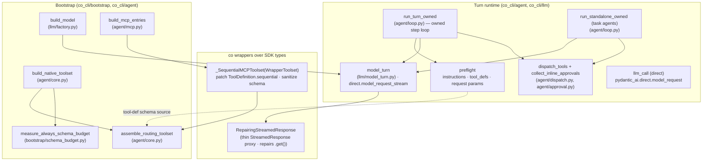

# Co CLI — pydantic-ai SDK Integration

How `co-cli` consumes the **pydantic-ai** SDK: the integration surface, the seams where co wraps or extends the SDK, and the processing logic at each seam. This is a cross-cutting runtime spec — it documents how the shipped agent uses the SDK, not how the SDK is built. Component-owned behavior (the turn loop, compaction, prompt assembly) lives in its own spec; this doc owns the *contract with the SDK*.

**Pinned version:** `pydantic-ai==1.92.0` (`pyproject.toml`). co is a deep structural consumer — version bumps must be validated against every seam below.

**Integration philosophy:** co owns the *loop and the policy*; the SDK provides *providers and a message library*. co drives its own turn loop (`agent/loop.py`) directly over the SDK's `direct.model_request_stream` transport — there is no `Agent`, no graph engine, and no SDK-owned run lifecycle. co uses the SDK for: provider model objects (`OpenAIChatModel`+`OllamaProvider`, `GoogleModel`+`GoogleProvider`), the `ModelMessage`/`*Part` type system, `ToolDefinition`/`ModelRequestParameters`/`ModelSettings`, the `direct.model_request[_stream]` transport, and the exception taxonomy. Tool deferral, dispatch, the per-step cap, approval decisions, MCP-result spill, JSON repair, surrogate sanitization, schema-budget accounting, and the final-request wrap-up nudge are all co-implemented around these primitives. Where co diverges from an SDK feature (e.g. `defer_loading`/`search_tools`), the divergence is deliberate and documented in §7.

**Why two levels, not three.** A turn and a step are intrinsic to any agentic loop; the "run" is intrinsic to *graph engines*, not to agentic loops. Stripped to its primitive, co's loop has exactly two natural scopes — the **turn** (one user message, possibly many round-trips) and the **step** (one model request + its tool dispatch, repeated until the model emits no tool call). Done-ness is a one-line local predicate ("no tool calls"), not a typed completion contract. pydantic-ai's middle "run" layer is the `pydantic_graph` execution unit: `agent.run()` traverses the graph from start to a typed `End`, carrying a validated `output_type` contract that is a completion boundary co never wanted, and whose natural unit (one clean walk to `End`) is finer than co's turn yet coarser than a single model request — so an SDK-driven co had to wedge a turn-wrapper around N runs. Driving the transport directly collapses co's vocabulary to those two intrinsic levels: the model request is a codec + transport that does *one* call and never loops, and co's loop owns everything above it.

---

## 1. Functional Architecture



co touches the SDK across **eight layers**:

| # | Layer | SDK surface | co's seam | Home |
|---|-------|-------------|-----------|------|
| 1 | Loop + turn lifecycle | *(none — owned)* `direct.model_request_stream`, `RunUsage` | `run_turn_owned`, `run_standalone_owned`, `_orchestrator_step_loop`; co owns turn/step scoping, done-ness, request cap | `agent/loop.py` |
| 2 | Message/part types | `pydantic_ai.messages` (~22 part types, 6 stream events), `ModelMessagesTypeAdapter` | pattern-match / build / serialize / rewrite | `context/`, `observability/serialize.py`, `session/persistence.py` |
| 3 | Toolset composition (schema source) | `FunctionToolset`, `CombinedToolset`, `WrapperToolset`, `AbstractToolset`, `.filtered()`, `ToolDefinition`, `ToolsetTool` | `assemble_routing_toolset`, `_tool_visibility_filter`; toolset used as a `get_tools` schema source, dispatch is co's own | `agent/toolset.py`, `agent/core.py`, `agent/dispatch.py` |
| 4 | Tool registration + RunContext | `RunContext`, `prepare_tool_def`, `add_function` | `@agent_tool` registry → `ToolInfo` catalog; synthetic `make_run_context`; schema-budget measurement | `agent/toolset.py`, `agent/dispatch.py`, `deps.py`, `bootstrap/schema_budget.py` |
| 5 | Inline approval | *(none — owned)* `ApprovalRequired` raised in-body | inline collector decides per call before dispatch | `agent/approval.py`, `agent/dispatch.py` |
| 6 | Model providers + streaming | `StreamedResponse`, `ModelRequestParameters`, `ModelSettings`, `OpenAIChatModel`+`OllamaProvider`, `GoogleModel`+`GoogleProvider` | `build_model`; `model_turn` (surrogate retry + chat span + JSON repair); `RepairingStreamedResponse` | `llm/factory.py`, `llm/model_turn.py`, `llm/_json_repair.py` |
| 7 | MCP | `MCPServerSSE`/`Stdio`/`StreamableHTTP`, `.approval_required()` | `_SequentialMCPToolset` (sequential patch + schema sanitize), `discover_mcp_tools` | `agent/mcp.py` |
| 8 | Direct inference + exceptions | `pydantic_ai.direct.model_request[_stream]`, `ModelHTTPError`, `ModelAPIError`, `UnexpectedModelBehavior`, `ModelRetry` | `llm_call`; `model_turn`; loop error taxonomy; tool retries | `llm/call.py`, `llm/model_turn.py`, `agent/loop.py`, `agent/recovery.py`, `tools/` |

co holds **one documented private-module reach** — `pydantic_ai._output.OutputToolset` for the subagent's `final_result` output tool (§2.6) — and **one documented SDK-internal *assumption*** (the streaming-repair seam, §2.5), pinned by a regression test rather than an import.

---

## 2. Core Logic

### 2.1 Model construction — `llm/factory.py`

`build_model(llm)` resolves a provider-specific **raw** model object — no co wrapper. The owned loop drives the raw model directly via `model_turn` (§2.4); the per-provider JSON-repair decision lives at that call site, not on the model object.

```
build_model(llm) -> LlmModel:
    if llm.uses_ollama():
        model = OpenAIChatModel(llm.model,
                                provider=OllamaProvider(base_url=llm.host+"/v1",
                                                        http_client=AsyncClient(timeouts)))
    elif llm.uses_gemini():
        model = GoogleModel(llm.model, provider=GoogleProvider(api_key=llm.api_key))
    else: raise ValueError
    return LlmModel(model, settings=reasoning_settings, settings_noreason=noreason_settings)
```

`LlmModel` (dataclass container on `CoDeps.model`) carries the raw provider model plus two `ModelSettings` variants (reasoning vs noreason). `build_judge_model` clones `llm` with a distinct model name for eval judges.

### 2.2 Toolset composition (schema source) — `agent/core.py`, `agent/toolset.py`

Native tools self-register into `TOOL_REGISTRY` via `@agent_tool` import side-effects (`agent/toolset.py` imports every tool module for this). Composition is a two-step assembly; the assembled toolset is a **`get_tools` schema source only** — co's owned loop never calls `toolset.call_tool` (dispatch is `dispatch_tools`, §2.3):

```
build_native_toolset() -> (FunctionToolset, tool_catalog):
    for fn in TOOL_REGISTRY:
        info = fn.<ToolInfo>
        toolset.add_function(fn,
                             requires_approval = info.is_approval_required,
                             sequential        = not info.is_concurrent_safe,
                             retries            = info.retries (if set),
                             prepare            = _make_prepare(info.check_fn) (if set))
        catalog[info.name] = info

assemble_routing_toolset(native, mcp_toolsets, name_blocklist=frozenset()):
    combined = CombinedToolset([native, *mcp_toolsets])
    # name_blocklist (default empty = orchestrator surface) folds into the single
    # filter; the delegated agent passes its blocklist to drop tools from its surface.
    return combined.filtered(visibility_filter)             # get_tools schema source
```

`assemble_routing_toolset` returns the filtered `CombinedToolset` directly — **`get_tools` (visibility) flows through the filter**, and the owned loop reads its `ToolDefinition`s as the request schema (`build_tool_defs`, §2.3). The cap, tool span, and MCP spill live in `dispatch_tools`, not a wrapper toolset.

### 2.3 Tool dispatch & visibility — `agent/dispatch.py`, `_tool_visibility_filter` (`agent/toolset.py`)

The owned loop dispatches tool calls itself. `dispatch_tools(tool_calls, deps, cap_state, …)` reads the visible `ToolsetTool`s from the routing toolset's `get_tools` (the schema source), then runs each call directly — there is no `toolset.call_tool` round-trip. It computes the shed boundary up front (`cap_state.shed_boundary`), sheds over-cap calls to an exceeded payload, fills denials, then executes the rest (concurrent tools in parallel under `tool_dispatch_sem`, sequential serialized), preserving input order. The per-call tool span, args-display, and MCP-result spill happen inside `_execute_one`.

Per-turn visibility is a `.filtered()` predicate the SDK calls on every `get_tools`. Two independent gates:

```
_tool_visibility_filter(ctx, tool_def) -> bool:
    entry = ctx.deps.tool_catalog.get(tool_def.name)
    # Deferred gate (every turn): hide DEFERRED tools until loaded via tool_view
    if entry and entry.visibility == DEFERRED and tool_def.name not in ctx.deps.runtime.revealed_tools:
        return False
    # Resume gate (approval-resume turns only): narrow to approved + ALWAYS tools
    resume = ctx.deps.runtime.resume_tool_names
    if resume is None: return True
    return tool_def.name in resume or entry is None or entry.visibility == ALWAYS
```

This is co's **sole deferral mechanism** — applied uniformly to native and MCP tools. The SDK's keyword loader (`defer_loading`/`search_tools`) is deliberately unused (§7); visibility lives only in `tool_catalog`. `make_run_context(deps)` (`agent/dispatch.py:51`) builds the synthetic `RunContext` (deps + raw model + fresh usage) the owned loop passes to the toolset's `get_tools` — the graph used to supply a real `RunContext`; co owns the loop, so it constructs a minimal one.

### 2.4 Streaming model turn + JSON repair — `model_turn` (`llm/model_turn.py`), `RepairingStreamedResponse` (`llm/_json_repair.py`)

`model_turn` (`llm/model_turn.py:66`) is the single model-request primitive. It drives `pydantic_ai.direct.model_request_stream` directly against the raw provider model and co-locates three model-boundary concerns, as an async context manager:

```
model_turn(model, messages, params, settings, *, repair) (async context manager):
    push chat span (kind="model"; co.model.input)
    open direct.model_request_stream(model, messages, params, settings) -> stream
    yield (repair ? RepairingStreamedResponse(stream) : stream)
    on UnicodeEncodeError before open: retry once with sanitized messages
    close_model_span(spanned_stream)   # reads .get()/.usage() after consumer done
```

A `UnicodeEncodeError` raised *before* the stream opens (lone surrogates in the request) triggers one sanitize-and-retry; an error raised *after* open (consumer-side) propagates unchanged. The `repair` flag is set by the caller from `deps.config.llm.uses_ollama()` (`drive_model_request`, `agent/loop.py`) — Ollama needs JSON repair, Gemini emits valid JSON.

`RepairingStreamedResponse` (`llm/_json_repair.py:132`) is a thin `StreamedResponse` proxy: it repairs the assembled `.get()` (`__aiter__`/`usage()` delegate verbatim; everything else via `__getattr__`). `repair_response` rebuilds the response only when a part changed (identity-preserving), and `repair_json_args` applies ordered syntactic passes (control-char re-serialize → trailing-comma strip → bracket-balance → excess-closer trim), falling back to `{}` so pydantic raises `ModelRetry` rather than crashing. **This is the one SDK-internal *assumption*:** pydantic-ai validates streamed tool args from `StreamedResponse.get()` (the private `_agent_graph` `_streaming_handler`), so repairing `.get()` lands the fix before validation. There is no public alternative; the assumption is pinned by a regression test (§6), so an SDK change that moves stream validation turns the test red instead of silently breaking the Ollama streaming path.

### 2.5 The owned turn loop — `agent/loop.py`, `agent/preflight.py`

**Orchestrator turn** (`run_turn_owned` → `_orchestrator_step_loop`): a straight-line `while` loop with no `Agent` object. Each step:

```
_orchestrator_step_loop(deps, state, …):
    while True:
        if requests_completed >= request_limit: return REQUEST_CAP   # turn-cumulative cap
        processed = run_history_processors(state.history, deps)        # preflight
        processed = fill_unanswered_tool_calls(processed)
        instr     = assemble_instructions(deps, static, processed, requests_completed)
        tool_defs = build_tool_defs(deps)                              # get_tools ToolDefinitions
        params    = build_request_params(instruction_parts=instr, function_tools=tool_defs)
        request_messages = clean_message_history(processed)            # throwaway request copy
        try:    response, usage = drive_model_request(deps, request_messages, params, settings, …)
        except provider error: recover inline (overflow / 400 / length) or return terminal
        calls = tool_calls(response)
        if not calls: return FINAL_TEXT  (or reasoning-overflow / length-continuation branch)
        resolution = collect_inline_approvals(calls, deps, frontend)   # §2.7
        parts = dispatch_tools(calls, deps, cap_state, …)              # §2.3
        state.history += [response, ModelRequest(parts)]
        if cap_state.hard_stop: return TOOL_CAP
```

Done-ness is the local predicate `not tool_calls(response)`. The turn-cumulative model-request cap is `request_limit = resolve_request_limit(deps.config.llm)` (`max_model_requests_per_turn`, default 40; `0` → `None` = unbounded) — co's own circuit breaker, checked at the top of each step (see [core-loop.md](core-loop.md) §1), not delegated to an SDK `UsageLimits`. `drive_model_request` (`agent/loop.py:135`) drives one `model_turn`, re-arming an `asyncio.timeout` stall window on every streamed event, and returns the assembled (repaired, when Ollama) `ModelResponse` plus this step's `RunUsage`. Provider errors are classified at the single in-loop catch (`classify_provider_error`, `agent/recovery.py`) and recovered inline: overflow strip-then-summarizes, an HTTP 400 reflects to the model within a budget, length-truncated answers continue with a boosted token budget.

Preflight (`agent/preflight.py`) reproduces, as straight-line code, the request-assembly the graph did per `ModelRequestNode`: `run_history_processors` (five processors in canonical order), `assemble_instructions` (static system prompt + per-turn dynamic `InstructionPart`s), `build_tool_defs` (visibility-filtered `ToolDefinition`s from the routing toolset's `get_tools`), `build_request_params` (assembles `ModelRequestParameters`), and `clean_message_history` (a verbatim port of the graph's removed private `_clean_message_history`, applied only to the throwaway request copy, never persisted).

**Task agents** (`run_standalone_owned`, `agent/loop.py:618`): the owned subagent driver. Shares every preflight builder, `dispatch_tools`, `collect_inline_approvals`, `ToolCapState`, and `drive_model_request` with the orchestrator loop — differing only by workflow. It builds a fresh tool surface (`build_subagent_toolset`: a flat `FunctionToolset` of selected tools all `requires_approval=False`, or the orchestrator's own visibility-filtered surface minus a blocklist) plus the `final_result` output tool (`output_tools` + `allow_text_output=False`, §2.6), dispatches the subagent's real tool calls, and on a `final_result` call validates its args into the `spec.output_type` instance (re-prompting on `ValidationError`, bounded by `spec.default_budget`). `request_limit = spec.default_budget` — task agents have **no unbounded path**, deliberately unlike the orchestrator where `0` resolves to `None`.

### 2.6 Subagent structured output — `build_output_toolset` (`agent/preflight.py`)

The owned subagent driver needs the model to emit a structured `final_result` tool call. `build_output_toolset(output_type)` (`agent/preflight.py:244`) builds the `final_result` `ToolDefinition`s plus an `ObjectOutputProcessor` whose `.validate(args)` turns the call's args into the `output_type` instance.

```
build_output_toolset(output_type) -> (output_tool_defs, processor):
    toolset = pydantic_ai._output.OutputToolset.build([output_type])   # documented private reach
    return list(toolset._tool_defs), next(iter(toolset.processors.values()))
```

This is co's **single documented reach into a pydantic-ai private module** (`_output.OutputToolset`, at `agent/preflight.py:251-264`; it is not re-exported). It emits the exact `final_result` tool name + `ObjectOutputProcessor` JSON schema the dream-reviewer model was tuned to, so a hand-built public `ToolDefinition` would have to be proven byte-equivalent before swapping in. The reach is logged at call time and flagged in §7 as the open carve-out (the v2 break point).

### 2.7 Inline tool approval — `agent/approval.py`, `agent/dispatch.py`

co decides approvals inline, within the step, before dispatch — there is no suspend/resume. `collect_inline_approvals(calls, deps, frontend)` runs per step and returns a resolution carrying approved ids and per-call denial parts:

```
collect_inline_approvals(calls, deps, frontend) -> Resolution:
    for each call:
        if catalog tool requires approval (or in-body raiser):
            decision = auto-decision or frontend prompt
            if approved: approved_ids.add(call.tool_call_id)
            if denied:   denials[call.tool_call_id] = ToolReturnPart(<denial>)
    return Resolution(approved_ids, denials)
```

`dispatch_tools` then runs only the within-cap, non-denied calls; a call whose id is in `approved_ids` runs with `ctx.tool_call_approved=True` so the two in-body raisers (shell `execute.py`, clarify `user_input.py`) execute instead of raising `ApprovalRequired`/`QuestionRequired`. A denied call's `ToolReturnPart` is the model-facing result; no tool runs. For the delegated agent, `run_standalone_owned(propagate_approvals=True)` runs the same collector so an approval-required delegated call surfaces on the parent's frontend (a headless parent auto-denies — a write-capable agent never acts unprompted).

### 2.8 Message/part type system — `context/`, `observability/serialize.py`, `session/persistence.py`

The breadth here (~22 part types) is intrinsic to **client-side compaction**, not a smell. co pattern-matches `ModelRequest`/`ModelResponse` for turn grouping (`_compaction_boundaries.py`), dedups/evicts `ToolReturnPart` (`history_processors.py`, `_dedup_tool_results.py`), estimates tokens from parts (`summarization.py`), and serializes parts to span attributes (`serialize.py`). History processors never mutate their input — each returns a new list; `_rewrite_tool_returns` rebuilds a `ModelRequest` via `replace(...)` only when a part changed, else preserves the original object by identity. All are **rewrite-only** (subtractive: dedup/evict/spill/elide) — there is no additive processor. Persistence round-trips through `ModelMessagesTypeAdapter` (`dump_json`/`parse_json`) into per-session JSONL.

### 2.13 Final-request wrap-up nudge — `agent/_instructions.py`

A dynamic instruction builder (`wrap_up_prompt`, called by `assemble_instructions` per step) that softens the cumulative model-request cap (§2.5, [core-loop.md](core-loop.md) §1). Because the loop aborts the turn the moment the completed-request count reaches the limit — no chance for the model to answer — `wrap_up_prompt` emits a one-shot instruction on the last allowed step instead:

```
wrap_up_prompt(deps, *, request_count):
    limit = resolve_request_limit(deps.config.llm)        # None when cap disabled
    if limit is None or request_count != limit - 1: return ""   # not the final step
    return WRAP_UP_TEXT                                          # emit the nudge as an instruction
```

`request_count` is the owned loop's count of requests completed before this step (`requests_completed`, `agent/loop.py`), so it reads `limit - 1` exactly on the last step the loop will still permit — fires at most once. The nudge lands in the step's `ModelRequestParameters.instruction_parts` (not as a `UserPromptPart`), so it is recomputed fresh per step and never replayed next turn — **no strip step is needed** — exactly as `safety_prompt` / `current_time_prompt` already are.

### 2.9 Schema-budget measurement — `bootstrap/schema_budget.py`

The ALWAYS-visibility tool schemas ship in every turn's static prefix, so co measures that bucket once at bootstrap and folds it into `deps.static_floor_tokens`.

```
measure_always_schema_budget(deps, native_toolset) -> AlwaysSchemaBudget:
    for name, tool in native_toolset.tools.items():        # the inner FunctionToolset, passed by caller
        ctx = RunContext(deps=deps, model=None, usage=RunUsage(), tool_name=name)   # synthetic — required
        tdef = await tool.prepare_tool_def(ctx)             # SDK-generated schema; honors prepare callbacks
        size = len(name) + len(description) + len(minified-params-JSON)
        if tool_catalog[name].visibility == ALWAYS: accumulate
```

The caller (`bootstrap/core.py`) passes the `native_toolset` it already holds from `build_native_toolset`, so the measurer reads `.tools` directly — **no duck-typing of the SDK's assembled toolset topology**. The synthetic `RunContext(model=None)` is genuinely required: `ToolInfo` carries no schema; `prepare_tool_def(ctx)` is the only source (see §7 rejected approaches).

### 2.10 MCP integration — `agent/mcp.py`

```
_build_mcp_toolsets(config):
    for each configured server:
        raw = MCPServerSSE | MCPServerStreamableHTTP | MCPServerStdio   # transport by config shape
        inner = raw.approval_required() if is_approval_required else raw
        record MCPToolsetEntry(toolset=inner, server=raw, is_approval_required, prefix, connect_timeout_seconds)   # call_timeout_seconds → read_timeout, held by the server

build_mcp_entries: wrap each entry.toolset in _SequentialMCPToolset(toolset, tool_catalog)   # patch sequential + sanitize schema
discover_mcp_tools: connect all servers concurrently via entry.server (raw); list_tools() reads name/description only; register names as DEFERRED ToolInfo
```

- `_SequentialMCPToolset.get_tools` does both at the `ToolsetTool` layer: it patches `ToolDefinition.sequential` from `tool_catalog[name].is_concurrent_safe`, and rewrites `ToolDefinition.parameters_json_schema` through `sanitize_mcp_schema`. The SDK's MCP toolset assigns the raw `Tool.inputSchema` **verbatim** to `parameters_json_schema` (`pydantic_ai/mcp.py`), so sanitizing post-conversion at this seam is identical to the former pre-conversion sanitize — **one wrapper, not two** (§7).
- The raw server handle (`MCPToolsetEntry.server`) is kept only for discovery: `discover_mcp_tools` → `entry.server.list_tools()` reads `name`/`description` only, never the schema, so the discovery path needs no sanitization.
- MCP tool results are plain strings that bypass `tool_output()`, so spill happens in `dispatch_tools` (§2.3).

### 2.11 Direct inference — `llm/call.py`

`llm_call` is the single prompt→response primitive (no tools, no agent loop) for the compaction summarizer, dream merges, and eval judges. It builds a `[SystemPromptPart?, history…, UserPromptPart]` message list and calls `pydantic_ai.direct.model_request(model, messages, model_settings)`, defaulting to `settings_noreason`. Emits an `llm_call <model>` span at parity with the agent-path `chat` span.

### 2.12 Exception taxonomy

- `ModelHTTPError` — inspected by `is_context_overflow` (`context/compaction.py`, via `context/_http_error_classifier.py`) for context-overflow (drives emergency compaction); the owned loop's single in-loop catch routes it through `classify_provider_error` (`agent/recovery.py`) and `_recover_provider_error` (`agent/loop.py`) returns `None` to retry the step loop (overflow compacted, 400 reflected), else a terminal `TurnResult`.
- `ModelAPIError`, `UnexpectedModelBehavior` — caught at the same in-loop catch and classified terminal.
- `ModelRetry` — raised by tools (`tool_io.py` and 20+ tool modules) for transient failures; `dispatch_tools`/the tool wrapper retries up to `config.tool_retries`.

---

## 3. Config

| Setting | Where | Effect on SDK seam |
|---------|-------|--------------------|
| `llm.provider` / `llm.model` / `llm.host` / `llm.api_key` | `config/llm.py` | Selects `OpenAIChatModel`+`OllamaProvider` vs `GoogleModel`+`GoogleProvider`; `uses_ollama()` sets the `model_turn` `repair` flag |
| `llm.judge_model` | `config/llm.py` | Builds a distinct judge model handle |
| reasoning/noreason `ModelSettings` | `config/llm.py` | `LlmModel.settings` / `.settings_noreason` |
| `tool_retries` | `config/core.py` | per-tool `ModelRetry` retry budget |
| `mcp_servers` (url / command / args / env / prefix / approval / connect_timeout_seconds / call_timeout_seconds) | `config/core.py` | `_build_mcp_toolsets` transport + `approval_required()` + discovery timeout (`connect`, pydantic-ai `timeout`) + per-call response timeout (`call`, pydantic-ai `read_timeout`) |
| HTTP timeouts (connect/read/write/pool) | `llm/factory.py` constants | Ollama `httpx.AsyncClient` |
| `MAX_TOOL_CALLS_PER_MODEL_REQUEST`, `TOOL_CAP_HARD_STOP_CONSECUTIVE` | `config/tuning.py` | `dispatch_tools` per-step cap + `ToolCapState` hard-stop |
| `llm.max_model_requests_per_turn` | `config/llm.py` | Loop's turn-cumulative `request_limit` via `resolve_request_limit` (40; `0` → unbounded); wrap-up nudge trigger (§2.13) |
| `llm.run_stall_timeout_secs` | `config/llm.py` | `drive_model_request` `asyncio.timeout(...)` stall window (default 120; model-generation stall, not a run deadline) |
| `SPILL_THRESHOLD_CHARS` | `config/tuning.py` | MCP-result spill threshold default |

The loop's turn-cumulative `request_limit` is config-driven — it resolves from `max_model_requests_per_turn` via `resolve_request_limit` (default 40; `0` → `None` = unbounded), checked at the top of each step rather than delegated to an SDK `UsageLimits`. Task-agent `request_limit` is `spec.default_budget` — no unbounded path, an intentional asymmetry with the orchestrator's `0 → None`.

---

## 4. Public Interface

| Symbol | Signature (types only) | Contract |
|--------|------------------------|----------|
| `build_model` | `(LlmSettings) -> LlmModel` | Provider-aware **raw** model build (no co wrapper) |
| `build_judge_model` | `(LlmSettings) -> LlmModel \| None` | Distinct judge handle; `None` when unset |
| `LlmModel` | dataclass `{model, settings, settings_noreason}` | Raw model + inference settings container on `CoDeps.model` |
| `build_native_toolset` | `() -> tuple[AbstractToolset[CoDeps], dict[str, ToolInfo]]` | Unfiltered native `FunctionToolset` + catalog |
| `assemble_routing_toolset` | `(AbstractToolset, list[AbstractToolset], frozenset[str] = frozenset()) -> AbstractToolset` | Combine + visibility-filter (with optional `name_blocklist`); `get_tools` schema source |
| `run_turn_owned` | `(*, user_input, deps, message_history, model_settings=None, frontend) -> TurnResult` | Owned orchestrator turn loop (no `Agent`) |
| `run_standalone_owned` | `(spec, deps, prompt, settings=None, propagate_approvals=False, frontend=None) -> Any` | Owned task-agent driver; structured `final_result` output |
| `run_standalone` | `(TaskAgentSpec, CoDeps, str) -> None` | Daemon task-agent runner (forked deps, own span, no merge) |
| `model_turn` | `(Model, list[ModelMessage], ModelRequestParameters, ModelSettings\|None, *, repair) -> AsyncIterator[StreamedResponse]` | Streamed model request over `direct.model_request_stream` + surrogate retry + chat span + gated JSON repair |
| `llm_call` | `(CoDeps, str, *, str\|None, list[ModelMessage]\|None, ModelSettings\|None, LlmModel\|None) -> str` | Single prompt→response via `direct.model_request` |
| `build_request_params` | `(*, instruction_parts, function_tools=None, output_tools=None, allow_text_output=True) -> ModelRequestParameters` | Assemble one step's `ModelRequestParameters` |
| `build_output_toolset` | `(type[BaseModel]) -> tuple[list[ToolDefinition], Any]` | Subagent `final_result` defs + validation processor (private `_output` reach) |
| `measure_always_schema_budget` | `(CoDeps, FunctionToolset[CoDeps]) -> AlwaysSchemaBudget` | ALWAYS-schema char bucket from the native toolset |
| `TurnResult` | dataclass `{outcome, interrupted, messages, output, usage, model_requests}` | Owned-loop turn return (chat loop pattern-matches) |
| `ToolInfo` | frozen dataclass | Canonical per-tool metadata (is_approval_required, visibility, source, retries, check_fn, …) |

Package-private (not callable cross-package, listed for the map): `_SequentialMCPToolset`, `RepairingStreamedResponse`, `_tool_visibility_filter`, `_build_native_toolset`, `_build_mcp_toolsets`, `make_run_context`, `dispatch_tools`, `collect_inline_approvals`.

---

## 5. Files

| File | Role |
|------|------|
| `co_cli/llm/factory.py` | Provider-aware **raw** model build; `LlmModel` |
| `co_cli/llm/model_turn.py` | `model_turn`: streamed request over `direct.model_request_stream`, surrogate retry, chat span, gated JSON repair |
| `co_cli/llm/_json_repair.py` | `RepairingStreamedResponse`, `repair_response`, `repair_json_args` |
| `co_cli/llm/_message_sanitize.py` | `sanitize_surrogate_codepoints_messages` (surrogate-retry input) |
| `co_cli/llm/call.py` | `llm_call` direct prompt→response via `pydantic_ai.direct.model_request` |
| `co_cli/agent/core.py` | `build_native_toolset`, `build_mcp_entries`, `assemble_routing_toolset` |
| `co_cli/agent/toolset.py` | Native registry import, `_tool_visibility_filter`, `_build_native_toolset` |
| `co_cli/agent/mcp.py` | `_SequentialMCPToolset` (sequential patch + schema sanitize), transport build, `discover_mcp_tools` |
| `co_cli/agent/loop.py` | `run_turn_owned`, `_orchestrator_step_loop`, `drive_model_request`, `run_standalone_owned`, `build_subagent_toolset`; error taxonomy |
| `co_cli/agent/preflight.py` | Per-step request assembly (`run_history_processors`, `assemble_instructions`, `build_tool_defs`, `build_request_params`, `clean_message_history`, `build_output_toolset`) |
| `co_cli/agent/dispatch.py` | `dispatch_tools`, `get_visible_tools`, `make_run_context`; tool span + cap shed + MCP spill |
| `co_cli/agent/approval.py` | `collect_inline_approvals` (per-step inline approval) |
| `co_cli/agent/recovery.py` | `classify_provider_error`, `ErrorClass`, `length_retry_settings` |
| `co_cli/agent/run.py` | `run_standalone` daemon task-agent runner |
| `co_cli/bootstrap/schema_budget.py` | `measure_always_schema_budget` (synthetic `RunContext` + `prepare_tool_def`) |
| `co_cli/context/history_processors.py` | Part-rewriting processors (`_rewrite_tool_returns`) |
| `co_cli/agent/_instructions.py` | Dynamic instruction builders; `wrap_up_prompt` (§2.13) emits the final-request cap nudge |
| `co_cli/observability/serialize.py` | Part/message → span-attribute serialization |
| `co_cli/session/persistence.py` | `ModelMessagesTypeAdapter` JSONL round-trip |
| `co_cli/deps.py` | `ToolInfo`, `VisibilityPolicyEnum`, `ToolSourceEnum`, runtime cap counters |

---

## 6. Test Gates

| Property | Gated by |
|----------|----------|
| ALWAYS-schema bucket stays within budget; measured value stable across refactor | `tests/test_orchestrator_schema_budget.py` |
| Model-request cap stops a runaway loop; tool-call-cap hard-stop fires; final-request wrap-up nudge reaches the model and is suppressed when the cap is disabled | `tests/test_flow_model_request_cap.py` |
| Surrogate-codepoint retry around stream open (no silent post-open recovery); streaming-path JSON repair fires and is gated off when disabled | `tests/test_flow_model_turn.py` |
| JSON-repair gating end-to-end (Ollama on / Gemini off) | `tests/test_flow_tool_call_repair.py` |
| Inline approval: catalog approve/deny, auto-approve, headless auto-deny; clarify approves + stashes answers and dispatch returns them as tool output | `tests/test_owned_inline_approval.py` |
| Real owned turn populates `model_requests` | `tests/test_flow_owned_turn.py` |
| Owned subagent emits SDK-built `final_result` and validates into `output_type` | `tests/test_flow_owned_subagent.py` |
| Length-retry completes truncated responses; overflow / HTTP 400 recovery and terminal classification | `tests/test_flow_owned_recovery.py` |
| HTTP 400 / overflow classification | `tests/test_flow_http_error_classifier.py` |
| Instruction floor (incl. ALWAYS schema) within budget | `tests/test_instruction_budget.py` |

---

## 7. SDK Coupling Boundaries (do-not-touch rationale)

Load-bearing, intentional, or rejected couplings — recorded so they are not re-litigated. (Verified against `pydantic-ai==1.92.0`.)

**Intentional divergences from SDK features:**
- **No `defer_loading`/`search_tools`.** co owns deferral via `_tool_visibility_filter` + `tool_view` + `runtime.revealed_tools`, uniformly over native and MCP tools (§2.3). Registering tools with `defer_loading=True` would re-engage the SDK keyword loader and split the mechanism.
- **Owned request cap, not an SDK `UsageLimits`.** The turn-cumulative `request_limit = resolve_request_limit(...)` (default 40) is co's deliberate circuit breaker, checked at the top of each step in `_orchestrator_step_loop` (rationale in [core-loop.md](core-loop.md) §1). `max_model_requests_per_turn=0` resolves to `None` for a genuinely unbounded run; task agents use their own `spec.default_budget` (`agent/loop.py`).

**Minimum-necessary wrappers (do not merge or remove):**
- **`_SequentialMCPToolset`** — the one surviving `WrapperToolset` subclass, a legitimate MCP-context base class (`agent/mcp.py:19`). It does both MCP list-time concerns at the `get_tools` `ToolsetTool` layer: `sequential` patch + schema sanitize. (It is the *only* wrapper toolset co keeps — the tool span, cap count, and spill that a former call-seam wrapper carried now live in `dispatch_tools`, §2.3.)
- **MCP schema sanitization lives in `_SequentialMCPToolset.get_tools`, not a separate server proxy.** The SDK's MCP toolset assigns the raw `Tool.inputSchema` **verbatim** to `ToolDefinition.parameters_json_schema` (`pydantic_ai/mcp.py:667`), so sanitizing the converted schema at the existing `get_tools` seam is identical to a pre-conversion sanitize and removes a wrapper. The raw server handle survives only for discovery (name/description, no schema).

**Required synthetic construction:**
- **`measure_always_schema_budget`'s synthetic `RunContext(model=None)`** (with its `# type: ignore[arg-type]`) is required. `ToolInfo` carries no `parameters_json_schema`; the schema is SDK-generated from the function signature and obtainable only via `tool.prepare_tool_def(ctx)` (which also honors per-turn `prepare` callbacks). Measuring from co's own metadata is not viable. The owned loop's `make_run_context` (`agent/dispatch.py:51`) is the same kind of required synthetic context, supplied to `get_tools`/`prepare_tool_def` at step time since there is no graph to hand co a real `RunContext`.

**Documented private-module reach (the open carve-out):**
- **`pydantic_ai._output.OutputToolset.build`** (`build_output_toolset`, `agent/preflight.py:251-264`) is co's single reach into a pydantic-ai private module — it is not re-exported. It builds the subagent's `final_result` tool def + `ObjectOutputProcessor` the dream-reviewer model was tuned to. Logged at call time and flagged as the v2 break point: replace with a hand-built public `ToolDefinition` only when proven byte-equivalent at the cutover.

**Documented internal assumption (no public alternative):**
- **`RepairingStreamedResponse.get()`** (`llm/_json_repair.py:132`) repairs the assembled response because pydantic-ai validates streamed tool args from `StreamedResponse.get()` (the private `_agent_graph` `_streaming_handler`, :637). Pinned by `tests/test_flow_model_turn.py` / `tests/test_flow_tool_call_repair.py` (§6) — an SDK change here goes red instead of silently breaking Ollama streaming.

**Owned elsewhere:**
- **Approval is inline, not suspend/resume.** co decides approvals within the step before dispatch (`collect_inline_approvals` → `dispatch_tools`, §2.7), using only the `ApprovalRequired` carrier raised in-body by shell/clarify. There is no SDK pause/resume protocol in the loop.

**Coding practices to preserve under any future refactor:**
- Non-mutating history processors (never mutate the input list/objects); the single `_rewrite_tool_returns` contract; identity-preserving `replace(...)`. All registered processors are rewrite-only — there is no additive processor. The final-request wrap-up nudge (§2.13) is a dynamic instruction (`wrap_up_prompt`), not a history processor, so it requires no strip step.
- Intra-call `id(part)` locality in `evict_old_tool_results` and `spill_largest_tool_results` (`history_processors.py`): each builds and consumes its id-set entirely within a single processor invocation, over the same `messages` list the processor receives (list slicing preserves element identity by Python guarantee). The id-set never crosses a processor boundary, so SDK message-copying between processors cannot affect it — each processor rebuilds from its own input. Preserve this build-and-consume-within-one-call locality under refactor. (`dedup_tool_results` keys on `tool_call_id` strings, not `id()`, and is unaffected either way.)
- Frozen registration metadata (`ToolInfo`, `AlwaysSchemaBudget`, `MCPToolsetEntry`).
- Thin proxies over deep subclassing (`RepairingStreamedResponse` delegates via `__getattr__`, overriding only `get()` and exposing `__aiter__`/`usage()` verbatim — its read surface is an explicit documented contract, §2.4).

**Latent risks (recorded, not addressed):**
- String-based part fallbacks (`getattr(part, "part_kind", part.__class__.__name__)` in `serialize.py`) duck-type instead of `isinstance` — defensive, but signals the part taxonomy isn't fully trusted.
