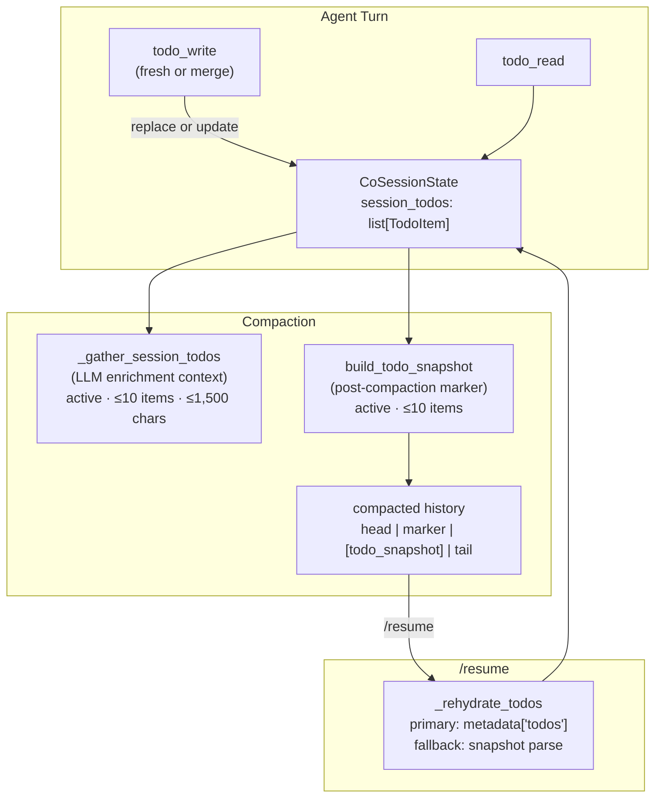

# Co CLI — Self-Planning System

> Tool surface: [tools.md](tools.md). Compaction wiring: [compaction.md](compaction.md). Agent loop: [core-loop.md](core-loop.md). System overview: [01-system.md](01-system.md).

The self-planning capability is the agent's runtime planning surface. The unit is a **todo item**; the ordered list of todo items is the **agent's plan** for the current session. "Self-" disambiguates from human-authored exec-plan artifacts (build-time developer tooling, out of scope here).

## 1. Functional Architecture



### Components

| Component | File | Role |
|-----------|------|------|
| `TodoItem` | `co_cli/deps.py` | TypedDict schema for a single plan item |
| `CoSessionState.session_todos` | `co_cli/deps.py` | In-memory list; runtime source of truth |
| `todo_write` | `co_cli/tools/todo/rw.py` | Write surface — fresh replace or merge-by-id |
| `todo_read` | `co_cli/tools/todo/rw.py` | Read surface — returns current list verbatim |
| `_gather_session_todos` | `co_cli/context/_compaction_markers.py` | Active-todo enrichment block fed to the compaction LLM |
| `build_todo_snapshot` | `co_cli/context/_compaction_markers.py` | Serializes active items into the post-compaction marker |
| `_rehydrate_todos` | `co_cli/commands/resume.py` | Restores `session_todos` from history on `/resume` |

### TodoItem Schema

| Field | Type | Constraints |
|-------|------|-------------|
| `id` | `str` | Non-empty; no `.` or whitespace; unique within session; model-assigned |
| `content` | `str` | Non-empty after strip |
| `status` | `"pending" \| "in_progress" \| "completed" \| "cancelled"` | Default `"pending"` |
| `priority` | `"high" \| "medium" \| "low"` | Default `"medium"` |

## 2. Core Logic

### 2.1 Planning Obligations

| Rule | Condition | Behavior |
|------|-----------|----------|
| **R1** | Any directive requiring 3 or more steps | Agent creates a todo list before starting work |
| **R2** | Active work is in progress | Exactly one item has status `in_progress` at any time |
| **R3** | Id ownership | Model assigns ids; runtime never auto-generates them |
| **R4** | Status convention | Typical flow: `pending` → `in_progress` → `completed` / `cancelled` (not enforced) |

> **R2 enforcement status:** R2 is validated by `_check_one_in_progress` (`co_cli/tools/todo/rw.py`), called from both `_run_fresh` and `_run_merge`. A payload producing >1 `in_progress` item is rejected — the call returns `(None, errors)` and no write occurs. (Enforcement landed via `docs/exec-plans/completed/2026-05-14-093656-todo-one-in-progress-enforce.md`.)

### 2.2 `todo_write` — Fresh vs Merge

```
call: todo_write(todos, merge=False|True)

FRESH (merge=False, default):
  validate every item in payload (full schema check)
  if any item fails → reject entire payload (all-or-nothing)
  on success → session_todos := validated list (full replace)

MERGE (merge=True):
  for each item in payload:
    if item.id exists in session_todos:
      validate only provided fields (partial update)
      on success → update existing item in place (spread)
    else:
      validate as new item (full schema check)
      on success → append to list
  if any item fails → reject entire payload (all-or-nothing)
  on success → session_todos := merged list
                (existing items in original order, new items appended)
```

### 2.3 Validation Rules

```
id:         non-empty string; no '.' or whitespace characters
content:    non-empty string after strip
status:     one of {pending, in_progress, completed, cancelled}
priority:   one of {high, medium, low}
uniqueness: ids must be unique within the submitted payload
```

All errors are collected and returned together; no partial writes occur on any error.

### 2.4 Compaction Integration

Active items (status not in `{completed, cancelled}`) survive compaction via two mechanisms:

**Enrichment context** — fed to the LLM summarizer so it can reference outstanding work in the summary:

```
active := [t for t in session_todos if t.status not in {completed, cancelled}]
block  := "Active tasks:\n" + "\n".join(format_active_todos(active))
result := block[:1,500 chars]
result is None when active list is empty
```

**Post-compaction snapshot** — a `ModelRequest` marker inserted after the compaction marker so the plan survives into the compacted history:

```
active  := [t for t in session_todos if t.status not in {completed, cancelled}]
lines   := ["- [{status}] {id}. {content}" for t in active[:10]]
content := TODO_SNAPSHOT_PREFIX + "\n" + "\n".join(lines)
snapshot is omitted (None) when active list is empty
```

Snapshot placement in the compacted history: `head | marker | [todo_snapshot] | tail`. See [compaction.md](compaction.md) for the full assembly pipeline.

### 2.5 Rehydration on `/resume`

```
scan messages in reverse:
  most recent todo_write ToolReturnPart where metadata['todos'] is a list
    → found: use that list (drop items without non-empty id)
    → not found: scan for most recent UserPromptPart starting with TODO_SNAPSHOT_PREFIX
        → found: parse lines matching "- [{status}] {id}. {content}"
                 validate status; skip non-matching lines
                 priority defaults to "medium" (not stored in snapshot)
        → not found: session_todos := []
```

The primary source is the `todo_write` tool return metadata, which carries the full list including `priority`. The fallback snapshot parse reconstructs `id`, `content`, and `status` only; `priority` is lost and defaults to `"medium"`.

### 2.6 Delegation Isolation

When the agent delegates to a sub-agent via `fork_deps`, the sub-agent's `session_todos` is initialized to `[]` regardless of the parent's list. Delegation agents perform focused sub-work and plan their own steps independently; the parent's plan is not visible to them.

Fields **not** inherited by delegation agents (reset to defaults on fork): `session_todos`, `background_tasks`.

## 3. Config

| Constant | File | Value | Purpose |
|----------|------|-------|---------|
| `_TODOS_MAX_CHARS` | `co_cli/context/_compaction_markers.py` | `1,500` | Hard cap on the active-todo enrichment block fed to the LLM summarizer |
| Snapshot item limit | `co_cli/context/_compaction_markers.py` | `10` | Max active items serialized into the post-compaction snapshot (`_format_active_todos` slices `active[:10]`) |

No user-configurable settings. Both limits are hard-coded internal caps.

## 4. Public Interface

### Plan state schema

| Symbol | Source | Contract |
|--------|--------|----------|
| `TodoItem` | `co_cli/deps.py` | `TypedDict` — `id: str`, `content: str`, `status: "pending"\|"in_progress"\|"completed"\|"cancelled"`, `priority: "high"\|"medium"\|"low"` |
| `CoSessionState.session_todos: list[TodoItem]` | `co_cli/deps.py` | In-memory list; runtime source of truth; reset to `[]` by `fork_deps` |

### Tool surface

| Symbol | Source | Contract |
|--------|--------|----------|
| `todo_write(ctx, todos, merge=False)` | `co_cli/tools/todo/rw.py` | Async tool — fresh replace (default) or merge-by-id; all-or-nothing validation; returns `ToolReturn` with `metadata['todos']` carrying the full list |
| `todo_read(ctx)` | `co_cli/tools/todo/rw.py` | Async tool — returns `deps.session.session_todos` verbatim |

### Compaction integration

| Symbol | Source | Contract |
|--------|--------|----------|
| `_gather_session_todos(deps) -> str \| None` | `co_cli/context/_compaction_markers.py` | Returns the active-todo enrichment block (≤10 items, ≤1,500 chars) fed to the compaction LLM; `None` when no active items |
| `build_todo_snapshot(deps) -> str \| None` | `co_cli/context/_compaction_markers.py` | Returns the post-compaction `UserPromptPart` content carrying active items into the compacted history; `None` when no active items |
| `TODO_SNAPSHOT_PREFIX` | `co_cli/context/_compaction_markers.py` | Constant prefix used to identify the snapshot marker in compacted history |

### Rehydration

| Symbol | Source | Contract |
|--------|--------|----------|
| `_rehydrate_todos(messages) -> list[TodoItem]` | `co_cli/commands/resume.py` | Reverse-scans messages for the latest `todo_write` tool-return metadata; falls back to snapshot parsing |

## 5. Files

| File | Purpose |
|------|---------|
| `co_cli/deps.py` | `TodoItem` TypedDict; `CoSessionState.session_todos` field; `fork_deps` delegation reset |
| `co_cli/tools/todo/rw.py` | `todo_write` + `todo_read` tool implementations; fresh/merge logic; all-or-nothing validation |
| `co_cli/context/_compaction_markers.py` | `_gather_session_todos`, `build_todo_snapshot`, `_active_todos`, `_format_active_todos`, `TODO_SNAPSHOT_PREFIX` |
| `co_cli/commands/resume.py` | `_rehydrate_todos`; `/resume` command integration |

## 6. Test Gates

| Property | Test File | Coverage |
|----------|-----------|----------|
| Fresh write replaces list; merge updates existing items by id | `tests/test_flow_todo.py` | `todo_write` fresh + merge round-trips |
| All-or-nothing: any invalid item rejects the entire payload | `tests/test_flow_todo.py` | Validation error paths |
| One-in-progress rule stated in docstring (not yet enforced in code) | — | No enforcement test until follow-up plan ships |
| Active items serialized into snapshot; terminal items excluded | `tests/test_flow_compaction_todo_format.py` | Snapshot format + content |
| Snapshot survives compaction and appears in compacted history | `tests/test_flow_compaction_boundaries.py` | Compaction pipeline |
| Rehydration primary path: `metadata['todos']` from `todo_write` return | `tests/test_flow_session_persistence.py` | `/resume` restores from tool return |
| Rehydration fallback path: snapshot parse | `tests/test_flow_session_persistence.py` | `/resume` restores from snapshot |
| Delegation agents start with empty `session_todos` | `tests/test_flow_session_persistence.py` | `fork_deps` reset |
