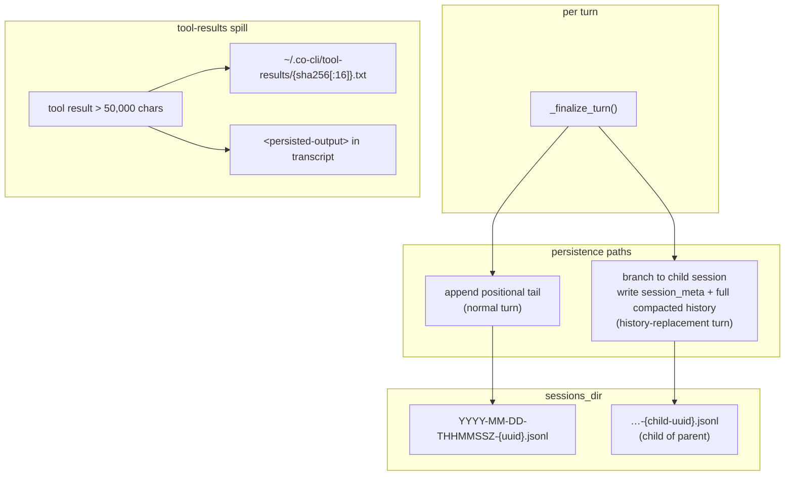

# Co CLI — Sessions & Transcript Persistence

## Product Intent

**Goal:** Own session transcript storage on disk, the lifecycle commands that mutate it (`/new`, `/resume`, `/clear`, `/compact`), and the oversized-tool-output spill mechanism that keeps transcripts bounded.
**Functional areas:**
- JSONL transcript layout, filename format, lexicographic sort
- Per-turn persistence via `_finalize_turn()`
- History replacement via child-session branching
- `/resume`, `/new`, `/clear`, `/compact` transcript mutations
- Oversized tool output spill to content-addressed disk files

**Non-goals:**
- Concurrent-instance safety (no file lock — deferred)
- TTL-based session cleanup
- Prompt assembly or history processors (owned by [prompt-assembly.md](prompt-assembly.md))
- Memory indexing / episodic recall backend (owned by [cognition.md](cognition.md))

**Success criteria:** Individual transcripts are append-only and recoverable; history replacement never mutates the parent; durability is tracked per-turn; large tool outputs never enter the transcript verbatim.
**Status:** Stable
**Known gaps:** No concurrent-instance safety — a second `co chat` in the same user home can race transcript writes. Deferred.

---

Covers how `co-cli` persists conversation state to disk. Startup session restore lives in [bootstrap.md](bootstrap.md); turn orchestration in [core-loop.md](core-loop.md); history processors in [prompt-assembly.md](prompt-assembly.md); compaction mechanics in [compaction.md](compaction.md); memory indexing (FTS5 over past transcripts) in [cognition.md](cognition.md).

## 1. What & How

Sessions are stored as append-only JSONL transcripts under `~/.co-cli/sessions/` with lexicographically-sortable filenames:

```text
~/.co-cli/sessions/
├── 2026-04-11-T142305Z-550e8400.jsonl
├── 2026-04-12-T091733Z-8f7a2b91.jsonl     ← history-replacement branches may fork a child session
└── …
```

**Filename format:** `YYYY-MM-DD-THHMMSSZ-{uuid8}.jsonl`. The timestamp prefix makes lexicographic sort == chronological sort; the 8-char UUID suffix is the short display ID carried in telemetry.



## 2. Core Logic

### 2.1 Startup Restore

`restore_session()` scans `sessions_dir/*.jsonl` by filename (lexicographic sort — no `stat()`) and sets `deps.session.session_path` to the most recent path. If none found, `new_session_path()` builds a path for a new session but does **not** write the file — the file is created on the first transcript write.

`CoSessionState.persisted_message_count` tracks how much of the current in-memory history is already durable on disk. Durability accounting is explicit; nothing is inferred from file size or mtime.

### 2.2 Per-Turn Persistence

`_finalize_turn()` in `co_cli/main.py` is the single transcript write point. Invariants:

1. Fire-and-forget memory extraction fires on clean turns (not interrupted, not `outcome == "error"`) — see [cognition.md](cognition.md).
2. `persist_session_history()` then writes the current transcript state:
   - **normal turns** append only the positional tail after `persisted_message_count`.
   - **history-replacement turns** (inline compaction or `/compact`) branch to a fresh child session, write a `session_meta` control line linking the parent transcript, then write the full compacted history.
3. Error banner printed when `turn_result.outcome == "error"`.

### 2.3 Transcript Format

JSONL. Each line is either:

- A **control record** (`session_meta` lineage link for branched child sessions; `compact_boundary` markers are legacy but still honored on load for older transcripts).
- A **message row** — single-element list serialized via pydantic-ai's `ModelMessagesTypeAdapter`, preserving all discriminated union part types across round-trip.

Tool results that exceeded the 50,000-char threshold are stored as `<persisted-output>` XML placeholders in the transcript; the full content lives in `~/.co-cli/tool-results/` (see §2.6).

### 2.4 Session Commands

| Command | Behavior |
| --- | --- |
| `/resume` | `list_sessions()` presents an interactive picker (title from first user prompt, file size from stat). Selection calls `load_transcript(selected.path)`, sets `deps.session.session_path = selected.path`, resets `persisted_message_count` to the loaded message count. |
| `/new` | Assigns a new `deps.session.session_path` via `new_session_path()`; returns empty history. No summary artifact is written. The next `append_messages` call creates the new file automatically. |
| `/clear` | Clears in-memory history only; the existing transcript file is unaffected. |
| `/compact` | Triggers inline compaction; history replacement branches to a new child session (see §2.2). |

**Transcript loading** — `load_transcript()` reads the full `.jsonl`, skips malformed lines and `session_meta` control records, and still honors legacy `compact_boundary` markers when loading older transcripts that contain them.

### 2.5 Behavioral Constraints

- Individual transcript files are **append-only** — never rewritten, never truncated.
- History replacement does **not** mutate the old transcript; it branches to a new child transcript.
- `/clear` clears in-memory history only — transcript unaffected.
- Startup always begins with empty `message_history`; `/resume` is explicit, not automatic.
- No TTL on sessions — permanent until manually deleted.
- No concurrent-instance safety — a second `co chat` in the same user home can race writes (future: file lock or PID guard).

### 2.6 Oversized Tool Output Spill

When a tool result's display text exceeds `ToolInfo.max_result_size` (default 50,000 chars; per-tool overrides at registration — `read_file` 80,000, `run_shell_command` 30,000), `persist_if_oversized()` in `co_cli/tools/tool_io.py` writes the full content to `~/.co-cli/tool-results/{sha256[:16]}.txt` (content-addressed; same content → same file, idempotent).

The model receives a `<persisted-output>` XML placeholder containing the tool name, file path, total size in chars, and a 2,000-char preview — never the full content. The file persists on disk across sessions; no TTL or pruning policy. The model pages the full content via `read_file(path, start_line=, end_line=)`.

### 2.7 Security

- Session paths are constructed from internally-generated timestamps and UUIDs; no user input enters path construction.
- `/resume` uses an interactive picker — never a free-form path argument.
- Session files and tool-result spill files are `chmod 0o600`.

### 2.8 Telemetry

The 8-char UUID suffix (`session_path.stem[-8:]`) is carried in OTel spans, agent run metadata, and sub-agent metadata. Sub-agents receive a fresh empty `Path()`, not the parent's path, so their traces are attributable but isolated.

## 3. Config

| Setting | Env Var | Default | Description |
| --- | --- | --- | --- |
| `deps.sessions_dir` | — | `~/.co-cli/sessions/` | user-global; resolved onto `CoDeps`, not configurable via settings |
| `deps.tool_results_dir` | — | `~/.co-cli/tool-results/` | user-global oversized-output spill directory |

## 4. Files

| File | Purpose |
| --- | --- |
| `co_cli/context/session.py` | session filename generation, latest-session discovery, new-path factory |
| `co_cli/context/transcript.py` | JSONL transcript: append, load, compact boundary, parent/child session metadata |
| `co_cli/context/session_browser.py` | `list_sessions()` — interactive picker for `/resume` |
| `co_cli/tools/tool_io.py` | `persist_if_oversized()`; `TOOL_RESULT_MAX_SIZE`; `TOOL_RESULT_PREVIEW_SIZE`; `check_tool_results_size` |
| `co_cli/main.py` | `_finalize_turn()` transcript persistence; `_chat_loop()` REPL session lifecycle |
| `co_cli/commands/_commands.py` | slash dispatch for `/resume`, `/new`, `/clear`, `/compact`, `/sessions` |
| `co_cli/bootstrap/core.py` | `restore_session()` at startup |
