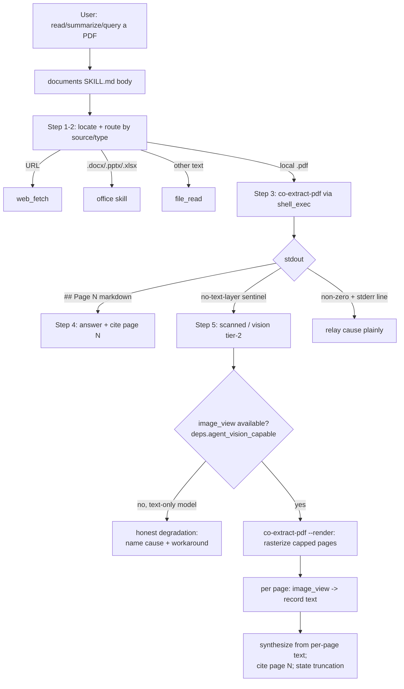

# Co CLI — Documents Skill (local PDF reading)

A skill-component spec (namespaced `skills-*`; see [skills.md](skills.md) for the skill subsystem it plugs into). Covers the `documents` skill end to end: locating a local PDF, routing by source/type, and the two-tier read — **tier 1** born-digital text extraction and **tier 2** scanned/image-only render→vision. The shared `image_view` tool is specified in [tools.md](tools.md) and only referenced here.

## Product Intent

A user points at a PDF and asks what it says. Most PDFs carry a text layer — extract it cheaply and exactly, with page citations. A scanned/photographed PDF has no text layer; rather than dead-end, read the pages as images with a vision-capable model. The whole capability is "read this PDF," routed by what the file actually contains — not two features the user must choose between. There is no bundled OCR engine: the scanned path is render→vision, the same model the agent already runs.

## 1. Functional Architecture



The skill is **prompt-driven glue**: the only executable code is the bundled `extract_pdf.py` script (the `co-extract-pdf` console entry point), driven through `shell_exec`. Vision rides the existing `image_view` tool. No model-visible tool or skill is added for tier 2 — it is the same `documents` skill body branching on the tier-1 scanned signal.

### Components

| Component | Role |
|-----------|------|
| `documents/SKILL.md` | The body — locate, route, extract, branch (tier-1 answer / tier-2 vision / error / degrade). Not user-invocable; model-dispatched on a PDF-reading intent. |
| `co-extract-pdf` (`extract_pdf.py`) | Console entry point. Tier-1 text extraction (`## Page N` markdown) and `--render` raster mode (tier-2 PNGs). Subprocess-isolated, never imported. |
| `image_view` (tier-2 only) | Reads a rendered page PNG and attaches its pixels for the agent model. DEFERRED + vision-gated; specified in [tools.md](tools.md). |
| `pymupdf` / `pymupdf4llm` | Text extraction (`pymupdf4llm.to_markdown`) and page rasterization (`page.get_pixmap`). Already a dependency. |

### Entry Points

- **Dispatch:** model-selected via the `<available_skills>` manifest when the user references a PDF. Routing within the body is by source (URL → `web_fetch`) and type (Office → `office` skill).
- **Extraction:** `co-extract-pdf <path>` (tier 1) and `co-extract-pdf --render [--outdir DIR] <path>` (tier 2), both through `shell_exec`.
- **Vision capability:** `deps.agent_vision_capable`, resolved once at bootstrap (`_probe_model_ctx`) — `True` for Gemini (natively multimodal, no probe), or for an Ollama model whose `/api/show` reports the `vision` capability; `False` on any probe failure (honest gate).

## 2. Core Logic

### Locate and route (SKILL.md Steps 1–2)

```
if user gave a path: use it
else: file_search by name/extension (*.pdf); if several, confirm which
route:
  http/https URL              -> web_fetch (extractor is local-files-only)
  .docx / .pptx / .xlsx       -> office skill (never file_read the binary)
  other local text (.txt/.md) -> file_read (no extraction)
  local .pdf                  -> extract (Step 3)
```

### Tier 1 — text extraction (`co-extract-pdf <path>`)

```
_validate_source(path):                       # distinct one-line failure per cause
  missing | not .pdf | corrupt/unreadable | password-protected -> stderr + exit 1
_resolve_pages(path, --pages):                # 0-based; default all pages
  text_chars = sum(raw get_text() over selected pages)   # embedded text, not md placeholders
if not pages or text_chars < MIN_CHARS_PER_PAGE * len(pages):
  stdout = SCANNED_SENTINEL ; exit 0          # image-only: not an error, a route signal
else:
  chunks = pymupdf4llm.to_markdown(pages, page_chunks=True)   # fd-1 silenced around call
  stdout = "## Page N\n\n<text>" per page ; exit 0
```

Two non-obvious guards: (a) the scanned test uses **raw `get_text`** char count, not pymupdf4llm output, so markdown image placeholders cannot mask an empty text layer; (b) `pymupdf-layout` writes parser notices to C-level fd 1, so `_extract` redirects fd 1 to `os.devnull` around the call — stdout stays page-marked markdown only.

### Tier 2 — scanned / image-only PDF (SKILL.md Step 5)

Reached when tier-1 stdout is the `[no-text-layer: likely scanned]` sentinel. The body branches:

- **No `image_view`** (text-only agent model — the tool self-hides when `deps.agent_vision_capable` is `False`). The branch cannot read pixels: it degrades honestly — names the cause and offers a workaround (`web_fetch` for a URL source, or converting to a text-layer PDF) — and never answers from the blank extraction. The trigger is tool **presence**, not a runtime probe.
- **`image_view` available** — render then read page-by-page:

```
co-extract-pdf --render [--outdir DIR] <pdf>      # rasterize selected pages, capped
  -> one line per rendered page: "<1-based-page>\t<absolute-png-path>"
  -> final line: "total_pages=M"                  # M = selected pages BEFORE the cap
for png in rendered pages (in order):
  image_view(png, "<task> — page N of M; transcribe what this page shows")
  record the page's findings as TEXT before moving to the next page
synthesize the answer from the accumulated per-page text, citing page N
if rendered lines < M: state "read the first N of M pages"
delete the render dir (best-effort) when done or on early stop
```

### Render mode (`--render`)

```
_render_pages(path, pages, outdir, max_pages):
  target_dir = outdir if given else tempfile.mkdtemp(prefix="co-extract-pdf-")  # script-owned, USER_DIR-independent
  for page_index in pages[:max_pages]:
    pixmap = page.get_pixmap(dpi=_effective_dpi(page))     # clamp keeps long edge <= cap
    save target_dir / "page-NNN.png"                       # NNN = 1-based
    emit "<1-based-page>\t<absolute-path>"
  emit "total_pages=<len(pages)>"                           # always the pre-cap count
```

`--pages` reuses the tier-1 parser; corrupt/encrypted inputs reuse tier-1's `_validate_source` exit codes and one-line stderr. Render mode is independent of the text layer — it rasterizes whatever pages it is asked for.

### Bounded cost — load-bearing, never silent

High-res page images are token-expensive, so cost is capped and truncation is always announced:

- **150 DPI** — the measured cost/quality knee on the configured vision model (reads ~8pt text cleanly at roughly half the per-page token cost of 200 DPI).
- **~2,000 px long-edge clamp** — the model's ~4 MP downsample ceiling; rendering larger wastes tokens and risks `image_view`'s 20 MB cap. `_effective_dpi` scales a large-format page down so the long edge never exceeds the clamp.
- **10-page cap** (`--max-pages`) — bounds sequential per-page vision latency. Not the real safeguard: because `total_pages=M` is always the pre-cap selected count, the body detects a capped read (rendered lines `< M`) and **must state** "read the first N of M pages." This truncation notice is the single guard against a silent wrong answer on a long document.
- **PNG** — lossless, correct for text/line-art.

### Incremental, tail-page-only visibility

The multimodal history processor (`elide_old_multimodal_prompts`, `context/history_processors.py`) replaces `BinaryContent` in every non-tail `UserPromptPart` with `[image elided]` on replay, so across the per-page loop **only the most-recent page's pixels are ever in the model's view.** Tier 2 is therefore a *text-accumulating* scan: each page's relevant content is captured as text and that running text is what persists, giving page-N grounding that mirrors tier-1's `## Page N`. Cross-page **visual** reasoning (comparing two pages' images at once) is out of scope — cross-page answers come from the accumulated text. This is a hard property of the shared processor, not a tuning choice.

### Temp lifecycle

The render dir is script-owned (`tempfile.mkdtemp` when `--outdir` is omitted); the body deletes it best-effort after the loop or on early stop, and OS temp reclamation covers a mid-loop abort. Residue is bounded and non-sensitive — rendered copies of a file the user already has. No co cache dir, no prune machinery.

### Approval

The first `co-extract-pdf` run prompts (the command is not in `DEFAULT_SHELL_SAFE_COMMANDS`); approving once auto-approves the same subject for the session. A `shell.safe_commands` opt-in auto-approves only the bare command — `shell_policy.py`'s path guard still prompts on any arg containing `/`, `~`, or `..`, so a PDF outside the workspace root prompts regardless. `--render` is a flag on the same command and shares this semantics.

## 3. Config

No dedicated Settings model. Relevant configuration:

| Setting / source | Effect |
|------------------|--------|
| `shell.safe_commands` | Optional opt-in to auto-approve the bare `co-extract-pdf` command (path guard still applies). |
| `deps.agent_vision_capable` | Gates tier 2. Derived at bootstrap from `_probe_model_ctx` — Gemini `True`; Ollama from `/api/show` vision capability; `False` on probe failure. *(no env var — derived)* |

### Module Constants (`extract_pdf.py`)

| Constant | Value | Role |
|----------|-------|------|
| `SCANNED_SENTINEL` | `[no-text-layer: likely scanned]` | Tier-1 stdout signal that routes to tier 2. |
| `MIN_CHARS_PER_PAGE` | `10` | Scanned-detection threshold: `text_chars < MIN_CHARS_PER_PAGE * page_count` → sentinel. |
| `RENDER_DPI` | `150` | Default raster DPI (cost/quality knee). |
| `RENDER_MAX_LONG_EDGE_PX` | `2000` | Long-edge clamp (~4 MP downsample ceiling). |
| `RENDER_DEFAULT_MAX_PAGES` | `10` | `--max-pages` default page cap. |

## 4. Public Interface

### `co-extract-pdf` (console entry point — `extract_pdf.main`)

| Invocation | Contract |
|------------|----------|
| `co-extract-pdf <path>` | Tier-1 text. stdout: `## Page N` markdown (1-based), exit 0. Empty text layer → `SCANNED_SENTINEL`, exit 0. Error → one-line stderr, exit 1. |
| `co-extract-pdf <path> --pages 0-4` | Restrict to a 0-based range (`0-4`, `2`, `0-1,3`). Out-of-range → `Invalid --pages value …`, exit 1. |
| `co-extract-pdf --render [--outdir DIR] [--max-pages N] [--pages R] <path>` | Tier-2 raster. stdout: `<1-based-page>\t<abs-png-path>` per rendered page + `total_pages=M`. PNGs in `DIR` or a script-owned OS tempdir. |

Error stderr lines (exit 1): `File not found:`, `Not a PDF …`, `Could not open PDF …`, `PDF is password-protected:`, `Invalid --pages value …`, `Could not extract text from PDF:`.

### SKILL.md routing contract

`documents/SKILL.md` (not user-invocable). Frontmatter `description` is the routing surface (PDF-only; defers Office to the `office` skill and URLs to `web_fetch`). Body steps 1–5 implement locate → route → extract → branch as in §2.

## 5. Files

| File | Purpose |
|------|---------|
| `co_cli/skills/documents/SKILL.md` | Skill body — locate, route, tier-1 answer, tier-2 vision branch, honest degradation. |
| `co_cli/skills/documents/scripts/extract_pdf.py` | `co-extract-pdf` entry point — tier-1 text extraction and `--render` raster mode; `SCANNED_SENTINEL`, render/DPI constants. |
| `co_cli/skills/documents/__init__.py`, `scripts/__init__.py` | Docstring-only — make the entry-point module path import-resolve. |
| `co_cli/tools/vision/view.py` | `image_view` (tier-2 consumer) — see [tools.md](tools.md). |
| `co_cli/context/history_processors.py` | `elide_old_multimodal_prompts`, `_ELIDED_IMAGE_PLACEHOLDER` — tail-page-only pixel visibility. |
| `co_cli/bootstrap/core.py` | `_probe_model_ctx` — resolves `agent_vision_capable`. |
| `pyproject.toml` | `[project.scripts] co-extract-pdf`; `pymupdf` / `pymupdf4llm` deps. |

## 6. Test Gates

| Property | Test file |
|----------|-----------|
| Born-digital PDF extracts page text with anchored `## Page N` markers | `tests/test_flow_skill_documents.py` |
| Happy-path stdout opens with the page marker (fd-1 parser-noise silencing holds) | `tests/test_flow_skill_documents.py` |
| `--pages 0-1` selects both pages; `--pages 0` omits the other | `tests/test_flow_skill_documents.py` |
| Missing / non-PDF / corrupt / password-protected / invalid-`--pages` each exit non-zero with its distinct stderr line | `tests/test_flow_skill_documents.py` |
| Image-only PDF (no text layer) exits 0 with exactly the scanned sentinel | `tests/test_flow_skill_documents.py` |
| Image-only fixture routes to the `[no-text-layer: likely scanned]` sentinel | `tests/test_flow_scanned_pdf.py` |
| `co-extract-pdf --render` writes one PNG per page and reports `total_pages=M` | `tests/test_flow_scanned_pdf.py` |
| `--render --max-pages` caps rendered pages while still reporting full `total_pages` (truncation detectable) | `tests/test_flow_scanned_pdf.py` |
| Scanned branch degrades honestly when `image_view` is unavailable (text-only host renders but cannot view) | `tests/test_flow_scanned_pdf.py` |
| Vision-capable host reads a rendered page's known content with page grounding | `tests/test_flow_scanned_pdf.py` |
