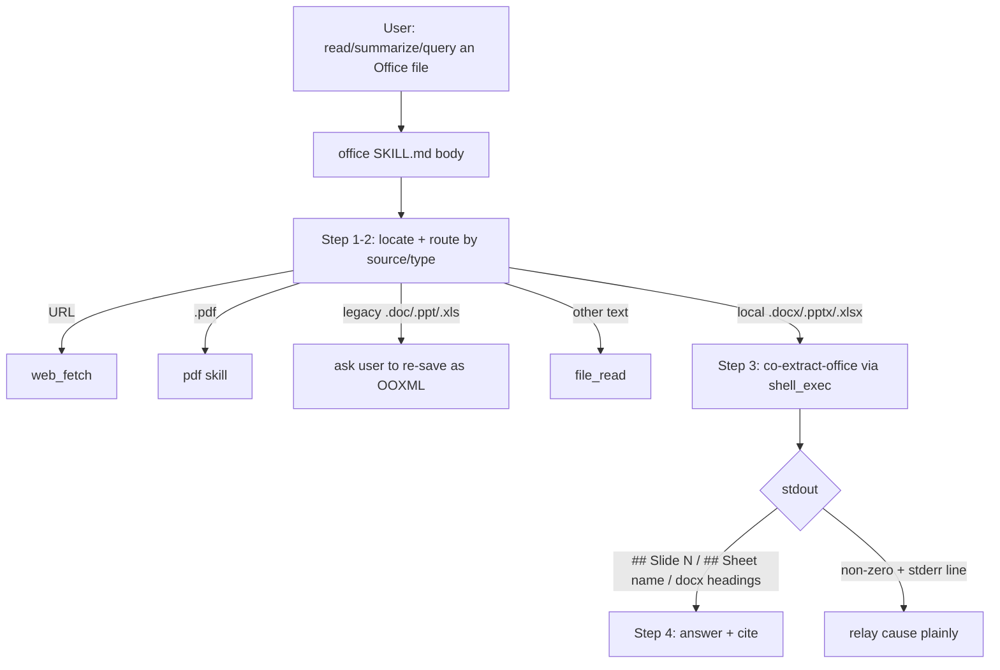

# Co CLI — Office Skill (local Word / PowerPoint / Excel reading)

A skill-component spec (namespaced `skills-*`; see [skills.md](skills.md) for the skill subsystem it plugs into). Covers the `office` skill end to end: locating a local Office file, routing by source/type, and extracting `.docx`/`.pptx`/`.xlsx` to markdown with format-appropriate citation markers. Sibling of [skills-pdf.md](skills-pdf.md) (PDF) — the two are reciprocal: `pdf` routes Office formats here, `office` routes `.pdf` back. Each owns one backend and one citation contract.

## Product Intent

A user points at a Word document, PowerPoint deck, or Excel spreadsheet and asks what it says. Office files are second only to PDFs as the local artifact a user hands an assistant, and `file_read` rejects them as binary — so without this skill the answer is an unconditional "I can't." The capability is "read this Office file," routed by extension to a format-specific, ML-free extractor. There is no unified converter and no OCR: the backend parses the document's own structure (slides, sheets, headings) and emits markdown the agent can cite.

## 1. Functional Architecture



The skill is **prompt-driven glue**: the only executable code is the bundled `extract_office.py` script (the `co-extract-office` console entry point), driven through `shell_exec`. No model-visible tool or skill is added — routing and synthesis live in the `office` SKILL.md body.

### Components

| Component | Role |
|-----------|------|
| `office/SKILL.md` | The body — locate, route, extract, answer with slide/sheet/heading citations. Not user-invocable; model-dispatched on a Word/PowerPoint/Excel intent. |
| `co-extract-office` (`extract_office.py`) | Console entry point. Extension dispatch → markdown with structure markers. Subprocess-isolated, never imported. |
| `mammoth` / `python-pptx` / `openpyxl` | Format-specific OOXML backends (docx / pptx / xlsx). ML-free by construction — no `onnxruntime`/`magika`, no `pandas`, no torch/CUDA. |

### Dependency footprint

The backend is **format-specific, not a unified converter** — the deciding factor (OQ1). A unified `markitdown` path was rejected because its content-sniffing drags `magika`→`onnxruntime` (an ML runtime) and its xlsx extra drags `pandas`, all dead weight for a deterministic, extension-dispatched parse. The resolved trees of the three chosen libraries (latest stable, PyPI 2026-06-11):

| Library | Version floor | Resolved deps |
|---------|---------------|---------------|
| `mammoth` | `>=1.12.0` | `cobble` |
| `python-pptx` | `>=1.0.2` | `lxml`, `Pillow`, `XlsxWriter`, `typing-extensions` |
| `openpyxl` | `>=3.1.5` | `et-xmlfile` |

No torch/CUDA, no `onnxruntime`/`magika`, no `pandas` in any of them — the ML-free gate is satisfied by construction, with no footprint ceiling to weigh. (Floors follow the majority `>=` convention of `[project].dependencies`; `uv.lock` pins the exact resolved tree.) These deps **ship by default** — co's one deliberate divergence from hermes, which installs format-specific Office libs by manual `pip`; co prioritizes out-of-box UX, matching the PDF skill.

### Entry Points

- **Dispatch:** model-selected via the `<available_skills>` manifest when the user references a `.docx`/`.pptx`/`.xlsx` file. Routing within the body is by source (URL → `web_fetch`) and type (`.pdf` → `pdf` skill; legacy binary → re-save).
- **Extraction:** `co-extract-office <path>` (all formats) and `co-extract-office <path> --max-rows N` (xlsx row cap), both through `shell_exec`.

## 2. Core Logic

### Locate and route (SKILL.md Steps 1–2)

```
if user gave a path: use it
else: file_search by name/extension (*.pptx, …); if several, confirm which
route:
  http/https URL              -> web_fetch (extractor is local-files-only)
  .pdf                        -> pdf skill (never file_read the binary)
  .doc / .ppt / .xls (legacy) -> ask the user to re-save as OOXML
  other local text (.txt/.md) -> file_read (no extraction)
  local .docx/.pptx/.xlsx     -> extract (Step 3)
```

### Extraction entry + error precedence (`main` → `_extract`)

Validation is **ordered**, and the first failing check wins — so each cause produces exactly one message and the backend never sees a file the earlier guards would have rejected:

```
main(path, --max-rows):
  1. existence    : not path.exists()              -> "File not found:" exit 1
  2. extension    : suffix not in {.docx,.pptx,.xlsx}
                      suffix == .pdf -> "Not an Office file — use the pdf skill for PDF:" exit 1
                      else           -> "Unsupported file type for office extraction (expected .docx/.pptx/.xlsx):" exit 1
  3. container    : _classify_container(path)       # magic-byte sniff, see below
                      open error    -> "Could not open Office file (corrupt or unreadable):" exit 1
                      CFB header    -> "Office file is password-protected or encrypted:" exit 1
                      not a Zip     -> "Could not open Office file (corrupt or unreadable):" exit 1
  4. extract      : _extract(path, suffix, max_rows)  -> dispatch by extension (below)
                      any exception -> "Could not open Office file (corrupt or unreadable):" exit 1
  on success      : stdout = markdown + "\n" ; exit 0
```

The suffix check is **case-insensitive** (`path.suffix.lower()`). The `--max-rows` flag is parsed for every invocation but consumed only by the xlsx backend; docx/pptx ignore it. Step 4 wraps the whole backend call in a single `except Exception` so a malformed-but-Zip OOXML file (a valid container with broken internal XML, which the sniff in step 3 cannot detect) still exits non-zero with one line and no traceback.

### Per-format backends (`_extract` dispatch)

**docx — `_extract_docx` (mammoth):**

```
with path.open("rb") as handle:
    result = mammoth.convert_to_markdown(handle)   # styles -> markdown
return result.value.strip()
```

mammoth maps Word **heading styles** to markdown ATX headings (`#`, `##`, …) and emits inline structure (lists, bold/italic, links) as markdown. Two non-obvious properties: (a) it **escapes markdown metacharacters in body text** — a literal period renders as `\.`, so callers/tests must match on un-escaped substrings, not on punctuation; (b) `result.messages` (mammoth's style-warning list) is **discarded** — only `result.value` reaches stdout, so a document using unmapped styles still extracts as prose rather than erroring.

**pptx — `_extract_pptx` + `_shape_text` (python-pptx):**

```
presentation = Presentation(str(path))
for index, slide in enumerate(presentation.slides, start=1):
    lines = []
    for shape in slide.shapes:                      # document order
        if shape.has_text_frame and shape.text_frame.text.strip():
            lines.append(text)
        if shape.has_table:
            for row in shape.table.rows:
                cells = [cell.text.strip() for cell in row.cells]
                if any(cells): lines.append(" | ".join(cells))
    body = "\n".join(lines).strip()
    emit  "## Slide {index}\n\n{body}"  if body else  "## Slide {index}"
slides joined by "\n\n"
```

Each shape contributes its text frame and/or its table (both are checked independently). Table rows with no content are skipped; a slide with no extractable text emits a **bare `## Slide N` marker** (so the slide count, and therefore citation numbering, stays faithful to the deck). **Speaker notes, charts, and embedded images are not extracted** — text and tables only.

**xlsx — `_extract_xlsx` + `_sheet_table` + `_cell_markdown` (openpyxl):**

```
workbook = load_workbook(str(path), read_only=True, data_only=True)
try:
  for worksheet in workbook.worksheets:
    rendered, total_rows = [], 0
    for row in worksheet.iter_rows(values_only=True):   # streamed
        total_rows += 1
        if len(rendered) < max_rows: rendered.append(list(row))
    emit "## Sheet {title}\n\n{_sheet_table(rendered, total_rows, max_rows)}"
finally:
  workbook.close()
```

`_sheet_table` builds the markdown table: the **first rendered row is the header**, column width is the widest row, the header and every data row are padded to that width, a `| --- |` separator is inserted, cells go through `_cell_markdown` (`None` → empty string, `|` → `\|`). An empty sheet renders as `(empty sheet)`. When `total_rows > max_rows` it appends `[truncated: showing rows 1–{max_rows} of {total_rows}]`.

Two load-bearing choices: **`read_only=True`** streams rows so the row count and the rendered slice cost bounded memory even on a huge sheet (the loop still visits every row to compute the true denominator `M`, but never retains more than `max_rows`); **`data_only=True`** returns each formula cell's **last-cached value** rather than the formula text — a workbook never opened/calculated by Excel can therefore yield `None` for formula cells, which is the documented trade for not shipping a formula engine.

### Why a magic-byte sniff for the password case

An encrypted/password-protected OOXML file is an **OLE/CFB compound document** (magic bytes `D0 CF 11 E0 A1 B1 1A E1`), **not** a Zip — so `mammoth`/`python-pptx`/`openpyxl` would all fail it with a generic "not a zip" error indistinguishable from genuine corruption. To give the password case its own message (so the user learns the cause), the script reads the leading 8 bytes up front: a CFB header → the encrypted message; a Zip header (`PK`) that still fails to parse → the corrupt message. This also catches legacy binary Office files saved with a modern extension.

### Citation contracts (paginationless formats)

co owns its own citation contract per format — direct control is a reason the format-specific backend was chosen over a unified converter:

- **pptx → `## Slide N`** (1-based) before each slide. Guaranteed anchor; cite by slide number.
- **xlsx → `## Sheet <name>`** before each worksheet, rendered as a markdown table. Guaranteed anchor; cite by sheet name.
- **docx → the document's own markdown headings** (`#`, `##`, …) — but only where the file uses Word **heading styles**. mammoth emits `#` anchors solely for real heading styles, so a directly-formatted docx (bold/large text, no styles) degrades to flat prose with no anchors. docx citations are therefore **best-effort** — cite by section name or quoted phrase when no headings are present. This is the one format whose anchors are not guaranteed.

### Bounded xlsx output — load-bearing, never silent

`openpyxl` would serialize every cell, so a large sheet could emit an unbounded markdown table that swamps the agent's context. The script caps rows per sheet at `DEFAULT_MAX_ROWS` (1000) and, when a sheet exceeds the cap, appends an explicit `[truncated: showing rows 1–N of M]` line where `M` is the sheet's true row count. The body must surface that truncation in its answer — a capped read never looks complete (the same discipline as the PDF skill's `total_pages` notice). `--max-rows` raises the cap. The denominator `M` is exact because the row loop visits every row even past the cap; only the rendered slice is bounded.

### Non-obvious guards (summary)

| Guard | Why |
|-------|-----|
| Ordered validation (existence → extension → container → backend) | One message per cause; the backend never sees a file an earlier check would reject. |
| Magic-byte container sniff before the backend | Encrypted OOXML is a CFB container, not a Zip, so every backend's error is a generic "not a zip" — the sniff is the only way to name the password case distinctly. |
| `except Exception` around the backend call | A valid Zip with broken internal XML passes the sniff; the catch turns its parse failure into one stderr line, no traceback. |
| docx body matched on un-escaped substrings | mammoth escapes markdown metacharacters (`.` → `\.`); matching raw punctuation would miss. |
| Bare `## Slide N` for an empty slide | Keeps slide numbering faithful to the deck so citations stay correct. |
| xlsx streamed (`read_only=True`) with full-pass row count | Bounded memory on huge sheets while still reporting the true truncation denominator. |
| `data_only=True` | Returns cached formula values, not formula text — no formula engine shipped; uncalculated cells may read `None` (documented trade). |
| stdout always ends with a trailing newline | `markdown + "\n"` — a uniform terminator regardless of format. |

### Approval

The first `co-extract-office` run prompts (the command is not in `DEFAULT_SHELL_SAFE_COMMANDS`); approving once auto-approves the same subject for the session. A `shell.safe_commands` opt-in auto-approves only the bare command — `shell_policy.py`'s path guard still prompts on any arg containing `/`, `~`, or `..`, so a file outside the workspace root prompts regardless.

## 3. Config

No dedicated Settings model. Relevant configuration:

| Setting / source | Effect |
|------------------|--------|
| `shell.safe_commands` | Optional opt-in to auto-approve the bare `co-extract-office` command (path guard still applies). |

### Module Constants (`extract_office.py`)

| Constant | Value | Role |
|----------|-------|------|
| `SUPPORTED_SUFFIXES` | `(".docx", ".pptx", ".xlsx")` | Extensions the extractor dispatches; anything else fails with a routing message. |
| `CFB_MAGIC` | `D0 CF 11 E0 A1 B1 1A E1` | OLE/CFB header → the password-protected/encrypted case. |
| `ZIP_MAGIC` | `PK\x03\x04` | OOXML Zip local-file header → a real (if possibly corrupt) OOXML file. |
| `DEFAULT_MAX_ROWS` | `1000` | `--max-rows` default; xlsx rows rendered per sheet before truncation. |

## 4. Public Interface

### `co-extract-office` (console entry point — `extract_office.main`)

| Invocation | Contract |
|------------|----------|
| `co-extract-office <path>` | Extract `.docx`/`.pptx`/`.xlsx` to markdown on stdout (always terminated by a trailing newline), exit 0. Error → one-line stderr, exit 1. |
| `co-extract-office <path> --max-rows N` | **xlsx-only** knob: cap rows rendered per sheet at `N` (default 1000); a capped sheet emits `[truncated: showing rows 1–N of M]`. Parsed for every call but ignored by docx/pptx. |

Error stderr lines (exit 1): `File not found:`, `Not an Office file — use the pdf skill for PDF:`, `Unsupported file type for office extraction (expected .docx/.pptx/.xlsx):`, `Office file is password-protected or encrypted:`, `Could not open Office file (corrupt or unreadable):`. Every error is a single line with no traceback, written via `sys.stderr.write` (T20 — `print` is forbidden under `co_cli/`).

### SKILL.md routing contract

`office/SKILL.md` (not user-invocable). Frontmatter `description` is the routing surface (Office-only; defers `.pdf` to the `pdf` skill and URLs to `web_fetch`). Body steps 1–4 implement locate → route → extract → answer as in §2. Mutual exclusivity with `pdf` is the load-bearing property — neither description may swallow the other's formats.

## 5. Files

| File | Purpose |
|------|---------|
| `co_cli/skills/office/SKILL.md` | Skill body — locate, route, extract, answer with slide/sheet/heading citations. |
| `co_cli/skills/office/scripts/extract_office.py` | `co-extract-office` entry point — extension dispatch, magic-byte sniff, structure markers, xlsx row cap. |
| `co_cli/skills/office/__init__.py`, `scripts/__init__.py` | Docstring-only — make the entry-point module path import-resolve. |
| `pyproject.toml` | `[project.scripts] co-extract-office`; `mammoth` / `python-pptx` / `openpyxl` deps. |

### `extract_office.py` function map

| Function | Role |
|----------|------|
| `main()` | Console entry point: argparse, ordered validation (existence → extension → container → backend), writes stdout/exit code. |
| `_fail(message)` | Writes one stderr line, returns exit code 1. |
| `_classify_container(path, raw)` | Magic-byte sniff: CFB → encrypted message; non-Zip → corrupt; OSError on open → corrupt; Zip → 0. |
| `_extract(path, suffix, max_rows)` | Dispatch by suffix to the format-specific extractor. |
| `_extract_docx(path)` | mammoth `convert_to_markdown` → stripped markdown value. |
| `_extract_pptx(path)` / `_shape_text(shape)` | Per-slide `## Slide N` marker + each shape's text frame / table lines. |
| `_extract_xlsx(path, max_rows)` / `_sheet_table(...)` / `_cell_markdown(value)` | Per-sheet `## Sheet <name>` table, row-capped with truncation notice; cell `None`→empty, `\|` escaped. |

## 6. Test Gates

| Property | Test file |
|----------|-----------|
| docx extracts with its `# Heading` anchor and body text | `tests/test_flow_skill_office.py` |
| pptx extracts with a `## Slide N` marker per slide and slide text | `tests/test_flow_skill_office.py` |
| xlsx extracts with a `## Sheet <name>` marker and a markdown table | `tests/test_flow_skill_office.py` |
| Missing path / unsupported extension each exit non-zero with their distinct stderr line | `tests/test_flow_skill_office.py` |
| A `.pdf` routes to the pdf skill (distinct stderr message) | `tests/test_flow_skill_office.py` |
| `office` is a registered bundled skill that loads with a non-empty body + description | `tests/test_flow_skill_bundled_library.py` |
| Model selects `office` (not `pdf`) for a deck/spreadsheet prompt, `pdf` for a PDF, neither for a URL | `evals/eval_skills.py` (W4.B) |
