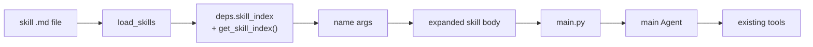

# Co CLI — Skills

> Sibling surfaces: [memory.md](memory.md) · [personality.md](personality.md) · [tools.md](tools.md). Bootstrap (when skills load): [bootstrap.md](bootstrap.md). Per-turn skill-env lifecycle: [core-loop.md](core-loop.md). Dispatch discipline: [06_skill_protocol.md](../../co_cli/context/rules/06_skill_protocol.md).

Skills are procedural capability — name-addressable workflows injected as prompt overlays. They are distinct from memory (declarative state), tools (callable primitives), and personality (doctrine). Dispatching a skill does not register a new tool; it expands a body string into the main agent for a normal LLM turn.

## 1. Functional Architecture



### Components

| Component | Role |
|-----------|------|
| `load_skills` | Two-pass loader — bundled then user-global; security scan applied to user-global only |
| `deps.skill_index` | Full skill registry (`dict[str, SkillInfo]`); used by slash-command dispatch |
| `get_skill_index()` | Model-facing subset — excludes hidden skills; source for `<available_skills>` manifest |
| `render_skill_manifest()` | Renders `<available_skills>` XML block injected into the static system prompt |
| `dispatch(raw_input, ctx)` | Routes slash commands — built-ins first, then `skill_index`, then error |
| `refresh_skills(deps)` | Hot-reload: re-loads both tiers, replaces `deps.skill_index`; called by `skill_manage` and `/skills reload` |
| `skill_manage` | Single model-callable write entry point — create, edit, patch, delete |
| `skill_view` | Model-callable reader — returns full skill body inline |

### Entry Points

Startup: `create_deps()` in `co_cli/bootstrap/core.py` calls `load_skills()` during deps assembly.

Per-turn: `main.py` saves current env for keys in `skill_env`, calls `os.environ.update(skill_env)`, runs the turn, and restores previous values in a `finally` block.

## 2. Core Logic

### Skill Model

`SkillInfo` in `co_cli/skills/skill_types.py`:

| Field | Purpose |
|-------|---------|
| `name` | slash-command name derived from file stem |
| `description` | listing text shown in `/skills` and exposed via `get_skill_index()` |
| `body` | prompt body injected into the main agent on dispatch |
| `argument_hint` | UI hint for `/help` and `/skills` |
| `user_invocable` | whether the skill appears as a slash command |
| `disable_model_invocation` | hide from `get_skill_index()` results and manifest |
| `requires` | environment/platform/settings gates |
| `skill_env` | env vars injected for the duration of the dispatched turn |
| `path` | absolute path to the `.md` file on disk; `None` for programmatic configs |

### File Format

Markdown files parsed with `parse_frontmatter()` from `co_cli/memory/frontmatter.py`. Skill name is always the filename stem. Built-in slash commands are reserved and cannot be shadowed.

| Frontmatter Field | Purpose |
|-------------------|---------|
| `description` | human-readable summary (required) |
| `argument-hint` | argument usage hint |
| `user-invocable` | include in slash-command completer and `/help` |
| `disable-model-invocation` | hide from `get_skill_index()` and manifest |
| `requires` | gate loading on bins, anyBins, env, os, or settings |
| `skill-env` | turn-scoped env injection, filtered through `_SKILL_ENV_BLOCKED` |

### Load Order

```
create_deps()
  ├─ Pass 1: load bundled skills from co_cli/skills/*.md
  │    no security scan (version-controlled)
  └─ Pass 2: load user-global skills from ~/.co-cli/skills/*.md
       security scan applied
       name collision → user-global overrides bundled
```

### Load Gating

`requires` block evaluated before a skill enters the registry. Failing skills are skipped entirely.

| Key | Rule |
|-----|------|
| `bins` | all listed binaries must exist on `PATH` |
| `anyBins` | at least one listed binary must exist |
| `env` | all listed environment variables must be set |
| `os` | `sys.platform` must match one of the listed prefixes |
| `settings` | named settings fields must be present and truthy |

### Load Safety

**Containment.** For user-global skills, `_is_safe_skill_path(path, root)` resolves symlinks and verifies the resolved path is inside the load root. Files escaping containment are skipped with a warning. Bundled skills are not checked.

**Security scan.** `scan_skill_content()` runs static regex checks on every user-global file at startup and on `/skills reload`. Warning classes: credential exfiltration, curl/wget piped to shell, destructive shell fragments, prompt-injection text. Findings are warnings — the file still loads.

`skill-env` is filtered through `_SKILL_ENV_BLOCKED`, which prevents overriding `PATH`, `PYTHONPATH`, `HOME`, and shell-loader variables.

### Dispatch

```
dispatch(raw_input, ctx)
  ├─ built-in in BUILTIN_COMMANDS?   → execute built-in
  ├─ name in ctx.deps.skill_index?
  │    yes → copy body → delegated_input
  │           expand arguments ($ARGUMENTS, $0, $1, ...)
  │           set deps.runtime.active_skill_name
  │           return DelegateToAgent
  └─ unknown → error
```

### Argument Expansion

| Token | Replacement |
|-------|------------|
| `$ARGUMENTS` | raw argument string |
| `$0` | skill name |
| `$1`, `$2`, ... | positional whitespace-split arguments |

If no arguments are passed, the body is used as-is.

### Skill Env Lifecycle

```
main.py — per-turn
  saved = {k: os.environ.get(k) for k in skill_env}
  os.environ.update(skill_env)
  try:
    run_turn()
  finally:
    restore saved values (delete keys not previously present)
    clear deps.runtime.active_skill_name
```

### Skill Management Commands

| Command | Purpose |
|---------|---------|
| `/skills list` | show loaded skills |
| `/skills check` | compare available files vs loaded skills across both tiers; report skip reasons |
| `/skills lint [<name>\|--all]` | run R1–R10 lint rules; exit 1 on any finding |
| `/skills reload` | rescan user-global directory and reload into live session |
| `/skills review run` | manually trigger one session-review pass against current transcript |
| `/skills usage [<name>]` | print the per-skill usage sidecar (table for all; full record for one) |
| `/skills pin <name>` | pin an agent-created skill — exempt from curator lifecycle transitions |
| `/skills unpin <name>` | clear the pinned flag |
| `/skills curator status` | show curator gate state — `enabled`, `last_run_at`, `next_eligible_at`, `interval_hours`, `pending_transitions`, `run_count` |
| `/skills curator run` | run the curator immediately (skips the interval gate; still respects `curator_enabled`) |
| `/skills curator restore <name>` | move an archived skill back from `.archive/` into the active library |

`/skills reload` rescans only the user-global directory. `/skills check` covers both tiers.

### Authoring Contract

Every skill body must follow this structure:

```markdown
---
description: <single sentence: when to use this skill, max 1024 chars>
argument-hint: <optional, max 80 chars>
user-invocable: true
---

# <Skill name>

**Invocation:** `/<name> [optional args]`

<one paragraph: what the skill does and when to use it>

---

## Phase 1 — <Accomplishment name>

<step-by-step instructions>

## Phase N — <Accomplishment name>

...

## Rules

- <terminal invariant>
```

Section requirements:

| Section | Required | Notes |
|---------|----------|-------|
| Frontmatter `description` | Yes | ≤1024 chars; drives manifest injection |
| H1 title | Yes | First non-frontmatter heading |
| `**Invocation:**` line | Yes | In the first ~10 lines of body |
| Opening summary paragraph | Yes | One paragraph after the invocation line |
| At least one `## Phase N — <name>` | Yes | N is 1-indexed integer |
| `## Rules` | No | Terminal invariants only |

Length budget:

| Scope | Limit | Enforcement |
|-------|-------|-------------|
| Frontmatter `description` | ≤1024 chars | Hard — validated at load time |
| Body total | ≤8000 chars | Soft — R8 lint warning |
| Each phase section | ≤2000 chars | Soft — R9 lint warning |

Phase header format: `## Phase N — <Name>` — H2, integer N, em-dash (` — `), name describing what the phase **accomplishes** (e.g. `Phase 1 — Load`, not `Phase 1 — First steps`).

Style: imperative voice (`Run X`, `Check Y`), concrete tool names in backticks, no filler. `## Rules` entries are invariants, not steps.

### Lint Rules

Ten rules enforced by `/skills lint`. Each finding is `R<n>: <message>` with a line number; at most one finding per rule per file.

| Rule | Check | Why |
|------|-------|-----|
| **R1** | Frontmatter present | Loader rejects files without frontmatter |
| **R2** | `description` present and non-empty | Absent description = invisible in manifest |
| **R3** | `description` ≤ 1024 chars | Longer descriptions bloat manifest and degrade prompt cache hit rates |
| **R4** | H1 title present after frontmatter | Anchors skill identity in `skill_view` output |
| **R5** | `**Invocation:**` line in first 10 body lines | Invocation discovery without reading the whole body |
| **R6** | At least one `## Phase N — <name>` section | Structure required for model navigation of long bodies |
| **R7** | All phase headers match `## Phase N — <name>` exactly | Inconsistent heading shape breaks the model's reading reflex |
| **R8** | Body total ≤ 8000 chars | Long bodies signal overly broad skills that should be split |
| **R9** | Each phase section ≤ 2000 chars | Within-phase length cap; overly long phases should be split |
| **R10** | No `TODO`, `FIXME`, or `XXX` markers | Bundled skills are reference-quality; markers signal in-progress work |

Lint is collaborative — it catches well-meaning skills that won't perform well. The security scan (`scan_skill_content`) is adversarial — it catches actively malicious content. Lint never blocks load; security scan blocks on findings at write time.

### Curation & Self-Improvement

Three in-session reflexes govern skill quality during a task:

- **Drift fix**: when a loaded skill has stale steps, patch immediately via `skill_manage(action='patch')` for surgical edits or `action='edit'` for structural overhauls.
- **Create**: after completing a multi-step task (3+ coherent steps), if the procedure is class-level reusable, promote it to a skill. Bar: "would I run this again for the same kind of task" — not one-offs.
- **Offer-to-save**: after iterative work where no skill was loaded, briefly offer skill creation before invoking `skill_manage(action='create')`.

**Background session reviewer.** After approximately every `review_nudge_interval` tool calls, a `session_reviewer` agent runs in the background with the serialized session transcript and applies improvements the in-flight reflexes may have missed.

```
session_reviewer (pass 1 — every nudge)
  ├─ scan for drift in skills loaded during session → patch or edit
  ├─ create new class-level skills for reusable procedures not in library
  ├─ create or update knowledge artifacts for user preferences and corrections
  └─ never deletes skills or creates session-specific skills

skill_curator (pass 2 — runs when curator_enabled and interval elapsed)
  ├─ Phase 1: apply lifecycle transitions (active → stale → archived)
  ├─ Phase 2: consolidate prefix-clustered narrow skills into class-level umbrellas
  └─ Phase 3: write per-run report + persist curator state
```

Output per session-reviewer run at `~/.co-cli/session-reviews/<timestamp>-<run_id_suffix>/`:
- `run.json` — structured: `run_id`, `summary`, `skills_patched`, `skills_created`, `knowledge_created`, `knowledge_updated`, `transcript_length`, `usage`
- `run.md` — human-readable summary

Output per curator run at `~/.co-cli/curator-runs/<timestamp>-<run_id_suffix>/`:
- `run.json` — structured: `run_id`, `summary`, `skills_merged`, `skills_created`, `skills_updated`, `usage`
- `run.md` — human-readable summary

The reviewer runs in a forked `CoDeps` via `fork_deps_for_reviewer`; the curator uses `fork_deps_for_curator` (skill writes only, no knowledge writes). Both reload skills from disk before their pass so successive passes within the same session see prior writes.

Curation preference order: update a skill loaded in the current session → update an existing umbrella skill → create a new class-level skill only if nothing applicable exists.

**Curator gate.** The curator pass runs after the session reviewer completes. It is suppressed unless `skills.curator_enabled=True` AND either `last_run_at` is absent OR the elapsed time since `last_run_at` exceeds `curator_interval_hours` (default 168h = 7 days). Manual `/skills curator run` skips the time gate.

**Lifecycle states.** Each agent-created skill carries a `state` field in the usage sidecar (`~/.co-cli/skills/.usage.json`):
- `active` — default; eligible for dispatch and consolidation.
- `stale` — `last_used_at` exceeded `CURATOR_STALE_AFTER_DAYS` (30 days). Skill remains in `user_skills_dir`; consolidation candidate.
- `archived` — `last_used_at` exceeded `CURATOR_ARCHIVE_AFTER_DAYS` (90 days). File moves to `user_skills_dir/.archive/`; excluded from the manifest. Restored manually via `/skills curator restore <name>`.

Pinned skills (`/skills pin <name>`) are exempt from all state transitions.

**Usage sidecar.** `~/.co-cli/skills/.usage.json` tracks per-skill counters (`use_count`, `view_count`, `patch_count`) and timestamps (`created_at`, `last_used_at`, `last_viewed_at`, `last_patched_at`). Counters update on every `skill_view` and `skill_manage` call. Sidecar I/O is best-effort: failures are logged and swallowed so usage tracking never blocks the underlying tool. Counters are populated only for skills in `user_skills_dir` — bundled skills are excluded.

## 3. Config

| Setting | Env Var | Default | Description |
|---------|---------|---------|-------------|
| `skills.review_enabled` | `CO_SKILLS_REVIEW_ENABLED` | `false` | Enable background session reviewer |
| `skills.review_nudge_interval` | `CO_SKILLS_REVIEW_NUDGE_INTERVAL` | `5` | Tool-call count between review triggers |
| `skills.usage_tracking_enabled` | `CO_SKILLS_USAGE_TRACKING_ENABLED` | `true` | Persist per-skill counters/timestamps to `.usage.json` |
| `skills.curator_enabled` | `CO_SKILLS_CURATOR_ENABLED` | `false` | Enable curator second-pass after the session reviewer |
| `skills.curator_interval_hours` | `CO_SKILLS_CURATOR_INTERVAL_HOURS` | `168` | Minimum hours between curator runs (7 days) |
| `REVIEW_MAX_ITERATIONS` | — | `8` | Max LLM request budget per reviewer pass (code constant in `co_cli/config/skills.py`) |
| `REVIEW_TIMEOUT_SECONDS` | — | `120` | Wall-clock timeout for the reviewer pass |
| `CURATOR_MAX_ITERATIONS` | — | `100` | Max LLM request budget per curator consolidation pass |
| `CURATOR_TIMEOUT_SECONDS` | — | `600` | Wall-clock timeout for the curator pass |
| `CURATOR_STALE_AFTER_DAYS` | — | `30` | Idle days before `active → stale` |
| `CURATOR_ARCHIVE_AFTER_DAYS` | — | `90` | Idle days before `stale → archived` |

### Paths

| Path | Source | Description |
|------|--------|-------------|
| `deps.skills_dir` | package directory `co_cli/skills/` | bundled skills (lowest priority) |
| `deps.user_skills_dir` | `~/.co-cli/skills/` | user-global skills (overrides bundled on name collision) |

## 4. Public Interface

### Model-callable tools

#### `skill_manage(action, name, ...)`

Single write entry point for the skills channel. `co_cli/tools/system/skills.py`. `approval=True`; subject `tool:skill_manage:<action>:<name>`.

| Action | Behaviour |
|--------|-----------|
| `create` | Write new `<name>.md` to `user_skills_dir`; reject if exists; validate frontmatter (`description` required, ≤1024 chars); security scan; rollback on flag; reload. |
| `edit` | Full rewrite of an existing user-installed skill; validate + scan + rollback on flag; reload. |
| `patch` | Find-and-replace within a skill body; `replace_all=False` enforces exactly one match; scan + rollback; reload. |
| `delete` | Remove user-installed skill; reload; returns `shadowed_bundled=true` when a bundled skill of the same name becomes active. |

`edit`, `patch`, and `delete` reject bundled-only skills ("copy to `~/.co-cli/skills/` first"). After every successful write, `refresh_skills(deps)` re-loads and re-indexes so the change is immediately dispatchable.

#### `skill_view(name, file_path=None)`

Returns a skill's full body. Plugin-qualified names (`plugin:skill`) accepted; prefix stripped. `spill_threshold_chars=inf` — body always lands inline regardless of size. `file_path` always returns `tool_error`.

### Loader and registry

| Symbol | Source | Contract |
|--------|--------|---------|
| `load_skills(skills_dir, settings, user_skills_dir) -> dict[str, SkillInfo]` | `co_cli/skills/loader.py` | Two-pass loader; security scan on user-global only |
| `refresh_skills(deps) -> None` | `co_cli/skills/lifecycle.py` | Re-loads both tiers; replaces `deps.skill_index` |
| `get_skill_index(skill_index) -> list[dict]` | `co_cli/skills/index.py` | Model-facing list; excludes `disable_model_invocation=True` and blank-description skills |

### Manifest injection

| Symbol | Source | Contract |
|--------|--------|---------|
| `render_skill_manifest(skill_index, skills_dir, user_skills_dir) -> str` | `co_cli/context/manifests/skill_manifest.py` | Renders `<available_skills>` XML block for the static system prompt |

### Schema

| Symbol | Source | Contract |
|--------|--------|---------|
| `SkillInfo` | `co_cli/skills/skill_types.py` | Frozen dataclass — `name`, `description`, `body`, `argument_hint`, `user_invocable`, `disable_model_invocation`, `requires`, `skill_env`, `path` |
| `LintFinding` | `co_cli/skills/_lint.py` | Frozen dataclass — `rule`, `line`, `message` |

## 5. Files

| File | Purpose |
|------|---------|
| `co_cli/skills/skill_types.py` | `SkillInfo` frozen dataclass |
| `co_cli/skills/_lint.py` | `lint_skill(content, path)` — R1–R10 validator; `LintFinding` dataclass |
| `co_cli/skills/loader.py` | `load_skills`, `_load_skill_file`, `_is_safe_skill_path`, `scan_skill_content`, `_check_requires` |
| `co_cli/skills/index.py` | `set_skill_index()`, `get_skill_index()` |
| `co_cli/skills/lifecycle.py` | `refresh_skills`, `discover_skill_files`, `read_skill_meta`, `cleanup_skill_run_state` |
| `co_cli/config/skills.py` | `SkillsSettings` — Pydantic config model |
| `co_cli/context/manifests/skill_manifest.py` | `render_skill_manifest()` |
| `co_cli/commands/core.py` | `dispatch` and `BUILTIN_COMMANDS` registrations |
| `co_cli/commands/skills.py` | `/skills` command family (list/check/lint/reload/review/usage/pin/unpin/curator) |
| `co_cli/commands/registry.py` | `BUILTIN_COMMANDS` dict, `SlashCommand` dataclass |
| `co_cli/bootstrap/core.py` | `create_deps()` — skill loading at startup |
| `co_cli/main.py` | per-turn skill-env lifecycle, live skill reload, skill manifest injection; `_maybe_run_session_review` (pass 1), `_maybe_run_curator` and `_curator_gate_passes` (pass 2) |
| `co_cli/deps.py` | `skills_dir`, `user_skills_dir`, `skill_index`, `active_skill_name` on `CoDeps`; `fork_deps_for_reviewer`, `fork_deps_for_curator` |
| `co_cli/memory/frontmatter.py` | markdown frontmatter parsing used by skill loader |
| `co_cli/tools/system/skills.py` | `skill_view`, `skill_manage` — both call into `co_cli/skills/usage.py` on success |
| `co_cli/agents/session_review.py` | `run_session_review()` — pass 1 (skill+knowledge reviewer) |
| `co_cli/agents/skill_curator.py` | `run_curator()` — pass 2 (state transitions + consolidation + report) |
| `co_cli/skills/curator.py` | state machine (`apply_state_transitions`, `archive_skill`, `restore_skill`, `read_curator_state`, `write_curator_state`) |
| `co_cli/skills/usage.py` | usage sidecar I/O (`bump_view`, `bump_use`, `bump_patch`, `record_create`, `forget`, `set_pinned`) |
| `co_cli/skills/session_review_prompts.py` | reviewer agent instructions and prompt template |
| `co_cli/skills/curator_prompts.py` | curator agent instructions and prompt template |
| `co_cli/context/rules/06_skill_protocol.md` | dispatch discipline injected into the static system prompt |
| `co_cli/skills/` | package-default shipped skills |

## 6. Test Gates

| Property | Test file |
|----------|-----------|
| All bundled skills load without error | `tests/test_flow_skill_bundled_library.py` |
| All bundled skills pass lint (R1–R10) | `tests/test_flow_skill_bundled_library.py` |
| Skill manifest renders correct entry count for bundled set | `tests/test_flow_skill_bundled_library.py` |
| /skill-creator dispatches to DelegateToAgent | `tests/test_flow_skill_creator_dispatch.py` |
| skill-creator body references `skill_manage(action='create')` | `tests/test_flow_skill_creator_dispatch.py` |
| R1 fires on missing frontmatter | `tests/test_flow_skill_lint.py` |
| R2 fires on missing or empty description | `tests/test_flow_skill_lint.py` |
| R3 fires when description exceeds 1024 chars | `tests/test_flow_skill_lint.py` |
| R4 fires on missing H1 title | `tests/test_flow_skill_lint.py` |
| R5 fires when **Invocation:** line is past line 10 | `tests/test_flow_skill_lint.py` |
| R6 fires when no Phase section exists | `tests/test_flow_skill_lint.py` |
| R7 fires on malformed phase header (no em-dash, colon separator) | `tests/test_flow_skill_lint.py` |
| R8 fires when body exceeds 8000 chars | `tests/test_flow_skill_lint.py` |
| R9 fires when a phase section exceeds 2000 chars | `tests/test_flow_skill_lint.py` |
| R10 fires on TODO/FIXME/XXX markers | `tests/test_flow_skill_lint.py` |
| §6-compliant content produces no lint findings | `tests/test_flow_skill_lint.py` |
| Bundled skill renders as `<skill>` entry in manifest | `tests/test_flow_skill_manifest.py` |
| User-installed skills appear in manifest | `tests/test_flow_skill_manifest.py` |
| User skill shadows bundled skill with its own description | `tests/test_flow_skill_manifest.py` |
| Empty skill set returns empty string (no empty XML block) | `tests/test_flow_skill_manifest.py` |
| XML-special chars in descriptions are escaped in manifest | `tests/test_flow_skill_manifest.py` |
| 06_skill_protocol.md appears in assembled static instructions | `tests/test_flow_skill_protocol.py` |
| skill-creator present in `<available_skills>` manifest | `tests/test_flow_skill_protocol.py` |
| Background review section present in 06_skill_protocol.md | `tests/test_flow_skill_protocol.py` |
| create writes file and skill appears in deps.skill_index | `tests/test_flow_skills_manage.py` |
| create rejects missing description and existing skill | `tests/test_flow_skills_manage.py` |
| create rolls back on destructive shell pattern | `tests/test_flow_skills_manage.py` |
| edit rewrites user skill; rejects bundled-only | `tests/test_flow_skills_manage.py` |
| edit rolls back on security-flagged content | `tests/test_flow_skills_manage.py` |
| patch replaces unique match; errors on zero or multiple matches without replace_all | `tests/test_flow_skills_manage.py` |
| patch replace_all=True replaces all occurrences | `tests/test_flow_skills_manage.py` |
| patch rolls back on security-flagged result | `tests/test_flow_skills_manage.py` |
| delete removes user copy; promotes bundled shadow | `tests/test_flow_skills_manage.py` |
| delete rejects nonexistent and bundled-only skills | `tests/test_flow_skills_manage.py` |
| size_warning emitted when skill count reaches 30 | `tests/test_flow_skills_manage.py` |
| skill_view returns body inline regardless of size | `tests/test_flow_skills_tools.py` |
| skill_view resolves plugin-qualified names | `tests/test_flow_skills_tools.py` |
| skill_view errors on unknown name, hidden skill, or file_path | `tests/test_flow_skills_tools.py` |
