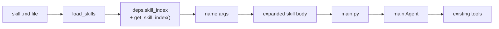

# Co CLI — Skills

> Sibling surfaces: [memory.md](memory.md) · [personality.md](personality.md) · [tools.md](tools.md). Bootstrap (when skills load): [bootstrap.md](bootstrap.md). Per-turn skill-env lifecycle: [core-loop.md](core-loop.md). Dispatch discipline: [06_skill_protocol.md](../../co_cli/context/rules/06_skill_protocol.md).

Skills are procedural capability — name-addressable workflows injected as prompt overlays. They are distinct from memory (declarative state), tools (callable primitives), and personality (doctrine). Dispatching a skill does not register a new tool; it expands a body string into the main agent for a normal LLM turn.

## 1. Functional Architecture



### Components

| Component | Role |
|-----------|------|
| `load_skills` | Two-pass loader — bundled then user-global; security scan applied to user-global only |
| `deps.skill_index` | Full skill registry (`dict[str, SkillInfo]`); used by slash-command dispatch |
| `get_skill_index()` | Model-facing subset — excludes hidden skills; source for `<available_skills>` manifest |
| `render_skill_manifest()` | Renders `<available_skills>` XML block injected into the static system prompt |
| `dispatch(raw_input, ctx)` | Routes slash commands — built-ins first, then `skill_index`, then error |
| `refresh_skills(deps)` | Hot-reload: re-loads both tiers, replaces `deps.skill_index`; called by `skill_manage` and `/skills reload` |
| `skill_manage` | Single model-callable write entry point — create, edit, patch, delete |
| `skill_view` | Model-callable reader — returns full skill body inline |

### Entry Points

Startup: `create_deps()` in `co_cli/bootstrap/core.py` calls `load_skills()` during deps assembly.

Per-turn: `main.py` saves current env for keys in `skill_env`, calls `os.environ.update(skill_env)`, runs the turn, and restores previous values in a `finally` block.

## 2. Core Logic

### Invocation Paths

Skills are reached through three distinct paths:

**Path 1 — User slash-command.**
The user types `/skill-name [args]` in the REPL. `dispatch()` matches the name in `skill_index`, expands the body (argument substitution), and returns `DelegateToAgent`. The REPL then calls `run_turn()` with the expanded body as the user input — a full new agent turn. The skill body replaces the user's input for that turn; the model never sees the raw `/skill-name` string.

**Path 2 — Model inline use.**
The agent reads the `<available_skills>` manifest injected into the static system prompt, identifies a matching skill, and calls `skill_view(name)` to load the full body. The body is returned as a tool result inside the current turn. The agent reads it and follows its phases as its procedure — no new turn, no dispatch, no REPL involvement. This is the primary path for agent-initiated skill use.

**Path 3 — Model write.**
The agent calls `skill_manage(action=...)` to create, edit, patch, or delete a user skill. Used for drift fixes (stale steps), promoting a reusable procedure to a new skill, or removing an obsolete one. `skill_manage` requires approval, runs the security scan, and calls `refresh_skills(deps)` on success so the change is live immediately.

Background passes (session reviewer, curator) also write via `skill_manage` but run in forked `CoDeps` with auto-approved skill ops — they are extensions of Path 3, not separate paths.

### Skill Model

`SkillInfo` in `co_cli/skills/skill_types.py`:

| Field | Purpose |
|-------|---------|
| `name` | slash-command name derived from file stem |
| `description` | listing text shown in `/skills` and exposed via `get_skill_index()` |
| `body` | prompt body injected into the main agent on dispatch |
| `argument_hint` | UI hint for `/help` and `/skills` |
| `user_invocable` | whether the skill appears as a slash command |
| `disable_model_invocation` | hide from `get_skill_index()` results and manifest |
| `skill_env` | env vars injected for the duration of the dispatched turn |
| `path` | absolute path to the `.md` file on disk; `None` for programmatic configs |

### File Format

Markdown files parsed with `parse_frontmatter()` from `co_cli/memory/frontmatter.py`. Skill name is always the filename stem. Built-in slash commands are reserved and cannot be shadowed.

| Frontmatter Field | Purpose |
|-------------------|---------|
| `description` | human-readable summary (required) |
| `argument-hint` | argument usage hint |
| `user-invocable` | include in slash-command completer and `/help` |
| `disable-model-invocation` | hide from `get_skill_index()` and manifest |
| `skill-env` | turn-scoped env injection, filtered through `_SKILL_ENV_BLOCKED` |

### Load Order

```
create_deps()
  ├─ Pass 1: load bundled skills from co_cli/skills/*.md
  │    no security scan (version-controlled)
  └─ Pass 2: load user-global skills from ~/.co-cli/skills/*.md
       security scan applied
       name collision → user-global overrides bundled
```

### Load Safety

**Containment.** For user-global skills, symlinks are rejected outright — only regular files are loaded. Symlink files are skipped with a warning. Bundled skills are not checked.

**Security scan.** `scan_skill_content()` runs static regex checks on every user-global file at startup and on `/skills reload`. Warning classes: credential exfiltration, curl/wget piped to shell, destructive shell fragments, prompt-injection text. Findings are warnings — the file still loads.

`skill-env` is filtered through `_SKILL_ENV_BLOCKED`, which prevents overriding `PATH`, `PYTHONPATH`, `HOME`, and shell-loader variables.

### Dispatch

Skill dispatch is the third branch of `dispatch()` (after built-ins and before unknown-command error). Full routing lives in `tui.md`; this section covers the skill branch only.

```
name matched in ctx.deps.skill_index
  body = skill.body
  if args non-empty AND "$ARGUMENTS" in body:
    args_list = args.split()           # whitespace-split positional args
    body = body.replace("$ARGUMENTS", args)   # raw argument string
    body = body.replace("$0", name)           # skill name
    for i, arg in reversed(enumerate(args_list, 1)):
      body = body.replace(f"${i}", arg)       # $1, $2, ... positional
  # else: body used as-is (no args or no $ARGUMENTS token in body)
  return DelegateToAgent(
    delegated_input=body,
    skill_env=dict(skill.skill_env),   # copy of filtered env vars
    skill_name=skill.name,             # stored as deps.runtime.active_skill_name by caller
  )
```

Positional replacements iterate in reverse order so `$1` does not partially match `$10`, `$11`, etc.

### Argument Expansion

| Token | Replacement | Condition |
|-------|------------|-----------|
| `$ARGUMENTS` | raw argument string (unsplit) | only when args non-empty and token present in body |
| `$0` | skill name | same |
| `$1`, `$2`, ... | whitespace-split positional args | same; missing positionals left as literal `$N` |

If no arguments are passed, or the body contains no `$ARGUMENTS` token, the body is used verbatim.

### Skill Env Lifecycle

```
main.py — per-turn
  saved = {k: os.environ.get(k) for k in skill_env}
  os.environ.update(skill_env)
  try:
    run_turn()
  finally:
    restore saved values (delete keys not previously present)
    clear deps.runtime.active_skill_name
```

### Skill Management Commands

| Command | Purpose |
|---------|---------|
| `/skills list` | show loaded skills |
| `/skills check` | compare available files vs loaded skills across both tiers; report skip reasons |
| `/skills lint [<name>\|--all]` | run R1–R4 advisory lint rules; exit 1 on any finding |
| `/skills reload` | rescan user-global directory and reload into live session |
| `/skills review run` | manually trigger one session-review pass against current transcript |
| `/skills usage [<name>]` | print the per-skill usage sidecar (table for all; full record for one) |
| `/skills pin <name>` | pin an agent-created skill — exempt from curator lifecycle transitions |
| `/skills unpin <name>` | clear the pinned flag |
| `/skills curator status` | show curator gate state — `enabled`, `last_run_at`, `next_eligible_at`, `interval_hours`, `pending_transitions`, `run_count`, `last_summary` |
| `/skills curator run` | run the curator immediately (skips the interval gate; still respects `curator_enabled`) |
| `/skills curator restore <name>` | move an archived skill back from `.archive/` into the active library |

`/skills reload` rescans only the user-global directory. `/skills check` covers both tiers.

### Authoring Contract

Every skill body has this minimum shape:

```markdown
---
description: <single sentence: when to use this skill, max 1024 chars>
argument-hint: <optional, max 80 chars>
user-invocable: true
---

# <Skill name>

<body — whatever structure fits the skill>
```

Section requirements:

| Section | Required | Notes |
|---------|----------|-------|
| Frontmatter `description` | Yes | ≤1024 chars; drives manifest injection |
| H1 title | Yes | First non-frontmatter heading |
| Body content | Yes | Whatever structure best fits the skill |

Length budget:

| Scope | Limit | Enforcement |
|-------|-------|-------------|
| Frontmatter `description` | ≤1024 chars | Hard — `_validate_skill_content` blocks the write |
| Total content | ≤50,000 chars | Hard — `_validate_skill_content` blocks the write |
| Body | ≤8000 chars | Soft — R4 lint warning ("consider splitting") |

Recommended structure for multi-step procedural skills (template, not requirement):

```markdown
## Phase 1 — <Accomplishment name>
<step-by-step instructions>

## Phase N — <Accomplishment name>
...

## Rules
- <terminal invariant>
```

Phase headers use H2 with integer N, em-dash (` — `), and a name describing what the phase **accomplishes** (e.g. `Phase 1 — Load`, not `Phase 1 — First steps`). Short skills, reference tables, and quick-action skills do not need this structure.

Style: imperative voice (`Run X`, `Check Y`), concrete tool names in backticks, no filler. `## Rules` entries are invariants, not steps.

### Lint Rules

Four advisory rules surfaced by `/skills lint` and attached to `skill_manage` success output as `lint_warnings`. Each finding is `R<n>: <message>`; lint never blocks a write.

| Rule | Check | Why |
|------|-------|-----|
| **R1** | Frontmatter present | Loader rejects files without frontmatter |
| **R2** | `description` present, non-empty, ≤ 1024 chars | Missing description = invisible in manifest; long descriptions bloat manifest and degrade prompt cache hit rates |
| **R3** | H1 title present after frontmatter | Anchors skill identity in `skill_view` output |
| **R4** | Body ≤ 8000 chars (warning) | Long bodies signal overly broad skills that should be split; the hard cap is 50,000 chars |

One additional gate for the shipped reference library only (run from `tests/test_flow_skill_bundled_library.py`):

| Rule | Check | Scope |
|------|-------|-------|
| **B1** | No `TODO`, `FIXME`, or `XXX` markers | `co_cli/skills/*.md` only |

Lint is collaborative — it catches well-meaning skills that won't perform well. The security scan (`scan_skill_content`) is adversarial — it catches actively malicious content. Integrity rules (frontmatter integrity, description present and ≤1024, total content ≤100k) block the write via `_validate_skill_content`; lint never blocks; security scan blocks on findings at write time.

### Curation & Self-Improvement

Three in-session reflexes govern skill quality during a task:

- **Drift fix**: when a loaded skill has stale steps, patch immediately via `skill_manage(action='patch')` for surgical edits or `action='edit'` for structural overhauls.
- **Create**: after completing a multi-step task (3+ coherent steps), if the procedure is class-level reusable, promote it to a skill. Bar: "would I run this again for the same kind of task" — not one-offs.
- **Offer-to-save**: after iterative work where no skill was loaded, briefly offer skill creation before invoking `skill_manage(action='create')`.

**Background session reviewer.** After approximately every `review_nudge_interval` tool calls, a `session_reviewer` agent runs in the background with the serialized session transcript and applies improvements the in-flight reflexes may have missed.

```
session_reviewer (pass 1 — every nudge)
  ├─ scan for drift in skills loaded during session → patch or edit
  ├─ create new class-level skills for reusable procedures not in library
  ├─ create or update knowledge artifacts for user preferences and corrections
  └─ never deletes skills or creates session-specific skills

skill_curator (pass 2 — runs when curator_enabled and interval elapsed)
  ├─ Phase 1: apply lifecycle transitions (active → stale → archived)
  ├─ Phase 2: consolidate prefix-clustered narrow skills into class-level umbrellas
  └─ Phase 3: write per-run report + persist curator state
```

Output per session-reviewer run at `~/.co-cli/session-reviews/<timestamp>-<run_id_suffix>/`:
- `run.json` — structured: `run_id`, `summary`, `skills_patched`, `skills_created`, `knowledge_created`, `knowledge_updated`, `transcript_length`, `usage`
- `run.md` — human-readable summary

Output per curator run at `~/.co-cli/curator-runs/<timestamp>-<run_id_suffix>/`:
- `run.json` — structured: `run_id`, `summary`, `skills_merged`, `skills_created`, `skills_updated`, `usage`
- `run.md` — human-readable summary

The reviewer runs in a forked `CoDeps` via `fork_deps_for_reviewer`; the curator uses `fork_deps_for_curator` (skill writes only, no knowledge writes). Both reload skills from disk before their pass so successive passes within the same session see prior writes.

Curation preference order: update a skill loaded in the current session → update an existing umbrella skill → create a new class-level skill only if nothing applicable exists.

**Curator gate.** The curator pass runs after the session reviewer completes. It is suppressed unless all of the following hold: `skills.curator_enabled=True`, a model is configured (`deps.model is not None`), the curator state is not `paused`, and either `last_run_at` is absent OR the elapsed time since `last_run_at` exceeds `curator_interval_hours` (default 168h = 7 days). Manual `/skills curator run` skips the time gate but still requires a model and respects `curator_enabled`.

**Lifecycle states.** Each agent-created skill carries a `state` field in the usage sidecar (`~/.co-cli/skills/.usage.json`):
- `active` — default; eligible for dispatch and consolidation.
- `stale` — idle longer than `CURATOR_STALE_AFTER_DAYS` (30 days). Skill remains in `user_skills_dir`; consolidation candidate. Recovers to `active` automatically if used again within the stale threshold.
- `archived` — was `stale` and idle longer than `CURATOR_ARCHIVE_AFTER_DAYS` (90 days). File moves to `user_skills_dir/.archive/`; excluded from the manifest. Restored manually via `/skills curator restore <name>`.

Pinned skills (`/skills pin <name>`) are exempt from all state transitions.

**Usage sidecar.** `~/.co-cli/skills/.usage.json` tracks per-skill counters (`use_count`, `view_count`, `patch_count`) and timestamps (`created_at`, `last_used_at`, `last_viewed_at`, `last_patched_at`). Counters update on every `skill_view` and `skill_manage` call. Sidecar I/O is best-effort: failures are logged and swallowed so usage tracking never blocks the underlying tool. Counters are populated only for skills in `user_skills_dir` — bundled skills are excluded.

## 3. Config

| Setting | Env Var | Default | Description |
|---------|---------|---------|-------------|
| `skills.review_enabled` | `CO_SKILLS_REVIEW_ENABLED` | `false` | Enable background session reviewer |
| `skills.review_nudge_interval` | `CO_SKILLS_REVIEW_NUDGE_INTERVAL` | `5` | Tool-call count between review triggers |
| `skills.usage_tracking_enabled` | `CO_SKILLS_USAGE_TRACKING_ENABLED` | `true` | Persist per-skill counters/timestamps to `.usage.json` |
| `skills.curator_enabled` | `CO_SKILLS_CURATOR_ENABLED` | `false` | Enable curator second-pass after the session reviewer |
| `skills.curator_interval_hours` | `CO_SKILLS_CURATOR_INTERVAL_HOURS` | `168` | Minimum hours between curator runs (7 days) |
| `REVIEW_MAX_ITERATIONS` | — | `8` | Max LLM request budget per reviewer pass (code constant in `co_cli/config/skills.py`) |
| `REVIEW_TIMEOUT_SECONDS` | — | `120` | Wall-clock timeout for the reviewer pass |
| `CURATOR_MAX_ITERATIONS` | — | `100` | Max LLM request budget per curator consolidation pass |
| `CURATOR_TIMEOUT_SECONDS` | — | `600` | Wall-clock timeout for the curator pass |
| `CURATOR_STALE_AFTER_DAYS` | — | `30` | Idle days before `active → stale` |
| `CURATOR_ARCHIVE_AFTER_DAYS` | — | `90` | Idle days before `stale → archived` |

### Paths

| Path | Source | Description |
|------|--------|-------------|
| `deps.skills_dir` | package directory `co_cli/skills/` | bundled skills (lowest priority) |
| `deps.user_skills_dir` | `~/.co-cli/skills/` | user-global skills (overrides bundled on name collision) |
| `~/.co-cli/skills/.usage.json` | `co_cli/skills/usage.py` | per-skill usage sidecar (counters, timestamps, state, pinned) |
| `~/.co-cli/skills/.curator_state.json` | `co_cli/skills/curator.py` | curator run state (`last_run_at`, `run_count`, `paused`) |
| `~/.co-cli/skills/.archive/` | `co_cli/skills/curator.py` | archived skills moved here; restored via `/skills curator restore` |
| `~/.co-cli/curator-runs/<timestamp>-<run_id>/` | `co_cli/skills/curator.py` | per-run curator reports (`run.json`, `run.md`) |

## 4. Public Interface

### Model-callable tools

#### `skill_manage(action, name, ...)`

Single write entry point for the skills channel. `co_cli/tools/system/skills.py`. `approval=True`; subject `tool:skill_manage:<action>:<name>`.

| Action | Behaviour |
|--------|-----------|
| `create` | Write new `<name>.md` to `user_skills_dir`; reject if exists; validate frontmatter (`description` required, ≤1024 chars); security scan; rollback on flag; reload. |
| `edit` | Full rewrite of an existing user-installed skill; validate + scan + rollback on flag; reload. |
| `patch` | Find-and-replace within a skill body; `replace_all=False` enforces exactly one match; scan + rollback; reload. |
| `delete` | Remove user-installed skill; reload; returns `shadowed_bundled=true` when a bundled skill of the same name becomes active. |

`edit`, `patch`, and `delete` reject bundled-only skills ("copy to `~/.co-cli/skills/` first"). After every successful write, `refresh_skills(deps)` re-loads and re-indexes so the change is immediately dispatchable.

#### `skill_view(name, file_path=None)`

Returns a skill's full body. Plugin-qualified names (`plugin:skill`) accepted; prefix stripped. `spill_threshold_chars=inf` — body always lands inline regardless of size. `file_path` always returns `tool_error`.

### Loader and registry

| Symbol | Source | Contract |
|--------|--------|---------|
| `load_skills(skills_dir, settings, user_skills_dir) -> dict[str, SkillInfo]` | `co_cli/skills/loader.py` | Two-pass loader; security scan on user-global only |
| `refresh_skills(deps) -> None` | `co_cli/skills/lifecycle.py` | Re-loads both tiers; replaces `deps.skill_index` |
| `get_skill_index(skill_index) -> list[dict]` | `co_cli/skills/index.py` | Model-facing list; excludes `disable_model_invocation=True` and blank-description skills |

### Manifest injection

| Symbol | Source | Contract |
|--------|--------|---------|
| `render_skill_manifest(skill_index, skills_dir, user_skills_dir) -> str` | `co_cli/context/manifests/skill_manifest.py` | Renders `<available_skills>` XML block for the static system prompt |

### Schema

| Symbol | Source | Contract |
|--------|--------|---------|
| `SkillInfo` | `co_cli/skills/skill_types.py` | Frozen dataclass — `name`, `description`, `body`, `argument_hint`, `user_invocable`, `disable_model_invocation`, `skill_env`, `path` |
| `LintFinding` | `co_cli/skills/_lint.py` | Frozen dataclass — `rule`, `line`, `message` |

## 5. Files

| File | Purpose |
|------|---------|
| `co_cli/skills/skill_types.py` | `SkillInfo` frozen dataclass |
| `co_cli/skills/lint.py` | `lint_skill(content, path)` — R1–R4 advisory validator; `lint_bundled_extras(content)` — B1 no-marker gate; `LintFinding` dataclass |
| `co_cli/skills/loader.py` | `load_skills`, `_load_skill_file`, `scan_skill_content` |
| `co_cli/skills/index.py` | `set_skill_index()`, `get_skill_index()` |
| `co_cli/skills/lifecycle.py` | `refresh_skills`, `discover_skill_files`, `read_skill_meta`, `cleanup_skill_run_state` |
| `co_cli/config/skills.py` | `SkillsSettings` — Pydantic config model |
| `co_cli/context/manifests/skill_manifest.py` | `render_skill_manifest()` |
| `co_cli/commands/core.py` | `dispatch` and `BUILTIN_COMMANDS` registrations |
| `co_cli/commands/skills.py` | `/skills` command family (list/check/lint/reload/review/usage/pin/unpin/curator) |
| `co_cli/commands/registry.py` | `BUILTIN_COMMANDS` dict, `SlashCommand` dataclass |
| `co_cli/bootstrap/core.py` | `create_deps()` — skill loading at startup |
| `co_cli/main.py` | per-turn skill-env lifecycle, live skill reload, skill manifest injection; `_maybe_run_session_review` (pass 1), `_maybe_run_curator` and `_curator_gate_passes` (pass 2) |
| `co_cli/deps.py` | `skills_dir`, `user_skills_dir`, `skill_index`, `active_skill_name` on `CoDeps`; `fork_deps_for_reviewer`, `fork_deps_for_curator` |
| `co_cli/memory/frontmatter.py` | markdown frontmatter parsing used by skill loader |
| `co_cli/tools/system/skills.py` | `skill_view`, `skill_manage` — both call into `co_cli/skills/usage.py` on success |
| `co_cli/skills/session_review.py` | `SESSION_REVIEW_SPEC`, `run_session_review()` — pass 1 (skill+knowledge reviewer) |
| `co_cli/skills/curator.py` | `CURATOR_SPEC`, `run_curator()` — pass 2 (state transitions + consolidation + report); state machine (`apply_state_transitions`, `archive_skill`, `restore_skill`, `read_curator_state`, `write_curator_state`) |
| `co_cli/skills/usage.py` | usage sidecar I/O (`bump_view`, `bump_use`, `bump_patch`, `record_create`, `forget`, `set_pinned`) |
| `co_cli/skills/session_review_prompts.py` | reviewer agent instructions and prompt template |
| `co_cli/skills/curator_prompts.py` | curator agent instructions and prompt template |
| `co_cli/context/rules/06_skill_protocol.md` | dispatch discipline injected into the static system prompt |
| `co_cli/skills/` | package-default shipped skills |

## 6. Test Gates

| Property | Test file |
|----------|-----------|
| All bundled skills load without error | `tests/test_flow_skill_bundled_library.py` |
| All bundled skills pass lint (R1–R4) | `tests/test_flow_skill_bundled_library.py` |
| All bundled skills pass B1 (no TODO/FIXME/XXX markers) | `tests/test_flow_skill_bundled_library.py` |
| Skill manifest renders correct entry count for bundled set | `tests/test_flow_skill_bundled_library.py` |
| /skill-creator dispatches to DelegateToAgent | `tests/test_flow_skill_creator_dispatch.py` |
| skill-creator body references `skill_manage(action='create')` | `tests/test_flow_skill_creator_dispatch.py` |
| R1 fires on missing frontmatter | `tests/test_flow_skill_lint.py` |
| R2 fires on missing, empty, or overlong description | `tests/test_flow_skill_lint.py` |
| R3 fires on missing H1 title | `tests/test_flow_skill_lint.py` |
| R4 fires when body exceeds 8000 chars | `tests/test_flow_skill_lint.py` |
| B1 fires on TODO/FIXME/XXX markers | `tests/test_flow_skill_lint.py` |
| Clean content produces no lint findings | `tests/test_flow_skill_lint.py` |
| skill_manage success output includes lint_warnings when content has advisory findings | `tests/test_flow_skills_manage.py` |
| Bundled skill renders as `<skill>` entry in manifest | `tests/test_flow_skill_manifest.py` |
| User-installed skills appear in manifest | `tests/test_flow_skill_manifest.py` |
| User skill shadows bundled skill with its own description | `tests/test_flow_skill_manifest.py` |
| Empty skill set returns empty string (no empty XML block) | `tests/test_flow_skill_manifest.py` |
| XML-special chars in descriptions are escaped in manifest | `tests/test_flow_skill_manifest.py` |
| 06_skill_protocol.md appears in assembled static instructions | `tests/test_flow_skill_protocol.py` |
| skill-creator present in `<available_skills>` manifest | `tests/test_flow_skill_protocol.py` |
| Background review section present in 06_skill_protocol.md | `tests/test_flow_skill_protocol.py` |
| create writes file and skill appears in deps.skill_index | `tests/test_flow_skills_manage.py` |
| create rejects missing description and existing skill | `tests/test_flow_skills_manage.py` |
| create rolls back on destructive shell pattern | `tests/test_flow_skills_manage.py` |
| edit rewrites user skill; rejects bundled-only | `tests/test_flow_skills_manage.py` |
| edit rolls back on security-flagged content | `tests/test_flow_skills_manage.py` |
| patch replaces unique match; errors on zero or multiple matches without replace_all | `tests/test_flow_skills_manage.py` |
| patch replace_all=True replaces all occurrences | `tests/test_flow_skills_manage.py` |
| patch rolls back on security-flagged result | `tests/test_flow_skills_manage.py` |
| delete removes user copy; promotes bundled shadow | `tests/test_flow_skills_manage.py` |
| delete rejects nonexistent and bundled-only skills | `tests/test_flow_skills_manage.py` |
| size_warning emitted when skill count reaches 30 | `tests/test_flow_skills_manage.py` |
| skill_view returns body inline regardless of size | `tests/test_flow_skills_tools.py` |
| skill_view resolves plugin-qualified names | `tests/test_flow_skills_tools.py` |
| skill_view errors on unknown name, hidden skill, or file_path | `tests/test_flow_skills_tools.py` |
| active → stale transition when idle exceeds stale threshold | `tests/test_flow_skills_curator.py` |
| stale → active recovery when recently used within threshold | `tests/test_flow_skills_curator.py` |
| stale → archived transition when idle exceeds archive threshold | `tests/test_flow_skills_curator.py` |
| pinned skill skips all state transitions | `tests/test_flow_skills_curator.py` |
| archived skill is skipped by transition scan | `tests/test_flow_skills_curator.py` |
| fallback to created_at when last_used_at is absent | `tests/test_flow_skills_curator.py` |
| archive_skill moves file to .archive/; restore_skill reverses it | `tests/test_flow_skills_curator.py` |
| archive_skill idempotent when already archived | `tests/test_flow_skills_curator.py` |
| read_curator_state returns defaults when file absent or corrupt | `tests/test_flow_skills_curator.py` |
| write_curator_state is atomic (write + read roundtrip) | `tests/test_flow_skills_curator.py` |
| curator gate: passes when never run | `tests/test_flow_skill_curator.py` |
| curator gate: blocks within interval | `tests/test_flow_skill_curator.py` |
| curator gate: blocks when paused even if interval elapsed | `tests/test_flow_skill_curator.py` |
| curator gate: tolerates unparseable last_run_at | `tests/test_flow_skill_curator.py` |
| _maybe_run_curator short-circuits when disabled or no model | `tests/test_flow_skill_curator.py` |
| _maybe_run_curator blocked by recent run (run_count unchanged) | `tests/test_flow_skill_curator.py` |
| run_curator applies Phase 1 state transitions (active → stale) | `tests/test_flow_skill_curator.py` |
| run_curator writes Phase 3 state even when Phase 2 agent fails | `tests/test_flow_skill_curator.py` |
| usage sidecar read/write roundtrip; returns empty when missing or corrupt | `tests/test_flow_skill_usage.py` |
| write_records is atomic | `tests/test_flow_skill_usage.py` |
| is_agent_created: true for user skill, false for bundled or nonexistent | `tests/test_flow_skill_usage.py` |
| bump_view/bump_use/bump_patch increment counters and set timestamps | `tests/test_flow_skill_usage.py` |
| bump_view skips bundled skills and short-circuits when tracking disabled | `tests/test_flow_skill_usage.py` |
| record_create initializes sidecar entry | `tests/test_flow_skill_usage.py` |
| forget removes sidecar entry; no-op on unknown | `tests/test_flow_skill_usage.py` |
| set_pinned creates stub when no record; toggles existing record | `tests/test_flow_skill_usage.py` |
| bump_view swallows write failures (best-effort) | `tests/test_flow_skill_usage.py` |
| skill_manage create/view/patch/edit/delete update sidecar counters | `tests/test_flow_skill_usage.py` |
| /skills pin sets pinned flag; /skills unpin clears it | `tests/test_flow_skills_pin.py` |
| /skills pin on bundled skill is rejected | `tests/test_flow_skills_pin.py` |
| /skills pin on unknown skill is rejected | `tests/test_flow_skills_pin.py` |
| /skills usage lists agent-created skills; excludes bundled | `tests/test_flow_skills_usage.py` |
| /skills usage <name> prints full record | `tests/test_flow_skills_usage.py` |
