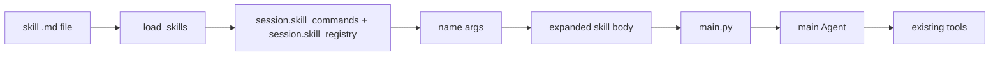

# Co CLI Skills Design

## Product Intent

**Goal:** Define the skill system — markdown prompt overlays dispatched via slash commands.
**Functional areas:**
- Two-tier load order (bundled → user-global)
- Frontmatter parsing and load gating
- Containment check and security scan
- Skill registry, dispatch, and argument expansion (`$ARGUMENTS`, `$N`, `$0`)
- Skill-env injection and lifecycle (set before turn, cleaned up after)

**Non-goals:**
- Tool registration (skills are prompt overlays only)
- Cross-session skill state

**Success criteria:** Skills load in correct tier order; security scan enforced on user/project tiers; skill env cleaned up after each turn.
**Status:** Stable

---

This doc owns the skill system: markdown skill files, frontmatter parsing, load order, capability gating, security scanning, slash-command dispatch, argument substitution, and skill-env injection. It does not own callable tools or turn execution internals.

## 1. What & How

Skills in `co-cli` are prompt overlays loaded from markdown files and exposed through slash commands. A skill does not register a new tool. Instead, it expands into an agent-body string that is fed back into the main agent for a normal LLM turn.

## 2. Core Logic

### Skill Model

The in-memory shape is `SkillConfig` in `co_cli/commands/_skill_types.py`.

| Field | Purpose |
| --- | --- |
| `name` | slash-command name derived from file stem |
| `description` | listing text shown in `/skills` and exposed in `session.skill_registry` |
| `body` | prompt body injected into the main agent on dispatch |
| `argument_hint` | UI hint for `/help` and `/skills` |
| `user_invocable` | whether the skill appears as a slash command |
| `disable_model_invocation` | hide from model-facing `skill_registry` |
| `requires` | environment/platform/settings gates |
| `skill_env` | env vars injected only for the duration of the dispatched turn |

### File Format

Skills are markdown files parsed with `parse_frontmatter()` from `co_cli/knowledge/_frontmatter.py`.

Supported frontmatter fields parsed from the skill file:

| Field | Purpose |
| --- | --- |
| `description` | human-readable summary |
| `argument-hint` | argument usage hint |
| `user-invocable` | include in slash-command completer and `/help` |
| `disable-model-invocation` | hide from `session.skill_registry` |
| `requires` | gate loading on bins, anyBins, env, os, or settings |
| `skill-env` | turn-scoped env injection, filtered through a blocked-key list |
| `source-url` | installation provenance; read at upgrade time by `_upgrade_skill()`, not stored in `SkillConfig` |

The skill name is always the filename stem. Built-in slash commands are reserved names and cannot be shadowed.

### Load Order

Skills are loaded in two passes, lowest-priority first:

1. **bundled** — package defaults from `co_cli/skills/*.md` (version-controlled; no runtime security scan)
2. **user-global** — `~/.co-cli/skills/*.md` (from `deps.user_skills_dir`; security scan applied)

User-global skills override bundled skills on name collision.

`_load_skill_file(path, root, scan)` is the per-file loader. The `root` parameter is the load root used for containment checking. `scan=False` is passed for the bundled pass (version-controlled, no runtime scan needed); `scan=True` is passed for the user-global pass.

Loading happens at startup inside `create_deps()` (in `bootstrap/core.py`) as part of deps assembly:

1. load bundled, then user-global skills
2. `skill_commands` passed into `CoDeps` constructor
3. `completer.words = _build_completer_words(deps.skill_commands)` — called in `main.py` immediately after `create_deps()` returns

### Load Gating

The `requires` block is evaluated by `_check_requires()` before a skill enters the registry.

Current gates:

| Key | Rule |
| --- | --- |
| `bins` | all listed binaries must exist on `PATH` |
| `anyBins` | at least one listed binary must exist |
| `env` | all listed environment variables must be set |
| `os` | `sys.platform` must match one of the prefixes |
| `settings` | named settings fields must be present and truthy |

Skills that fail a gate are skipped, not loaded in a degraded state.

### Containment Check

`_is_safe_skill_path(path, root)` is called for every file before it is loaded during the user-global pass. It resolves symlinks and verifies the resolved path is still inside `root`. If a symlink points outside the load root, the file is skipped and a `logger.warning` is emitted. Bundled skills are version-controlled and not subject to this check.

### Security Scan

Skill content is scanned by `_scan_skill_content()` using static regex checks before or during load. Current warning classes include:

1. credential exfiltration patterns
2. curl or wget piped into shell
3. destructive shell fragments
4. prompt-injection style text

Behavior differs by path:

| Path | Behavior |
| --- | --- |
| startup / reload load path | warning only; file may still load |
| `/skills install` | warnings are shown and require explicit user confirmation |

`skill-env` is additionally filtered through `_SKILL_ENV_BLOCKED`, which prevents overriding critical process variables such as `PATH`, `PYTHONPATH`, `HOME`, and shell-loader variables.

### Registry

There are two skill registries:

| Registry | Purpose |
| --- | --- |
| `deps.skill_commands` | full loaded skill set used by slash-command dispatch |
| `get_skill_registry(deps.skill_commands)` | model-facing list of visible skills (name + description); excludes entries with `disable_model_invocation=True` or blank descriptions |

`set_skill_commands()` replaces `deps.skill_commands`. The model-facing skill registry is derived on read via `get_skill_registry()`, which excludes hidden skills by filtering out entries with `disable_model_invocation=True` or blank descriptions.

### Dispatch

Slash-command routing lives in `dispatch(raw_input, ctx)`.

Dispatch order:

1. built-in commands in `BUILTIN_COMMANDS`
2. skills in `ctx.deps.skill_commands`
3. unknown command error

When a skill matches:

1. the skill body is copied into `delegated_input`
2. argument placeholders are expanded
3. `DelegateToAgent(delegated_input, skill_env, skill_name)` is returned

`main.py` sets `deps.runtime.active_skill_name = outcome.skill_name` after receiving `DelegateToAgent`, before entering `run_turn()`.

The main chat loop receives a `DelegateToAgent` outcome, injects skill env, and runs a normal LLM turn with `delegated_input`. Skills do not bypass the agent loop, approval system, or tool contracts.

### Argument Expansion

The dispatch path supports simple positional substitution when arguments are supplied:

| Token | Replacement |
| --- | --- |
| `$ARGUMENTS` | raw argument string |
| `$0` | skill name |
| `$1`, `$2`, ... | positional whitespace-split arguments |

If no arguments are passed, the body is used as-is.

### Skill Env Lifecycle

Skill env injection is managed in `main.py`, not in the skill loader.

For a dispatched skill turn:

1. `deps.runtime.active_skill_name` is set from `outcome.skill_name`
2. current values for the selected env keys are saved
3. `os.environ` is updated from `outcome.skill_env`
4. `run_turn()` executes
5. a `finally` block restores previous env values and clears `active_skill_name`

This guarantees rollback on success, interruption, or exception.

### Skill Management Commands

The built-in `/skills` command family is implemented in `_cmd_skills()` and related helpers.

| Command | Purpose |
| --- | --- |
| `/skills list` | show loaded skills |
| `/skills check` | compare available files vs actually loaded skills across both tiers and report skip reasons |
| `/skills install <path|url>` | copy skill into user skills dir and reload |
| `/skills reload` | rescan the user-global skill directory and reload into the live session |
| `/skills upgrade <name>` | reinstall from stored `source-url` |

`/skills reload` rescans only the user-global directory; bundled skills are version-controlled and not rescanned at runtime. `/skills check` covers both tiers (bundled and user-global).

Installed skills are written to `~/.co-cli/skills/`.

## 3. Config

The skill system is lightly configured. The main runtime dependencies are the resolved skill paths on `CoDeps`.

| Setting | Source | Purpose |
| --- | --- | --- |
| `deps.skills_dir` | package directory `co_cli/skills/` | bundled skills directory (lowest priority) |
| `deps.user_skills_dir` | `~/.co-cli/skills/` | user-global skill directory (overrides bundled) |
| `settings` values referenced by `requires.settings` | `co_cli/config/` | load gating only |

There is no separate skills config object today.

## 4. Files

| File | Purpose |
| --- | --- |
| `co_cli/commands/_skill_types.py` | `SkillConfig` frozen dataclass |
| `co_cli/commands/_commands.py` | skill loader (`_load_skill_file`, `_is_safe_skill_path`), scanner, dispatch, and `/skills` commands |
| `co_cli/bootstrap/core.py` | `create_deps()` — MCP discovery, skill loading, and knowledge store init at startup |
| `co_cli/main.py` | per-turn skill-env lifecycle and live skill reload |
| `co_cli/deps.py` | `skills_dir`, `user_skills_dir` (workspace paths on CoDeps); `skill_commands` (top-level); `active_skill_name` (runtime) |
| `co_cli/knowledge/_frontmatter.py` | markdown frontmatter parsing used by skill loader |
| `co_cli/skills/` | package-default shipped skills |
| `~/.co-cli/skills/` | user-global skill files; override bundled skills on name collision |
| `docs/specs/flow-bootstrap.md` | when skills load during startup |
| `docs/specs/core-loop.md` | how dispatched skill bodies flow through a normal turn |
| `docs/specs/tools.md` | callable tool capabilities used by skills after dispatch |
