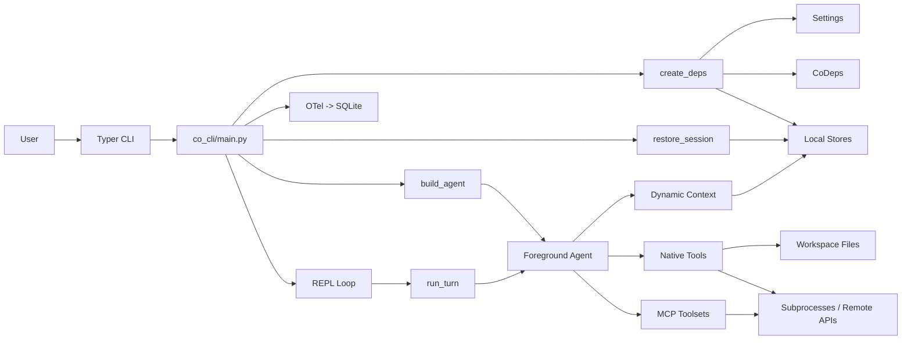

# Co CLI System Design

## Product Intent

**Goal:** Define the top-level runtime shape — subsystems, wiring, and boundaries.
**Functional areas:**
- CoDeps assembly and dependency direction
- Session lifecycle and system boundaries
- Degradation policy (startup failures, optional service unavailability)
- Cross-subsystem communication contracts

**Non-goals:**
- Component internals (owned by component specs)
- Startup sequencing (flow-bootstrap.md)
- Turn execution (core-loop.md)

**Success criteria:** All cross-subsystem communication goes through CoDeps; no hidden global state; degradation recorded and surfaced at startup.
**Status:** Stable

---

This doc defines the top-level runtime architecture of `co-cli`: the major subsystems, their boundaries, and how control moves through the system. It does not own component internals. Startup sequencing lives in [flow-bootstrap.md](flow-bootstrap.md), turn orchestration in [core-loop.md](core-loop.md), context and persistence in [context.md](context.md), tools in [tools.md](tools.md), skills in [skills.md](skills.md), model/provider rules in [llm-models.md](llm-models.md), telemetry in [observability.md](observability.md), and personality construction in [personality.md](personality.md).

## 1. What & How

`co-cli` is a local-first, approval-first terminal agent. A Typer CLI starts a REPL, startup assembles a `CoDeps` runtime and a single foreground `Agent`, and each user turn runs through one orchestration entrypoint that can call native tools, MCP tools, and persistent context stores. Durable state lives outside the model: session files, transcripts, memories, articles, the knowledge index, tool-result spill files, and telemetry are all stored on disk and reloaded or queried when needed.



## 2. Core Logic

### 2.1 Runtime Shape

The runtime is split into a small set of top-level owners:

| Owner | Responsibility |
| --- | --- |
| `co_cli/main.py` | CLI entrypoints, REPL loop, top-level lifecycle, and teardown |
| `co_cli/bootstrap/` | session startup, runtime assembly, and capability discovery |
| `co_cli/agent.py` | agent construction, instruction layers, and toolset assembly |
| `co_cli/commands/` | slash-command dispatch and skill delegation entrypoints |
| `co_cli/context/` | foreground-turn orchestration, history management, sessions, and transcripts |
| `co_cli/display/` | terminal rendering, prompt UX, and approval interaction |
| `co_cli/observability/` | telemetry export and trace storage plumbing |

This keeps the architecture intentionally simple:

- startup prepares the runtime once per session
- the agent is built once and reused across turns
- orchestration owns one-turn execution and approval resumes
- tools and storage are accessed through `CoDeps`, not through global mutable state

### 2.2 Session Lifecycle

The system has three phases:

1. **Startup**: load settings, resolve workspace paths, construct `CoDeps`, connect optional MCP servers, load skills, resolve the knowledge backend, build the agent, and restore or create the current session.
2. **Interactive session**: run the REPL, dispatch slash commands locally when possible, and send agent turns through `run_turn()` when model work is needed.
3. **Teardown**: drain background work, clean up the shell backend, and close async resources such as MCP connections.

At a high level, control flow looks like this:

```text
CLI start
  -> create_deps
  -> build_agent
  -> restore_session
  -> enter REPL
      -> local command or agent turn
      -> approvals / tools / persistence / post-turn writes as needed
  -> cleanup on exit
```

### 2.3 Runtime Contract

`CoDeps` is the shared runtime contract passed into tools and agent-side helpers. It carries:

- configuration, treated as read-only after bootstrap
- service handles such as shell, model, knowledge store, and resource locks
- bootstrap-built registries such as discovered tools and loaded skills
- session state that persists across turns
- runtime state that is reset or managed by orchestration
- resolved workspace and user-global paths
- degradation records produced during startup

The important architectural rule is that `co-cli` does not hide these concerns behind multiple config or service facades. Bootstrap assembles one runtime object, and the rest of the system consumes that object directly.

### 2.4 System Boundaries

The system is deliberately local-first:

- the primary control loop, persistent stores, and telemetry are local
- external systems are reached either during startup capability setup or through explicit tool boundaries at turn time
- write-capable agent actions go through the approval model
- missing or unhealthy optional integrations degrade capability rather than redefining the core loop

Persistent state is also intentionally small in surface area:

- project-local state lives under `.co-cli/`
- user-global state lives under `~/.co-cli/`
- model context is rebuilt from files, settings, and history instead of being treated as hidden process state

The specialized DESIGN docs own the detailed behavior inside each boundary:

- bootstrap order and degradation policy: [flow-bootstrap.md](flow-bootstrap.md)
- turn execution, approvals, and retries: [core-loop.md](core-loop.md)
- REPL loop, completer, and slash commands: [tui.md](tui.md)
- memories, sessions, transcripts, and knowledge search: [context.md](context.md)
- tool registration and approval behavior: [tools.md](tools.md)
- skill loading and dispatch: [skills.md](skills.md)
- provider and model selection rules: [llm-models.md](llm-models.md)
- tracing and log viewers: [observability.md](observability.md)

## 3. Config

These settings most directly affect top-level system assembly.

| Setting | Env Var | Default | Description |
| --- | --- | --- | --- |
| `llm.provider` | `LLM_PROVIDER` | `ollama-openai` | Default model provider used for the session runtime |
| `llm.host` | `LLM_HOST` | `http://localhost:11434` | Ollama-compatible host used during model setup and runtime calls |
| `llm.model` | `CO_LLM_MODEL` | provider default | Primary model name used when building the foreground agent |
| `mcp_servers` | `CO_CLI_MCP_SERVERS` | bundled defaults | MCP server definitions attached during runtime assembly |
| `personality` | `CO_CLI_PERSONALITY` | `tars` | Personality assets injected during prompt assembly |
| `knowledge.search_backend` | `CO_KNOWLEDGE_SEARCH_BACKEND` | `hybrid` | Preferred retrieval backend before runtime degradation |
| `library_path` | `CO_LIBRARY_PATH` | `~/.co-cli/library` | User-global article store root |
| `reasoning_display` | `CO_CLI_REASONING_DISPLAY` | `summary` | Terminal reasoning display mode for interactive turns |

## 4. Files

| File | Purpose |
| --- | --- |
| `co_cli/main.py` | Top-level CLI lifecycle, REPL loop, and teardown |
| `co_cli/bootstrap/core.py` | Runtime assembly and startup flow |
| `co_cli/agent.py` | Foreground agent, instruction layers, and tool registry construction |
| `co_cli/commands/_commands.py` | Slash-command dispatch and skill handoff into the REPL loop |
| `co_cli/deps.py` | Shared runtime contract and workspace path resolution |
| `co_cli/context/orchestrate.py` | One-turn execution entrypoint |
| `co_cli/observability/_telemetry.py` | SQLite-backed telemetry exporter used by the session runtime |
| `co_cli/observability/_file_logging.py` | Rotating file log handlers — dual-write alongside the SQLite OTel DB |
| `docs/flow-bootstrap.md` | Startup sequencing and degradation details |
| `docs/core-loop.md` | Foreground-turn behavior and approval resumes |
| `docs/tui.md` | REPL loop, completer, slash command registry and dispatch |
| `docs/context.md` | Prompt context, persistence, and knowledge retrieval |
| `docs/tools.md` | Tool surface, approval classes, and visibility |
| `docs/skills.md` | Skill loading and slash-command delegation |
| `docs/llm-models.md` | Provider and model selection rules |
| `docs/observability.md` | Telemetry pipeline and trace viewers |
