# Co CLI — Tools

> For system overview and approval boundary: [01-system.md](01-system.md). For the agent loop, orchestration, and approval flow: [core-loop.md](core-loop.md). For agent specs, builders, and runners: [agents.md](agents.md). For skill loading, dispatch, and curation: [skills.md](skills.md).

## 1. Functional Architecture

```mermaid
graph LR
    subgraph Registration
        A["@agent_tool\n(module import)"] -->|"self-registers"| B["TOOL_REGISTRY"]
    end
    subgraph Assembly
        B --> C1["build_native_toolset(config)\n→ (native_toolset, tool_index)"]
        C1 --> C2["build_mcp_entries(config, tool_index)"]
        C2 --> C3["MCP connect + discover\n(per-entry timeout / isolation)"]
        C3 --> C4["assemble_routing_toolset\nCombinedToolset.filtered"]
        C4 --> D["deps.toolset + deps.tool_index"]
    end
    subgraph Orchestrator
        D -->|"toolset"| E["Orchestrator Agent"]
        E --> F["CoToolLifecycle\nbefore_node_run\nbefore_tool_validate\nbefore_tool_execute\nafter_tool_execute"]
        F -->|"DeferredToolRequests"| G["Approval Loop\n_collect_deferred_tool_approvals\n+ resume segment"]
    end
```



### Tool Groups

| Group | Tools | Notes |
|-------|-------|-------|
| Interaction & Session | `clarify`, `capabilities_check`, `todo_write`, `todo_read` | All ALWAYS |
| Workspace & Files | `file_find`, `file_read`, `file_search`, `file_write`, `file_patch` | `file_write`/`file_patch` approval + lock |
| Knowledge, Memory & Skills | `session_search`, `session_view`, `memory_search`, `memory_view`, `memory_manage`, `skill_view`, `skill_manage` | `memory_manage`/`skill_manage` approval |
| Web | `web_search`, `web_fetch` | `web_search` requires `brave_search_api_key` |
| Execution & Jobs | `shell_exec`, `task_start`, `task_status`, `task_cancel`, `task_list`, `code_execute` | `shell_exec`/`code_execute` hybrid approval |
| Delegation | `web_research`, `knowledge_analyze`, `reason` | All DEFERRED; spawn task agents |
| Obsidian | `obsidian_list`, `obsidian_search`, `obsidian_read` | Gate: `obsidian_vault_path` |
| Google | `google_drive_search`, `google_drive_read`, `google_gmail_list`, `google_gmail_search`, `google_calendar_list`, `google_calendar_search`, `google_gmail_draft` | Gate: `google_credentials_path`; `google_gmail_draft` approval |

**Total: 37 native tools** (19 ALWAYS · 18 DEFERRED · 6 explicit approval-gated · 10 config-gated; `shell_exec` and `code_execute` may also prompt dynamically based on the command path)

`todo_write` and `todo_read` implement the agent's runtime self-planning capability. For the full planning contract, schema, validation rules, compaction snapshot, and rehydration semantics see [self-planning.md](self-planning.md).

### Shared Entry Points

`CoToolLifecycle` (`co_cli/tools/lifecycle.py`) is the pydantic-ai capability registered on the orchestrator agent. It fires four hooks per tool call: `before_node_run`, `before_tool_validate`, `before_tool_execute`, `after_tool_execute`. All tool instrumentation and safety guards run through these hooks — no inline per-tool branching.

Task-agent lifecycle — `fork_deps`, `build_task_agent`, `run_in_turn`, `run_standalone` — is owned by [agents.md](agents.md). Tool-side concerns end at `fork_deps`: it forwards `tool_index` for approval and span-attribute lookup and explicitly excludes `toolset` so the orchestrator's combined routing surface never propagates to a task agent.

## 2. Core Logic

### Lifecycle Hooks

```
tool call received
      │
      ▼
before_node_run  [CallToolsNode only]
  ┌──────────────────────────────────────┐
  │  for each part in model response:    │
  │    ToolCallPart?                     │
  │      (name, args) seen before?       │
  │        yes ──► DROP                  │
  │        no  ──► keep, mark seen       │
  │    TextPart / ThinkingPart           │
  │        ──► pass through unchanged    │
  └──────────────────────────────────────┘
      │
      ▼
before_tool_validate
  ┌──────────────────────────────────────┐
  │  args is str?                        │
  │    yes ──► repair_json               │
  │            trailing comma            │
  │            unclosed brace            │
  │            control chars             │
  │            bare None                 │
  │    no (dict) ──► pass through        │
  └──────────────────────────────────────┘
      │
      ▼
before_tool_execute
  ┌──────────────────────────────────────┐
  │  for each path-type arg:             │
  │    relative ──► absolute system path │
  └──────────────────────────────────────┘
      │
      ▼
  [ tool executes ]
      │
      ▼
after_tool_execute
  ┌────────────────────────────────────────────┐
  │  span ← co.tool.result_size (all tools)    │
  │  tool_name in tool_index? (native only)    │
  │    yes ──► span ← co.tool.source           │
  │            span ← co.tool.requires_approval│
  └────────────────────────────────────────────┘
```

### Approval Loop

```
                          ┌─────────────────────────────┐
                    ┌────►│  output = latest_result      │
                    │     └──────────────┬──────────────┘
                    │                    │
                    │        DeferredToolRequests?
                    │           │ no ──► turn complete
                    │           │ yes
                    │           ▼
                    │     for each deferred call:
                    │       │
                    │       ├─ "questions" in meta?
                    │       │     yes ──► prompt each question
                    │       │             ToolApproved(user_answers=[...])
                    │       │
                    │       └─ no ──► resolve_approval_subject
                    │                     │
                    │                     ├─ auto_approved?
                    │                     │     yes ──► True
                    │                     │
                    │                     └─ prompt user
                    │                           ├─ approved ──► True
                    │                           ├─ denied   ──► ToolDenied
                    │                           └─ always   ──► session rule
                    │           │
                    │           ▼
                    │     resume segment(deferred_tool_results=approvals)
                    │     [skips ModelRequestNode — no new model prompt]
                    └─────────────────────────────────────────────────────
```

Resume segments skip `ModelRequestNode` — no new model prompt is sent just to execute approved tools.

### Concurrency Safety

Most tools run concurrently by default (`is_concurrent_safe=True`). Three tools opt out
explicitly because they cannot tolerate interleaved invocations: `file_write`, `file_patch`,
`code_execute`. A per-session semaphore caps total concurrent tool calls at
`MAX_TOOL_DISPATCH_WORKERS = 10`; the 11th+ call queues until a slot frees. Forked agents
(reviewer) share the parent's semaphore so the cap is session-wide.

```
tool call dispatched
      │
      ├─ acquire deps.tool_dispatch_sem  (MAX_TOOL_DISPATCH_WORKERS = 10 per session)
      │       blocked? ──► queue until slot frees
      │
      ├─ is_concurrent_safe=False?  (file_write, file_patch, code_execute — explicit opt-out)
      │       yes ──► force sequential order in multi-tool batch
      │
      ├─ path locked by another agent?  (resource_locks)
      │       yes ──► tool_error  [fail-fast, no retry]
      │
      ├─ file_patch: file only partially read?  (file_tracker.is_partial)
      │       yes ──► tool_error("read the full file first")
      │
      └─ file_write/patch: disk mtime changed since last read?  (file_tracker.is_stale / is_read_and_stale)
              yes ──► tool_error("file changed on disk")
```

`is_concurrent_safe=True` means "safe to dispatch in parallel." `ResourceLockStore` fail-fast
on shared mutation keys is a complementary guard — both layers apply.

### Delegation Agents

Delegation tools (`web_research`, `knowledge_analyze`, `reason`) spawn focused task agents. The agent surface, spec records, runner semantics, depth check, single-span retry topology, and per-agent tool surfaces are owned by [agents.md](agents.md). Tools.md scope ends at the orchestrator hand-off via `fork_deps`.

## 3. Config

| Setting | Env Var | Default | Description |
|---------|---------|---------|-------------|
| `shell.max_timeout` | `CO_SHELL_MAX_TIMEOUT` | `300` | Hard cap for shell timeout (sec) |
| `shell.safe_commands` | `CO_SHELL_SAFE_COMMANDS` | built-in list | Safe-prefix auto-approval allowlist |
| `web.fetch_allowed_domains` | `CO_WEB_FETCH_ALLOWED_DOMAINS` | `[]` | Domain allowlist (optional) |
| `web.fetch_blocked_domains` | `CO_WEB_FETCH_BLOCKED_DOMAINS` | `[]` | Domain blocklist |
| `brave_search_api_key` | `BRAVE_SEARCH_API_KEY` | `null` | Required for `web_search` |
| `obsidian_vault_path` | `OBSIDIAN_VAULT_PATH` | `null` | Registration gate for Obsidian tools |
| `google_credentials_path` | `GOOGLE_CREDENTIALS_PATH` | `null` | Registration gate for Google tools |
| `memory_path` | `CO_MEMORY_PATH` | `~/.co-cli/memory/` | Memory item directory |
| `mcp_servers` | `CO_MCP_SERVERS` | 2 defaults | MCP server definitions |
| `tool_retries` | `CO_TOOL_RETRIES` | `3` | Default agent retry budget |
| `max_requests` tool arg | — | 10 / 8 / 3 | Per-call delegation request cap (research / analysis / reasoning); defaults are function-local |

## 4. Public Interface

### Tool registration

| Symbol | Source | Contract |
|--------|--------|----------|
| `@agent_tool(visibility=..., approval=..., is_read_only=..., is_concurrent_safe=True, spill_threshold_chars=..., ...)` | `co_cli/tools/agent_tool.py` | Decorator — self-registers a function into both `TOOL_REGISTRY` (list) and `TOOL_REGISTRY_BY_NAME` (dict) at import time. Default: `is_concurrent_safe=True` (concurrent). Set `is_concurrent_safe=False` only when the tool truly cannot tolerate concurrent invocation. `is_read_only=True` automatically implies `is_concurrent_safe=True`. |
| `TOOL_REGISTRY` | `co_cli/tools/agent_tool.py` | Module-level list populated at import time; read by `build_native_toolset()` |
| `build_native_toolset(config) -> tuple[AbstractToolset[CoDeps], dict[str, ToolInfo]]` | `co_cli/agent/core.py` | Pure-config helper. Returns the unfiltered native toolset and a fresh `tool_index` |
| `build_mcp_entries(config, tool_index) -> list[MCPToolsetEntry]` | `co_cli/agent/core.py` | Builds MCP entries wrapped with sequential-flag propagation; not yet connected |
| `assemble_routing_toolset(native, mcp_toolsets) -> AbstractToolset[CoDeps]` | `co_cli/agent/core.py` | Combines native + connected MCP toolsets, applies `_approval_resume_filter` |

> Agent builders (`build_orchestrator`, `build_task_agent`) and spec records (`OrchestratorSpec`, `TaskAgentSpec`) are documented in [agents.md § 4](agents.md).

### Tool output / errors

| Symbol | Source | Contract |
|--------|--------|----------|
| `tool_output(content, *, deps, tool_name, spill_threshold_chars=SPILL_THRESHOLD_CHARS) -> ToolReturn` | `co_cli/tools/tool_io.py` | Standard tool result emit; runs `spill_if_oversized` first |
| `tool_output_raw(content) -> ToolReturn` | `co_cli/tools/tool_io.py` | Bypass spill (for prebuilt structured output) |
| `tool_error(message, *, tool_name=None) -> ToolReturn` | `co_cli/tools/tool_io.py` | Standard tool error payload |
| `spill_if_oversized(content, tool_results_dir, tool_name, force=False, threshold=...) -> str` | `co_cli/tools/tool_io.py` | Persist oversized content; returns inline placeholder block |
| `check_tool_results_size(tool_results_dir) -> str | None` | `co_cli/tools/tool_io.py` | Returns warning text when `tool-results/` exceeds 100 MB |

### Tool lifecycle and approval

| Symbol | Source | Contract |
|--------|--------|----------|
| `CoToolLifecycle(AbstractCapability[CoDeps])` | `co_cli/tools/lifecycle.py` | pydantic-ai capability — fires `before_node_run`, `before_tool_validate`, `before_tool_execute`, `after_tool_execute` on every tool call |
| `resolve_approval_subject(tool_name, args) -> ApprovalSubject` | `co_cli/tools/approvals.py` | Maps a tool call to its approval-subject kind (`shell`, `path`, `domain`, `tool`) |
| `ApprovalSubject`, `SessionApprovalRule`, `ApprovalKindEnum` | `co_cli/deps.py` | Approval-subject record types and remembered-rule shape |
| `build_category_awareness_prompt(tool_index) -> str` | `co_cli/tools/deferred_prompt.py` | Static system-prompt hint listing deferred-tool categories |

### Delegation handoff

| Symbol | Source | Contract |
|--------|--------|----------|
| `fork_deps(base) -> CoDeps` | `co_cli/deps.py` | Builds an isolated `CoDeps` for a task agent; forwards `tool_index`, excludes `toolset`, increments `agent_depth` |

> Runners (`run_in_turn`, `run_standalone`, `_run_attempt`) live in [agents.md § 4](agents.md).

## 5. Files

| File | Role |
|------|------|
| `co_cli/agent/core.py` | `build_native_toolset()`, `build_mcp_entries()`, `assemble_routing_toolset()` |
| `co_cli/agent/toolset.py` | `_build_native_toolset()`, `_approval_resume_filter()`, `_config_requirement_met()` |
| `co_cli/agent/mcp.py` | `_build_mcp_toolsets()`, `discover_mcp_tools()` |
| `co_cli/tools/lifecycle.py` | `CoToolLifecycle` — all four per-call hooks |
| `co_cli/tools/approvals.py` | approval subject resolution and session-rule persistence |
| `co_cli/tools/deferred_prompt.py` | category-awareness prompt for DEFERRED tools |
| `co_cli/tools/agent_tool.py` | `@agent_tool` decorator, `TOOL_REGISTRY` self-populating list, `TOOL_REGISTRY_BY_NAME` lookup dict |
| `co_cli/tools/tool_io.py` | `tool_output()`, `tool_output_raw()`, `tool_error()` |
| `co_cli/tools/shell_policy.py` | `shell`, `code_execute`, and `task_start` command-safety policy |
| `co_cli/tools/agents/delegation.py` | `web_research`, `knowledge_analyze`, `reason` tools; `WEB_RESEARCH_SPEC`, `KNOWLEDGE_ANALYZE_SPEC`, `REASON_SPEC` |
| `co_cli/tools/files/read.py` | `file_read`, `file_find`, `file_search` |
| `co_cli/tools/files/write.py` | `file_write`, `file_patch` |
| `co_cli/tools/memory/recall.py` | `memory_search`, `session_search` |
| `co_cli/tools/memory/view.py` | `memory_view`, `session_view` |
| `co_cli/tools/memory/manage.py` | `memory_manage` |
| `co_cli/tools/system/skills.py` | `skill_view`, `skill_manage` |
| `co_cli/tools/web/search.py` | `web_search` |
| `co_cli/tools/web/fetch.py` | `web_fetch` |
| `co_cli/tools/web/_ssrf.py` | SSRF protection — URL safety checks, redirect guard, IP-pinning transport (`SSRFSafeNetworkBackend`, `make_ssrf_safe_transport`) |
| `co_cli/tools/obsidian/tools.py` | `obsidian_list`, `obsidian_search`, `obsidian_read` |
| `co_cli/tools/google/drive.py` | `google_drive_search`, `google_drive_read` |
| `co_cli/tools/google/gmail.py` | `google_gmail_list`, `google_gmail_search`, `google_gmail_draft` |
| `co_cli/tools/google/calendar.py` | `google_calendar_list`, `google_calendar_search` |

## 6. Test Gates

| Property | Test file |
|----------|-----------|
| Duplicate tool calls in one model response are collapsed to the first | `tests/test_flow_tool_call_dedup.py` |
| Same tool with distinct args: both preserved | `tests/test_flow_tool_call_dedup.py` |
| TextPart / ThinkingPart pass through dedup unchanged | `tests/test_flow_tool_call_dedup.py` |
| String args dedup by byte identity | `tests/test_flow_tool_call_dedup.py` |
| Malformed JSON args (trailing comma, unclosed brace, control chars, bare None) repaired before validation | `tests/test_flow_tool_call_repair.py` |
| Dict args pass through repair unchanged | `tests/test_flow_tool_call_repair.py` |
| Denied tool call does not execute | `tests/test_flow_tool_call_functional.py` |
| Auto-approval skips prompt for remembered session rule | `tests/test_flow_tool_call_functional.py` |

> Task-agent tool-resolution gates (`tool_names` lookup, config-conditional drop-out, unknown-name failure) live in [agents.md § 6](agents.md).
