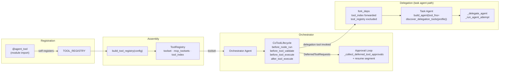

# Co CLI — Tools

> For system overview and approval boundary: [system.md](system.md). For the agent loop, orchestration, and approval flow: [core-loop.md](core-loop.md). For skill loading and slash-command dispatch: [skill.md](skill.md).

## 1. Functional Architecture



### Tool Groups

| Group | Tools | Notes |
|-------|-------|-------|
| Interaction & Session | `clarify`, `capabilities_check`, `todo_write`, `todo_read` | All ALWAYS |
| Workspace & Files | `file_find`, `file_read`, `file_search`, `file_write`, `file_patch` | `file_write`/`file_patch` approval + lock |
| Knowledge, Memory & Skills | `session_search`, `session_view`, `knowledge_search`, `knowledge_view`, `knowledge_manage`, `skill_search`, `skill_view`, `skill_manage` | `knowledge_manage`/`skill_manage` approval |
| Web | `web_search`, `web_fetch` | `web_search` requires `brave_search_api_key` |
| Execution & Jobs | `shell`, `task_start`, `task_status`, `task_cancel`, `task_list`, `code_execute` | `shell`/`code_execute` hybrid approval |
| Delegation | `web_research`, `knowledge_analyze`, `reason` | All DEFERRED; spawn task agents |
| Obsidian | `obsidian_list`, `obsidian_search`, `obsidian_read` | Gate: `obsidian_vault_path` |
| Google | `google_drive_search`, `google_drive_read`, `google_gmail_list`, `google_gmail_search`, `google_calendar_list`, `google_calendar_search`, `google_gmail_draft` | Gate: `google_credentials_path`; `google_gmail_draft` approval |

**Total: 38 native tools** (20 ALWAYS · 18 DEFERRED · 6 explicit approval-gated · 10 config-gated; `shell` and `code_execute` may also prompt dynamically based on the command path)

### Shared Entry Points

`CoToolLifecycle` (`co_cli/tools/lifecycle.py`) is the pydantic-ai capability registered on the orchestrator agent. It fires four hooks per tool call: `before_node_run`, `before_tool_validate`, `before_tool_execute`, `after_tool_execute`. All tool instrumentation and safety guards run through these hooks — no inline per-tool branching.

`fork_deps(base)` (`co_cli/deps.py`) creates an isolated `CoDeps` for a task agent. It forwards `tool_index` (needed for approval checks and OTel enrichment) but explicitly excludes `tool_registry` — the orchestrator's combined toolset and MCP lifecycle handles must not propagate to task agents. `runtime.agent_depth` is incremented on each fork.

`_delegate_agent` / `_run_agent_attempt` (`co_cli/tools/agents/delegation.py`) are shared helpers used by all three delegation tools. They handle OTel span creation, `fork_deps`, `UsageLimits` enforcement, child usage merge into the parent turn's `turn_usage`, and `ModelRetry` wrapping on failure.

## 2. Core Logic

### Lifecycle Hooks

```
tool call received
      │
      ▼
before_node_run  [CallToolsNode only]
  ┌──────────────────────────────────────┐
  │  for each part in model response:    │
  │    ToolCallPart?                     │
  │      (name, args) seen before?       │
  │        yes ──► DROP                  │
  │        no  ──► keep, mark seen       │
  │    TextPart / ThinkingPart           │
  │        ──► pass through unchanged    │
  └──────────────────────────────────────┘
      │
      ▼
before_tool_validate
  ┌──────────────────────────────────────┐
  │  args is str?                        │
  │    yes ──► repair_json               │
  │            trailing comma            │
  │            unclosed brace            │
  │            control chars             │
  │            bare None                 │
  │    no (dict) ──► pass through        │
  └──────────────────────────────────────┘
      │
      ▼
before_tool_execute
  ┌──────────────────────────────────────┐
  │  for each path-type arg:             │
  │    relative ──► absolute system path │
  └──────────────────────────────────────┘
      │
      ▼
  [ tool executes ]
      │
      ▼
after_tool_execute
  ┌────────────────────────────────────────────┐
  │  span ← co.tool.result_size (all tools)    │
  │  tool_name in tool_index? (native only)    │
  │    yes ──► span ← co.tool.source           │
  │            span ← co.tool.requires_approval│
  └────────────────────────────────────────────┘
```

### Approval Loop

```
                          ┌─────────────────────────────┐
                    ┌────►│  output = latest_result      │
                    │     └──────────────┬──────────────┘
                    │                    │
                    │        DeferredToolRequests?
                    │           │ no ──► turn complete
                    │           │ yes
                    │           ▼
                    │     for each deferred call:
                    │       │
                    │       ├─ "questions" in meta?
                    │       │     yes ──► prompt each question
                    │       │             ToolApproved(user_answers=[...])
                    │       │
                    │       └─ no ──► resolve_approval_subject
                    │                     │
                    │                     ├─ auto_approved?
                    │                     │     yes ──► True
                    │                     │
                    │                     └─ prompt user
                    │                           ├─ approved ──► True
                    │                           ├─ denied   ──► ToolDenied
                    │                           └─ always   ──► session rule
                    │           │
                    │           ▼
                    │     resume segment(deferred_tool_results=approvals)
                    │     [skips ModelRequestNode — no new model prompt]
                    └─────────────────────────────────────────────────────
```

Resume segments skip `ModelRequestNode` — no new model prompt is sent just to execute approved tools.

### Concurrency Safety

```
tool call dispatched
      │
      ├─ is_concurrent_safe=False?  (file_write, file_patch, code_execute)
      │       yes ──► force sequential order in multi-tool batch
      │
      ├─ path locked by another agent?  (resource_locks)
      │       yes ──► tool_error  [fail-fast, no retry]
      │
      ├─ file_patch: file only partially read?  (file_tracker.is_partial)
      │       yes ──► tool_error("read the full file first")
      │
      └─ file_write/patch: disk mtime changed since last read?  (file_tracker.is_stale / is_read_and_stale)
              yes ──► tool_error("file changed on disk")
```

### Delegation Agents

A tool may create a task agent to carry out focused work. The tool that needs the agent owns the agent's definition — its instructions, tool surface, output type, and request budget. The orchestrator's full tool surface never propagates to a task agent.

**Tool surface scoping.** Tools opt into a delegation profile via `@agent_tool(delegation={"profile_name"})`. `discover_delegation_tools(profile, config)` returns only functions tagged for that profile, filtered by `requires_config`. Membership is declared at the tool's definition site, not in the delegation tool.

**Lifecycle decision.** Task agents are built fresh on each invocation. Instructions are generated from live `deps` state at construction time, so a singleton would carry stale instructions. Construction is pure Python object assembly (no IO), making per-call construction correct. Rule: if construction requires IO (e.g., starting an MCP server), consider a singleton; if it is pure config assembly, build fresh per call.

```
delegation tool invoked
      │
      ▼
agent_depth >= MAX_AGENT_DEPTH (2)?
      yes ──► ModelRetry("handle this task directly")
      │ no
      ▼
build task agent  [fresh per call — instructions read live deps state]
  ┌─────────────────────────────────────────────────────────┐
  │  instructions = _<role>_instructions(deps)              │
  │  tool_fns     = discover_delegation_tools(profile)      │
  │                   └─ tools tagged @agent_tool(          │
  │                        delegation={"profile"})          │
  │                      filtered by requires_config        │
  │  agent = build_agent(instructions, tool_fns,            │
  │                       output_type=AgentOutput)          │
  └─────────────────────────────────────────────────────────┘
      │
      ▼
_delegate_agent
  ┌─────────────────────────────────────────────────────────┐
  │  child_deps = fork_deps(ctx.deps)                       │
  │    tool_index   ──► forwarded  (approval + OTel)        │
  │    tool_registry ──► excluded  (orchestrator path only) │
  │    agent_depth  ──► incremented                         │
  └─────────────────────────────────────────────────────────┘
      │
      ▼
  otel_span(role_key)
      │
      ▼
  _run_agent_attempt
      agent.run(task, deps=child_deps,
                usage_limits=UsageLimits(budget))
        │ success ──► merge child usage → parent turn_usage
        │ failure ──► ModelRetry
      │
      ▼
  tool_output(result, role, requests_used, run_id)
```

**Task agents:**

| Agent | Delegation tool | Profile | Tool surface | Default budget |
|-------|-----------------|---------|--------------|----------------|
| Researcher | `web_research` | `web_research` | `web_search`, `web_fetch` | 10 requests |
| Analyst | `knowledge_analyze` | `knowledge_analyze` | `knowledge_search`; `google_drive_read`*, `obsidian_search`*, `obsidian_read`* | 8 requests |
| Reasoner | `reason` | — | none (pure reasoning, no tools) | 3 requests |

\* Included only when the corresponding integration is configured (`google_credentials_path`, `obsidian_vault_path`).

`web_research` retries once on an empty result using a rephrased query within the remaining budget, managing its own OTel span to cover both attempts.

## 3. Config

| Setting | Env Var | Default | Description |
|---------|---------|---------|-------------|
| `shell.max_timeout` | `CO_SHELL_MAX_TIMEOUT` | `600` | Hard cap for shell timeout (sec) |
| `shell.safe_commands` | `CO_SHELL_SAFE_COMMANDS` | built-in list | Safe-prefix auto-approval allowlist |
| `web.fetch_allowed_domains` | `CO_WEB_FETCH_ALLOWED_DOMAINS` | `[]` | Domain allowlist (optional) |
| `web.fetch_blocked_domains` | `CO_WEB_FETCH_BLOCKED_DOMAINS` | `[]` | Domain blocklist |
| `brave_search_api_key` | `BRAVE_SEARCH_API_KEY` | `null` | Required for `web_search` |
| `obsidian_vault_path` | `OBSIDIAN_VAULT_PATH` | `null` | Registration gate for Obsidian tools |
| `google_credentials_path` | `GOOGLE_CREDENTIALS_PATH` | `null` | Registration gate for Google tools |
| `knowledge_path` | `CO_KNOWLEDGE_PATH` | `~/.co-cli/knowledge/` | Unified knowledge artifact directory |
| `mcp_servers` | `CO_MCP_SERVERS` | 2 defaults | MCP server definitions |
| `tool_retries` | `CO_TOOL_RETRIES` | `3` | Default agent retry budget |
| `max_requests` tool arg | — | 10 / 8 / 3 | Per-call delegation request cap (research / analysis / reasoning); defaults are function-local |

## 4. Files

| File | Role |
|------|------|
| `co_cli/agent/core.py` | `build_tool_registry()`, `build_agent()`, `discover_delegation_tools()` |
| `co_cli/agent/_native_toolset.py` | `_build_native_toolset()`, `_approval_resume_filter()` |
| `co_cli/agent/mcp.py` | `_build_mcp_toolsets()`, `discover_mcp_tools()` |
| `co_cli/tools/lifecycle.py` | `CoToolLifecycle` — all four per-call hooks |
| `co_cli/tools/approvals.py` | approval subject resolution and session-rule persistence |
| `co_cli/tools/deferred_prompt.py` | category-awareness prompt for DEFERRED tools |
| `co_cli/tools/agent_tool.py` | `@agent_tool` decorator, `TOOL_REGISTRY` self-populating list |
| `co_cli/tools/tool_io.py` | `tool_output()`, `tool_output_raw()`, `tool_error()` |
| `co_cli/tools/_shell_policy.py` | `shell` and `code_execute` approval policy |
| `co_cli/tools/agents/delegation.py` | `web_research`, `knowledge_analyze`, `reason` tools; `_delegate_agent()`, `_run_agent_attempt()` |
| `co_cli/tools/files/read.py` | `file_read`, `file_find`, `file_search` |
| `co_cli/tools/files/write.py` | `file_write`, `file_patch` |
| `co_cli/tools/memory/recall.py` | `knowledge_search`, `session_search` |
| `co_cli/tools/memory/view.py` | `knowledge_view`, `session_view` |
| `co_cli/tools/memory/manage.py` | `knowledge_manage` |
| `co_cli/tools/skills/tools.py` | `skill_search`, `skill_view`, `skill_manage` |
| `co_cli/tools/web/search.py` | `web_search` |
| `co_cli/tools/web/fetch.py` | `web_fetch` |
| `co_cli/tools/obsidian/tools.py` | `obsidian_list`, `obsidian_search`, `obsidian_read` |
| `co_cli/tools/google/drive.py` | `google_drive_search`, `google_drive_read` |
| `co_cli/tools/google/gmail.py` | `google_gmail_list`, `google_gmail_search`, `google_gmail_draft` |
| `co_cli/tools/google/calendar.py` | `google_calendar_list`, `google_calendar_search` |

## 5. Test Gates

| Property | Test file |
|----------|-----------|
| Duplicate tool calls in one model response are collapsed to the first | `tests/test_flow_tool_call_dedup.py` |
| Same tool with distinct args: both preserved | `tests/test_flow_tool_call_dedup.py` |
| TextPart / ThinkingPart pass through dedup unchanged | `tests/test_flow_tool_call_dedup.py` |
| String args dedup by byte identity | `tests/test_flow_tool_call_dedup.py` |
| Malformed JSON args (trailing comma, unclosed brace, control chars, bare None) repaired before validation | `tests/test_flow_tool_call_repair.py` |
| Dict args pass through repair unchanged | `tests/test_flow_tool_call_repair.py` |
| Denied tool call does not execute | `tests/test_flow_tool_call_functional.py` |
| Auto-approval skips prompt for remembered session rule | `tests/test_flow_tool_call_functional.py` |
| `web_research` profile returns only web tools | `tests/test_flow_delegation_discovery.py` |
| `web_research` profile excludes knowledge tools | `tests/test_flow_delegation_discovery.py` |
| `knowledge_analyze` base tools present without optional config | `tests/test_flow_delegation_discovery.py` |
| `knowledge_analyze` includes Obsidian tools when configured | `tests/test_flow_delegation_discovery.py` |
| `knowledge_analyze` excludes Obsidian tools when not configured | `tests/test_flow_delegation_discovery.py` |
| `knowledge_analyze` excludes web tools | `tests/test_flow_delegation_discovery.py` |
| Unknown profile returns empty list | `tests/test_flow_delegation_discovery.py` |
| TOOL_REGISTRY populated without explicit tool imports | `tests/test_flow_delegation_discovery.py` |
