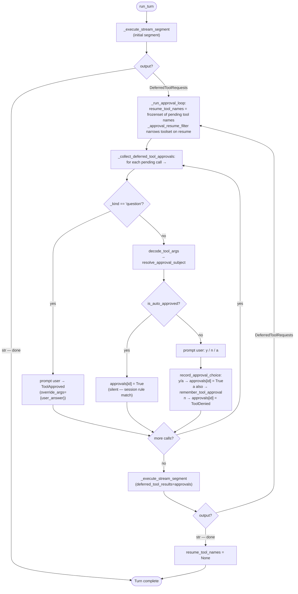

# Co CLI — Tools

## Product Intent

**Goal:** Define tool registration, visibility policy, approval model, and the complete tool surface.
**Functional areas:**
- Config-gated tool registration
- Visibility tiers (always-registered vs deferred/discoverable)
- Three approval classes (auto-approve, requires-approval, deferred)
- Shell policy and resource locks
- MCP integration and tool catalog (37 tools)

**Non-goals:**
- Parallel MCP execution across servers
- Tool-level retry (handled at turn level)

**Success criteria:** All tools registered at agent construction; deferred tools discoverable via `search_tools`; approval resume narrows toolset uniformly.
**Status:** Stable

---

> For system overview and approval boundary: [system.md](system.md). For the agent loop, orchestration, and approval flow: [core-loop.md](core-loop.md). For skill loading and slash-command dispatch: [skills.md](skills.md).

## 1. Tool Infrastructure

The tool ecosystem relies on core infrastructure modules to handle execution routing, standard data structures, security restrictions, and user approvals.

- `co_cli/tools/tool_io.py`: Standard API outputs. Exposes `tool_output()`, `tool_output_raw()`, `tool_error()`, HTTP error parsers, and handles oversized result truncation (>50k chars offloaded to content-addressed storage).
- `co_cli/tools/resource_lock.py`: In-process `ResourceLockStore` enabling safe async cross-agent concurrency, preventing race conditions on shared file paths and knowledge artifacts.
- `co_cli/tools/background.py`: Process-group management and telemetry wrappers for background execution tasks.
- `co_cli/tools/shell_backend.py`: Robust subprocess execution handling output streaming, encoding checks, and standard exit codes.
- `co_cli/tools/_shell_policy.py` & `_shell_env.py`: Enforces strict execution safety by classifying shell commands (ALLOW, DENY, APPROVE) and controlling env injections.
- `co_cli/context/tool_approvals.py`: Core logic for resolving target subjects, building user prompt strings, and processing user inputs (Y/N/A) for mutating operations.
- `co_cli/context/tool_display.py`: Specialized console formatters for rendering inputs and outputs safely in the REPL.
- `co_cli/tools/agents.py`: Delegation subagents (`research_web`, `analyze_knowledge`, `reason_about`) and the `AgentOutput` Pydantic model capturing structured subagent responses.
- `co_cli/tools/google/_auth.py`: Centralized credentials fetching and a shared `_get_google_service()` factory method.
- `co_cli/tools/agent_tool.py`: `@agent_tool(...)` decorator — attaches `ToolInfo` policy metadata to native tool functions at definition site. Used by every native tool to declare visibility, approval, concurrency, and config-gate constraints.

## 2. Tool Lifecycle, Approval, & Concurrency

### Lifecycle Hooks & Execution Flow

**Execution Pipeline via CoToolLifecycle:**
1. **`before_tool_execute`:** Intercepts invocations to resolve relative paths to absolute system paths.
2. **`after_tool_execute`:** Enriches OpenTelemetry traces with custom tags (`co.tool.source`, `co.tool.requires_approval`, `co.tool.result_size`).

**Approval & Errors:**
- **Auto-Approve:** Executed directly via `FunctionToolset`.
- **Requires-Approval:** Execution is preempted, user is prompted in TUI. If denied, a `ToolDenied` response is returned rather than an execution crash.
- **Failures:** Hard failures trigger `tool_error(msg)` (no retry), while bad parameters return `ModelRetry(msg)` to let the model self-correct.

### Concurrency Safety

Approval controls human permission; locks ensure structural correctness.

- **Sequential Forced Flow:** Mutating actions (`write_file`, `patch`, `execute_code`) are registered with `is_concurrent_safe=False`. If they're in a multi-tool batch, the agent forces sequential execution.
- **Cross-agent Path Locking:** Using `CoDeps.resource_locks`, attempts to write to a path locked by another background agent result in an immediate fail-fast `tool_error()`.
- **Read-before-Write:** `patch` enforces that a file has been read in full prior to replacement. `CoDeps.file_partial_reads` prevents patching if the model only read a snippet.
- **Staleness Tracking:** `CoDeps.file_read_mtimes` snapshots disk modification times at read. `write_file` and `patch` fail if the file on disk was modified before the write was committed.

## 3. Tool Catalog

Legend: **V** = Visibility (A=ALWAYS, D=DEFERRED) · **Appr** = requires user approval · **Lock** = sequential (non-concurrent-safe) · **Gate** = config field required

### User Interaction

| Tool | V | Appr | Lock | Gate | Purpose |
|------|---|------|------|------|---------|
| `clarify` | A | — | — | — | Pause mid-execution to ask the user a clarifying question; resume with injected answer |

### Introspection & Flow Tracking

| Tool | V | Appr | Lock | Gate | Purpose |
|------|---|------|------|------|---------|
| `check_capabilities` | A | — | — | — | Runtime doctor: binary probes, auth states, config |
| `todo_write` | A | — | — | — | Replace in-session multi-turn checklist |
| `todo_read` | A | — | — | — | Fetch current checklist |

### Cognition & Knowledge — Read

| Tool | V | Appr | Lock | Gate | Purpose |
|------|---|------|------|------|---------|
| `search_knowledge` | A | — | — | — | BM25 full-text search across all knowledge artifacts; pass `kind="article"` to restrict to article-index schema |
| `list_knowledge` | A | — | — | — | Paginate knowledge artifact metadata |
| `read_article` | A | — | — | — | Fetch full markdown for a cached article by slug |
| `search_memory` | A | — | — | — | Keyword search across historic session transcripts |

### Workspace & Files — Read

| Tool | V | Appr | Lock | Gate | Purpose |
|------|---|------|------|------|---------|
| `glob` | A | — | — | — | List directory or find files by pattern |
| `read_file` | A | — | — | — | Read workspace file; pagination hint + fuzzy name suggestions |
| `grep` | A | — | — | — | Regex content search across workspace |

### Web

| Tool | V | Appr | Lock | Gate | Purpose |
|------|---|------|------|------|---------|
| `web_search` | A | — | — | — | Brave API search with optional domain filter |
| `web_fetch` | A | — | — | — | Fetch URL and convert to markdown |

### Shell Execution

| Tool | V | Appr | Lock | Gate | Purpose |
|------|---|------|------|------|---------|
| `shell` | A | hybrid | — | — | Run blocking shell command; safe-prefix auto-approves, mutations prompt, destructive denied |

### Workspace & Files — Write

| Tool | V | Appr | Lock | Gate | Purpose |
|------|---|------|------|------|---------|
| `write_file` | D | ✓ | ✓ | — | Create or overwrite a file |
| `patch` | D | ✓ | ✓ | — | Targeted replacement with fuzzy fallback; `show_diff` for verification; auto-lints `.py` files |

### Cognition & Knowledge — Write

| Tool | V | Appr | Lock | Gate | Purpose |
|------|---|------|------|------|---------|
| `update_knowledge` | D | ✓ | — | — | Surgical section replacement in a knowledge artifact |
| `append_knowledge` | D | ✓ | — | — | Append to a knowledge artifact |
| `save_article` | D | ✓ | — | — | Persist web content as a local markdown artifact |

### Background Tasks

| Tool | V | Appr | Lock | Gate | Purpose |
|------|---|------|------|------|---------|
| `task_start` | D | ✓ | — | — | Spawn unblocked process group; returns `task_id` |
| `task_status` | D | — | — | — | Poll stdout/stderr and completion state of a task |
| `task_cancel` | D | — | — | — | SIGTERM → SIGKILL a background task |
| `task_list` | D | — | — | — | Enumerate active/completed tasks |

### Code Execution

| Tool | V | Appr | Lock | Gate | Purpose |
|------|---|------|------|------|---------|
| `execute_code` | D | — | ✓ | — | Evaluate arbitrary code; combined stdout+stderr |

### Delegation (Subagents)

| Tool | V | Appr | Lock | Gate | Purpose |
|------|---|------|------|------|---------|
| `research_web` | D | — | — | — | Deep web retrieval subagent |
| `analyze_knowledge` | D | — | — | — | Cross-index deduction on internal + Drive knowledge |
| `reason_about` | D | — | — | — | Pure inference subagent; no external access |

### External — Obsidian *(gate: `obsidian_vault_path`)*

| Tool | V | Appr | Lock | Gate | Purpose |
|------|---|------|------|------|---------|
| `list_notes` | D | — | — | ✓ | Paginate Obsidian note paths |
| `search_notes` | D | — | — | ✓ | Search notes by tag or folder |
| `read_note` | D | — | — | ✓ | Read raw Obsidian markdown note |

### External — Google *(gate: `google_credentials_path`)*

| Tool | V | Appr | Lock | Gate | Purpose |
|------|---|------|------|------|---------|
| `search_drive_files` | D | — | — | ✓ | Google Drive file search |
| `read_drive_file` | D | — | — | ✓ | Read a Drive document as text |
| `list_gmail_emails` | D | — | — | ✓ | Fetch recent inbox messages |
| `search_gmail_emails` | D | — | — | ✓ | Search Gmail with advanced operators |
| `list_calendar_events` | D | — | — | ✓ | Time-bounded Calendar query |
| `search_calendar_events` | D | — | — | ✓ | Full-text Calendar search |
| `create_gmail_draft` | D | ✓ | — | ✓ | Draft an outgoing message (does not send) |

**Total: 37 tools** (14 ALWAYS · 23 DEFERRED · 8 require approval · 10 config-gated)

## 4. Tool API Definitions

### Workspace & Files
- **`glob(path: str, pattern: str, max_entries: int)`**: Recursively list directory contents or find specific files matching standard glob patterns.
- **`read_file(path: str, start_line: int, end_line: int)`**: Fetch contents of a workspace-relative path for inspection. Bounded by an optional line range; when a partial read stops before EOF, the display includes a `start_line=N` continuation hint. Missing-file errors include similar filenames from the same directory. Max result 80k.
- **`grep(pattern: str, path: str, glob: str, case_insensitive: bool, output_mode: str, context_lines: int, head_limit: int, offset: int)`**: High-speed regex file searching using built-in Python parsing across the target directory constraint.
- **`write_file(path: str, content: str)`**: Overwrite entirely or create a new system file with standard UTF-8 encoding.
- **`patch(path: str, old_string: str, new_string: str, replace_all: bool, show_diff: bool)`**: Targeted snippet replacement with fuzzy fallback (line-trimmed, indent-stripped, escape-expanded). Returns an error with context-expansion guidance if `old_string` matches more than once. Pass `show_diff=True` to include a unified diff in the response for verification.

### Execution Environment
- **`shell(cmd: str, timeout: int)`**: Run blocking shell invocations. Checked dynamically: 'safe' prefixes (e.g. `ls`) execute automatically, mutations trigger user prompts, and destructive/injection sequences are outright denied.
- **`execute_code(cmd: str, timeout: int)`**: Specialized arbitrary code evaluation. Output is captured entirely (both stdout and stderr combined).
- **`task_start(command: str, description: str, working_directory: str)`**: Initiates an unblocked process group on the host OS. Returns a UUID `task_id` reference.
- **`task_status(task_id: str, tail_lines: int)`**: Poll the stdout/stderr buffers of a background task and check its completion state.
- **`task_cancel(task_id: str)`**: Terminates an identified process via SIGTERM, with SIGKILL escalation.
- **`task_list(status_filter: str)`**: Discover actively running or completed UUID tasks for tracking or cleanup.

### Cognition & Memory
- **`search_knowledge(query: str, kind: str, source: str, max_results: int)`**: Universal, BM25-based semantic index search spanning internal artifacts, rules, references, and synced directories. Pass `kind="article"` to retrieve article-index schema results (slug, article_id, origin_url, tags, snippet).
- **`list_knowledge(offset: int, limit: int, kind: str)`**: Paginate metadata of persistent agent knowledge artifacts.
- **`read_article(slug: str)`**: Extract the full markdown body corresponding to a specific index slug.
- **`save_article(content: str, title: str, origin_url: str, tags: list, related: list)`**: Transmute web content into a permanently readable local markdown artifact.
- **`update_knowledge(slug: str, old_content: str, new_content: str)`**: Surgical replacement for specific sections of unified knowledge items without rewriting the file.
- **`append_knowledge(slug: str, content: str)`**: Standard mechanism to drop new findings onto the end of a living knowledge artifact.
- **`search_memory(query: str)`**: Run keyword matching directly against SQLite-persisted transcripts of *all* historic chat sessions for semantic episodic recall.

### Delegation
- **`research_web(query: str, domains: list, max_requests: int)`**: Subagent focused on deep dive internet retrieval. Isolates web loops from code writing.
- **`analyze_knowledge(question: str, inputs: list[str], max_requests: int)`**: Subagent handling cross-indexing and deduction strictly on internal + Drive knowledge bounds.
- **`reason_about(problem: str, max_requests: int)`**: Pure inference subagent. Isolated execution context with no API access, operating purely on deductive logic.

### Web & Third-Party
- **`web_search(query: str, max_results: int, domains: list)`**: Query the Brave API. Capable of filtering to specific explicit URL domains.
- **`web_fetch(url: str)`**: Extract standard web HTML pages into synthesized markdown, handling HTTP status exceptions explicitly.
- **`search_notes(query: str, limit: int, folder: str, tag: str)`**: Locate Obsidian vault concepts filtering by embedded tags or path subsets.
- **`list_notes(tag: str, offset: int, limit: int)`**: Standard pagination through Obsidian markdown note paths.
- **`read_note(filename: str)`**: Ingest Obsidian format raw text.
- **`search_drive_files(query: str, page: int)`**: Uses Google's remote search engine for document location.
- **`read_drive_file(file_id: str)`**: Render remote GSuite doc payloads into readable CLI text format.
- **`list_gmail_emails(max_results: int)`**: Pull the latest messages from the authorized user's primary inbox.
- **`search_gmail_emails(query: str, max_results: int)`**: Execute advanced Gmail search operators remotely to filter threads.
- **`create_gmail_draft(to: str, subject: str, body: str)`**: Draft an outgoing message thread (does NOT automatically send).
- **`list_calendar_events(days_back: int, days_ahead: int, max_results: int)`**: Timebox bounded query of Google Calendar scheduling.
- **`search_calendar_events(query: str, days_back: int, days_ahead: int, max_results: int)`**: Deep text search of scheduling, descriptions, and venues.

### User Interaction
- **`clarify(question: str, options: list[str] | None, user_answer: str | None)`**: Pause mid-execution to ask the user a clarifying question. Raises `QuestionRequired` (subclass of `ApprovalRequired`) on the first call; the orchestrator prompts the user via `frontend.prompt_question()` and resumes the same tool call with `ToolApproved(override_args={"user_answer": ...})`. Free-text or constrained (options list). Do not supply `user_answer` — it is injected by the orchestrator.

### Introspection
- **`todo_write(todos: list)`**: State replacement for multi-turn checklist tracking.
- **`todo_read()`**: Fetch the existing tracking list to audit progress.
- **`check_capabilities()`**: Trigger runtime doctor checks against required binaries, integration auth states, and configuration variables.

## 5. Config

| Setting | Env Var | Default | Description |
|---------|---------|---------|-------------|
| `shell.max_timeout` | `CO_CLI_SHELL_MAX_TIMEOUT` | `600` | Hard cap for shell timeout (sec) |
| `shell.safe_commands` | `CO_CLI_SHELL_SAFE_COMMANDS` | built-in list | Safe-prefix auto-approval allowlist |
| `web.fetch_allowed_domains` | `CO_CLI_WEB_FETCH_ALLOWED_DOMAINS` | `[]` | Domain allowlist (optional) |
| `web.fetch_blocked_domains` | `CO_CLI_WEB_FETCH_BLOCKED_DOMAINS` | `[]` | Domain blocklist |
| `brave_search_api_key` | `BRAVE_SEARCH_API_KEY` | `null` | Required for `web_search` |
| `obsidian_vault_path` | `OBSIDIAN_VAULT_PATH` | `null` | Registration gate for Obsidian |
| `google_credentials_path` | `GOOGLE_CREDENTIALS_PATH` | `null` | Registration gate for Google |
| `knowledge_path` | `CO_KNOWLEDGE_DIR` | `~/.co-cli/knowledge/` | Unified knowledge artifact directory |
| `mcp_servers` | `CO_CLI_MCP_SERVERS` | 2 defaults | MCP server definitions |
| `tool_retries` | `CO_CLI_TOOL_RETRIES` | `3` | Default agent retry budget |
| `subagent.max_requests_*` | `CO_CLI_SUBAGENT_MAX_REQUESTS_*` | var | Per-role request caps |
