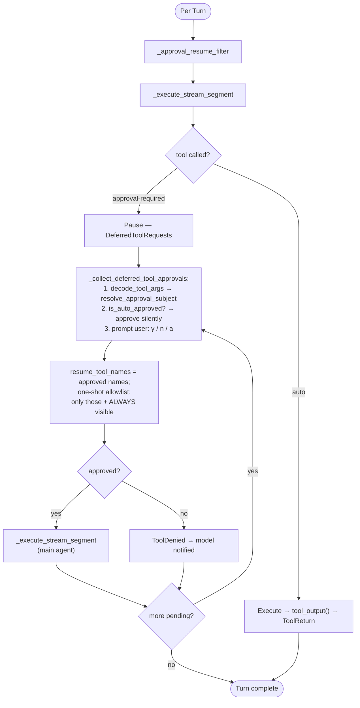

# Co CLI — Tools

## Product Intent

**Goal:** Define tool registration, visibility policy, approval model, and the complete tool surface.
**Functional areas:**
- Config-gated tool registration
- Visibility tiers (always-registered vs deferred/discoverable)
- Three approval classes (auto-approve, requires-approval, deferred)
- Shell policy and resource locks
- MCP integration and tool catalog (36 tools)

**Non-goals:**
- Parallel MCP execution across servers
- Tool-level retry (handled at turn level)

**Success criteria:** All tools registered at agent construction; deferred tools discoverable via `search_tools`; approval resume narrows toolset uniformly.
**Status:** Stable

---

> For system overview and approval boundary: [system.md](system.md). For the agent loop, orchestration, and approval flow: [core-loop.md](core-loop.md). For skill loading and slash-command dispatch: [skills.md](skills.md).

## 1. Tool Tree & Architecture

The tool ecosystem is composed of core infrastructure for execution, lifecycle and approval, along with a suite of domain tools.

### Core Infrastructure
- `co_cli/tools/tool_output.py` — `tool_output()` standard return wrapper and `ToolResult`
- `co_cli/tools/tool_errors.py` — `tool_error()` helper and HTTP error processing
- `co_cli/tools/tool_result_storage.py` — persistence for oversized results (>50k chars)
- `co_cli/tools/resource_lock.py` — in-process `ResourceLockStore` for async cross-agent concurrency
- `co_cli/tools/background.py` — process-group management for long-running tasks
- `co_cli/tools/shell_backend.py` — subprocess execution with output streaming
- `co_cli/tools/_shell_policy.py`, `_shell_env.py` — command classification (ALLOW/DENY/APPROVE)
- `co_cli/tools/_url_safety.py`, `_http_retry.py` — web request safety (internal IP blocks) and backoff
- `co_cli/tools/_google_auth.py` — Google OAuth credential resolution
- `co_cli/tools/_agent_outputs.py` — typed `BaseModel` outputs for delegation agents
- `co_cli/context/tool_display.py` — console rendering and truncation logic
- `co_cli/context/tool_approvals.py` — approval subject resolution and loop logic

### Domain Tools
- `co_cli/tools/files.py` — `glob`, `read_file`, `grep`, `write_file`, `patch`
- `co_cli/tools/shell.py` — `run_shell_command`
- `co_cli/tools/memory.py` — `list_memories`, `search_memories` (read-only for main agent)
- `co_cli/tools/memory_write.py` — `save_memory` (write path owned exclusively by the extractor agent)
- `co_cli/tools/memory_edit.py` — `update_memory`, `append_memory` (surgical edits; currently exported but not registered to main agent)
- `co_cli/tools/articles.py` — `save_article`, `search_articles`, `read_article`, `search_knowledge`
- `co_cli/tools/web.py` — `web_search`, `web_fetch`
- `co_cli/tools/task_control.py` — `start_background_task`, `check_task_status`, `cancel_background_task`, `list_background_tasks`
- `co_cli/tools/todo.py` — `write_todos`, `read_todos`
- `co_cli/tools/capabilities.py` — `check_capabilities`
- `co_cli/tools/session_search.py` — `session_search` (transcript FTS search)
- `co_cli/tools/agents.py` — delegation: `delegate_coder`, `delegate_researcher`, `delegate_analyst`, `delegate_reasoner`
- `co_cli/tools/obsidian.py` — `list_notes`, `search_notes`, `read_note`
- `co_cli/tools/google_drive.py` — `search_drive_files`, `read_drive_file`
- `co_cli/tools/google_gmail.py` — `list_gmail_emails`, `search_gmail_emails`, `create_gmail_draft`
- `co_cli/tools/google_calendar.py` — `list_calendar_events`, `search_calendar_events`

## 2. Tool Lifecycle & Concurrency

### Lifecycle Hooks & Execution

**CoToolLifecycle** (registered via `capabilities=[CoToolLifecycle()]` in `build_agent()`) intercepts execution:
- `before_tool_execute` — resolves relative `path` args to absolute for file tools.
- `after_tool_execute` — enriches the SDK's `execute_tool` OTel span with `co.tool.source`, `co.tool.requires_approval`, `co.tool.result_size`.

**Error Contract:**
- `tool_error(msg)` — Terminal (won't fix itself). Shown to model as `error=True`. No retries.
- `ModelRetry(msg)` — Transient (bad params, rate limit). Retried up to `tool_retries`.
- `ApprovalRequired(...)` — Interrupts execution, triggers UI prompt.

### Concurrency Safety

Approval controls permission; resource locks control correctness. 

**Within-turn serialization:** `write_file` and `patch` are registered with `sequential=True`. The SDK serializes the entire batch if any tool in it is marked sequential.
**Cross-agent locking:** `ResourceLockStore` is an in-process `asyncio.Lock` shared via `CoDeps.resource_locks`. Fail-fast: if the lock is held, the tool returns `tool_error()` immediately.
- `write_file` & `patch` lock on the resolved absolute path to prevent read-modify-write races.
**Staleness Guard:** `CoDeps.file_read_mtimes` records the disk mtime at read. `write_file` and `patch` verify it hasn't changed before writing.

### Shell Policy

Three-stage classification inside `run_shell_command` (`_shell_policy.py`):
1. **DENY** — Control characters, heredoc injection (`<<`), env-injection (`VAR=$(...)`), absolute-path destruction.
2. **ALLOW** — `_is_safe_command()` matches safe-prefix allowlist (e.g. `ls`, `git status`) + arg validation.
3. **REQUIRE_APPROVAL** — Everything else.

## 3. Tool Registration & Catalog

Native tools are registered into a `FunctionToolset` via `_build_native_toolset()`. 
MCP tools are loaded via `DeferredLoadingToolset` wrappers and normalized into `tool_index`.

**Axes of Registration (ToolInfo):**
- **Visibility:** `ALWAYS` (visible on turn one) vs `DEFERRED` (discovered dynamically via `search_tools`).
- **Approval:** `auto` (silent execution) vs `deferred` (user must approve, interrupts execution).
- **Sequential:** `True` (forces entire batch serialization, e.g. for write operations) vs `False` (parallelizable).
- **Retries:** `1` (write-once), `3` (network reads), or `default` (`config.tool_retries`).
- **Max Result Size:** Truncation threshold before spilling to storage (default 50k).
- **Integration:** Gate tied to specific credentials/configs.

### Tool Catalog

**Core tools (26 tools)**
| Tool | Visibility | Approval | Seq | Retries | Max Size | Notes |
|------|------------|----------|-----|---------|----------|-------|
| `check_capabilities` | ALWAYS | auto | no | default | 50k | Introspection for /doctor |
| `write_todos`, `read_todos` | ALWAYS | auto | no | default | 50k | Session task list |
| `search_memories`, `list_memories` | ALWAYS | auto | no | default | 50k | Read-only conversation memory |
| `search_knowledge` | ALWAYS | auto | no | default | 50k | Cross-source search |
| `search_articles`, `read_article` | ALWAYS | auto | no | default | 50k | Library reference docs |
| `glob`, `grep` | ALWAYS | auto | no | default | 50k | Workspace search |
| `read_file` | ALWAYS | auto | no | default | 80k | Workspace read |
| `web_search`, `web_fetch` | ALWAYS | auto | no | 3 | 50k | Network bounds/fetch |
| `run_shell_command` | ALWAYS | auto*| no | default | 30k | *Checks policy inside tool body |
| `write_file`, `patch` | DEFERRED | deferred | yes | 1 | 50k | Write with lock & staleness check |
| `save_article` | DEFERRED | deferred | no | 1 | 50k | URL dedup |
| `start_background_task` | DEFERRED | deferred | no | default | 50k | Async proc execution |
| `check_task_status`, `list_background_tasks` | DEFERRED | auto | no | default | 50k | Read background state |
| `cancel_background_task` | DEFERRED | auto | no | default | 50k | Kill proc tree |
| `delegate_coder`, `delegate_researcher`, `delegate_analyst`, `delegate_reasoner` | DEFERRED | auto | no | default | 50k | Isolated subagent spawning |
| `session_search` | DEFERRED | auto | no | default | 50k | FTS over transcript DB |

**Integration tools (10 tools)**
Excluded when the required credential or config path is absent.
| Tool | Visibility | Approval | Seq | Retries | Max Size | Gate |
|------|------------|----------|-----|---------|----------|------|
| `list_notes`, `search_notes`, `read_note` | DEFERRED | auto | no | default | 50k | `obsidian_vault_path` |
| `search_drive_files`, `read_drive_file` | DEFERRED | auto | no | 3 | 50k | `google_credentials_path` |
| `list_gmail_emails`, `search_gmail_emails` | DEFERRED | auto | no | 3 | 50k | `google_credentials_path` |
| `list_calendar_events`, `search_calendar_events`| DEFERRED | auto | no | 3 | 50k | `google_credentials_path` |
| `create_gmail_draft` | DEFERRED | deferred | no | 1 | 50k | `google_credentials_path` |

### Default MCP Servers
Configured in `settings.json`. MCP tools are normalized to `visibility=DEFERRED`.
- `context7`: Context7 documentation provider (auto approval).

## 4. Config

| Setting | Env Var | Default | Description |
|---------|---------|---------|-------------|
| `shell.max_timeout` | `CO_CLI_SHELL_MAX_TIMEOUT` | `600` | Hard cap for shell timeout (sec) |
| `shell.safe_commands` | `CO_CLI_SHELL_SAFE_COMMANDS` | built-in list | Safe-prefix auto-approval allowlist |
| `web.fetch_allowed_domains` | `CO_CLI_WEB_FETCH_ALLOWED_DOMAINS` | `[]` | Domain allowlist (optional) |
| `web.fetch_blocked_domains` | `CO_CLI_WEB_FETCH_BLOCKED_DOMAINS` | `[]` | Domain blocklist |
| `brave_search_api_key` | `BRAVE_SEARCH_API_KEY` | `null` | Required for `web_search` |
| `obsidian_vault_path` | `OBSIDIAN_VAULT_PATH` | `null` | Registration gate for Obsidian |
| `google_credentials_path` | `GOOGLE_CREDENTIALS_PATH` | `null` | Registration gate for Google |
| `library_path` | `CO_LIBRARY_PATH` | `null` | Article directory override |
| `mcp_servers` | `CO_CLI_MCP_SERVERS` | 2 defaults | MCP server definitions |
| `tool_retries` | `CO_CLI_TOOL_RETRIES` | `3` | Default agent retry budget |
| `subagent.max_requests_*` | `CO_CLI_SUBAGENT_MAX_REQUESTS_*` | var | Per-role request caps |

