# Co CLI — Tools

> For system overview and approval boundary: [01-system.md](01-system.md). For the agent loop, orchestration, and approval flow: [core-loop.md](core-loop.md). For agent specs, builders, and runners: [agents.md](agents.md). For skill loading, dispatch, and curation: [skills.md](skills.md).

## 1. Functional Architecture

```mermaid
graph LR
    subgraph Registration
        A["@agent_tool\n(module import)"] -->|"self-registers"| B["TOOL_REGISTRY"]
    end
    subgraph Assembly
        B --> C1["build_native_toolset(config)\n→ (native_toolset, tool_index)"]
        C1 --> C2["build_mcp_entries(config, tool_index)"]
        C2 --> C3["MCP connect + discover\n(per-entry timeout / isolation)"]
        C3 --> C4["assemble_routing_toolset\nCombinedToolset.filtered"]
        C4 --> D["deps.toolset + deps.tool_index"]
    end
    subgraph Orchestrator
        D -->|"toolset"| E["Orchestrator Agent"]
        E --> F["_RoutingToolset.call_tool\ntool span + co.tool.*\nper-request cap\nMCP-result spill"]
        F -->|"DeferredToolRequests"| G["Approval Loop\n_collect_deferred_tool_approvals\n+ resume segment"]
    end
```



### Tool Groups

| Group | Tools | Notes |
|-------|-------|-------|
| Interaction & Planning | `clarify`, `capabilities_check`, `todo_write`, `todo_read`, `tool_view` | All ALWAYS; `tool_view` loads a DEFERRED tool by exact name (the single deferred-tool loader — co-owned, no SDK `search_tools`) |
| Workspace & Files | `file_read`, `file_search`, `file_write`, `file_patch` | `file_search` finds files or greps contents; `file_write`/`file_patch` approval + lock; whole-file delete is `shell_exec` (`rm`), not a dedicated tool |
| Knowledge, Memory & Skills | `session_search`, `session_view`, `memory_search`, `memory_view`, `memory_create`, `memory_append`, `memory_replace`, `memory_delete`, `skill_view`, `skill_create`, `skill_edit`, `skill_patch`, `skill_delete` | `session_search`/`session_view` and all four skill-write tools (`skill_create`/`skill_edit`/`skill_patch`/`skill_delete`) are DEFERRED (loaded via `tool_view`); the rest are ALWAYS. Memory write / skill write tools require approval |
| Web | `web_search`, `web_fetch` | `web_search` requires `brave_search_api_key` |
| Execution & Jobs | `shell_exec`, `task_start`, `task_status`, `task_cancel`, `task_list` | `shell_exec` hybrid approval; the four `task_*` tools are DEFERRED (loaded via `tool_view`) |
| Google | `google_drive_search`, `google_drive_read`, `google_gmail_list`, `google_gmail_search`, `google_calendar_list`, `google_calendar_search`, `google_gmail_draft` | DEFERRED; per-turn visibility hides them until a credential exists (`co google auth`); `google_gmail_draft` approval |

**Total: 36 native tools** (19 ALWAYS · 17 DEFERRED · 12 explicit approval-gated · 7 Google tools visibility-gated per turn by credential presence; `shell_exec` may also prompt dynamically based on the command path). DEFERRED tools (the 4 `task_*`, all 4 skill-write tools `skill_create`/`skill_delete`/`skill_edit`/`skill_patch`, `session_search`, `session_view`, 7 Google) are hidden by the per-turn `_tool_visibility_filter` until loaded by name via `tool_view`.

`todo_write` and `todo_read` implement the agent's runtime self-planning capability. For the full planning contract, schema, validation rules, compaction snapshot, and rehydration semantics see [self-planning.md](self-planning.md).

### Google credential setup & tool visibility

The seven Google tools register unconditionally but are **hidden per turn** until a credential exists on disk. `_google_available` (`co_cli/tools/google/_auth.py`) is wired as each tool's `check_fn` (a pydantic-ai `prepare` hook), so **visibility, not registration, gates them** — a user with no Google setup never sees them, and a freshly-authorized token surfaces them on the next `co chat` with no settings.json edit.

**What makes them visible to the model, per turn:**
- Before first resolution: an explicit `google_credentials_path` file exists, **or** the default token `GOOGLE_TOKEN_PATH` (`~/.co-cli/google_token.json`) exists.
- After resolution: creds are present and not permanently expired (an expired-but-refreshable token still shows — `googleapiclient` auto-refreshes on the first API call).

**Acquiring a credential — `co google auth` is the sole acquisition path.** No gcloud, no ADC: gcloud's built-in OAuth client cannot grant Workspace user scopes, so `ensure_google_credentials` only *reads* a token (explicit path → default `GOOGLE_TOKEN_PATH` → `None`); it never acquires one. `co google auth` runs `InstalledAppFlow` with the user's own OAuth **Desktop-app** client (`google_client_secret_path`, default `~/env-secrets/google_client_secret.json`) and writes an authorized-user token to `GOOGLE_TOKEN_PATH` (chmod 0600). Two modes:
- default — local browser via `run_local_server(port=0)`.
- `--no-browser` — prints the consent URL and reads the pasted code or full redirect URL, for machines with no local browser (SSH/remote).

**Least-privilege scopes** — `ALL_GOOGLE_SCOPES` is the single source both *requested* at auth and *required* at load, so the two can never drift: `gmail.readonly`, `gmail.compose`, `drive.readonly`, `calendar.readonly` — no `gmail.modify`/`gmail.send` or write scopes.

**Verify — `co google check`** loads the resolved token, attempts a scope-validating refresh, and prints a granted-vs-required diff; a shortfall (or a `RefreshError`) exits non-zero with the terminal "re-authorize by running `co google auth`" guidance, mirroring the tool-layer `handle_google_api_error` classification. No `co google` command prints secrets (`client_secret`/`refresh_token`/token).

**At call time**, a scope/auth failure is terminal, not retried: `handle_google_api_error` classifies a `google.auth` `RefreshError` as a terminal `tool_error` pointing at `co google auth`, while transient 403/404/429/5xx still raise `ModelRetry`.

### Shared Entry Points

`_RoutingToolset` (`co_cli/agent/toolset.py`) is a `WrapperToolset` applied over the combined native+MCP toolset in `assemble_routing_toolset` (and over the task agent's tools in `build_task_agent`). Its `call_tool` is the single seam for the three cross-cutting concerns that must live at the per-call boundary, as straight-line ordered code: the `tool` span with `co.tool.*` attributes, the per-model-request tool-call cap, and MCP-result spill. There is no pydantic-ai capability and no inter-component ordering invariant. Syntactic tool-arg JSON repair and the `chat` model span live one level out in `SurrogateRecoveryModel` (see [observability.md](observability.md)); usage recording happens at run-result boundaries (see [agents.md](agents.md) and [core-loop.md](core-loop.md)).

Task-agent lifecycle — `fork_deps`, `build_task_agent`, `run_standalone` — is owned by [agents.md](agents.md). Tool-side concerns end at `fork_deps`: it forwards `tool_index` for approval and span-attribute lookup and explicitly excludes `toolset` so the orchestrator's combined routing surface never propagates to a task agent.

### `file_search` contract (presence-based mode)

`file_search` is the single tool for both file discovery (replaces `find`/`ls`) and content search (replaces `grep`/`rg`). It is **not** mode-dispatched by an explicit switch; the operation is inferred from whether `content` is given. This is a deliberate small-model design — it avoids the overloaded-parameter and dead-parameter hazards that a `target=`-style switch creates.

```
file_search(path="**/*", content=None, case_insensitive=False,
            files_only=False, limit=50, offset=0)
```

Design invariants — every argument has exactly one meaning, and no argument changes meaning based on another:

- **`path` is always a glob**, never a regex — it answers *which files* (e.g. `**/*.py`, `src/*.ts`, `*config*`, or a bare directory matched recursively). It is split internally into a literal directory prefix (boundary-checked against the configured read roots) and a glob remainder. Default `**/*` = every file under the active `file_search_roots`. Read scope is `file_search_roots` (defaults to `[workspace_dir]`; an operator may add read-only reference roots such as a notes vault); writes stay anchored to `workspace_dir`. With a single root, hits display relative to it (unchanged); with more than one root configured, hits display as absolute paths that round-trip back through `file_read`.
- **`content` is always a regex**, never a glob — it answers *what to find inside* the matched files. Its presence selects the operation:
  - `content` omitted → return the list of files matching `path` (discovery).
  - `content` given → grep that regex inside the files matching `path` (search).
- **`path` absorbs the file filter.** There is no separate `file_glob` argument — scoping a content search to a file type is `file_search(path="**/*.py", content="…")`. Two knobs for "which files" was redundant and is collapsed to one.
- **`case_insensitive` and `files_only` are content-search refinements**, semantically pinned to `content`; they are no-ops when `content` is omitted. `files_only=True` returns matching file paths instead of matching lines (the "which files contain X" question).
- **`limit`/`offset` are a complete pagination pair** applied uniformly to both operations (file entries or matching lines). `limit=0` means unlimited.

There is no overloaded `pattern` argument, no `target` switch, no `file_glob`, no `context_lines`, and no `count` output mode — each was removed because it either overloaded one input across two syntaxes or added a parameter that was dead/conditional in one operation. Every optional argument's default is stated inline in the tool docstring (the schema the model sees), so the model never has to infer a default. Implementation: `co_cli/tools/files/read.py` (`file_search`, `_split_path_glob`).

**Routing boundary.** `file_search` reads files on disk; `memory_search` ([memory.md](memory.md)) reads co's curated memory corpus. The two never overlap: external file/folder knowledge is reached through `file_search` / `file_read` and is never re-indexed into the memory DB. The split is by **ownership + curation, not file format** — co owns and curates it → memory pipeline; co only reads someone else's folder → file tools.

### `shell_exec` working directory (stateless per call)

`shell_exec` runs each command as a fresh `sh -c` subprocess whose working directory is anchored to `workspace_dir` — the same write/cwd anchor as `file_write` / `file_patch`. There is no separate shell-cwd anchor and no backend-held state; `ShellBackend` is stateless and the cwd is supplied per call.

- **Default cwd is `workspace_dir`.** An explicit cwd is always passed, so a configured `workspace_path` takes effect even when no `work_dir` is given.
- **`work_dir` scopes to a sub-directory under the workspace.** It is resolved through the write boundary, so a `work_dir` that escapes `workspace_dir` (e.g. `../..`) is rejected — read scope (`file_search_roots`) never widens shell cwd.
- **No cwd persistence across calls (settled — by design).** A `cd` in one call does **not** carry to the next; each call starts fresh at the anchored cwd. To run in a sub-directory, either pass `work_dir`, or chain within one command (`cd build && make`). This is deliberate, not a gap: stateless calls are reproducible and approval-legible — what runs is fully determined by the call itself, with no hidden accumulated cwd that could silently relocate the shell or drift outside the boundary. It also matches the peer majority (openclaw and hermes are stateless for a model-issued `cd`; only one surveyed peer auto-persists `cd` drift, and it does so to solve a concurrent-agent isolation problem co does not have).
- **`task_start` shares the same `work_dir` contract.** The background-task tool takes the same `work_dir` param with the same anchor: `None` = `workspace_dir`, a relative sub-directory is resolved through the write boundary, and an escaping path (e.g. `../..`) is rejected before the task spawns. The `/background` REPL slash command (no `work_dir` param) likewise anchors to `workspace_dir`, so every shell-launch path — foreground, background tool, and slash command — shares one cwd anchor.

Implementation: `co_cli/tools/shell/execute.py` (`shell_exec`), `co_cli/tools/shell_backend.py` (`ShellBackend`), `co_cli/tools/tasks/control.py` (`task_start`).

## 2. Core Logic

### `_RoutingToolset.call_tool` (the single per-call seam)

Tool-arg JSON repair runs one level out, on the model response in `SurrogateRecoveryModel` before pydantic validation (gated to the Ollama path); see [observability.md](observability.md). Tool-call dedup and arg path-normalization were removed — the agent loop tolerates duplicate calls, and `enforce_write_boundary` already resolves relative→absolute for `file_write`/`file_patch`. What remains is the linear `call_tool` body:

```
call_tool(name, args, ctx, tool)
      │
      ▼
cap accounting  [per ctx.run_step == per model request]
  ┌──────────────────────────────────────────────────────┐
  │  run_step changed? reset per-request count;           │
  │    if prior request stayed ≤ cap → reset streak       │
  │  count += 1                                            │
  │  count == cap+1 ? streak += 1  (immediate, once)      │
  └──────────────────────────────────────────────────────┘
      │
      ▼
push span "tool {name}"  (co.tool.name, co.tool.args, co.tool.args_chars)
      │
      ▼
  count > cap ?
    yes ──► result = exceeded payload (tool does NOT execute)
    no  ──► result = await super().call_tool(...)
              │
              ▼
            MCP-source str over threshold? ──► spill_with_span(...)
      │
      ▼
span ← co.tool.result, co.tool.result_size
tool_name in tool_index? ──► span ← co.tool.source, co.tool.requires_approval
      │
      ▼
pop span   (ERROR + re-raise if the tool raised)
```

The consecutive-over-cap streak (`consecutive_tool_cap_violations`) increments immediately at the `(cap+1)`-th call and resets on the next request when the prior one behaved; the orchestrator finalizes the last request's reset at the segment boundary before the hard-stop check. See [core-loop.md](core-loop.md) for the hard-stop consumer.

### Approval Loop

```
                          ┌─────────────────────────────┐
                    ┌────►│  output = latest_result      │
                    │     └──────────────┬──────────────┘
                    │                    │
                    │        DeferredToolRequests?
                    │           │ no ──► turn complete
                    │           │ yes
                    │           ▼
                    │     for each deferred call:
                    │       │
                    │       ├─ "questions" in meta?
                    │       │     yes ──► prompt each question
                    │       │             ToolApproved(user_answers=[...])
                    │       │
                    │       └─ no ──► resolve_approval_subject
                    │                     │
                    │                     ├─ auto_approved?
                    │                     │     yes ──► True
                    │                     │
                    │                     └─ prompt user
                    │                           ├─ approved ──► True
                    │                           ├─ denied   ──► ToolDenied
                    │                           └─ always   ──► session rule
                    │           │
                    │           ▼
                    │     resume segment(deferred_tool_results=approvals)
                    │     [skips ModelRequestNode — no new model prompt]
                    └─────────────────────────────────────────────────────
```

Resume segments skip `ModelRequestNode` — no new model prompt is sent just to execute approved tools.

### Concurrency Safety

Most tools run concurrently by default (`is_concurrent_safe=True`). Two tools opt out
explicitly because they cannot tolerate interleaved invocations: `file_write`, `file_patch`.
A per-session semaphore caps total concurrent tool calls at
`MAX_TOOL_DISPATCH_WORKERS = 10`; the 11th+ call queues until a slot frees. Forked agents
(reviewer) share the parent's semaphore so the cap is session-wide.

```
tool call dispatched
      │
      ├─ acquire deps.tool_dispatch_sem  (MAX_TOOL_DISPATCH_WORKERS = 10 per session)
      │       blocked? ──► queue until slot frees
      │
      ├─ is_concurrent_safe=False?  (file_write, file_patch — explicit opt-out)
      │       yes ──► force sequential order in multi-tool batch
      │
      ├─ path locked by another agent?  (resource_locks)
      │       yes ──► tool_error  [fail-fast, no retry]
      │
      ├─ file_patch: file only partially read?  (file_tracker.is_partial)
      │       yes ──► tool_error("read the full file first")
      │
      └─ file_write/patch: disk mtime changed since last read?  (file_tracker.is_stale / is_read_and_stale)
              yes ──► tool_error("file changed on disk")
```

`is_concurrent_safe=True` means "safe to dispatch in parallel." `ResourceLockStore` fail-fast
on shared mutation keys is a complementary guard — both layers apply.

## 3. Config

| Setting | Env Var | Default | Description |
|---------|---------|---------|-------------|
| `shell.max_timeout` | `CO_SHELL_MAX_TIMEOUT` | `300` | Hard cap for shell timeout (sec) |
| `shell.safe_commands` | `CO_SHELL_SAFE_COMMANDS` | built-in list | Safe-prefix auto-approval allowlist |
| `web.fetch_allowed_domains` | `CO_WEB_FETCH_ALLOWED_DOMAINS` | `[]` | Domain allowlist (optional) |
| `web.fetch_blocked_domains` | `CO_WEB_FETCH_BLOCKED_DOMAINS` | `[]` | Domain blocklist |
| `brave_search_api_key` | `BRAVE_SEARCH_API_KEY` | `null` | Required for `web_search` |
| `file_search_paths` | — | `[]` | Read-only reference roots for `file_read`/`file_search` (e.g. a notes vault). Empty → `[workspace_dir]`; non-empty is authoritative and total. `file_write`/`file_patch` never widen to these roots |
| `google_credentials_path` | `GOOGLE_CREDENTIALS_PATH` | `null` | Explicit path to a Google token; if set+present it surfaces the Google tools. Otherwise the default `GOOGLE_TOKEN_PATH` (written by `co google auth`) is used. Tools are gated per-turn by credential presence, not registration |
| `memory_path` | `CO_MEMORY_PATH` | `~/.co-cli/memory/` | Memory item directory |
| `mcp_servers` | `CO_MCP_SERVERS` | 2 defaults | MCP server definitions |
| `tool_retries` | `CO_TOOL_RETRIES` | `3` | Default agent retry budget |

## 4. Public Interface

### Tool registration

| Symbol | Source | Contract |
|--------|--------|----------|
| `@agent_tool(visibility=..., approval=..., is_read_only=..., is_concurrent_safe=True, spill_threshold_chars=..., ...)` | `co_cli/tools/agent_tool.py` | Decorator — self-registers a function into both `TOOL_REGISTRY` (list) and `TOOL_REGISTRY_BY_NAME` (dict) at import time. Default: `is_concurrent_safe=True` (concurrent). Set `is_concurrent_safe=False` only when the tool truly cannot tolerate concurrent invocation. `is_read_only=True` automatically implies `is_concurrent_safe=True`. |
| `TOOL_REGISTRY` | `co_cli/tools/agent_tool.py` | Module-level list populated at import time; read by `build_native_toolset()` |
| `build_native_toolset(config) -> tuple[AbstractToolset[CoDeps], dict[str, ToolInfo]]` | `co_cli/agent/core.py` | Pure-config helper. Returns the unfiltered native toolset and a fresh `tool_index` |
| `build_mcp_entries(config, tool_index) -> list[MCPToolsetEntry]` | `co_cli/agent/core.py` | Builds MCP entries wrapped with sequential-flag propagation; not yet connected |
| `assemble_routing_toolset(native, mcp_toolsets) -> AbstractToolset[CoDeps]` | `co_cli/agent/core.py` | Combines native + connected MCP toolsets, applies `_approval_resume_filter` |

> Agent builders (`build_orchestrator`, `build_task_agent`) and spec records (`OrchestratorSpec`, `TaskAgentSpec`) are documented in [agents.md § 4](agents.md).

### Tool output / errors

**Invariant** — every tool result is constructed at the ctx-bearing entrypoint via `tool_output()` or `tool_error()`; both route through `spill_with_span` so every result respects the per-tool spill threshold. Impl helpers without `ctx` (e.g. `_http_get_with_retries`) return raw data or an error string — never a `ToolReturn` — and the entrypoint wraps the error case via `tool_error`.

| Symbol | Source | Contract |
|--------|--------|----------|
| `tool_output(display, *, ctx, **metadata) -> ToolReturn` | `co_cli/tools/tool_io.py` | Standard tool result emit; runs `spill_with_span` against the per-tool threshold before returning |
| `tool_error(message, *, ctx) -> ToolReturn` | `co_cli/tools/tool_io.py` | Terminal (non-retryable) tool failure — `tool_output(message, ctx=ctx, error=True)`, spills like any other output |
| `spill_if_oversized(content, tool_results_dir, tool_name, *, force=False) -> str` | `co_cli/tools/tool_io.py` | Persist oversized content; returns inline placeholder block |
| `check_tool_results_size(tool_results_dir) -> str | None` | `co_cli/tools/tool_io.py` | Returns warning text when `tool-results/` exceeds 100 MB |

### Tool lifecycle and approval

| Symbol | Source | Contract |
|--------|--------|----------|
| `_RoutingToolset(WrapperToolset[CoDeps])` | `co_cli/agent/toolset.py` | Wraps the routing toolset; `call_tool` hosts the `tool` span + `co.tool.*`, the per-model-request cap, and MCP-result spill as linear ordered code |
| `resolve_approval_subject(tool_name, args) -> ApprovalSubject` | `co_cli/tools/approvals.py` | Maps a tool call to its approval-subject kind (`shell`, `path`, `domain`, `tool`) |
| `ApprovalSubject`, `SessionApprovalRule`, `ApprovalKindEnum` | `co_cli/deps.py` | Approval-subject record types and remembered-rule shape |
| `build_deferred_tool_awareness_prompt(tool_index) -> str` | `co_cli/tools/deferred_prompt.py` | Per-turn system-prompt stub list (one `` - `name`: one-liner `` per DEFERRED tool) grouped by integration family under sub-headers (native primitives first with no sub-header, then e.g. `Google Workspace (load before use):`) telling the model to load a tool via `tool_view` (by exact name) first; emitted via `deferred_tool_awareness_prompt` in `co_cli/agent/_instructions.py` |

### Delegation handoff

| Symbol | Source | Contract |
|--------|--------|----------|
| `fork_deps(base) -> CoDeps` | `co_cli/deps.py` | Builds an isolated `CoDeps` for a task agent; forwards `tool_index`, excludes `toolset`, increments `agent_depth` |

> The `run_standalone` runner lives in [agents.md § 4](agents.md).

## 5. Files

| File | Role |
|------|------|
| `co_cli/agent/core.py` | `build_native_toolset()`, `build_mcp_entries()`, `assemble_routing_toolset()` |
| `co_cli/agent/toolset.py` | `_build_native_toolset()`, `_tool_visibility_filter()`, `_config_requirement_met()`, `_RoutingToolset` (per-call span + cap + MCP spill) |
| `co_cli/agent/mcp.py` | `_build_mcp_toolsets()`, `discover_mcp_tools()` |
| `co_cli/tools/approvals.py` | approval subject resolution and session-rule persistence |
| `co_cli/tools/deferred_prompt.py` | per-tool awareness stub list for DEFERRED tools, grouped by integration family under sub-headers |
| `co_cli/tools/agent_tool.py` | `@agent_tool` decorator, `TOOL_REGISTRY` self-populating list, `TOOL_REGISTRY_BY_NAME` lookup dict |
| `co_cli/tools/tool_io.py` | `tool_output()`, `tool_error()`, `spill_if_oversized()`, `spill_with_span()`, `check_tool_results_size()` |
| `co_cli/tools/shell_policy.py` | `shell_exec` and `task_start` command-safety policy |
| `co_cli/tools/files/read.py` | `file_read`, `file_search` |
| `co_cli/tools/files/write.py` | `file_write`, `file_patch` |
| `co_cli/tools/memory/recall.py` | `memory_search` |
| `co_cli/tools/memory/view.py` | `memory_view` |
| `co_cli/tools/session/recall.py` | `session_search` |
| `co_cli/tools/session/view.py` | `session_view` |
| `co_cli/tools/memory/manage.py` | `memory_create`, `memory_append`, `memory_replace`, `memory_delete` |
| `co_cli/tools/system/skills.py` | `skill_view`, `skill_create`, `skill_edit`, `skill_patch`, `skill_delete` |
| `co_cli/tools/system/tool_view.py` | `tool_view` (deferred-tool loader — exact-name unlock, fuzzy "did you mean") |
| `co_cli/tools/web/search.py` | `web_search` |
| `co_cli/tools/web/fetch.py` | `web_fetch` |
| `co_cli/tools/web/_ssrf.py` | SSRF protection — URL safety checks, redirect guard, IP-pinning transport (`SSRFSafeNetworkBackend`, `make_ssrf_safe_transport`) |
| `co_cli/tools/google/drive.py` | `google_drive_search`, `google_drive_read` |
| `co_cli/tools/google/gmail.py` | `google_gmail_list`, `google_gmail_search`, `google_gmail_draft` |
| `co_cli/tools/google/calendar.py` | `google_calendar_list`, `google_calendar_search` |
| `co_cli/tools/google/_auth.py` | `_google_available` (per-turn visibility `check_fn`), `ensure_google_credentials` (read-only resolution), `ALL_GOOGLE_SCOPES` (least-privilege scope set) |
| `co_cli/commands/google.py` | `co google auth` (sole acquisition path; browser or `--no-browser`) and `co google check` (scope-validating verify) CLI commands |

## 6. Test Gates

| Property | Test file |
|----------|-----------|
| Duplicate tool calls in one model response are collapsed to the first | `tests/test_flow_tool_call_dedup.py` |
| Same tool with distinct args: both preserved | `tests/test_flow_tool_call_dedup.py` |
| TextPart / ThinkingPart pass through dedup unchanged | `tests/test_flow_tool_call_dedup.py` |
| String args dedup by byte identity | `tests/test_flow_tool_call_dedup.py` |
| Malformed JSON args (trailing comma, unclosed brace, control chars, bare None) repaired before validation | `tests/test_flow_tool_call_repair.py` |
| Dict args pass through repair unchanged | `tests/test_flow_tool_call_repair.py` |
| Denied tool call does not execute | `tests/test_flow_tool_call_functional.py` |
| Auto-approval skips prompt for remembered session rule | `tests/test_flow_tool_call_functional.py` |

> Task-agent tool-resolution gates (`tool_names` lookup, config-conditional drop-out, unknown-name failure) live in [agents.md § 6](agents.md).
