# Co CLI — Tools

> For system overview and approval boundary: [01-system.md](01-system.md). For the agent loop, orchestration, and approval flow: [core-loop.md](core-loop.md). For agent specs, builders, and runners: [agents.md](agents.md). For skill loading, dispatch, and curation: [skills.md](skills.md).

## 1. Functional Architecture

```mermaid
graph LR
    subgraph Registration
        A["@agent_tool\n(module import)"] -->|"self-registers"| B["TOOL_REGISTRY"]
    end
    subgraph Assembly
        B --> C1["build_native_toolset()\n→ (native_toolset, tool_catalog)"]
        C1 --> C2["build_mcp_entries(config, tool_catalog)"]
        C2 --> C3["MCP connect + discover\n(per-entry timeout / isolation)"]
        C3 --> C4["assemble_routing_toolset\nCombinedToolset.filtered"]
        C4 --> D["deps.toolset + deps.tool_catalog"]
    end
    subgraph Orchestrator
        D -->|"toolset"| E["Orchestrator Agent"]
        E --> F["_CallSeamToolset.call_tool\ntool span + co.tool.*\nper-request cap\nMCP-result spill"]
        F -->|"DeferredToolRequests"| G["Approval Loop\n_collect_deferred_tool_approvals\n+ resume segment"]
    end
```



### Tool Groups

| Group | Tools | Notes |
|-------|-------|-------|
| Interaction & Planning | `clarify`, `capabilities_check`, `todo_write`, `todo_read`, `tool_view` | All ALWAYS; `tool_view` loads a DEFERRED tool by exact name (the single deferred-tool loader — co-owned, no SDK `search_tools`) |
| Workspace & Files | `file_read`, `file_search`, `file_write`, `file_patch` | `file_search` finds files or greps contents; `file_write`/`file_patch` approval + lock; whole-file delete is `shell_exec` (`rm`), not a dedicated tool |
| Knowledge, Memory & Skills | `session_search`, `session_view`, `memory_search`, `memory_view`, `memory_create`, `memory_append`, `memory_replace`, `memory_delete`, `skill_view`, `skill_create`, `skill_edit`, `skill_patch`, `skill_delete` | `session_search`/`session_view` and all four skill-write tools (`skill_create`/`skill_edit`/`skill_patch`/`skill_delete`) are DEFERRED (loaded via `tool_view`); the rest are ALWAYS. Memory write / skill write tools require approval |
| Web | `web_search`, `web_fetch` | `web_search` requires `brave_search_api_key` |
| Execution & Jobs | `shell_exec`, `task_start`, `task_status`, `task_cancel`, `task_list` | `shell_exec` hybrid approval; the four `task_*` tools are DEFERRED (loaded via `tool_view`) |
| Google | `google_drive_search`, `google_drive_read`, `google_gmail_list`, `google_gmail_search`, `google_calendar_list`, `google_calendar_search`, `google_gmail_draft` | DEFERRED; per-turn visibility hides them until a credential exists (`co google auth`); `google_gmail_draft` approval |

**Total: 36 native tools** — 19 ALWAYS · 17 DEFERRED · 12 explicit approval-gated · 7 Google tools additionally visibility-gated per turn by credential presence (`shell_exec` may also prompt dynamically on the command path). The 17 DEFERRED are the 4 `task_*`, the 4 `skill_*` writes (`skill_create`/`skill_delete`/`skill_edit`/`skill_patch`), `session_search`/`session_view`, and the 7 Google tools.

`todo_write` and `todo_read` implement the agent's runtime self-planning capability. For the full planning contract, schema, validation rules, compaction snapshot, and rehydration semantics see [self-planning.md](self-planning.md).

### Tool visibility — the ALWAYS/DEFERRED budget

Visibility is not a per-tool preference; it is governed by a **prefill-floor budget**. Every ALWAYS tool's schema (name + description + minified-parameters JSON) is sent on *every* request, so the sum of ALWAYS schemas is an uncompactable floor — subtracted from the working middle every turn, and a direct prefill-latency tax (trivial turns are prefill-bound). On a small local model with a fixed 64k window this floor directly bounds usable headroom, so the ALWAYS bucket is **capped and guarded**:

- `measure_always_schema_budget(deps)` (`co_cli/bootstrap/schema_budget.py`) sums the ALWAYS bucket; the guard `tests/test_orchestrator_schema_budget.py` pins `ALWAYS_BUCKET_CEILING` — a docstring re-bloat or a new ALWAYS tool that breaches it fails the test.
- The same measurement feeds `deps.static_floor_tokens` at bootstrap — the floor half of the realtime compaction trigger ([compaction.md](compaction.md) §1.5). Deferring a tool shrinks both at once.
- **Current state:** 19 ALWAYS tools = **17,224 chars** (ceiling `17_700`).

DEFERRED is *not* removal. A DEFERRED tool's schema is withheld from the floor; in its place a one-line **stub** (`` - `name`: purpose ``, purpose capped at 100 chars by `_ONE_LINER_MAX_CHARS`) is emitted per turn by `build_deferred_tool_awareness_prompt` (`co_cli/tools/deferred_prompt.py`, via the `deferred_tool_awareness_prompt` instruction in `co_cli/agent/_instructions.py`). The model stays aware of the tool and loads its full schema on demand via `tool_view`. The floor thus carries WHEN/WHY, never a deferred tool's call signature — the signature-coherence invariant in [prompt-assembly.md](prompt-assembly.md) §2.2.

**The ALWAYS ↔ DEFERRED criterion — size × criticality.** Two axes govern the call. *Criticality* is the deferral penalty: a tool the model reasons *with* on most turns (`file_read`, `shell_exec`, `file_search`, `memory_search`, the planning + interaction primitives) pays a `tool_view` round-trip and reduced plan-legibility each time it loads. *Size* is the payoff, bounded below by the stub — deferring saves only `full_schema − stub`, so a small tool saves almost nothing. The two axes resolve to one decision:

| Criticality | Small schema | Big schema |
|-------------|--------------|------------|
| **Reasoned-with most turns** | ALWAYS | ALWAYS — criticality vetoes deferral at any size |
| **Episodic** (occasional use) | ALWAYS — deferring buys nothing | **DEFERRED** — the only cell that pays off |

The one exception is *family coherence*: a small tool joins an already-deferred cluster (e.g. the `skill_*` writes) so its grouped stub block stays whole. This is why cross-session recall (`session_search`/`session_view`), skill writes, background jobs (`task_*`), and the Google family are DEFERRED while the high-frequency primitives are not.

### Tool data model — registry, `ToolInfo`, `tool_catalog`, toolset

A tool has **two parallel representations joined by name**: co's *policy* metadata and the SDK's *executable* surface. Keeping them separate is deliberate — pydantic-ai's `ToolDefinition` cannot carry co's concepts (visibility, source, approval-subject, spill threshold), so co holds them in a side-table and joins by name at every runtime seam.

| Entity | Type · location | Keyed by | Holds | Read by |
|--------|-----------------|----------|-------|---------|
| `@agent_tool` | decorator · `tools/agent_tool.py` | — | builds the `ToolInfo`, attaches it to the fn as `__co_tool_info__`, registers the fn | import time |
| `ToolInfo` | frozen dataclass · `deps.py` | — | per-tool **policy**: all fields below | every policy seam |
| `TOOL_REGISTRY` | `list[Callable]` · `agent_tool.py` | insertion order | every decorated native fn | `_build_native_toolset` (iterates) |
| `TOOL_REGISTRY_BY_NAME` | `dict[str, Callable]` · `agent_tool.py` | name | the same fns | `build_task_agent` (resolves `tool_names`) |
| `tool_catalog` | `dict[str, ToolInfo]` · `deps.tool_catalog` | name | native ToolInfos **+** MCP ToolInfos (added at discovery) | `_tool_visibility_filter`, `_CallSeamToolset`, `_SequentialMCPToolset`, approvals |
| `FunctionToolset` | pydantic-ai | name | the callable the SDK runs | the agent run |
| `ToolDefinition` | pydantic-ai | name | the schema the model sees | the model |

**`ToolInfo` fields** (`co_cli/deps.py` — frozen dataclass, set once at registration):

| Field | Type | Default | Runtime seam | Logic |
|-------|------|---------|--------------|-------|
| `name` | `str` | required | span attribute `co.tool.name`; `tool_catalog` key; deferred-reveal key in `revealed_tools` | Taken from `fn.__name__` by `@agent_tool`; must be unique across the registry |
| `description` | `str` | required | stub one-liner (DEFERRED tools); `co.tool.name` span | First line of `fn.__doc__`, stripped. Truncated to `_ONE_LINER_MAX_CHARS` (100 chars) in the deferred stub; full description goes into the SDK `ToolDefinition` |
| `source` | `ToolSourceEnum` | required | span attribute `co.tool.source` | `NATIVE` for `@agent_tool`-decorated functions; `MCP` for tools synthesized by `discover_mcp_tools`. Controls the `co.tool.source` span attribute and is used to identify MCP results for the spill check in `_CallSeamToolset` |
| `visibility` | `VisibilityPolicyEnum` | required | `_tool_visibility_filter` gate every turn | `ALWAYS` — full schema on every request (static prefix); `DEFERRED` — schema withheld, one-liner stub emitted per turn (only until revealed), full schema loaded on demand via `tool_view` after `revealed_tools` admits the name. The filter hides a DEFERRED tool until `name ∈ runtime.revealed_tools` |
| `is_approval_required` | `bool` | `False` | `_build_native_toolset` → `add_function(requires_approval=…)`; span attribute `co.tool.requires_approval` | When `True`, the SDK suspends the call into the approval loop (`DeferredToolRequest`) |
| `integration` | `str \| None` | `None` | `deferred_prompt.py` grouping; MCP `tool_catalog` | Governs stub grouping in the deferred-tool awareness prompt. Native tools derive their family from the first `_`-delimited segment of the tool name (e.g. `google_*` → `google`). MCP tools receive the user-configured server prefix as `integration`. `None` (no prefix) → the tool falls in the general (un-headered) family, rendered first |
| `is_concurrent_safe` | `bool` | required (no dataclass default; the `@agent_tool` decorator defaults native tools to `True`, MCP sets `False`) | `_build_native_toolset` → `add_function(sequential=not …)` | `False` forces sequential ordering in a multi-tool batch. `file_write` and `file_patch` are the only ALWAYS native tools that opt out. MCP tools set `False` explicitly (sequential until proven concurrent-safe); `_SequentialMCPToolset` stamps `sequential` from this field |
| `retries` | `int \| None` | `None` | `_build_native_toolset` → `add_function(retries=…)` when set | Per-tool retry budget overriding the session default (`tool_retries` config, default 3). `None` means inherit the agent-level default |
| `check_fn` | `Callable[[CoDeps], bool] \| None` | `None` | `_build_native_toolset` → `add_function(prepare=_make_prepare(check_fn))` | Per-turn prepare hook: the tool is hidden on any turn where `check_fn(deps)` returns `False`. Used by Google tools (`_google_available`) to gate visibility on credential presence. Runs inside the pydantic-ai prepare callback before each model request |
| `spill_threshold_chars` | `int \| float \| None` | `None` | `_CallSeamToolset.call_tool` → `spill_with_span` | Per-tool override for the char threshold above which a result is spilled to disk. `None` → falls back to the session-wide `SPILL_THRESHOLD_CHARS` constant. `float('inf')` disables spill for that tool |
| `approval_subject_fn` | `Callable[[dict], ApprovalSubject] \| None` | `None` | `resolve_approval_subject` (highest priority) | Custom resolver for the approval-subject kind and value shown in the approval prompt. When set, bypasses the default kind-detection logic in `approvals.py` (`shell` by path, `domain` for web, `tool` fallback). Used when a tool's meaningful scoping key differs from the defaults (e.g. a tool whose approval should scope to a custom resource key) |

`_build_native_toolset` is the **bridge** between the two: iterating `TOOL_REGISTRY`, it reads each fn's `ToolInfo` (off `__co_tool_info__`), maps policy fields onto `add_function` kwargs (`is_approval_required → requires_approval`, `is_concurrent_safe → sequential`, `retries`, `check_fn → prepare`), and records that same `ToolInfo` into `tool_catalog`. At runtime every seam recovers policy by name — `ctx.deps.tool_catalog.get(name)` — for the tool the SDK is about to run. MCP tools carry no `@agent_tool` decorator: `discover_mcp_tools` synthesizes a `ToolInfo` per tool (`source=MCP`, `visibility=DEFERRED`) and merges it into the same `tool_catalog`, so native and MCP tools are policy-homogeneous everywhere downstream.

**How co uses the two SDK primitives.** co never subclasses either — it builds one and influences the other through `prepare`-style hooks; they differ in granularity (whole container vs per-tool schema) and consumer (the agent run vs the model):

- **`FunctionToolset` — the container the SDK *runs*.** A `name → (callable + schema)` map for one agent. co builds it in `_build_native_toolset` (`add_function` per registered tool — the policy→kwargs bridge above) and again, thinner, in `build_task_agent` (subagent `tool_names` subset, all `requires_approval=False`). It is the innermost layer of the composition stack, and `measure_always_schema_budget` (`bootstrap/schema_budget.py`) reads its `.tools` dict directly to size the ALWAYS prefill floor.
- **`ToolDefinition` — the per-tool schema the *model* sees.** `name` + `description` + `parameters_json_schema` + flags (`sequential`), which the SDK *derives* from the function signature/docstring — co never constructs one. co touches it only via hooks that receive a `tool_def` and return it (possibly modified) or `None`: `_tool_visibility_filter` (the `.filtered()` per-turn show/hide gate), `_make_prepare(check_fn)` (per-turn availability — `None` hides, e.g. Google credential gating), and `_SequentialMCPToolset.get_tools` (`replace(tool_def, sequential=…)` copying co's concurrency policy onto MCP tools). The floor measurement sums each ALWAYS tool's `ToolDefinition` name + description + minified-params-JSON.

`ToolInfo` policy thus flows into **both**: into the `FunctionToolset` at `add_function` time, and into each `ToolDefinition` at `prepare`/filter time.

### Tool lifecycle — register → assemble → discover → load → call

co has **no keyword "tool search" stage**: tools are never registered with `defer_loading`, so the SDK's `search_tools` loader never engages — a deferred tool loads by *exact name* via `tool_view`, not by keyword.

1. **Register (import time).** `@agent_tool(visibility=…)` (`co_cli/tools/agent_tool.py`) attaches a frozen `ToolInfo` (`co_cli/deps.py` — `visibility`, `is_approval_required`, `source`, `check_fn`, …) to the function and appends it to the flat `TOOL_REGISTRY`. ALWAYS and DEFERRED register identically — visibility is one metadata field, not a separate code path.
2. **Assemble (bootstrap).** `_build_native_toolset()` (`co_cli/agent/toolset.py`) adds every registered tool to one `FunctionToolset` and returns it with `tool_catalog` (`name → ToolInfo`). MCP tools join via `build_mcp_entries` / `assemble_routing_toolset` (`co_cli/agent/core.py`), wrapping native + MCP in `CombinedToolset([...]).filtered(_tool_visibility_filter)`. Visibility lives only in `tool_catalog`; the registry is visibility-agnostic.
3. **Discover (every turn).** An ALWAYS tool's full schema rides the cached static prefix; a DEFERRED tool's schema is withheld and replaced by its per-turn stub (above).
4. **Load (DEFERRED only).** `_tool_visibility_filter` (`co_cli/agent/toolset.py`) hides a DEFERRED tool until its name is in `deps.runtime.revealed_tools`. The model copies the exact name from the stub into `tool_view` (itself ALWAYS — `co_cli/tools/system/tool_view.py`): a normalized-exact match (case / `-` / whitespace folded) reveals it; a near-miss returns `difflib` "did you mean" candidates and reveals nothing; no match errors "does not exist — do not retry." The full schema appears on the next model step, and the per-turn stub generator (`deferred_prompt.py`) reads the same `revealed_tools` set, so a revealed tool stops emitting its stub. Because `revealed_tools` is runtime state, not message history, reveals survive compaction. ALWAYS tools skip this stage.
5. **Call.** `_CallSeamToolset.call_tool` (`co_cli/agent/toolset.py`) is the single per-call seam: it stamps the `tool {name}` span (`co.tool.*` attributes), enforces the per-model-request tool-call cap, and spills oversized MCP string results. Approval-gated tools (`ToolInfo.is_approval_required`, or `shell_exec`'s dynamic path check) suspend into the approval loop and resume via `deferred_tool_results` — see the [Approval Loop](#approval-loop) below and [core-loop.md](core-loop.md).

### Toolset composition stack

`assemble_routing_toolset` (`co_cli/agent/core.py`) nests five toolset layers into the single `deps.toolset` object the orchestrator runs on. Each layer does one thing; **co** owns the two `WrapperToolset` subclasses, **pydantic-ai (SDK)** owns the rest:

```
_CallSeamToolset                 co   per-call seam: tool span + co.tool.*, per-request cap, MCP-result spill
 └─ FilteredToolset (.filtered)  SDK  per-turn gate: runs _tool_visibility_filter — the only layer that drops tools
     └─ CombinedToolset          SDK  merges the native toolset with every MCP toolset into one surface
         ├─ FunctionToolset      SDK  the native @agent_tool functions added by _build_native_toolset
         └─ _SequentialMCPToolset co   one per MCP server; stamps each MCP tool's ToolDefinition.sequential
              └─ _SanitizingMCPServer [.approval_required()]   sanitize inputSchema; per-server approval wrap
```

A tool call enters at `_CallSeamToolset` (outermost); the per-turn tool list is decided one layer in, where `FilteredToolset` applies `_tool_visibility_filter` (hide DEFERRED until revealed, narrow to approved tools on a resume turn) — no other layer removes tools. `_CallSeamToolset.call_tool` is the only seam for the three concerns that must live at the per-call boundary, as straight-line ordered code — there is no pydantic-ai capability and no inter-component ordering invariant. `_SequentialMCPToolset` exists only because an MCP server reports no concurrency policy: it copies `sequential` from `tool_catalog.is_concurrent_safe` so an MCP tool obeys the same serialization contract as a native `file_write`. MCP tools are **not** registered with `defer_loading` (that would re-engage the SDK's `search_tools` loader); they are DEFERRED in `tool_catalog` and load via `tool_view` like every other deferred tool. Syntactic tool-arg JSON repair and the `chat` model span live one layer further out in `SurrogateRecoveryModel` ([observability.md](observability.md)); usage recording happens at run-result boundaries ([agents.md](agents.md), [core-loop.md](core-loop.md)).

**Task-agent variant.** `build_task_agent` ([agents.md](agents.md)) builds a far thinner stack — `_CallSeamToolset(FunctionToolset)` over a `tool_names` subset with `requires_approval=False`, no `CombinedToolset`, no filter, no MCP — so subagent calls still get the span, cap, and `co.tool.*` parity, but a task agent never prompts and never sees the MCP or deferred surfaces. `fork_deps` forwards `tool_catalog` (for approval and span-attribute lookup) and explicitly excludes `toolset`, so the orchestrator's combined routing surface never propagates to a task agent.

### Google credential setup & tool visibility

The seven Google tools register unconditionally but are **hidden per turn** until a credential exists on disk. `_google_available` (`co_cli/tools/google/_auth.py`) is wired as each tool's `check_fn` (a pydantic-ai `prepare` hook), so **visibility, not registration, gates them** — a user with no Google setup never sees them, and a freshly-authorized token surfaces them on the next `co chat` with no settings.json edit.

**What makes them visible to the model, per turn:**
- Before first resolution: an explicit `google_credentials_path` file exists, **or** the default token `GOOGLE_TOKEN_PATH` (`~/.co-cli/google_token.json`) exists.
- After resolution: creds are present and not permanently expired (an expired-but-refreshable token still shows — `googleapiclient` auto-refreshes on the first API call).

**Acquiring a credential — `co google auth` is the sole acquisition path.** No gcloud, no ADC: gcloud's built-in OAuth client cannot grant Workspace user scopes, so `ensure_google_credentials` only *reads* a token (explicit path → default `GOOGLE_TOKEN_PATH` → `None`); it never acquires one. `co google auth` runs `InstalledAppFlow` with the user's own OAuth **Desktop-app** client (`google_client_secret_path`, default `~/env-secrets/google_client_secret.json`) and writes an authorized-user token to `GOOGLE_TOKEN_PATH` (chmod 0600). Two modes:
- default — local browser via `run_local_server(port=0)`.
- `--no-browser` — prints the consent URL and reads the pasted code or full redirect URL, for machines with no local browser (SSH/remote).

**Least-privilege scopes** — `ALL_GOOGLE_SCOPES` is the single source both *requested* at auth and *required* at load, so the two can never drift: `gmail.readonly`, `gmail.compose`, `drive.readonly`, `calendar.readonly` — no `gmail.modify`/`gmail.send` or write scopes.

**Verify — `co google check`** loads the resolved token, attempts a scope-validating refresh, and prints a granted-vs-required diff; a shortfall (or a `RefreshError`) exits non-zero with the terminal "re-authorize by running `co google auth`" guidance, mirroring the tool-layer `handle_google_api_error` classification. No `co google` command prints secrets (`client_secret`/`refresh_token`/token).

**At call time**, a scope/auth failure is terminal, not retried: `handle_google_api_error` classifies a `google.auth` `RefreshError` as a terminal `tool_error` pointing at `co google auth`, while transient 403/404/429/5xx still raise `ModelRetry`.

### `file_search` contract (presence-based mode)

`file_search` is the single tool for both file discovery (replaces `find`/`ls`) and content search (replaces `grep`/`rg`). It is **not** mode-dispatched by an explicit switch; the operation is inferred from whether `content` is given. This is a deliberate small-model design — it avoids the overloaded-parameter and dead-parameter hazards that a `target=`-style switch creates.

```
file_search(path="**/*", content=None, case_insensitive=False,
            files_only=False, limit=50, offset=0)
```

Design invariants — every argument has exactly one meaning, and no argument changes meaning based on another:

- **`path` is always a glob**, never a regex — it answers *which files* (e.g. `**/*.py`, `src/*.ts`, `*config*`, or a bare directory matched recursively). It is split internally into a literal directory prefix (boundary-checked against the configured read roots) and a glob remainder. Default `**/*` = every file under the active `file_search_roots`. Read scope is `file_search_roots` (defaults to `[workspace_dir]`; an operator may add read-only reference roots such as a notes vault); writes stay anchored to `workspace_dir`. With a single root, hits display relative to it (unchanged); with more than one root configured, hits display as absolute paths that round-trip back through `file_read`.
- **`content` is always a regex**, never a glob — it answers *what to find inside* the matched files. Its presence selects the operation:
  - `content` omitted → return the list of files matching `path` (discovery).
  - `content` given → grep that regex inside the files matching `path` (search).
- **`path` absorbs the file filter.** There is no separate `file_glob` argument — scoping a content search to a file type is `file_search(path="**/*.py", content="…")`. Two knobs for "which files" was redundant and is collapsed to one.
- **`case_insensitive` and `files_only` are content-search refinements**, semantically pinned to `content`; they are no-ops when `content` is omitted. `files_only=True` returns matching file paths instead of matching lines (the "which files contain X" question).
- **`limit`/`offset` are a complete pagination pair** applied uniformly to both operations (file entries or matching lines). `limit=0` means unlimited.

There is no overloaded `pattern` argument, no `target` switch, no `file_glob`, no `context_lines`, and no `count` output mode — each would either overload one input across two syntaxes or add a parameter that is dead/conditional in one operation. Every optional argument's default is stated inline in the tool docstring (the schema the model sees), so the model never has to infer a default. Implementation: `co_cli/tools/files/read.py` (`file_search`, `_split_path_glob`).

**Routing boundary.** `file_search` reads files on disk; `memory_search` ([memory.md](memory.md)) reads co's curated memory corpus. The two never overlap: external file/folder knowledge is reached through `file_search` / `file_read` and is never re-indexed into the memory DB. The split is by **ownership + curation, not file format** — co owns and curates it → memory pipeline; co only reads someone else's folder → file tools.

### `shell_exec` working directory (stateless per call)

`shell_exec` runs each command as a fresh `sh -c` subprocess whose working directory is anchored to `workspace_dir` — the same write/cwd anchor as `file_write` / `file_patch`. There is no separate shell-cwd anchor and no backend-held state; `ShellBackend` is stateless and the cwd is supplied per call.

- **Default cwd is `workspace_dir`.** An explicit cwd is always passed, so a configured `workspace_path` takes effect even when no `work_dir` is given.
- **`work_dir` scopes to a sub-directory under the workspace.** It is resolved through the write boundary, so a `work_dir` that escapes `workspace_dir` (e.g. `../..`) is rejected — read scope (`file_search_roots`) never widens shell cwd.
- **No cwd persistence across calls.** A `cd` in one call does **not** carry to the next; each call starts fresh at the anchored cwd. To run in a sub-directory, pass `work_dir` or chain within one command (`cd build && make`). Stateless calls are reproducible and approval-legible: what runs is fully determined by the call itself, with no hidden accumulated cwd that could silently relocate the shell or drift outside the boundary.
- **`task_start` shares the same `work_dir` contract.** The background-task tool takes the same `work_dir` param with the same anchor: `None` = `workspace_dir`, a relative sub-directory is resolved through the write boundary, and an escaping path (e.g. `../..`) is rejected before the task spawns. The `/background` REPL slash command (no `work_dir` param) likewise anchors to `workspace_dir`, so every shell-launch path — foreground, background tool, and slash command — shares one cwd anchor.

Implementation: `co_cli/tools/shell/execute.py` (`shell_exec`), `co_cli/tools/shell_backend.py` (`ShellBackend`), `co_cli/tools/tasks/control.py` (`task_start`).

## 2. Core Logic

### `_CallSeamToolset.call_tool` (the single per-call seam)

Tool-arg JSON repair runs one level out, on the model response in `SurrogateRecoveryModel` before pydantic validation (gated to the Ollama path); see [observability.md](observability.md). `call_tool` itself is a linear body with no dedup and no arg path-normalization — the agent loop tolerates duplicate calls, and `enforce_write_boundary` resolves relative→absolute for `file_write`/`file_patch`:

```
call_tool(name, args, ctx, tool)
      │
      ▼
cap accounting  [per ctx.run_step == per model request]
  ┌──────────────────────────────────────────────────────┐
  │  run_step changed? reset per-request count;           │
  │    if prior request stayed ≤ cap → reset streak       │
  │  count += 1                                            │
  │  count == cap+1 ? streak += 1  (immediate, once)      │
  └──────────────────────────────────────────────────────┘
      │
      ▼
push span "tool {name}"  (co.tool.name, co.tool.args, co.tool.args_chars)
      │
      ▼
  count > cap ?
    yes ──► result = exceeded payload (tool does NOT execute)
    no  ──► result = await super().call_tool(...)
              │
              ▼
            MCP-source str over threshold? ──► spill_with_span(...)
      │
      ▼
span ← co.tool.result, co.tool.result_size
tool_name in tool_catalog? ──► span ← co.tool.source, co.tool.requires_approval
      │
      ▼
pop span   (ERROR + re-raise if the tool raised)
```

The consecutive-over-cap streak (`consecutive_tool_cap_violations`) increments immediately at the `(cap+1)`-th call and resets on the next request when the prior one behaved; the orchestrator finalizes the last request's reset at the segment boundary before the hard-stop check. See [core-loop.md](core-loop.md) for the hard-stop consumer.

### Approval Loop

```
                          ┌─────────────────────────────┐
                    ┌────►│  output = latest_result      │
                    │     └──────────────┬──────────────┘
                    │                    │
                    │        DeferredToolRequests?
                    │           │ no ──► turn complete
                    │           │ yes
                    │           ▼
                    │     for each deferred call:
                    │       │
                    │       ├─ "questions" in meta?
                    │       │     yes ──► prompt each question
                    │       │             ToolApproved(user_answers=[...])
                    │       │
                    │       └─ no ──► resolve_approval_subject
                    │                     │
                    │                     ├─ auto_approved?
                    │                     │     yes ──► True
                    │                     │
                    │                     └─ prompt user
                    │                           ├─ approved ──► True
                    │                           ├─ denied   ──► ToolDenied
                    │                           └─ always   ──► session rule
                    │           │
                    │           ▼
                    │     resume segment(deferred_tool_results=approvals)
                    │     [skips ModelRequestNode — no new model prompt]
                    └─────────────────────────────────────────────────────
```

Resume segments skip `ModelRequestNode` — no new model prompt is sent just to execute approved tools.

### Concurrency Safety

Most tools run concurrently by default (`is_concurrent_safe=True`). Two tools opt out
explicitly because they cannot tolerate interleaved invocations: `file_write`, `file_patch`.
A per-session semaphore caps total concurrent tool calls at
`MAX_TOOL_DISPATCH_WORKERS = 10`; the 11th+ call queues until a slot frees. Forked agents
(reviewer) share the parent's semaphore so the cap is session-wide.

```
tool call dispatched
      │
      ├─ acquire deps.tool_dispatch_sem  (MAX_TOOL_DISPATCH_WORKERS = 10 per session)
      │       blocked? ──► queue until slot frees
      │
      ├─ is_concurrent_safe=False?  (file_write, file_patch — explicit opt-out)
      │       yes ──► force sequential order in multi-tool batch
      │
      ├─ path locked by another agent?  (resource_locks)
      │       yes ──► tool_error  [fail-fast, no retry]
      │
      ├─ file_patch: file only partially read?  (file_tracker.is_partial)
      │       yes ──► tool_error("read the full file first")
      │
      └─ file_write/patch: disk mtime changed since last read?  (file_tracker.is_stale / is_read_and_stale)
              yes ──► tool_error("file changed on disk")
```

`is_concurrent_safe=True` means "safe to dispatch in parallel." `ResourceLockStore` fail-fast
on shared mutation keys is a complementary guard — both layers apply.

## 3. Config

| Setting | Env Var | Default | Description |
|---------|---------|---------|-------------|
| `shell.max_timeout` | `CO_SHELL_MAX_TIMEOUT` | `300` | Hard cap for shell timeout (sec) |
| `shell.safe_commands` | `CO_SHELL_SAFE_COMMANDS` | built-in list | Safe-prefix auto-approval allowlist |
| `web.fetch_allowed_domains` | `CO_WEB_FETCH_ALLOWED_DOMAINS` | `[]` | Domain allowlist (optional) |
| `web.fetch_blocked_domains` | `CO_WEB_FETCH_BLOCKED_DOMAINS` | `[]` | Domain blocklist |
| `brave_search_api_key` | `BRAVE_SEARCH_API_KEY` | `null` | Required for `web_search` |
| `file_search_paths` | — | `[]` | Read-only reference roots for `file_read`/`file_search` (e.g. a notes vault). Empty → `[workspace_dir]`; non-empty is authoritative and total. `file_write`/`file_patch` never widen to these roots |
| `google_credentials_path` | `GOOGLE_CREDENTIALS_PATH` | `null` | Explicit path to a Google token; if set+present it surfaces the Google tools. Otherwise the default `GOOGLE_TOKEN_PATH` (written by `co google auth`) is used. Tools are gated per-turn by credential presence, not registration |
| `memory_path` | `CO_MEMORY_PATH` | `~/.co-cli/memory/` | Memory item directory |
| `mcp_servers` | `CO_MCP_SERVERS` | 2 defaults | MCP server definitions |
| `tool_retries` | `CO_TOOL_RETRIES` | `3` | Default agent retry budget |

## 4. Public Interface

### Tool registration

| Symbol | Source | Contract |
|--------|--------|----------|
| `@agent_tool(visibility=..., is_approval_required=..., is_concurrent_safe=True, spill_threshold_chars=..., ...)` | `co_cli/tools/agent_tool.py` | Decorator — self-registers a function into both `TOOL_REGISTRY` (list) and `TOOL_REGISTRY_BY_NAME` (dict) at import time. Default: `is_concurrent_safe=True` (concurrent). Set `is_concurrent_safe=False` only when the tool truly cannot tolerate concurrent invocation. |
| `TOOL_REGISTRY` | `co_cli/tools/agent_tool.py` | Module-level list populated at import time; read by `build_native_toolset()` |
| `build_native_toolset() -> tuple[AbstractToolset[CoDeps], dict[str, ToolInfo]]` | `co_cli/agent/core.py` | Pure registry walk. Returns the unfiltered native toolset and a fresh `tool_catalog` |
| `build_mcp_entries(config, tool_catalog) -> list[MCPToolsetEntry]` | `co_cli/agent/core.py` | Builds MCP entries wrapped with sequential-flag propagation; not yet connected |
| `assemble_routing_toolset(native, mcp_toolsets) -> AbstractToolset[CoDeps]` | `co_cli/agent/core.py` | Combines native + connected MCP toolsets via `CombinedToolset(...).filtered(_tool_visibility_filter)`, wrapped in `_CallSeamToolset` |

> Agent builders (`build_orchestrator`, `build_task_agent`) and spec records (`OrchestratorSpec`, `TaskAgentSpec`) are documented in [agents.md § 4](agents.md).

### Tool output / errors

**Invariant** — every tool result is constructed at the ctx-bearing entrypoint via `tool_output()` or `tool_error()`; both route through `spill_with_span` so every result respects the per-tool spill threshold. Impl helpers without `ctx` (e.g. `_http_get_with_retries`) return raw data or an error string — never a `ToolReturn` — and the entrypoint wraps the error case via `tool_error`.

| Symbol | Source | Contract |
|--------|--------|----------|
| `tool_output(display, *, ctx, **metadata) -> ToolReturn` | `co_cli/tools/tool_io.py` | Standard tool result emit; runs `spill_with_span` against the per-tool threshold before returning |
| `tool_error(message, *, ctx) -> ToolReturn` | `co_cli/tools/tool_io.py` | Terminal (non-retryable) tool failure — `tool_output(message, ctx=ctx, error=True)`, spills like any other output |
| `spill_if_oversized(content, tool_results_dir, tool_name, *, force=False) -> str` | `co_cli/tools/tool_io.py` | Persist oversized content; returns inline placeholder block |
| `check_tool_results_size(tool_results_dir) -> str | None` | `co_cli/tools/tool_io.py` | Returns warning text when `tool-results/` exceeds 100 MB |

### Tool lifecycle and approval

| Symbol | Source | Contract |
|--------|--------|----------|
| `_CallSeamToolset(WrapperToolset[CoDeps])` | `co_cli/agent/toolset.py` | Wraps the routing toolset; `call_tool` hosts the `tool` span + `co.tool.*`, the per-model-request cap, and MCP-result spill as linear ordered code |
| `resolve_approval_subject(tool_name, args) -> ApprovalSubject` | `co_cli/tools/approvals.py` | Maps a tool call to its approval-subject kind (`shell`, `path`, `domain`, `tool`) |
| `ApprovalSubject`, `SessionApprovalRule`, `ApprovalKindEnum` | `co_cli/deps.py` | Approval-subject record types and remembered-rule shape |
| `build_deferred_tool_awareness_prompt(tool_catalog) -> str` | `co_cli/tools/deferred_prompt.py` | Per-turn system-prompt stub list (one `` - `name`: one-liner `` per DEFERRED tool) grouped by integration family under sub-headers (native primitives first with no sub-header, then e.g. `Google Workspace (load before use):`) telling the model to load a tool via `tool_view` (by exact name) first; emitted via `deferred_tool_awareness_prompt` in `co_cli/agent/_instructions.py` |

### Delegation handoff

| Symbol | Source | Contract |
|--------|--------|----------|
| `fork_deps(base) -> CoDeps` | `co_cli/deps.py` | Builds an isolated `CoDeps` for a task agent; forwards `tool_catalog`, excludes `toolset`, increments `agent_depth` |

> The `run_standalone` runner lives in [agents.md § 4](agents.md).

## 5. Files

| File | Role |
|------|------|
| `co_cli/agent/core.py` | `build_native_toolset()`, `build_mcp_entries()`, `assemble_routing_toolset()` |
| `co_cli/agent/toolset.py` | `_build_native_toolset()`, `_tool_visibility_filter()`, `_CallSeamToolset` (per-call span + cap + MCP spill) |
| `co_cli/agent/mcp.py` | `_build_mcp_toolsets()`, `discover_mcp_tools()` (synthesizes MCP `ToolInfo`), `_SequentialMCPToolset`, `_SanitizingMCPServer`, `MCPToolsetEntry` |
| `co_cli/tools/approvals.py` | approval subject resolution and session-rule persistence |
| `co_cli/tools/deferred_prompt.py` | per-tool awareness stub list for DEFERRED tools, grouped by integration family under sub-headers |
| `co_cli/tools/agent_tool.py` | `@agent_tool` decorator, `TOOL_REGISTRY` self-populating list, `TOOL_REGISTRY_BY_NAME` lookup dict |
| `co_cli/tools/tool_io.py` | `tool_output()`, `tool_error()`, `spill_if_oversized()`, `spill_with_span()`, `check_tool_results_size()` |
| `co_cli/tools/shell_policy.py` | `shell_exec` and `task_start` command-safety policy |
| `co_cli/tools/files/read.py` | `file_read`, `file_search` |
| `co_cli/tools/files/write.py` | `file_write`, `file_patch` |
| `co_cli/tools/memory/recall.py` | `memory_search` |
| `co_cli/tools/memory/view.py` | `memory_view` |
| `co_cli/tools/session/recall.py` | `session_search` |
| `co_cli/tools/session/view.py` | `session_view` |
| `co_cli/tools/memory/manage.py` | `memory_create`, `memory_append`, `memory_replace`, `memory_delete` |
| `co_cli/tools/system/skills.py` | `skill_view`, `skill_create`, `skill_edit`, `skill_patch`, `skill_delete` |
| `co_cli/tools/system/tool_view.py` | `tool_view` (deferred-tool loader — exact-name reveal, fuzzy "did you mean") |
| `co_cli/tools/web/search.py` | `web_search` |
| `co_cli/tools/web/fetch.py` | `web_fetch` |
| `co_cli/tools/web/_ssrf.py` | SSRF protection — URL safety checks, redirect guard, IP-pinning transport (`SSRFSafeNetworkBackend`, `make_ssrf_safe_transport`) |
| `co_cli/tools/google/drive.py` | `google_drive_search`, `google_drive_read` |
| `co_cli/tools/google/gmail.py` | `google_gmail_list`, `google_gmail_search`, `google_gmail_draft` |
| `co_cli/tools/google/calendar.py` | `google_calendar_list`, `google_calendar_search` |
| `co_cli/tools/google/_auth.py` | `_google_available` (per-turn visibility `check_fn`), `ensure_google_credentials` (read-only resolution), `ALL_GOOGLE_SCOPES` (least-privilege scope set) |
| `co_cli/commands/google.py` | `co google auth` (sole acquisition path; browser or `--no-browser`) and `co google check` (scope-validating verify) CLI commands |

## 6. Test Gates

| Property | Test file |
|----------|-----------|
| Malformed JSON args (trailing comma, unclosed brace, control chars, bare None) repaired before validation | `tests/test_flow_tool_call_repair.py` |
| Valid and dict args pass through repair unchanged | `tests/test_flow_tool_call_repair.py` |
| Ollama path repairs args; Gemini path leaves them untouched | `tests/test_flow_tool_call_repair.py` |
| Calls up to the cap execute; excess in the same request rejected | `tests/test_flow_tool_call_limit.py` |
| Run-step transition resets the per-request counter | `tests/test_flow_tool_call_limit.py` |
| Denied tool call does not execute | `tests/test_flow_tool_call_functional.py` |
| Auto-approval skips prompt for remembered session rule | `tests/test_flow_tool_call_functional.py` |

> Task-agent tool-resolution gates (`tool_names` lookup, config-conditional drop-out, unknown-name failure) live in [agents.md § 6](agents.md).
