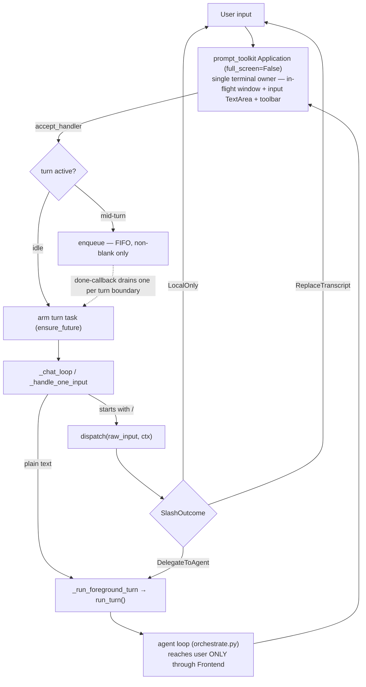

# Co CLI — TUI Layer (REPL, Slash Commands, Frontend)

> Turn execution and approval resumes: [core-loop.md](core-loop.md). Skill dispatch and expansion: [skills.md](skills.md). Reasoning/streaming surfaced per turn: [prompt-assembly.md](prompt-assembly.md). Session lifecycle: [sessions.md](sessions.md).

The TUI layer is the user-facing shell of the chat session. It owns the REPL loop, input
completion, slash-command dispatch, the terminal output surface, and the boundary between user
input and agent turns. The layer spans three modules: `co_cli/main.py` (loop and lifecycle),
`co_cli/commands/` (command registry and dispatch), and `co_cli/display/` (terminal output and
the `Frontend` contract).

## 1. Functional Architecture



| Component | Module | Role |
| --- | --- | --- |
| REPL loop, lifecycle, foreground-turn entry | `co_cli/main.py` | `_chat_loop`, `_handle_one_input`, `_enqueue`, `_build_status_snapshot`, the `chat` CLI command |
| Application factory, key bindings, turn-state holder | `co_cli/display/_app.py` | `build_repl_app`, `build_key_bindings`, `_ReplRuntime` (single owner of turn-task + input queue) |
| Slash-command registry and dispatch | `co_cli/commands/` | `dispatch`, `BUILTIN_COMMANDS`, `SlashCommand`, `CommandContext`, `SlashOutcome` variants |
| Frontend contract + terminal implementation | `co_cli/display/core.py` | `Frontend` protocol, `TerminalFrontend`, `render_to_ansi`, `StatusSnapshot`, `console` |
| No-op frontend for evals/tests | `co_cli/display/headless.py` | `HeadlessFrontend` — full protocol implementation, stores `last_status_snapshot` |
| Per-run streaming buffer | `co_cli/display/stream_renderer.py` | `StreamRenderer` — text/thinking buffering and flush policy |

A single `prompt_toolkit.Application` owns the inline terminal. Rich is demoted to a stateless
renderable→ANSI bridge (`render_to_ansi`): committed output is printed to scrollback via
`print_formatted_text(ANSI(...))`, and in-flight streaming renders into a `FormattedTextControl`
window updated by throttled `app.invalidate()`. `app.run_async()` is wrapped in `patch_stdout()`
so the incidental `console.print` sites reflow above the input.

### The Frontend Protocol is the seam

The modularization between the TUI and the agent is **three layers**, and the load-bearing
boundary between them is the `Frontend` Protocol (`co_cli/display/core.py`), not an ad-hoc
coupling. This seam is a deliberate design invariant — defend it, do not redesign it.

```
(a) TUI / REPL          owns the terminal and control flow
        ↑ (calls up through the protocol — agent never imports the TUI)
(b) Frontend Protocol   the contract: prompts + lifecycle callbacks
        ↑
(c) Agent loop          frontend-agnostic; reaches the user ONLY via Frontend
```

- **One surface to the user.** The orchestrator (`co_cli/context/orchestrate.py`) calls
  *exclusively* through its `Frontend` for everything user-facing — prompts (`prompt_question`,
  `prompt_approval`), tool lifecycle (`on_tool_start/complete`), status, final output, teardown.
  The two indirect paths are frontend-bound too: `deps.runtime.tool_progress_callback` and
  `status_callback` are closures over `frontend.on_tool_progress` / `on_status`. No other route.
- **Two implementations keep it honest.** `TerminalFrontend` (real) and `HeadlessFrontend`
  (`co_cli/display/headless.py`, no-op). The eval suite runs the *real* agent loop against the
  no-op frontend — that it works is the proof the agent is frontend-agnostic.
- **One-way rule** ([01-system.md](01-system.md): `main → bootstrap → agent → tools / …`): the
  agent never imports the TUI; it calls *up* through the protocol. Slash dispatch lives in the
  TUI and returns `LocalOnly` / `ReplaceTranscript` / `DelegateToAgent` — only the last crosses
  into the agent (§2).
- **Queue is above the agent, Frontend below.** The mid-turn input queue lives on `_ReplRuntime`
  (`co_cli/display/_app.py`); `orchestrate.py` never references it and runs one `user_input` per
  turn to completion. So the agent is queue-agnostic — sandwiched between two TUI-owned concerns,
  coupled to neither. This is the only async decoupling in-process, and it is deliberately
  REPL-internal (a bounded control buffer), not an event bus.
- **Guard rail:** a tool must never import `co_cli/display` to print. User-facing output goes
  through `tool_progress_callback` or `Frontend`; a direct `console`/`display` import is an
  upward-import error that silently breaks `HeadlessFrontend` (and evals).

## 2. Core Logic

### REPL Loop (`_chat_loop`)

`_chat_loop` is the async entry point for an interactive session. It initialises:
- `CoDeps` via `create_deps()`, which resolves all service handles, workspace paths, and config
- `deps.session.reasoning_display` set from the effective startup mode (CLI flag or config)
- a `FileHistory` persisted to `~/.co-cli/history.txt` and a completer seeded from
  `BUILTIN_COMMANDS` keys and user-invocable skill names
- the REPL `Application` via `build_repl_app(...)` (`co_cli/display/_app.py`), bound to the
  frontend via `frontend.bind_app(app)`; the loop then drives it with `await app.run_async()`
  inside `patch_stdout()`

The Application is event-driven, not a read-one-line loop. The input `TextArea`'s
`accept_handler` arms a turn task (`asyncio.ensure_future`) for an idle submission; a submission
arriving while a turn is active **enqueues** (FIFO, non-blank only) instead of being dropped.
The mid-turn append routes through a single `_enqueue(runtime, text, deps, on_status)` helper
(`co_cli/main.py`): blank-drop first (a blank never counts against the cap), then a bound check —
when `repl.queue_cap > 0` and the append would exceed it, drop per `repl.drop_policy`
(`"oldest"` pops the head then appends; `"newest"` rejects the incoming item, one notice either
way); `queue_cap == 0` is unbounded (the default). Each armed turn carries an `add_done_callback`
that drains the next queued item at the turn boundary — normal completion *and* `Esc`-cancel both
fire it — so the queue advances one item per turn. Turn state — the current turn-task reference,
the iteration state, and the input `queue` (`collections.deque[str]`) — has one owner,
`_ReplRuntime`, shared by the `accept_handler` and the key bindings. Queue depth + a truncated
head-item preview surface in the bottom toolbar (`{n} queued: "…"`, omitted at depth 0).
`/queue [list|clear|pop [n]]` inspects or prunes pending items; mid-turn it bypasses the queue and
runs via `runtime.schedule_control(...)` (it is a buffer op, not a turn). `exit`/`quit` and empty
input are handled inside `_handle_one_input`. A submission whose **entire** text resolves to
an existing image file (`detect_lone_image_path`, `co_cli/tools/vision/intake.py`) — the
drag-an-image-into-the-terminal gesture — is detected **before** slash dispatch (so a bare
absolute path, which starts with `/`, is honored rather than rejected as an unknown command;
collision-free because no slash command ends in an image suffix) and, for a vision-capable
model, the pixels are spliced into the user turn as `BinaryContent`; a blind model gets one
notice and runs text-only.

Interrupt handling (via key bindings):
- `Esc` while a turn is running: cancels the active turn task; its done-callback drains the next
  queued item, so `Esc` interrupts and advances the queue. The interrupted query is abandoned
  (not re-run). Idle: no-op.
- First Ctrl+C while idle: prints "Press Ctrl+C again to exit" and arms a 2 s window
- Second Ctrl+C within 2 seconds: exits (`app.exit()`)
- Ctrl+C is exit-only — it does **not** cancel the active turn (interrupt moved to `Esc`); a
  double-press exit tears the app down, which cancels any in-flight turn
- Ctrl+D (`eof`): exits

### Tab Completion

`_build_completer_words(skill_catalog)` is the single source of truth for completer content.
It returns `["/cmd" for cmd in BUILTIN_COMMANDS] + ["/name" for user_invocable skills]`.
The completer is rebuilt once after `create_deps()` resolves the skill registry. Subsequent
skill changes within the session (e.g. `/skills reload`) call `set_skill_catalog()` and the
completer is updated in-place on `ctx.completer`.

### Slash Command Dispatch (`dispatch`)

Input starting with `/` is routed through `dispatch(raw_input, ctx)`:

```
parse name = first token after "/"
parse args = remainder (empty string if none)

if name in BUILTIN_COMMANDS:
    result = await handler(ctx, args)
    if ReplaceTranscript  → return it
    if result is not None → return ReplaceTranscript(history=result)  # list[Any] path
    else                  → return LocalOnly()

elif name in skill_catalog:
    resolve body, inject $ARGUMENTS / $N / $0
    return DelegateToAgent(delegated_input=body, skill_env=..., skill_name=...)

else:
    print "unknown command" hint
    return LocalOnly()
```

Unknown commands print a hint and return `LocalOnly` — they do not reach the LLM.

Security: skill env vars blocked from overriding system paths (`PATH`, `PYTHONPATH`, `HOME`,
etc.) via `_SKILL_ENV_BLOCKED`. Skill content is scanned for `credential_exfil`,
`pipe_to_shell`, `destructive_shell`, and `prompt_injection` patterns before loading.

### Return Type Contract

| Return type | Handler returns | `dispatch` produces | Chat loop action |
|---|---|---|---|
| `LocalOnly` | `None` | `LocalOnly()` | Return to prompt |
| `ReplaceTranscript` | `ReplaceTranscript(history=...)` | same | Adopt new history |
| History list (legacy) | `list[Any]` | `ReplaceTranscript(history=list)` | Adopt new history |
| `DelegateToAgent` | N/A (skill path only) | `DelegateToAgent(...)` | Enter LLM turn |

All built-in command handlers return `None` or `ReplaceTranscript`. Returning `list[Any]` is
supported for backwards compatibility with a small number of older handlers (e.g. `_cmd_clear`).

### `CommandContext`

Every handler receives a `CommandContext` input bag:

```
CommandContext:
  message_history: list[Any]    — current REPL history
  deps: CoDeps                  — full runtime dependencies
  agent: Agent[CoDeps, ...]     — live agent (needed by LLM-backed commands)
  completer: Any | None         — live WordCompleter (for completer updates)
  frontend: Frontend | None     — terminal frontend for confirmation prompts
  input_queue: deque[str] | None — live REPL queue by reference (None outside REPL)
```

`deps.session` and `deps.runtime` are mutable throughout the session. Commands that update
session state (e.g. `/reasoning`, `/approvals`) write directly to `deps.session.*`.

### Interaction with `CoSessionState` and `CoRuntimeState`

`CoSessionState` fields are readable and writable by slash command handlers:
- `session_approval_rules` — managed by `/approvals`
- `session_todos` — managed by task-related commands
- `reasoning_display` — managed by `/reasoning`
- `background_tasks`, `google.drive_page_tokens` — managed by tool layer

`CoRuntimeState` fields are owned by the orchestration layer. Slash commands must not write
to `CoRuntimeState` — use `CoSessionState` for user-preference and cross-turn session state.

### `/reasoning` modes

`/reasoning` controls how model thinking/reasoning is surfaced in the terminal:

| Mode | Display behaviour |
|---|---|
| `off` | Thinking stream is silently dropped — no reasoning surface at all |
| `collapsed` | Default. A live transient `Thinking… Ns` header in the in-flight region; on thinking-end commits a single durable `Thought for Ns` line. The raw body is never shown |
| `full` | The `Thinking… Ns` header is shown with the raw thinking body streamed below it; the body + `Thought for Ns` footer are committed to scrollback |

co commits to scrollback line-by-line (not a retained-widget TUI), so reasoning cannot be
expanded after the fact — to read the raw reasoning, switch to `full`. The elapsed counter is
event-driven: it advances as thinking deltas arrive and freezes during model silence, while the
committed `Thought for Ns` is measured at thinking-end (wall-clock accurate). There is no
periodic ticker.

Usage:
- `/reasoning` — print current mode, no state change
- `/reasoning next` (or `cycle`) — advance through `off → collapsed → full → off`
- `/reasoning off|collapsed|full` — set directly

The mode is stored on `deps.session.reasoning_display` (a `CoSessionState` field, default
`"collapsed"`). It is read by `_execute_run()` at stream start via
`StreamRenderer(frontend, reasoning_display=deps.session.reasoning_display)`. Changes take
effect on the next turn; any in-flight stream uses the mode it started with. Delegation agent
turns inherit the mode via `fork_deps()`, which copies `base.session.reasoning_display` into the
child agent's `CoSessionState`.

`StreamRenderer` owns the mode, the thinking buffer, and the elapsed timing; it composes the
per-mode display string and feeds the dumb frontend surfaces `on_thinking_delta()` (transient
in-flight) and `on_thinking_commit()` (durable scrollback). `collapsed` feeds only the
`Thinking… Ns` / `Thought for Ns` header; `full` additionally streams and commits the raw body;
`off` emits nothing.

## 3. Config

| Setting | Env Var | Default | Description |
|---|---|---|---|
| `reasoning_display` | `CO_REASONING_DISPLAY` | `collapsed` | Initial reasoning display mode (`off`/`collapsed`/`full`); overridden by `--reasoning-display` CLI flag or `/reasoning` mid-session |
| `repl.queue_cap` | `CO_REPL_QUEUE_CAP` | `0` | Max pending mid-turn input-queue items (≥ 0); `0` = unbounded |
| `repl.drop_policy` | `CO_REPL_DROP_POLICY` | `"oldest"` | Drop policy when an enqueue exceeds `queue_cap`: `"oldest"` drops the head, `"newest"` rejects the incoming item. Inert at cap `0` |

The `--verbose` / `-v` CLI flag is an alias for `--reasoning-display full`.

## 4. Public Interface

### Dispatch API

| Symbol | Source | Contract |
|---|---|---|
| `dispatch(raw_input, ctx) -> SlashOutcome` | `co_cli/commands/core.py` | Async — parses `/<name> <args>`, routes to `BUILTIN_COMMANDS` or skill; falls back to unknown-command hint |
| `BUILTIN_COMMANDS: dict[str, SlashCommand]` | `co_cli/commands/registry.py` | Module-level registry of built-in slash commands |
| `SlashCommand` | `co_cli/commands/registry.py` | Dataclass — `name`, `handler`, `description`, `argument_hint`, `category` |
| `CommandContext` | `co_cli/commands/types.py` | Input bag passed to every handler — `message_history`, `deps`, `agent`, `completer`, `frontend`, `input_queue` (live REPL queue by reference, `None` outside REPL) |
| `SlashOutcome`, `LocalOnly`, `ReplaceTranscript(history)`, `DelegateToAgent(delegated_input, skill_env, skill_name)` | `co_cli/commands/types.py` | Handler return types signalling REPL action |
| `filter_namespace_conflicts(skill_catalog) -> dict` | `co_cli/commands/registry.py` | Drops skills whose names collide with `BUILTIN_COMMANDS` |
| `_build_completer_words(skill_catalog) -> list[str]` | `co_cli/commands/registry.py` | Returns `["/cmd" for cmd in BUILTIN_COMMANDS] + ["/name" for user-invocable skills]` |

### Frontend surface

| Symbol | Source | Contract |
|---|---|---|
| `Frontend` (Protocol) | `co_cli/display/core.py` | Display + interaction contract for the orchestration layer — streaming callbacks (`on_text_delta/commit`, `on_thinking_delta/commit`), tool lifecycle (`on_tool_start/progress/complete`), status (`on_status`, `update_status`, `clear_status`), `on_final_output`, `cleanup`, and the async interactive prompts `prompt_approval`, `prompt_question`, `prompt_confirm` |
| `TerminalFrontend` | `co_cli/display/core.py` | Single-owner terminal implementation: drives one `prompt_toolkit.Application` via `bind_app(app)`; streaming surfaces share one in-flight ANSI buffer; committed output prints to scrollback. Rich is used only as the `render_to_ansi` bridge |
| `HeadlessFrontend` | `co_cli/display/headless.py` | No-op frontend for evals and tests; stores `last_status_snapshot` for inspection; mirrors the async prompt signatures |
| `render_to_ansi(renderable, *, width) -> str` | `co_cli/display/core.py` | The sole Rich renderable→ANSI-string primitive; stateless, width supplied by the caller |
| `console`, `set_theme(name)`, `PROMPT_CHAR` | `co_cli/display/core.py` | Shared console instance, theme switcher, prompt glyph |
| `build_repl_app(...)`, `build_key_bindings(...)`, `_ReplRuntime` | `co_cli/display/_app.py` | Inline-REPL Application factory, Esc/Ctrl+C/Ctrl+D key bindings, and the single turn-state holder — holds the turn-task reference and the input `queue` |
| `StreamRenderer(frontend, reasoning_display)` | `co_cli/display/stream_renderer.py` | Per-run text/thinking buffering and flush policy |
| `QuestionPrompt(question, options, multiple)` | `co_cli/display/core.py` | Clarify-path prompt for tool-issued questions |
| `StatusSnapshot(session_label, mode, context_pct, background_task_count, approval_count, queue_depth=0, queue_head_preview=None)` | `co_cli/display/core.py` | Typed contract for bottom-toolbar footer content; pushed via `update_status` (which repaints via `_invalidate`); when `queue_depth > 0`, renders `{n} queued: "<preview>"` between `mode` and `ctx`; omitted at 0 |
| `TerminalFrontend.render_footer_toolbar()` | `co_cli/display/core.py` | Plain-text footer string consumed by the toolbar `Window` in the Application layout |
| `_build_status_snapshot(deps, mode, queue)` | `co_cli/main.py` | Assembles a `StatusSnapshot` from `CoDeps` at lifecycle push points; callers pass `runtime.queue` (or an empty `deque()` at startup) — both depth and head-item preview are derived inside |

### Slash command reference

All built-in commands registered in `BUILTIN_COMMANDS`:

| Command | Args | What it does | Returns |
|---|---|---|---|
| `/help` | — | List all slash commands with descriptions | `None` → `LocalOnly` |
| `/clear` | — | Clear conversation history | `list[]` → `ReplaceTranscript` |
| `/new` | — | Rotate session ID, start fresh | `list[]` → `ReplaceTranscript` |
| `/compact` | — | Summarise conversation via LLM to reduce context | `ReplaceTranscript` or `None` |
| `/resume` | `[session-id]` | Resume a past session by ID or via picker | `ReplaceTranscript` or `None` |
| `/sessions` | — | List past sessions with timestamps | `None` |
| `/history` | — | Show delegation history (sub-agents + background) | `None` |
| `/tools` | — | List registered agent tools with descriptions | `None` |
| `/filescope` | — | Show file search roots (read scope) and the workspace write anchor; flags missing roots | `None` |
| `/skills` | `[name]` | List loaded skills; show detail for named skill | `None` |
| `/memory` | `list\|count\|forget\|dream\|restore\|decay-review\|stats [args] [flags]` | Manage memory items; dream lifecycle details live in [dream.md](dream.md) | `None` |
| `/approvals` | `list\|clear\|...` | View and manage session approval rules | `None` |
| `/background` | `<command>` | Run a shell command in the background | `None` |
| `/tasks` | `[status-filter \| task-id]` | List background tasks; pass a 12-hex-char task ID to show detail | `None` |
| `/cancel` | `<task-id>` | Cancel a running background task | `None` |
| `/write` | `<task-id> <input>` | Write a line to a running background task's stdin (first token = id; remainder verbatim + newline) to answer an interactive prompt | `None` |
| `/queue` | `[list\|clear\|pop [n]]` | Inspect or prune pending REPL input-queue items; mid-turn bypass runs immediately without enqueueing | `None` |
| `/reasoning` | `[off\|collapsed\|full\|next]` | Show or set reasoning display mode (see §2) | `None` |
| `/usage` | `[week\|month\|total]` | Show token usage: no arg = current session totals (daemon excluded); a window shows a Session / Daemon / Total split with a distinct-session count | `None` |
| `/status` | — | Consolidated current-state snapshot in six sections (Session, Model & context, Dream, Work in flight, Capabilities, Degraded); read-only, no model call, each section degrades to a placeholder if its source is unreadable | `None` |

## 5. Files

| File | Purpose |
|---|---|
| `co_cli/main.py` | REPL loop (`_chat_loop`), foreground turn entry, `_enqueue`, `_build_status_snapshot`, `chat` CLI command |
| `co_cli/commands/core.py` | Slash-command `dispatch()` |
| `co_cli/commands/status.py` | `/status` handler — consolidated current-state snapshot assembled from `deps` + cheap local reads |
| `co_cli/commands/registry.py` | `BUILTIN_COMMANDS` dict, `SlashCommand` dataclass, `filter_namespace_conflicts`, completer helpers |
| `co_cli/commands/types.py` | `CommandContext`, `SlashOutcome`, `LocalOnly`, `ReplaceTranscript`, `DelegateToAgent`, `_confirm` |
| `co_cli/display/core.py` | `Frontend` protocol, `TerminalFrontend`, `render_to_ansi`, `StatusSnapshot`, `QuestionPrompt`, `console`, `set_theme`, `PROMPT_CHAR` |
| `co_cli/display/_app.py` | `build_repl_app`, `build_key_bindings`, `_ReplRuntime` — the single-owner inline-REPL Application factory |
| `co_cli/display/headless.py` | `HeadlessFrontend` — full `Frontend` protocol implementation for evals and tests |
| `co_cli/display/stream_renderer.py` | `StreamRenderer` — text/thinking buffering and flush policy per run |
| `co_cli/deps.py` | `CoSessionState` (user-preference + tool-visible state), `CoRuntimeState` (orchestration state) |
| `co_cli/config/core.py` | `VALID_REASONING_DISPLAY_MODES`, `DEFAULT_REASONING_DISPLAY`, mode constants |
| `co_cli/skills/skill_types.py` | `SkillInfo` — skill metadata including body, env vars, invocability flags |

## 6. Test Gates

| Property | Test file |
|---|---|
| Plain text routes to a foreground turn; `/`-input routes to `dispatch` | `tests/test_flow_chat_loop.py` |
| Idle submission arms a turn task (`accept_handler`) | `tests/test_flow_chat_loop.py` |
| Typed-ahead mid-turn enqueues and drains FIFO | `tests/test_flow_chat_loop.py`, `tests/integration/test_repl_input_queue.py` |
| Blank input never enqueues (and never counts against the cap) | `tests/test_flow_chat_loop.py` |
| `queue_cap` with `oldest` drops the head; `newest` rejects the incoming item; cap `0` is unbounded | `tests/test_flow_chat_loop.py` |
| `Esc` cancels the active turn and the done-callback advances the queue | `tests/test_flow_chat_loop.py` |
| Ctrl+C is exit-only via double-press (does not cancel the active turn); outside-window press resets the timer; Ctrl+D exits | `tests/test_flow_chat_loop.py` |
| `/queue` mid-turn bypasses the queue and runs immediately | `tests/test_flow_chat_loop.py`, `tests/test_flow_queue_command.py` |
| `/queue list\|pop [n]\|clear` inspects/prunes; out-of-range pop and empty-queue clear are no-ops; non-integer arg is a usage error | `tests/test_flow_queue_command.py` |
| Real agent turn renders under the single owned `Application` | `tests/integration/test_repl_terminal_owner.py` |
| Unknown command returns `LocalOnly` (never reaches the LLM) | `tests/test_flow_slash_dispatch.py` |
| Skill dispatch returns `DelegateToAgent` carrying `skill_env` + `skill_name` | `tests/test_flow_slash_dispatch.py`, `tests/test_flow_skill_creator_dispatch.py` |
| Positional (`$N`/`$0`) and `$ARGUMENTS` injection; no-args body unchanged; 10-arg expansion does not smash | `tests/test_flow_slash_dispatch.py` |
| A built-in name cannot be shadowed by a skill | `tests/test_flow_slash_dispatch.py` |
| Blocked skill env keys (`PATH`, `HOME`, …) filtered at load | `tests/test_flow_slash_dispatch.py` |
| In-flight buffer set on text delta and cleared on commit; thinking commit erases in-flight then commits final | `tests/test_display.py` |
| `collapsed` commits a `Thought for Ns` timer line but not the raw body; `full` commits body + timer; `off` emits no reasoning surface; generic status line persists to scrollback on supersession | `tests/test_display.py` |
| `update_status` repaints (invalidates) the bound app | `tests/test_display.py` |
| Footer toolbar renders all fields; omits ctx/bg/approval/queue when zero; pluralises approvals; renders queue depth + preview | `tests/test_display.py` |
| `StatusSnapshot` assembly from `CoDeps`: session label from path stem, context pct from realtime estimate, queue head preview populated/truncated/none, counts reflect session state | `tests/test_display.py` |
| Approval subject scoping (shell/file-write/web-fetch/unknown); remember-then-auto-approve; cross-tool same-directory rule match | `tests/test_flow_approval_subject.py` |
| Clarify deferred-approval routing and resume returning answers as tool output | `tests/test_flow_approval_subject.py` |
